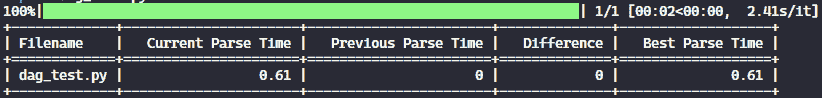
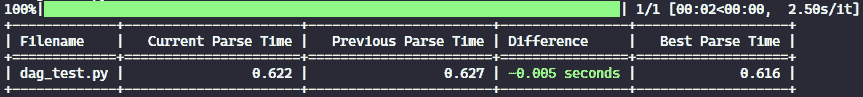
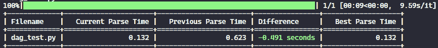
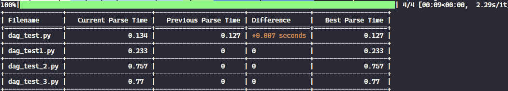
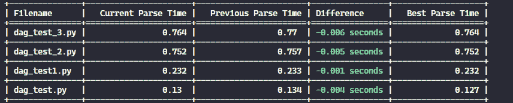
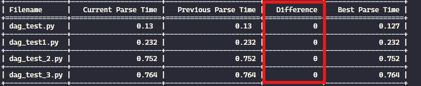

# 停止创建糟糕的 DAGs – 通过改进 Python 代码优化您的 Airflow 环境

> 原文：[`towardsdatascience.com/stop-creating-bad-dags-optimize-your-airflow-environment-by-improving-your-python-code-146fcf4d27f7/`](https://towardsdatascience.com/stop-creating-bad-dags-optimize-your-airflow-environment-by-improving-your-python-code-146fcf4d27f7/)


由 [Dan Roizer](https://unsplash.com/@danroizer?utm_source=medium&utm_medium=referral) 在 [Unsplash](https://unsplash.com?utm_source=medium&utm_medium=referral) 上拍摄的照片

Apache Airflow 是数据领域最受欢迎的编排工具之一，为全球的公司提供工作流程支持。然而，任何在生产环境中使用过 Airflow 的人，尤其是在复杂环境中，都知道它有时会呈现一些问题和奇怪的错误。

在 Airflow 环境中需要管理的许多方面中，一个关键的指标往往被忽视：**DAG 解析时间**。监控和优化解析时间对于避免性能瓶颈和确保编排的正确运行至关重要，正如我们将在本文中探讨的那样。

话虽如此，本教程旨在介绍 **`[airflow-parse-bench](https://github.com/AlvaroCavalcante/airflow-parse-bench)`**，这是一个开源工具，我开发它来帮助数据工程师监控和优化他们的 Airflow 环境，提供洞察以减少代码复杂性和解析时间。

## 为什么解析时间很重要

关于 Airflow，DAG 解析时间通常是一个 **被忽视的指标**。解析发生在每次 Airflow 处理您的 Python 文件以动态构建 DAGs 时。

默认情况下，所有您的 DAGs 每隔 30 秒都会被解析一次 – 这个频率由配置变量 _[min_file_process_interval](https://airflow.apache.org/docs/apache-airflow/stable/configurations-ref.html#min-file-process-interval)_ 控制。这意味着每隔 30 秒，都会读取、导入并处理您 `dags` 文件夹中存在的所有 Python 代码，以生成包含待调度任务的 DAG 对象。成功处理的文件随后会被添加到 [DAG Bag](https://airflow.apache.org/docs/apache-airflow/stable/_api/airflow/models/dagbag/index.html) 中。

两个关键的 Airflow 组件处理这个过程：

+   *[DagFileProcessorManager](https://airflow.apache.org/docs/apache-airflow/stable/authoring-and-scheduling/dagfile-processing.html)*：检查哪些文件需要被处理。

+   *[DagFileProcessorProcess](https://airflow.apache.org/docs/apache-airflow/stable/authoring-and-scheduling/dagfile-processing.html)*：执行实际的文件解析。

两个组件（通常称为**dag 处理器**）一起由 Airflow [调度器](https://airflow.apache.org/docs/apache-airflow/stable/administration-and-deployment/scheduler.html)执行，确保在触发之前更新你的 DAG 对象。然而，出于可扩展性和安全性的原因，也可以将你的 dag 处理器作为集群中的独立组件运行。

如果你的环境只有几十个 DAG，解析过程不太可能引起任何问题。然而，在具有数百甚至数千个 DAG 的生产环境中，这是常见的。在这种情况下，如果你的解析时间过高，可能会导致：

+   延迟 DAG 调度。

+   提高资源利用率。

+   环境心跳问题。

+   调度器故障。

+   过度使用 CPU 和内存，浪费资源。

> 现在，想象一下拥有包含不必要复杂解析逻辑的数百个 DAG 的环境。小的低效很快就会变成重大问题，影响整个 Airflow 设置的稳定性和性能。

## 如何编写更好的 DAG？

在编写 Airflow DAG 时，有一些重要的最佳实践需要记住，以创建优化的代码。尽管你可以找到很多关于如何改进你的 DAG 的教程，但我将总结一些可以显著提高你的 DAG 性能的关键原则。

### 限制顶层代码。

高 DAG 解析时间最常见的原因之一是不高效或复杂的顶层代码。在 Airflow DAG 文件中的顶层代码每次调度器解析文件时都会被执行。如果这段代码包含资源密集型操作，例如数据库查询、API 调用或动态任务生成，它可能会显著影响解析性能。

以下代码展示了**非优化 DAG**的示例：

在这种情况下，每次调度器解析文件时，都会执行顶层代码，进行 API 请求并处理 DataFrame，这可能会显著影响解析时间。

导致慢速解析的另一个重要因素是顶层导入。在解析期间，每个在顶层导入的库都会被加载到内存中，这可能很耗时。为了避免这种情况，你可以将导入移动到函数或任务定义中。

以下代码展示了同一 DAG 的更好版本：

### 避免在顶层代码中使用 Xcoms 和变量。

仍然在谈论相同的话题，特别有趣的是避免在顶层代码中使用 Xcoms 和变量。正如 [Google 文档](https://cloud.google.com/blog/products/data-analytics/reduce-airflow-dag-parse-times-in-cloud-composer)所述：

> 如果你正在顶层代码中使用 Variable.get()，每次解析 .py 文件时，Airflow 都会执行一个 Variable.get()，这会打开到数据库的会话。这可能会显著减慢解析时间。

为了解决这个问题，考虑使用**JSON 字典**在单个数据库查询中检索多个变量，而不是多次调用`Variable.get()`。或者使用**Jinja 模板**，因为通过这种方式检索的变量仅在任务执行期间处理，而不是在 DAG 解析期间。

### 删除不必要的 DAG

虽然这看起来很明显，但定期清理环境中不必要的 DAG 和文件始终很重要：

+   **删除未使用的 DAG**：检查你的`dags`文件夹，并删除任何不再需要的文件。

+   **使用`.airflowignore`**：指定 Airflow 应该有意忽略的文件，跳过解析。

+   **审查暂停的 DAG**：暂停的 DAG 仍然会被调度器解析，消耗资源。如果它们不再需要，考虑删除或存档它们。

### 修改 Airflow 配置

最后，你可以修改一些 Airflow 配置以减少调度器资源的使用：

+   **`min_file_process_interval`**: 这个设置控制了 Airflow 多久（以秒为单位）解析你的 DAG 文件。将其从默认的 30 秒增加可以减少调度器的负载，但会以较慢的 DAG 更新为代价。

+   **`dag_dir_list_interval`**: 这个参数决定了 Airflow 多久（以秒为单位）扫描`dags`目录以查找新的 DAG。如果你不经常部署新的 DAG，考虑增加这个间隔以减少 CPU 使用。

## 如何测量 DAG 解析时间？

我们讨论了很多关于创建优化 DAG 以维护健康 Airflow 环境的重要性。但你是如何实际测量你的 DAG 的解析时间的呢？幸运的是，有几种方法可以做到这一点，具体取决于你的 Airflow 部署或操作系统。

例如，如果你有一个[Cloud Composer](https://cloud.google.com/composer?hl=en)部署，你可以在 Google CLI 上执行以下命令来轻松检索 DAG 解析报告：

```py
gcloud composer environments run $ENVIRONMENT_NAME 
 - location $LOCATION 
 dags report
```

虽然检索解析指标很简单，但测量代码优化的有效性可能不那么简单。每次你修改代码时，你都需要将更新的 Python 文件重新部署到你的云提供商，等待 DAG 被解析，然后提取一个新的报告——这是一个缓慢且耗时的过程。

另一种可能的方法，如果你使用 Linux 或 Mac，可以在你的机器上运行以下命令来本地测量解析时间：

```py
time python airflow/example_dags/example.py
```

然而，虽然这个方法很简单，但它对于系统地测量和比较多个 DAG 的解析时间来说并不实用。

> 为了解决这些挑战，我创建了**`airflow-parse-bench`**，这是一个 Python 库，它简化了使用 Airflow 的本地解析方法来测量和比较你的 DAGs 的解析时间。

## 测量和比较你的 DAG 的解析时间

**`[airflow-parse-bench](https://github.com/AlvaroCavalcante/airflow-parse-bench)`**工具使得存储解析时间、比较结果以及跨你的 DAGs 标准化比较变得容易。

### 安装库

在安装之前，建议使用[virtualenv](https://docs.python.org/3/library/venv.html)来避免库冲突。一旦设置好，你可以通过运行以下命令来安装包：

```py
pip install airflow-parse-bench
```

**注意：**此命令仅安装基本依赖项（与 Airflow 和 Airflow 提供者相关）。你必须手动安装你的 DAG 所依赖的任何其他库。

例如，如果一个 DAG 使用`boto3`与 AWS 交互，确保`boto3`已安装在你的环境中。否则，你将遇到解析错误。

之后，你需要初始化你的 Airflow 数据库。这可以通过执行以下命令来完成：

```py
airflow db init
```

此外，如果你的 DAG 使用**Airflow 变量**，你必须在本地定义它们。然而，不需要在你的变量上放置真实值，因为实际值对于解析目的不是必需的：

```py
airflow variables set MY_VARIABLE 'ANY TEST VALUE'
```

如果没有这个，你将遇到如下错误：

```py
error: 'Variable MY_VARIABLE does not exist'
```

### 使用工具

安装库后，你可以开始测量解析时间。例如，假设你有一个名为`dag_test.py`的 DAG 文件，其中包含上述示例中使用的未优化 DAG 代码。

要测量其解析时间，只需运行以下命令：

```py
airflow-parse-bench --path dag_test.py
```

此次执行生成了以下输出：



执行结果。图片由作者提供。

如观察到的，我们的 DAG 的解析时间为**0.61 秒**。如果我再次运行该命令，我会看到一些小的差异，因为由于系统和环境因素的影响，解析时间可能会在运行之间略有变化：



同一 DAG 的另一次执行结果。图片由作者提供。

为了呈现一个更简洁的数字，可以通过指定迭代次数来聚合多次执行：

```py
airflow-parse-bench --path dag_test.py --num-iterations 5
```

虽然完成时间稍长，但这计算了五次执行的平均解析时间。

现在，为了评估上述优化的影响，我将`dag_test.py`中的代码替换为之前共享的优化版本。执行相同的命令后，我得到了以下结果：



优化代码的解析结果。图片由作者提供。

如注意到的，仅仅应用一些良好的实践就能将 DAG 解析时间减少近**0.5 秒**，突出了我们做出的改变的重要性！

## 进一步探索工具

有其他我认为相关的有趣特性。

作为提醒，如果你在使用工具时有任何疑问或问题，你可以访问 GitHub 上的完整文档[GitHub](https://github.com/AlvaroCavalcante/airflow-parse-bench)。

此外，要查看库支持的所有参数，只需运行以下命令：

```py
airflow-parse-bench --help
```

### 测试多个 DAG

在大多数情况下，您可能需要测试数十个 DAG 的解析时间。为了应对这一用例，我创建了一个名为 `dags` 的文件夹，并在其中放入了四个 Python 文件。

要测量文件夹中所有 DAG 的解析时间，只需在 `--path` 参数中指定文件夹路径：

```py
airflow-parse-bench --path my_path/dags
```

运行此命令将生成一个表格，总结文件夹中所有 DAG 的解析时间：



测试多个 DAG 的解析时间。图片由作者提供。

默认情况下，表格按从快到慢的 DAG 排序。但是，您可以使用 `--order` 参数来反转顺序：

```py
airflow-parse-bench --path my_path/dags --order desc
```



倒序排序。图片由作者提供。

### 跳过未更改的 DAG

`--skip-unchanged` 参数在开发期间特别有用。正如其名所示，此选项跳过自上次执行以来未修改的 DAG 的解析执行：

```py
airflow-parse-bench --path my_path/dags --skip-unchanged
```

如下所示，当 DAG 保持不变时，输出反映了解析时间的无差异：



对于未更改的文件，输出无差异。图片由作者提供。

### 重置数据库

所有 DAG 信息，包括指标和历史记录，都存储在本地 SQLite 数据库中。如果您想清除所有存储的数据并从头开始，请使用 `--reset-db` 标志：

```py
airflow-parse-bench --path my_path/dags --reset-db
```

此命令重置数据库并处理 DAG，就像它是第一次执行一样。

## 结论

解析时间是维护可扩展和高效 Airflow 环境的重要指标，尤其是在您的编排需求变得越来越复杂时。

因此，**`[airflow-parse-bench](https://github.com/AlvaroCavalcante/airflow-parse-bench)`** 库可以成为帮助数据工程师创建更好的 DAG 的重要工具。通过在本地测试 DAG 的解析时间，您可以轻松快速地找到代码瓶颈，使您的 DAG 更快、性能更优。

由于代码是在本地执行的，产生的解析时间可能不会与您 Airflow 集群中的相同。然而，如果您能够在本地机器上减少解析时间，相同的改进也可能在您的云环境中实现。

最后，这个项目对协作开放！如果您有建议、想法或改进，请随时在 [GitHub](https://github.com/AlvaroCavalcante/airflow-parse-bench) 上贡献。

## 参考文献

> [**最大化 Cloud Composer 的好处并减少解析时间 | Google Cloud 博客**](https://cloud.google.com/blog/products/data-analytics/reduce-airflow-dag-parse-times-in-cloud-composer)
> 
> [**通过更好的 Airflow DAG 优化 Cloud Composer | Google Cloud 博客**](https://cloud.google.com/blog/products/data-analytics/optimize-cloud-composer-via-better-airflow-dags)
> 
> [**调度器 – Airflow 文档**](https://airflow.apache.org/docs/apache-airflow/stable/administration-and-deployment/scheduler.html#fine-tuning-your-scheduler-performance)
> 
> [**最佳实践 – Airflow 文档**](https://airflow.apache.org/docs/apache-airflow/stable/best-practices.html#reducing-dag-complexity)
> 
> [**GitHub – AlvaroCavalcante/airflow-parse-bench: 停止创建糟糕的 DAG！使用此工具来测量和…**](https://github.com/AlvaroCavalcante/airflow-parse-bench)
