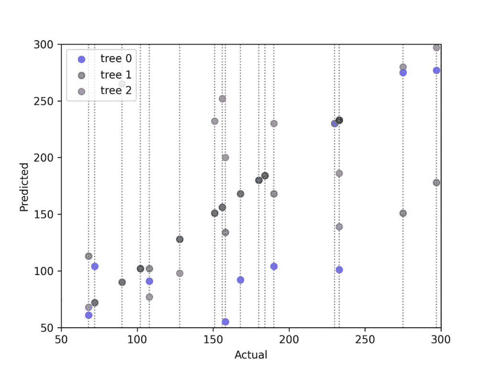
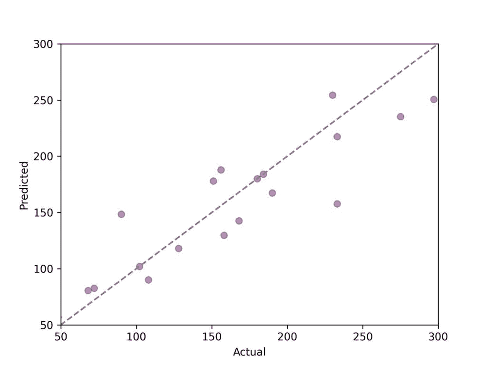
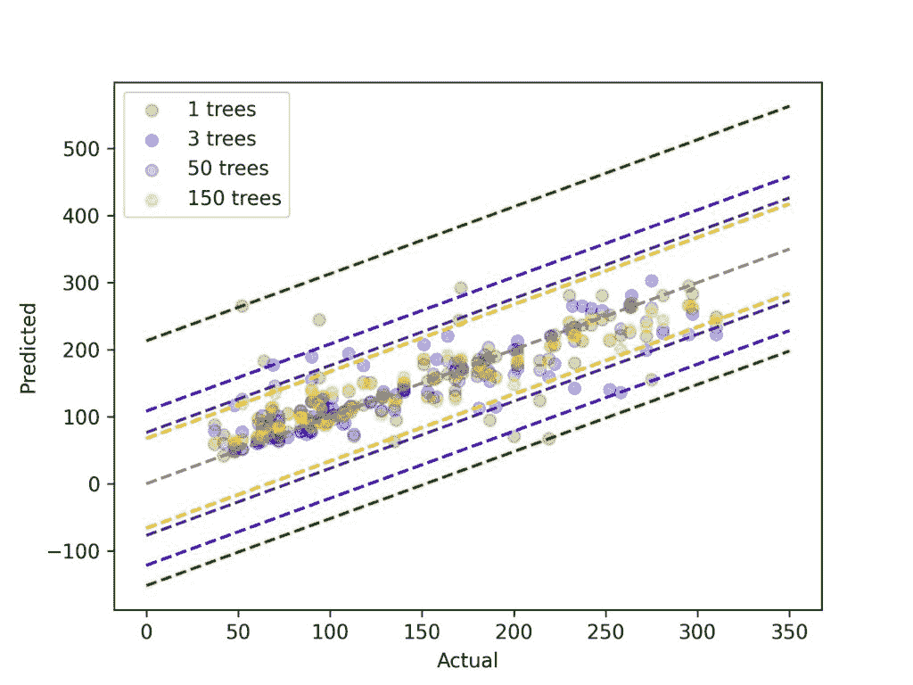
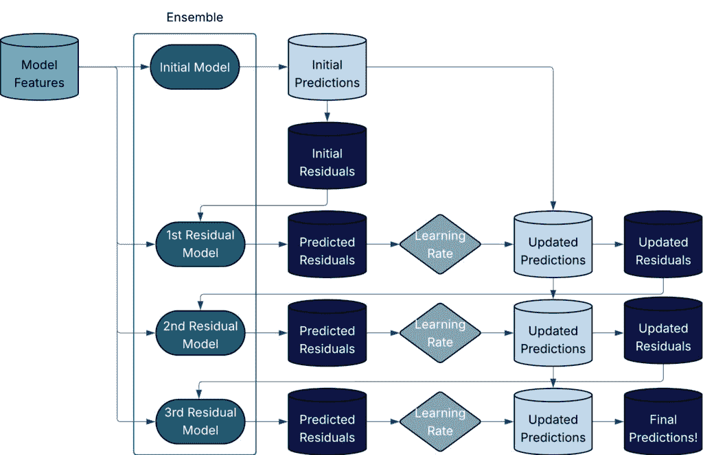
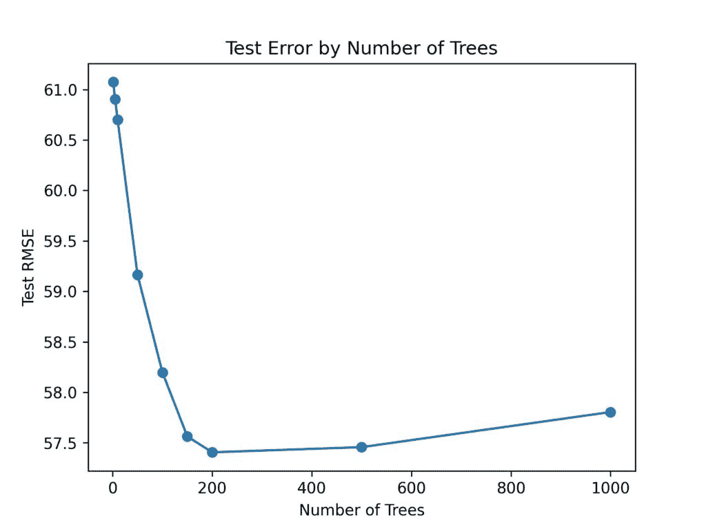
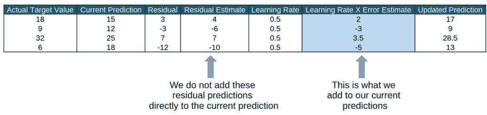
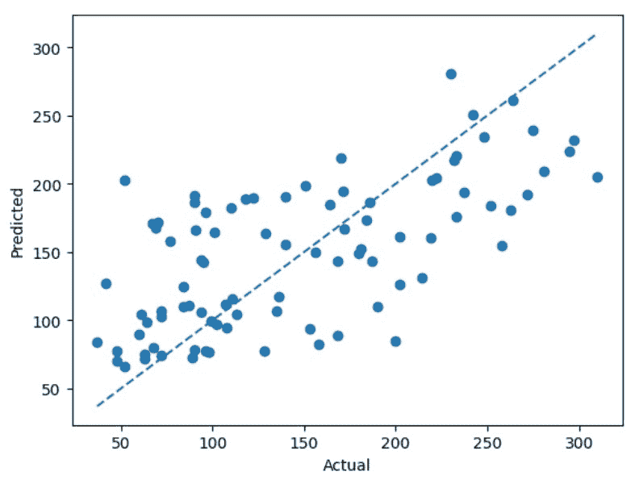
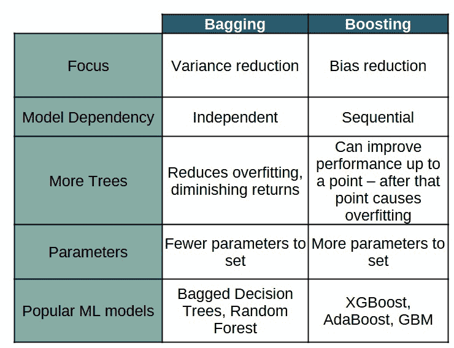

# 数量优势：使用 Bagging 和 Boosting 集成模型

> [原文：https://towardsdatascience.com/strength-in-numbers-ensembling-models-with-bagging-and-boosting/](https://towardsdatascience.com/strength-in-numbers-ensembling-models-with-bagging-and-boosting/)

<mdspan datatext="el1747271955507" class="mdspan-comment">Bagging</mdspan> 和 Boosting 是机器学习中的两种强大集成技术 – 对于数据科学家来说是必须了解的！阅读完这篇文章后，你将会有一个扎实的理解，了解 Bagging 和 Boosting 的工作原理以及何时使用它们。我们将涵盖以下主题，并大量使用示例来提供关键概念的动手演示：

+   集成如何帮助创建强大的模型

+   Bagging：为 ML 模型增加稳定性

+   Boosting：减少弱学习者的偏差

+   Bagging 与 Boosting – 何时使用每种方法及其原因

## 通过集成创建强大的模型

在机器学习中，**集成**是一个广泛的概念，指的是通过结合多个模型的预测来创建预测的任何技术。如果涉及多个模型进行预测，则该技术正在使用集成！

集成方法通常可以提高单个模型的表现。集成可以帮助减少：

+   通过平均多个模型来减少方差

+   通过迭代改进错误来减少偏差

+   由于使用多个模型可以增加对虚假关系的鲁棒性，因此可能会出现过度拟合

Bagging 和 Boosting 都是比它们的单模型对应物表现更好的集成方法。现在让我们深入了解这些方法的细节！

## Bagging：为 ML 模型增加稳定性

Bagging 是一种特定的集成技术，用于减少预测模型的方差。在这里，我谈论的是机器学习意义上的方差，即模型随着训练数据集的变化而变化的程度，而不是统计意义上的方差，后者衡量分布的分散程度。因为 Bagging 有助于减少 ML 模型的方差，它通常可以改善高方差模型（例如决策树和 KNN），但对于低方差模型（例如线性回归）则帮助不大。

现在我们已经了解了 ***何时*** Bagging 有助于（高方差模型），让我们深入了解其内部工作原理，以了解 ***如何*** 它有助于！Bagging 算法本质上是迭代的 – 它通过重复以下三个步骤来构建多个模型：

1.  从原始训练数据中生成数据集的 Bootstrap

1.  在 Bootstrap 数据集上训练模型

1.  保存训练好的模型

在此过程中创建的模型集合被称为集成。当需要做出预测时，集成中的每个模型都会做出自己的预测 – 最终的 Bagging 预测是所有集成预测的平均值（对于回归）或多数投票（对于分类）。

现在我们已经了解了袋装法的原理，让我们花几分钟时间来建立对它为何有效的感觉。我们将借鉴传统统计学中的一个熟悉概念：通过抽样来估计总体均值。

在统计学中，从分布中抽取的每个样本都是一个随机变量。小样本量往往具有高方差，可能无法很好地估计真实均值。但随着我们收集更多的样本，这些样本的平均值将更好地近似总体均值。

同样，我们可以将我们的每个单独的决策树视为一个随机变量——毕竟，每棵树都是在数据的不同随机样本上训练的！通过平均许多树的预测，袋装减少了方差，并产生了一个更好地捕捉数据中真实关系的集成模型。

**袋装示例**

我们将使用 scikit-learn Python 包中的 load_diabetes¹数据集来展示一个简单的袋装示例。该数据集有 10 个输入变量——年龄、性别、BMI、血压和 6 种血液血清水平（S1-S6）。以及一个单一的输出变量，它是疾病进展的测量。下面的代码将导入我们的数据并进行一些非常简单的清理。在建立了我们的数据集后，让我们开始建模！

```py
# pull in and format data
from sklearn.datasets import load_diabetes

diabetes = load_diabetes(as_frame=True)
df = pd.DataFrame(diabetes.data, columns=diabetes.feature_names)
df.loc[:, 'target'] = diabetes.target
df = df.dropna()
```

在我们的例子中，我们将使用基本的决策树作为袋装的基模型。让我们首先验证我们的决策树确实是高方差。我们将通过在不同的自助数据集上训练三个决策树，并观察测试数据集预测的方差来做这件事。下面的图表显示了同一测试数据集上三个不同决策树的预测。每条虚线代表测试数据集的一个单独观察值。每条线上的三个点是从三个不同的决策树得到的预测。



测试数据点的决策树方差 - 图片由作者提供

在上面的图表中，我们看到当在自助数据集上训练时，单个树可以给出非常不同的预测（每条垂直线上的三个点的分布）。这就是我们一直在谈论的方差！

现在我们看到我们的树对训练样本的鲁棒性不是很强——让我们通过平均预测来查看袋装法如何有所帮助！下面的图表显示了三棵树的平均预测。对角线代表完美的预测。正如你所见，通过袋装，我们的点更加紧密且更集中在对角线周围。



图片由作者提供

我们已经通过仅仅三棵树的平均预测看到了模型的重要改进。让我们通过增加更多的树来增强我们的袋装算法！

下面是用于袋装任意数量树的代码：

```py
def train_bagging_trees(df, target_col, pred_cols, n_trees):

    '''
        Creates a decision tree bagging model by training multiple 
        decision trees on bootstrapped data.

        inputs
            df (pandas DataFrame) : training data with both target and input columns
            target_col (str)      : name of target column
            pred_cols (list)      : list of predictor column names
            n_trees (int)         : number of trees to be trained in the ensemble

        output:
            train_trees (list)    : list of trained trees

    '''

    train_trees = []

    for i in range(n_trees):

        # bootstrap training data
        temp_boot = bootstrap(train_df)

        #train tree
        temp_tree = plain_vanilla_tree(temp_boot, target_col, pred_cols)

        # save trained tree in list
        train_trees.append(temp_tree)

    return train_trees

def bagging_trees_pred(df, train_trees, target_col, pred_cols):

    '''
        Takes a list of bagged trees and creates predictions by averaging 
        the predictions of each individual tree.

        inputs
            df (pandas DataFrame) : training data with both target and input columns
            train_trees (list)    : ensemble model - which is a list of trained decision trees
            target_col (str)      : name of target column
            pred_cols (list)      : list of predictor column names

        output:
            avg_preds (list)      : list of predictions from the ensembled trees       

    '''

    x = df[pred_cols]
    y = df[target_col]

    preds = []
    # make predictions on data with each decision tree
    for tree in train_trees:
        temp_pred = tree.predict(x)
        preds.append(temp_pred)

    # get average of the trees' predictions
    sum_preds = [sum(x) for x in zip(*preds)]
    avg_preds = [x / len(train_trees) for x in sum_preds]

    return avg_preds 
```

上面的函数非常简单，第一个用于训练袋装集成模型，第二个则接收集成（简单地说就是训练好的树列表）并根据数据集做出预测。

在我们的代码建立之后，让我们运行多个集成模型，看看随着树的数量增加，我们的袋外预测如何变化。



以袋装树的数量着色的袋外预测与实际值——图片由作者提供

承认，这个图表看起来有点疯狂。不要过于纠结于所有单个数据点，虚线表示的是主要故事！这里我们有 1 个基本的决策树模型和 3 个袋装决策树模型——分别有 3、50 和 150 棵树。彩色虚线标记了每个模型残差的上下范围。这里有两个主要的结论：（1）随着我们添加更多的树，残差的范围缩小；（2）添加更多树的收益是递减的——当我们从 1 棵树增加到 3 棵树时，我们看到范围大幅缩小，当我们从 50 棵树增加到 150 棵树时，范围仅略微收紧。

现在我们已经成功完成了一个完整的袋装法示例，我们即将进入提升法！让我们快速回顾一下本节中我们涵盖了哪些内容：

1.  袋装法通过平均多个单个模型的预测来降低机器学习模型的方差

1.  袋装法对高方差模型最有帮助

1.  我们袋装的模型越多，集成模型的方差就越低——但方差降低的收益是递减的

好的，让我们继续学习提升法！

## 提升法：降低弱学习者的偏差

使用袋装法，我们创建了多个独立的模型——模型的独立性有助于平均化单个模型的噪声。提升法也是一种集成技术；类似于袋装法，我们将训练多个模型……但与袋装法非常不同，我们训练的模型将是**依赖**的。提升法是一种建模技术，它首先训练一个初始模型，然后依次训练额外的模型以改进先前模型的预测。提升法的主要目标是减少偏差——尽管它也可以帮助减少方差。

我们已经确定提升法迭代地改进预测——让我们深入了解其方法。提升算法可以通过两种方式迭代地改进模型预测：

1.  直接预测最后一个模型的残差并将其添加到先前预测中——将其视为残差校正

1.  给先前模型预测不佳的观察结果增加更多权重

由于提升法的主要目标是减少偏差，它适用于通常具有更多偏差的基础模型（例如，浅层决策树）。在我们的例子中，我们将使用浅层决策树作为我们的基础模型——为了简洁起见，我们将在本文中仅涵盖残差预测方法。让我们直接进入提升法示例！

**预测先前残差**

剩余预测方法从初始模型开始（一些算法提供常数，其他算法使用基模型的单次迭代）并计算该初始预测的残差。集成中的第二个模型预测第一个模型的残差。有了我们的残差预测，我们将残差预测添加到初始预测中（这给出了修正后的残差预测）并重新计算更新的残差……我们继续这个过程，直到我们创建了指定的基模型数量。这个过程相当简单，但只用文字解释有点困难——下面的流程图显示了简单的 4 模型 boosting 算法。



简单的 4 模型 boosting 算法流程图——图片由作者提供

当进行 boosting 时，我们需要设置三个主要参数：（1）树的数量，（2）树的深度和（3）学习率。我现在将花一点时间讨论这些输入。

**树的数量**

对于 boosting 来说，树的数量与 bagging 中的含义相同——即，将用于集成训练的总树数。但是，与 boosting 不同，我们**不应该**倾向于更多的树！下面的图表显示了针对糖尿病数据集的测试 RMSE 与树的数量之间的关系。



与 bagging 不同，在 boosting 中，树太多会导致过拟合！——图片由作者提供

这表明，随着树的数量增加到大约 200 棵时，测试 RMSE 迅速下降，然后开始缓慢上升。这看起来像是一个经典的“过拟合”图表——我们达到一个点，更多的树对模型来说变得更糟。这是 bagging 和 boosting 之间的一个关键区别——在 bagging 中，更多的树最终会*停止帮助*，而在 boosting 中，更多的树最终会*开始伤害*！

> 在 bagging 中，更多的树最终会***停止帮助***，而在 boosting 中，更多的树最终会***开始伤害***！

我们现在知道，树太多和树太少都是不好的。我们将使用超参数调整来选择树的数量。注意——超参数调整是一个很大的主题，并且超出了本文的范围。我将在稍后用我们的示例演示一个简单的网格搜索，包括训练集和测试集。

**树的最大深度**

这是集成中每个树的最大深度。在 bagging 中，树通常可以无限深入，因为我们正在寻找低偏差、高方差模型。然而，在 boosting 中，我们使用顺序模型来解决基学习器的偏差——所以我们并不那么关心生成低偏差的树。我们如何决定最大深度？与树的数量一样，我们将使用超参数调整技术。

**学习率**

树的数量和树深度是来自 bagging（尽管在 bagging 中我们通常不对树深度设置限制）的熟悉参数 – 但这个“学习率”特性是一个新面孔！让我们花点时间熟悉一下。学习率是一个介于 0 和 1 之间的数字，在将其添加到整体预测之前，它会乘以当前模型的残差预测。

这里有一个使用学习率为 0.5 的预测计算的简单示例。一旦我们理解了学习率如何工作的机制，我们将讨论为什么学习率很重要。



学习率在更新实际目标预测之前会折扣残差预测 – 图片由作者提供

那么，我们为什么要对我们的残差预测进行“折扣”，这不会使我们的预测变得更糟吗？嗯，是的，也不完全是。对于单次迭代，它可能会使我们的预测变得更糟 – 但我们正在进行多次迭代。对于多次迭代，学习率会防止模型对单个树的预测过度反应。它可能会使我们的当前预测变得更糟，但不用担心，我们将多次经历这个过程！最终，学习率通过降低集成中任何单个树的影响来帮助缓解我们的提升模型中的过拟合。你可以把它想象成慢慢地转动方向盘来纠正你的驾驶，而不是猛地转动。在实践中，树的数量和学习率之间存在相反的关系，即，当学习率下降时，树的数量就会增加。这是直观的，因为如果我们只允许每棵树的残差预测的一小部分被添加到整体预测中，那么在我们整体预测开始看起来不错之前，我们需要更多的树。

> 最终，学习率通过降低集成中任何单个树的影响来帮助缓解我们的提升模型中的过拟合。

好的，现在我们已经涵盖了提升中的主要输入，让我们进入 Python 编码！我们需要几个函数来创建我们的提升算法：

+   基础决策树函数 – 一个用于创建和训练单个决策树的简单函数。我们将使用上一节中称为‘plain_vanilla_tree’的相同函数。

+   提升训练函数 – 此函数按顺序训练和更新用户指定的决策树残差。在我们的代码中，此函数被称为‘boost_resid_correction。’

+   提升预测函数 – 此函数接受一系列提升模型并做出最终的集成预测。我们称此函数为‘boost_resid_correction_pred。’

这里是使用 Python 编写的函数：

```py
# same base tree function as in prior section
def plain_vanilla_tree(df_train, 
                       target_col,
                       pred_cols,
                       max_depth = 3,
                       weights=[]):

    X_train = df_train[pred_cols]
    y_train = df_train[target_col]

    tree = DecisionTreeRegressor(max_depth = max_depth, random_state=42)
    if weights:
        tree.fit(X_train, y_train, sample_weights=weights)
    else:
        tree.fit(X_train, y_train)

    return tree

# residual predictions
def boost_resid_correction(df_train,
                           target_col,
                           pred_cols,
                           num_models,
                           learning_rate=1,
                           max_depth=3):
   '''
      Creates boosted decision tree ensemble model.
      Inputs:
        df_train (pd.DataFrame)        : contains training data
        target_col (str)               : name of target column
        pred_col (list)                : target column names
        num_models (int)               : number of models to use in boosting
        learning_rate (float, def = 1) : discount given to residual predictions
                                         takes values between (0, 1]
        max_depth (int, def = 3)       : max depth of each tree model

       Outputs:
         boosting_model (dict) : contains everything needed to use model
                                 to make predictions - includes list of all
                                 trees in the ensemble  
   '''

    # create initial predictions
    model1 = plain_vanilla_tree(df_train, target_col, pred_cols, max_depth = max_depth)
    initial_preds = model1.predict(df_train[pred_cols])
    df_train['resids'] = df_train[target_col] - initial_preds

    # create multiple models, each predicting the updated residuals
    models = []
    for i in range(num_models):
        temp_model = plain_vanilla_tree(df_train, 'resids', pred_cols)
        models.append(temp_model)
        temp_pred_resids = temp_model.predict(df_train[pred_cols])
        df_train['resids'] = df_train['resids'] - (learning_rate*temp_pred_resids)

    boosting_model = {'initial_model' : model1,
                      'models' : models,
                      'learning_rate' : learning_rate,
                      'pred_cols' : pred_cols}

    return boosting_model

# This function takes the residual boosted model and scores data
def boost_resid_correction_predict(df,
                                   boosting_models,
                                   chart = False):

   '''
      Creates predictions on a dataset given a boosted model.

      Inputs:
         df (pd.DataFrame)        : data to make predictions
         boosting_models (dict)   : dictionary containing all pertinent
                                    boosted model data
         chart (bool, def = False) : indicates if performance chart should
                                     be created
      Outputs:
         pred (np.array) : predictions from boosted model
         rmse (float)    : RMSE of predictions
   '''

    # get initial predictions
    initial_model = boosting_models['initial_model']
    pred_cols = boosting_models['pred_cols']
    pred = initial_model.predict(df[pred_cols])

    # calculate residual predictions from each model and add
    models = boosting_models['models']
    learning_rate = boosting_models['learning_rate']
    for model in models:
        temp_resid_preds = model.predict(df[pred_cols])
        pred += learning_rate*temp_resid_preds

    if chart:
        plt.scatter(df['target'], 
                    pred)
        plt.show()

    rmse = np.sqrt(mean_squared_error(df['target'], pred))

    return pred, rmse 
```

太好了，让我们在袋装部分使用的相同糖尿病数据集上构建一个模型。我们将进行快速网格搜索（再次强调，这里没有进行任何复杂的调整）来调整我们的三个参数，然后我们将使用`boost_resid_correction`函数训练最终的模型。

```py
# tune parameters with grid search
n_trees = [5,10,30,50,100,125,150,200,250,300]
learning_rates = [0.001, 0.01, 0.1, 0.25, 0.50, 0.75, 0.95, 1]
max_depths = my_list = list(range(1, 16))

# Create a dictionary to hold test RMSE for each 'square' in grid
perf_dict = {}
for tree in n_trees:
    for learning_rate in learning_rates:
        for max_depth in max_depths:
            temp_boosted_model = boost_resid_correction(train_df, 
                                                        'target',
                                                         pred_cols, 
                                                         tree, 
                                                         learning_rate=learning_rate, 
                                                         max_depth=max_depth)
            temp_boosted_model['target_col'] = 'target'
            preds, rmse = boost_resid_correction_predict(test_df, temp_boosted_model)
            dict_key = '_'.join(str(x) for x in [tree, learning_rate, max_depth])
            perf_dict[dict_key] = rmse

min_key = min(perf_dict, key=perf_dict.get)
print(perf_dict[min_key])
```

而我们的赢家是 🥁——50 棵树，学习率为 0.1，最大深度为 1！让我们看看我们的预测做得如何。



调整提升实际值与残差对比——图片由作者提供

虽然我们的提升集成模型似乎合理地捕捉到了趋势，但我们一眼就能看出，它的预测效果不如袋装模型。我们可能需要花更多的时间来调整——但这也可能是袋装方法更适合这个特定数据集。话虽如此，我们现在已经对袋装和提升有了理解——让我们在下一节中比较它们！

## 袋装与提升——理解差异

我们分别介绍了袋装和提升，下表总结了我们所涵盖的所有信息，以便简洁地比较这些方法：



图片由作者提供

注意：在这篇文章中，我们为了教育目的自己编写了袋装和提升的代码。在实践中，你将只使用 Python 包或其他软件中可用的优秀代码。此外，人们很少使用“纯”袋装或提升——更常见的是使用更先进的算法，这些算法修改了原始的袋装和提升，以提高性能。

## 总结

袋装和提升是提高像灵活但朴实的决策树这样的弱学习者的强大且实用的方法。两种方法都利用集成方法来解决不同的问题——袋装用于方差，提升用于偏差。在实践中，几乎总是使用预包装的代码来训练更先进的机器学习模型，这些模型使用袋装和提升的主要思想，并通过多项改进来扩展它们。

希望这对你有所帮助并有趣——建模愉快！

1.  数据集最初来自美国国家糖尿病和消化及肾脏疾病研究所，并按照公共领域许可证分发，使用时不受限制。
