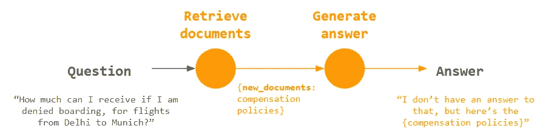
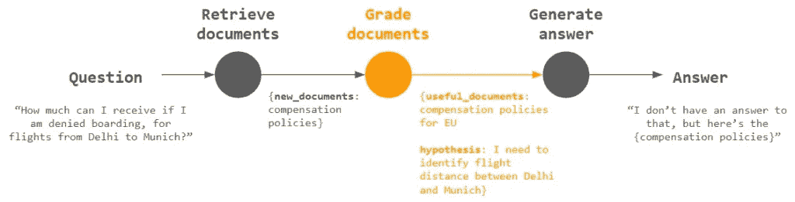
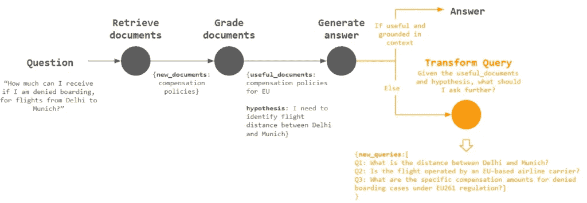
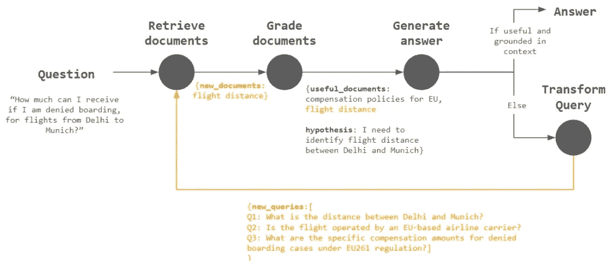
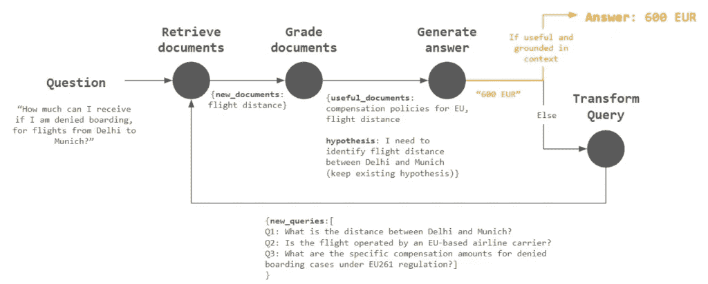
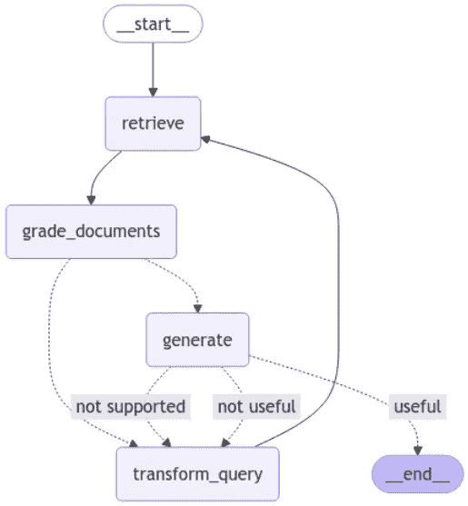

# 使用多智能体 Self-RAG 提升你的 RAG

> 原文：[`towardsdatascience.com/supercharge-your-rag-with-multi-agent-self-rag/`](https://towardsdatascience.com/supercharge-your-rag-with-multi-agent-self-rag/)

## **引言**

我们中的许多人可能都尝试过构建 RAG 应用，并注意到它严重不足于满足现实需求。为什么是这样呢？这是因为许多现实世界问题需要多个步骤的信息检索和推理。我们需要我们的代理像人类一样执行这些步骤，然而，大多数 RAG 应用都未能达到这一点。

本文探讨了如何在多智能体框架下，通过使数据检索和推理过程类似于人类的方式，来提升你的 RAG 应用。这里提出的框架基于[Self-RAG 策略](https://langchain-ai.github.io/langgraph/tutorials/rag/langgraph_self_rag/)，但已经进行了重大修改以增强其功能。阅读本文不需要对原始策略有先验知识。

## **真实案例**

考虑这一点：我本来要从德里飞往慕尼黑（让我们假设我是在欧盟航空公司乘坐航班），但不知何故我被拒绝登机。现在我想知道应该得到多少补偿。

这两个网页包含相关信息，我继续将它们添加到我的向量存储中，试图让我的代理通过检索正确的信息来为我回答这个问题。

+   [航班补偿政策](https://www.eu-startups.com/2024/04/comparative-analysis-eu-vs-us-flight-compensation-policies-sponsored/)

+   [慕尼黑与世界其他主要城市之间的距离](https://www.geodatos.net/en/distances/cities/germany/bavaria/munich) (注意：它不反映机场之间的距离，但对我们演示的目的来说足够了)

现在，我将这个问题传递给向量存储：***“如果我被拒绝登机，从德里到慕尼黑的航班我能得到多少补偿？”***。

```py
– – – – – – – – – – – – – – – – – – – – – – – – –
Overview of US Flight Compensation Policies To get compensation for delayed flights, you should contact your airline via their customer service or go to the customer service desk. At the same time, you should bear in mind that you will only receive compensation if the delay is not weather-related and is within the carrier`s control. According to the US Department of Transportation, US airlines are not required to compensate you if a flight is cancelled or delayed. You can be compensated if you are bumped or moved from an overbooked flight. If your provider cancels your flight less than two weeks before departure and you decide to cancel your trip entirely, you can receive a refund of both pre-paid baggage fees and your plane ticket. There will be no refund if you choose to continue your journey. In the case of a delayed flight, the airline will rebook you on a different flight. According to federal law, you will not be provided with money or other compensation. Comparative Analysis of EU vs. US Flight Compensation Policies
– – – – – – – – – – – – – – – – – – – – – – – – –
(AUTHOR-ADDED NOTE: IMPORTANT, PAY ATTENTION TO THIS)
Short-distance flight delays – if it is up to 1,500 km, you are due 250 Euro compensation.
Medium distance flight delays – for all the flights between 1,500 and 3,500 km, the compensation should be 400 Euro.
Long-distance flight delays – if it is over 3,500 km, you are due 600 Euro compensation. To receive this kind of compensation, the following conditions must be met; Your flight starts in a non-EU member state or in an EU member state and finishes in an EU member state and is organised by an EU airline. Your flight reaches the final destination with a delay that exceeds three hours. There is no force majeure.
– – – – – – – – – – – – – – – – – – – – – – – – –
Compensation policies in the EU and US are not the same, which implies that it is worth knowing more about them. While you can always count on Skycop flight cancellation compensation, you should still get acquainted with the information below.
– – – – – – – – – – – – – – – – – – – – – – – – –
Compensation for flight regulations EU: The EU does regulate flight delay compensation, which is known as EU261\. US: According to the US Department of Transportation, every airline has its own policies about what should be done for delayed passengers. Compensation for flight delays EU: Just like in the United States, compensation is not provided when the flight is delayed due to uncontrollable reasons. However, there is a clear approach to compensation calculation based on distance. For example, if your flight was up to 1,500 km, you can receive 250 euros. US: There are no federal requirements. That is why every airline sets its own limits for compensation in terms of length. However, it is usually set at three hours. Overbooking EU: In the EU, they call for volunteers if the flight is overbooked. These people are entitled to a choice of: Re-routing to their final destination at the earliest opportunity. Refund of their ticket cost within a week if not travelling. Re-routing at a later date at the person`s convenience.
```

不幸的是，它们只包含通用的航班补偿政策，没有告诉我从德里到慕尼黑被拒绝登机时我能期待多少。如果 RAG 代理将这些作为唯一上下文，它只能提供关于航班补偿政策的通用答案，而无法给出我们想要的答案。

然而，尽管这些文件不是立即有用的，但第二段上下文中包含了一个重要的见解：***补偿根据航班距离而变化***。如果 RAG 代理更像人类，它应该遵循以下步骤来提供答案：

1.  根据检索到的上下文，推理出补偿与航班距离相关

1.  接下来，检索德里和慕尼黑之间的航班距离

1.  考虑到距离（大约 5900 公里），将航班分类为长途航班

1.  结合之前检索到的上下文，假设其他条件得到满足，计算出我应该得到 600 欧元

这个例子展示了为什么一个简单的 RAG，其中只进行了一次检索，由于几个原因而不足：

1.  **复杂查询**：用户经常有简单搜索无法完全解决的问题。例如，“500 美元以下最好的游戏手机是什么？”需要考虑性能、价格和功能等多个因素，而单个检索步骤可能会错过。

1.  **深度信息**：一些信息跨越多个文档。例如，研究论文、医疗记录或法律文件通常包括需要理解的参考文献，在完全理解给定文章的内容之前。

多次检索辅以类似人类的推理，可以提供更细腻、全面和准确的响应，适应用户查询的复杂性和深度。

## 多代理自我-RAG

在这里，我解释了这种策略背后的推理过程，之后我将提供代码以展示如何实现这一点！

> 注意：对于对了解我的方法与[原始 Self-RAG](https://langchain-ai.github.io/langgraph/tutorials/rag/langgraph_self_rag/)有何不同感兴趣的读者，我将在这样的引号框中描述差异，如这样。但那些不熟悉原始 Self-RAG 的一般读者可以跳过它们。

在下面的图表中，每个圆圈代表一个步骤（即**节点**），由专门处理特定问题的代理执行。我们协调它们以形成一个多代理 RAG 应用。

### 1 次迭代：简单的 RAG



一个简单的 RAG 链

这只是我在“实际案例”中描述的 vanilla RAG 方法，以图表形式表示。在`检索文档`之后，`new_documents`将被用作`生成答案`的输入。没有什么特别的，但它作为我们的起点。

### 2 次迭代：使用“评估文档”摘要文档



类似人类的推理

记得我在“实际案例”部分说过，作为下一步，代理应该**“推理补偿与飞行距离的关系”**？`评估文档`步骤正是为此目的。

给定`新文档`，代理将尝试输出两项：

1.  `useful_documents`: 比较提出的问题，它确定文档是否有用，并为那些被认为对未来参考有用的文档保留记忆。例如，由于我们的问题不涉及美国的补偿政策，描述这些政策的文档被丢弃，只留下针对欧盟的文档

1.  `hypothesis`: 根据文档，代理形成了一个关于如何回答问题的假设，即需要识别飞行距离

注意上述推理如何类似于人类思维！但尽管这些输出是有用的，我们仍需要指示代理将它们作为输入用于执行下一个文档检索。没有这个，`生成答案`中提供的答案仍然没有用。

> `useful_documents`在每个文档检索循环中附加，而不是被覆盖，以保留先前被视为有用的文档的记忆。`hypothesis`从`useful_documents`和`new_documents`形成，以提供“抽象推理”，告知如何随后的查询要如何转换。
> 
> 当最初无法识别有用文档时，`hypothesis`特别有用，因为代理可以从被视为无用/仅与当前问题间接相关的文档中形成假设，以告知接下来要问的问题。

### 第 3 次迭代：提出新的问题



提出用于额外信息检索的问题

我们让代理反思答案是否有用且基于上下文。如果不是，它应继续到`Transform query`以提出更多问题。

输出的`new_queries`将是一系列新问题列表，代理认为这些问题对于获取额外信息是有用的。鉴于`useful_documents`（欧盟的补偿政策）和`hypothesis`（需要识别德里和慕尼黑之间的飞行距离），它提出像**“德里和慕尼黑之间的距离是多少？”**这样的问题。

现在我们已经准备好使用`new_queries`进行进一步的检索！

> `transform_query`节点将使用`useful_documents`（每次迭代累积，而不是被覆盖）和`hypothesis`作为输入，为代理提供询问新问题的方向。
> 
> 新问题将是一个问题列表（而不是单个问题），与原始`question`分开，以便保留原始问题，否则代理在多次迭代后可能会失去对原始问题的追踪。

### 最终迭代：使用新问题进行进一步检索



发起新查询以检索额外文档

`Transform query`的输出`new_queries`将被传递到`Retrieve documents`步骤，形成一个检索循环。

自从提出问题“德里和慕尼黑之间的距离是多少？”以来，我们可以预期飞行距离随后被检索为`new_documents`，并随后被评估为`useful_documents`，进一步用作`Generate answer`的输入。

> `*grade_documents*`节点将文档与原始的`*question*`和`*new_questions*`列表进行比较，以便保留对`*new_questions*`有用但原始`*question*`不用的文档。
> 
> 这是因为这些文档可能通过与新问题（如“*德里和慕尼黑之间的距离是多少？”）的相关性间接回答原始`*question*`。



最终答案！

带着关于飞行距离的新上下文，代理现在准备好提供正确的答案：**600 EUR**！

接下来，让我们深入代码，看看这个多智能体 RAG 应用程序是如何创建的。

## 实现

源代码可以在[这里](https://github.com/yip-kl/enhanced-self-rag)找到。我们的多智能体 RAG 应用程序涉及迭代和循环，LangGraph 是一个构建此类复杂多智能体应用程序的绝佳库。如果您不熟悉 LangGraph，强烈建议您查看[LangGraph 的快速入门指南](https://langchain-ai.github.io/langgraph/tutorials/introduction/)，以了解更多相关信息！

为了使这篇文章简洁，我将只关注关键代码片段。

**重要提示**：我正在使用 OpenRouter 作为[Llm](https://towardsdatascience.com/tag/llm/)接口，但代码可以很容易地适应其他 LLM 接口。此外，虽然在我的代码中我使用的是 Claude 3.5 Sonnet 作为模型，但只要 LLM 支持`tools`参数（请在此[列表](https://openrouter.ai/models?fmt=cards&order=newest&supported_parameters=tools)中检查），您可以使用任何 LLM，因此您也可以使用其他模型，如 DeepSeek V3 和 OpenAI o1 来运行此代码！

### 状态定义

在上一节中，我已经定义了各种元素，例如`new_documents`、`hypothesis`，这些元素需要传递给每个步骤（即**节点**），在 LangGraph 的术语中，这些元素被称为**状态**。

我们以下面的片段正式定义状态。

```py
from typing import List, Annotated
from typing_extensions import TypedDict

def append_to_list(original: list, new: list) -> list:
    original.append(new)
    return original

def combine_list(original: list, new: list) -> list:
    return original + new

class GraphState(TypedDict):
    """
    Represents the state of our graph.

    Attributes:
        question: question
        generation: LLM generation
        new_documents: newly retrieved documents for the current iteration
        useful_documents: documents that are considered useful
        graded_documents: documents that have been graded
        new_queries: newly generated questions
        hypothesis: hypothesis
    """

    question: str
    generation: str
    new_documents: List[str]
    useful_documents: Annotated[List[str], combine_list]
    graded_documents: List[str]
    new_queries: Annotated[List[str], append_to_list]
    hypothesis: str
```

### 图定义

这是我们将不同的步骤组合成一个“**图**”的地方，这个图是我们多智能体应用程序的表示。各种步骤的定义（例如`grade_documents`）通过它们各自的功能来表示。

```py
from langgraph.graph import END, StateGraph, START
from langgraph.checkpoint.memory import MemorySaver
from IPython.display import Image, display

workflow = StateGraph(GraphState)

# Define the nodes
workflow.add_node("retrieve", retrieve)  # retrieve
workflow.add_node("grade_documents", grade_documents)  # grade documents
workflow.add_node("generate", generate)  # generatae
workflow.add_node("transform_query", transform_query)  # transform_query

# Build graph
workflow.add_edge(START, "retrieve")
workflow.add_edge("retrieve", "grade_documents")
workflow.add_conditional_edges(
    "grade_documents",
    decide_to_generate,
    {
        "transform_query": "transform_query",
        "generate": "generate",
    },
)
workflow.add_edge("transform_query", "retrieve")
workflow.add_conditional_edges(
    "generate",
    grade_generation_v_documents_and_question,
    {
        "useful": END,
        "not supported": "transform_query",
        "not useful": "transform_query",
    },
)

# Compile
memory = MemorySaver()
app = workflow.compile(checkpointer=memory)
display(Image(app.get_graph(xray=True).draw_mermaid_png()))
```

运行上述代码，你应该看到我们 RAG 应用程序的图形表示。注意，它本质上等同于我在“增强自我 RAG 策略”最终迭代中展示的图！



可视化多智能体 RAG 图

> 在`generate`之后，如果答案被认为“不受支持”，代理将转到`transform_query`而不是再次转到`generate`，这样代理将寻找更多信息，而不是尝试根据现有上下文重新生成答案，这可能不足以提供“受支持”的答案。

现在，我们已经准备好对多智能体应用程序进行测试！以下代码片段，我们提出这个问题：“如果我被拒绝登机，从德里到慕尼黑的航班我能得到多少？”

```py
from pprint import pprint
config = {"configurable": {"thread_id": str(uuid4())}}

# Run
inputs = {
    "question": "how much can I receive if I am denied boarding, for flights from Delhi to Munich?",
    }
for output in app.stream(inputs, config):
    for key, value in output.items():
        # Node
        pprint(f"Node '{key}':")
        # Optional: print full state at each node
        # print(app.get_state(config).values)
    pprint("\n---\n")

# Final generation
pprint(value["generation"])
```

虽然输出可能有所不同（有时应用程序在没有任何迭代的情况下提供答案，因为它“猜测”了德里和慕尼黑之间的距离），但它应该看起来像这样，这表明应用程序已经进行了多轮数据检索以用于 RAG。

```py
---RETRIEVE---
"Node 'retrieve':"
'\n---\n'
---CHECK DOCUMENT RELEVANCE TO QUESTION---
---GRADE: DOCUMENT NOT RELEVANT---
---GRADE: DOCUMENT RELEVANT---
---GRADE: DOCUMENT NOT RELEVANT---
---GRADE: DOCUMENT NOT RELEVANT---
---ASSESS GRADED DOCUMENTS---
---DECISION: GENERATE---
"Node 'grade_documents':"
'\n---\n'
---GENERATE---
---CHECK HALLUCINATIONS---
'---DECISION: GENERATION IS NOT GROUNDED IN DOCUMENTS, RE-TRY---'
"Node 'generate':"
'\n---\n'
---TRANSFORM QUERY---
"Node 'transform_query':"
'\n---\n'
---RETRIEVE---
"Node 'retrieve':"
'\n---\n'
---CHECK DOCUMENT RELEVANCE TO QUESTION---
---GRADE: DOCUMENT NOT RELEVANT---
---GRADE: DOCUMENT NOT RELEVANT---
---GRADE: DOCUMENT RELEVANT---
---GRADE: DOCUMENT NOT RELEVANT---
---GRADE: DOCUMENT NOT RELEVANT---
---GRADE: DOCUMENT NOT RELEVANT---
---GRADE: DOCUMENT NOT RELEVANT---
---ASSESS GRADED DOCUMENTS---
---DECISION: GENERATE---
"Node 'grade_documents':"
'\n---\n'
---GENERATE---
---CHECK HALLUCINATIONS---
---DECISION: GENERATION IS GROUNDED IN DOCUMENTS---
---GRADE GENERATION vs QUESTION---
---DECISION: GENERATION ADDRESSES QUESTION---
"Node 'generate':"
'\n---\n'
('Based on the context provided, the flight distance from Munich to Delhi is '
 '5,931 km, which falls into the long-distance category (over 3,500 km). '
 'Therefore, if you are denied boarding on a flight from Delhi to Munich '
 'operated by an EU airline, you would be eligible for 600 Euro compensation, '
 'provided that:\n'
 '1\. The flight is operated by an EU airline\n'
 '2\. There is no force majeure\n'
 '3\. Other applicable conditions are met\n'
 '\n'
 "However, it's important to note that this compensation amount is only valid "
 'if all the required conditions are met as specified in the regulations.')
```

最终答案正是我们期望的！

```py
Based on the context provided, the flight distance from Munich to Delhi is
5,931 km, which falls into the long-distance category (over 3,500 km).
Therefore, if you are denied boarding on a flight from Delhi to Munich
operated by an EU airline, you would be eligible for 600 Euro compensation,
provided that:
1\. The flight is operated by an EU airline
2\. There is no force majeure
3\. Other applicable conditions are met

However, it's important to note that this compensation amount is only valid
if all the required conditions are met as specified in the regulations.
```

检查状态，我们看到`hypothesis`和`new_queries`如何通过模拟人类思维过程来增强我们多智能体 RAG 应用程序的有效性。

**假设**

```py
print(app.get_state(config).values.get('hypothesis',""))
```

```py
--- Output ---
To answer this question accurately, I need to determine:

1\. Is this flight operated by an EU airline? (Since Delhi is non-EU and Munich is EU)
2\. What is the flight distance between Delhi and Munich? (To determine compensation amount)
3\. Are we dealing with a denied boarding situation due to overbooking? (As opposed to delay/cancellation)

From the context, I can find information about compensation amounts based on distance, but I need to verify:
- If the flight meets EU compensation eligibility criteria
- The exact distance between Delhi and Munich to determine which compensation tier applies (250€, 400€, or 600€)
- If denied boarding compensation follows the same amounts as delay compensation

The context doesn't explicitly state compensation amounts specifically for denied boarding, though it mentions overbooking situations in the EU require offering volunteers re-routing or refund options.

Would you like me to proceed with the information available, or would you need additional context about denied boarding compensation specifically?
```

**新查询**

```py
for questions_batch in app.get_state(config).values.get('new_queries',""):
    for q in questions_batch:
        print(q)
```

```py
--- Output ---
What is the flight distance between Delhi and Munich?
Does EU denied boarding compensation follow the same amounts as flight delay compensation?
Are there specific compensation rules for denied boarding versus flight delays for flights from non-EU to EU destinations?
What are the compensation rules when flying with non-EU airlines from Delhi to Munich?
What are the specific conditions that qualify as denied boarding under EU regulations?
```

## 结论

简单的 RAG（关系图）虽然易于构建，但在解决现实生活中的问题时可能力不从心。通过将人类思维过程融入多智能体 RAG 框架中，我们使 RAG 应用变得更加实用。

**除非另有说明，所有图像均由作者提供**

* * *
