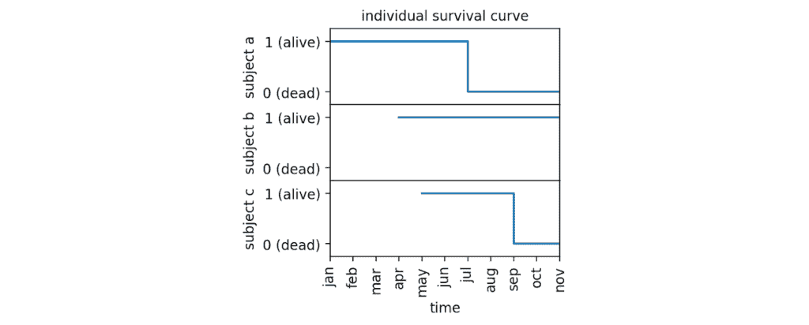
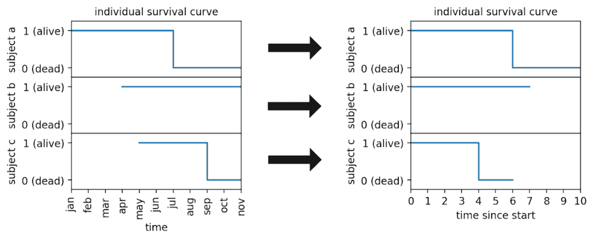
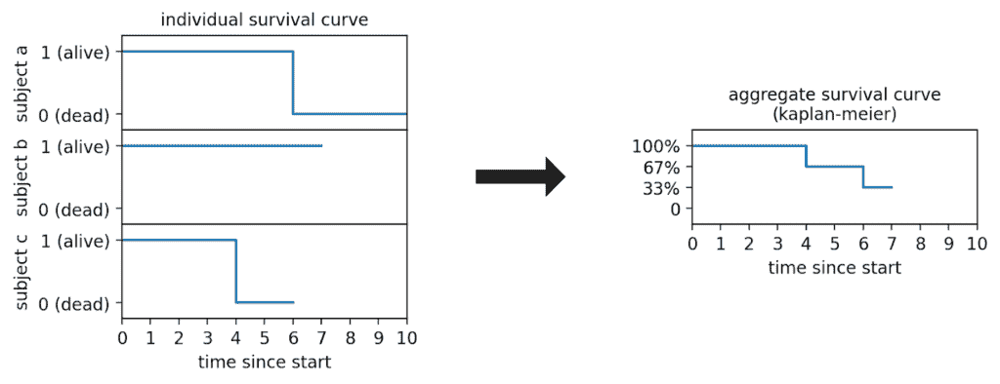
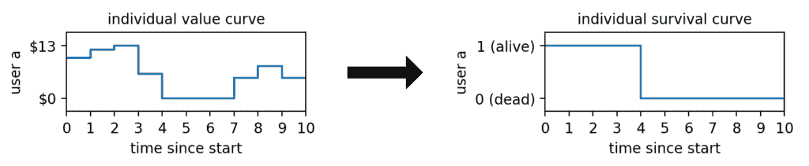
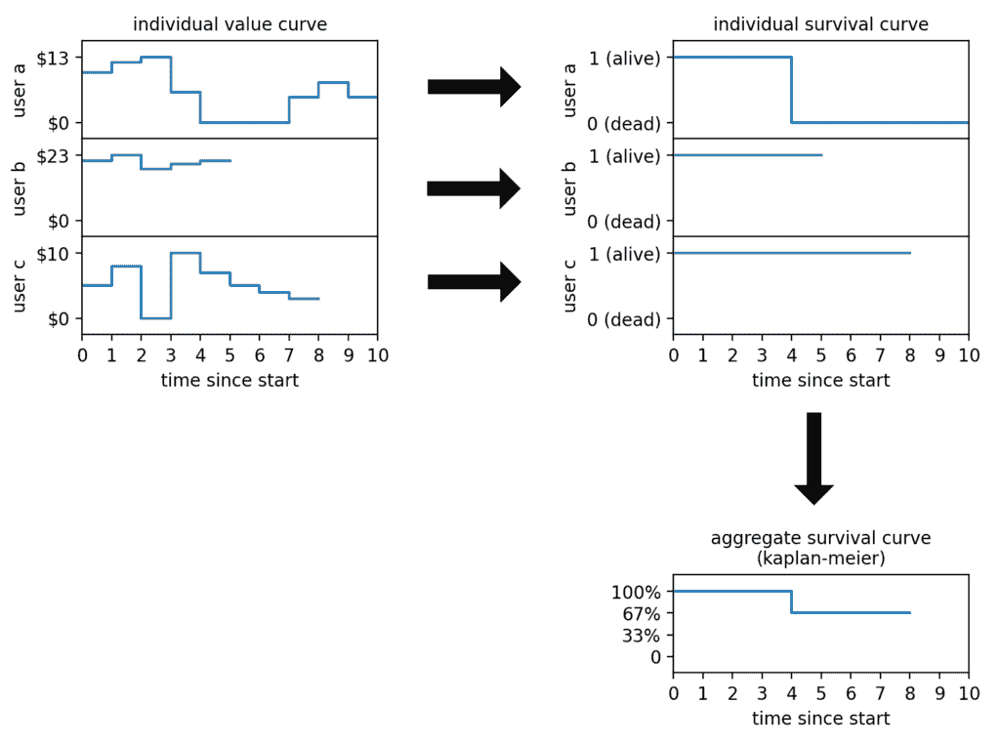
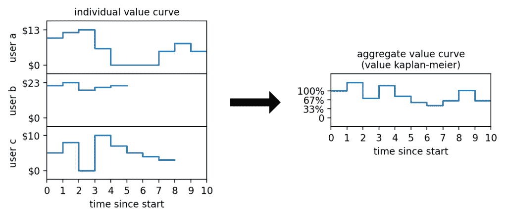
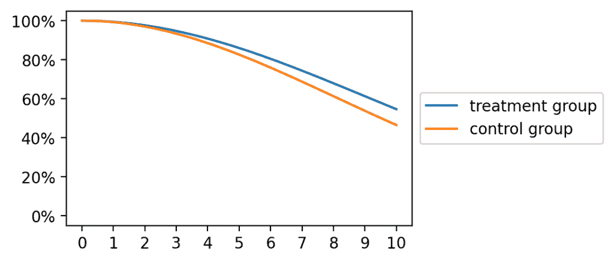

# 生存分析：当没有人死亡时：基于价值的 Approach

> 原文：[`towardsdatascience.com/survival-analysis-when-no-one-dies-a-value-based-approach/`](https://towardsdatascience.com/survival-analysis-when-no-one-dies-a-value-based-approach/)

<mdspan datatext="el1747181775942" class="mdspan-comment">生存分析</mdspan>是一种统计方法，用于回答问题：“某物能持续多久？”这个“某物”可能从患者的寿命到机器组件的耐用性或用户订阅的持续时间。

这个领域最广泛使用的工具之一是**Kaplan-Meier 估计器**。

出生于生物学领域，Kaplan-Meier 首次亮相是追踪生命和死亡。但像任何真正的明星算法一样，它并没有停留在自己的轨道上。如今，它出现在商业仪表板、营销团队和各处的客户流失分析中。

但这里有个问题：**商业不是生物学**。它是混乱的、不可预测的，充满了剧情转折。这就是为什么当我们试图在商业世界中应用生存分析时，会有一些问题使我们的生活更加困难。

首先，我们通常不仅对客户是否“存活”（在这个上下文中生存可能意味着什么）感兴趣，而是更关注**这个个体的经济价值中有多少是存活的**。

其次，与生物学相反，**客户“死亡”和“复活”多次是非常可能的**（想想你取消/重新订阅在线服务的时候）。

在这篇文章中，我们将看到如何扩展经典的 Kaplan-Meier 方法，使其更好地满足我们的需求：**建模连续（经济）价值而不是二元价值（生/死）并允许“复活”**。

## 关于 Kaplan-Meier 估计器的复习

让我们暂停一下，回顾一下。在我们开始定制 Kaplan-Meier 以适应我们的商业需求之前，我们需要快速复习一下经典版本是如何工作的。

假设你有 3 个受试者（比如说实验鼠）并且你给他们提供了一种需要测试的药物。药物在不同的时间点被给予：受试者 *a* 在 1 月份接受了它，受试者 *b* 在 4 月份，受试者 *c* 在 5 月份。

然后，你测量它们的存活时间。受试者 *a* 在 6 个月后死亡，受试者 *c* 在 4 个月后死亡，受试者 *b* 在分析时（11 月）仍然活着。

图形上，我们可以将 3 个受试者表示如下：



[作者提供的图片]

现在，**即使我们只想测量一个简单的指标，比如平均存活时间，我们也会遇到问题**。事实上，我们不知道受试者 *b* 将会存活多久，因为它今天仍然活着。

这是一个统计学中的经典问题，被称为“**右截尾**”。

右侧截断是统计学中的术语，意思是“我们不知道在某个点之后发生了什么”，在生存分析中这是一个很大的问题。所以大，以至于**导致了统计史上最标志性的估计器之一：Kaplan-Meier 估计器**的发展，以在 20 世纪 50 年代引入它的那对夫妇命名。

那么，Kaplan-Meier 是如何处理我们的问题的？

首先，我们调整时钟。即使我们的老鼠在不同的时间接受治疗，**重要的是**自治疗以来的**时间**。所以我们将*x*-轴重置为零——零天是它们获得药物的那天。



[作者提供的图片](https://example.org)

现在我们都在同一条时间线上，我们想要构建一些有用的东西：一个**生存累积曲线**。这条曲线告诉我们，在我们的小组中，一只**典型**的老鼠在治疗后至少存活**x**个月的概率。

让我们一起跟随这个逻辑。

+   到时间 3 为止？所有人还在。所以存活率=100%。很简单。

+   在时间 4 时，老鼠*c*死了。这意味着在 3 只老鼠中，只有 2 只在时间 4 之后存活。这给了我们在时间 4 时的存活率为 67%。

+   然后在时间 6 时，老鼠*a*离开了。在到达时间 6 的 2 只老鼠中，只有 1 只存活，所以从时间 5 到 6 的存活率是 50%。乘以之前的 67%，我们得到到时间 6 的 33%存活率。

+   在时间 7 之后，我们没有观察到其他存活的受试者，所以曲线必须在这里停止。

让我们绘制这些结果：



[作者提供的图片](https://example.org)

由于代码通常比文字更容易理解，让我们将其翻译成 Python。我们有以下变量：

+   `kaplan_meier`，一个包含每个时间点的 Kaplan-Meier 估计值的数组，例如到时间`t`的存活概率。

+   `obs_t`，一个数组，告诉我们个体在时间`t`时是否被观察到（例如，不是右侧截断）。

+   `surv_t`，一个布尔数组，告诉我们每个个体在时间`t`时是否存活。

+   `surv_t_minus_1`，一个布尔数组，告诉我们每个个体在时间`t*-1`时是否存活。

我们需要做的就是收集在时间`t`观察到的所有个体，计算它们从`t*-1`到`t`的存活率（`survival_rate_t`），然后乘以到时间`t*-1`的存活率（`km[t-1]`），以获得到时间`t`的存活率（`km[t]`）*.*换句话说，

```py
survival_rate_t = surv_t[obs_t].sum() / surv_t_minus_1[obs_t].sum()

kaplan_meier[t] = kaplan_meier[t-1] * survival_rate_t
```

其中，当然，起点是`kaplan_meier[0] = 1`。

如果你不想从头开始编写这个代码，Kaplan-Meier 算法在 Python 库`lifelines`中可用，可以使用以下方式使用：

```py
from lifelines import KaplanMeierFitter

KaplanMeierFitter().fit(
    durations=[6,7,4],
    event_observed=[1,0,1],
).survival_function_["KM_estimate"]
```

如果你使用此代码，你将获得与我们之前片段手动获得相同的结果。

到目前为止，我们一直停留在老鼠、医学和死亡率的世界里。这可不是你平均的季度 KPI 审查，对吧？那么，这在商业中有什么用？

## 转向商业环境

到目前为止，我们一直将“死亡”视为显而易见的事情。在卡普兰-梅耶的世界里，一个人要么活着，要么死亡，我们可以轻松地记录死亡时间。但现在让我们加入一些现实世界的商业混乱。

***在商业环境中，“死亡”究竟是什么意思***？

结果证明，回答这个问题并不容易，至少有以下几个原因：

1.  **“死亡”并不容易定义**。假设你在一家电子商务公司工作。你想知道何时一个用户“死亡”。当他们删除账户时，你应该将他们视为已死亡吗？这很容易追踪……但太少了，没有太大用处。如果他们只是开始减少购物呢？但**减少多少算是死亡**？一周的沉默？一个月？两个月？你看到了问题。对“死亡”的定义是任意的，而且根据你划定的界限，你的分析可能会讲述截然不同的故事。

1.  **“死亡”不是永久的**。卡普兰-梅耶最初是为生物学应用而设计的，其中一旦个体死亡，就没有返回的可能。但在商业应用中，复活不仅可能，而且相当频繁。想象一下，一个人们支付月度订阅费的流媒体服务。在这种情况下，“死亡”很容易定义：就是当用户取消订阅时。然而，在取消订阅后，他们重新订阅的情况相当常见。

那么这一切在数据中是如何体现的呢？

让我们通过一个玩具例子来了解一下。假设我们有一个在电子商务平台上的用户。在过去 10 个月里，这是他们消费的情况：


[作者图片]

为了将这纳入卡普兰-梅耶框架，我们需要将那种消费行为**转化为生死决定**。

因此，我们制定了一个规则：如果一个用户连续两个月停止消费，我们宣布他们“不活跃”。

图形上，这个规则看起来如下：



[作者图片]

由于用户连续两个月（第 4 个月和第 5 个月）没有消费，我们将从第 4 个月开始将其视为不活跃。尽管用户在第 7 个月又开始消费，我们也会这样做。这是因为，在卡普兰-梅耶中，复活被认为是不可行的。

现在我们再添加两个用户到我们的例子中。既然我们已经决定了一个规则将他们的价值曲线转换为生存曲线，我们也可以计算卡普兰-梅耶生存曲线：



[作者图片]

到现在为止，你可能已经注意到，我们为了使这项工作得以进行，已经丢弃了多少**细微差别（以及数据）**。用户 *a* 从“死亡”中复活了——但我们忽略了这一点。用户 *c* 的消费显著下降——但卡普兰-梅耶并不关心，因为它只看到 1 和 0。我们强迫一个连续的值（消费）进入一个二进制框（活着/死亡），在这个过程中，我们丢失了大量的信息。

因此，问题是：我们能否以某种方式扩展卡普兰-梅耶：

+   **保持原始的连续数据完整**，

+   **避免任意的二元截止点**，

+   **允许复活**？

是的，我们可以。在下一节中，我将向你展示如何做到这一点。

## 介绍“价值 Kaplan-Meier”

让我们从之前见过的简单 Kaplan-Meier 公式开始。

```py
# kaplan_meier: array containing the Kaplan-Meier estimates,
#               e.g. the probability of survival up to time t
# obs_t: array, whether a subject has been observed at time t
# surv_t: array, whether a subject was alive at time t
# surv_t_minus_1: array, whether a subject was alive at time t−1

survival_rate_t = surv_t[obs_t].sum() / surv_t_minus_1[obs_t].sum()

kaplan_meier[t] = kaplan_meier[t-1] * survival_rate_t
```

我们需要做的第一个更改是将布尔数组 `surv_t` 和 `surv_t_minus_1` 替换为告诉我们每个主体在给定时间（经济）价值的数组。这些数组分别命名为 `val_t` 和 `val_t_minus_1`。

但这还不够，因为我们处理的是连续价值，**每个用户都在不同的尺度上，因此，如果我们想平等地权衡它们，我们需要根据某个个体价值重新缩放它们**。但我们应该使用什么价值？最合理的选择是使用他们在时间 0 的初始价值，在他们受到我们应用的治疗影响之前。

因此，我们还需要使用另一个向量，命名为 `val_t_0`，它表示个体在时间 0 的价值。

```py
# value_kaplan_meier: array containing the Value Kaplan-Meier estimates
# obs_t: array, whether a subject has been observed at time t
# val_t_0: array, user value at time 0
# val_t: array, user value at time t
# val_t_minus_1: array, user value at time t−1

value_rate_t = (
    (val_t[obs_t] / val_t_0[obs_t]).sum()
    / (val_t_minus_1[obs_t] / val_t_0[obs_t]).sum()
)

value_kaplan_meier[t] = value_kaplan_meier[t-1] * value_rate_t
```

我们构建的是 Kaplan-Meier 的直接推广。事实上，如果你将 `val_t = surv_t`，`val_t_minus_1 = surv_t_minus_1`，并将 `val_t_0` 设置为一个全为 1 的数组，这个公式就会巧妙地回到我们原始的生存估计器。所以——是的，它是合法的。

这是我们将应用于这 3 个用户的曲线。



[图片由作者提供]

让我们称这个新版本为 **价值 Kaplan-Meier 估计器**。实际上，它回答了以下问题：

***在 x 时间后，平均还有多少百分比的价值仍然存活？***

我们有理论。但在野外它有效吗？

## **在实际中应用价值 Kaplan-Meier**

如果你将价值 Kaplan-Meier 估计器应用于现实世界数据，并将其与古老的 Kaplan-Meier 曲线进行比较，你可能会注意到一些令人欣慰的事情——**它们通常具有相同的形状**。这是一个好兆头。这意味着我们在从二进制升级到连续的过程中没有破坏任何基本的东西。

但这里有趣的地方在于：**价值 Kaplan-Meier 通常比其传统的表亲略高一些**。为什么？因为在新的世界中，用户被允许“复活”。Kaplan-Meier 作为两者中更僵化的一个，一旦他们变得安静，就会将他们排除在外。

那么，我们如何利用这一点呢？

想象你正在进行一个实验。在时间零点，你开始对一组用户进行新的治疗。无论是什么，你都可以跟踪治疗组和对照组随着时间的推移“存活”的价值。

这就是你的输出可能的样子：



[图片由作者提供]

## 结论

Kaplan-Meier 是一种广泛使用且直观的估计生存函数的方法，特别是当结果是一个二元事件，如死亡或失败时。然而，许多现实世界的商业场景涉及更多的复杂性——复活是可能的，结果最好用连续值而不是二元状态来表示。

在这种情况下，Kapan-Meier 价值估计方法提供了一种自然的扩展。**通过纳入个人随时间变化的经济价值，它使得对价值保留和衰减的理解更加细腻**。这种方法保留了原始 Kaplan-Meier 估计器的简单性和可解释性，同时适应了更好地反映客户行为动态。

Kaplan-Meier 价值估计方法倾向于提供比 Kaplan-Meier 更高的保留价值估计，因为它能够考虑到恢复情况。这使得它在评估实验或随时间跟踪客户价值方面特别有用。
