# 基于数据分析的可持续发展商业策略

> 原文：[`towardsdatascience.com/sustainable-business-strategy-with-data-analytics-ce27180f8ddb/`](https://towardsdatascience.com/sustainable-business-strategy-with-data-analytics-ce27180f8ddb/)

一致意味着每个人都同意集体说出他们个人不相信的事情。

这句话捕捉了许多公司在战略绿色转型过程中面临的一个关键问题：在团队和部门之间协调不同的目标。

> 可持续发展团队：“我们需要将排放量减少 30%”。

想象一家假设的制造公司，其商业策略的核心是一个**雄心勃勃的目标：将二氧化碳排放量减少 30%。**

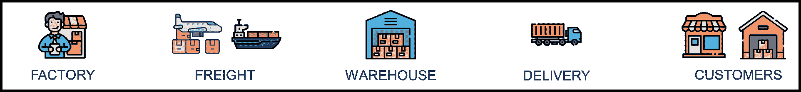

我们示例的价值链 – (图片由 Samir Saci 提供)

可持续发展团队的挑战是实施可能扰乱价值链上多个部门活动的流程变更。

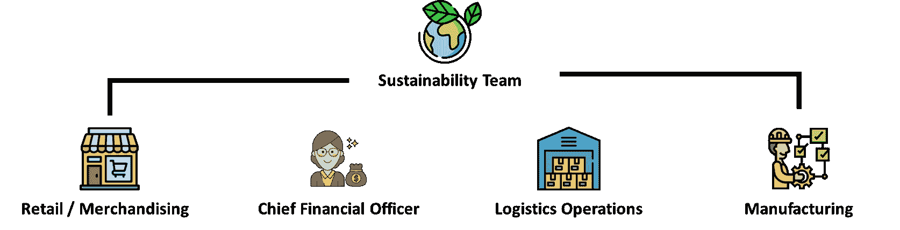

可持续发展项目指导委员会 – (图片由 Samir Saci 提供)

> 你如何确保多个潜在存在利益冲突的股东的批准？

在这篇文章中，我们将使用这家公司作为例子，说明分析模型如何支持可持续发展商业策略。

## 如何构建可持续发展路线图？

您是这家**国际****制造集团**供应链部门的**数据科学经理**。

在股东和欧洲法规的压力下，您的首席执行官为**到 2030 年减少环境足迹**设定了雄心勃勃的目标。

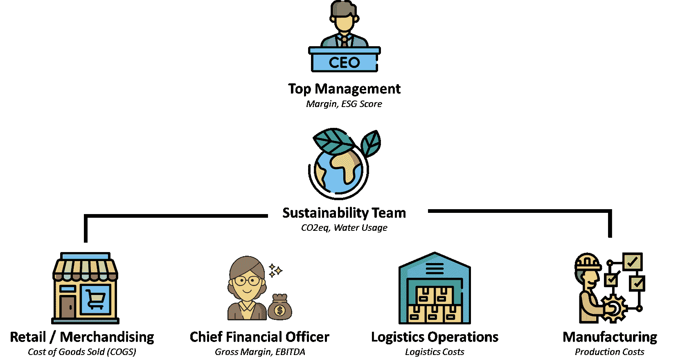

参与流程的股东 – (图片由 Samir Saci 提供)

**可持续发展部门**领导一个跨职能转型项目，涉及多个部门共同实施绿色倡议。

### 可持续供应链网络优化

为了说明我的观点，我将专注于**供应链网络优化**。

目标是重新设计工厂网络以满足市场需求，同时优化成本和环境足迹。

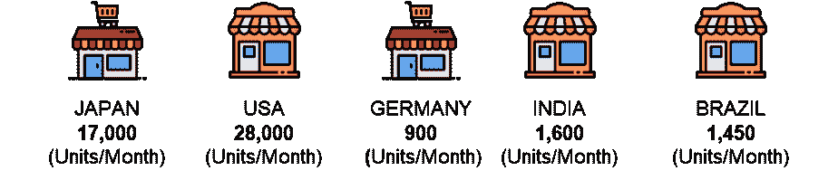

我们制造公司的五个市场 – (图片由 Samir Saci 提供)

总需求量为每月**48,950 个单位，分布在五个市场：日本、美国、德国、巴西**和印度。

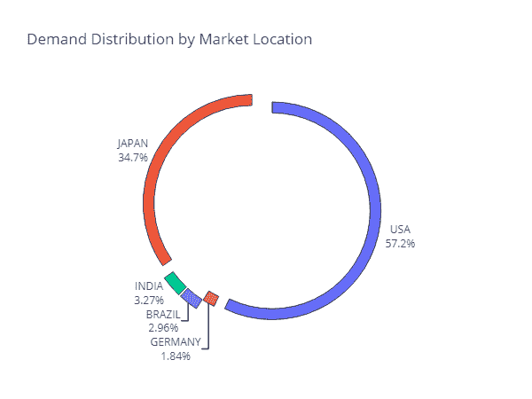

各市场需求分布 – (图片由 Samir Saci 提供)

市场可以根据客户购买力进行分类：

+   **高价市场**（美国、日本和德国）占需求的 93.8%，但**生产成本较高**。

+   **低价市场**（巴西和印度）仅占需求的**6.2**%，但**生产成本更具竞争力。

> 我们想要实现什么？
> 
> 以合理的环境影响最低成本满足需求。

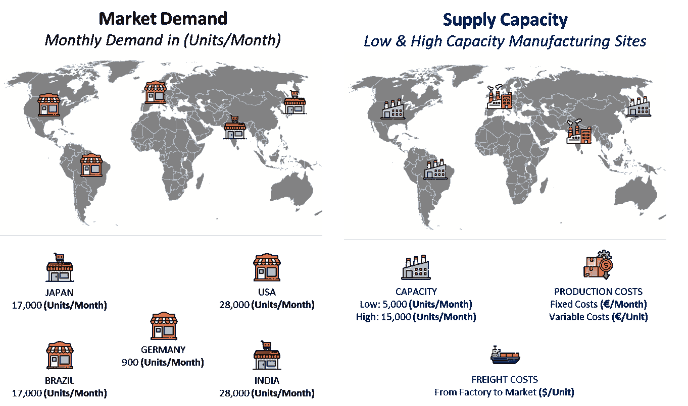

市场需求与供应能力对比 – （图片由 Samir Saci 提供）

我们必须决定**在哪里开设工厂**以平衡成本和环境影响（二氧化碳排放、废物、水和能源使用）。

**制造能力**在每个地点，我们可以开设低产能或高产能的工厂。

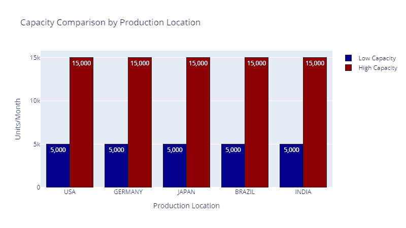

每个地点的生产能力 – （图片由 Samir Saci 提供）

**固定生产成本**

高产能工厂的固定成本较高，但可以实现规模经济。

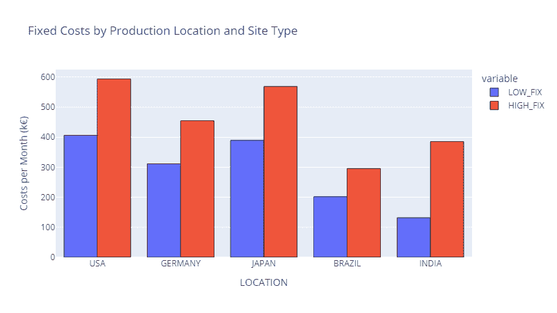

固定生产成本 – （图片由 Samir Saci 提供）

> 印度的高产能工厂比美国低产能工厂的固定成本要低。

在印度的高产能工厂（满负荷运行）中，每单位固定成本比在美国的低产能工厂低。

**可变成本**

可变成本主要受劳动力成本驱动，这将影响一个地区的竞争力。

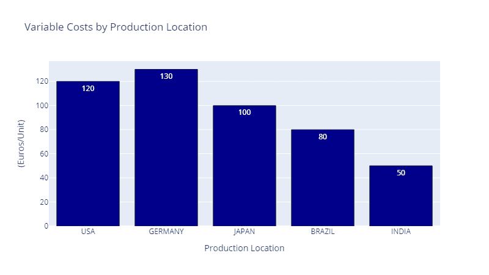

每个地点的生产成本 – （图片由 Samir Saci 提供）

然而，我们需要在生产成本之外，加上从工厂到市场的运费。

如果你将生产（针对北美市场）从美国转移到印度，你会降低生产成本，但会产生额外的运费。

> 环境影响如何？

制造团队从每个工厂收集指标，以计算每单位生产的冲击。

+   运输的**二氧化碳排放**基于工厂与市场之间的距离。

+   环境指标包括二氧化碳排放、产生的废物、消耗的水和能源使用。

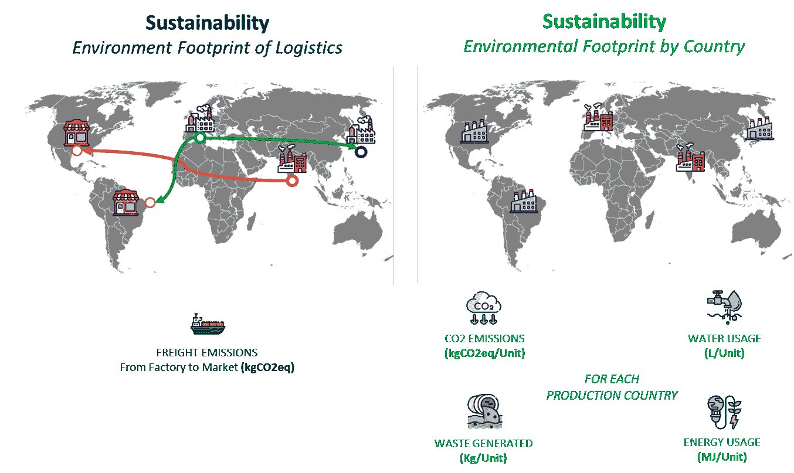

制造与物流的环境足迹 – （图片由 Samir Saci 提供）

我们取每单位生产的平均产量来简化问题。

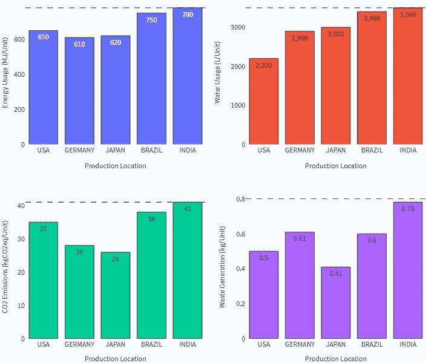

每个地点每单位生产的环境影响 – （图片由 Samir Saci 提供）

例如，在印度生产单个单位需要 3500 升水。

总结这四张图，高成本制造地点比低成本地点“更绿色”。

你可以感受到降低成本和最小化环境影响之间的冲突利益。

> 工厂的最佳足迹是什么，以最小化二氧化碳排放？

### 数据驱动的供应链网络设计

如果我们旨在减少生产网络的环境影响，**简单的答案就是只在高端“绿色”设施中生产**。

不幸的是，这可能会引发更多的问题：

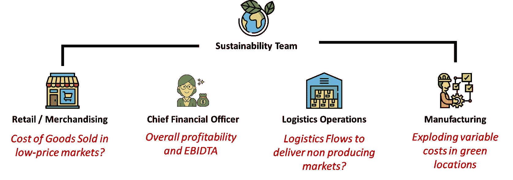

指导委员会问题 – (图片由 Samir Saci 提供)

+   **物流部门**：对于那些没有绿色设施的国家，运输的二氧化碳排放量如何？

+   **财务团队**：如果我们转移到成本高昂的设施，整体盈利能力会受到多大影响？

+   **销售**：如果你将生产转移到昂贵的“绿色”地点，印度和巴西的商品销售成本会发生什么变化？

这些是当可持续性团队推动特定的网络设计时，你的指导委员会可能会提出的问题。

在下一节中，我们将模拟每个倡议，以衡量其对这些 KPI 的影响，并向所有利益相关者提供一个完整的画面。

## 数据分析用于可持续商业战略

在另一篇文章中，我介绍了我们将使用的模型，通过两个场景来展示这个练习的复杂性：

+   **场景 1**：你的财务总监希望**最小化整体成本**

+   **场景 2**：可持续性团队推动**最小化二氧化碳排放**

模型输出将包括**财务和运营指标**，以展示场景对每个部门所遵循的 KPI 的影响。

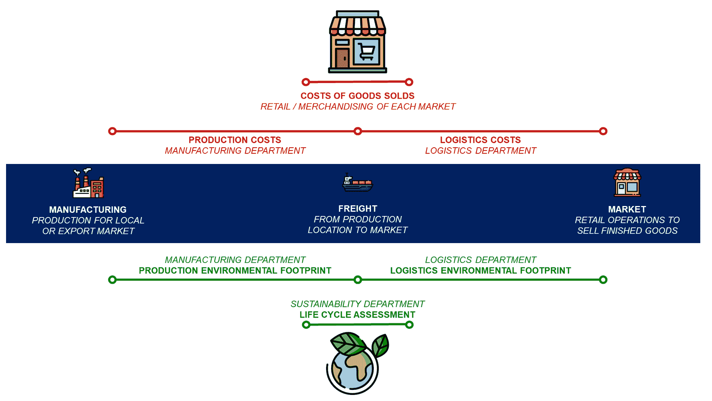

涉及多个部门的多个 KPI – (图片由 Samir Saci 提供)

+   **制造**：二氧化碳排放量、资源使用量和单位成本

+   **物流**：运费成本和排放

+   **零售/销售**：商品销售成本（COGS）

正如我们将在不同的场景中看到的，每个场景都可能对某些部门有利，而对其他部门有害。

你能想象一个物流总监，在尽可能低成本的条件下，为了一个随机的可持续性倡议而**接受其分销链的干扰**吗？

> 数据（可能）帮助我们找到共识。

### 场景 1：最小化商品销售成本

我建议使用最小化商品销售成本（COGS）的场景来设定基线。

该模型通过**开启四个工厂**来找到最小化这一指标的最优工厂组合。

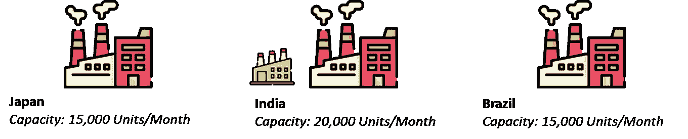

场景 1 的制造网络 – (图片由 Samir Saci 提供)

+   **印度两个工厂**（低和高）将满足 100%的当地需求，并利用剩余产能供应德国、美国和日本市场。

+   日本的一个**单一高产能工厂**，专门用于满足（部分）当地需求。

+   **巴西的一个高产能工厂**为其市场和出口到美国。

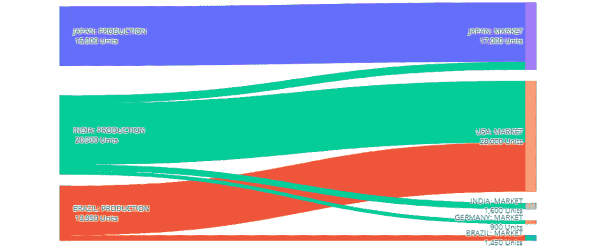

最小化成本的解决方案 1 - (图片由 Samir Saci 提供)

+   **本地生产**：每月 10,850 个单位

+   **出口生产**：每月 30,900 个单位

以这种出口导向的足迹，我们的总成本为**5.68 百万欧元/月**，包括生产和运输。

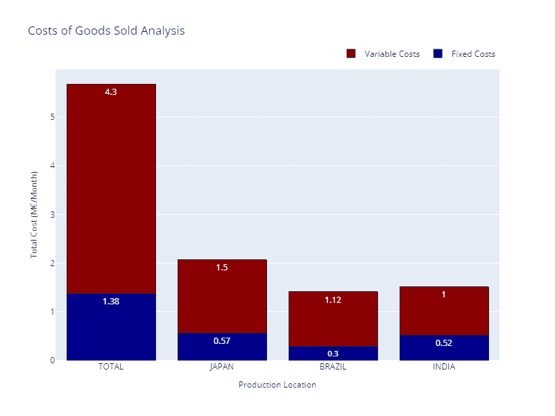

总成本分解 - (图片由 Samir Saci 提供)

好消息是，模型的分配是最佳的；所有工厂都达到了最大产能。

> 商品销售成本（COGS）如何？

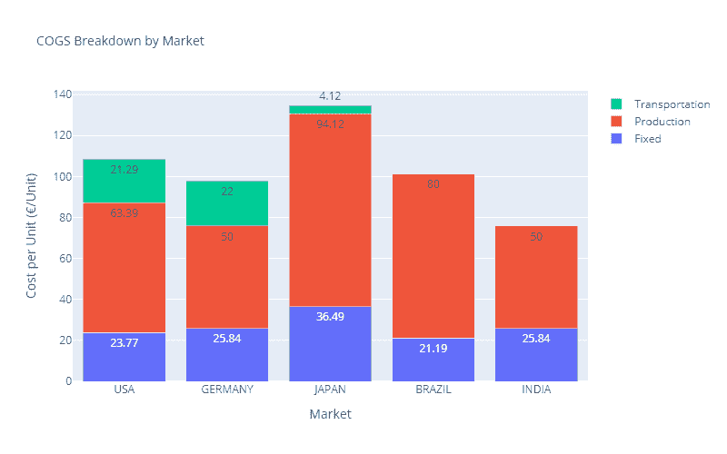

场景 1 的 COGS 分解 - (图片由 Samir Saci 提供)

除了巴西市场外，商品销售成本大致与当地购买力相匹配。

进一步的步骤是增加**印度的生产能力**或减少**巴西的工厂成本**。

> 从成本角度来看，这似乎是完美的。但这对可持续发展团队来说是个好交易吗？

可持续发展部门正在拉响警报，因为**二氧化碳排放量正在激增**。

我们有**5,882（吨二氧化碳当量）**的排放量，对应**48,950 个生产单位**。

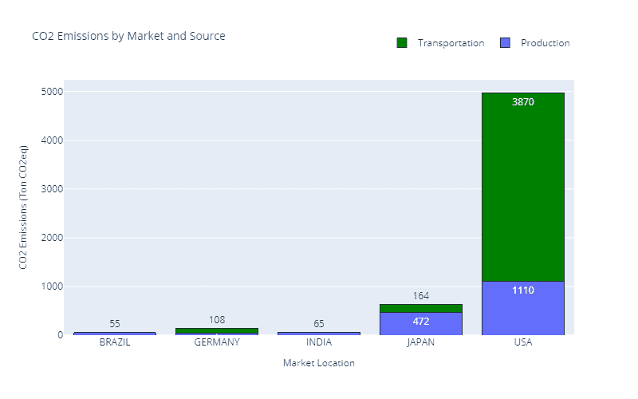

按市场划分的排放量 - (图片由 Samir Saci 提供)

大部分这些排放都源于**从工厂到美国市场的运输**。

高层管理正在推动提出一个网络转型，以**减少 30%的排放**。

> 这将对生产、物流和零售运营产生什么影响？

### 场景 2：生产本地化

我们将模型的优化目标函数改为**最小化二氧化碳排放**。

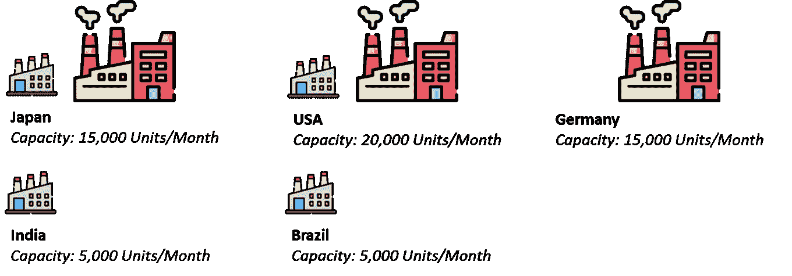

场景 2 的制造网络 - (图片由 Samir Saci 提供)

由于运输是二氧化碳排放的主要驱动因素，模型建议开设**七个工厂**以**最大化本地满足需求**。

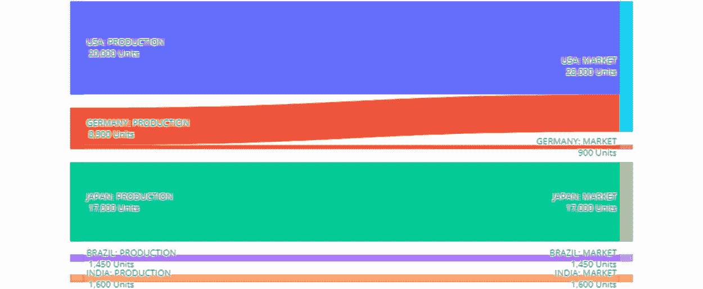

场景 2 的供应链流程 - (图片由 Samir Saci 提供)

+   **印度和巴西的两个低产能工厂**仅满足各自的本地市场。

+   德国的一个**单一高产能**工厂用于本地市场并出口到美国。

+   我们在**日本和美国**拥有**两对高低产能工厂**，专门服务于本地市场。

从**制造部门的观点来看**，这种设置远非最佳。

我们在印度和巴西有四个低产能工厂，其**产能利用率远低于预期**。

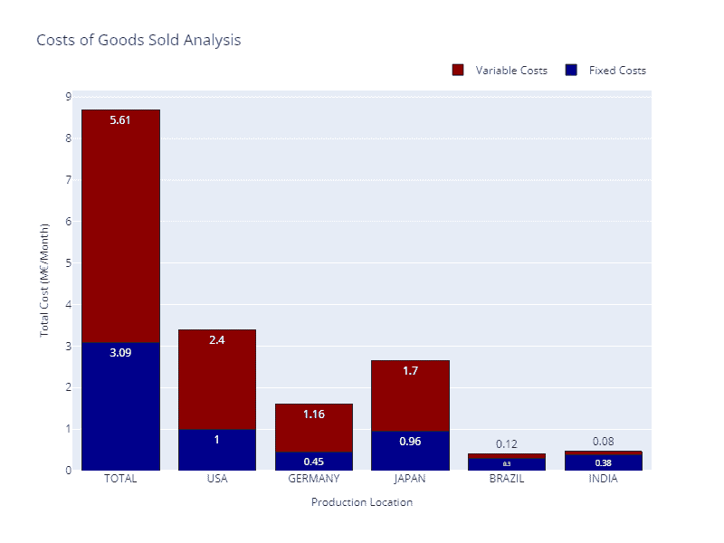

成本分析 - (图片由 Samir Saci 提供)

因此，固定成本翻了一番多，总预算达到**8.7 百万欧元/月**（与场景 1 的 5.68 百万欧元/月相比）。

> 我们是否达到了我们的减排目标？

排放量从**5,882 (吨 CO2eq)**降至**2,136 (吨 CO2eq**)，达到可持续发展团队设定的目标。

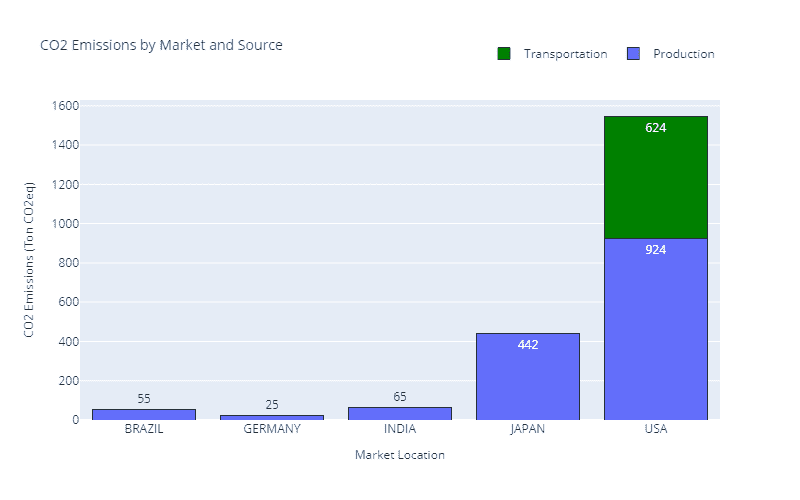

按市场排放量（场景 2） – (图片由 Samir Saci 提供)

然而，你的首席财务官和商品团队担心**销售商品的成本增加**。

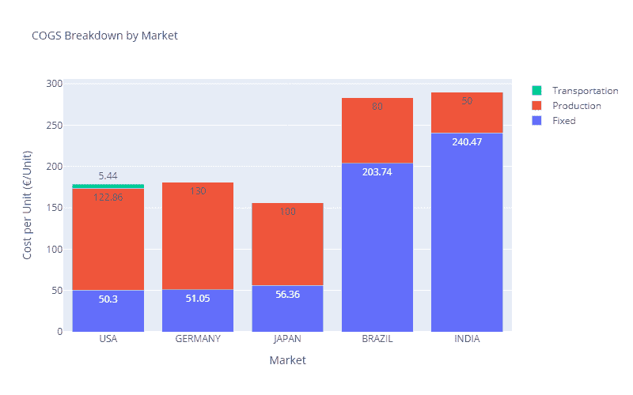

场景 2 的新可变成本 – (图片由 Samir Saci 提供)

因为产量没有吸收他们工厂的固定成本，巴西和印度**现在拥有最高的可变成本**，高达 290.47 €/单位。

然而，它们仍然是购买力最低的市场。

> 商品团队：“由于我们无法提高那里的价格，我们在巴西和印度将不会盈利。”

我们还没有完成。我们没有考虑其他环境指标。

> 可持续发展团队也希望减少用水量。

### 场景 3：最小化用水量

在之前的设置中，我们达到了每单位生产的平均消耗量为**2,683 kL 水**。

为了满足 2030 年的法规，有推动将其降低至**2650 kL/单位**以下。

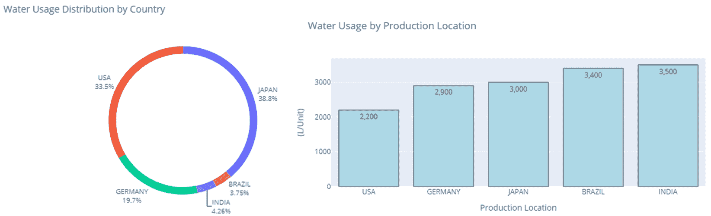

场景 2 与单位消耗量相比的用水量 – (图片由 Samir Saci 提供)

这可以通过将生产转移到美国、德国和日本，同时关闭巴西和印度的工厂来实现。

让我们看看模型提出了什么。

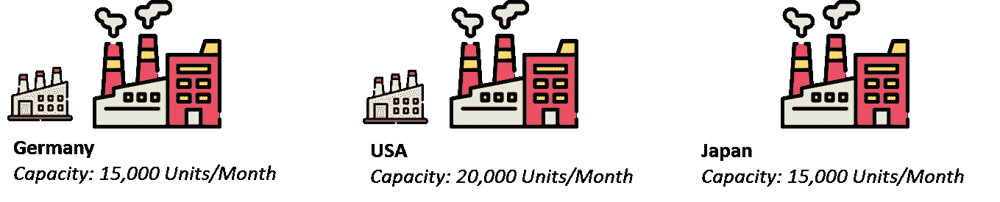

场景 3 制造网络 – (图片由 Samir Saci 提供)

它看起来像是场景 1 的镜像版本，**35,950 单位出口**和**仅 13,000 单位本地生产**。

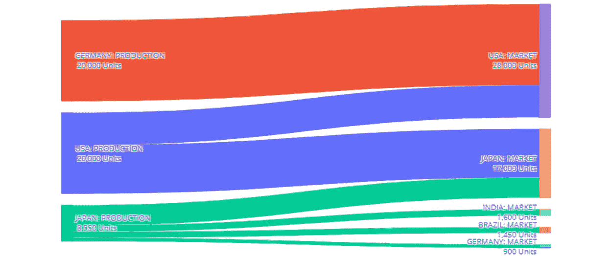

场景 3 流程图 – (图片由 Samir Saci 提供)

但现在，生产由“昂贵”国家的**五家工厂**推动。

+   美国的两家工厂本地交付并在日本交付。

+   我们在德国还有两个工厂，只为美国市场供应。

+   日本将开设一个单一的高产能工厂以满足剩余的本地需求和向小市场（印度、巴西和德国）交付。

> 财务部门：“这是你提出的方案中财务上最不优的设置。”

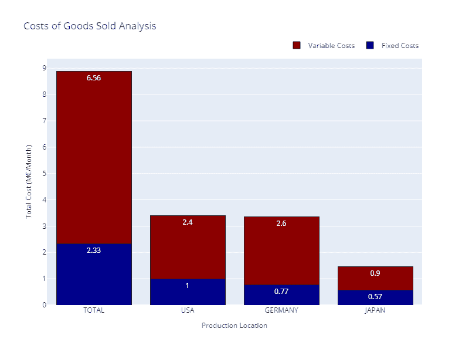

场景 3 成本分析 – (图片由 Samir Saci 提供)

从成本角度来看，这是最坏的情况，因为生产和运输成本正在激增。

这导致预算为**8.89 M€/月**（与场景 1 的 5.68 M€/月相比）。

> 商品团队：“在巴西和印度销售的单元的可变成本现在更加合理。”

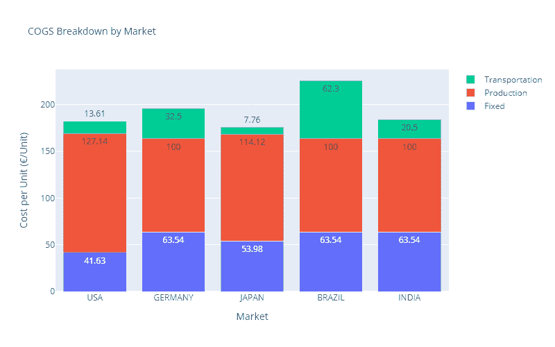

场景 2 的新 COGS – (图片由萨米尔·萨奇提供)

从零售角度来看，情况比场景 2 要好，因为巴西和印度的市场现在成本与当地购买力相匹配。

然而，物流团队面临挑战，因为我们有大量出口市场的体积。

> 可持续发展团队：“关于水使用量和二氧化碳排放量呢？”

水的使用量现在为 **2,632 kL/单位**，低于我们的目标 2,650 kL。

然而，二氧化碳排放量激增。

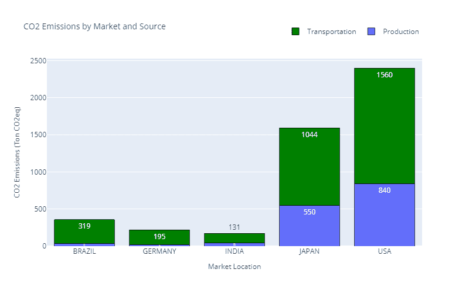

市场排放量（场景 3） – (图片由萨米尔·萨奇提供)

我们回到了场景 1 的情况，排放量为**4,742（吨 CO2eq）**（而场景 2 为 2,136（吨 CO2eq））。

我们可以假设这个场景对任何一方来说都是令人满意的。

### 寻求共识的难度

正如我们在这个简单例子中观察到的，我们**(作为数据分析专家)**无法提供满足所有方需求的完美解决方案。

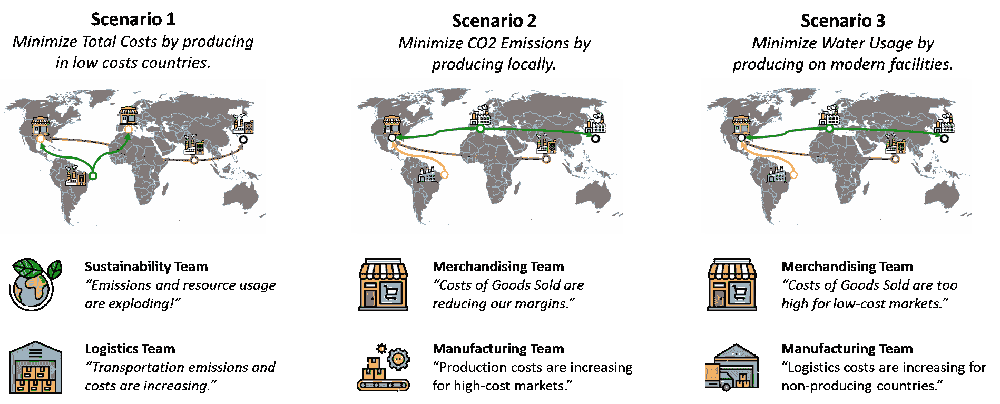

场景和团队影响 – (图片由萨米尔·萨奇提供)

每个场景都会提高一个特定指标，但会损害其他指标。

> 首席执行官：“可持续性不是选择，而是我们优先考虑的成为更加可持续的事情。”

然而，这些数据驱动的见解将为高级讨论提供信息，以找到最终共识并进入实施阶段。

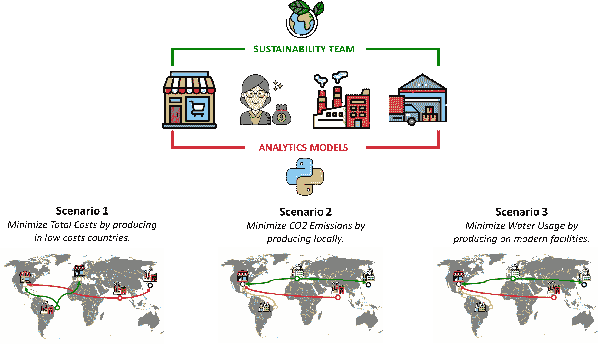

数据驱动解决方案设计 – (图片由萨米尔·萨奇提供)

在这个精神指导下，我开发了这款工具来解决公司管理和利益相关者之间冲突利益的问题。

## 结论

本文通过一个简单的例子探讨了在构建转型路线图时平衡盈利性和可持续性的挑战。

这个网络设计练习展示了优化不同目标（成本、二氧化碳排放量和水使用量）如何导致影响所有利益相关者的权衡。

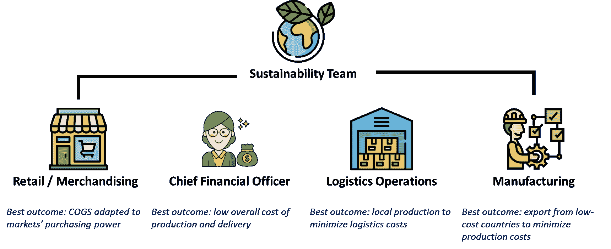

利益相关者之间的冲突利益 – (图片由萨米尔·萨奇提供)

这些例子突显了在可持续发展转型中达成共识的复杂性。

> 作为分析专家，我们可以在提供所有指标以推动讨论方面发挥关键作用。

展示的视觉和分析是基于我设计的**网络应用供应链优化模块**，旨在支持公司应对这些多维挑战。

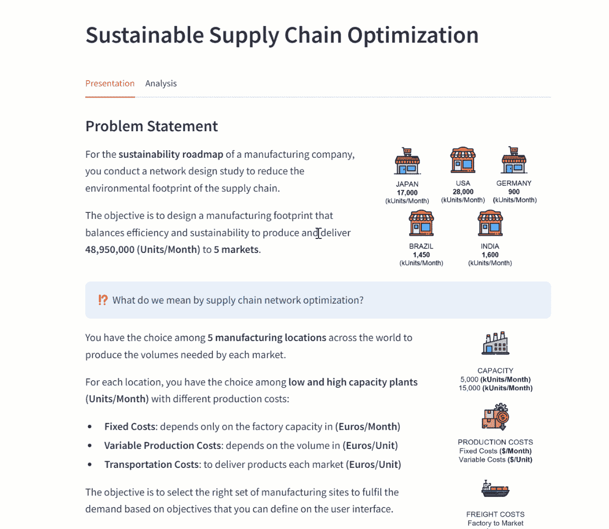

用户界面演示：[在此测试](https://bit.ly/try-logigreen-app) – (图片由萨米尔·萨奇提供)

该模块可供测试：[测试应用](https://bit.ly/try-logigreen-app)

> 如何在利益相关者之间达成共识？

为了证明我的观点，我使用了**极端示例，我们将目标函数**设置为最小化二氧化碳排放或用水量。

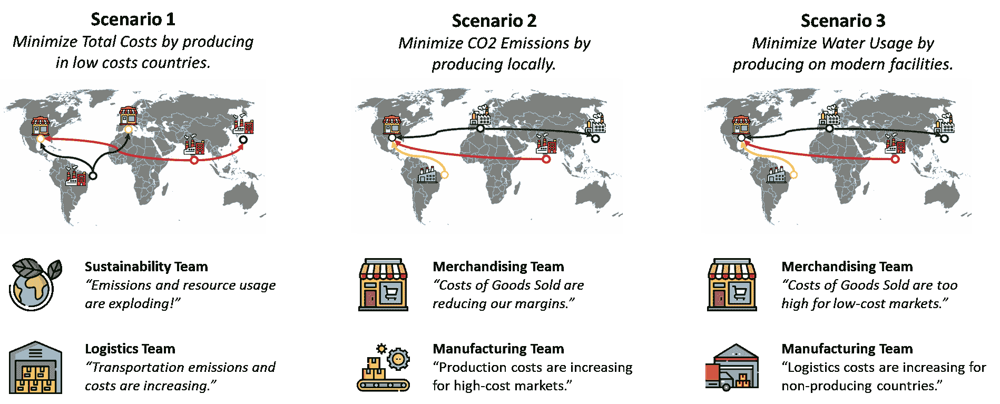

本案例研究中使用的极端示例 – (图片由 Samir Saci 提供)

因此，我们得到的是不可行的解决方案。

使用该应用，你可以进行保持**成本效率目标**并**添加可持续性约束**的练习，

+   每单位产品产生的二氧化碳排放量应低于 XX (kgCO2eq)

+   每单位产品用水量

这（可能）提供更合理的解决方案，可能导致达成共识。

> 物流运营：我们需要支持来实现这一转型。

### 接下来是什么？

你对可持续性路线图的贡献可以大于仅仅为网络设计研究提供见解。

在这篇博客中，我分享了几个使用分析来设计和实施贯穿整个价值链的可持续性倡议的案例研究。

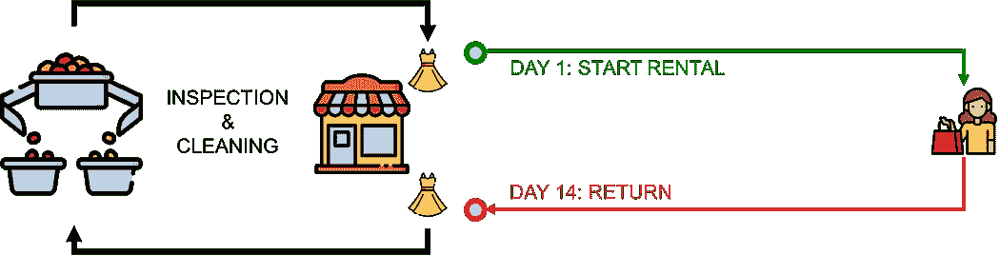

实施循环经济的示例：实施循环经济 – (图片由 Samir Saci 提供)

例如，你可以通过估算你在商店租用产品的影響来为实施循环经济做出贡献。

> 循环经济是一种旨在最小化浪费和最大化资源效率的经济模式。

在一个详细的案例研究中，我展示了一个用于模拟覆盖 10 家商店中租用的 3,300 个独特物品的物流流程的模型。

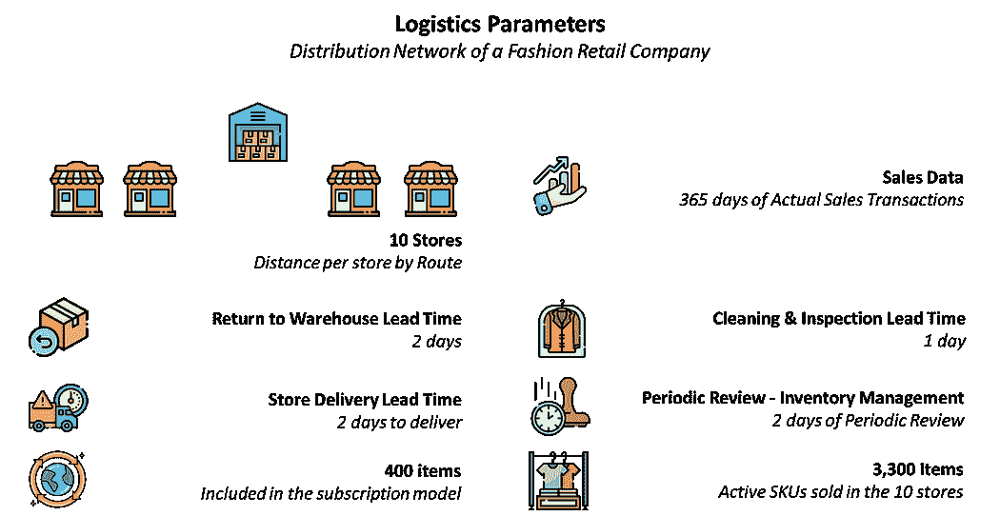

模拟参数 – (图片由 Samir Saci 提供)

结果显示，你可以为目录中的一些参考项**减少 90%的排放**。

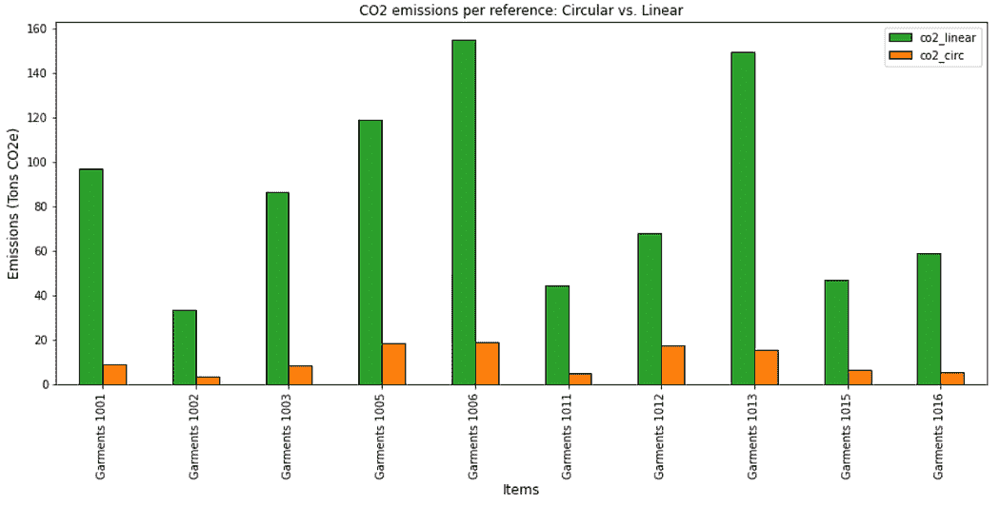

二氧化碳排放量减少的示例 – (图片由 Samir Saci 提供)

这些见解可以说服管理层投资实施支持该模型所需的额外物流流程。

更多信息，请查看完整文章

> [**可持续性数据科学 – 模拟循环经济**](https://www.samirsaci.com/how-sustainable-is-your-circular-economy/)

## 关于我

让我们在[LinkedIn](https://www.linkedin.com/in/samir-saci)和[Twitter](https://x.com/Samir_Saci_)上建立联系。我是一个供应链数据科学家，使用数据分析来改进物流运营并降低成本。

如果你需要供应链转型的咨询或建议，请通过[Logigreen Consulting](https://www.logi-green.com/)联系我。

如果你对数据分析和企业供应链感兴趣，请访问我的网站。

> [**Samir Saci | 数据科学 & 生产力**](https://samirsaci.com/)
