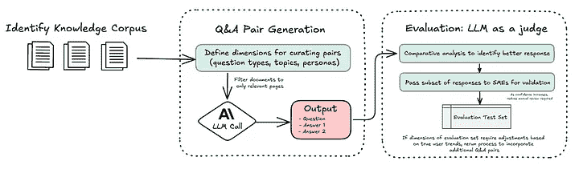
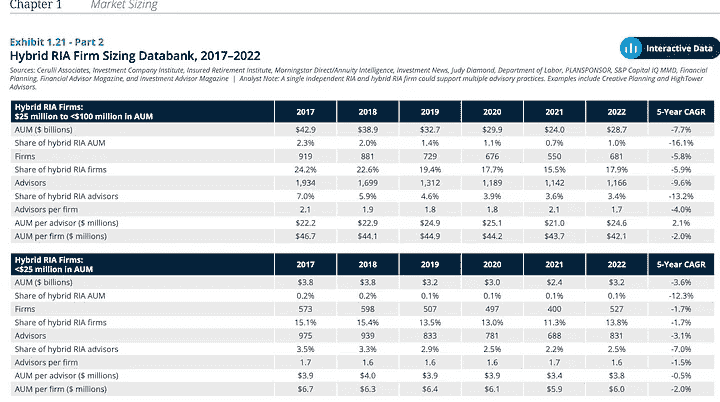

# 使用 LLM 进行合成数据生成

> 原文：[`towardsdatascience.com/synthetic-data-generation-with-llms/`](https://towardsdatascience.com/synthetic-data-generation-with-llms/)

## **RAG 的流行度**

在过去两年与金融公司合作的过程中，我亲眼目睹了他们如何识别和优先考虑生成式 AI 用例，在复杂性和潜在价值之间取得平衡。

**检索增强生成**（RAG）通常在许多由大型语言模型（LLM）驱动的解决方案中作为一个基础能力脱颖而出，它在实施便捷性和实际影响之间取得了平衡。通过结合一个能够呈现相关文档的**检索器**和一个能够综合响应的**LLM**，RAG**简化了知识获取**，对于客户支持、研究和内部知识管理等应用来说极为宝贵。

明确定义评估标准对于确保 LLM 解决方案达到性能标准至关重要，正如测试驱动开发（TDD）确保传统软件的可靠性一样。**借鉴 TDD 原则，一种以评估为导向的方法设定可衡量的基准，以验证和改进 AI 工作流程**。这对于 LLM 尤为重要，因为开放式响应的复杂性要求进行一致且深思熟虑的评估，以提供可靠的结果。

对于 RAG 应用，典型的评估集包括与预期用例相一致的代表性输入-输出对。例如，在聊天机器人应用中，这可能涉及反映用户查询的问答对。在其他情况下，如检索和总结相关文本，评估集可能包括源文档以及预期的摘要或提取的关键点。这些对通常来自文档的子集，例如那些最常查看或频繁访问的文档，确保评估集中在最相关的内容上。

## **主要挑战**

为 RAG 系统创建评估数据集传统上面临两大挑战。

1.  该过程通常依赖于主题专家（SMEs）手动审查文档并生成问答对，这使得它**耗时、不一致且成本高昂**。

1.  阻碍 LLM 处理文档中视觉元素（如表格或图表）的限制，因为它们仅限于处理文本。**标准 OCR 工具难以弥合这一差距**，通常无法从非文本内容中提取有意义的信息。

## **多模态能力**

随着基础模型中多模态能力的引入，处理复杂文档的挑战也随之演变。商业和开源模型现在可以**处理文本和视觉内容**。这种视觉能力消除了单独的文本提取工作流程的需求，为处理混合媒体 PDF 提供了一个集成方法。

通过利用这些视觉功能，**模型可以一次性处理整个页面，识别布局结构、图表标签和表格内容**。这不仅减少了人工工作量，还提高了可扩展性和数据质量，使其成为依赖来自各种来源的准确信息的 RAG 工作流程的有力推动者。

* * *

## **财富管理研究报告数据集整理**

为了展示手动评估集生成问题的解决方案，我使用了一份样本文档——2023 年 Cerulli 报告。**这类文档在财富管理中很典型，分析师风格的报告通常结合文本和复杂的视觉元素**。对于由 RAG 驱动的搜索助手，这样的知识库可能包含许多此类文档。

我的目的是**展示如何利用单一文档生成问答对，结合文本和视觉元素**。虽然我没有为这次测试定义问答对的具体维度，但现实世界的实施将涉及提供关于问题类型（比较、分析、多项选择）、主题（投资策略、账户类型）等多个方面的详细信息。这次实验的主要重点是确保大型语言模型生成的包含视觉元素的问答，并产生可靠的答案。



POC 工作流程

我的流程，如图中所示，利用了 Anthropic 的 Claude Sonnet 3.5 模型，该模型通过在将文档传递给模型之前将其转换为图像来简化处理 PDF 的过程。这种**内置功能消除了对额外第三方依赖的需求，简化了工作流程并减少了代码复杂性**。

我排除了报告的初步页面，如目录和术语表，专注于包含相关内容和图表的页面，用于生成问答对。以下是生成初始问答集时使用的提示。

```py
You are an expert at analyzing financial reports and generating question-answer pairs. For the provided PDF, the 2023 Cerulli report:<br><br>1\. Analyze pages {start_idx} to {end_idx} and for **each** of those 10 pages:<br>   - Identify the **exact page title** as it appears on that page (e.g., "Exhibit 4.03 Core Market Databank, 2023").<br>   - If the page includes a chart, graph, or diagram, create a question that references that visual element. Otherwise, create a question about the textual content.<br>   - Generate two distinct answers to that question ("answer_1" and "answer_2"), both supported by the page’s content.<br>   - Identify the correct page number as indicated in the bottom left corner of the page.<br>2\. Return exactly 10 results as a valid JSON array (a list of dictionaries). Each dictionary should have the keys: “page” (int), “page_title” (str), “question” (str), “answer_1” (str), and “answer_2” (str). The page title typically includes the word "Exhibit" followed by a number.
```

## **问答对生成**

为了细化问答生成过程，我实施了一种**比较学习方法**，为每个问题生成两个不同的答案。在评估阶段，这些答案在关键维度（如准确性、清晰度）上进行评估，选择更强的回答作为最终答案。

这种方法反映了人类在比较替代方案时比单独评估某事物时更容易做出决策的情况。就像眼科检查一样：验光师不会问你的视力是否有所改善或下降，而是展示两个镜片并问，哪个更清晰，选项 1 还是选项 2？这种比较过程**消除了评估绝对改进的模糊性，并专注于相对差异**，使选择更简单、更易于执行。同样，通过展示两个具体的答案选项，系统可以更有效地评估哪个回答更强。

这种方法也被引用为 AI 领域领导者撰写的文章《“从一年使用 LLM 构建中我们学到了什么”》（https://www.oreilly.com/radar/what-we-learned-from-a-year-of-building-with-llms-part-i/）中的最佳实践。他们强调了成对比较的价值，指出：“**与其让 LLM 在李克特量表上对单个输出进行评分，不如提供两个选项并要求它选择更好的一个。这往往会导致更稳定的结果**。”我强烈推荐阅读他们的三部曲，因为它提供了关于如何使用 LLM 构建有效系统的宝贵见解！

## **LLM 评估**

为了评估生成的问答对，我使用了 Claude Opus，因为它具有先进的推理能力。作为“裁判”，**大型语言模型（LLM）比较了每个问题生成的两个答案，并根据直接性和清晰度等标准选择更好的选项**。这种做法得到了广泛的研究（Zheng et al., 2023）的支持，这些研究展示了 LLM 可以与人类审稿人相媲美的评估能力。

这种方法**显著减少了 SMEs 所需的手动审查量**，使过程更加可扩展和高效。虽然 SMEs 在初始阶段对于检查问题和验证系统输出仍然是必不可少的，但随着时间的推移，这种依赖性会减少。一旦对系统性能建立了足够的信心，频繁的检查需求就会减少，使 SMEs 能够专注于更高价值的工作。

### **经验教训**

Claude 的 PDF 功能限制为 100 页，所以我将原始文档分成了四个 50 页的部分。当我尝试一次性处理每个 50 页的部分，并明确指示模型每页生成一个问答对时，它仍然错过了一些页面。问题不在于令牌限制；模型往往关注它认为最相关的任何内容，导致某些页面代表性不足。

为了解决这个问题，我尝试了以较小的批次处理文档，一次测试 5、10 和 20 页。通过这些测试，我发现 10 页的批次（例如，第 1-10 页，第 11-20 页等）在精确性和效率之间提供了最佳平衡。每批处理 10 页确保了所有页面的结果一致，同时优化了性能。

另一个挑战是将问答对链接回其来源。仅使用 PDF 页脚中的小页码并不总是有效。相比之下，每页顶部的标题或清晰的标题作为可靠的锚点。它们更容易被模型识别，并帮助我准确地将每个问答对映射到正确的部分。

## **示例输出**

下面是报告中的一个示例页面，其中包含两个包含数值数据的表格。为这个页面生成了以下问题：

**不同规模的混合 RIA 公司中 AUM 的分布是如何变化的？**



**答案**：中型公司（25 百万至<100 百万）的资产管理规模（AUM）占比从 2.3%下降到 1.0%。

在第一张表中，2017 年列显示中型公司（规模中等）的资产管理规模（AUM）占比为 2.3%，到 2022 年降至 1.0%，从而展示了大型语言模型（LLM）准确综合视觉和表格内容的能力。

## **好处**

结合缓存、批处理和精细化的问答工作流程，带来了三个关键优势：

**缓存**

+   在我的实验中，不使用缓存处理单个报告的成本将是 9 美元，但通过利用缓存，我将这个成本降至 3 美元——**节省了 3 倍的成本**。根据 Anthropic 的定价模型，创建缓存每百万标记的成本为 3.75 美元，然而，从缓存中读取的成本仅为每百万标记 0.30 美元。相比之下，如果不使用缓存，输入标记的成本为每百万标记 3 美元。

+   在实际场景中，如果有多个文档，节省将更加显著。例如，处理 10,000 篇长度相似的报告而不使用缓存，仅输入成本就会达到 90,000 美元。使用缓存后，这个成本降至 30,000 美元，实现了相同的精度和质量，同时节省了**60,000 美元**。

**折扣批量处理**

+   使用 Anthropic 的 Batches API 可以将输出成本减半，这使得它成为某些任务的更经济选择。一旦我验证了提示，我就运行了一个批量作业来一次性评估所有问答答案集。这种方法证明比逐个处理问答对更加经济高效。

+   例如，Claude 3 Opus 通常每百万输出标记的成本为 15 美元。通过使用批量处理，这个价格降至每百万标记 7.50 美元——**降低了 50%**。在我的实验中，每个问答对平均生成 100 个标记，因此文档的输出标记数约为 20,000。按照标准费率，这将花费 0.30 美元。使用批量处理，成本降至 0.15 美元，突显了这种方法如何优化非顺序任务（如评估运行）的成本。

**为中小企业节省时间**

+   通过更准确、内容丰富的问答对，主题专家（SMEs）花费更少的时间筛选 PDF 文件和澄清细节，有更多时间专注于战略洞察。这种方法还消除了雇佣额外人员或分配内部资源手动整理数据集的需求，这个过程可能既耗时又昂贵。通过自动化这些任务，公司可以显著节省劳动力成本，同时简化 SME 工作流程，使其成为一种可扩展且成本效益高的解决方案。
