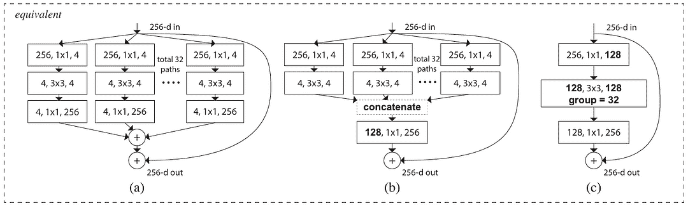
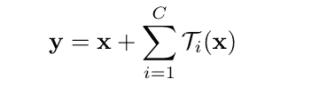
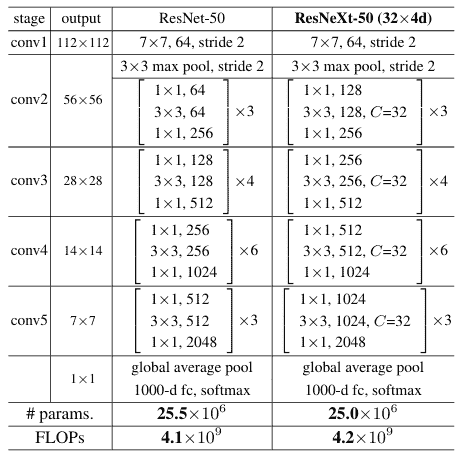

# ResNeXt 论文解读：将 ResNet 提升到下一个层次

> 原文：[`towardsdatascience.com/taking-resnet-to-the-next-level/`](https://towardsdatascience.com/taking-resnet-to-the-next-level/)

## <mdspan datatext="el1751515760765" class="mdspan-comment">简介</mdspan>

如果你阅读了这篇文章的标题，你可能可能会想 ResNeXt 是直接从 ResNet 派生出来的。这是真的，但我认为这并不完全准确。事实上，对我来说，ResNeXt 更像是 ResNet、VGG 和 Inception 的结合——我将在下一秒告诉你原因。在这篇文章中，我们将讨论 ResNeXt 架构，包括其历史、架构本身的细节，以及最后但同样重要的是，使用 PyTorch 从头开始实现的代码。

* * *

## ResNeXt 的历史

当调整神经网络模型时，我们通常关注的超参数是深度和宽度，分别对应于层数和通道数。我们在 VGG 和 ResNet 中看到了这一点，两个模型的作者提出了小型核和跳跃连接，以便他们可以轻松增加模型的深度。从理论上讲，这种方法确实能够扩展模型容量。然而，这两个超参数维度总是与参数数量的显著变化相关联，这无疑是一个问题，因为到了某个时候，我们的模型可能仅仅为了在精度上略有提高而变得过大。另一方面，我们知道从理论上讲，Inception 在计算上更便宜，但它有一个复杂的架构设计，这要求我们投入更多精力来调整这个网络的深度和宽度。如果你曾经了解过 Inception，它本质上是通过通过几个不同核大小的卷积层传递张量，让网络决定哪一个更适合表示特定任务的特性。

谢等人想知道他们是否能够提取三个模型中的最佳部分，以便模型调整可以像 VGG 和 ResNet 一样更容易，同时仍然保持 Inception 的效率。他们所有的想法都包含在一篇题为“*深度神经网络聚合残差变换*”的论文中[1]，其中他们将网络命名为*ResNeXt*。这就是所谓的*基数*这一新概念产生的根本原因，它本质上采用了 Inception 的想法，即通过多个分支传递张量，但以一种更简单、更可扩展的方式。我们可以将基数视为一个新参数，除了深度和宽度之外，还可以对其进行调整。通过这样做，我们现在本质上有了*下一个*超参数维度——因此得名*ResNeXt*——这使我们能够在参数调整方面拥有更高的自由度。

* * *

## ResNeXt 模块

根据论文，我们可以用三种方式来实现基数，您可以在下面的图 1 中看到。论文还提到，将基数设置为 32 是最佳实践，因为它通常在准确性和计算复杂度之间提供了良好的平衡，所以我会用这个数字来解释下面的例子。



图 1. 三个 ResNeXt 模块变体[1]。

上述三个模块的输入完全相同，即一个具有 256 个通道的图像张量。在变体（a）中，输入张量被复制了 32 次，每个副本将独立处理以表示 32 条路径。每条路径中的第一个卷积层负责使用 1×1 核将 256 通道的图像投影到 4 个通道，随后是两个额外的层：一个保持通道数量的 3×3 卷积层，以及一个将通道扩展回 256 的 1×1 卷积层。然后，来自 32 个分支的张量通过逐元素求和进行聚合，最终再次与模块一开始的原始输入张量相加，通过跳跃连接实现。

记住，Inception 使用了*split-transform-merge*的概念。这正是我刚才解释的 ResNeXt 块变体（a）中的情况，其中*split*是在第一个 1×1 卷积层之前进行的，*transform*在每个分支内部执行，而*merge*是逐元素求和操作。这个想法也适用于 ResNeXt 模块变体（b），在这种情况下，*merge*操作是通过通道拼接来执行的，结果得到一个 128 通道的图像（由 4 个通道×32 条路径组成）。然后，通过 1×1 卷积层将得到的张量投影回原始维度，最终与原始输入张量相加。

注意到上图左上角有一个单词 *equivalent*。这意味着这三个 ResNeXt 块变体在参数数量、FLOPs 和最终准确度得分方面基本上是相似的。这个概念是有意义的，因为它们基本上都源自相同的数学公式。我将在后续部分详细讨论这一点。尽管存在这种等价性，但在实现部分我仍将选择选项 (c)。这是因为这个变体采用了所谓的 *分组卷积*，这比 (a) 和 (b) 更容易实现。如果你还不熟悉这个术语，它本质上是一种卷积操作中的技术，其中我们将所有输入通道分成几个组，每个组中的每个通道负责在最终连接之前处理同一组内的通道。在 (c) 的情况下，我们在分割之前将通道数量从 256 减少到 128，从而让我们有 32 个卷积核组，每个组负责处理 4 个通道。然后我们将张量投影回原始的通道数量，以便我们可以将其与原始输入张量相加。

### 数学定义

如我之前提到的，下面是 ResNeXt 模块的正式数学定义。



图 2. ResNeXt 模块的数学表达式 [1]。

上述方程封装了整个 *分割-变换-合并* 操作，其中 *x* 是原始输入张量，*y* 是输出张量，*C* 是基数参数，用于确定使用的并行路径数量，*T* 是应用于每个路径的变换函数，而 *∑* 表示我们将合并来自变换张量的所有信息。然而，需要注意的是，尽管 sigma 通常表示求和，但只有 (a) 实际上对张量进行求和。同时，(b) 和 (c) 通过连接后跟 1×1 卷积来完成合并，这实际上仍然等同于 (a)。

### 整个 ResNeXt 架构

图 1 中显示的结构和图 2 中的方程基本上只对应一个 ResNeXt 块。为了构建整个架构，我们需要按照图 3 中的结构多次堆叠该块。



图 3. ResNet-50 架构和 ResNeXt-50 (32×4d) 对应版本 [1]。

在这里，你可以看到 ResNeXt 的结构几乎与 ResNet 完全相同。所以，我相信你会在以后发现 ResNeXt 的实现非常容易，尤其是如果你之前已经实现过 ResNet。你可能会注意到的第一个架构差异是每个块中前两个卷积层的内核数量，其中 ResNeXt 块通常比相应的 ResNet 块多一倍内核，特别是从 *conv2* 阶段一直到 *conv5* 阶段。其次，很明显，我们在每个 ResNeXt 块的第二卷积层应用了基数参数。

上文中实现的 ResNeXt 变体，相当于 ResNet-50，被称为 *ResNeXt-50 (32×4d)*。这种命名约定表明，这个变体在主分支中有 50 层，每条路径在 *conv2* 阶段有 32 个基数和 4 个通道数。截至本文写作时，PyTorch 中已经实现了三种 ResNeXt 变体，分别是 *resnext50_32x4d*、*resnext101_32x8d* 和 *resnext101_64x4d* [2]。如果你想要导入它们并使用预训练的权重，那肯定可以轻松做到。然而，在这篇文章中，我们将从头开始实现架构。

* * *

## ResNeXt 实现

我们已经理解了 ResNeXt 的底层理论，现在让我们动手编写代码！我们首先做的是导入所需的模块，如下面的代码块 1 所示。

```py
# Codeblock 1
import torch
import torch.nn as nn
from torchinfo import summary
```

我将实现 *ResNeXt-50 (32×4d)* 变体。因此，我需要根据图 3 中显示的架构细节在代码块 2 中设置参数。

```py
# Codeblock 2
CARDINALITY  = 32              #(1)
NUM_CHANNELS = [3, 64, 256, 512, 1024, 2048]  #(2)
NUM_BLOCKS   = [3, 4, 6, 3]    #(3)
NUM_CLASSES  = 1000            #(4)
```

第 `#(1)` 行的 `CARDINALITY` 变量是显而易见的，所以我认为没有必要进一步解释。接下来，`NUM_CHANNELS` 变量用于存储每个阶段的输出通道数，除了索引 0，它对应于输入通道数 (`#(2)`)。在第 `#(3)` 行，`NUM_BLOCKS` 用于确定我们将重复相应块多少次。请注意，我们没有为 *conv1* 阶段指定任何数字，因为这个阶段只包含一个块。最后在这里，我们将 `NUM_CLASSES` 参数设置为 1000，因为 ResNeXt 是在 ImageNet-1K 数据集上预训练的 (`#(4)`)。

### ResNeXt 模块

由于整个 ResNeXt 架构基本上只是一系列 ResNeXt 模块，我们可以创建一个单独的类来定义模块，并在主类中重复使用它。在这种情况下，我将该模块称为 `Block`。这个类的实现相当长，所以我决定将其分解成几个代码块。如果你想要运行代码，请确保相同编号的所有代码块都放置在同一个笔记本单元中。

你可以在下面的代码块 3a 中看到，这个类的`__init__()`方法接受几个参数。`in_channels`参数（`#(1)`）用于设置要传递到块的张量的通道数。我将其设置为可调整的，因为不同阶段的块将有不同的输入形状。其次，`add_channel`和`downsample`参数（`#(2,4)`）是标志，用于控制块是否执行下采样。如果你仔细观察图 3，你会注意到，每次我们从一级移动到另一级时，块的输出通道数是前一级的两倍，同时空间维度减半。当我们从一个阶段移动到下一个阶段时，我们需要将`add_channel`和`downsample`都设置为`True`。否则，如果我们只从一个块移动到同一阶段内的另一个块，我们将这两个参数设置为`False`。另一方面，`channel_multiplier`参数（`#(3)`）用于通过改变乘数来确定输出通道数相对于输入通道数的数量。这个参数很重要，因为有一个特殊情况，我们需要将输出通道数增加到四倍而不是两倍，即当我们从*conv1*阶段（64）移动到*conv2*阶段（256）时。

```py
# Codeblock 3a
  class Block(nn.Module):
      def __init__(self, 
                   in_channels,            #(1)
                   add_channel=False,      #(2)
                   channel_multiplier=2,   #(3)
                   downsample=False):      #(4)
          super().__init__()

        self.add_channel = add_channel
        self.channel_multiplier = channel_multiplier
        self.downsample = downsample

        if self.add_channel:             #(5)
            out_channels = in_channels*self.channel_multiplier  #(6)
        else:
            out_channels = in_channels   #(7) 

        mid_channels = out_channels//2   #(8).

        if self.downsample:      #(9)
            stride = 2           #(10)
        else:
            stride = 1
```

我们刚才讨论的参数直接控制第`#(5)`行和`#(9)`行的`if`语句。前者将在`add_channel`为`True`时执行，在这种情况下，输入通道的数量将乘以`channel_multiplier`以获得输出通道的数量（`#(6)`）。同时，如果它是`False`，我们将使输入和输出张量的维度相同（`#(7)`）。在这里，我们将`mid_channels`设置为`out_channels`大小的一半（`#(8)`）。这是因为根据图 3，每个块中前两个卷积层的通道数是第三个卷积层的一半。接下来，我们之前定义的`downsample`标志用于控制第`#(9)`行的`if`语句。每当它设置为`True`时，它将把`stride`变量设置为 2（`#(10)`），这将在之后导致卷积层将图像的空间维度减半。

仍然在`__init__()`方法中，现在让我们定义 ResNeXt 块内的层。请参见下面的代码块 3b 以获取详细信息。

```py
# Codeblock 3b
        if self.add_channel or self.downsample:               #(1)
            self.projection = nn.Conv2d(in_channels=in_channels,    #(2) 
                                        out_channels=out_channels, 
                                        kernel_size=1, 
                                        stride=stride, 
                                        padding=0, 
                                        bias=False)
            nn.init.kaiming_normal_(self.projection.weight, nonlinearity='relu')
            self.bn_proj = nn.BatchNorm2d(num_features=out_channels)

        self.conv0 = nn.Conv2d(in_channels=in_channels,       #(3)
                               out_channels=mid_channels,     #(4)
                               kernel_size=1, 
                               stride=1, 
                               padding=0, 
                               bias=False)
        nn.init.kaiming_normal_(self.conv0.weight, nonlinearity='relu')
        self.bn0 = nn.BatchNorm2d(num_features=mid_channels)

        self.conv1 = nn.Conv2d(in_channels=mid_channels,      #(5)
                               out_channels=mid_channels, 
                               kernel_size=3, 
                               stride=stride,                 #(6)
                               padding=1, 
                               bias=False, 
                               groups=CARDINALITY)            #(7)
        nn.init.kaiming_normal_(self.conv1.weight, nonlinearity='relu')
        self.bn1 = nn.BatchNorm2d(num_features=mid_channels)

        self.conv2 = nn.Conv2d(in_channels=mid_channels,      #(8)
                               out_channels=out_channels,     #(9)
                               kernel_size=1, 
                               stride=1, 
                               padding=0, 
                               bias=False)
        nn.init.kaiming_normal_(self.conv2.weight, nonlinearity='relu')
        self.bn2 = nn.BatchNorm2d(num_features=out_channels)

        self.relu = nn.ReLU()
```

记住，存在一些情况，ResNeXt 模块的输出维度与输入维度不同。在这种情况下，在最后一步无法执行逐元素求和（参见图 1）。这就是为什么每当`add_channel`或`downsample`标志为`True`（`#(1)`）时，我们需要初始化一个`projection`层的原因。这个`projection`层（`#(2)`），它是一个 1×1 卷积，用于处理跳跃连接中的张量，以便输出形状将与主流程处理过的张量相匹配，从而允许它们相加。否则，如果我们想让 ResNeXt 模块保留张量维度，我们需要将两个标志都设置为`False`，这样投影层就不会被初始化，因为我们可以直接将跳跃连接与主流程中的张量相加。

ResNeXt 模块本身的主流程由三个卷积层组成，我分别称之为`conv0`、`conv1`和`conv2`，分别写在行`#(3)`、`#(5)`和`#(8)`。如果我们仔细观察这些层，我们可以看到`conv0`和`conv2`都负责调整通道数。在行`#(3)`和`#(4)`中，我们可以看到`conv0`将图像通道数从`in_channels`变为`mid_channels`，而`conv2`将其从`mid_channels`变为`out_channels`（`#(8-9)`）。另一方面，`conv1`层负责通过`stride`参数控制空间维度（`#(6)`），其值根据我们之前讨论的`dowsample`标志确定。此外，这个`conv1`层将通过分组卷积（`#(7)`）完成整个*split-transform-merge*过程，在 ResNeXt 的情况下对应于基数。

此外，在这里我们初始化了名为`bn_proj`、`bn0`、`bn1`和`bn2`的批量归一化层。在`forward()`方法中，我们将它们放置在相应的卷积层之后，遵循*Conv-BN-ReLU*结构，这是构建基于 CNN 的模型时的标准做法。不仅如此，请注意，在这里我们还在每个卷积层初始化后写入了`nn.init.kaiming_normal_()`。这实际上是为了确保初始层权重遵循论文中提到的 Kaiming 正态分布。

关于`__init__()`方法的所有内容就到这里，现在我们将继续到`forward()`方法，以实际定义 ResNeXt 模块的流程。请参见下面的代码块 3c。

```py
# Codeblock 3c
    def forward(self, x):
        print(f'original\t\t: {x.size()}')

        if self.add_channel or self.downsample:              #(1)
            residual = self.bn_proj(self.projection(x))      #(2)
            print(f'after projection\t: {residual.size()}')
        else:
            residual = x                                     #(3)
            print(f'no projection\t\t: {residual.size()}')

        x = self.conv0(x)    #(4)
        x = self.bn0(x)
        x = self.relu(x)
        print(f'after conv0-bn0-relu\t: {x.size()}')

        x = self.conv1(x)
        x = self.bn1(x)
        x = self.relu(x)
        print(f'after conv1-bn1-relu\t: {x.size()}')

        x = self.conv2(x)    #(5)
        x = self.bn2(x)
        print(f'after conv2-bn2\t\t: {x.size()}')

        x = x + residual
        x = self.relu(x)     #(6)
        print(f'after summation\t\t: {x.size()}')

        return x
```

在这里，你可以看到这个函数只接受`x`作为唯一输入，其中它基本上是由前面的 ResNeXt 块产生的张量。我在行`#(1)`写的`if`语句检查我们是否即将执行下采样。如果是这样，跳连接中的张量将通过`projection`层和相应的批量归一化层，最终存储在`residual`变量中（`#(2)`）。但如果不下采样，我们将把`residual`设置为与`x`完全相同（`#(3)`）。接下来，我们将使用从`conv0`（`#(4)`）到`conv2`（`#(5)`）的卷积层堆栈处理主张量`x`。重要的是要注意，`conv2`层的*Conv-BN-ReLU*结构略有不同，其中 ReLU 激活函数是在逐元素相加之后应用的（`#(6)`）。

现在，让我们测试我们刚刚创建的 ResNeXt 块，以确定我们是否正确实现了它。我将在这里测试三个条件，即当我们从一个阶段移动到另一个阶段时（将`add_channel`和`downsample`都设置为`True`），当我们从一个块移动到同一阶段内的另一个块时（`add_channel`和`downsample`都是`False`），以及当我们从*conv1*阶段移动到*conv2*阶段时（将`downsample`设置为`False`，将`add_channel`设置为`True`，并使用 4 个通道乘数）。

### 测试用例 1

下面的代码块 4 演示了第一个测试用例，在这里我模拟了*conv3*阶段的第一个块。如果你回到图 3，你会看到前一个阶段的输出是一个 256 通道的图像。因此，我们需要根据这个数字设置`in_channels`参数。同时，该阶段的 ResNeXt 块的输出有 512 个通道，空间维度为 28×28。这种张量形状转换实际上是我们设置两个标志为`True`的原因。在这里，我们假设通过网络传递的`x`张量是由*conv2*阶段产生的虚拟图像。

```py
# Codeblock 4
block = Block(in_channels=256, add_channel=True, downsample=True)
x = torch.randn(1, 256, 56, 56)

out = block(x)
```

以下展示的是输出结果的样子。在行`#(1)`中可以看到，我们的`projection`层成功地将张量投影到 512×28×28，这与主流程（`#(4)`）输出的张量形状完全匹配。行`#(2)`中的`conv0`层并没有改变张量的维度，因为在这种情况下，我们的`in_channels`和`mid_channels`是相同的。实际的空间下采样是由`conv1`层执行的，图像分辨率从 56×56 减少到 28×28（`#(3)`），这得益于设置为 2 的步长。然后，这个过程由`conv2`层继续，该层将通道数从 256 增加到 512（`#(4)`）。最后，这个张量将与投影的跳跃连接张量（`#(5)`）逐元素相加。就这样，我们成功地将我们的张量从 256×56×56 转换为 512×28×28。

```py
# Codeblock 4 Output
original             : torch.Size([1, 256, 56, 56])
after projection     : torch.Size([1, 512, 28, 28])    #(1)
after conv0-bn0-relu : torch.Size([1, 256, 56, 56])    #(2)
after conv1-bn1-relu : torch.Size([1, 256, 28, 28])    #(3)
after conv2-bn2      : torch.Size([1, 512, 28, 28])    #(4)
after summation      : torch.Size([1, 512, 28, 28])    #(5)
```

### 测试用例 2

为了演示第二个测试案例，这里我将模拟*conv3*阶段的内部块，输入是由同一阶段中前一个块生成的张量。在这种情况下，我们希望这个 ResNeXt 模块的输入和输出维度相同，因此我们需要将`add_channel`和`downsample`都设置为`False`。请参阅代码块 5 和下面的输出结果以获取详细信息。

```py
# Codeblock 5
block = Block(in_channels=512, add_channel=False, downsample=False)
x = torch.randn(1, 512, 28, 28)

out = block(x)
```

```py
# Codeblock 5 Output
original             : torch.Size([1, 512, 28, 28])
no projection        : torch.Size([1, 512, 28, 28])    #(1)
after conv0-bn0-relu : torch.Size([1, 256, 28, 28])    #(2)
after conv1-bn1-relu : torch.Size([1, 256, 28, 28])
after conv2-bn2      : torch.Size([1, 512, 28, 28])    #(3)
after summation      : torch.Size([1, 512, 28, 28])
```

如我之前所述，如果输入张量没有下采样，则不会使用投影层。这就是为什么在行`#(1)`中我们的跳过连接张量形状保持不变的原因。接下来，由于在这种情况下`mid_channels`是`out_channels`大小的一半，`conv0`层将通道数减少到 256。我们最终使用`*conv2*`层将通道数扩展回 512（`#(3)`）。此外，这种结构通常被称为*bottleneck*，因为它遵循*宽-窄-宽*的模式，这种模式最初在原始 ResNet 论文[3]中提出。

### 测试案例 3

第三个测试实际上是一个特殊情况，因为我们即将模拟*conv2*阶段的第一个块，其中我们需要将`add_channel`标志设置为`True`，而`downsample`设置为`False`。我们不想在卷积层中进行空间下采样，因为这是由 maxpooling 层完成的。此外，你还可以在图 3 中看到*conv1*阶段返回了一个 64 通道的图像。由于这个原因，我们需要将`channel_multiplier`参数设置为 4，因为我们希望随后的*conv2*阶段返回 256 通道。请参阅下面的代码块 6 中的详细信息。

```py
# Codeblock 6
block = Block(in_channels=64, add_channel=True, channel_multiplier=4, downsample=False)
x = torch.randn(1, 64, 56, 56)

out = block(x)
```

```py
# Codeblock 6 Output
original             : torch.Size([1, 64, 56, 56])
after projection     : torch.Size([1, 256, 56, 56])    #(1)
after conv0-bn0-relu : torch.Size([1, 128, 56, 56])    #(2)
after conv1-bn1-relu : torch.Size([1, 128, 56, 56])
after conv2-bn2      : torch.Size([1, 256, 56, 56])    #(3)
after summation      : torch.Size([1, 256, 56, 56])
```

从上面的输出结果中可以看出，ResNeXt 模块自动利用了`projection`层，在这种情况下，它成功地将 64×56×56 的张量转换为 256×56×56（`#(1)`）。在这里，你可以看到通道数扩展到原来的 4 倍，而空间维度保持不变。之后，我们将通道数减少到 128（`#(2)`），然后将其扩展回 256（`#(3)`）来模拟*bottleneck*机制。因此，我们现在可以在主流和由`projection`层产生的张量之间进行求和。

到目前为止，我们已经让 ResNeXt 模块正确地处理了三种情况。因此，我相信这个模块现在可以组装起来，实际上构建整个 ResNeXt 架构。

### 整个 ResNeXt 架构

由于接下来的 ResNeXt 类相当长，我将它拆分为两个代码块，以便更容易理解。在代码块 7a 的`__init__()`方法中，我们基本上需要使用我们之前创建的`Block`类来初始化 ResNeXt 模块。实现*conv3*（`#(9)`）、*conv4*（`#(12)`）和*conv5*（`#(15)`）阶段的方式相当直接，因为我们基本上只需要初始化`nn.ModuleList`内部的模块。记住，每个阶段内的第一个模块是一个下采样模块，而其余的模块并不打算执行下采样。由于这个原因，我们需要手动初始化第一个模块，将`add_channel`和`downsample`标志都设置为`True`（`#(10,13,16)`），而其余模块则使用循环初始化，循环根据`NUM_CHANNELS`列表中存储的数字进行迭代（`#(11,14,17)`）。

```py
# Codeblock 7a
class ResNeXt(nn.Module):
    def __init__(self):
        super().__init__()

        # conv1 stage  #(1)
        self.resnext_conv1 = nn.Conv2d(in_channels=NUM_CHANNELS[0],
                                       out_channels=NUM_CHANNELS[1],
                                       kernel_size=7,    #(2) 
                                       stride=2,         #(3)
                                       padding=3, 
                                       bias=False)
        nn.init.kaiming_normal_(self.resnext_conv1.weight, 
                                nonlinearity='relu')
        self.resnext_bn1 = nn.BatchNorm2d(num_features=NUM_CHANNELS[1])
        self.relu = nn.ReLU()
        self.resnext_maxpool1 = nn.MaxPool2d(kernel_size=3,    #(4)
                                             stride=2, 
                                             padding=1)

        # conv2 stage  #(5)
        self.resnext_conv2 = nn.ModuleList([
            Block(in_channels=NUM_CHANNELS[1],
                  add_channel=True,       #(6)
                  channel_multiplier=4,
                  downsample=False)       #(7)
        ])
        for _ in range(NUM_BLOCKS[0]-1):  #(8)
            self.resnext_conv2.append(Block(in_channels=NUM_CHANNELS[2]))

        # conv3 stage  #(9)
        self.resnext_conv3 = nn.ModuleList([Block(in_channels=NUM_CHANNELS[2],  #(10)
                                                  add_channel=True, 
                                                  downsample=True)])
        for _ in range(NUM_BLOCKS[1]-1):    #(11)
            self.resnext_conv3.append(Block(in_channels=NUM_CHANNELS[3]))

        # conv4 stage  #(12)
        self.resnext_conv4 = nn.ModuleList([Block(in_channels=NUM_CHANNELS[3],  #(13)
                                                  add_channel=True, 
                                                  downsample=True)])

        for _ in range(NUM_BLOCKS[2]-1):    #(14)
            self.resnext_conv4.append(Block(in_channels=NUM_CHANNELS[4]))

        # conv5 stage  #(15)
        self.resnext_conv5 = nn.ModuleList([Block(in_channels=NUM_CHANNELS[4],  #(16)
                                                  add_channel=True, 
                                                  downsample=True)])

        for _ in range(NUM_BLOCKS[3]-1):    #(17)
            self.resnext_conv5.append(Block(in_channels=NUM_CHANNELS[5]))

        self.avgpool = nn.AdaptiveAvgPool2d(output_size=(1,1))  #(18)

        self.fc = nn.Linear(in_features=NUM_CHANNELS[5],        #(19)
                            out_features=NUM_CLASSES)
```

如我们之前讨论的，*conv2*阶段（`#(5)`）有一点特别，因为这个阶段内的第一个模块确实增加了通道数，但并没有减少空间维度。这基本上是我将`add_channel`参数设置为`True`（`#(6)`）而将`downsample`参数设置为`False`（`#(7)`）的原因。剩余模块的初始化与其他阶段我们之前讨论的相同，我们可以通过一个简单的循环来完成它（`#(8)`）。

另一方面，*conv1*阶段（`#(1)`）没有使用`Block`类，因为其结构与其他阶段完全不同。根据图 3，这个阶段只包含一个 7×7 的卷积层（`#(2)`），这使我们能够从输入图像中捕获更大的上下文。由于`stride`参数设置为 2（`#(3)`），这个层产生的张量将具有输入一半的空间维度。进一步的下采样是通过具有相同步长的 maxpooling 层来执行的，这再次将空间维度减半（`#(4)`）。— 实际上，这个 maxpooling 层应该放在*conv2*阶段内部，但在这个实现中，我为了简单起见将其放在该阶段的`nn.ModuleList`外部。

最后，我们需要初始化一个全局平均池化层（`#(18)`），它通过取最后卷积层产生的张量中每个通道的平均值来工作。通过这样做，我们将得到一个代表每个通道的单个数字。这个张量随后将连接到输出层，该层产生`NUM_CLASSES`（1000）个神经元（`#(19)`），其中每一个都对应于数据集中的每个类别。

现在看看下面的代码块 7b，看看我是如何定义`forward()`方法的。我认为这里没有太多需要解释的，因为我们基本上只是按顺序将张量从一个层传递到下一个层。

```py
# Codeblock 7b
    def forward(self, x):
        print(f'original\t\t: {x.size()}')

        x = self.relu(self.resnext_bn1(self.resnext_conv1(x)))
        print(f'after resnext_conv1\t: {x.size()}')

        x = self.resnext_maxpool1(x)
        print(f'after resnext_maxpool1\t: {x.size()}')

        for i, block in enumerate(self.resnext_conv2):
            x = block(x)
            print(f'after resnext_conv2 #{i}\t: {x.size()}')

        for i, block in enumerate(self.resnext_conv3):
            x = block(x)
            print(f'after resnext_conv3 #{i}\t: {x.size()}')

        for i, block in enumerate(self.resnext_conv4):
            x = block(x)
            print(f'after resnext_conv4 #{i}\t: {x.size()}')

        for i, block in enumerate(self.resnext_conv5):
            x = block(x)
            print(f'after resnext_conv5 #{i}\t: {x.size()}')

        x = self.avgpool(x)
        print(f'after avgpool\t\t: {x.size()}')

        x = torch.flatten(x, start_dim=1)
        print(f'after flatten\t\t: {x.size()}')

        x = self.fc(x)
        print(f'after fc\t\t: {x.size()}')

        return x
```

接下来，让我们使用以下代码测试我们的 ResNeXt 类。这里我将通过传递一个大小为 3×224×224 的虚拟张量来测试它，这模拟了一个 224×224 大小的单个 RGB 图像。

```py
# Codeblock 8
resnext = ResNeXt()
x = torch.randn(1, 3, 224, 224)

out = resnext(x)
```

```py
# Codeblock 8 Output
original               : torch.Size([1, 3, 224, 224])
after resnext_conv1    : torch.Size([1, 64, 112, 112])  #(1)
after resnext_maxpool1 : torch.Size([1, 64, 56, 56])    #(2)
after resnext_conv2 #0 : torch.Size([1, 256, 56, 56])   #(3)
after resnext_conv2 #1 : torch.Size([1, 256, 56, 56])   #(4)
after resnext_conv2 #2 : torch.Size([1, 256, 56, 56])   #(5)
after resnext_conv3 #0 : torch.Size([1, 512, 28, 28])
after resnext_conv3 #1 : torch.Size([1, 512, 28, 28])
after resnext_conv3 #2 : torch.Size([1, 512, 28, 28])
after resnext_conv3 #3 : torch.Size([1, 512, 28, 28])
after resnext_conv4 #0 : torch.Size([1, 1024, 14, 14])
after resnext_conv4 #1 : torch.Size([1, 1024, 14, 14])
after resnext_conv4 #2 : torch.Size([1, 1024, 14, 14])
after resnext_conv4 #3 : torch.Size([1, 1024, 14, 14])
after resnext_conv4 #4 : torch.Size([1, 1024, 14, 14])
after resnext_conv4 #5 : torch.Size([1, 1024, 14, 14])
after resnext_conv5 #0 : torch.Size([1, 2048, 7, 7])
after resnext_conv5 #1 : torch.Size([1, 2048, 7, 7])
after resnext_conv5 #2 : torch.Size([1, 2048, 7, 7])
after avgpool          : torch.Size([1, 2048, 1, 1])    #(6)
after flatten          : torch.Size([1, 2048])          #(7)
after fc               : torch.Size([1, 1000])          #(8)
```

我们可以从上面的输出中看到，我们的 *conv1* 阶段正确地将空间维度从 224×224 减少到 112×112，同时还将通道数增加到 64 (`#(1)`). 通过最大池化层继续下采样，将图像的空间维度减少到 56×56 (`#(2)`). 接下来是 *conv2* 阶段，我们可以看到该阶段中的第一个块成功地将 64 通道图像转换为 256 (`#(3)`), 其中该阶段中后续的块保持了这个张量的维度 (`#(4–5)`). 同样的操作也在后续阶段中执行，直到我们达到全局平均池化层 (`#(6)`). 重要的是要注意，我们需要执行张量展平 (`#(7)`) 来删除空轴，然后再将其连接到输出层 (`#(8)`). 这样就完成了张量在 ResNeXt 架构中的流动过程。

此外，如果您想深入了解架构细节，可以使用我们之前从 `torchinfo` 加载的 `summary()` 函数。您可以在下面的输出末尾看到，我们总共获得了 25,028,904 个参数。实际上，这个参数数量与 PyTorch 的 *ResNeXt-50 32x4d* 模型的数量完全一致，因此我相信我们这里的实现是正确的。您可以在参考文献编号 [4] 的链接中验证这一点。

```py
# Codeblock 9
resnext = ResNeXt()
summary(resnext, input_size=(1, 3, 224, 224))
```

```py
# Codeblock 9 Output
==========================================================================================
Layer (type:depth-idx)                   Output Shape              Param #
==========================================================================================
ResNeXt                                  [1000]                    --
├─Conv2d: 1-1                            [1, 64, 112, 112]         9,408
├─BatchNorm2d: 1-2                       [1, 64, 112, 112]         128
├─ReLU: 1-3                              [1, 64, 112, 112]         --
├─MaxPool2d: 1-4                         [1, 64, 56, 56]           --
├─ModuleList: 1-5                        --                        --
│    └─Block: 2-1                        [1, 256, 56, 56]          --
│    │    └─Conv2d: 3-1                  [1, 256, 56, 56]          16,384
│    │    └─BatchNorm2d: 3-2             [1, 256, 56, 56]          512
│    │    └─Conv2d: 3-3                  [1, 128, 56, 56]          8,192
│    │    └─BatchNorm2d: 3-4             [1, 128, 56, 56]          256
│    │    └─ReLU: 3-5                    [1, 128, 56, 56]          --
│    │    └─Conv2d: 3-6                  [1, 128, 56, 56]          4,608
│    │    └─BatchNorm2d: 3-7             [1, 128, 56, 56]          256
│    │    └─ReLU: 3-8                    [1, 128, 56, 56]          --
│    │    └─Conv2d: 3-9                  [1, 256, 56, 56]          32,768
│    │    └─BatchNorm2d: 3-10            [1, 256, 56, 56]          512
│    │    └─ReLU: 3-11                   [1, 256, 56, 56]          --
│    └─Block: 2-2                        [1, 256, 56, 56]          --
│    │    └─Conv2d: 3-12                 [1, 128, 56, 56]          32,768
│    │    └─BatchNorm2d: 3-13            [1, 128, 56, 56]          256
│    │    └─ReLU: 3-14                   [1, 128, 56, 56]          --
│    │    └─Conv2d: 3-15                 [1, 128, 56, 56]          4,608
│    │    └─BatchNorm2d: 3-16            [1, 128, 56, 56]          256
│    │    └─ReLU: 3-17                   [1, 128, 56, 56]          --
│    │    └─Conv2d: 3-18                 [1, 256, 56, 56]          32,768
│    │    └─BatchNorm2d: 3-19            [1, 256, 56, 56]          512
│    │    └─ReLU: 3-20                   [1, 256, 56, 56]          --
│    └─Block: 2-3                        [1, 256, 56, 56]          --
│    │    └─Conv2d: 3-21                 [1, 128, 56, 56]          32,768
│    │    └─BatchNorm2d: 3-22            [1, 128, 56, 56]          256
│    │    └─ReLU: 3-23                   [1, 128, 56, 56]          --
│    │    └─Conv2d: 3-24                 [1, 128, 56, 56]          4,608
│    │    └─BatchNorm2d: 3-25            [1, 128, 56, 56]          256
│    │    └─ReLU: 3-26                   [1, 128, 56, 56]          --
│    │    └─Conv2d: 3-27                 [1, 256, 56, 56]          32,768
│    │    └─BatchNorm2d: 3-28            [1, 256, 56, 56]          512
│    │    └─ReLU: 3-29                   [1, 256, 56, 56]          --
├─ModuleList: 1-6                        --                        --
│    └─Block: 2-4                        [1, 512, 28, 28]          --
│    │    └─Conv2d: 3-30                 [1, 512, 28, 28]          131,072
│    │    └─BatchNorm2d: 3-31            [1, 512, 28, 28]          1,024
│    │    └─Conv2d: 3-32                 [1, 256, 56, 56]          65,536
│    │    └─BatchNorm2d: 3-33            [1, 256, 56, 56]          512
│    │    └─ReLU: 3-34                   [1, 256, 56, 56]          --
│    │    └─Conv2d: 3-35                 [1, 256, 28, 28]          18,432
│    │    └─BatchNorm2d: 3-36            [1, 256, 28, 28]          512
│    │    └─ReLU: 3-37                   [1, 256, 28, 28]          --
│    │    └─Conv2d: 3-38                 [1, 512, 28, 28]          131,072
│    │    └─BatchNorm2d: 3-39            [1, 512, 28, 28]          1,024
│    │    └─ReLU: 3-40                   [1, 512, 28, 28]          --
│    └─Block: 2-5                        [1, 512, 28, 28]          --
│    │    └─Conv2d: 3-41                 [1, 256, 28, 28]          131,072
│    │    └─BatchNorm2d: 3-42            [1, 256, 28, 28]          512
│    │    └─ReLU: 3-43                   [1, 256, 28, 28]          --
│    │    └─Conv2d: 3-44                 [1, 256, 28, 28]          18,432
│    │    └─BatchNorm2d: 3-45            [1, 256, 28, 28]          512
│    │    └─ReLU: 3-46                   [1, 256, 28, 28]          --
│    │    └─Conv2d: 3-47                 [1, 512, 28, 28]          131,072
│    │    └─BatchNorm2d: 3-48            [1, 512, 28, 28]          1,024
│    │    └─ReLU: 3-49                   [1, 512, 28, 28]          --
│    └─Block: 2-6                        [1, 512, 28, 28]          --
│    │    └─Conv2d: 3-50                 [1, 256, 28, 28]          131,072
│    │    └─BatchNorm2d: 3-51            [1, 256, 28, 28]          512
│    │    └─ReLU: 3-52                   [1, 256, 28, 28]          --
│    │    └─Conv2d: 3-53                 [1, 256, 28, 28]          18,432
│    │    └─BatchNorm2d: 3-54            [1, 256, 28, 28]          512
│    │    └─ReLU: 3-55                   [1, 256, 28, 28]          --
│    │    └─Conv2d: 3-56                 [1, 512, 28, 28]          131,072
│    │    └─BatchNorm2d: 3-57            [1, 512, 28, 28]          1,024
│    │    └─ReLU: 3-58                   [1, 512, 28, 28]          --
│    └─Block: 2-7                        [1, 512, 28, 28]          --
│    │    └─Conv2d: 3-59                 [1, 256, 28, 28]          131,072
│    │    └─BatchNorm2d: 3-60            [1, 256, 28, 28]          512
│    │    └─ReLU: 3-61                   [1, 256, 28, 28]          --
│    │    └─Conv2d: 3-62                 [1, 256, 28, 28]          18,432
│    │    └─BatchNorm2d: 3-63            [1, 256, 28, 28]          512
│    │    └─ReLU: 3-64                   [1, 256, 28, 28]          --
│    │    └─Conv2d: 3-65                 [1, 512, 28, 28]          131,072
│    │    └─BatchNorm2d: 3-66            [1, 512, 28, 28]          1,024
│    │    └─ReLU: 3-67                   [1, 512, 28, 28]          --
├─ModuleList: 1-7                        --                        --
│    └─Block: 2-8                        [1, 1024, 14, 14]         --
│    │    └─Conv2d: 3-68                 [1, 1024, 14, 14]         524,288
│    │    └─BatchNorm2d: 3-69            [1, 1024, 14, 14]         2,048
│    │    └─Conv2d: 3-70                 [1, 512, 28, 28]          262,144
│    │    └─BatchNorm2d: 3-71            [1, 512, 28, 28]          1,024
│    │    └─ReLU: 3-72                   [1, 512, 28, 28]          --
│    │    └─Conv2d: 3-73                 [1, 512, 14, 14]          73,728
│    │    └─BatchNorm2d: 3-74            [1, 512, 14, 14]          1,024
│    │    └─ReLU: 3-75                   [1, 512, 14, 14]          --
│    │    └─Conv2d: 3-76                 [1, 1024, 14, 14]         524,288
│    │    └─BatchNorm2d: 3-77            [1, 1024, 14, 14]         2,048
│    │    └─ReLU: 3-78                   [1, 1024, 14, 14]         --
│    └─Block: 2-9                        [1, 1024, 14, 14]         --
│    │    └─Conv2d: 3-79                 [1, 512, 14, 14]          524,288
│    │    └─BatchNorm2d: 3-80            [1, 512, 14, 14]          1,024
│    │    └─ReLU: 3-81                   [1, 512, 14, 14]          --
│    │    └─Conv2d: 3-82                 [1, 512, 14, 14]          73,728
│    │    └─BatchNorm2d: 3-83            [1, 512, 14, 14]          1,024
│    │    └─ReLU: 3-84                   [1, 512, 14, 14]          --
│    │    └─Conv2d: 3-85                 [1, 1024, 14, 14]         524,288
│    │    └─BatchNorm2d: 3-86            [1, 1024, 14, 14]         2,048
│    │    └─ReLU: 3-87                   [1, 1024, 14, 14]         --
│    └─Block: 2-10                       [1, 1024, 14, 14]         --
│    │    └─Conv2d: 3-88                 [1, 512, 14, 14]          524,288
│    │    └─BatchNorm2d: 3-89            [1, 512, 14, 14]          1,024
│    │    └─ReLU: 3-90                   [1, 512, 14, 14]          --
│    │    └─Conv2d: 3-91                 [1, 512, 14, 14]          73,728
│    │    └─BatchNorm2d: 3-92            [1, 512, 14, 14]          1,024
│    │    └─ReLU: 3-93                   [1, 512, 14, 14]          --
│    │    └─Conv2d: 3-94                 [1, 1024, 14, 14]         524,288
│    │    └─BatchNorm2d: 3-95            [1, 1024, 14, 14]         2,048
│    │    └─ReLU: 3-96                   [1, 1024, 14, 14]         --
│    └─Block: 2-11                       [1, 1024, 14, 14]         --
│    │    └─Conv2d: 3-97                 [1, 512, 14, 14]          524,288
│    │    └─BatchNorm2d: 3-98            [1, 512, 14, 14]          1,024
│    │    └─ReLU: 3-99                   [1, 512, 14, 14]          --
│    │    └─Conv2d: 3-100                [1, 512, 14, 14]          73,728
│    │    └─BatchNorm2d: 3-101           [1, 512, 14, 14]          1,024
│    │    └─ReLU: 3-102                  [1, 512, 14, 14]          --
│    │    └─Conv2d: 3-103                [1, 1024, 14, 14]         524,288
│    │    └─BatchNorm2d: 3-104           [1, 1024, 14, 14]         2,048
│    │    └─ReLU: 3-105                  [1, 1024, 14, 14]         --
│    └─Block: 2-12                       [1, 1024, 14, 14]         --
│    │    └─Conv2d: 3-106                [1, 512, 14, 14]          524,288
│    │    └─BatchNorm2d: 3-107           [1, 512, 14, 14]          1,024
│    │    └─ReLU: 3-108                  [1, 512, 14, 14]          --
│    │    └─Conv2d: 3-109                [1, 512, 14, 14]          73,728
│    │    └─BatchNorm2d: 3-110           [1, 512, 14, 14]          1,024
│    │    └─ReLU: 3-111                  [1, 512, 14, 14]          --
│    │    └─Conv2d: 3-112                [1, 1024, 14, 14]         524,288
│    │    └─BatchNorm2d: 3-113           [1, 1024, 14, 14]         2,048
│    │    └─ReLU: 3-114                  [1, 1024, 14, 14]         --
│    └─Block: 2-13                       [1, 1024, 14, 14]         --
│    │    └─Conv2d: 3-115                [1, 512, 14, 14]          524,288
│    │    └─BatchNorm2d: 3-116           [1, 512, 14, 14]          1,024
│    │    └─ReLU: 3-117                  [1, 512, 14, 14]          --
│    │    └─Conv2d: 3-118                [1, 512, 14, 14]          73,728
│    │    └─BatchNorm2d: 3-119           [1, 512, 14, 14]          1,024
│    │    └─ReLU: 3-120                  [1, 512, 14, 14]          --
│    │    └─Conv2d: 3-121                [1, 1024, 14, 14]         524,288
│    │    └─BatchNorm2d: 3-122           [1, 1024, 14, 14]         2,048
│    │    └─ReLU: 3-123                  [1, 1024, 14, 14]         --
├─ModuleList: 1-8                        --                        --
│    └─Block: 2-14                       [1, 2048, 7, 7]           --
│    │    └─Conv2d: 3-124                [1, 2048, 7, 7]           2,097,152
│    │    └─BatchNorm2d: 3-125           [1, 2048, 7, 7]           4,096
│    │    └─Conv2d: 3-126                [1, 1024, 14, 14]         1,048,576
│    │    └─BatchNorm2d: 3-127           [1, 1024, 14, 14]         2,048
│    │    └─ReLU: 3-128                  [1, 1024, 14, 14]         --
│    │    └─Conv2d: 3-129                [1, 1024, 7, 7]           294,912
│    │    └─BatchNorm2d: 3-130           [1, 1024, 7, 7]           2,048
│    │    └─ReLU: 3-131                  [1, 1024, 7, 7]           --
│    │    └─Conv2d: 3-132                [1, 2048, 7, 7]           2,097,152
│    │    └─BatchNorm2d: 3-133           [1, 2048, 7, 7]           4,096
│    │    └─ReLU: 3-134                  [1, 2048, 7, 7]           --
│    └─Block: 2-15                       [1, 2048, 7, 7]           --
│    │    └─Conv2d: 3-135                [1, 1024, 7, 7]           2,097,152
│    │    └─BatchNorm2d: 3-136           [1, 1024, 7, 7]           2,048
│    │    └─ReLU: 3-137                  [1, 1024, 7, 7]           --
│    │    └─Conv2d: 3-138                [1, 1024, 7, 7]           294,912
│    │    └─BatchNorm2d: 3-139           [1, 1024, 7, 7]           2,048
│    │    └─ReLU: 3-140                  [1, 1024, 7, 7]           --
│    │    └─Conv2d: 3-141                [1, 2048, 7, 7]           2,097,152
│    │    └─BatchNorm2d: 3-142           [1, 2048, 7, 7]           4,096
│    │    └─ReLU: 3-143                  [1, 2048, 7, 7]           --
│    └─Block: 2-16                       [1, 2048, 7, 7]           --
│    │    └─Conv2d: 3-144                [1, 1024, 7, 7]           2,097,152
│    │    └─BatchNorm2d: 3-145           [1, 1024, 7, 7]           2,048
│    │    └─ReLU: 3-146                  [1, 1024, 7, 7]           --
│    │    └─Conv2d: 3-147                [1, 1024, 7, 7]           294,912
│    │    └─BatchNorm2d: 3-148           [1, 1024, 7, 7]           2,048
│    │    └─ReLU: 3-149                  [1, 1024, 7, 7]           --
│    │    └─Conv2d: 3-150                [1, 2048, 7, 7]           2,097,152
│    │    └─BatchNorm2d: 3-151           [1, 2048, 7, 7]           4,096
│    │    └─ReLU: 3-152                  [1, 2048, 7, 7]           --
├─AdaptiveAvgPool2d: 1-9                 [1, 2048, 1, 1]           --
├─Linear: 1-10                           [1, 1000]                 2,049,000
==========================================================================================
Total params: 25,028,904
Trainable params: 25,028,904
Non-trainable params: 0
Total mult-adds (Units.GIGABYTES): 6.28
==========================================================================================
Input size (MB): 0.60
Forward/backward pass size (MB): 230.42
Params size (MB): 100.12
Estimated Total Size (MB): 331.13
==========================================================================================
```

* * *

## 结束

我认为这就是关于 ResNeXt 及其实现的所有内容了。您也可以在我的 GitHub 仓库 [5] 中找到本文中使用的全部代码。

我希望您今天学到了一些新东西，非常感谢您的阅读！我们下次文章再见。

* * *

## 参考文献

[1] Saining Xie *et al.* 深度神经网络聚合残差变换. Arxiv. [`arxiv.org/abs/1611.05431`](https://arxiv.org/abs/1611.05431) [访问日期：2025 年 3 月 1 日].

[2] ResNeXt. PyTorch. [`pytorch.org/vision/main/models/resnext.html`](https://pytorch.org/vision/main/models/resnext.html) [访问日期：2025 年 3 月 1 日].

[3] Kaiming He *et al.* 深度残差学习用于图像识别. Arxiv. [`arxiv.org/abs/1512.03385`](https://arxiv.org/abs/1512.03385) [访问日期：2025 年 3 月 1 日].

[4] resnext50_32x4d. PyTorch. [`pytorch.org/vision/main/models/generated/torchvision.models.resnext50_32x4d.html#torchvision.models.resnext50_32x4d`](https://pytorch.org/vision/main/models/generated/torchvision.models.resnext50_32x4d.html#torchvision.models.resnext50_32x4d) [访问日期：2025 年 3 月 1 日].

[5] MuhammadArdiPutra. 将 ResNet 提升至下一个层次——ResNeXt. GitHub. [`github.com/MuhammadArdiPutra/medium_articles/blob/main/Taking%20ResNet%20to%20the%20NeXt%20Level%20-%20ResNeXt.ipynb`](https://github.com/MuhammadArdiPutra/medium_articles/blob/main/Taking%20ResNet%20to%20the%20NeXt%20Level%20-%20ResNeXt.ipynb) [访问日期：2025 年 4 月 7 日].
