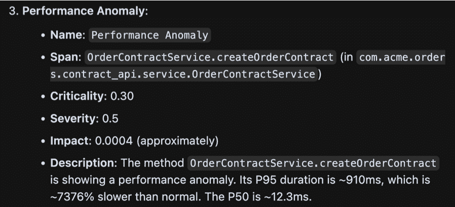
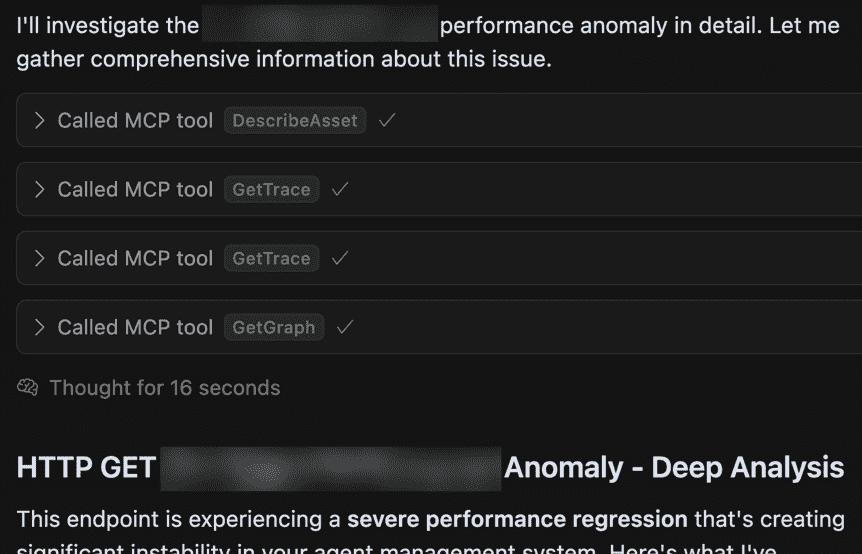
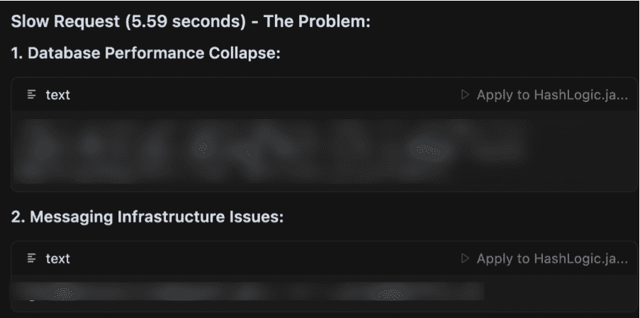

# 与我的代理交谈

> 原文：[`towardsdatascience.com/talk-to-my-agent/`](https://towardsdatascience.com/talk-to-my-agent/)

<mdspan datatext="el1753719328649" class="mdspan-comment">在过去几个月里，我有机会深入参与到为 LLM（特别是使用 MCP 协议的代理）消费 API 和后端系统的适配工作中。最初，我预期这次经历将与我在过去完成的任何其他类似开发项目没有区别。然而，我发现这些自主客户端是一种全新的生物。因此，为了从代理交互中获得最大价值，仅仅使 API 可访问是不够的。>

这篇文章是我实验和实地测试的结果，希望它对其他从业者有所帮助。

## 自主性的力量与诅咒


作者生成的图像（Midjourney）

我们开发者习惯于第三方工具和自动化流程与应用程序 API 的交互。因此，我们的接口已经围绕支持这些用例的最佳实践而演变。事务性、版本化、基于合同的 API，旨在强制执行向前/向后兼容性，并旨在提高效率。这些都是重要的考虑因素，在优先级上属于次要，在考虑自主用户时通常无关紧要。

以代理作为客户，无需担心向后/向前兼容性问题，因为每个会话都是无状态的且唯一的。每次模型发现新工具时，它都会学习如何使用这些工具，并找到实现其目标的正确 API 调用组合。然而，尽管这个代理可能非常热情，但如果在几次失败的尝试后没有得到适当的激励和指导，它也会放弃。

更重要的是，没有这样的线索，它可能在 API 调用中成功，但无法达到其目标。与脚本自动化或经验丰富的开发者不同，它只能依靠 API 文档和响应来规划如何实现其目标。其响应的动态性质既是祝福也是诅咒，因为这两个来源也是它为了有效而可以借鉴的知识总和。

## 驱动对话的 API

我最初意识到代理需要不同类型的设计，是在解决一些代理无法达到预期结果的情况时。我提供了一种访问 API 的工具，该 API 基于跟踪数据提供任何代码函数的使用信息。有时似乎代理只是没有正确使用它。更仔细地观察交互，似乎模型正确地调用了工具，但由于各种原因收到了一个空数组作为响应。这种行为对于我们 API 中的任何类似操作都是 100%正确的。

然而，代理在理解为什么会发生这种情况时遇到了困难。尝试了几种简单的变化后，它放弃了，决定转向其他探索途径。对我来说，这次互动揭示了错失的机会。没有人有错；从事务的角度来看，行为是正确的。所有相关的测试都会通过，但在衡量使用此 API 的有效性时，我们发现“成功率”极其低。

解决方案最终变得很简单，而不是返回一个空响应，我决定提供一套更详细的指示和想法：

```py
var emptyResult = new NoDataFoundResponse()
{
    Message = @"There was no info found based on the criteria sent.
        This could mean that the code is not called, or that it is not manually instrumented 
        using OTEL annotations.",
    SuggestedNextSteps = @"Suggested steps: 
    1\. Search for endpoints (http, consumers, jobs etc.) that use this function. 
       Endpoints are usually automatically instrumented with OTEL spans by the 
       libraries using them.
    2\. Try calling this tool using the method and class of the endpoint 
       itself or use the GetTraceForEndpoint tool with the endpoint route. 
    3\. Suggest manual instrumentation for the specific method depending on the language used in the project
       and the current style of instrumentation used (annotations, code etc.)"

};
```

我试图做的不仅仅是将结果返回给代理，我还试图做代理经常尝试的事情——保持对话。因此，我对 API 响应的看法也发生了变化。当被 LLMs 消费时，除了服务功能目的之外，它们本质上是一个**反向提示**。结束的交互是一个死胡同，然而，我们返回给代理的任何数据都给了它一个机会，在它的调查过程中拉扯另一条线索。

## HATEOAS，即“选择你的冒险”API


由作者生成的图像（Midjourney）

考虑到这种方法的哲学，我意识到它似乎有些似曾相识。很久以前，当我刚开始尝试构建现代 REST API 时，我接触到了超媒体 API 和 HATEOAS 的概念：超文本作为应用程序状态引擎。这个概念由 Fielding 在他的开创性 2008 年博客文章[REST APIs must be hypertext-driven](https://roy.gbiv.com/untangled/2008/rest-apis-must-be-hypertext-driven)中概述。文章中的一句话当时完全震撼了我的思想：

> “应用程序状态转换必须由客户端选择服务器提供的、存在于接收到的表示中的选择来驱动”

换句话说，服务器可以**教导**客户端下一步该做什么，而不仅仅是简单地发送回请求的数据。一个典型的例子是对特定资源的简单 GET 请求，其中响应提供了关于客户端可以在此资源上采取的下一步行动的信息。这是一个自文档化的 API，客户端在事先不需要了解任何关于它的情况，除了一个单一的入口点，从这个入口点可以出现一系列的选择。以下是从维基百科[页面](https://en.wikipedia.org/wiki/HATEOAS)的一个很好的例子：

```py
HTTP/1.1 200 OK

{
    "account": {
        "account_number": 12345,
        "balance": {
            "currency": "usd",
            "value": 100.00
        },
        "links": {
            "deposits": "/accounts/12345/deposits",
            "withdrawals": "/accounts/12345/withdrawals",
            "transfers": "/accounts/12345/transfers",
            "close-requests": "/accounts/12345/close-requests"
        }
    }
}
```

在当时，我对这个概念非常着迷，它让我想起了通常所说的“选择你的冒险”书籍或“[游戏书籍](https://en.wikipedia.org/wiki/Gamebook)”。这类书籍，是我童年的一个不可或缺的部分，它不仅仅传达一个故事（或者用这个比喻来说，提供 API 响应），而且还给读者提供了一个关键，即它接下来可以有哪些选项。超媒体 REST API 是自文档化的，并为用户提供了一种了解应用程序状态和每个实体或进程资源可用的操作的方法，而无需阅读大量的文档。

## 超媒体强化版

从用户的角度来看，超媒体 API 提供更多的上下文作为响应的一部分。对代理来说，上下文是一切，它当然不需要仅仅停止在可用的选项或操作上。API 是一个交互点，其中可以传达和提供上下文，以鼓励进一步的交互。让我们看看另一个例子！

我正在开发的一个工具，允许模型检索在部署环境中发现的**运行时问题**，同样基于可观察性数据。我正在测试的具体结果提示响应，是在特定端点的性能中发现的异常。似乎有时响应非常**慢**，比中位数慢 70 倍。将这一信息片段提供给 LLM 是有帮助的，但最终并没有比简单地重复提供的数据做得更多。

仅供参考，以下是提供的响应以及代理的输出：

```py
{
      "Name": "Performance Anomaly",
      "Category": "Performance",
      "P50":
      {
          "Value": 12.33,
          "Unit": "ms",
          "Raw": 12331700.0
      },
      "P95":
      {
          "Value": 909.62,
          "Unit": "ms",
          "Raw": 909625000.0
      },
      "SlowerByPercentage": 7376.314701136097,

      "SpanInfo":
      {
          ....
      },

      #more data  
      ....

}
```



图片由作者提供

API 响应或代理将信息传递给用户的方式没有任何功能性错误。唯一的问题是，其中缺少了很多上下文和想法，这些都可以利用代理的能力将对话继续下去。换句话说，这是一个传统的 API 请求/响应交互，但通过推理，代理能够做到更多。让我们看看如果我们修改我们的 API 以注入额外的状态和建议来尝试推动对话会发生什么：

```py
{

  "_recommendation": 
      "This asset's P95 (slowest 5%) duration is disproportionally slow 
       compared to the median to an excessive degree
       Here are some suggested investigative next steps to get to the 
       root cause or correct the issue: 
       1\. The issue includes example traces for both the P95 and median
          duration, get both traces and compare them find out which asset 
          or assets are the ones that are abnormally slow sometimes
       2\. Check the performance graphs for this asset P95 and see if there 
          has been a change recently, if so check for pull requests 
          merged around that time that may be relevan tot his area 
       3\. Check for fruther clues in the slow traces, for example maybe 
          ALL spans of the same type are slow at that time period indicating
          a systematic issue"

    "Name": "Performance Anomaly",
    "Category": "Performance",
    "P50":
    {
        ...
    },
      #more data
```

我们所做的一切就是给 AI 模型提供更多的信息。我们不仅可以简单地返回结果，还可以向模型提供如何使用它提供的信息的想法。不出所料，这些建议立即得到了应用。这次，代理通过调用其他工具来检查行为、比较跟踪并理解问题来源来继续调查问题：





在新的信息到位后，代理很高兴继续探索，检查时间线，并从各种工具的结果中综合出新的数据，这些数据根本不是原始响应范围的一部分：


图片由作者提供

## 等等…难道所有 API 不都应该设计成那样吗？

绝对没错！我坚信这种方法能够惠及用户、自动化开发者以及所有人——即使他们依赖大脑进行推理而不是 LLM 模型。本质上，以对话驱动的 API 可以将语境扩展到数据领域之外，进入可能性领域。为代理和用户 alike 开辟更多探索分支，并提高 API 在解决潜在用例方面的有效性。

确实还有更多的发展空间。例如，在我们示例中 API 提供给客户端的提示和想法是静态的，如果它们也是由 AI 生成的会怎样？市面上有众多不同的 A2A 模型，但到了某个阶段，它可能仅仅是一个后端系统和客户端一起头脑风暴，探讨数据的含义以及如何更好地理解它。至于用户？先不考虑他，和他的代理交流吧。
