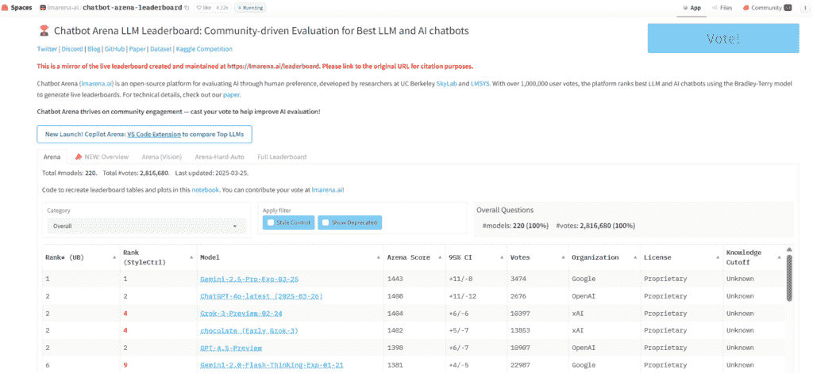
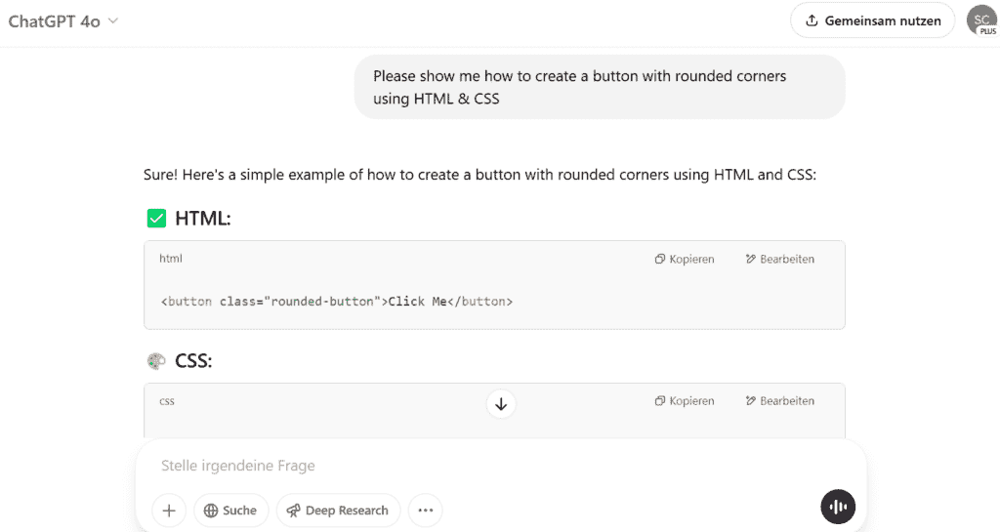
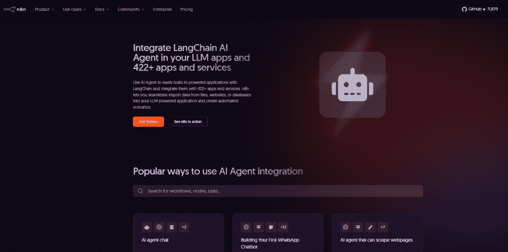

# 理解生成式 AI 背后的技术栈

> 原文：[`towardsdatascience.com/tech-stack-generative-ai/`](https://towardsdatascience.com/tech-stack-generative-ai/)

当 ChatGPT 在五天内达到一百万用户标记并比历史上任何其他技术发展得更快时，世界开始关注人工智能和 AI 应用。

因此，它继续快速发展。从那时起，许多不同的术语都在热议——从 ChatGPT 和 Nvidia H100 芯片到 Ollama、LangChain 和可解释 AI。实际上它们分别代表什么？

这正是您在这篇文章中会发现的内容：围绕生成式 AI 和 LLMs 的技术生态系统的结构化概述。

让我们深入探讨！

***目录**

1 是什么让生成式 AI 工作——其核心

2 扩展 AI：基础设施和计算能力

3 AI 的社会层：可解释性、公平性和治理

4 新兴能力：当 AI 开始互动和行动

最后的想法

你可以在哪里继续学习？*

## 1 是什么让生成式 AI 工作——其核心

人工智能领域的新的术语和工具几乎每天都在出现。所有这一切的核心是基础模型、框架以及运行生成式 AI 所需的基础设施。

### 基础模型

你知道瑞士军刀吗？基础模型就像这样的多功能刀——你只需一个工具就能完成许多不同的任务。

基础模型是经过大量数据（文本、代码、图像等）预训练的大型 AI 模型。这些模型的特点是它们不仅能够解决单个任务，还可以灵活地用于许多不同的应用。它们可以撰写文本、纠正代码、生成图像，甚至创作音乐。它们是许多生成式 AI 应用的基础。

**以下三个方面是理解基础模型的关键：**

+   **预训练**

    这些模型是在庞大的数据集上训练的。这意味着模型已经“阅读”了大量的文本或其他数据。这一阶段非常昂贵且耗时。

+   **多任务能力**

    这些基础模型可以解决许多任务。如果我们看看 GPT-4o，你可以用它来解决关于知识问题的日常问题、文本改进和代码生成。

+   **可迁移**

    通过微调或检索增强生成（RAG），我们可以将这些基础模型适应特定领域或针对特定应用领域进行专业化。我在[如何使用 RAG 和微调使您的 LLM 更准确](https://towardsdatascience.com/how-to-make-your-llm-more-accurate-with-rag-fine-tuning/)一文中详细介绍了 RAG 和微调。但核心在于，您有两个选项可以使您的 LLM 更准确：使用 RAG，模型保持不变，但通过提供额外的来源来改进输入。例如，模型在查询期间可以访问过去的支持票据或法律文本——但模型参数和权重保持不变。使用微调，您使用额外的来源重新训练预训练模型——模型永久保存这些知识。

为了了解我们所谈论的数据量，让我们看看 FineWeb。[FineWeb 是由 Hugging Face 开发的一个大型数据集](https://arxiv.org/abs/2406.17557)，用于支持 LLM 的预训练阶段。该数据集由 96 个常见的网络爬虫快照创建，包含 1500 万亿个标记——这大约需要 44 太字节的空间。

大多数基础模型都是基于 Transformer 架构。在这篇文章中，我不会更详细地介绍这一点，因为它涉及到 AI 的高层次组件。最重要的是要理解，这些模型可以同时查看一个句子的整个上下文，例如——而不仅仅是逐字从左到右阅读。介绍这种架构的基础论文是 [Attention is All You Need](https://arxiv.org/abs/1706.03762)（2017）。

AI 领域的所有主要参与者都发布了基础模型——每个模型都有不同的优势、用例和许可条件（开源或闭源）。

例如，OpenAI 的 GPT-4、Anthropic 的 Claude 和 Google 的 Gemini 都是强大的闭源模型。这意味着模型权重和训练数据都不对公众开放。

还有来自 Meta 的高性能开源模型，如 LLaMA 2 和 LLaMA 3，以及来自 Mistral 和 DeepSeek。

比较这些模型的绝佳资源是 Hugging Face 上的 [LLM Arena](https://huggingface.co/spaces/lmarena-ai/chatbot-arena-leaderboard)。它提供了各种语言模型的概述，对它们进行排名，并允许直接比较它们的性能。

作者截图：我们可以看到 LLM Arena 中不同 llm 模型的比较。

### 多模态模型

如果我们看看 [GPT-3 模型](https://paperswithcode.com/method/gpt-3)，它只能处理纯文本。多模态模型现在更进一步：它们不仅可以处理和生成文本，还可以处理和生成图像、音频和视频。换句话说，它们可以同时处理和生成多种类型的数据。

**这具体意味着什么？**

多模态模型处理不同类型的输入（例如，一张图片及其相关问题）并将这些信息结合起来以提供更智能的答案。例如，使用 Gemini 1.5 版本，您可以上传一张包含不同成分的图片，并询问您在这盘子上看到了哪些成分。

**这是如何从技术上工作的？**

多模态模型不仅理解语音，还理解视觉或听觉信息。多模态模型通常基于与纯文本模型类似的 transformer 架构。然而，一个重要的区别是，不仅单词被处理为“标记”，图像也被所谓的 patches 处理。这些是小图像部分，被转换为向量，然后可以被模型处理。

**让我们看看一些例子：**

+   **GPT-4-Vision**

    这个来自 OpenAI 的模型可以处理文本和图像。它识别图像上的内容，并将其与语音结合。

+   **Gemini 1.5**

    Google 的模型可以处理文本、图像、音频和视频。它在跨模态之间保持上下文方面特别强大。

+   **Claude 3**

    Anthropic 的模型可以处理文本和图像，并且非常擅长视觉推理。它擅长识别图表、图形和手写。

其他例子包括 DeepMind 的 Flamingo，微软的 Kosmos-2，以及埃隆·马斯克的 xAI 的 Grok，它已集成到 Twitter 中。

### GPU & Compute Providers

当生成式 AI 模型被训练时，这需要巨大的计算能力。特别是对于预训练，但同样对于推理——模型对新输入的后续应用。

想象一位音乐家为音乐会练习数月——这就是预训练的样子。在预训练期间，像[GPT-4](https://paperswithcode.com/method/gpt-4)、[Claude 3](https://paperswithcode.com/paper/the-claude-3-model-family-opus-sonnet-haiku)、[LLaMA](https://ai.meta.com/blog/meta-llama-3/) 3 或[DeepSeek-VL](https://paperswithcode.com/paper/deepseek-vl-towards-real-world-vision)这样的模型从来自文本、代码、图像和其他来源的数十亿个标记中学习。这些数据量使用 GPU（图形处理单元）或 TPU（张量处理单元）进行处理。这是必要的，因为这种硬件能够实现并行计算（与 CPU 相比）。许多公司通过云（例如，通过 AWS、Google Cloud、Azure）租用计算能力，而不是运营自己的服务器。

当一个预训练模型通过微调适应特定任务时，这反过来又需要大量的计算能力。这是当模型使用 RAG 定制时的一大主要区别。使微调更加资源高效的一种方法是低秩适应（LoRA）。在这里，模型的小部分被特别重新训练，而不是使用新数据重新训练整个模型。

如果我们以音乐为例，推理就是实际现场音乐会发生的时刻，这个时刻需要反复播放。这个例子也清楚地表明，这也需要资源。推理是将 AI 模型应用于新的输入（例如，你向 ChatGPT 提问）以生成答案或预测的过程。

**以下是一些例子：**

用于此目的的是专门针对并行计算进行优化的硬件组件。例如，[NVIDIA 的 A100](https://www.nvidia.com/en-us/data-center/a100/#) 和 [H100](https://www.nvidia.com/en-us/data-center/h100/) GPU 在许多数据中心中是标准的。[AMD Instinct MI300X](https://www.amd.com/en/products/accelerators/instinct/mi300/platform.html) 例如，也作为一个高性能的替代品正在迎头赶上。Google TPUs 也被用于某些工作负载——特别是在 Google 生态系统中。

### 机器学习框架与库

就像在编程语言或 Web 开发中一样，AI 任务也有框架。例如，它们提供了构建神经网络而不需要从头开始编写所有内容的现成函数。或者，通过框架并行化计算并高效利用 GPU 来使训练更加高效。

**用于生成式 AI 最重要的机器学习框架**：

+   PyTorch 由 Meta 开发，是开源的。它非常灵活，在研究和开源社区中很受欢迎。

+   TensorFlow 由 Google 开发，对于大型 AI 模型来说非常强大。它支持分布式训练——解释——并且常用于云环境。

+   Keras 是 TensorFlow 的一部分，主要用于初学者和原型开发。

+   JAX 也来自 Google，是专门为高性能 AI 计算开发的。它常用于高级研究和 Google DeepMind 项目。例如，它用于最新的 Google AI 模型，如 Gemini 和 [Flamingo](https://deepmind.google/discover/blog/tackling-multiple-tasks-with-a-single-visual-language-model/)。

PyTorch 和 TensorFlow 可以轻松与 [Hugging Face Transformers](https://huggingface.co/docs/transformers/en/index) 或 [ONNX Runtime](https://onnxruntime.ai/) 等其他工具结合使用。

### 人工智能应用框架

这些框架使我们能够将基础模型集成到特定的应用中。它们简化了对基础模型的访问、提示的管理以及 AI 支持的流程的高效管理。

**以下是一些工具的例子：**

1.  LangChain 使 LLMs 能够在聊天机器人、文档处理和自动分析等应用中进行编排。它支持访问 API、数据库和外部存储。并且它可以连接到向量数据库——我将在下一节中解释——以执行上下文查询。

    让我们来看一个例子：一家公司想要构建一个内部人工智能助手，用于搜索文档。使用 LangChain，它现在可以将 GPT-4 连接到内部数据库，用户可以使用自然语言搜索公司文档。

1.  LlamaIndex 被特别设计为使大量非结构化数据对 LLMs 高效可用，因此对于检索增强生成（RAG）非常重要。由于 LLMs 仅基于训练数据拥有有限的知识库，它允许 RAG 在生成答案之前检索更多信息。这正是 LlamaIndex 发挥作用的地方：它可以用来将非结构化数据（例如 PDF、网站或数据库中的数据）转换为可搜索的索引。

    让我们来看一个具体的例子：

    律师需要一个法律人工智能助手来搜索法律。LlamaIndex 组织了成千上万的法律文本，因此可以快速提供精确的答案。

1.  Ollama 使得在您的笔记本电脑或服务器上运行大型语言模型成为可能，而无需依赖云。由于模型直接在设备上运行，因此不需要 API 访问。

    例如，您可以在本地设备上运行 Mistral、LLaMA 3 或 DeepSeek 等模型。

### 数据库与向量存储

在传统数据处理中，关系型数据库（SQL 数据库）将结构化数据存储在表中，而像 MongoDB 或 Cassandra 这样的 NoSQL 数据库则用于存储非结构化或半结构化数据。

然而，随着 LLMs 的出现，我们现在还需要一种存储和搜索语义信息的方法。

这需要向量数据库：基础模型不将输入作为文本处理，而是将其转换为数值向量——所谓的嵌入。向量数据库使得对嵌入进行快速相似性和内存管理成为可能，从而提供相关的上下文信息。

**例如，检索增强生成是如何工作的？**

1.  每个文本（例如 PDF 中的一个段落）都被转换成了一个向量。

1.  您将查询作为提示传递给模型。例如，您提出一个问题。现在这个问题也被转换成了一个向量。

1.  数据库现在计算哪些向量与输入向量最接近。

1.  这些顶级结果在 LLM 回答之前提供。然后模型使用这些信息作为回答的附加信息。

这样的例子有 Pinecone、FAISS、Weaviate、Milvus 和 Qdrant。

### 编程语言

生成式人工智能开发也需要一种编程语言。

当然，对于几乎所有的人工智能应用来说，Python 可能是首选。Python 已经确立了自己作为人工智能和机器学习的主要语言，并且是最受欢迎和广泛使用的语言之一。它灵活，提供了一个包含所有之前提到的框架（如 TensorFlow、PyTorch、LangChain 或 LlamaIndex）在内的庞大人工智能生态系统。

为什么 Python 不是用于所有事情？

Python 并不是很快。但多亏了 CUDA 后端，TensorFlow 或 PyTorch 仍然非常高效。然而，如果性能真的非常重要，Rust、C++ 或 Go 更有可能被使用。

另一种必须提到的语言是 Rust：当涉及到快速、安全和内存高效的 AI 基础设施时，这种语言被使用。例如，用于高效的矢量搜索数据库或高性能网络通信。它主要应用于基础设施和部署领域。

Julia 是一种接近 Python 的语言，但速度要快得多——这使得它非常适合数值计算和张量运算。

TypeScript 或 JavaScript 对于 AI 应用程序并不直接相关，但它们经常用于 LLM 应用程序的前端（例如，React 或 Next.js）。

自行可视化 — 来自 [unDraw.co](https://undraw.co/) 的插图

## 2 缩放 AI：基础设施和计算能力

除了核心组件之外，我们还需要有缩放和训练模型的方法。

### 容器 & 编排

不仅传统应用程序，AI 应用程序也需要提供和缩放。我在这篇文章中详细介绍了容器化 [**为什么数据科学家应该关注容器——并凭借这些知识脱颖而出**](https://towardsdatascience.com/why-data-scientists-should-care-about-containers-and-stand-out-with-this-knowledge/)。但核心要点是，通过容器，我们可以在任何服务器上运行 AI 模型（或任何其他应用程序），并且它们都能正常工作。这使得我们能够提供一致、便携和可扩展的 AI 工作负载。

Docker 是容器化的标准。生成式 AI 也不例外。我们可以用它来开发作为独立、可重复单元的 AI 应用程序。Docker 用于在云端或边缘设备上部署大型语言模型（LLM）。边缘意味着 AI 不在云端运行，而是在您的设备上本地运行。Docker 镜像包含您所需的一切：Python、PyTorch 等机器学习框架、CUDA 用于 GPU 和 AI API。

让我们来看一个例子：一位开发者使用 PyTorch 在本地训练一个模型，并将其保存为 Docker 容器。这使得它能够轻松地部署到 AWS 或 Google Cloud。

Kubernetes 用于管理和缩放容器工作负载。它可以管理 GPU 作为资源。这使得在集群上高效运行多个模型成为可能，并在需求高时自动扩展。

[Kubeflow](https://www.kubeflow.org/) 在 AI 世界之外并不那么知名。它允许将机器学习模型从数据处理到部署作为工作流程进行编排。它是专门为生产环境中的机器学习设计的，并支持自动模型训练和超参数训练。

### 芯片制造商 & AI 硬件

所需的巨大计算能力必须产生。这是由芯片制造商完成的。强大的硬件减少了训练时间并提高了模型推理。

现在也有一些模型，在相同性能下使用了更少的参数或更少的资源。当 DeepSeek 在二月底发布时，人们对其所需资源量提出了质疑。越来越明显的是，巨大的模型和极其昂贵的硬件并不总是必要的。

在 AI 领域，最著名的芯片制造商可能是 Nvidia，它是一家最有价值的公司之一。凭借其专门的 A100 和 H100 GPU，该公司已成为训练和推理大型 AI 模型的实际标准。然而，除了 Nvidia 之外，还有其他重要玩家，如 AMD 的 Instinct MI300X 系列、Google、Amazon 和 Cerebras。

### 基础模型 API 提供商

基础模型是预训练模型。我们使用 API 以便能够快速访问它们，而无需自己托管。API 提供商提供了对模型的快速访问，例如 OpenAI API、Hugging Face 推理端点或 Google Gemini API。为此，您通过 API 发送文本，并接收回响应。然而，像 OpenAI API 这样的 API 需要付费。

最知名的提供商是 OpenAI，其 API 提供了访问 GPT-3.5、GPT-4、DALL-E 图像生成和 Whisper 语音转文本的功能。Anthropic 还提供了强大的替代方案，即 Claude 2 和 3。Google 通过 Gemini API 提供了访问多模态模型如 Gemini 1.5 的权限。

Hugging Face 是一个开源模型的核心枢纽：推理端点允许我们直接访问 Mistral 7B、Mixtral 或 Meta 模型，例如。

另一个令人兴奋的提供商是[Cohere](https://cohere.com/de)，它提供 Command R+，这是一个专门用于检索增强生成（RAG）的模型——包括强大的嵌入 API。

### 无服务器 AI 架构

无服务器计算并不意味着没有服务器，而是您不需要自己的服务器。您只需定义要执行的内容——而不是如何或在哪里执行。然后云环境会自动启动一个实例，执行代码，并关闭该实例。例如，AWS Lambda 函数就是这里众所周知的服务。

类似的服务也专门针对 AI。无服务器 AI 减少了管理工作量并自动扩展。例如，对于不定期使用的 AI 任务来说，这非常理想。

让我们来看一个例子：一个网站上的聊天机器人，它不需要一直运行。然而，当访客访问网站并提出问题时，它必须具备资源。因此，它只有在需要时才会被调用。

无服务器 AI 可以节省成本并减少复杂性。然而，它不适用于持续、延迟敏感的任务。

示例：AWS Bedrock、Azure OpenAI 服务、Google Cloud Vertex AI

## 3 AI 的社会层：可解释性、公平性和治理

权力与能力越大，责任也就越大。我们将 AI 更多地整合到我们的日常应用中，就越重要的是要参与负责任 AI 的原则。

所以……生成式 AI 提出了许多问题：

+   模型是否解释了它是如何得出答案的？

    -> 关于透明度的问题

+   是否有某些群体受到青睐？

    -> 关于公平性的问题

+   如何确保模型不会被滥用？

    -> 关于安全的问题

+   谁对错误负责？

    -> 关于问责制的问题

+   谁控制 AI 的使用方式和地点？

    -> 关于治理的问题

+   网络上可用的哪些数据（例如，来自艺术家或图像）可以使用？

    艺术家）可以使用？

    -> 关于版权/数据伦理的问题

虽然我们在物理世界的许多领域都有全面的法规——例如噪声控制、光污染、车辆、建筑和酒精销售——但在 IT 领域的类似监管努力仍然很少，并且经常被避免。

我不是在做出一般化或价值判断，关于这是好是坏。较少的监管可以加速创新——新技术更快地进入市场。同时，存在风险，即重要方面，如伦理责任、偏见检测或大型模型的能耗，将得到过多的关注。

随着 AI 法案的实施，欧盟正在更多地关注一种旨在创建明确框架条件的监管方法——但这也反过来可能会降低创新的步伐。美国倾向于追求市场驱动、自由的方法，并采用自愿指南。这促进了快速发展，但往往将伦理和社会问题置于次要位置。

### 让我们看看三个概念：

**可解释性**

许多大型 LLM，如 GPT-4 或 Claude 3，被认为是所谓的黑箱：它们提供令人印象深刻的答案，但我们不知道它们是如何得出这些结果的。我们越信任它们——特别是在教育、医学或司法等敏感领域——就越重要的是要了解它们的决策过程。

LIME、SHAP 或注意力图等工具是减少这些问题的方法。它们分析模型决策并以视觉方式呈现。此外，[模型卡片](https://www.kaggle.com/code/var0101/model-cards)（标准化文档）有助于使模型的能力、训练数据、限制和潜在风险透明。

**公平性**

如果一个模型是用包含偏见或偏见表示的数据训练的，它也会继承这些偏见和扭曲。这可能导致某些群体被系统地不利或被刻板化。有识别偏见的方法，以及关于如何选择和测试训练数据的明确标准。

**治理**

最后，治理问题出现了：谁实际上决定 AI 如何使用？谁检查模型是否被负责任地操作？

## 4 个新兴能力：当 AI 开始互动和行动时

这涉及到超越经典提示-响应模型的新的能力。AI 变得更加活跃、动态和自主。

让我们来看一个具体的例子：

一个经典的 LLM（大型语言模型）如 GPT-3 遵循典型的流程：例如，你提出一个问题，比如“请用 HTML & CSS 展示如何创建一个圆角按钮”。然后模型会为你提供相应的代码，并附上简要的解释。模型返回的是纯文本输出，而无需模型主动执行或进一步思考。

作者拍摄的截图：如果要求创建圆角按钮，ChatGPT 的答案。

AI 智能体走得更远。它们不仅分析提示，还可以独立制定计划，访问外部工具或 API，并在多个步骤中完成任务。

一个简单的例子：

智能体不仅可以监控数据源，还可以在特定事件发生时独立发送电子邮件，而不仅仅是编写电子邮件模板。例如，当销售目标达成时，就会发送一封电子邮件。

### AI 智能体

AI 智能体是基于基础模型的应用逻辑。它们独立地协调决策和执行步骤。例如，[AutoGPT](https://www.ibm.com/think/topics/autogpt)这样的智能体可以独立执行多步骤任务。它们在循环中思考，并试图逐步改进或实现目标。

**一些例子：**

+   您的 AI 智能体每天分析新的市场报告，总结它们，将它们存储在数据库中，并在出现偏差时通知用户。

+   一个智能体启动一个求职申请流程：它会扫描提交的简历，并将它们与工作机会相匹配。

+   在一个电子商务商店中，智能体监控库存水平和客户需求。如果某个产品库存不足，它会自动重新订购，包括比较供应商之间的价格。

**AI 智能体通常由什么组成？**

一个 AI 智能体由几个专业化的组件组成，这使得它能够自主地规划、执行和学习任务：

+   **大型语言模型**

    LLM 是核心或思考引擎。典型的模型包括 GPT-4、Claude 3、Gemini 1.5 或 Mistral 7B。

+   **规划单元**

    规划器将高级目标转换成具体的计划或步骤序列。通常基于如思维链或 ReAct 等方法。

+   **工具访问**

    此组件使智能体能够使用外部工具。例如，使用浏览器进行扩展搜索，使用 Python 环境执行代码，或启用对 API 和数据库的访问。

+   **记忆**

    此组件存储有关先前交互、中间结果或上下文知识的信息。这对于智能体在多个步骤中保持一致的行为是必要的。

+   **执行器**

    此组件按照正确的顺序执行计划中的步骤，监控进度，并在出现错误时重新规划。

还有像 Make 或 n8n（低代码/无代码自动化平台）这样的工具，也允许你实现“代理”逻辑。它们执行带有条件、触发器和动作的工作流程。例如，当收件箱中收到新电子邮件时，应该自动生成回复。并且有许多适用于此类用例的模板。

作者截图：n8n 上的模板作为低代码或无代码平台的示例。

### 强化学习

通过强化学习，模型变得更加“人性化”。在这种训练方法中，模型通过奖励来学习。这对于没有明确“正确”或“错误”的任务尤为重要，而是逐渐提高质量。

例如，当你使用 ChatGPT，收到两个不同的回复并被要求评价你更喜欢哪一个时。

奖励可以来自人类反馈（来自人类反馈的强化学习 - RLHF）或来自另一个模型（来自人工智能反馈的强化学习 - RLVR）。在 RLHF 中，人类对模型的一些回复进行评分，使 LLM 能够学习“好的”回复是什么样的，并更好地符合人类期望。在 RLVR 中，模型不仅收到二元反馈（例如，好与坏），还收到区分的、基于上下文的奖励（例如，从-1 到+3 的可变奖励尺度）。RLVR 在有许多可能的“好的”回复，但其中一些与用户的意图匹配得更好的情况下特别有用。

在我的[Substack](https://sarahleaschrch.substack.com/)上，我定期撰写关于科技、Python、数据科学、[机器学习](https://towardsdatascience.com/tag/machine-learning/)和人工智能领域已发表文章的总结。如果您感兴趣，可以查看或订阅。

## **结语**

现在可能可以写一本关于生成式人工智能的整本书了——而不仅仅是一篇文章。人工智能已经被研究和应用了许多年。但我们目前正处于一个工具、应用和框架爆炸性增长的时期——人工智能，尤其是生成式人工智能，已经真正进入了我们的日常生活。让我们看看这将把我们带到哪里，并以[艾伦·凯](https://www.ted.com/speakers/alan_kay)的一句话结束：

> 预测未来的最好方法就是创造它。

## **你可以在哪里继续学习？**

+   [IBM 博客 – 基础模型是什么？](https://research.ibm.com/blog/what-are-foundation-models)

+   [Sebastian Raschka 所著的书籍 – 从零开始构建大型语言模型](https://www.oreilly.com/library/view/build-a-large/9781633437166/)

+   [YouTube Andrej Karpathy – 深入探讨 ChatGPT 等 LLM](https://www.youtube.com/watch?v=7xTGNNLPyMI&t=11944s)
