# 时间差分学习与探索的重要性：图文指南

> 原文：[`towardsdatascience.com/temporal-difference-learning-and-the-importance-of-exploration-an-illustrated-guide/`](https://towardsdatascience.com/temporal-difference-learning-and-the-importance-of-exploration-an-illustrated-guide/)

<mdspan datatext="el1759308856428" class="mdspan-comment">最近，**强化学习**（RL）算法通过解决诸如**蛋白质折叠**、在**无人机竞速**中达到超人类水平，甚至**整合人类反馈**到您最喜欢的聊天机器人等研究问题而受到广泛关注。</mdspan>

事实上，强化学习（RL）为各种序列决策问题提供了有用的解决方案。**时间差分学习**（TD 学习）方法是强化学习算法中一个流行的子集。TD 学习方法**结合**了**蒙特卡洛**和**动态规划**方法的关键方面，以加速学习，而不需要环境动力学的完美模型。

在本文中，我们将比较在自定义网格世界中不同类型的**TD 算法**。实验的设计将概述**持续探索**的重要性以及测试算法的**个体特征**：**Q 学习**、**Dyna-Q**和**Dyna-Q+**。

本帖的概述包括：

+   环境描述

+   时间差分（TD）学习

+   无模型 TD 方法（Q 学习）和基于模型的 TD 方法（Dyna-Q 和 Dyna-Q+）

+   参数

+   性能比较

+   结论

*完整的代码，允许重现结果和图表，在此处可用：*[`github.com/RPegoud/Temporal-Difference-learning`](https://github.com/RPegoud/Temporal-Difference-learning)

## 环境

在这个实验中，我们将使用以下特征的网格世界环境：

+   网格是 12 行 8 列。

+   **代理**从网格的左下角开始，**目标**是到达位于右上角的宝藏（一个奖励为 1 的终端状态）。

+   **蓝色传送门**是连接的，通过位于单元格（10, 6）的传送门进入，通向单元格（11, 0）。代理在第一次转换后不能再次使用传送门。

+   **紫色传送门**仅在**100 个回合**后出现，但使代理能够更快地到达宝藏。这鼓励持续探索环境。

+   **红色传送门**是**陷阱**（奖励为 0 的终端状态），并结束游戏。

+   撞到墙上会使代理保持在同一状态。

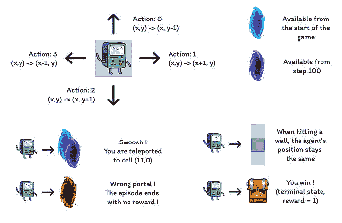

网格世界不同组件的描述（由作者制作）

这个实验旨在比较 Q 学习、Dyna-Q 和 Dyna-Q+代理在**变化环境**中的行为。事实上，在**100 个回合**之后，**最优策略**必将改变，并且在成功回合中的最优步数将从**17 步**减少到**12 步**。

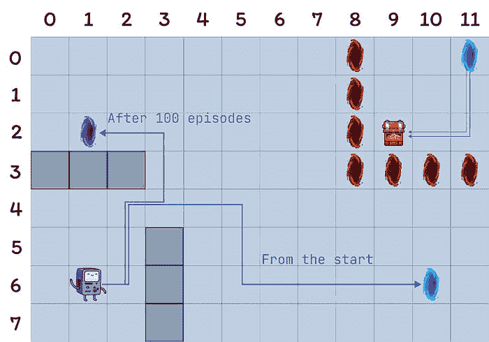

网格世界的表示，最优路径取决于当前回合（作者制作）

## 时间差分学习简介：

时间差分学习是**蒙特卡洛**（MC）和**动态规划**（DP）方法的结合：

+   与 MC 方法类似，TD 方法可以在不需要**环境动态**模型的情况下从经验中学习。

+   与 DP 方法类似，TD 方法在每一步之后**基于其他学习估计**更新估计，而不需要等待**结果**（这被称为自举）。

TD 方法的一个特点是它们在**每一步**更新其价值估计，而 MC 方法则等待直到回合结束。

事实上，这两种方法有不同的更新目标。MC 方法旨在更新回报**Gt**，它只在回合结束时可用。相反，TD 方法的目标是：

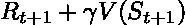

TD 方法的更新目标

其中**V**是**真实值函数 Vπ**的估计。

因此，TD 方法**结合**了**蒙特卡洛**（MC）（通过使用真实值的估计）和**动态规划**（DP）的**自举**（通过根据进一步的估计更新 V）。

时间差分学习最简单的版本称为**TD(0)**或一步 TD，TD(0)的实际实现可能如下所示：

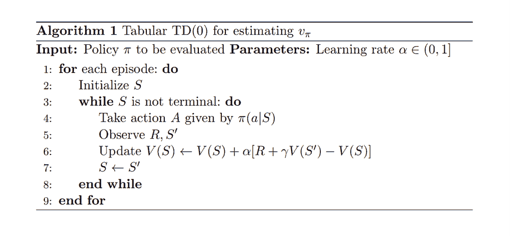

TD(0)算法的伪代码，摘自《强化学习：入门》[4]

当从状态**S**转换到新状态**S'**时，TD(0)算法将计算一个**回传值**并相应地更新**V(S)**。这个回传值被称为 TD 误差，是观察到的奖励**R**加上新状态的折扣价值**γV(St+1)**与当前价值估计**V(S)**之间的差异：

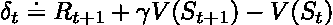

TD 误差

总结来说，TD 方法具有以下优点：

+   它们不需要环境动态的完美模型**p**

+   它们以在线方式实现，在每一步之后更新目标

+   TD(0)在α（学习率或步长）遵循随机逼近条件（更多细节见第 55 页“跟踪非平稳问题”[[4]](http://incompleteideas.net/book/RLbook2020.pdf)）的情况下，对于任何固定的策略π都有保证收敛。

## 实现细节：

以下章节将探讨几个 TD 算法的主要特性和在网格世界上的性能。

为了简单起见，所有模型都使用了相同的参数：

+   **Epsilon**（ε）= 0.1：在ε-贪婪策略中选择随机动作的概率

+   **Gamma**（γ）= 0.9：应用于未来奖励或价值估计的折扣因子

+   **Alpha**（α）= 0.25：限制 Q 值更新的学习率

+   **规划步骤** = 100：对于 Dyna-Q 和 Dyna-Q+，每个直接交互执行的规划步骤数量

+   **Kappa (***κ***)** = 0.001：对于 Dyna-Q+，在规划步骤中应用的奖励加权的权重

每个算法的性能首先在一个 400 个回合的单次运行中呈现（部分：**Q-learning**、**Dyna-Q** 和 **Dyna-Q+**），然后在“**总结和算法比较**”部分平均 100 次运行 250 个回合。

## Q-learning

我们在这里实现的第一种算法是著名的 Q-learning（*Watkins*，1989）：

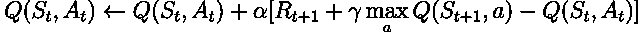

Q-learning 被称为**离线策略**算法，因为它的目标是直接逼近**最优值函数**，而不是代理遵循的策略 *π* 的值函数。

在实践中，Q-learning 仍然依赖于一个策略，通常被称为“*行为策略*”来选择哪些状态-动作对被访问和更新。然而，Q-learning 是离线策略，因为它根据**对未来奖励的最佳估计**来更新其 Q 值，而不管选定的动作是否遵循当前策略 *π*。

与之前的 TD 学习伪代码相比，有三个主要区别：

+   我们需要初始化所有状态和动作的 Q 函数，并且 Q(terminal) 应该为 0

+   动作是从基于 Q 值的策略中选择（例如，根据 Q 值的 ϵ-greedy 策略）

+   更新目标是动作值函数 Q 而不是状态值函数 V

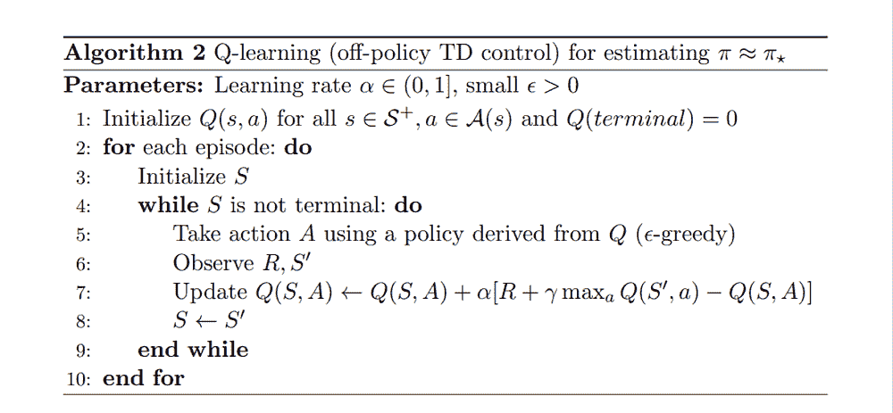

Q-learning 算法的伪代码，摘自《强化学习：入门》[4]

现在我们已经准备好第一个算法进行测试，我们可以开始训练阶段。我们的代理将使用其**ε-greedy 策略**（根据 Q 值）在 Grid World 中导航。此策略以概率 **(1 – ε)** 选择具有**最高 Q 值**的动作，并以概率 **ε** 选择一个**随机动作**。在每个动作之后，代理将**更新**其 Q 值估计。

我们可以使用热图可视化 Grid World 中每个单元格的估计**最大动作值** **Q(S, a)** 的演变。在这里，代理玩了 400 个回合。由于每个回合只有一个更新，Q 值的演变相当缓慢，大部分状态保持未映射：

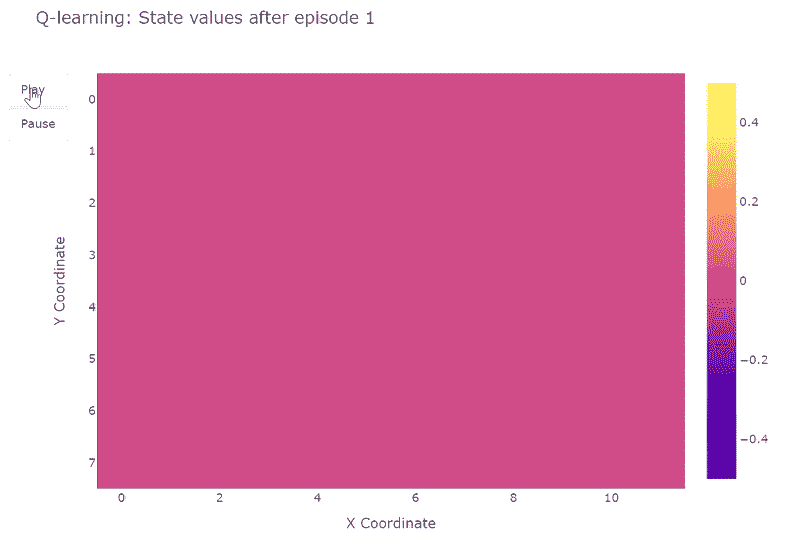

训练过程中每个状态的 learned Q 值的热图表示（由作者制作）

完成 400 个回合后，对每个单元格的总访问次数的分析为我们提供了代理平均路径的合理估计。如图下方的右侧图所示，代理似乎收敛到一个**次优路径**，**避开单元格 (4,4)** 并始终**沿着较低的墙壁**前进。

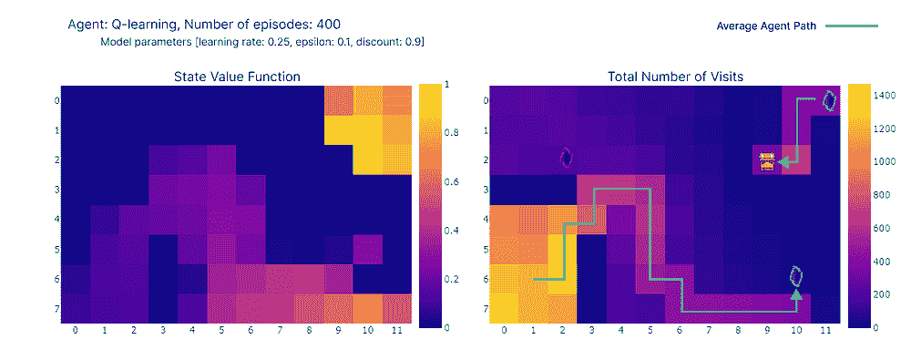

（左）每个状态的极大动作值估计，（右）每个状态的访问次数（作者制作）

由于这种次优策略，智能体在每个事件中达到**21 步**的最小值，遵循“总访问次数”图中的路径。步骤数的差异可以归因于ε-greedy 策略，它引入了 10%随机动作的概率。鉴于这一策略，跟随较低的墙壁是一个不错的策略，以限制随机动作可能造成的潜在干扰。

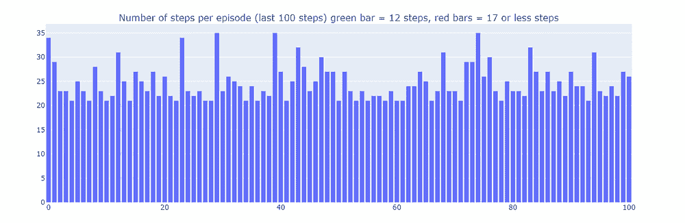

训练最后 100 个事件（300-400）的步骤数（作者制作）

总之，正如之前提到的，Q 学习智能体收敛到一个**次优策略**。此外，环境的一部分仍然由 Q 函数**未探索**，这阻止了智能体在 100 个事件之后紫色传送门出现时找到新的最优路径。

这些性能限制可以归因于相对**低**的训练步骤数（400），限制了与环境的交互可能性以及ε-greedy 策略引起的探索。

**规划**，作为**基于模型**的强化学习方法的一个基本组成部分，特别有用，可以提高**样本效率**和**动作值估计**。Dyna-Q 和 Dyna-Q+是结合规划步骤的 TD 算法的好例子。

## Dyna-Q

Dyna-Q 算法（动态 Q 学习）是**基于模型的强化学习**和**TD 学习**的结合。

基于模型的强化学习算法依赖于**环境模型**来作为它们**更新价值估计**的主要规划方式。相比之下，无模型算法依赖于直接学习。

> **“环境模型是智能体可以用来预测环境如何对其动作做出反应的任何东西”——强化学习：入门**。”

在本文的范围内，模型可以被视为对转换动力学**p(s', r|s, a)**的近似。在这里，**p**在给定当前状态-动作对的情况下返回一个**单一的状态和奖励对**。

在**p**是**随机**的环境中，我们区分分布模型和样本模型，前者返回下一个状态和动作的分布，而后者返回从估计分布中采样的单个对。

模型在模拟事件方面特别有用，因此通过用规划步骤（即与模拟环境的交互）替换现实世界的交互来训练智能体。

实现 Dyna-Q 算法的代理属于**规划代理**这一类，这类代理**结合直接强化学习和模型学习**。他们使用与环境的直接交互来更新他们的价值函数（如 Q-learning），并且学习环境的模型。在每次直接交互之后，他们还可以执行规划步骤，使用模拟交互来更新他们的价值函数。

### 一个快速的棋类例子

想象一下玩一场好的棋局。在每走一步之后，对手的反应让你能够评估你的**走法的质量**。这类似于收到正面或负面的奖励，这让你能够“更新”你的策略。如果你的走法导致失误，你很可能不会再次这样做，前提是棋盘的配置相同。到目前为止，这相当于**直接强化学习**。

现在我们给混合中加入**规划**。想象一下，在你每走一步之后，当对手在思考时，你心理上会回顾你每一步的**前一步**来**重新评估其质量**。你可能会发现你最初忽视的弱点，或者发现某些走法比你想象的要好。这些想法也可能让你更新你的策略。这正是规划的意义所在，**不与真实环境交互，而是更新该环境的模型**的价值函数。

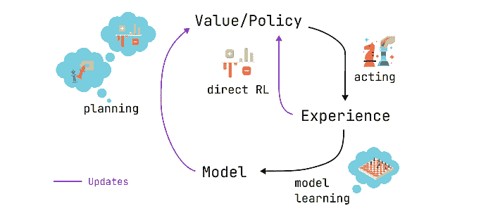

规划、行动、模型学习、直接强化学习：规划代理的调度（由作者制作）

Dyna-Q 因此比 Q-learning 多了一些步骤：

在每次直接更新 Q 值之后，模型会存储观察到的状态-动作对和奖励以及下一个状态。这一步被称为模型训练。

+   模型训练后，Dyna-Q 执行**n**个规划步骤：

+   从模型缓冲区中随机选择一个状态-动作对（即这个状态-动作对是在直接交互中观察到的）

+   模型生成模拟奖励和下一个状态

+   使用模拟观察值（*s, a, r, s’*）更新值函数

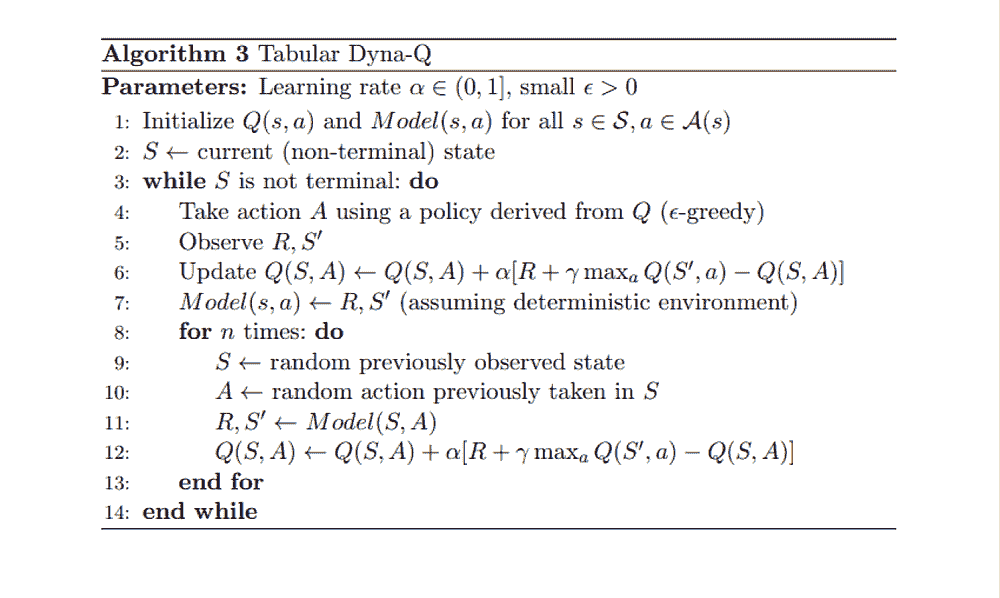

Dyna-Q 算法的伪代码，摘自《强化学习：入门》[4]

我们现在使用**n*=100**的 Dyna-Q 算法复制学习过程。这意味着在每次与环境的直接交互之后，我们使用模型执行 100 个规划步骤（即更新）。

下面的热力图显示了 Dyna-Q 模型的快速收敛。事实上，算法只需要大约**10 个回合**就能找到**最优路径**。这是因为每一步都会导致 101 个 Q 值的更新（而 Q-learning 是 1 个更新）。

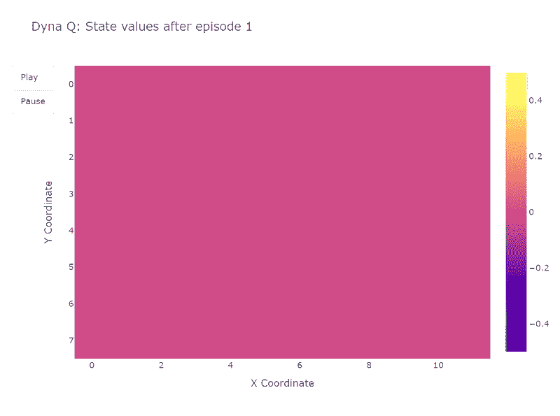

训练过程中每个状态学习到的 Q 值的热力图表示（由作者制作）

规划步骤的另一个好处是更好地估计网格中的动作值。由于间接更新针对模型内部存储的随机转换，远离目标的状态也得到了更新。

相比之下，Q-learning 中动作值从目标缓慢传播，导致网格映射不完整。

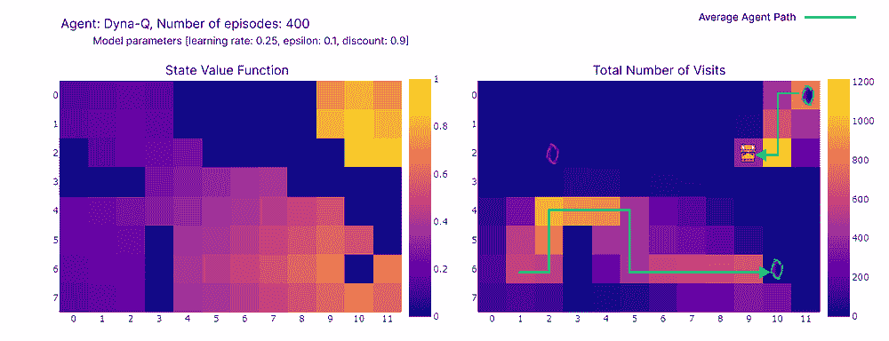

（左）每个状态的最大动作值估计，（右）每个状态访问次数（作者制作）

使用 Dyna-Q，我们找到了一条**最优路径**，允许在**17 步**内解决网格世界问题，如下图中红色条形所示。尽管偶尔为了探索而采取 ε-greedy 行动，但通常仍能获得最佳性能。

最后，虽然 Dyna-Q 由于其包含规划而可能比 Q-learning 更有说服力，但必须记住，规划在**计算成本**和**现实世界探索**之间引入了一种**权衡**。

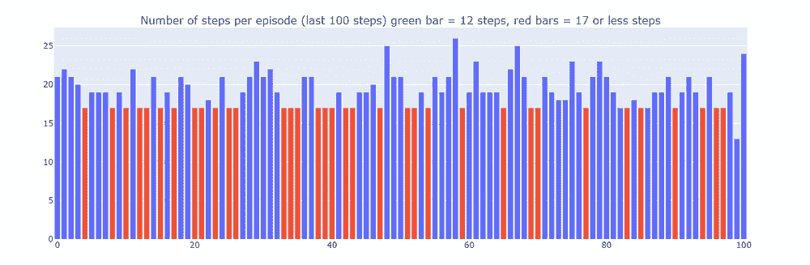

训练最后 100 个回合的步数（300–400）（作者制作）

## Dyna-Q+

到目前为止，测试过的算法都没有找到在 100 步之后出现的最优路径（紫色传送门）。事实上，两种算法都迅速收敛到一个在训练阶段结束前**保持固定**的最优解。这突出了在整个训练过程中进行**持续探索**的需要。

Dyna-Q+ 与 Dyna-Q 大致相同，但在算法中增加了一个小的变化。实际上，Dyna-Q+ 不断跟踪每个状态-动作对自上次在真实环境中尝试以来经过的时间步数。

尤其考虑一个在 *τ* 个时间步内未尝试过的转换，其奖励为 *r*。Dyna-Q+ 会像这个转换的奖励是 **r** + *κ* √*τ*** 一样进行规划，其中 *κ* 足够小（实验中为 0.001）。

这种奖励设计的变化鼓励智能体不断探索环境。它假设一个状态-动作对越长时间未被尝试，这个对的动力变化或模型错误的可能性就越大。

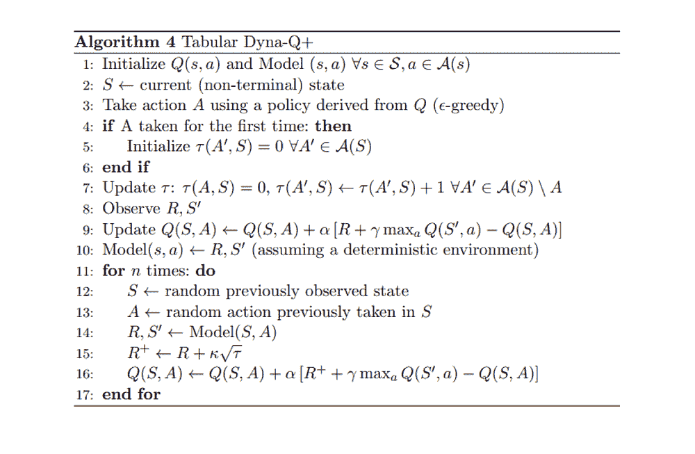

Dyna-Q+ 算法的伪代码，摘自《强化学习：入门》[4]

如下热力图所示，Dyna-Q+ 与之前算法相比，在更新方面更为活跃。在 100 个回合之前，智能体探索了整个网格，找到了蓝色传送门和第一条最优路径。

网格中其余部分的动作值在下降后缓慢增加，因为一段时间内没有探索左上角的状态-动作对。

一旦在第 100 集出现紫色传送门，代理发现新的捷径，整个区域的价值也随之上升。直到完成 400 集，代理将不断更新每个状态-动作对的动作价值，同时保持对网格的偶尔探索。

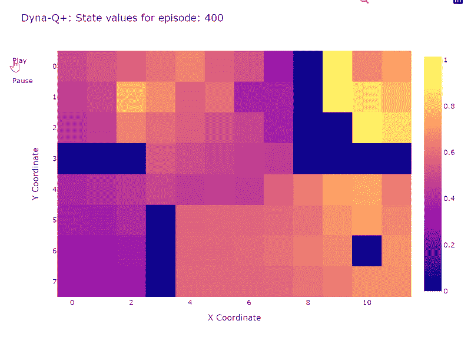

训练期间每个状态学习到的 Q 值的热图表示（由作者制作）

由于模型奖励中添加了奖励，我们最终得到了 Q 函数的**完整映射**（每个状态或单元格都有一个动作值）。

结合持续探索，代理能够在新最佳路线（即最优策略）出现时找到它，同时保留之前的解决方案。

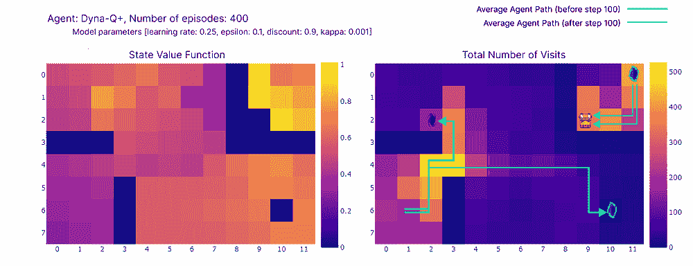

(左) 每个状态的极大动作值的估计，(右) 每个状态访问次数（由作者制作）

然而，Dyna-Q+中的探索-利用权衡确实伴随着成本。当状态-动作对未被访问足够长时间时，探索奖励会鼓励代理重新访问这些状态，这可能会**暂时降低其即时性能**。这种探索行为优先更新模型以改善长期决策。

这解释了为什么 Dyna-Q+播放的一些集数可以长达 70 步，而 Q-learning 和 Dyna-Q 分别最多只能达到 35 步和 25 步。Dyna-Q+中较长的集数反映了代理愿意投入额外的步骤进行探索，以收集更多关于环境的信息并完善其模型，即使这会导致短期性能下降。

相比之下，Dyna-Q+经常达到最优性能（如图下绿色条所示），这是以前算法未能达到的。

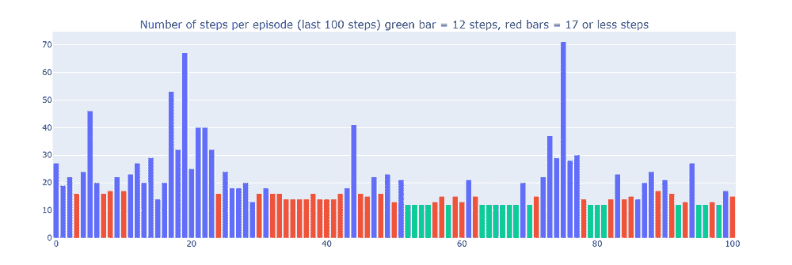

训练最后 100 集的步数（300-400）（由作者制作）

## 概述和算法比较

为了比较算法之间的关键差异，我们使用两个指标（请注意，结果取决于输入参数，为了简单起见，所有模型中的输入参数都是相同的）：

+   **每集步数**：这个指标描述了算法收敛到最优解的速度。它还描述了算法收敛后的行为，特别是在探索方面。

+   **平均累积奖励**：导致正奖励的集数百分比

分析每集步数（见下述图表），揭示了基于模型和无模型方法的几个方面：

+   **基于模型的效率**：基于模型的算法（Dyna-Q 和 Dyna-Q+）在这个特定的网格世界中往往更有效率（这一特性在强化学习中也更为普遍）。这是因为它们可以使用学习到的环境模型进行预先规划，这可以导致更快地收敛到近似最优或最优解。

+   **Q-Learning Convergence**: Q-learning 虽然最终收敛到接近最优解，但需要更多的剧集（125 个）才能做到这一点。重要的是要强调，Q-learning 每步只进行 1 次更新，这与 Dyna-Q 和 Dyna-Q+进行的多次更新形成对比。

+   **多次更新**: Dyna-Q 和 Dyna-Q+每步执行 101 次更新，这有助于它们的快速收敛。然而，这种样本效率的权衡是计算成本（见下表中的运行时间部分）。

+   **复杂环境**: 在更复杂或随机环境中，基于模型的方法的优势可能会减弱。模型可能会引入错误或不准确性，这可能导致次优策略。因此，这个比较应被视为不同方法优缺点的概述，而不是直接的性能比较。

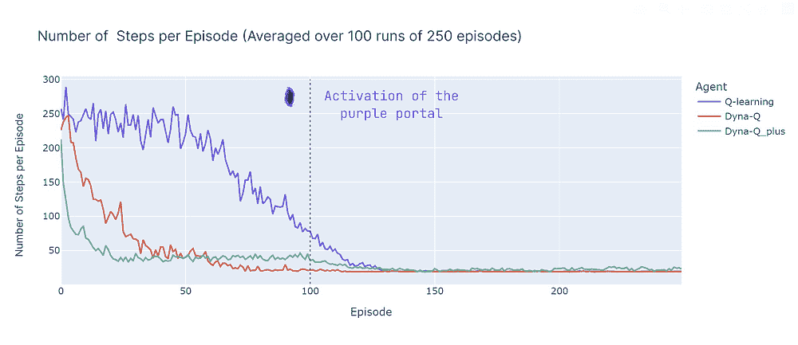

每个剧集平均步骤数比较（由作者进行 100 次运行）

我们现在介绍平均累积奖励（ACR），它表示代理达到目标（因为达到目标时的奖励为 1，触发陷阱时的奖励为 0）的剧集百分比，ACR 因此简单地通过以下方式计算：

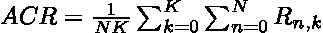

其中 N 是剧集数（250），K 是独立运行数（100），R*n,k*是运行*k*中第*n*个剧集的累积奖励。

下面是所有算法性能的分解：

+   **Dyna-Q**快速收敛并实现最高的整体回报，ACR 达到 87%。这意味着它有效地学习并在大量剧集中学到达到目标。

+   **Q-learning**也达到了相似的性能水平，但需要更多的剧集才能收敛，这解释了其略低的 ACR，为 70%。

+   **Dyna-Q+**迅速找到一个好的策略，在仅经过 15 个剧集后达到累积奖励 0.8。然而，由奖励带来的变异性探索直到第 100 步都降低了性能。100 步之后，它开始改善，因为它发现了新的最优路径。然而，短期的探索牺牲了其性能，导致 ACR 为 79%，低于 Dyna-Q 但高于 Q-learning。

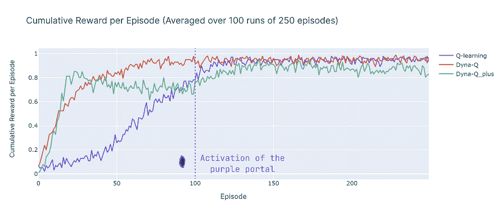

每个剧集累积奖励的平均比较（由作者进行 100 次运行）

## 结论

在这篇文章中，我们介绍了时序差分学习的基本原理，并将 Q-learning、Dyna-Q 和 Dyna-Q+应用于自定义网格世界。这个网格世界的设计有助于强调持续探索作为发现和利用变化环境中新最优策略的重要性。通过每个剧集的步骤数和累积奖励来评估的性能差异，说明了这些算法的优缺点。

总结来说，基于模型的方法（Dyna-Q, Dyna-Q+）相较于基于模型的方法（Q-learning）在样本效率上有所提高，但以计算效率为代价。然而，在随机或更复杂的环境中，模型的不准确性可能会阻碍性能并导致次优策略。

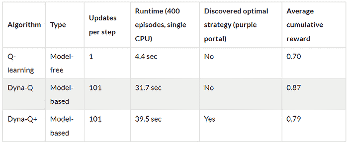

### 参考文献:

[1] Demis Hassabis, [*AlphaFold 揭示蛋白质宇宙的结构*](https://www.deepmind.com/blog/alphafold-reveals-the-structure-of-the-protein-universe)* (*2022), DeepMind

[2] Elia Kaufmann, Leonard Bauersfeld, Antonio Loquercio, Matthias Müller, Vladlen Koltun & Davide Scaramuzza, [*冠军级无人机竞速利用深度强化学习*](https://www.nature.com/articles/s41586-023-06419-4)* (2023), *Nature

[3] Nathan Lambert, Louis Castricato, Leandro von Werra, Alex Havrilla, [*展示从人类反馈中进行强化学习（RLHF）*](https://huggingface.co/blog/rlhf), HuggingFace

[4] Sutton, R. S., & Barto, A. G. *. *[*强化学习：入门*](http://incompleteideas.net/book/the-book-2nd.html)* (2018), *麻省理工学院出版社 (马萨诸塞州): The MIT Press.

[5] Christopher J. C. H. Watkins & Peter Dayan, [*Q-learning*](https://link.springer.com/article/10.1007/BF00992698)* (1992), *Machine Learning, Springer Link
