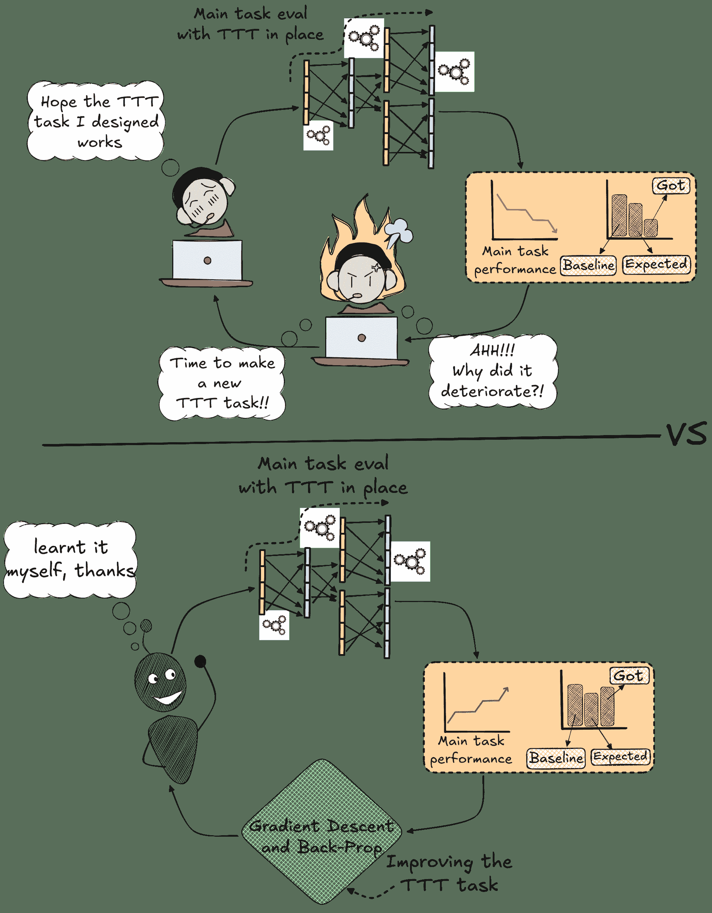
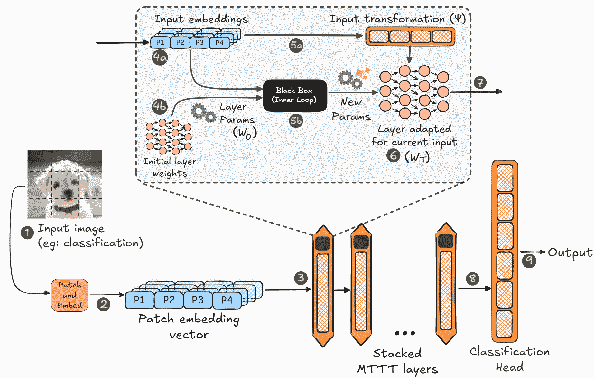
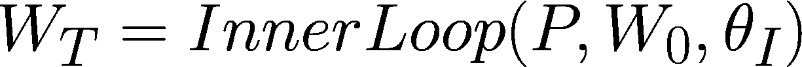
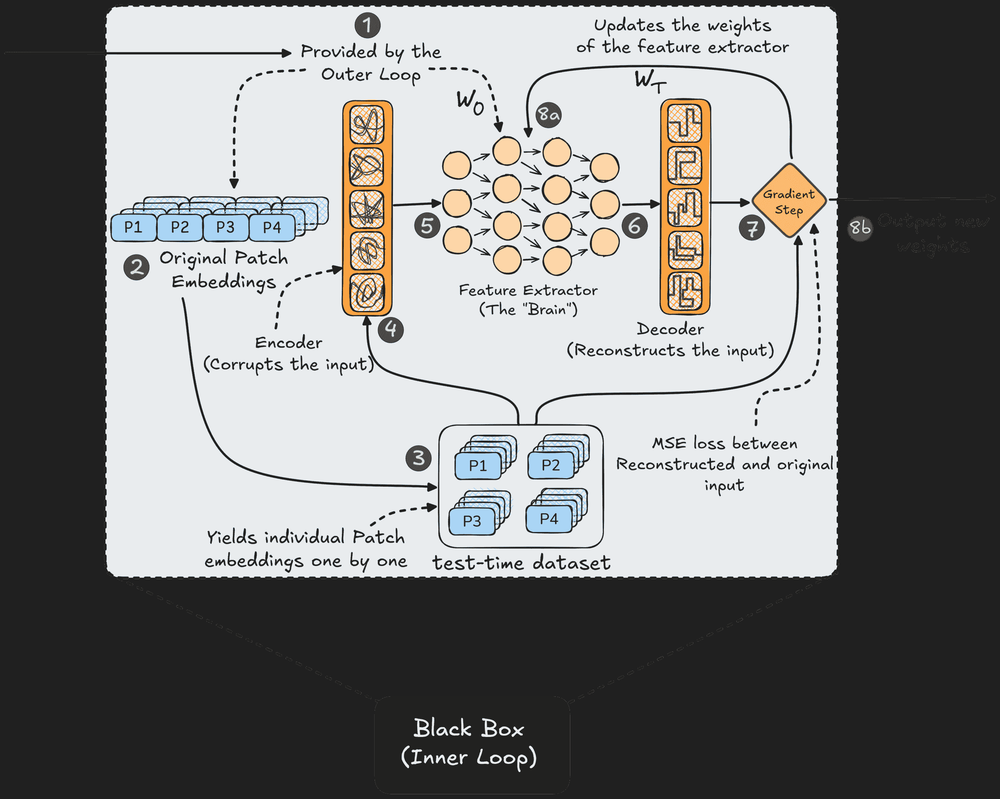
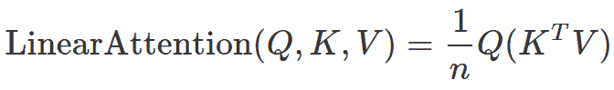
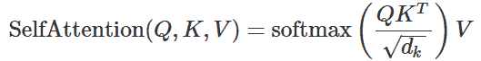
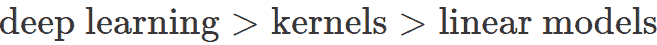
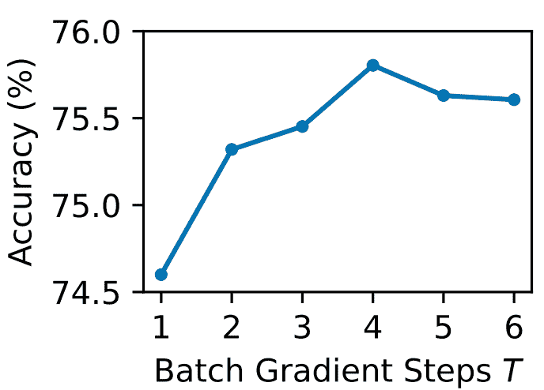
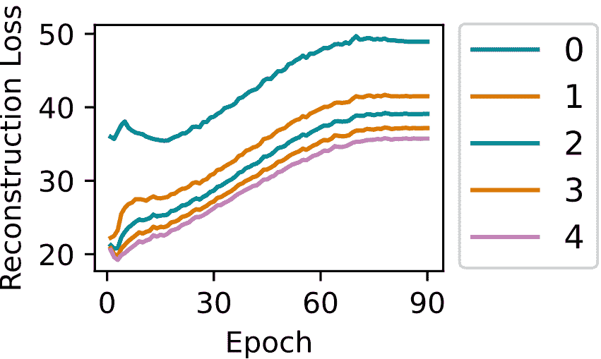

# 自进化人工智能时代已经到来

> 原文：[`towardsdatascience.com/the-age-of-self-evolving-ai-is-here/`](https://towardsdatascience.com/the-age-of-self-evolving-ai-is-here/)

## 1. <mdspan datatext="el1752805566918" class="mdspan-comment">引言</mdspan>

在我之前的一篇[文章](https://towardsdatascience.com/can-ai-truly-develop-a-memory-that-adapts-like-ours/)中，我们探讨了谷歌的 Titans ([Behrouz 等人，2024](https://arxiv.org/abs/2501.00663))¹以及如何使用 TTT（测试时训练）来装备一个 LLM（大型语言模型）以类似人类的、可塑的记忆，该记忆可以在测试时更新其信息。

如其名所示，测试时训练是一种允许模型在未见数据上更新其参数的范例。但在测试时，没有可以引导模型正确方向的地面真实标签（因为这将是明显的作弊）。相反，它使用数据执行一个任务（设计和嵌入到模型中），这使模型“潜意识”地了解它。

这样的任务示例可以是：

+   ***旋转预测*** **([Gidaris 等人，2018](https://arxiv.org/abs/1803.07728))²***：输入图像被任意旋转（例如，90°、180°或 270°），模型被要求预测正确的方向。这使得它能够识别显著特征并确定哪个方向是“向上”。

+   ***掩码语言建模* ([Devlin 等人，2019](https://aclanthology.org/N19-1423/?utm_campaign=The+Batch&utm_source=hs_email&utm_medium=email&_hsenc=p2ANqtz-_m9bbH_7ECE1h3lZ3D61TYg52rKpifVNjL4fvJ85uqggrXsWDBTB7YooFLJeNXHWqhvOyC))³***：测试实例中的一个或多个标记被掩码。模型的任务是在掩码标记作为地面真实值的同时预测缺失的标记，这激励了对语言的多方面理解。

+   ***置信度最大化* ([Sun 等人，2020](https://proceedings.mlr.press/v119/sun20b.html))⁴***：模型被激励使其输出 logits（例如，分类 logits [0.3, 0.4, 0.3]）更加尖锐（例如，[0.1, 0.8, 0.1]），从而减弱其外交倾向。

但这些都是关于哪些任务可能最好地转化为学习的推测，因为是人类想象出来的，而如今人类并不是“最聪明”的，为什么不让我们让 AI 自己找出答案呢？

我们的梯度下降和优化算法通常被认为是人类有史以来最具有影响力的算法之一。那么，为什么不把这些测试时训练完全留给这些算法，让模型学习如何学习呢？

## 2. 动机：为什么需要它？

在其核心，这项研究是由对现有测试时训练（TTT）范式的基本不满所驱动的。历史上的 TTT 算法一直依赖于一种艺术形式。一个人类“设计师”（即一个有创造力的研究人员）必须手工制作一个自我监督的任务，如上述任务，并希望练习这个特定任务会在某种程度上转化为对主要目标更好的表现。论文恰当地称这种过程为“艺术，结合独创性和试错”，这个过程极其容易受到人文谬误的影响。

不仅人类设计的任务可能表现不佳，甚至可能适得其反。想象一下，如果将模型训练为旋转预测的专家作为其 TTT 任务。但现在，如果一个图像具有特定方向的特征，比如指向下箭头表示“下载此文件”，由于 TTT 任务（表示上传）而被翻转成指向上的箭头，它可能会完全破坏模型对该图像的理解。

此外，我们可以将其外推到对人类独创性的日益减少依赖和对自动化的日益依赖。像整理包含数千个“不良词汇”的词汇库，仅为了分类垃圾邮件这样的任务，已经成为过去的遗迹，提醒我们我们已经走了多远。多年来，一个传统的规则已经出现：自动化始终超越了构思它的非常人类独创性。

（来源：作者）

通过梯度下降可视化为什么手动 TTT 设计会劣于 Meta-TTT。

## 3. 学习在测试时学习

Meta、斯坦福和伯克利的研究人员([Sun 等人，2024](https://arxiv.org/abs/2407.04620))⁵共同参与了这次重大的合作，他们成功地参数化了 TTT 任务本身，这意味着现在模型可以选择，而不是人类，哪个任务将对提高主要目标的表现产生最大的影响。

这意味着现在模型不仅可以训练测试数据，还可以选择如何使用测试数据来训练自己！

### 3.1 它是如何工作的？

研究人员将整个过程分为两个部分——内部循环和外部循环，其中外部循环在主要目标上训练模型并定义 TTT 任务，而内部循环在定义的 TTT 任务上训练隐藏层。

#### 3.1.1 外部循环：将人类独创性从方程式中排除

这在这个系统中充当“元教师”。除了让模型学习如何分类图像外，它还被分配为创建内部循环以执行 TTT 的教程。它通过将整个 TTT 过程转换为一个巨大的、可微分的函数，并从端到端进行优化来实现这一点。

这个多步骤的过程可以概述如下：

（来源：作者；原始小狗照片由 Kristin O Karlsen 在 Unsplash 上拍摄）

模型的完整架构图，包括对 MTTT 层的放大视图。

黑色数字表示模型中信息流的序列 (步骤)。

**步骤 1 & 2：输入准备**

首先，输入图像 X 被分解成块，然后每个块通过嵌入层转换成一个嵌入。这给我们一个向量序列，即块嵌入向量，我们将其称为 P = (P₁, P₂, …, Pₙ)。

**步骤 3：整体架构**

这个向量 P 然后通过一系列堆叠的 MTTT 层，这些层也是模型的“大脑”。通过所有层后，最终表示被发送到一个标准的分类头以产生最终输出。为了理解每个 MTTT 层中发生的事情，我们放大其中一个以剖析和理解其内部机制。

**步骤 4：从嵌入中学习**

每个 MTTT 层都有一个可学习的参数集 *W₀* (步骤 4b)，它在看到任何数据之前充当一个“通用”或“起始”状态。

原始输入块嵌入 *(P)* 被标记为 *步骤 4a*。

**步骤 5：内层循环和数据转换**

外层循环现在调用内层循环，我们目前将其视为一个黑盒。根据图示，它提供了两个关键点：

+   **起点 (5b)：** 初始层权重 W₀ 与当前输入一起馈送到内层循环。内层循环为该层输出 W[T] 权重，这些权重针对当前输入进行了特定调整。

(来源：作者)

W[T]，W[0]：输入特定权重和基线通用权重，分别。

P：块嵌入向量。

θ[I]：内层循环的可学习参数。

+   **数据 (5a)：** 输入嵌入 *P* 通过简单的线性变换 *(ψ)* 准备好由适配层处理。这样做是为了增加表达性，并使每个 MTTT 层学习关于输入的不同属性集。

在这里，新的权重 *W[T]*，现在针对小狗图像进行了特定调整，被加载到该层中。

**步骤 6 & 7：主要任务正向传递**

现在特征提取器拥有了专门的权重 *W[T]*，它使用这些权重来处理主要任务的数据。

从 *步骤 5a* 转换后的输入嵌入最终由针对输入的特征提取器层 *(步骤 6)* 处理，并作为第一个 MTTT 层的输出 *(步骤 7)*，然后由多个其他 MTTT 层处理，重复此过程。

**步骤 8 **&** 9：最终输出**

数据通过所有堆叠的 MTTT 层 *(步骤 8)* 和最终的分类头 *(步骤 9)* 后，我们得到最终的预测，*ŷ*。

* * *

**测试 vs 训练：**

如果模型正在测试，*ŷ* 保持为最终输出，但如果模型正在训练，则输出 *(步骤 9)* 用于计算损失（通常是交叉熵）与真实值 *y*。

外层循环，考虑到这个损失，计算所有参数的梯度，因此被称为“元梯度”。这个梯度，连同在主要任务上训练模型，也训练了内层循环的参数，这些参数定义了 TTT 的自监督任务。本质上，它使用最终的分类误差信号来问自己：

> ***“我应该如何设置测试时学习问题，以便最终结果会更好？”***

这使得模型设置最有效的监督任务，以最好地提高主要任务的表现，完全排除人类的猜测和直观感觉。

#### 3.1.2 内层循环：揭示黑盒

现在我们理解了外层循环，我们展开黑盒，即内层循环。

它的目标是将通用层权重（W₀）快速调整为当前观察到的输入的专用权重（W[T]）。

它通过解决外层循环为其设计的自监督重建任务来实现这一点。这个自包含的学习过程如下：

（来源：作者）

内层循环的放大视图，描述其内部工作原理。

黑色数字表示信息流序列（步骤）。

**步骤 1-3：设置学习问题**

内层循环从外层循环获得两个不同的输入：

1.  输入块嵌入（步骤 2），以及，

1.  特征提取器的通用权重 W[0]。

如步骤 3 所示，这些原始嵌入`P=(P₁, P₂, ...)`被制作成一个“测试时数据集”，其中每个数据点是按顺序产生的单个块的嵌入。

**步骤 4 & 5：正向传递 – 创建谜题**

首先，一个输入块通过编码器（外层循环学习到的参数*θ[Φ]*的线性层）。这个函数“破坏”了输入（步骤 4），创建了一个后续网络必须解决的谜题。这个被破坏的块随后被输入到特征提取器（“大脑”），它使用当前的通用权重（步骤 5）来处理它，以创建一个特征表示。

**步骤 6 & 7：学习步骤 – 解决谜题**

来自“大脑”的特征表示随后传递到解码器（其参数*θ[g]*也被学习）。解码器的任务是利用这些特征来重建*原始*、未破坏的块（步骤 6）。然后内层循环通过计算其重建与原始块之间的损失（通常是均方误差 MSE）来衡量其表现。这个误差信号驱动梯度步骤（步骤 7），该步骤计算特征提取器权重的小更新。

**步骤 8-9：最终输出**

这个从旧权重到新权重的更新过程在步骤 8a 中展示。经过一定数量的步骤运行后，*T*（直到所有补丁按顺序使用），最终的、适应的权重*(W[T])*就准备好了。内循环的任务完成了，如图 8b 所示，它输出这些新的权重供外循环用于主要任务预测。

### 3.2 注意力作为 MTTT 框架的特殊情况

到目前为止，我们将 MTTT 视为一个新颖的框架。但在这里，论文提供了其最优雅的洞察：被全球普遍接受的注意力机制，正是这种“学习学习”过程的简单版本。这也很有道理，因为现在模型不再受限于遵循特定的架构；相反，它可以为自己选择和定制完美的框架，这使得它作为一个包含一切的超级集，包括注意力。

作者通过一系列确定性数学推导（这将远远超出本文的范围）来证明这一点。他们表明，如果你为内循环的“大脑”（特征提取器）做出特定的选择，整个复杂、双循环的 MTTT 过程将简化并变成一个注意力机制。

**案例 1: 特征提取器 = 简单线性模型**

线性注意力([Katharopoulos 等人，2020](https://proceedings.mlr.press/v119/katharopoulos20a.html?ref=mackenziemorehead.com))⁶是一种比我们今天广泛使用的自注意力([Vaswani 等人，2017](https://proceedings.neurips.cc/paper/2017/hash/3f5ee243547dee91fbd053c1c4a845aa-Abstract.html))⁷更快且类似的实现。与自注意力不同，我们计算(*N×N*)注意力矩阵（其中“*N*”是标记的数量），导致 O(n²)瓶颈，线性注意力计算 K^T×V 矩阵(*DXD*；其中“*D*”是隐藏维度），它在*N*上是线性的。

（来源：作者）

通过首先乘以 K^T 和 V 矩阵，我们绕过了标准自注意力中计算的 O(n²)注意力矩阵

当“大脑”只是一个单层线性层，执行一次学习步骤（T=1，即只是一个补丁）时，它的“校正”（梯度步骤）在数学上就是线性回归。研究人员表明，整个过程完美地折叠成线性注意力的公式。编码器学习键（K）的角色，解码器学习值（V）的角色，主要任务输入变换（ψ）学习查询（Q）的角色！

**案例 2: 特征提取器 = 核估计器**.

现在，如果学习层（特征提取器）被替换为一个核估计器（计算加权平均），特别是 Nadaraya-Watson 估计器([Nadaraya, 1964](https://epubs.siam.org/doi/abs/10.1137/1109020?journalCode=tprbau))⁸ & ([Watson, 1964](https://www.jstor.org/stable/25049340))⁹，MTTT 过程就与标准的自注意力相同。核的相似性函数简化为查询-键点积，其归一化步骤变为 Softmax 函数。

(来源：作者)

标准的自注意力公式也只是“学习学习”超集的一个实例

**这意味着什么？**

作者表示，在过去三十年的机器学习和人工智能中，关于算法性能的清晰模式可以观察到。

(来源：作者)

我们知道：

1.  当特征提取器是一个线性模型时，我们得到快速但并不那么令人印象深刻的线性注意力。

1.  当特征提取器是一个核时，我们得到普遍的自注意力。

1.  当特征提取器是一个深度学习模型（例如 MLP）时，我们得到……？

**如果我们把一个更好的学习者（如 MLP）放入内循环会发生什么？** **它会表现得更好吗？**

## 4. MTTT-MLP：主要贡献

上面的问题的答案是本文作者的主要贡献。他们在内循环中配备了一个小型、两层多层感知器（MLP）作为特征提取器。

### 4.1 自注意力 vs. MTTT-MLP vs. 线性注意力

作者在 ImageNet 数据集上的两个截然不同的场景中对 MTTT-MLP 进行了测试：

#### 场景 1：标准场景（使用补丁的 ImageNet）

首先，他们在一个标准的 224×224 图像上测试了一个视觉 Transformer（ViT），该图像被分割成 196 个补丁。在这个配置中，O(n²)的方法也是实用的，这使得所有模型处于同一起跑线。

+   **结果：**

    +   MTTT-MLP（74.6%准确率）击败了其理论前身 MTTT-Linear（72.8%准确率），证实了更复杂的学习者表现更好的假设。

    +   然而，标准的自注意力（76.5%准确率）仍然占据主导地位。尽管这与我们的假设相反，但仍有道理，因为当你能承担在短序列上进行昂贵的二次计算时，原始的自注意力很难超越。

#### 场景 2：非标准场景（使用原始像素的 ImageNet）

研究者们通过用原始像素而不是补丁来喂养模型，极大地改变了环境。这使得序列长度从可管理的 196 增加到庞大的 50,176 个标记，这正是标准注意力算法的宿敌。

+   **结果：**

    +   这种比较只能在线性注意力与 MTTT-MLP 之间进行，因为自注意力**甚至无法运行**。对 50,176 个标记进行建模导致了注意力矩阵中的 25 亿个条目，这立即在任何标准 GPU 上引发了 OOM（内存不足）错误。

    +   线性注意力表现平庸，准确率在 54-56%之间。

    +   MTTT-MLP 以大幅优势赢得这一轮，达到 61.9%的准确率。

    +   即使与具有 3 倍参数和 2 倍 FLOPs 的更大线性注意力模型相抗衡，MTTT-MLP 仍然以大约 10%的优势获胜。

这些实验的关键结论是，尽管自注意力在原始性能方面占据主导地位，但 MTTT-MLP 在建模能力上提供了巨大的提升，同时保持了相同的甜美的 O(n)线性复杂度，使其能够扩展到大量输入。

### 4.2 观察内层循环的学习过程

为了解释他们新颖方法的趋势，作者提供了一对图表，帮助我们窥视内层循环是如何学习的，以及外层循环是如何让它学习最佳可能的教训的。

#### 步数与准确率：越多越好，但并非总是如此

（来源：改编自 [Sun 等人，2024](https://arxiv.org/abs/2407.04620)，图 1）

x 轴显示内层循环的梯度步数（T），y 轴显示在 ImageNet 数据集上的最终分类准确率。

当 T 从 1 增加到 4 时，模型在主要分类任务上的准确率相应地提高。这表明允许层在每个图像上进行几步自我适应，直接转化为更好的整体性能。这表明内层循环确实有助于主要任务，但好处并非无限。

性能在 T=4 时达到峰值，然后略有下降。这意味着 T=4 是最佳点，模型学习到足够的知识来辅助主要任务，但不会过多地专注于当前输入而忘记泛化性。

#### 时代与损失：两个循环的协同作用

（来源：改编自 [Sun 等人，202](https://arxiv.org/abs/2310.13807)[4](https://arxiv.org/abs/2407.04620)，图 1）

x 轴显示训练时代，y 轴显示内层循环在 TTT 任务上的重建损失。不同线条的颜色表示内层循环的训练步骤（T）。

这张图信息量最大。它让我们看到，随着外层循环学会设计更复杂的 TTT 任务，内层循环的性能是如何变化的。

有两个关键趋势需要观察：

**内层循环优化（垂直趋势**）

如果你整体观察蓝色线（T=0），你会注意到它的损失最高，因为这是外层循环在不断地改进设计 TTT 任务（随着时代的进步），而内层循环却从中没有学到任何东西的时候。

如果你观察任何单个时代（图表的垂直切片），对于所有其他（T ∈ [1,4]）的情况，损失低于蓝色线，并且随着 T 的增加，损失减少。这表明内层循环被允许学习得越多，其性能就越好（这是预期的行为）。

**外部循环元学习（水平趋势**）

这可能有点反直觉，因为训练过程中每一条线在损失上都有上升趋势。如果你注意到，除了蓝色（T=0）之外的所有线条都是从相对相同的损失值（在第 0 个时代）开始的，这比蓝色的损失要低得多。这是因为内部循环被允许在“不太难”的 TTT 任务上训练。毕竟，外部循环还没有机会设计它，这导致除了蓝色之外的所有线条都做得很好。

但随着外部循环开始加速（随着时代的推移），内部循环发现完成现在越来越困难但有用的任务变得越来越困难，导致内部循环的损失逐渐上升。

## 参考文献：

**[1]** Behrouz, Ali, Peilin Zhong, 和 Vahab Mirrokni. [“Titans: Learning to memorize at test time.”](https://arxiv.org/abs/2501.00663) *arXiv 预印本 arXiv:2501.00663* (2024).

**[2]** Gidaris, Spyros, Praveer Singh, 和 Nikos Komodakis. [“Unsupervised representation learning by predicting image rotations.”](https://arxiv.org/abs/1803.07728) *arXiv 预印本 arXiv:1803.07728* (2018).

**[3]** Devlin, Jacob, 等人. [“Bert: Pre-training of deep bidirectional transformers for language understanding.”](https://aclanthology.org/N19-1423/?utm_campaign=The+Batch&utm_source=hs_email&utm_medium=email&_hsenc=p2ANqtz-_m9bbH_7ECE1h3lZ3D61TYg52rKpifVNjL4fvJ85uqggrXsWDBTB7YooFLJeNXHWqhvOyC) *2019 年北美计算语言学协会人类语言技术分会会议论文集：第 1 卷（长篇和短篇论文）*. 2019.

**[4]** Sun, Yu, 等人. [“Test-time training with self-supervision for generalization under distribution shifts.”](https://proceedings.mlr.press/v119/sun20b.html) *机器学习国际会议*. PMLR, 2020.

**[5]** Sun, Yu, 等人. [“Learning to (learn at test time): Rnns with expressive hidden states.”](https://arxiv.org/abs/2407.04620) *arXiv 预印本 arXiv:2407.04620* (2024).

**[6]** Katharopoulos, Angelos, 等人. [“Transformers are rnns: Fast autoregressive transformers with linear attention.”](https://proceedings.mlr.press/v119/katharopoulos20a.html?ref=mackenziemorehead.com) *机器学习国际会议*. PMLR, 2020.

**[7]** Vaswani, Ashish, 等人. [“Attention is all you need.”](https://proceedings.neurips.cc/paper/2017/hash/3f5ee243547dee91fbd053c1c4a845aa-Abstract.html) *神经信息处理系统进展* 30 (2017).

**[8]** Nadaraya, Elizbar A. [“On estimating regression.”](https://epubs.siam.org/doi/abs/10.1137/1109020?journalCode=tprbau) *概率论及其应用理论* 9.1 (1964): 141-142.

**[9]** Watson, Geoffrey S. [“Smooth regression analysis.”](https://www.jstor.org/stable/25049340) *印度统计杂志，系列 A* (1964): 359-372.
