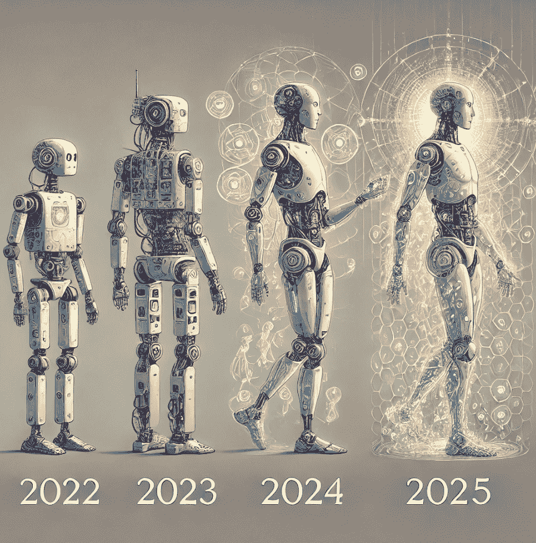
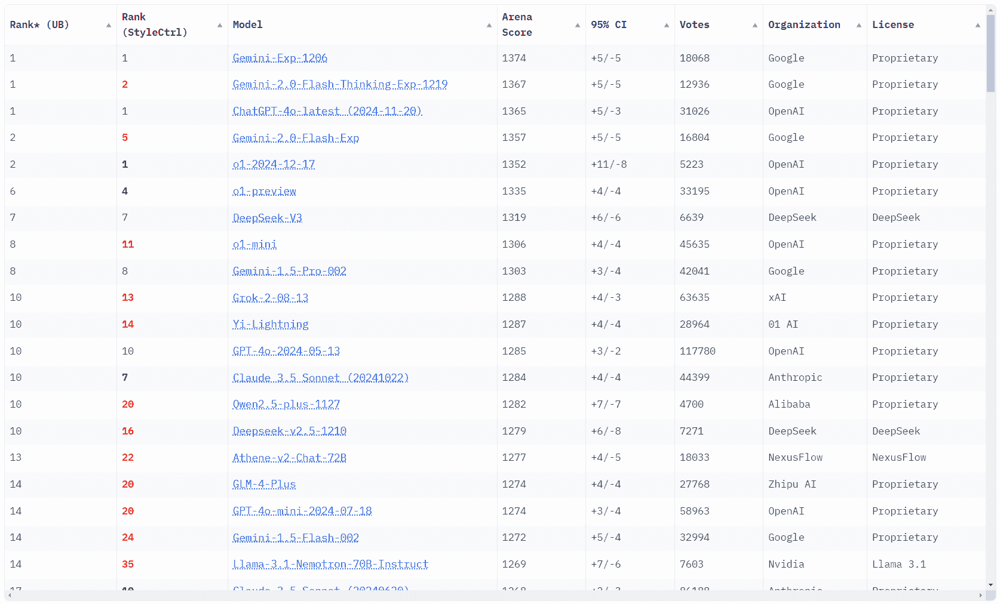
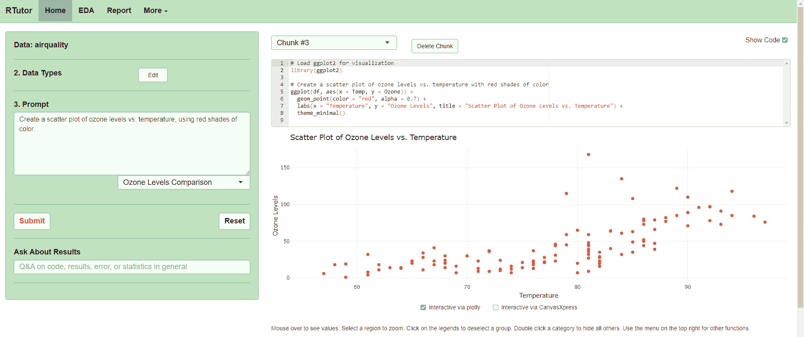

# 从 2024 年展望 AI（R）进化，面向 immediate future

> 原文：[`towardsdatascience.com/the-ai-r-evolution-looking-from-2024-into-the-immediate-future-0261a5db7103/`](https://towardsdatascience.com/the-ai-r-evolution-looking-from-2024-into-the-immediate-future-0261a5db7103/)

由作者使用 ChatGPT 多次提示 Dall-E3 生成的图片。由于它归用户所有，如[`openai.com/policies/terms-of-use/`](https://openai.com/policies/terms-of-use/)中“内容所有权”部分所述，可用于商业用途

经过包括 AI 系统中的 transformer 架构以及其他几项计算机科学突破在内的技术发展，过去 3-4 年疯狂活跃在特定应用的开发中，产生了（基于 AI 的）软件，这些软件我们甚至在 10-20 年前连做梦都不敢想。我们主要谈论的是运行强大处理和分析文本、计算机代码、图像、音频、视频甚至分子的 AI 模型，最近这些模型已经集成到多模态系统中。

在 2024 年，许多这些工具开始闪耀，开始塑造 immediate future，不仅影响我们的日常生活，还影响商业和市场。我们现在可以可靠地使用 LLM 来总结文本，寻找信息片段，甚至解决简单到中等复杂性的问题；我们可以利用拥有大量知识并像专家一样全天候可用的 LLM 来提高软件编写、脚本编写、数据分析以及软件利用。对于那些像我一样在绘画和设计上挣扎的人来说，我们现在可以通过基于 AI 的图像生成器和编辑器完成很多事情。在科学领域，出现了大量的应用，其中分子结构预测和分子设计可能位居首位，因为它们与现代生物技术、医学和制药的相关性极高。

在过去两年中，我们见证了 AI 生态系统以极快的速度增长，以许多方式成熟，其中一些是出乎意料的；一些分支增长速度远快于其他分支，其他分支迅速消亡，其他分支显示出潜力但停滞不前，其他分支竞争如此激烈以至于财务几乎崩溃。在这样的非常快速的发展中，市场迅速转变，企业，尤其是研发公司，必须不断适应。在这篇文章中，我将反思所有这些观点，并展望 2025 年以及可能接下来的几年可能带来什么。

## 首先，AI 的利润空间显然正在缩小

让我们从一个可能意想不到的事实开始我们的讨论：人工智能的竞争差距正在迅速缩小，这正在发生在人工智能的所有应用中。以下我将举例说明，最初是革命性公司或实验室的主打产品，很快就被其他人模仿并经常得到改进。

### 如大型语言模型所见

也许是 OpenAI 和它几年前发布的革命性 GPT-3 LLM 的例子，尤其是它的 ChatGPT 界面。它们确实看起来很独特，尽管我们知道其他人也在研究 LLM，而且与竞争对手相比，时间上要晚得多。但仅仅一年时间，巨头们就进入了市场，其他公司也变得具有竞争力，在某些情况下，提出的模型甚至比 OpenAI 在特定时间内的最佳模型还要好。在 2024 年全年，我们看到了所有巨头和其他一些较小的开发者为了争夺顶端位置而进行的竞赛，他们互相交换领先位置。你现在就可以通过访问[聊天机器人竞技场](https://lmarena.ai/)的排行榜，并与 2025 年 1 月 9 日拍摄的此截图进行比较，来判断当前的情况：

LLM 竞技场的排行榜截图，作者提供。

### 图像生成

要说谁在图像生成方面取得了突破，可能有点困难，因为这一切都始于大约十年前，当时 VQGAN 和 CLIP 模型的结合已经开始看起来有点革命性了：

> [**这个“人工梦境”程序是如何工作的，以及如何用它来创作自己的艺术品**](https://towardsdatascience.com/how-this-artificial-dreaming-program-works-and-how-you-can-create-your-own-artwork-with-it-387e5fb369d9)

到 2020 年和 2022 年，已经存在几个明显更好的模型：

> [**在单一文章中汇集所有现代图像生成器，并可在网上运行**](https://medium.com/geekculture/all-modern-image-generators-in-a-single-article-and-ready-to-run-online-9c944a681c35)

但然后，随着 Dall-E-3、稳定扩散和其他竞争对手的出现，这一切都达到了更高的水平，你可能已经非常清楚，这些工具甚至可以集成到聊天机器人系统中：

> [**像 ChatGPT 一样，但具有网络搜索和图像生成功能，并且免费在你的 Skype 上使用**](https://ai.plainenglish.io/like-chatgpt-but-with-web-search-and-image-generation-capabilities-and-free-on-your-skype-b06388dd8c76)

再次强调所有这些讨论的重点，事实是今天有数十种替代方案存在。

### 人工智能在化学和生物学中的应用

除了主流的 AI 工具，如 LLMs，它们无处不在地找到应用之外，在过去的 4-5 年中，还出现了几个利基应用，尤其是在 2021 年 Deepmind 揭示了其 [AlphaFold 2 系统如何赢得 CASP14（在此处查看一些关键博客文章）](https://lucianosphere.medium.com/here-are-all-my-peer-reviewed-and-blog-articles-on-protein-modeling-casp-and-alphafold-2-d78f0a9feb61)) 之后，尤其是在化学和生物学领域。

当这种情况发生时，那些致力于创建蛋白质结构预测系统的学者们感到非常沮丧。但他们很快利用了这一切，采用了 DeepMind 在 AlphaFold 2 中放入的元素和想法，创造了各种基于 AI 的新工具。这不仅仅包括结构预测，还包括处理和分析分子结构和模型，特别值得一提的是设计全新的蛋白质，这一切都由 AI 驱动：

> [**使用一种理解与任何…相互作用的新 AI 模型打破蛋白质设计的界限**](https://towardsdatascience.com/breaking-boundaries-in-protein-design-with-a-new-ai-model-that-understands-interactions-with-any-388fd747ee40)

所有这些，以至于一些历史上难以解决的问题，例如设计能够与其他蛋白质结合的新蛋白质（这在医学上具有巨大的应用），已经非常接近解决：

> [**蛋白质结合剂设计的“AlphaFold 时刻”可能即将到来**](https://medium.com/a-microbiome-scientist-at-large/the-alphafold-moment-for-protein-binder-design-might-be-imminent-a25fb35e6570)

然后，在 2024 年，Deepmind 发布了其 [多模态 AlphaFold 3 系统](https://towardsdatascience.com/sparks-of-chemical-intuition-and-gross-limitations-in-alphafold-3-8487ba4dfb53)，几个月内它就已经面临了有效的竞争对手，这些竞争对手可能表现同样出色，通常具有更宽松的许可：

> [**“开源 AlphaFold 3 竞赛”中的首批赢家出现**](https://pub.towardsai.net/first-winners-emerge-in-the-race-to-open-source-alphafold-3-a751d3abee7c)

再次强调，AlphaFold 3 的案例表明，竞争的差距已经大幅缩小。正如这个案例所显示的，这一切甚至发生在非常利基的应用中，而不仅仅是像 LLMs 或图像生成器这样被公众广泛使用的 AI 系统。

> 顺便说一句，所有这些小节都与最近授予蛋白质设计研究所的 D. Baker 以及 DeepMind 的 J. Jumper 和 D. Hassabis 的诺贝尔奖直接相关。我写了一篇社论，您可以在以下链接中阅读：
> 
> [**诺贝尔化学奖：化学中 AI 的过去、现在和未来 – 通讯生物学**](https://www.nature.com/articles/s42003-024-07113-5)

很快，新的 [AI 模型开始被构建，试图捕捉分子生物学的整个中心法则](https://nexco.ch/blog/AI-models-begin-to-capture-the-whole-central-dogma-of-molecular-biology)，一旦实现，这将带来许多应用和影响。

### 总结

上述例子展示了没有任何开发者能从 AI 快速发展的步伐中幸免，这确保了激烈而迅速的竞争。对于终端用户来说这是好事，因为它大幅降低了价格，并迫使公司使他们的 AI 系统更加开放。但这个因素也使得公司难以脱颖而出或收回巨额投资。可能没有像通用人工智能（AGI）那样的大突破，或者一个完全工作的多模态系统，能够全面理解物理学、化学和生物学，所有这些业务和投资者可能需要耐心等待，在看到显著回报之前可能需要等待很长时间，甚至可能在这个过程中消耗掉一些资源。

## 第二，进展速度飞快

我相信你也会同意这一点。就在 AI 研发的“虫子树”中的一个分支开始放缓的时候，另一个分支又冒出来了。例如，传统的 LLM 如 GPT-4 最近没有看到突破性的更新，但专注于更智能推理和决策的新模型，如 OpenAI 的 o1，据说具有优越的问题解决能力，正在以令人兴奋的方式推动可能性的前沿。顺便说一句，要了解更多关于 GPT-o1 声称的优越问题解决能力，请查看 Abhinav Prasad Yasaswi 提供的这篇出色的介绍：

> [**OpenAI o1：这是否是重塑我们所知每一个知识领域的神秘力量？**](https://towardsdatascience.com/openai-o1-the-enigmatic-force-that-will-reshape-every-knowledge-sector-that-we-know-of-or-99396d641fff)

多模态也在 OpenAI 的模型中取得突破，这些模型能够理解和生成图像，以及理解和合成音频，这是作为核心 AI 模型本身的一部分，而不是通过调用外部声音识别或合成系统。Abhinav Prasad Yasaswi 也写了一篇关于他首次亲身体验这个系统的精彩文章，你可以通过 ChatGPT 的免费版本尝试：

> [**ChatGPT 的先进语音模式已上线！我的第一印象……**](https://ai.gopubby.com/chatgpts-advanced-voice-mode-is-here-my-first-impressions-df92a1b36b52)

### 化学和生物学 AI 的前沿：设计和多模态

在分子建模领域，目前有两个主要创新方向并行且交织发展。一个方向是理解不仅仅是蛋白质分子，正如 AlphaFold 2 所做的那样，还包括所有其他类型的分子——从构成药物和代谢物的核酸、离子和小分子，到材料等。另一个领先的大分支涉及不仅仅是预测，而是实际设计分子，主要是蛋白质或小分子，这些分子在临床上有用。这本质上得益于我之前讨论的多模态发展：

> [**AlphaFold 3 中的“化学直觉火花”——以及巨大的局限性！”**](https://towardsdatascience.com/sparks-of-chemical-intuition-and-gross-limitations-in-alphafold-3-8487ba4dfb53)
> 
> [**AlphaFold 3 的进展与局限性概述**](https://medium.com/advances-in-biological-science/alphafold-3s-advances-and-limitations-in-a-nutshell-5ae0cdd814ea)

截至 2025 年 1 月初，像[AlphaFold 3，例如 Chai-1，Protenix Boltz-1](https://pub.towardsai.net/first-winners-emerge-in-the-race-to-open-source-alphafold-3-a751d3abee7c)这样的多模态系统，以及诺贝尔奖获得者 D. Baker 实验室的 RoseTTAFold-AllAtoms，都在通过让计算机以全新的方式理解蛋白质及其与核酸、配体、脂质和离子的复合物，从而推动由 AlphaFold 2 引发的革命。显然，科学领域的 AI 正处于快速增长的 S 曲线发展点的快车道上。

在正在出现并可能再次产生重大影响的 AI 科学分支中，多模态系统是一个，它不仅包括蛋白质结构，还包括基因组数据，其核心是围绕应用于生物序列的大型语言模型，这些模型基于之前的工作，展示了 AI 如何从生物序列中检测出结构一致性和进化一致性的模式：

> [**使用蛋白质语言模型将蛋白质结构预测速度提高百万倍**](https://towardsdatascience.com/protein-structure-prediction-a-million-times-faster-than-alphafold-2-using-a-protein-language-model-d71c55e6a4b7)
> 
> [**gLM2 和基因组学的多模态基础模型**](https://medium.com/advances-in-biological-science/glm2-and-multimodal-foundational-models-for-genomics-d53167bfd5d7)

## 第三，提示工程的价值

或者换句话说，语境如何帮助提高 AI 在特定情况下的性能，甚至可能非常显著，正如 DeepMind 在 LLMs 上的工作多年前就已经量化所示：

> [**DeepMind 新工作揭示语言模型的至高提示种子**](https://towardsdatascience.com/new-deepmind-work-unveils-supreme-prompt-seeds-for-language-models-e95fb7f4903c)

尽管 LLMs 和其他 AI 模型在问题解决能力上存在严重限制，以及即使错误时也具有强烈的偏见和权威语气，但这些限制现在至少非常清楚。事实上，我们现在知道，这些问题是影响大多数 AI 模型的最大问题之一，它们通常与幻觉有关，有时可以检测到，但并不总是可以抑制，从而被压制：

> [**一种检测大型语言模型产生的“虚构”的新方法**](https://towardsdatascience.com/a-new-method-to-detect-confabulations-hallucinated-by-large-language-models-19444475fc7e)

随着公司开发新的模型，他们现在非常小心地抑制这些问题，尽可能减少。这仍然面临问题；一方面是因为我们人类总是想出新的方法来欺骗模型和破解它，另一方面是因为有时引入 AI 工具中的安全协议使得它隐藏了实际上是无辜的内容。Cassie Kozyrkov 深入探讨了一个这样的非常近期的例子：

> [**打破 ChatGPT 的名字：大卫·梅耶是谁？**](https://towardsdatascience.com/the-name-that-broke-chatgpt-who-is-david-mayer-f03f0dc74877)

回到提示的问题，如果你是 LLM 或 AI 图像生成器的频繁用户，你就知道这有多么重要。改变一个词，结果可能会完全不同；通常，当这种情况发生时，这往往是因为模型接近于产生幻觉。换句话说，如果你用不同的方式提出相同的问题或请求，并且始终得到相同的输出（即答案、图像等），那么 AI 模型很可能没有产生幻觉。不过，免责声明，请带着一颗宽容的心看待这一点！

事实上，即使是智能程度最高的 AI 模型也受限于它们所知道的知识，常常在需要关于非常特定情况详细知识的任务上遇到困难。通过提示模型，即提供信息的同时提出请求，可以极大地帮助；然而，许多应用可能需要过大的上下文，其中会出现“迷失在中间”的问题，正如 Vladimir Blagojevic 和 Jérôme DIAZ 在 TDS Editors 中讨论的那样：

> [**在 Haystack 中增强 RAG 管道：介绍 DiversityRanker 和 LostInTheMiddleRanker**](https://towardsdatascience.com/enhancing-rag-pipelines-in-haystack-45f14e2bc9f5)
> 
> [**在长上下文语言模型时代，检索增强生成仍然相关**](https://towardsdatascience.com/why-retrieval-augmented-generation-is-still-relevant-in-the-era-of-long-context-language-models-e36f509abac5)

## 第四点，仍然对此感到惊讶：AI 正在改变软件的使用和开发方式

没错，如果你从事数据科学或编写代码，你肯定知道：AI 正在改变软件的创建和使用方式，以及数据是如何被分析的。问题是，随着基于 AI 工具的使用，开发者可以更快、更高效地工作，而技术知识有限的非程序员可以快速创建脚本和小的软件程序。

而你甚至不需要使用像 OpenAI 的“高级编程“co-pilot”或 VSC 的集成 AI 助手这样的工具。只需打开 ChatGPT 或任何类似的系统，用自然语言简单地提出你的问题就足够了。我早就报告过 GPT-3 在这方面有多么强大：

> [**使用 GPT-3 的免费代码编写器创建 JavaScript 函数和 Web 应用**](https://javascript.plainenglish.io/creating-javascript-functions-and-web-apps-with-gpt-3s-free-code-writer-4c3a0a70f01f)

### 通过影响编码，AI 影响了软件利用和数据分析

如本节引言中所述，AI 对代码编写的影响反过来又影响了我们与数据和软件的交互方式。这是因为 AI 模型，尤其是 LLMs，可以调解以将用户用自然语言表达出的意图与程序的内部代码进行沟通，这样用户就可以在不编写任何代码或指令的情况下快速实现结果。我就在 GPT-3 以程序形式发布后的两年前就设计了这一点：

> [**通过将语音转换为命令，用 GPT-3 控制网络应用**](https://towardsdatascience.com/control-web-apps-via-natural-language-by-casting-speech-to-commands-with-gpt-3-113177f4eab1)

在我们的基于虚拟现实软件的分子图形中，这种基于 LLM 的自然语言请求到内部代码的转换协议特别有用，因为用户正忙于处理分子。你可以在一篇专门的帖子中了解更多关于这一点，实际上它展示了我们的程序如何将几个基于 AI 的工具耦合起来以提供完整的体验：

> [**将四个 AI 模型耦合以提供沉浸式可视化和建模的终极体验**](https://pub.towardsai.net/coupling-four-ai-models-to-deliver-the-ultimate-experience-in-immersive-visualization-and-modeling-9f52a4bd1443)
> 
> [**HandMol 让化学教育未来触手可及**](https://medium.com/age-of-awareness/the-future-of-chemistry-education-is-just-around-the-corner-with-handmol-729e8a04e4ed)

促进软件利用包括更容易使用数据分析程序。一个特别出色的例子是 R-Tutor，这是一个基于网络的工具，帮助用户学习并将 R 编程应用于数据分析问题，以及通过将他们的请求转换为 R 代码来进行数据可视化：

R-Tutor 运行中的示例。作者截图。

然后，可以利用这种方法构建自己的程序，实现高度可定制且功能强大的系统，就像我这里所描述的那样：

> [**通过让 LLMs 访问…以自然语言请求进行强大的数据分析绘图**](https://towardsdatascience.com/powerful-data-analysis-and-plotting-via-natural-language-requests-by-giving-llms-access-to-9d34841c2a5d)

本节中我们涵盖的所有内容都指向两个主要趋势：一是针对特定问题的微型、专业软件工具的繁荣；二是随着公司意识到他们可以利用 AI 驱动的流程完成多少工作，定制软件开发的重生。因此，预计更多企业将能够获得他们需要的工具，以实现更快的开发、分析和决策，从而比以往任何时候都更快地推动创新。

## 第五点：我们学到的是，有时候，简单更好…

..而且 AI 并非万能。

事实上，传统工具通常非常稳定和可靠，因此企业更愿意选择它们，因为它们知道它们会起作用，即使它们不是最前沿或超级畅销的。因此，AI 工具市场中的初创公司正在学习，为了成功，他们的产品必须提供真实、独特的价值，而不仅仅是自动化的新奇性。虽然不清楚公司有多大程度上正在回归旧工具来处理某些流程，但我们已经看到许多想法失败了；例如，自动图像生成在许多事情上工作得很好，但仍然无法在需要事实准确性的某些应用中击败人类设计师。

这也适用于化学和生物学中的 AI，我在上面已经多次提到。事实证明，[最近几届 CASP（2020 年 AlphaFold 2 获胜者的比赛）的版本显示，例如，核酸建模在 AI 中仍然很糟糕](https://pmc.ncbi.nlm.nih.gov/articles/PMC10168427/)，但如果有一个模板可用，使用老式的同源建模效果会好得多。同样，配体对接和虚拟筛选预计将极大地受益于 AI 驱动的系统，但详细的广泛测试仍然缺失，因此一个性能不佳但至少是众所周知的传统方法可能就足够了。

## 第六点：AI 推动了（高度专业化的）服务提供商公司的复苏

传统上，科技界推出的产品是客户可以自行设置的产品，尽可能避免咨询服务、安装、支持等服务——尽管当然往往不可避免。但在人工智能时代，这种情况正在改变；实际上，它已经改变了，许多公司正在做正是这样的事情：提供服务——从一些简单的培训到其他复杂的特定软件/人工智能模型开发、调整和部署。

例如，看看 Gladia 公司，它提供 OpenAI 的 Whisper AI 语音识别系统的简化 API 包装，正如我在这里所描述的：

> [**Web Speech API：它的工作原理，它不工作原理，以及如何通过将其与 GPT 语言模型链接来改进它**](https://towardsdatascience.com/web-speech-api-what-works-what-doesnt-and-how-to-improve-it-by-linking-it-to-a-gpt-language-dc1afde54ced)

或者想想 Tamarind.Bio 公司，其主要产品是一系列围绕促进访问高度专业化的 AI 模型进行生物学的服务：

> [**Tamarind Bio**](https://www.tamarind.bio/)

这里的关键是，大多数软件，尤其是基于 AI 的软件，需要相当多的定制才能适应不同的环境和应用。这就是这些服务提供商如何帮助进行培训或微调现有模型，将它们集成到公司的业务流程中，以更简单的方式部署模型，等等。实际上，一些公司甚至正在构建全新的基于服务的模型，这些模型将尖端 AI 工具与专业知识相结合，以提供结果。

## 展望未来

随着我们进入 2025 年，我们已经非常清楚地意识到，我们已经在 AI 革命中深入其中，其影响已经重塑了行业、工作和创造力。我们迄今为止取得的进步是非凡的，未来的机会甚至更大。从更智能的工具到科学和技术的突破，AI 正在帮助我们更快地解决问题，以全新的方式工作，同时也允许新的商业和职业出现。

尽管公平性、伦理和可及性等挑战仍然存在，但我们与 AI 日益增长的经验使我们能够更好地应对这些挑战——这与 2-3 年前 AI 发展 S 曲线开始时的状况形成鲜明对比。接下来的几年将全部围绕着新技术，以及找到最佳方式来生活和与之共事。

## 其他关于 AI 的有趣文章

> [**微软研究人员挑衅性地表示，他们在 GPT-4 中发现了“人工智能的火花”**](https://pub.towardsai.net/provocatively-microsoft-researchers-say-they-found-sparks-of-artificial-intelligence-in-gpt-4-e1120f8bd058)
> 
> [**AlphaFold 3 和 GPT-4o 在蛋白质数据银行条目知识上的史诗级“跨界”**](https://towardsdatascience.com/epic-crossover-between-alphafold-3-and-gpt-4os-knowledge-of-protein-data-bank-entries-ec7b6dd589e0)
> 
> [**科学家们认真对待模仿人类思维的大型语言模型**](https://towardsdatascience.com/scientists-go-serious-about-large-language-models-mirroring-human-thinking-faa64a36ad71)
> 
> [**我们和计算机准备好通过语音进行常规交互了吗？**](https://medium.com/design-bootcamp/are-we-and-computers-ready-for-routine-interaction-via-speech-4e809e3bdd81)

* * *

***[www.lucianoabriata.com](https://www.lucianoabriata.com/)** 我写关于我广泛兴趣范围内的所有事情：自然、科学、技术、编程等。**[成为 Medium 会员](https://lucianosphere.medium.com/membership)** 以获取所有故事（该平台的联盟链接，我不会向您收取任何费用，而我将获得少量收入）和**[通过电子邮件订阅我的新故事](https://lucianosphere.medium.com/subscribe)**。要**咨询小型工作**，请查看我的**[服务页面](https://lucianoabriata.altervista.org/services/index.html)**。您可以**[在此联系我](https://lucianoabriata.altervista.org/office/contact.html)**。
