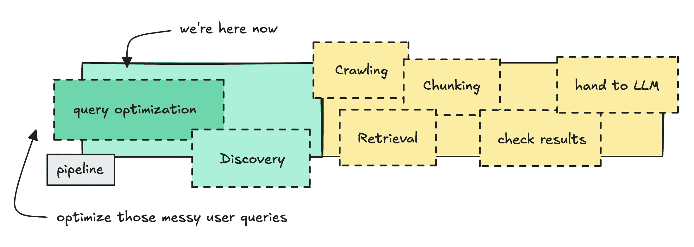
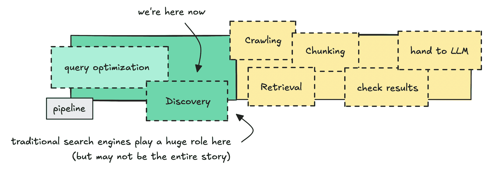
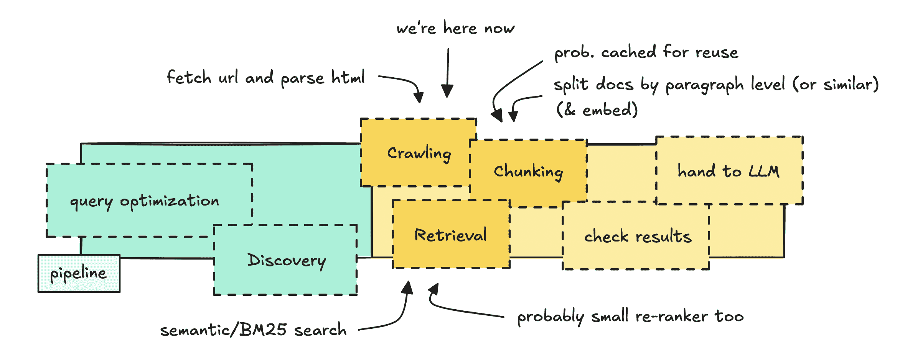
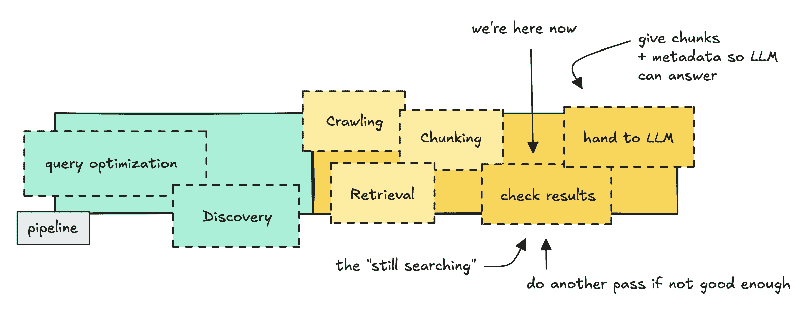
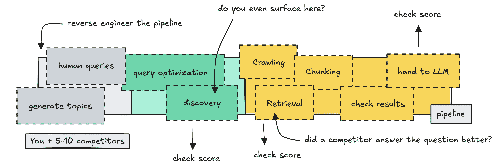

# AI 聊天机器人网络搜索背后的架构

> 原文：[`towardsdatascience.com/the-architecture-behind-web-search-in-ai-chatbots-2/`](https://towardsdatascience.com/the-architecture-behind-web-search-in-ai-chatbots-2/)

<mdspan datatext="el1764828771491" class="mdspan-comment">当你向 ChatGPT 或 Claude 询问“搜索网络”时</mdspan>，它不仅仅是从其训练数据中回答。它是在调用一个单独的搜索系统。

大多数人都知道这部分。

不太清楚的是传统搜索引擎有多重要，以及有多少是基于它们构建的。

所有这些并不完全公开，所以我在这里进行一些心理推理。但我们可以通过观察更大的系统来使用不同的提示来构建一个有用的心理模型。

我们将探讨查询优化、搜索引擎如何用于发现、内容分块、“即时”检索，以及如何可能逆向工程这样一个系统来构建一个“GEO [<mdspan datatext="el1764828654960" class="mdspan-comment">生成式引擎优化</mdspan>] 评分系统。”

如果你熟悉 RAG，其中一些内容将是重复的，但仍然可以很有用，看看更大的系统如何将管道分成发现阶段和检索阶段（如果这是新的）。

如果你时间紧迫，你可以阅读 TL;DR。

## TL;DR

在这些 AI 聊天机器人中，网络搜索可能是一个两步的过程。第一步依赖于传统搜索引擎来查找和排名候选文档。在第二步中，它们从这些 URL 中获取内容，并使用段落级检索提取最相关的段落。

与传统 SEO 相比，重大变化是查询重写和段落级分块，这允许排名较低的页面在特定段落与问题匹配得更好时超越排名较高的页面。

## 技术过程

Claude 和 ChatGPT 背后的公司对其网络搜索系统在 UI 聊天中的工作方式并不完全透明，但我们可以通过拼凑信息来推断很多。

我们知道它们依赖于搜索引擎来找到候选者，在这个规模上，不这样做将是荒谬的。我们也知道，当 LLM 根据其答案进行定位时，它们实际上看到的是文本片段（块或段落）。

这强烈暗示了在这些块上基于嵌入的检索，而不是在完整页面上。

这个过程有几个部分，所以我们将一步一步地进行。

### 查询重写 & 扩散

首先，我们将看看系统如何清理人类查询并扩展它们。我们将涵盖重写步骤、扩散步骤以及为什么这对 SEO 很重要。

我们将从查询重写开始——展示我们正在经历的整个管道

我认为这部分可能是最透明的，也是大家在线上最一致认同的部分。

查询优化步骤是将人类查询转化为更精确的内容。例如，“请搜索我们之前讨论过的那些红色鞋子”变为“棕色红色耐克运动鞋。”

另一方面，扩展步骤是关于生成额外的重写。所以如果一个用户询问“我附近的徒步路线”，系统可能会尝试“斯德哥尔摩附近的初学者徒步”、“斯德哥尔摩公共交通附近的日间徒步”或“斯德哥尔摩附近的家庭友好型步道”等。

这与仅仅使用同义词不同，传统搜索引擎已经对此进行了优化。

如果你第一次听说这个，并且还不信服，可以查看谷歌自己关于[AI 查询扩展](https://developers.google.com/search/docs/appearance/ai-features)的文档，或者对查询重写进行一些研究。

实际上这个方法能到什么程度，我们无法得知。它们可能不会过度扩展，只是用一个查询开始，如果结果不尽人意，再通过管道发送额外的查询。

我们可以说，这很可能不是一个大模型在处理这部分工作。如果你看研究，[Ye 等人](https://aclanthology.org/2023.findings-emnlp.398/)明确使用 LLM 生成强大的重写，然后将其提炼成一个更小的重写器，以避免延迟和成本开销。

关于这个管道部分的意义，对于工程来说，只是意味着你想要清理混乱的人类查询，并将它们转换成具有更高命中率的查询。

对于那些商业和 SEO 人士来说，这意味着你们一直优化的人类查询正在被转换成更机械、文档形状的查询。

就我理解，SEO 过去非常重视标题和副标题中与精确的长尾短语匹配。如果有人搜索“适合坏膝盖的最佳跑鞋”，你会坚持使用那个确切的字符串。

你现在需要关注的是实体、属性和关系。

因此，如果一个用户询问“干燥皮肤的护肤品”，重写可能包括“保湿霜”、“封闭剂”、“保湿剂”、“神经酰胺”、“无香料”、“避免酒精”等，而不仅仅是“如何找到适合干燥皮肤的优质产品”。

但让我们明确一点，以避免混淆：我们无法看到内部的重写本身，所以这些只是例子。

如果你对此部分感兴趣，可以深入研究。我敢打赌，关于如何做得好的论文有很多。

让我们继续讨论这些优化查询的实际用途。

### 使用搜索引擎（用于文档级发现）

到现在为止，这已经成为一个普遍的知识，为了获得最新的答案，大多数 AI 机器人依赖于传统的搜索引擎。这并不是全部的故事，但它确实将网络缩小到可以工作的规模。

接下来是文档发现——展示我们正在经历的整个管道

我假设整个网络太大、太嘈杂、变化太快，以至于 LLM 管道无法直接提取原始内容。因此，通过使用已经建立的搜索引擎，你可以得到一种缩小搜索范围的方法。

如果你看看与数百万份文档一起工作的更大的 RAG 管道，它们会做类似的事情。也就是说，使用某种过滤器来决定哪些文档是重要的，值得进一步处理。

对于这部分，我们确实有证据。

[OpenAI](https://help.openai.com/en/articles/9237897-chatgpt-search)和[Anthropic](https://techcrunch.com/2025/03/21/anthropic-appears-to-be-using-brave-to-power-web-searches-for-its-claude-chatbot/)都表示，他们使用像 Bing 和 Brave 这样的第三方搜索引擎，以及他们自己的爬虫。

可能到现在为止，Perplexity 已经独立构建了这部分，但在最初，他们也会做同样的事情。

我们还必须考虑，像 Google 和 Bing 这样的传统搜索引擎已经解决了最困难的问题。它们是成熟的技术，可以处理诸如语言检测、权威评分、域名信任、垃圾邮件过滤等问题。

丢弃所有这些来自己嵌入整个网络似乎不太可能。

然而，我们不知道他们实际上每次查询会检索多少结果，是前 20 个还是 30 个。一篇[非官方文章](https://www.seerinteractive.com/insights/87-percent-of-searchgpt-citations-match-bings-top-results)比较了 ChatGPT 和 Bing 的引用，观察了排名顺序，发现一些结果甚至来自第 22 位。

如果这是真的，这表明你需要争取大约前 20 名的可见度。

此外，我们也不知道他们使用哪些其他指标来决定哪些内容会从中浮现。这篇文章[链接](https://arxiv.org/html/2509.08919v1)认为，AI 引擎更倾向于** earned media**（ earned media）而不是官方网站或社交媒体。

然而，搜索引擎的工作（无论是完全第三方还是混合型）是发现。它根据权威性和关键词对 URL 进行排名。

它可能包括一些信息片段，但这本身不足以回答问题。除非当然是一个非常简单的问题，比如“X 公司的 CEO 是谁？”

但对于更深入的问题，如果模型只依赖于片段、标题和 URL，它很可能会在细节上产生幻觉。这不足以提供足够的上下文。

因此，这促使我们走向一个两阶段架构，其中包含一个检索步骤（我们很快就会讨论到）。

这在 SEO 方面意味着什么？

这意味着你仍然需要在传统搜索引擎中排名很高，才能被包含在最初处理的文档批次中。所以，是的，经典 SEO 仍然很重要。

但这也可能意味着你需要考虑他们可能使用的新指标来对这些结果进行排名。

这个阶段完全是关于将宇宙缩小到几个值得深入挖掘的页面，使用既定的搜索技术和内部调节。其他所有内容（“它返回信息段落”的部分）都在这一步之后，使用标准的检索技术。

### 爬取、分割和检索

现在，让我们看看当系统识别出一些有趣的 URL 时会发生什么。

一旦一小批 URL 通过了第一轮筛选，流程就相当直接：爬取页面，将其分解成片段，嵌入这些片段，检索与查询匹配的片段，然后重新排序。

这就是所谓的检索。

接下来是分块、检索——展示我们正在经历的整个流程

我在这里称之为“即时”是因为系统仅在 URL 成为候选时才嵌入片段，然后它会缓存这些嵌入以供重用。如果你已经熟悉检索，这部分可能对你来说是新的。

为了爬取页面，它们似乎使用自己的爬虫。对于 OpenAI 来说，这是 OAI-SearchBot，它应该随后获取原始 HTML 以便进行处理。

爬虫通常不会执行 JavaScript。它们最有可能依赖于服务器渲染的 HTML，因此相同的 SEO 规则适用：内容需要可访问。

一旦获取了 HTML，内容就必须被转换成可搜索的形式。

如果你刚开始接触这个，可能会感觉 AI“扫描文档”，但实际上并非如此。每次查询扫描整个页面会太慢也太昂贵。

相反，页面被分成段落，通常由 HTML 结构引导：标题、段落、列表、部分分隔符等。在检索的上下文中，这些被称为“片段”。

每个片段都变成了一个小型、自包含的单位。从 Perplexity UI 引用中，你可以看到片段的顺序是数十个标记，可能大约是 150 个，而不是 1000 个。

大概是 110-120 个单词。

在分块之后，这些单元使用稀疏和密集向量进行嵌入。这使得系统能够运行混合搜索并通过语义和关键词匹配查询。

如果你刚开始接触语义搜索，简而言之，这意味着系统搜索的是意义而不是精确的单词。*所以像“铁缺乏的症状”和“你的身体铁含量低的迹象”这样的查询在嵌入空间中仍然会靠近彼此。*

*如果你对嵌入的工作原理感兴趣，可以在这里了解更多[嵌入](https://towardsdatascience.com/working-with-embeddings-closed-versus-open-source-39491f0b95c2/)。*

一旦热门页面被分块和嵌入，这些嵌入很可能被缓存。没有人每天会重新嵌入相同的 StackOverflow 答案数千次。

这显然是系统感觉如此快速的原因，可能是因为热点的 95-98%的网页实际上已经被嵌入，并且被积极缓存。

我们不知道它们预嵌入的程度以及多少，以确保系统对热门查询运行得快。

现在，系统需要确定哪些片段是重要的。它使用每个文本片段的嵌入来计算语义和关键词匹配的分数。

它选择得分最高的片段。这可以是 10 到 50 个得分最高的片段。

从这里开始，大多数成熟的系统都会使用重新排序器（交叉编码器）再次处理这些顶级部分，进行另一轮排名。这是“修复检索混乱”阶段，因为不幸的是，由于许多原因，检索并不总是完全可靠的。

虽然他们没有提及使用交叉编码器，但 Perplexity 是少数公开其检索过程的之一。

他们的[搜索 API](https://www.perplexity.ai/hub/blog/introducing-the-perplexity-search-api)表示他们“将文档划分为细粒度单元”并对这些单元进行单独评分，以便他们可以返回“已排序的最相关片段。”

这一切对 SEO 意味着什么？如果系统像这样进行检索，你的页面不会被当作一个大的整体来处理。

它被分成几块（通常是段落或标题级别），这些块就是被评分的内容。在发现过程中，整个页面很重要，但一旦开始检索，重要的是这些部分。

这意味着每个部分都需要回答用户的问题。

这也意味着，如果你的重要信息没有包含在单个部分中，系统可能会失去上下文。检索并不是魔法。模型从未看到你的整个页面。

因此，我们现在已经涵盖了检索阶段：系统爬取页面，将它们切割成单元，嵌入这些单元，然后使用混合检索和重新排序来提取只有能够回答用户问题的段落。

### 进行另一轮遍历并将部分内容交给 LLM 处理

现在，让我们继续讨论检索部分之后发生的事情，包括“继续搜索”功能和将部分交给主 LLM。

接下来检查内容并将其交给 LLM

一旦系统识别出几个排名靠前的部分，它必须决定这些部分是否足够好，或者是否需要继续搜索。这个决定几乎肯定是由一个小型控制器模型而不是主 LLM 做出的。

我在这里进行猜测，但如果材料看起来很单薄或离题，它可能会进行另一轮检索。如果看起来很扎实，它可以将这些部分交给 LLM。

在某个时刻，这种交接发生。选定的段落以及一些元数据被传递给主 LLM。

模型读取所有提供的部分，并选择其中最能支持它想要生成的答案的部分。

它并不机械地遵循检索器的顺序。因此，不能保证 LLM 会使用“顶级”部分。它可能更喜欢排名较低的部分，仅仅因为它更清晰、更自包含，或者更接近所需答案的措辞。

所以就像我们一样，它决定要接受什么，忽略什么。即使你的部分得分最高，也不能保证它将是第一个被提到的。

### 需要考虑的问题

这个系统并不是真正的黑盒。这是一个人们构建的系统，用来向 LLM 提供正确的信息以回答用户的问题。

如果我这里推断的是真的，那么它会找到候选人，将文档分成单元，搜索和排名这些单元，然后将它们交给 LLM 进行总结。

从这个结果中，我们还可以了解在为它创建内容时需要考虑什么。

传统的 SEO 仍然非常重要，因为这个系统依赖于旧的那个。拥有合适的网站地图、易于渲染的内容、合适的标题、域名权威性和准确的最后修改时间标签，对于正确排序你的内容都是非常重要的。

正如我指出的，他们可能会将搜索引擎与自己的技术结合起来，以决定哪些 URL 被选中，这一点值得记住。

但如果他们在其上使用检索，那么段落级别的相关性就成为了新的杠杆点。

这意味着答案在一块的设计将占主导地位。（只是不要做得太奇怪，也许是一个 TL;DR。）并且记得使用正确的词汇：实体、属性、关系，就像我们在查询优化部分讨论的那样。

## 如何构建“地理评分系统”（仅供娱乐）

为了了解你的内容将如何表现，我们必须模拟你的内容将存在的敌对环境。所以让我们尝试逆向工程这个管道。

*注意，这并不简单，因为我们不知道他们使用的内部指标，这个系统也不是完全公开的，所以把这个看作是一个粗略的蓝图。*

目标是创建一个可以执行查询重写、发现、检索、重新排序和 LLM 裁判的管道，然后看看你在不同主题上与竞争对手相比处于什么位置。

绘制管道草图以检查你与竞争对手相比的得分情况

你可以从一些主题开始，比如“企业 RAG 的混合检索”或“以 LLM 作为裁判的 LLM 评估”，然后构建一个围绕这些主题生成自然查询的系统。

然后你将这些查询通过一个 LLM 重写步骤，因为这些系统通常在检索之前重新表述用户查询。这些重写的查询是你实际上推过管道的。

第一项检查是可见性。对于每个查询，查看 Brave、Google 和 Bing 上前 20-30 个结果。注意你的页面是否出现以及它相对于竞争对手的位置。

如果你的页面出现在这些最初的结果中，你就可以进入检索部分。

获取你的页面和竞争对手的页面，清理 HTML，将它们分成块，嵌入这些块，并构建一个结合语义和关键词匹配的小型混合检索设置。添加一个重新排序步骤。

一旦你有了最顶层的块，你添加最后一层：一个 LLM 作为裁判。排名前五并不保证被引用，所以你通过将一些得分最高的块（附带一些元数据）交给 LLM 来模拟最后一步，看看它首先引用哪一个。

当你为你的页面和竞争对手运行这个时，你会看到你在哪些方面获胜或失败：搜索层、检索层或 LLM 层。

记住，这仍然是一个粗略的草图，我们无法知道他们使用的确切权威分数，但如果您想构建类似的系统，这至少给您提供了一个起点。

* * *

这篇文章侧重于 SEO/GEO 的机制方面，而不是策略方面，我明白这不会适合每个人。

目标是将用户查询到最终答案的流程进行映射，并展示人工智能搜索工具并非某种不透明的力量。

即使系统的某些部分不是公开的，我们仍然可以推断出其大致的运作情况。到目前为止，明确的是，人工智能网络搜索并不会取代传统的搜索引擎。

它只是在它们之上叠加检索功能。

在确定实践中真正重要的事情之前，还有更多需要弄清楚。在这里，我主要介绍了技术流程，但如果这是新内容，我希望我已经很好地解释了它。

* * *

希望阅读起来容易。如果您喜欢它，请随意分享或通过[LinkedIn](https://www.linkedin.com/in/ida-silfverskiold/)、[Medium](https://medium.com/@ilsilfverskiold)或我的[网站](https://www.ilsilfverskiold.com/)与我联系。

❤
