# 混合架构的艺术

> 原文：[`towardsdatascience.com/the-art-of-hybrid-architectures/`](https://towardsdatascience.com/the-art-of-hybrid-architectures/)
> 
> 在我的[上一篇文章](https://towardsdatascience.com/from-fuzzy-to-precise-how-a-morphological-feature-extractor-enhances-ais-recognition-capabilities-2/)中，我讨论了形态学特征提取器如何模仿生物专家视觉评估图像的方式。
> 
> <mdspan datatext="el1743219248603" class="mdspan-comment">这次</mdspan>，我想更进一步，探索一个新的问题：
> 
> 不同的架构能否相互补充，构建一个像专家一样“看到”的 AI？

**引言：重新思考模型架构设计**

在构建高精度视觉识别模型的过程中，我遇到了一个关键挑战：

**我们如何让 AI 不仅“看到”图像，而且真正理解重要的特征？**

传统**CNNs**擅长捕捉局部细节，如毛发纹理或耳朵形状，但它们往往忽略了更大的图景。另一方面，**Transformers**在建模全局关系方面很出色，如何不同区域相互交互，但它们很容易忽略细微的线索。

**这一洞察引导我探索结合两种架构的优势，以创建一个不仅能够捕捉细微细节，而且能够理解整体图景的模型。**

在开发**[PawMatchAI](https://huggingface.co/spaces/DawnC/PawMatchAI)**，一个 124 种犬类分类系统时，我经历了三个主要架构阶段：

**1. 早期阶段：EfficientNetV2-M + 多头注意力**

我从 EfficientNetV2-M 开始，并添加了一个多头注意力模块。

我尝试过 4、8 和 16 个头部——最终决定使用 8 个头部，这给出了最佳结果。

这种设置达到了 F1 分数的**78%**，但它更像是一个技术组合，而不是一个统一的设计。

**2. 精炼：焦点损失 + 高级数据增强**

在仔细分析数据集后，我发现了一个类别不平衡的问题，一些品种出现的频率远高于其他品种，这扭曲了模型的预测。

为了解决这个问题，我引入了**焦点损失**，以及**RandAug**和**mixup**，以使数据分布更加平衡和多样化。

这将 F1 分数提升至**82.3%**。

**3. 突破：切换到 ConvNextV2-Base + 训练优化**

接下来，我用**ConvNextV2-Base**替换了骨干网络，并使用**OneCycleLR**和**渐进式解冻**策略优化了训练。

F1 分数攀升至**87.89%**。

但在实际测试中，模型仍然在视觉上相似的品种上挣扎，这表明在泛化方面还有改进的空间。

**4. 最终步骤：构建真正的混合架构**

在回顾前三个阶段后，我意识到核心问题：堆叠技术并不等同于让它们协同工作。

我需要的是**CNN**、**Transformer**和**形态特征提取器**之间的真正协作，每个都发挥其优势。因此，我重构了整个流程。

**ConvNextV2** 负责提取详细的局部特征。

**形态模块**像领域专家一样行动，突出了对品种识别至关重要的特征。

最后，通过建模全局关系，**多头注意力**将所有内容整合在一起。

这次，它们不再是独立的模块，而是一个团队。

CNNs 识别细节，形态模块放大了有意义的特征，而注意力机制将所有内容整合成一个连贯的全局视图。

**关键结果**：F1 分数上升到**88.70**%，但更重要的是，这种提升来自于模型学习**理解形态**，而不仅仅是记住纹理或颜色。

它开始识别微妙的结构特征——就像真正的专家一样——在视觉上相似的品种之间做出更好的概括。

> 💡 如果你对形态特征提取器感兴趣，我在这里写了更多关于它们的内容 [here](https://towardsdatascience.com/from-fuzzy-to-precise-how-a-morphological-feature-extractor-enhances-ais-recognition-capabilities-2/)。
> 
> 这些提取器模仿生物专家评估形状和结构的方式，增强了如耳朵形状和身体比例等关键视觉线索。
> 
> **它们是这个混合设计的重要组成部分，填补了传统模型往往忽视的空白。**

在这篇文章中，我将介绍：

+   CNNs 与 Transformers 的优缺点对比——以及它们如何相互补充

+   为什么我最终选择了 ConvNextV2 而不是 EfficientNetV2

+   多头注意力的技术细节以及我决定头数数量的决定

+   所有这些元素如何在统一的混合架构中结合在一起

+   最后，如何通过热图揭示 AI 正在学习像人类专家一样“看到”关键特征

## **1. CNNs 和 Transformers 的优缺点**

在上一节中，我讨论了 CNNs 和 Transformers 如何有效地相互补充。现在，让我们更仔细地看看每个架构的特点，它们的个别优势和局限性，以及它们的差异如何使它们如此协同工作。

### **1.1 CNN 的优势：擅长细节，但范围有限**

CNNs 就像细致的艺术家，他们可以画出美丽的细线，但往往忽略了更大的构图。

**✅ 擅长局部特征提取**

CNNs 擅长捕捉**边缘、纹理和形状**——非常适合区分犬种之间的细粒度特征，如**耳朵形状、鼻子比例和毛发图案**。

**✅ 计算效率**

通过**参数共享**，CNNs 更有效地处理高分辨率图像，使它们非常适合大规模视觉任务。

**✅ 平移不变性**

**即使狗的姿势变化，CNNs 仍然可以可靠地识别其品种**。

话虽如此，CNNs 有两个关键的限制：

**⚠️ 感受野有限：**

CNN 通过逐层扩展视野，但早期神经元只能“看到”小片像素。因此，**它们难以连接空间上相隔较远的特征。**

🔹 *例如：当识别德国牧羊犬时，CNN 可能会分别发现竖耳和斜背，但难以将它们关联为该品种的标志性特征。

**⚠️ 缺乏全局特征集成：**

CNN 擅长局部特征堆叠，但它们在**结合来自遥远区域的信息方面不太擅长**。

🔹 *示例：* *要区分西伯利亚雪橇犬和阿拉斯加玛拉穆特，不仅仅是关于一个特征，而是关于耳朵形状、面部比例、尾巴姿势和身体大小的**组合**。CNN 往往难以全面考虑这些元素。

### **1.2 变换器的优势：全局意识，但不够精确**

变换器就像拥有鸟瞰视角的顶级策略家，他们能快速发现模式，但不太擅长填充细节。

**✅ 捕捉全局上下文：**

多亏了它们的**自注意力机制**，变换器可以直接将图像中的任何两个特征联系起来，无论它们相隔多远。

**✅ 动态注意力权重：**

与 CNN 的固定核不同，变换器根据上下文动态分配焦点。

🔹 *示例：当识别贵宾犬时，模型可能会优先考虑毛发的纹理；当它看到斗牛犬时，它可能会更专注于面部结构。*

但变换器也有**两个主要缺点**：

**⚠️ 计算成本高：**

自注意力具有**O(n²**)的时间复杂度。随着图像分辨率的增加，成本也随之增加，使得训练更加密集。

**⚠️ 捕捉细节能力较弱：**

变换器缺乏 CNN 的“内置直觉”，即附近的像素通常相关。

🔹 *示例：单独使用变换器可能会错过毛发纹理或眼睛形状的细微差别，这些细节对于区分视觉上相似的品种至关重要。*

### **1.3 为什么混合架构是必要的**

让我们看看一个现实世界的案例：

**如何区分金毛寻回犬和拉布拉多寻回犬？**

它们都是体型和性情相似的受欢迎的家庭犬。但专家可以通过观察轻松地将它们区分开来：

+   **金毛寻回犬**有从金色到深金色的长而密集的外套，更细长的头部，以及耳朵、腿部和尾巴周围的明显羽毛。

+   **拉布拉多**的另一面，有短而双层的外套，更紧凑的身体，圆润的头部和厚实的海狸状尾巴。它们的毛色有黄色、巧克力色或黑色。

有趣的是，**对于人类来说**，这种区分相对容易，“长毛与短毛”可能就是你所需要的。

但对于**AI**来说，仅依靠毛长（基于纹理的特征）通常是不可靠的。光线、图像质量，甚至修剪过的金毛寻回犬都可能使模型困惑。

当分析这个挑战时，我们可以看到…

**仅使用 CNN 的问题：**

+   虽然 CNN 可以检测单个特征，如“毛长”或“尾巴形状”，但它们在“头部形状 + 毛发类型 + 身体结构”等**组合**方面存在困难。当狗处于不同的姿势时，这个问题会变得更糟。

**仅使用 Transformer 的问题：**

+   Transformer 可以关联图像中的特征，但它们在捕捉**细粒度线索**（如毛发纹理的细微变化或头部轮廓的微妙变化）方面并不出色。它们还需要大量数据集才能达到专家级的表现。

+   此外，它们的**计算成本随着图像分辨率的增加而急剧上升**，导致训练速度减慢。

这些限制突显了一个核心真理：

**细粒度视觉识别需要局部细节提取和全局关系建模。**

就像兽医或展示裁判一样，一个真正专家的系统必须近距离检查特征，同时理解整体结构。这正是混合架构大放异彩的地方。

### **1.4 混合架构的优势**

这就是为什么我们需要结合 CNN 的**局部特征精度**和 Transformer 的**建模全局关系能力**的**混合系统架构**：

+   **CNNs：** 提取局部、细粒度特征，如毛发纹理和耳朵形状，这对于发现细微差别至关重要。

+   **Transformers：** 捕捉长距离依赖关系（例如，头部形状 + 身体大小 + 眼睛颜色），使模型能够进行整体推理。

+   **形态学特征提取器：** 通过强调诊断特征来模仿人类专家的判断，弥合数据驱动模型留下的差距。

这种架构不仅提高了像**F1 分数**这样的评估指标，更重要的是，它使 AI 能够**真正理解品种之间的细微差别**，更接近人类专家的思维方式。模型学会权衡多个特征，而不是过度依赖一个或两个不稳定的线索。

在下一节中，我将深入探讨我实际上是如何构建这个混合架构的，特别是我如何选择和整合正确的组件。

## **2. 为什么我选择了 ConvNextV2：骨干背后的关键创新**

在众多可用的视觉识别架构中，为什么我选择了**ConvNextV2**作为我项目的骨干？

因为它的设计有效地结合了两者之长：**CNN 提取精确局部特征的能力**和**Transformer 捕捉长距离依赖关系的优势**。

让我们分析三个核心创新，它为什么是合适的选择。

### **2.1 FCMAE 自监督学习：受人类大脑启发的自适应学习**

> 想象一下在眼睛被遮盖的情况下学习导航，你的大脑就会专注于记住你能感知到的细节。

ConvNextV2 使用了一种类似于视觉 Transformer 的自监督预训练策略。

在训练过程中，高达 60%的输入像素**有意被遮挡**，模型必须学会**重建缺失的区域**。

这种“故意使学习更难”的方法实际上带来了三个主要好处：

+   **全面特征学习**

    模型学习图像的底层结构和模式——不仅仅是显而易见的视觉线索。

    在品种分类的背景下，这意味着它关注毛发纹理、骨骼结构和身体比例，而不是仅仅依赖于颜色或形状。

+   **减少对标记数据的依赖**

    通过在未标记的狗图像上进行预训练，该模型发展出强大的视觉表示。

    之后，只需少量标记数据，它就可以进行有效的微调——节省大量的标注工作。

+   **改进稀有模式的识别**

    重建任务推动模型学习通用的视觉规则，增强其识别**稀有或代表性不足的品种**的能力。

### **2.2 GRN 全局校准：模仿专家的注意力**

> 就像一位经验丰富的摄影师，调整每个元素的曝光来突出真正重要的部分。

**GRN（全局响应归一化）**可以说是 ConvNextV2 中最具影响力的创新，为 CNN 带来了之前所缺乏的**全局意识**：

+   **动态特征重新校准**

    GRN 对特征图进行全局归一化，**放大最具判别性的信号**，同时抑制不相关的信号。

    例如，在识别德国牧羊犬时，它强调直立耳朵和斜背，同时最小化背景噪音。

+   **增强对细微差异的敏感性**

    这种归一化增强了特征对比度，使得发现细粒度差异变得更容易——这对于区分西伯利亚哈士奇和阿拉斯加玛拉穆特等品种至关重要。

+   **关注诊断特征**

    GRN 帮助模型优先考虑对分类真正重要的特征，**而不是依赖于统计上相关但因果上无关的线索**。

### **2.3 稀疏和高效卷积：少即是多**

> 就像一支精简的团队，每个成员都发挥自己的优势，减少冗余，提高性能。

ConvNextV2 结合了如**深度可分离卷积**和**稀疏连接**等架构优化，从而带来三个主要收益：

+   **提高计算效率**

    通过将卷积分解成更小、更有效的步骤，该模型减少了其计算负载。

    这使得它能够处理高分辨率的狗图像，并检测细微的视觉差异，而无需过多的资源。

+   **扩展有效感受野**

    卷积的布局设计旨在扩展模型视野，帮助它同时分析**整体身体结构**和**局部细节**。

+   **参数效率**

    该架构确保**每个参数都承载更多的学习容量**，使用相同的计算量提取更丰富、更细腻的信息。

### **2.4 为什么 ConvNextV2 适合混合架构**

ConvNextV2 最终成为这种混合系统的**完美骨干**，不仅因为其性能，还因为它**体现了融合的哲学**。

它保留了 CNNs 的局部精度，同时采用了 Transformers 的关键设计概念来扩展其全局意识。这种双重性使其成为 CNNs 和 Transformers 之间的**自然桥梁**，能够在保留细粒度细节的同时理解更广泛的上下文。

它还为像**多头注意力**和**形态学特征提取器**这样的附加模块奠定了基础，确保模型从完整、平衡的特征集开始。

简而言之，ConvNextV2 不仅仅“看到部分”，它开始**理解部分是如何组合在一起的**。在一个像狗品种分类这样的任务中，细微的差异和整体结构都很重要，这种基础是将一个普通模型转变为能够**像专家一样推理**的模型的关键。

## **3. 多头注意力机制的实现技术**

在神经网络中，**注意力机制**的核心概念是**使模型能够“关注”输入的关键部分**，类似于人类专家在识别狗品种时，有意识地关注特定的特征（如耳朵形状、吻部长度、尾巴姿势）。

**多头注意力（MHA**）机制进一步增强了这种能力：

> “与其让一个专家评估所有特征，不如组成一个专家小组，让每个专家关注不同的细节，然后综合最终判断！”

从数学上讲，MHA 使用**多个线性投影**来允许模型同时学习不同的特征关联，从而进一步提高性能。

**3.1 从数学角度理解多头注意力**

多头注意力（MultiHeadAttention）的核心思想是使用多个不同的投影，使模型能够同时关注不同子空间中的模式。从数学上讲，它首先将输入特征投影到三个角色：**查询（Query**）、**键（Key**）和**值（Value**），然后计算查询（Q）和键（K）之间的相似性，并使用这种相似性来执行值的加权平均。

基本公式可以表示为：

\[\text{Attention}(Q, K, V) = \text{softmax}\left(\frac{QK^T}{\sqrt{d_k}}\right)V\]

### 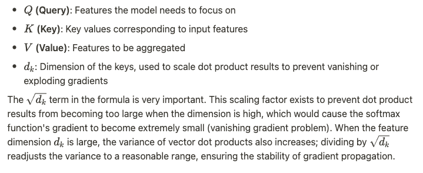**3.2 在注意力计算中应用爱因斯坦求和约定**

在实现中，我使用了基于爱因斯坦求和约定的`torch.einsum`函数来高效地计算注意力分数：

```py
energy = torch.einsum("nqd,nkd->nqk", [q, k])
```

这意味着：

`q`的形状为**（batch_size, num_heads, query_dim**）

`k`的形状为**（batch_size, num_heads, key_dim**）

点积是在**维度`d`**上进行的，结果为`(batch_size, num_heads, query_len, key_len)`。这本质上是在“计算每个查询与所有键之间的相似性”，生成一个**注意力权重矩阵**。

### **3.3 实现代码分析**

MultiHeadAttention 的关键实现代码：

```py
def forward(self, x):

    N = x.shape[0]  # batch size

    # 1\. Project input, prepare for multi-head attention calculation
    x = self.fc_in(x)  # (N, input_dim) → (N, scaled_dim)

    # 2\. Calculate Query, Key, Value, and reshape into multi-head form
    q = self.query(x).view(N, self.num_heads, self.head_dim)  # query
    k = self.key(x).view(N, self.num_heads, self.head_dim)    # key
    v = self.value(x).view(N, self.num_heads, self.head_dim)  # value

    # 3\. Calculate attention scores (similarity matrix)
    energy = torch.einsum("nqd,nkd->nqk", [q, k])

    # 4\. Apply softmax (normalize weights) and perform scaling
    attention = F.softmax(energy / (self.head_dim ** 0.5), dim=2)

    # 5\. Use attention weights to perform weighted sum on Value
    out = torch.einsum("nqk,nkd->nqd", [attention, v])

    # 6\. Rearrange output and pass through final linear layer
    out = out.reshape(N, self.scaled_dim)
    out = self.fc_out(out)

    return out
```

**3.3.1\. 步骤 1-2：投影和多头分割**

首先，输入特征通过一个线性层进行投影，然后分别投影到查询、键和值空间。重要的是，这些投影不仅改变了特征表示，还将它们分割成多个“头”，每个“头”关注不同的特征子空间。

**3.3.2\. 步骤 3-4：注意力计算**

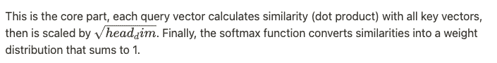

**3.3.3\. 步骤 5-6：加权聚合和输出投影**

使用计算出的注意力权重，对值向量进行加权求和，以获得关注的特征表示。最后，将所有头的输出连接起来，通过输出投影层得到最终结果。

与标准的 Transformer MultiHeadAttention 相比，此实现有以下简化和调整：查询、键和值来自相同的输入（自注意力），适用于处理从 CNN 主干网络获取的特征。

它使用 einsum 操作简化矩阵计算。

投影层的设计确保了维度一致性，便于与其他模块集成。

### **3.4 注意力机制如何增强对形态特征关系的理解**

多头注意力机制为犬种识别带来了三个核心优势：

#### **3.4.1\. 特征关系建模**

就像专业的兽医不仅看到耳朵直立，还会注意到这种形状如何与尾巴卷曲程度和头骨形状结合，形成犬种的特征组合。

它可以建立不同形态特征之间的关联，捕捉它们的协同关系，不仅仅是看到“哪些特征存在”，而是观察“这些特征如何结合”。

**应用**: 模型可以学会“尖耳朵 + 卷尾 + 中等体型”的组合指向特定的北方犬种。

#### **3.4.2\. 动态特征重要性评估**

就像专家在识别贵宾犬时会特别关注毛发质感，而在识别斗牛犬时主要关注独特的鼻子和头部结构。

它根据输入的具体内容动态调整对不同特征的聚焦。

关键特征在不同品种中有所不同，注意力机制可以自适应地聚焦。

**应用**: 当看到边境牧羊犬时，模型可能会更关注毛色分布；当看到腊肠犬时，它可能会更关注身体比例

#### **3.4.3\. 补充信息集成**

就像一支由不同专业领域的专家组成的团队，一个专注于骨骼结构，另一个专注于毛发特征，另一个分析行为姿势，共同做出更全面的判断。

通过多个注意力头部，每个头部同时捕捉不同类型的特征关系。每个头部可以专注于特定类型的特征或关系模式。

**应用**：一个头部可能主要关注颜色模式，另一个关注身体比例，还有一个关注面部特征，最终将这些视角综合起来做出判断。

通过结合这三个能力，MultiHeadAttention 机制不仅超越了识别单个特征，它还学会了建模它们之间的复杂关系，捕捉从它们的组合中出现的微妙模式，并使识别更加准确。

## **4. 实现混合架构的细节**

### **4.1 整体架构流程**

在设计这个混合架构时，我的目标简单而雄心勃勃：

**让每个组件做它最擅长的事情，并构建一个相互补充的系统，使它们相互增强。**

就像一场精心编排的交响乐，每个乐器（或模块）都扮演着它的角色，只有它们一起才能创造和谐。

在这个设置中：

+   **CNN** 专注于捕捉局部细节。

+   形态特征提取器增强了关键的结构特征。

+   多头注意力模块学习这些特征如何相互作用。

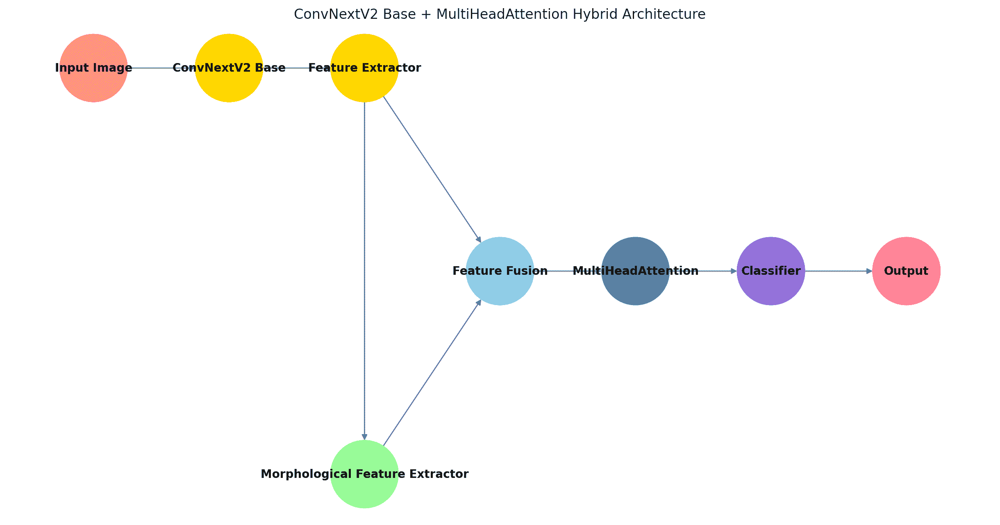

如上图所示，整体模型通过五个关键阶段运行：

#### **4.1.1\. 特征提取**

一旦图像进入模型，**ConvNextV2** 负责提取基础特征，例如毛色、轮廓和纹理。这就是 AI 开始“看到”狗的基本形状和外观的地方。

#### **4.1.2\. 形态特征增强**

这些初始特征随后通过形态特征提取器进行细化。该模块就像专家的眼睛——突出结构特征，如耳形和身体比例。在这里，AI 学习关注真正重要的东西。

#### **4.1.3\. 特征融合**

接下来是特征融合层，它将局部特征与增强的形态线索合并。但这不仅仅是一个简单的连接，该层还建模了这些特征如何**相互作用**，确保 AI 不会孤立地对待它们，而是**理解它们如何结合**来传达意义。

#### **4.1.4\. 特征关系建模**

融合的特征被传递到多头注意力模块，该模块在不同属性之间建立上下文关系。模型开始理解像“耳形 + 毛发纹理 + 面部比例”这样的组合，而不是独立地看待每个特征。

#### **4.1.5\. 最终分类**

经过所有这些处理层之后，模型移动到其最终的分类器，根据它所形成的丰富、综合理解，对狗的品种做出预测。

### **4.2 集成 ConvNextV2 和参数设置**

对于实现，我选择了预训练的**ConvNextV2-base**模型作为骨干：

```py
self.backbone = timm.create_model(
    'convnextv2_base',
    pretrained=True,
    num_classes=0)  # Use only the feature extractor; remove original classification head
```

根据输入图像大小或骨干架构，特征输出维度可能不同。为了构建一个**健壮且灵活的系统**，我设计了一个动态特征维度检测机制：

```py
with torch.no_grad():
    dummy_input = torch.randn(1, 3, 224, 224)
    features = self.backbone(dummy_input)
    if len(features.shape) > 2:
        features = features.mean([-2, -1])  # Global average pooling to produce a 1D feature vector
    self.feature_dim = features.shape[1]
```

这确保了系统自动适应任何特征形状变化，保持所有下游组件正常工作。

### **4.3 多头注意力层的智能配置**

如前所述，我尝试了几个头数。过多的头数增加了计算并可能导致过拟合。我最终确定了**八个**，但允许头数根据特征维度自动调整：

```py
self.num_heads = max(1, min(8, self.feature_dim // 64))
self.attention = MultiHeadAttention(self.feature_dim, num_heads=self.num_heads)
```

### **4.4 使 CNN、Transformers 和形态特征协同工作**

形态特征提取器与注意力机制协同工作。

虽然前者提供了关键特征的有序表示，但后者模型这些特征之间的**关系**：

```py
# Feature fusion
combined_features = torch.cat([
    features,  # Base features
    morphological_features,  # Morphological features
    features * morphological_features  # Interaction between features
], dim=1)
fused_features = self.feature_fusion(combined_features)

# Apply attention
attended_features = self.attention(fused_features)

# Final classification
logits = self.classifier(attended_features)

return logits, attended_features
```

关于第三个组件`features * morphological_features`的特殊说明——这不仅仅是一种数学乘法。它创造了一种**对话**形式，使两个特征集能够相互影响并生成更丰富的表示。

例如，假设模型从基础特征中提取出“尖耳朵”，而形态模块检测到“头部与身体比例小”。

单独来看，这些可能并不具有决定性，但它们的**交互**可能强烈暗示一个特定的品种，如**柯基犬**或**芬兰狐狸犬**。这不再仅仅是识别耳朵或头部大小，模型学会了如何解释特征如何协同工作，就像专家一样。

从特征提取，通过形态增强和注意力驱动的建模，到预测的完整流程，这是我理想架构应该呈现的样子。

该设计具有几个关键优势：

+   **形态提取器**带来了结构化、专家启发的理解。

+   **多头注意力**揭示了特征之间的上下文关系。

+   **特征融合层**通过逐元素乘法捕捉非线性交互。

### **4.5 技术挑战及其解决方法**

构建这样的混合架构远非一帆风顺。

这里有一些我面临的挑战以及解决它们如何帮助我改进整体设计：

#### **4.5.1. 特征维度不匹配**

+   **挑战**：模块之间的输出大小不同，尤其是在切换骨干网络时。

+   **解决方案**：除了前面提到的动态维度检测，我还实现了**自适应投影层**以统一特征维度。

#### **4.5.2. 平衡性能和效率**

+   **挑战**：更多的复杂性意味着更多的计算。

+   **解决方案**：我动态调整注意力头的数量，并使用高效的`einsum`操作来优化性能。

#### **4.5.3. 过拟合风险**

+   **挑战：** 混合模型更容易过拟合，尤其是在较小的训练集上。

+   **解决方案：** 我应用了 **层归一化（LayerNorm**）、**Dropout** 和 **权重衰减（weight decay**）来进行正则化。

**4.5.4. 梯度流动问题**

+   **挑战：** 深度架构通常会受到梯度消失或梯度爆炸的问题。

+   **解决方案：** 我引入了 **残差连接** 来确保在正向和反向传播过程中梯度能够顺畅流动。

如果你对探索完整的实现感兴趣，请随时查看此处的 [GitHub 项目](https://github.com/Eric-Chung-0511/Learning-Record/tree/main/Data%20Science%20Projects/PawMatchAI)。

## **5. 性能评估和热图分析**

> 混合架构的价值不仅在于其定量性能，还在于其如何从定性的角度 **“思考”**。

在本节中，我们将使用置信度分数统计和热图分析来展示模型如何从 **CNN → CNN+Transformer → CNN+Transformer+MFE** 发展，以及每个阶段如何使模型的视觉推理更接近人类专家。

为了确保性能差异纯粹来自架构设计，我使用完全相同的训练集、增强方法、损失函数和训练参数重新训练了每个模型。唯一的差异是 Transformer 和形态学模块的有无。

在 F1 分数方面，仅 CNN 模型达到了 **87.83**%，CNN+Transformer 变体表现略好，达到 **89.48**%，而最终的混合模型得分为 **88.70**%。虽然仅 Transformer 版本在纸面上显示出最高的分数，但它并不总是转化为更可靠的预测。事实上，混合模型在实践中更一致，并且更可靠地处理相似外观或模糊的案例。

### **5.1 置信度分数和统计洞察**

我测试了 17 张边境牧羊犬的图片，包括标准照片、艺术插图和不同的拍摄角度，以全面评估三个架构。

虽然其他品种也被纳入更广泛的评估中，但由于边境牧羊犬具有独特的特征，并且经常与类似品种混淆，因此我选择边境牧羊犬作为代表案例。

**图 1：模型置信度分数比较**

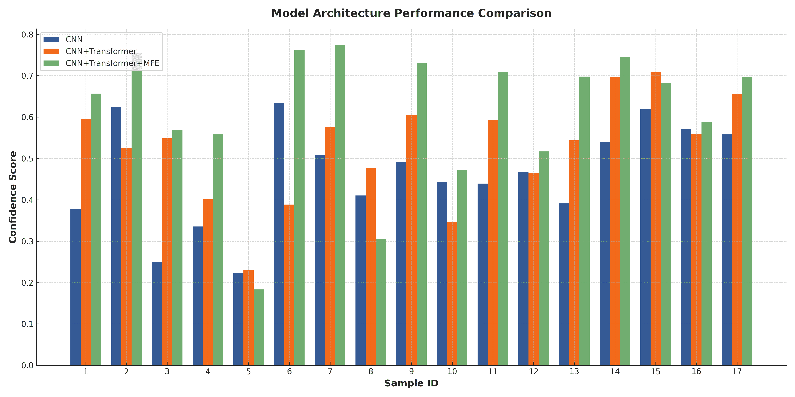如上图所示，三个模型之间有明显的性能差异。

一个显著的例子是 **样本#3**，其中 **仅 CNN** 模型将边境牧羊犬错误地分类为柯利犬，置信度分数为 **0.2492**。

虽然 **CNN+Transformer** 修正了这一错误，但在 **样本#5** 中引入了新的错误，错误地将它识别为柴犬，置信度为 **0.2305**。

最终的 **CNN+Transformer+MFE** 模型正确识别了 **所有样本** 而无错误。有趣的是，两个错误都发生在 **低置信度水平（低于 0.25**）。

这表明，即使模型犯了错误，它也**保留了一种不确定性**——这是现实世界应用中一个理想的特性。我们希望模型在不确定时保持谨慎，而不是自信地犯错。

**图 2：置信度得分分布**

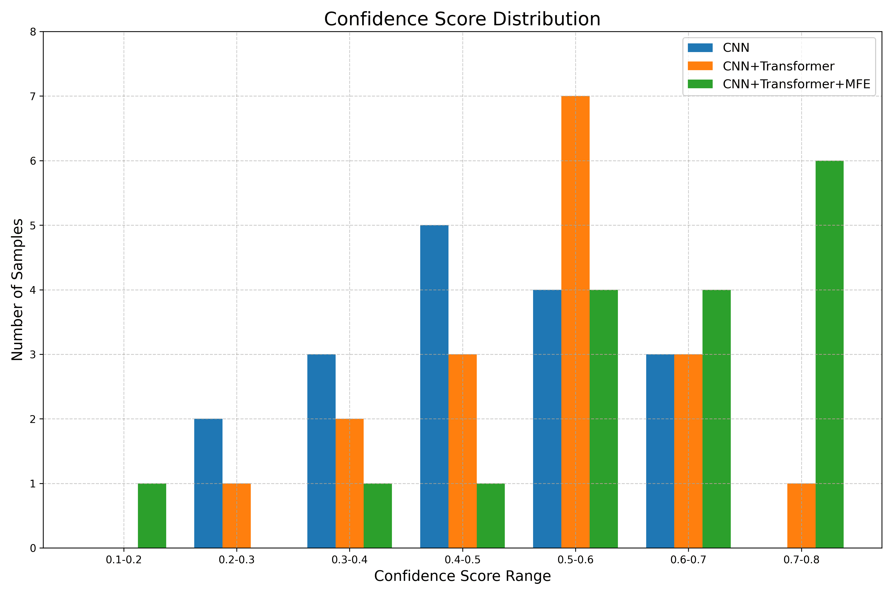观察置信度得分的分布，改进变得更加明显。

**仅 CNN**的模型主要预测在**0.4–0.5**范围内，很少有样本达到**0.6**以上。

**CNN+Transformer**在**0.5–0.6**范围内表现出更好的集中度，但仍然只有一个样本位于**0.7–0.8**的高置信度范围内。

**CNN+Transformer+MFE**模型在**6 个样本**达到了**0.7–0.8**的置信度水平。

分布的**右移**不仅仅揭示了准确性，它还反映了**确定性**。

模型正从“勉强正确”转变为“自信正确”，这显著增强了其在现实世界部署中的可靠性。

**图 3：模型性能统计摘要**

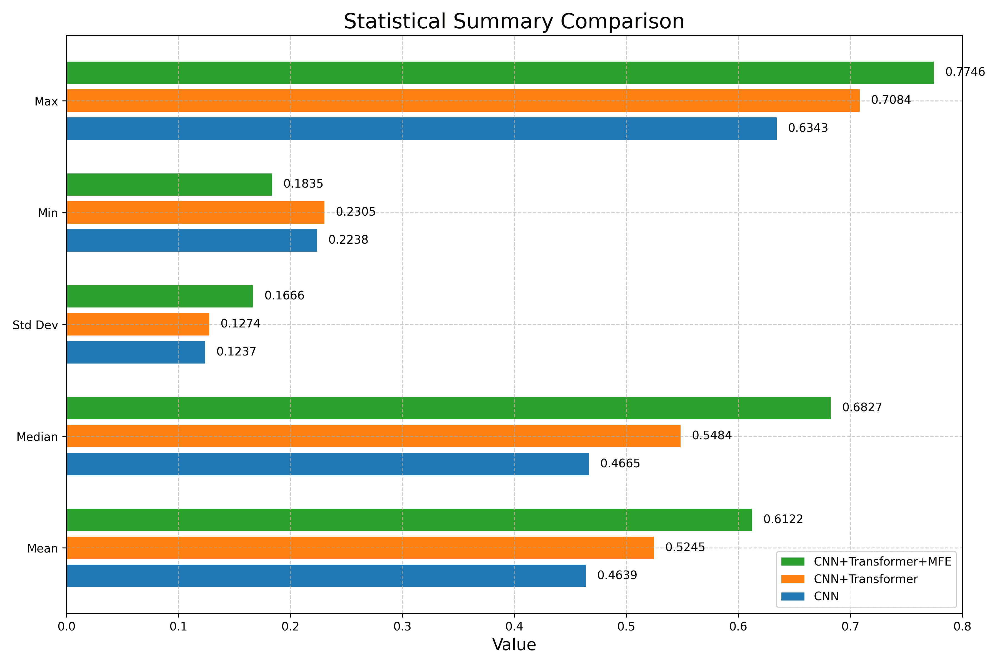更深入的统计分析突出了持续改进：

**平均置信度得分**从**0.4639**（CNN）上升到**0.5245**（CNN+Transformer），最终在完整的混合设置中达到**0.6122**——整体提高了**31.9%**。

**中位数得分**从**0.4665**跃升至**0.6827**，证实了整体向更高置信度的转变。

**高置信度预测（≥ 0.5）的比例**也显示出显著的提升：

+   **CNN**: 41.18%

+   **CNN+Transformer**: 64.71%

+   **CNN+Transformer+MFE**: 82.35%

这意味着，在最终的架构中，**大多数预测不仅正确，而且正确得很有信心**。

你可能会注意到**标准差**（从**0.1237**到**0.1616**）略有增加，一开始可能看起来像是一个负面因素。但事实上，这反映了模型对输入复杂性的**更细微的反应**：

模型对简单样本**高度自信**，对复杂样本**适当谨慎**。最大置信度值（从 0.6343 到 0.7746）的提升进一步展示了这种混合架构在处理简单样本时如何做出更果断和自信的判断。

### **5.2 热图分析：追踪模型推理的演变**

虽然统计指标很有帮助，但它们并不能讲述整个故事。

要真正理解模型是如何做出决策的，我们需要看到它所看到的内容，热图使得这一点成为可能。

在这些热图中，**红色表示高关注区域**，突出了模型在预测时最依赖的区域。通过分析这些注意力图，我们可以观察每个模型如何解释视觉信息，揭示它们推理风格的根本差异。

让我们来看一个代表性的案例。

**5.2.1 边界牧羊犬的前视图：从局部视觉关注到结构化形态理解**

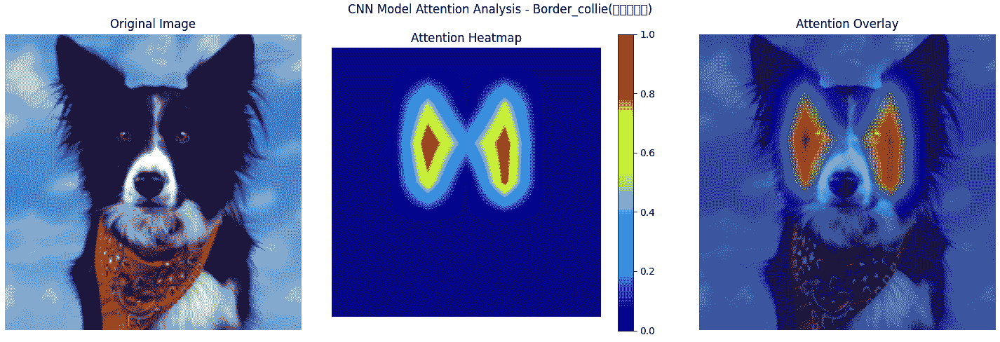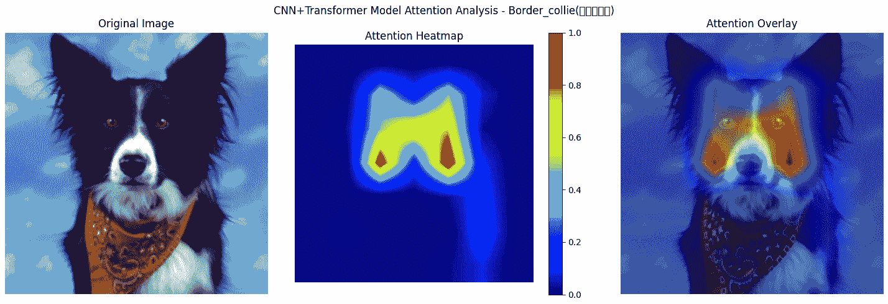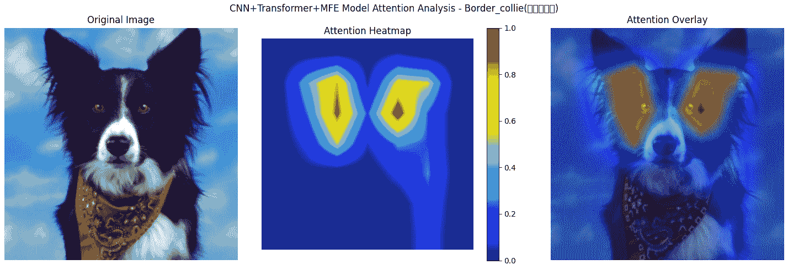当呈现边境牧羊犬的正面图像时，这三个模型揭示了不同的注意力模式，反映了它们的架构设计如何塑造视觉理解。

**CNN-only 模型**生成的热力图有两个尖锐的注意力峰值，都**集中在狗的眼睛上**。这表明模型强烈依赖于局部特征，而忽略了其他形态学特征，如耳朵或面部轮廓。虽然眼睛确实很重要，但仅仅关注它们会使模型更容易受到姿势或光线变化的影响。由此产生的信心分数为**0.5581**反映了这一局限性。

使用**CNN+Transformer 模型**，注意力变得更加分散。热力图形成了一个松散的**M 形模式**，从眼睛延伸到包括**额头和眼睛之间的空间**。这种转变表明模型开始理解特征之间的空间关系，而不仅仅是特征本身。这种增加的上下文意识导致信心分数达到**0.6559**。

**CNN+Transformer+MFE 模型**显示了最结构化和最全面的热力图。热度**在眼睛、耳朵和更广泛的面部区域对称分布**。这表明模型已经超越了特征检测，现在正在捕捉特征作为有意义整体的一部分是如何排列的。**形态学特征提取器**在这里发挥了关键作用，帮助模型掌握品种的结构特征。这种更深入的理解提高了信心到**0.6972**。

三个热力图共同代表了一种视觉推理的清晰进步，**从孤立的特征检测到特征间的上下文，最终到结构解释**。尽管 ConvNeXtV2 已经是一个非常强大的骨干网络，但添加 Transformer 和 MFE 模块使模型不仅能看到特征，还能将它们理解为一个连贯的形态学模式的一部分。这种转变虽然微妙但至关重要，尤其是在像品种分类这样的细粒度任务中。

#### **5.2.2 错误案例分析：从误分类到真正理解**

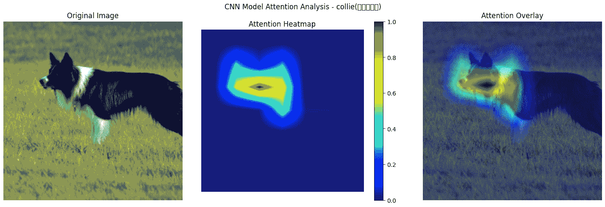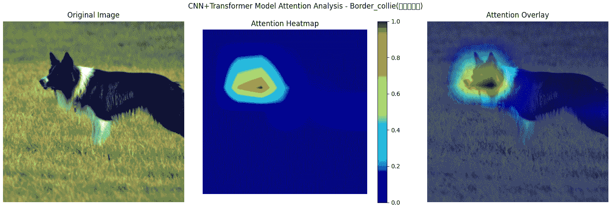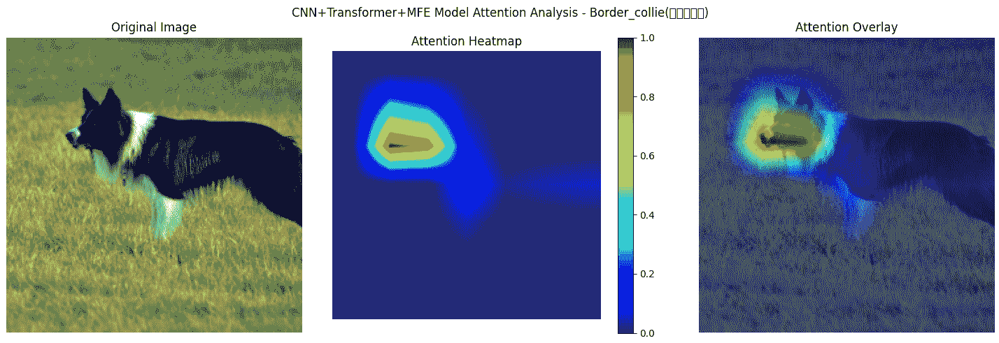

这是一个**CNN-only 模型误分类**边境牧羊犬的案例。

通过观察热力图，我们可以看到原因。模型几乎完全集中在**单个眼睛上**，忽略了大部分面部。这种过度依赖单一局部特征的做法，使得容易混淆具有相似特征的品种，例如，这个**柯利犬**，它也有相似的眼睛形状和颜色对比。

模型遗漏的是定义边境牧羊犬的更广泛的**面部比例**和结构细节。其低信心分数为**0.2492**反映了这种不确定性。

使用**CNN+Transformer 模型**，注意力转向了一个更有希望的方向。它现在覆盖了双眼和额头的一部分，形成了一个**更平衡的注意力模式**。这表明模型开始**连接多个特征**，而不仅仅是依赖一个。

多亏了自注意力，它可以更好地解释面部组件之间的关系，从而得出**正确预测**——边境牧羊犬。置信度得分上升到**0.5484**，是之前模型的两倍多。

**CNN+Transformer+MFE 模型**通过提高**形态意识**进一步发展。热图现在扩展到了**鼻子和鼻尖**，捕捉到了面部长度和嘴型等细微特征。这些是微妙但重要的线索，有助于区分不同的牧羊品种。

MFE 模块似乎引导模型向**结构组合**方向发展，而不仅仅是孤立的特征。因此，置信度再次上升到**0.5693**，显示出更稳定、品种特定的理解。

从对单个眼睛的狭窄关注，到整合面部特征，最后到解释结构形态，这一进展突出了混合模型如何支持**更准确和可推广的视觉推理**。

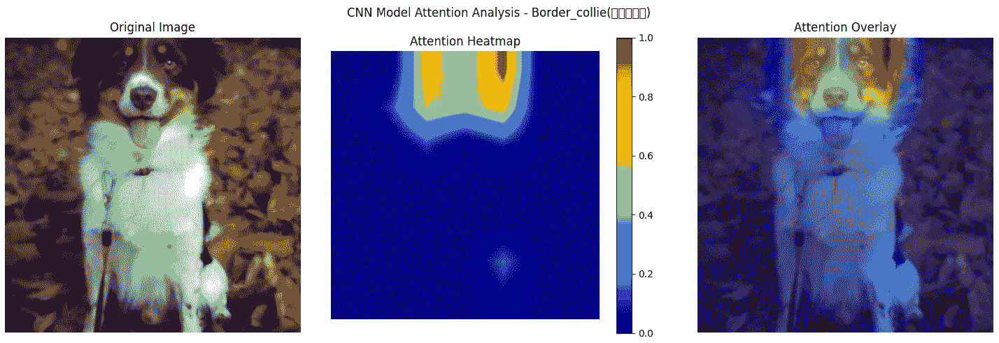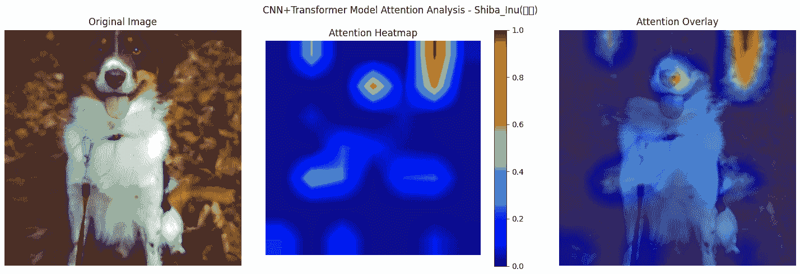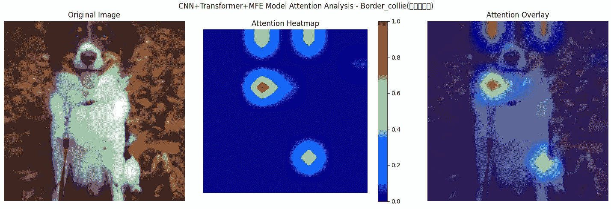在这个例子中，**仅 CNN 模型**几乎完全关注狗脸的一侧。图像的其余部分几乎被忽略。这种狭窄的注意力表明模型没有足够的视觉上下文来做出强有力的决定。这次它猜对了，但置信度得分很低，为**0.2238**，显然预测不是基于坚实的推理。

**CNN+Transformer 模型**显示出更广泛的注意力范围，但它引入了一个不同的问题，热图变得分散。你甚至可以在最右边发现一个强烈的注意力峰值，这与狗完全无关。这种错误的关注可能导致将其误分类为**柴犬**，并且置信度得分仍然很低，为**0.2305**。

这突出了一个重要的观点：

> **添加 Transformer 并不能保证更好的判断**，除非模型学会了看哪里。没有指导，自注意力可能会放大错误信号，造成混乱而不是清晰。

使用**CNN+Transformer+MFE 模型**，注意力变得更加集中和结构化。模型现在关注关键区域，如眼睛、鼻子和胸部，构建了对图像的更有意义的理解。但即使在这里，置信度仍然很低，为**0.1835**，尽管做出了正确的预测。这张图片显然对所有三个模型都是一个真正的挑战。

这就是为什么这个案例如此有趣。

这提醒我们，正确的预测并不总是意味着模型有信心。在更困难的场景中，不寻常的姿势、细微的特征、杂乱的背景，即使是最高级的模型也可能犹豫。

这就是信心评分变得无价的地方。

它们有助于标记不确定的案例，使得设计审查流程更容易，其中人类专家可以介入并验证棘手的预测。

#### **5.2.3 识别艺术渲染：测试泛化极限**

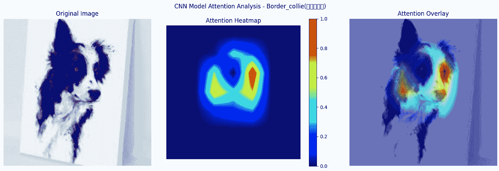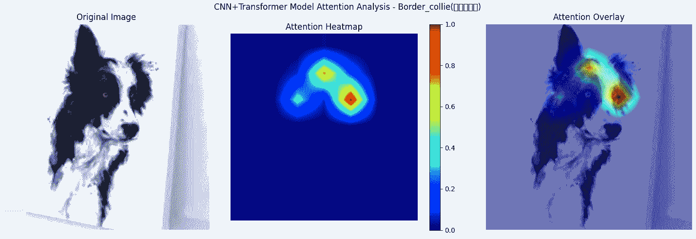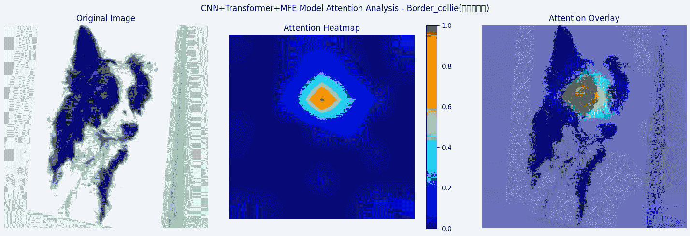

艺术图像对视觉识别系统构成了独特的挑战。与具有清晰纹理和清晰照明的标准照片不同，绘画作品通常是抽象和扭曲的。这迫使模型减少对表面线索的依赖，更多地依赖更深层次的结构理解。从这个意义上说，它们成为对泛化能力的完美压力测试。

让我们看看这三个模型如何处理这种场景。

从**仅 CNN 模型**开始，注意力图分散，焦点在图像的两侧扩散。没有明显的结构——只是模糊地尝试“看到一切”，这通常意味着模型不确定应该关注什么。这种不确定性反映在其自信评分**0.5394**上，位于中下范围。模型做出了正确的猜测，但远非自信。

接下来，**CNN+Transformer 模型**显示出明显的改进。其注意力变得更加锐利，并聚集在更有意义的区域周围，尤其是在眼睛和耳朵附近。即使有风格化的笔触，模型似乎在推断，“这可能是一只耳朵”或“那看起来像面部轮廓。”它开始映射解剖线索，而不仅仅是视觉纹理。自信评分上升到**0.6977**，表明更结构化的理解正在形成。

最后，我们来看一下**CNN+Transformer+MFE 混合模型**。这个模型锁定得非常精确。热图紧密地集中在眼睛和鼻子的交汇处——这可以说是识别边境牧羊犬最独特且最稳定的区域，即使在抽象形式下也是如此。它不再是基于外观的猜测，而是在阅读狗的潜在结构。

这一大步很大程度上归功于 MFE，它帮助模型专注于**持久性特征**，即使风格或细节发生变化。结果？一个自信的评分**0.7457**，在三者中是最高的。

> 这个实验清楚地表明：
> 
> **混合模型不仅提高了识别能力，还提高了推理能力**。

它们学会了超越视觉噪声，专注于最重要的东西：结构、比例和模式。这就是它们可靠的原因，尤其是在不可预测、混乱的真实图像世界中。

## **结论**

随着深度学习的发展，我们已经从 **CNNs** 转向 **Transformers**，现在正朝着结合两者最佳之处的 **混合架构** 发展。这种转变反映了人工智能设计哲学的更广泛变化：从寻求纯粹性到拥抱融合。

想象一下就像烹饪。伟大的厨师不会坚持一种技术。他们会根据食材混合煎、煮和炸。同样，混合模型结合不同的架构“风味”以适应手头的任务。

这种融合设计提供了几个关键的好处：

+   **互补优势**：就像结合显微镜和望远镜一样，混合模型捕捉了细微的细节和全局的上下文。

+   **结构化理解**：形态学特征提取器带来了专家级的领域洞察，使模型不仅能看到，而且能真正理解。

+   **动态适应性**：未来的模型可能会根据图像调整内部注意力模式，强调斑点的纹理，或者对单色品种强调结构。

+   **更广泛的应用性**：从医学成像到生物多样性和艺术品鉴定，任何涉及精细视觉区分的任务都可以从这种方法中受益。

这个视觉系统——结合了 ConvNeXtV2、注意力机制和形态推理，证明了准确性和智能并非来自任何单一架构，而是来自正确组合的想法。

也许人工智能的未来不会依赖于一个完美的设计，而是学习像人脑一样结合认知策略。

**参考文献和数据来源**

**研究参考文献**

+   Vaswani，A. 等. (2017). [*注意力即是所需*](https://arxiv.org/abs/1706.03762). *神经信息处理系统进展*.

+   Dosovitskiy，A. 等. (2021). *[一张图片等于 16×16 个单词：大规模图像识别的 Transformer](https://arxiv.org/abs/2010.11929). ICLR 2021*.

+   刘，Z. 等. (2022). *[ConvNeXt: 2020 年代的卷积神经网络](https://arxiv.org/abs/2201.03545)*. *CVPR 2022*

+   刘，Z. 等. (2023). *[ConvNeXt V2：与掩码自编码器协同设计和扩展卷积神经网络](https://arxiv.org/abs/2301.00808).* *CVPR 2023*.

+   Rockt (2018). *[直观解释爱因斯坦求和符号](https://rockt.ai/2018/04/30/einsum) rockt.github.io*

+   *[Pytorch Org. torch.einsum](https://pytorch.org/docs/stable/generated/torch.einsum.html)*

**数据集来源**

+   **斯坦福狗数据集** – [Kaggle 数据集](https://www.kaggle.com/datasets/jessicali9530/stanford-dogs-dataset/data)

    原始数据来源于 [斯坦福视觉实验室 – ImageNet Dogs](http://vision.stanford.edu/aditya86/ImageNetDogs/) **许可：仅限非商业研究和教育用途** **引用：Aditya Khosla，Nityananda Jayadevaprakash，Bangpeng Yao，和 Li Fei-Fei. *新型细粒度图像分类数据集*。FGVC Workshop，CVPR，2011

+   **Unsplash 图片** – 为了数据集增强，额外获取了四种品种（**比熊犬，腊肠犬，柴犬，巴哥犬**）的图片，来源于 [Unsplash](https://unsplash.com/)。

感谢您的阅读。通过开发 PawMatchAI，我学到了关于 AI 视觉系统和特征识别的许多宝贵经验。如果您有任何观点或话题想要讨论，我欢迎交流想法。 🙌

📧 **电子邮件** [](eigeninsight@gmail.com) 💻 **[GitHub](https://github.com/Eric-Chung-0511)**

**免责声明**

> *本文中描述的方法和途径基于我的个人研究和实验发现。虽然混合架构在特定场景中已经证明了改进，但其性能可能因数据集、实现细节和训练条件而异。*
> 
> *本文仅用于教育和信息目的。读者应进行独立评估，并根据其特定用例调整方法。不对其在所有应用中的有效性做出保证。*
