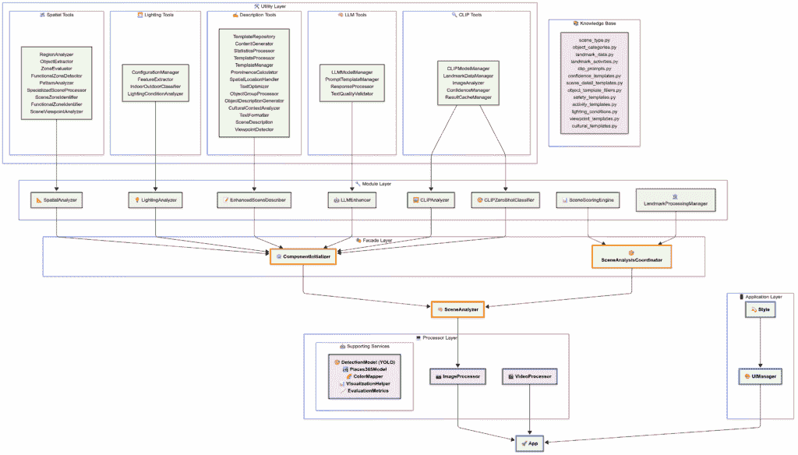

# 超越模型堆叠：使多模态 AI 系统工作的架构原则

> 原文：[`towardsdatascience.com/the-art-of-multimodal-ai-system-design/`](https://towardsdatascience.com/the-art-of-multimodal-ai-system-design/)

## 1. 它 <mdspan datatext="el1750375195935" class="mdspan-comment">所有开始</mdspan> 都源于一个愿景

当我再次观看《钢铁侠》时，我被 JARVIS 如何深入理解一个场景所吸引。它不仅仅是识别物体，它理解了上下文，并用自然语言描述了场景：“这是一个繁忙的十字路口，行人正在等待过马路，交通流畅。”那一刻引发了一个更深层次的问题：AI 是否能够真正理解场景中发生的事情——就像人类直观地做的那样？

在我完成构建**PawMatchAI**之后，这个想法变得更加清晰。该系统能够准确识别 124 种狗的品种，但我开始意识到，识别拉布拉多犬并不等同于理解它实际上在做什么。真正的场景理解意味着提出像“这是哪里？”和“这里发生了什么？”这样的问题，而不仅仅是列出物体标签。

那个认识让我设计了**VisionScout**，这是一个旨在真正理解场景的多模态 AI 系统，而不仅仅是识别物体。

挑战不在于将几个模型堆叠在一起。这是一个架构难题：

你如何让**YOLOv8**（用于检测）、**CLIP**（用于语义推理）、**Places365**（用于场景分类）和**Llama 3.2**（用于语言生成）不仅共存，而且像团队一样协作？

在构建 VisionScout 的过程中，我意识到真正的挑战在于分解复杂问题，在模块之间设置清晰的边界，并设计允许它们有效协作的逻辑。

> 💡 下面的章节将逐步介绍这一进化过程，从最初的概念到三个主要的架构改造，突出塑造 VisionScout 成为一个统一且适应性强的系统的关键原则。

* * *

## 2. 系统进化的三个关键阶段

### 2.1 第一次进化：从检测到理解的认知飞跃

建立在从 PawMatchAI 学到的经验上，我开始了这样一个想法：结合几个检测模型可能足以实现场景理解。我构建了一个基础架构，其中`DetectionModel`处理核心推理，`ColorMapper`为不同类别提供颜色编码，`VisualizationHelper`将颜色映射到边界框，而`EvaluationMetrics`负责统计数据。该系统大约有 1000 行代码，可以可靠地检测物体并显示基本的可视化。

但我很快意识到系统只产生了检测数据，这对用户来说并不那么有用。当它报告“检测到 3 人，2 辆车，1 个交通灯”时，用户真正想知道的是：“这是哪里？这里发生了什么？我应该注意些什么？”

这让我尝试了一种基于模板的方法。它根据检测到的对象的组合生成固定格式的描述。例如，如果它检测到一个人、一辆车和一个交通灯，它就会返回：“这是一个有行人和车辆的交通场景。”虽然这使系统看起来像是“理解”了场景，但这种方法局限性的快速显现。

当我在夜间街道照片上运行系统时，它仍然给出了明显错误的描述，例如：“这是一个明亮的交通场景。”仔细观察后，我发现真正的问题：传统的视觉分析只是报告画面中的内容。但理解一个场景意味着弄清楚正在发生什么，为什么会发生，以及它可能意味着什么。

那一刻让我明白：系统在技术上能做的事情和实际中真正有用的东西之间存在很大的差距。解决这个差距需要不仅仅是模板，还需要更深入的架构思考。

### 2.2 第二次演变：多模态融合的工程挑战

我对场景理解的深入程度越高，就越明显：没有单个模型能够涵盖真实理解所要求的所有内容。这个认识让我重新思考整个系统的结构。

每个模型都为桌面带来了不同的东西。YOLO 处理目标检测，CLIP 专注于语义，Places365 帮助分类场景，而 Llama 负责语言。真正的挑战是如何让它们协同工作。

我将场景理解分解为几个层次：检测、语义、场景分类和语言生成。棘手的是让这些部分协同工作，避免相互干扰。

我开发了一个函数，根据场景的特征调整每个模型的权重。如果一个模型对某个场景特别自信，系统就会给它更多的权重。但当情况不太明朗时，其他模型被允许带头。

一旦我开始整合模型，事情很快就变得复杂起来。最初只有几个类别的模型很快就扩展到几十个，每个新功能都可能导致原本正常工作的部分出现问题。调试变得具有挑战性。修复一个问题可能会在系统的其他部分轻易触发两个新的问题。

那时我意识到：管理复杂性不仅仅是一个副作用，它本身就是一个设计问题。

### 2.3 第三次演变：从混沌到清晰的突破性设计

在某个时刻，系统的复杂性失控了。一个单独的类文件已经超过了 2,000 行，并且承担了超过十个职责，从模型协调和数据转换到错误处理和结果融合。这显然违反了单一职责原则。

每次我需要调整一些小细节时，我不得不翻阅那个巨大的文件，只是为了找到正确的部分。我总是处于紧张状态，知道微小的变化可能会意外地破坏其他东西。

经过一段时间的挣扎，我知道仅仅修补是不够的。我必须彻底重新思考系统的结构，使其即使在不断增长的情况下也能保持可管理性。

在接下来的几天里，我不断遇到相同的基本问题。真正的障碍不在于函数有多复杂，而在于一切事物之间连接得有多紧密。修改任何照明逻辑都需要双重检查它会如何影响空间分析、语义解释，甚至语言输出。

调整模型权重也不简单；我必须每次手动同步所有四个模型的格式和数据流。那时我开始使用分层方法重构架构。

我将其分为三个层次。底层包括处理技术操作的专业工具。中间层专注于逻辑，拥有针对特定任务定制的分析引擎。在最顶层，协调层管理所有组件之间的流程。

随着各个部分的到位，系统开始显得更加透明，并且更容易管理。

### 2.4 第四次进化：设计以可预测性胜过自动化

大约在那个时候，我遇到了另一个设计挑战，这次涉及地标识别。

该系统依赖于 CLIP 的无监督能力，无需特定任务训练即可识别 115 个知名地标。但在实际应用中，这个功能常常成为障碍。

一个常见问题是关于交叉路口的航空照片。系统有时会将它们误认为是东京的涩谷十字路口，这种误分类会破坏整个场景的解释。

我的第一反应是微调算法的一些参数，以帮助它更好地区分相似的场景。但这种方法很快失败了。减少涩谷的误报最终降低了系统对其他地标准确性的影响。

很明显，即使是多模态系统中微小的调整也可能在其他地方引发副作用，反而使情况变得更糟。

那时我想起了数据科学中的 A/B 测试原则。本质上，A/B 测试是关于隔离变量，以便你可以看到单个变化的影响。这让我重新思考了系统的行为。与其试图让它自动处理每一种情况，或许让用户来决定会更好。

因此，我设计了`enable_landmark`参数。表面上，它只是一个布尔开关。但背后的思考更为重要。通过赋予用户控制权，我可以使系统更具可预测性，并与现实世界的需求更好地对齐。对于日常照片，用户可以关闭地标检测以避免误报。对于旅行图像，他们可以开启它以呈现文化背景和位置洞察。

这个阶段帮助我巩固了两个教训。首先，良好的系统设计不是堆叠功能，而是深入理解真实问题。其次，行为可预测的系统通常比试图完全自动但最终导致混乱或不可靠的系统更有用。

* * *

## 3. 架构可视化：设计思维的完整体现

经过四个主要阶段的系统进化后，我提出了一个新的问题：

**我如何清晰地展示架构，以证明设计并确保可扩展性？**

为了找出答案，我重新绘制了系统图，最初只是为了整理一下。但很快，它变成了一次全面的结构审查。我发现模块边界不明确、功能重叠和遗漏的空白。这迫使我重新评估每个组件的角色和必要性。

一旦可视化，系统的逻辑变得更加清晰。责任、依赖和数据流更加清晰地展现出来。该图不仅阐明了结构，还成为我对分层和协作思考的反映。

以下几节将逐层介绍架构，解释设计是如何形成的。

*由于格式限制，您可以在[这里](https://www.mermaidchart.com/app/projects/3c99efde-d354-4fa6-b53d-ecbd3e32b615/diagrams/05cd2827-16da-4d76-aa07-0187cf1007dc/version/v0.1/edit)查看更清晰、交互式的架构图版本。*

### 3.1 配置知识层：实用层（智能基础和模板）

在设计这种分层架构时，我遵循了一个关键原则：**系统复杂性应从上到下逐步降低。**

越靠近用户，界面越简单；越深入系统，工具越专业化。这种结构有助于明确责任，并使系统更容易维护和扩展。

为了避免逻辑重复，我将类似的技术功能分组到可重用的工具模块中。由于系统支持广泛的分析任务，拥有模块化的工具组对于保持组织至关重要。架构图的基础是系统的核心工具集——我称之为实用层。我将这一层结构化为六个不同的工具组，每个组都有明确的角色和范围。

+   **空间工具**处理与空间分析相关的所有组件，包括`RegionAnalyzer`、`ObjectExtractor`、`ZoneEvaluator`和其他六个。在我处理需要推理对象位置和布局的不同任务时，我意识到需要将这些功能纳入一个单一、连贯的模块中。

+   **照明工具**专注于环境照明分析，包括`ConfigurationManager`、`FeatureExtractor`、`IndoorOutdoorClassifier`和`LightingConditionAnalyzer`**。**这一组直接支持系统进化第二阶段探索的照明挑战。

+   **描述工具**为系统的内容生成提供动力。它包括`TemplateRepository`、`ContentGenerator`、`StatisticsProcessor`和其他十一个组件。这个组的大小反映了语言输出在整体用户体验中的核心地位。

+   **LLM 工具**和**CLIP 工具**分别支持与 Llama 和 CLIP 模型的交互。每个组包含四个到五个专注于模型输入/输出、预处理和解释的模块，帮助这些关键 AI 模型在系统中顺畅运行。

+   **知识库**作为系统的参考层。它存储场景类型、对象分类方案、地标元数据和其它领域知识文件的定义——为组件之间的一致理解奠定基础。

我组织这些工具时，有一个关键目标：确保每个组处理一个专注的任务，而不会变得孤立。这种设置使责任清晰，并使跨模块协作更容易管理。

### 3.2 基础设施层：支持服务（独立核心动力）

**支持服务**层作为系统的骨架，我在整体架构中故意保持了它的相对独立性。经过精心规划，我将系统中五个最重要的 AI 引擎和工具放在这里：**DetectionModel (YOLO**)、**Places365Model**、**ColorMapper**、**VisualizationHelper**和**EvaluationMetrics**。

这一层反映了我架构中的一个核心原则：AI 模型推理应完全与业务逻辑解耦。支持服务层处理原始机器学习输出和核心处理任务，但它不关心这些输出如何被解释或用于高级推理。这种清晰的分离使系统模块化，更容易维护，并能更好地适应未来的变化。

在设计这一层时，我专注于为每个组件定义清晰的边界。`DetectionModel`和`Places365Model`负责核心推理任务。`ColorMapper`和`VisualizationHelper`管理结果的视觉呈现。`EvaluationMetrics`专注于检测输出的统计分析与指标计算。由于责任分离良好，我可以微调或替换这些组件中的任何一个，而不用担心对高级逻辑产生意外的副作用。

### 3.3 智能分析层：模块层（专业顾问团队）

**模块层**反映了系统对场景推理的核心方式。它包含八个专门的分析引擎，每个引擎都有一个明确定义的角色。这些模块负责场景理解的各个方面，从空间布局和光照条件到语义描述和模型协调。

+   **`SpatialAnalyzer`**专注于理解场景的空间布局。它使用来自**空间工具**组的工具来分析物体位置、相对距离和区域配置。

+   **`LightingAnalyzer`** 解释环境光照条件。它整合来自 `Places365Model` 的输出，以推断一天中的时间、室内/室外分类和可能的天气背景。它还依赖于 **Lighting Tools** 进行更详细的信号提取。

+   **`EnhancedSceneDescriber`** 基于检测到的内容生成高级场景描述。它利用 **Description Tools** 构建反映空间背景和对象交互的结构化叙述。

+   **`LLMEnhancer`** 提高语言输出的质量。使用 **LLM Tools**，它精炼描述以使其更加流畅、连贯和人性化。

+   **`CLIPAnalyzer`** 和 **`CLIPZeroShotClassifier`** 处理多模态语义任务。前者提供图像-文本相似性分析，而后者利用 CLIP 的零样本能力来识别对象和场景，无需显式训练。

+   **`LandmarkProcessingManager`** 处理显著地标的识别并将它们与文化或地理背景相关联。它有助于通过高级符号意义丰富场景解释。

+   **`SceneScoringEngine`** 协调所有模块之间的决策。它根据场景类型和置信度分数动态调整模型影响，生成一个最终输出，反映来自多个来源的加权洞察。

这种设置允许每个分析引擎专注于其最擅长的事情，同时从工具层获取所需的任何支持。如果我想稍后添加一种新的场景理解类型，我只需为其构建一个新的模块，无需更改现有逻辑或冒着破坏系统的风险。

### 3.4 协调管理层：外观层（系统神经中心）

**外观层** 包含两个关键协调器：**`ComponentInitializer`** 在系统启动期间处理组件初始化，而 **`SceneAnalysisCoordinator`** 协调分析工作流程并管理数据流。

这两个协调器体现了外观设计的核心精神：**外部简单，内部精确**。用户只需与干净的输入和输出点进行接口，而所有复杂的初始化和协调逻辑都得到适当的幕后处理。

### 3.5 统一接口层：SceneAnalyzer（单一外部网关）

**`SceneAnalyzer`** 作为整个 VisionScout 系统的唯一入口点。这个组件反映了我核心的设计信念：无论内部架构多么复杂，外部用户都应该只需要与一个单一、统一的网关进行交互。

内部，`SceneAnalyzer` 封装了所有协调逻辑，将请求路由到其下适当的模块和工具。它标准化输入，管理错误，并格式化输出，为任何客户端应用程序提供一个干净且稳定的接口。

这一层代表了系统复杂性的最终提炼，提供了简化的访问方式，同时隐藏了底层过程的复杂网络。通过设计这个网关，我确保了 VisionScout 无论如何继续发展，都能既强大又易于使用。

### 3.6 处理引擎层：处理器层（双重执行引擎）

在实际的使用工作流程中，**ImageProcessor**和**VideoProcessor**代表了系统真正开始工作的地方。这两个处理器负责处理输入数据，图像或视频，并执行适当的分析流程。

**`ImageProcessor`**专注于静态图像输入，将目标检测、场景分类、光照评估和语义解释集成到统一的输出中。**`VideoProcessor`**扩展了这一能力到视频分析，通过分析视频帧中的目标存在模式和检测频率，提供时间洞察。

从用户的角度来看，这是生成结果的入口点。但从系统设计角度来看，处理器层反映了所有协作架构层的最终组合。这些处理器封装了之前构建的逻辑、工具和模型，为现实世界应用提供了一个一致的接口，而无需用户管理内部复杂性。

### 3.7 应用接口层：应用层

最后，**`Application Layer`**作为系统的表示层，将技术能力与用户体验联系起来。它包括**`Style`**，负责样式和视觉一致性，以及**`UIManager`**，负责管理用户交互和界面行为。这一层确保所有底层功能都通过一个干净、直观且易于访问的接口提供，使得系统不仅强大，而且易于使用。

* * *

## 4. 结论

在实际开发过程中，我意识到许多看似技术瓶颈的根源不在于模型性能，而在于**不清晰的模块边界和有缺陷的设计假设**。重叠的责任和组件之间的紧密耦合经常导致意外的干扰，使得系统越来越难以维护或扩展。

以**SceneScoringEngine**为例。我最初应用了固定逻辑来聚合模型输出，这在某些特定情况下导致了场景判断的偏差。经过进一步调查，我发现**不同的模型应根据场景上下文扮演不同的角色**。为此，我实施了一个动态权重调整机制，根据上下文信号调整模型贡献——允许系统在正确的时间利用正确的信息。

这个过程让我明白，有效的架构不仅仅是连接模块。真正的价值在于确保系统在行为上保持可预测性，并且随着时间的推移具有适应性。如果没有清晰的职责分离和结构灵活性，即使编写得很好的函数也可能成为系统演变的障碍。

最后，我有了更深的理解：编写功能代码很少是难点。真正的挑战在于设计一个能够随着新需求优雅成长的系统。这需要正确抽象问题的能力，定义精确的模块边界，并预测设计选择将如何塑造长期系统行为。

* * *

## 📖 多模态 AI 系统设计系列

这篇文章标志着一系列探索的起点，该系列将探讨我是如何构建一个多模态 AI 系统的，从早期设计概念到主要架构转变。

在接下来的部分中，我将更深入地探讨技术核心：模型如何协同工作，语义理解是如何构建的，以及关键决策组件背后的设计逻辑。

* * *

感谢您的阅读。通过开发 VisionScout，我学到了关于多模态 AI 架构和系统设计艺术的许多宝贵经验。如果您有任何观点或话题想要讨论，我欢迎交流想法。 🙌

+   [VisionScout GitHub](https://github.com/Eric-Chung-0511/Learning-Record/tree/main/Data%20Science%20Projects/VisionScout) | [VisionScout Demo](https://huggingface.co/spaces/DawnC/VisionScout)

+   [PawMatchAI GitHub](https://github.com/Eric-Chung-0511/Learning-Record/tree/main/Data%20Science%20Projects/PawMatchAI) | [PawMatchAI Demo](https://huggingface.co/spaces/DawnC/PawMatchAI)

+   💻 [**GitHub**](https://github.com/Eric-Chung-0511)

+   📧 **邮箱**

## 参考文献 & 进一步阅读

**核心技术**

+   YOLOv8: Ultralytics. (2023). *YOLOv8: 实时目标检测与实例分割*.

+   CLIP: Radford, A., et al. (2021). *从自然语言监督中学习可迁移的视觉表示*. ICML 2021.

+   Places365: Zhou, B., et al. (2017). *Places: 一个用于场景识别的 1000 万图像数据库*. IEEE TPAMI.

+   Llama 3.2: Meta AI. (2024). *Llama 3.2: 多模态和轻量级模型*.
