# 扩散模型论文解读：噪声的艺术

> 原文：[`towardsdatascience.com/the-art-of-noise/`](https://towardsdatascience.com/the-art-of-noise/)

## **<mdspan datatext="el1743642535607" class="mdspan-comment">引言</mdspan>**

在我之前的几篇文章中，我讨论了生成式深度学习算法，这些算法大多与文本生成任务相关。因此，我认为现在转向图像生成的生成算法会很有趣。我们知道，如今已经有许多专门用于生成图像的深度学习模型，例如自动编码器、变分自动编码器（VAE）、生成对抗网络（GAN）和神经风格迁移（NST）。实际上，我的一些关于这些主题的文章也发布在 Medium 上。如果你想阅读它们，我会在文章末尾提供链接。

在今天的文章中，我想讨论所谓的*扩散模型*——这是图像生成领域深度学习中最具影响力的模型之一。这个算法的想法最初是在 2015 年由 Sohl-Dickstein 等人撰写的题为《使用非平衡热力学进行深度无监督学习》的论文中提出的 [1]。随后，Ho 等人于 2020 年在他们的论文《去噪扩散概率模型》中进一步发展了这一框架 [2]。*DDPM*后来被 OpenAI 和 Google 采用，以开发 DALLE-2 和 Imagen，我们知道这些模型在生成高质量图像方面具有令人印象深刻的性能。

### **扩散模型的工作原理**

通常来说，扩散模型通过从噪声中生成图像来工作。我们可以将其想象成一个艺术家将画布上的溅泼颜料变成一幅美丽的艺术品。为了做到这一点，扩散模型首先需要被训练。训练模型需要遵循两个主要步骤，即*前向扩散*和*后向扩散*。

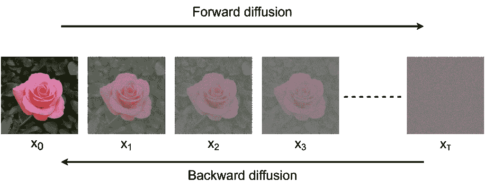

图 1. 前向和后向扩散过程 [3]。

如上图所示，前向扩散是一个迭代地将高斯噪声应用于原始图像的过程。我们持续添加噪声，直到图像完全无法辨认，此时我们可以认为图像现在位于*潜在空间*中。与潜在空间通常比原始图像维度低的 Autoencoders 和 GANs 不同，DDPM 中的潜在空间保持了与原始图像完全相同的维度。这一噪声过程遵循马尔可夫链的原则，意味着图像在时间步长*t*时只受时间步长*t*-1 的影响。前向扩散被认为相对简单，因为我们基本上只是逐步添加一些噪声。

第二个训练阶段被称为反向扩散，我们的目标是逐步去除噪声，直到获得清晰的图像。这个过程遵循*反向*马尔可夫链的原则，其中时间步长*t*-1 的图像只能基于时间步长*t*的图像获得。这种去噪过程非常困难，因为我们需要猜测哪些像素是噪声，哪些像素属于实际图像内容。因此，我们需要使用神经网络模型来完成这项工作。

DDPM 使用 U-Net 作为反向扩散深度学习架构的基础。然而，我们不是使用原始的 U-Net 模型[4]，而是需要对其进行一些修改，以便使其更适合我们的任务。稍后，我将在 MNIST 手写数字数据集[5]上训练这个模型，我们将看看它是否能够生成类似的图像。

好吧，这就是你现在需要了解的关于扩散模型的所有基本概念。在接下来的几节中，我们将更深入地探讨细节，并从头开始实现算法。

* * *

## **PyTorch 实现**

我们将首先导入所需的模块。如果你还不熟悉下面的导入，`torch`和`torchvision`是我们将用于准备模型和数据集的库。同时，`matplotlib`和`tqdm`将帮助我们显示图像和进度条。

```py
# Codeblock 1
import matplotlib.pyplot as plt
import torch
import torch.nn as nn

from torch.optim import Adam
from torch.utils.data import DataLoader
from torchvision import datasets, transforms
from tqdm import tqdm
```

模块导入完成后，接下来要做的是初始化一些配置参数。请查看下面的代码块 2 以获取详细信息。

```py
# Codeblock 2
IMAGE_SIZE     = 28     #(1)
NUM_CHANNELS   = 1      #(2)

BATCH_SIZE     = 2
NUM_EPOCHS     = 10
LEARNING_RATE  = 0.001

NUM_TIMESTEPS  = 1000   #(3)
BETA_START     = 0.0001 #(4)
BETA_END       = 0.02   #(5)
TIME_EMBED_DIM = 32     #(6)
DEVICE = torch.device("cuda" if torch.cuda.is_available else "cpu")  #(7)
DEVICE
```

```py
# Codeblock 2 Output
device(type='cuda')
```

在标记为`#(1)`和`#(2)`的行中，我将`IMAGE_SIZE`和`NUM_CHANNELS`设置为 28 和 1，这些数字是从 MNIST 数据集中的图像维度获得的。`BATCH_SIZE`、`NUM_EPOCHS`和`LEARNING_RATE`变量相当直观，所以我认为没有必要进一步解释。

在标记为`#(3)`的行中，变量`NUM_TIMESTEPS`表示正向和反向扩散过程中的迭代次数。时间步长 0 是图像在其原始状态下的条件（图 1 中最左边的图像）。在这种情况下，由于我们将此参数设置为 1000，时间步长 999 将是图像完全无法识别的条件（图 1 中最右边的图像）。重要的是要记住，时间步长数量的选择涉及模型精度和计算成本之间的权衡。如果我们为`NUM_TIMESTEPS`分配一个较小的值，推理时间将会更短，但生成的图像可能并不理想，因为模型在反向扩散阶段对图像的细化步骤较少。另一方面，增加`NUM_TIMESTEPS`将减慢推理过程，但我们可以期待输出图像的质量会更好，因为逐步去噪过程会导致更精确的重构。

接下来，`BETA_START` (`#(4)`) 和 `BETA_END` (`#(5)`) 变量用于控制每个时间步添加的高斯噪声量，而 `TIME_EMBED_DIM` (`#(6)`) 用于确定存储时间步信息的特征向量长度。最后，在行 `#(7)` 中，如果 PyTorch 检测到我们的机器中安装了 GPU，我将 `“cuda”` 分配给 `DEVICE` 变量。我强烈建议你在 GPU 上运行这个项目，因为训练扩散模型计算成本很高。除了上述参数外，`NUM_TIMESTEPS`、`BETA_START` 和 `BETA_END` 的值都是直接从 DDPM 论文 [2] 中采用的。

完整的实现将分为几个步骤：构建 U-Net 模型、准备数据集、定义扩散过程的噪声调度器、训练和推理。我们将在接下来的子节中讨论这些阶段。

* * *

### **U-Net 架构：时间嵌入**

如我之前提到的，扩散模型的基础是 U-Net。这种架构被使用是因为其输出层适合表示图像，这确实很有意义，因为它是首先为图像分割任务而引入的。以下图展示了原始 U-Net 架构的样子。

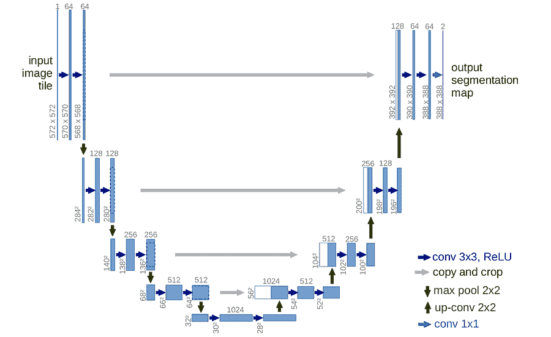

图 2. 在 [4] 中提出的原始 U-Net 模型。

然而，有必要修改这个架构，使其也能考虑到时间步信息。不仅如此，由于我们只会使用 MNIST 数据集，我们还需要使模型更小。记住深度学习中的惯例：对于简单任务，简单的模型通常更有效。

在下面的图中，我展示了修改后的整个 U-Net 模型。在这里，你可以看到 *时间嵌入* 张量被注入到模型的每个阶段，这将通过元素级加和来完成，使模型能够捕捉到时间步信息。接下来，与原始 U-Net 不同，在这种情况下，我们将每个阶段只重复两次。此外，值得注意的是，下采样阶段的堆叠也被称为 *编码器*，而上采样阶段的堆叠通常被称为 *解码器*。

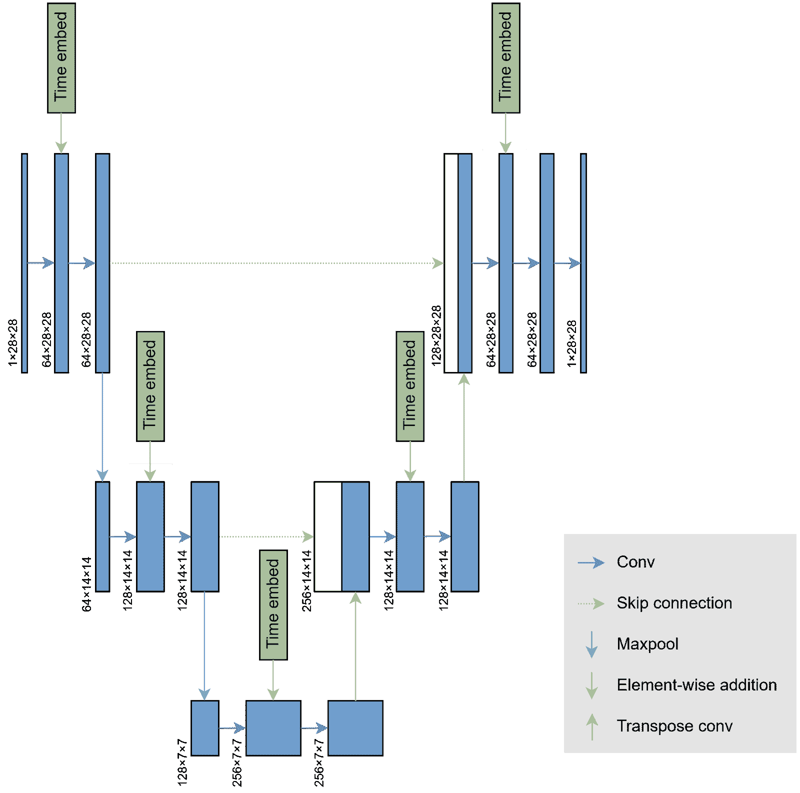

图 3. 用于我们的扩散任务的修改后的 U-Net 模型 [3]。

现在，让我们通过创建一个用于生成时间嵌入张量的类来开始构建架构，这个想法与 Transformer 中的 *位置嵌入* 类似。下面 Codeblock 3 中有详细说明。

```py
# Codeblock 3
class TimeEmbedding(nn.Module):
    def forward(self):
        time = torch.arange(NUM_TIMESTEPS, device=DEVICE).reshape(NUM_TIMESTEPS, 1)  #(1)
        print(f"time\t\t: {time.shape}")

        i = torch.arange(0, TIME_EMBED_DIM, 2, device=DEVICE)
        denominator = torch.pow(10000, i/TIME_EMBED_DIM)
        print(f"denominator\t: {denominator.shape}")

        even_time_embed = torch.sin(time/denominator)  #(1)
        odd_time_embed  = torch.cos(time/denominator)  #(2)
        print(f"even_time_embed\t: {even_time_embed.shape}")
        print(f"odd_time_embed\t: {odd_time_embed.shape}")

        stacked = torch.stack([even_time_embed, odd_time_embed], dim=2)  #(3)
        print(f"stacked\t\t: {stacked.shape}")
        time_embed = torch.flatten(stacked, start_dim=1, end_dim=2)  #(4)
        print(f"time_embed\t: {time_embed.shape}")

        return time_embed
```

在上面的代码中，我们基本上创建了一个大小为 `NUM_TIMESTEPS` × `TIME_EMBED_DIM`（1000×32）的张量，其中这个张量的每一行都将包含时间步信息。稍后，每个 1000 个时间步都将由一个长度为 32 的特征向量表示。张量中的值是基于图 4 中的两个方程获得的。在上面的代码块 3 中，这两个方程在行 `#(1)` 和 `#(2)` 中实现，每个方程形成一个大小为 1000×16 的张量。接下来，这些张量通过行 `#(3)` 和 `#(4)` 中的代码组合在一起。

我还打印出了上述代码块中执行的每个步骤，以便你能更好地理解在 TimeEmbedding 类中实际做了什么。如果你还想了解更多关于上述代码的解释，请随时阅读我之前关于 Transformer 的帖子，你可以通过本文末尾的链接访问。一旦点击链接，你只需滚动到底部的位置编码部分即可。

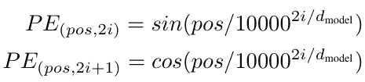

图 4. 来自 Transformer 论文的正弦位置编码公式 [6]。

现在，让我们使用以下测试代码检查 `TimeEmbedding` 类是否正常工作。结果输出显示，它成功生成了一个大小为 1000×32 的张量，这正是我们之前预期的。

```py
# Codeblock 4
time_embed_test = TimeEmbedding()
out_test = time_embed_test()
```

```py
# Codeblock 4 Output
time            : torch.Size([1000, 1])
denominator     : torch.Size([16])
even_time_embed : torch.Size([1000, 16])
odd_time_embed  : torch.Size([1000, 16])
stacked         : torch.Size([1000, 16, 2])
time_embed      : torch.Size([1000, 32])
```

* * *

### **U-Net 架构：DoubleConv**

如果你仔细观察修改后的架构，你会看到我们实际上得到了很多重复的模式，如下图中黄色框中突出显示的那样。


图 5. 黄色框内执行的过程将在 `DoubleConv` 类 [3] 中实现。

这五个黄色框具有相同的结构，其中它们由两个卷积层组成，时间嵌入张量在第一个卷积操作执行后立即注入。因此，我们现在要创建另一个名为 `DoubleConv` 的类来重现这种结构。请看下面的代码块 5a 和 5b，以了解我是如何做到这一点的。

```py
# Codeblock 5a
class DoubleConv(nn.Module):
    def __init__(self, in_channels, out_channels):  #(1)
        super().__init__()

        self.conv_0 = nn.Conv2d(in_channels=in_channels,  #(2)
                                out_channels=out_channels, 
                                kernel_size=3, 
                                bias=False, 
                                padding=1)
        self.bn_0 = nn.BatchNorm2d(num_features=out_channels)  #(3)

        self.time_embedding = TimeEmbedding()  #(4)
        self.linear = nn.Linear(in_features=TIME_EMBED_DIM,  #(5)
                                out_features=out_channels)

        self.conv_1 = nn.Conv2d(in_channels=out_channels,  #(6)
                                out_channels=out_channels, 
                                kernel_size=3, 
                                bias=False, 
                                padding=1)
        self.bn_1 = nn.BatchNorm2d(num_features=out_channels)  #(7)

        self.relu = nn.ReLU(inplace=True)  #(8)
```

上面的`__init__()`方法的两个输入为我们提供了配置输入和输出通道数量（`#(1)`）的灵活性，这样`DoubleConv`类就可以通过调整其输入参数简单地实例化所有五个黄色框。正如其名称所暗示的，在这里我们初始化了两个卷积层（`#(2)`行和`#(6)`行），每个卷积层后面都跟着一个批量归一化层和一个 ReLU 激活函数。请注意，两个归一化层需要分别初始化（`#(3)`行和`#(7)`行），因为它们各自有自己的可训练归一化参数。同时，ReLU 激活函数只需要初始化一次（`#(8)`行），因为它不包含任何参数，允许它在网络的多个不同部分多次使用。在`#(4)`行，我们初始化了我们之前创建的`TimeEmbedding`层，它将被连接到一个标准的线性层（`#(5)`行）。这个线性层负责调整时间嵌入张量的维度，以便结果输出可以以逐元素的方式与第一个卷积层的输出相加。

现在，让我们看一下下面的 Codeblock 5b，以更好地理解`DoubleConv`块的流程。在这里，你可以看到`forward()`方法接受两个输入：原始图像`x`和如`#(1)`行所示的时间步信息。我们最初使用第一个 Conv-BN-ReLU 序列（`#(2–4)`）处理图像。这种 Conv-BN-ReLU 结构通常用于处理基于 CNN 的模型，即使插图没有明确显示批量归一化和 ReLU 层。除了图像之外，我们还从对应图像的嵌入张量中取出第`t`个时间步信息（`#(5)`行），并通过线性层（`#(6)`行）传递。在执行`#(8)`行的逐元素加和之前，我们仍然需要使用`#(7)`行的代码来扩展结果张量的维度。最后，我们使用第二个 Conv-BN-ReLU 序列（`#(9–11)`）处理得到的张量。

```py
# Codeblock 5b
    def forward(self, x, t):  #(1)
        print(f'images\t\t\t: {x.size()}')
        print(f'timesteps\t\t: {t.size()}, {t}')

        x = self.conv_0(x)  #(2)
        x = self.bn_0(x)    #(3)
        x = self.relu(x)    #(4)
        print(f'\nafter first conv\t: {x.size()}')

        time_embed = self.time_embedding()[t]      #(5)
        print(f'\ntime_embed\t\t: {time_embed.size()}')

        time_embed = self.linear(time_embed)       #(6)
        print(f'time_embed after linear\t: {time_embed.size()}')

        time_embed = time_embed[:, :, None, None]  #(7)
        print(f'time_embed expanded\t: {time_embed.size()}')

        x = x + time_embed  #(8)
        print(f'\nafter summation\t\t: {x.size()}')

        x = self.conv_1(x)  #(9)
        x = self.bn_1(x)    #(10)
        x = self.relu(x)    #(11)
        print(f'after second conv\t: {x.size()}')

        return x
```

为了检查我们的`DoubleConv`实现是否正常工作，我们将使用下面的代码块 6 进行测试。在这里，我想模拟这个块的第一个实例，这对应于图 5 中左边的最黄色方框。为此，我们需要将`in_channels`和`out_channels`参数分别设置为 1 和 64（`#(1)`）。接下来，我们初始化两个输入张量，即`x_test`和`t_test`。`x_test`张量的大小为 2×1×28×28，代表一个大小为 28×28 的灰度图像的批次。请注意，这只是一个随机值的虚拟张量，在训练阶段稍后将被 MNIST 数据集中的实际图像所替换。同时，`t_test`是一个包含对应图像时间步数的张量（`#(3)`）。这个张量的值在 0 和`NUM_TIMESTEPS`（1000）之间随机选择。请注意，这个张量的数据类型必须是整数，因为数字将被用于索引，正如在代码块 5b 中的`#(5)`行所示。最后，在`#(4)`行，我们将`x_test`和`t_test`张量传递给`double_conv_test`层。

顺便说一下，我在运行下面的代码之前移除了之前的代码块中的`print()`函数，以便使输出看起来更整洁。

```py
# Codeblock 6
double_conv_test = DoubleConv(in_channels=1, out_channels=64).to(DEVICE)  #(1)

x_test = torch.randn((BATCH_SIZE, NUM_CHANNELS, IMAGE_SIZE, IMAGE_SIZE)).to(DEVICE)  #(2)
t_test = torch.randint(0, NUM_TIMESTEPS, (BATCH_SIZE,)).to(DEVICE)  #(3)

out_test = double_conv_test(x_test, t_test)  #(4)
```

```py
# Codeblock 6 Output
images                  : torch.Size([2, 1, 28, 28])   #(1)
timesteps               : torch.Size([2]), tensor([468, 304], device='cuda:0')  #(2)

after first conv        : torch.Size([2, 64, 28, 28])  #(3)

time_embed              : torch.Size([2, 32])          #(4)
time_embed after linear : torch.Size([2, 64])
time_embed expanded     : torch.Size([2, 64, 1, 1])    #(5)

after summation         : torch.Size([2, 64, 28, 28])  #(6)
after second conv       : torch.Size([2, 64, 28, 28])  #(7)
```

我们可以在上述输出的`#(1)`和`#(2)`行中看到原始输入张量的形状。具体来说，在`#(2)`行，我还打印出了我们随机选择的两个时间步。在这个例子中，我们假设 x 张量中的两个图像在输入网络之前已经用 468 次和 304 次时间步的噪声水平进行了噪声处理。我们可以看到，图像张量 x 在通过第一个卷积层（`#(3)`）后，其形状变为 2×64×28×28。同时，我们的时间嵌入张量的大小变为 2×32（`#(4)`），这是通过从原始的 1000×32 大小的嵌入中提取第 468 行和第 304 行得到的。为了允许执行逐元素求和（`#(6)`），我们需要将 32 维的时间嵌入向量映射到 64 维，并扩展它们的轴，从而得到一个大小为 2×64×1×1 的张量（`#(5)`），这样它就可以广播到 2×64×28×28 的张量。求和完成后，我们再将张量通过第二个卷积层，此时张量的维度没有任何变化（`#(7)`）。

* * *

### **U-Net 架构：编码器**

由于我们已经成功实现了`DoubleConv`块，下一步要做的是实现所谓的`DownSample`块。在下面的图 6 中，这对应于红色方框内的部分。

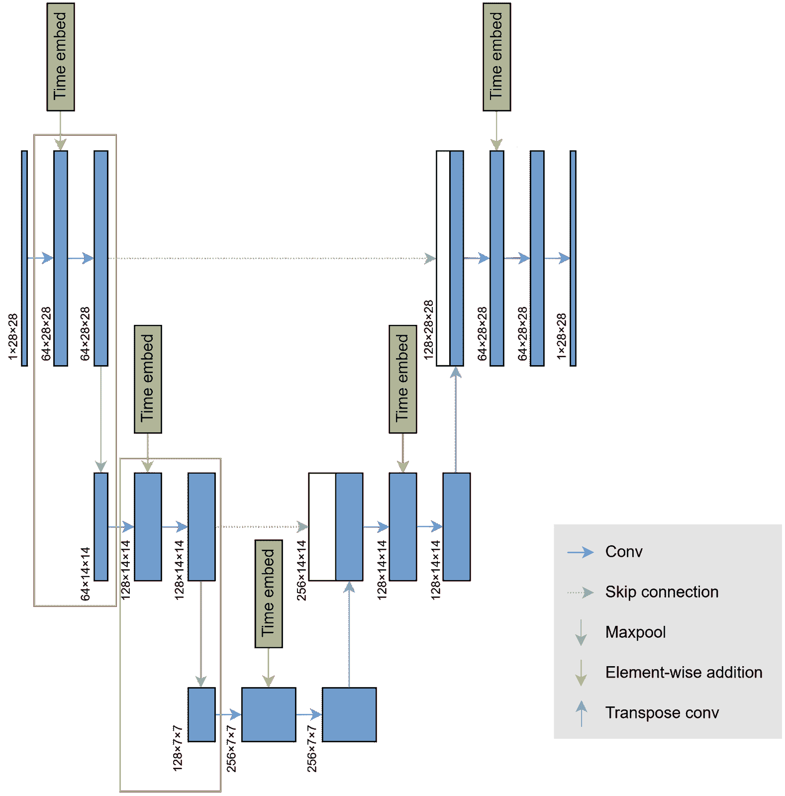

图 6。用红色突出显示的网络部分是所谓的`DownSample`块[3]。

`DownSample`块的作用是减少图像的空间维度，但重要的是要注意，同时它增加了通道数。为了实现这一点，我们可以简单地堆叠一个`DoubleConv`块和一个最大池化操作。在这种情况下，池化使用 2×2 的核大小和步长为 2，导致图像的空间维度是输入的一半。这个块的实现可以在下面的代码块 7 中看到。

```py
# Codeblock 7
class DownSample(nn.Module):
    def __init__(self, in_channels, out_channels):  #(1)
        super().__init__()

        self.double_conv = DoubleConv(in_channels=in_channels,  #(2)
                                      out_channels=out_channels)
        self.maxpool = nn.MaxPool2d(kernel_size=2, stride=2)    #(3)

    def forward(self, x, t):  #(4)
        print(f'original\t\t: {x.size()}')
        print(f'timesteps\t\t: {t.size()}, {t}')

        convolved = self.double_conv(x, t)   #(5)
        print(f'\nafter double conv\t: {convolved.size()}')

        maxpooled = self.maxpool(convolved)  #(6)
        print(f'after pooling\t\t: {maxpooled.size()}')

        return convolved, maxpooled          #(7)
```

在这里，我将`__init__()`方法设置为接受输入和输出通道数，这样我们就可以使用它来创建图 6 中突出显示的两个`DownSample`块，而无需单独编写它们（`#(1)`）。接下来，`DoubleConv`和最大池化层分别在行`#(2)`和`#(3)`初始化。记住，由于`DoubleConv`块接受图像`x`和对应的时间步`t`作为输入，我们还需要设置这个`DownSample`块的`forward()`方法，使其也接受这两个输入（`#(4)`）。`x`和`t`包含的信息随后被组合，当两个张量通过`double_conv`层处理时，输出存储在名为`convolved`的变量中（`#(5)`）。之后，我们现在实际上在行`#(6)`执行下采样，使用最大池化操作产生一个名为`maxpooled`的张量。重要的是要注意，`convolved`和`maxpooled`两个张量都将被返回，这主要是因为我们稍后会将`maxpooled`带到下一个下采样阶段，而`convolved`张量将通过跳跃连接直接传输到解码器中的上采样阶段。

现在，让我们使用下面的代码块 8 测试`DownSample`类。这里使用的输入张量与代码块 6 中的完全相同。根据产生的输出，我们可以看到池化操作成功地将`DoubleConv`块的输出从 2×64×28×28 (`#(1)`)转换为 2×64×14×14 (`#(2)`)，这表明我们的`DownSample`类工作正常。

```py
# Codeblock 8
down_sample_test = DownSample(in_channels=1, out_channels=64).to(DEVICE)

x_test = torch.randn((BATCH_SIZE, NUM_CHANNELS, IMAGE_SIZE, IMAGE_SIZE)).to(DEVICE)
t_test = torch.randint(0, NUM_TIMESTEPS, (BATCH_SIZE,)).to(DEVICE)

out_test = down_sample_test(x_test, t_test)
```

```py
# Codeblock 8 Output
original          : torch.Size([2, 1, 28, 28])
timesteps         : torch.Size([2]), tensor([468, 304], device='cuda:0')

after double conv : torch.Size([2, 64, 28, 28])  #(1)
after pooling     : torch.Size([2, 64, 14, 14])  #(2)
```

* * *

### **U-Net 架构：解码器**

我们需要在解码器中引入所谓的`UpSample`块，该块负责将中间层的张量还原到原始图像维度。为了保持对称结构，`UpSample`块的数量必须与`DownSample`块的数量相匹配。查看下面的图 7，以了解两个`UpSample`块的位置。


图 7。蓝色框内的组件是所谓的`UpSample`块 [3]。

由于两个`UpSample`块在结构上完全相同，我们可以为它们初始化一个单独的类，就像我们之前创建的`DownSample`类一样。查看下面的代码块 9，以了解我是如何实现它的。

```py
# Codeblock 9
class UpSample(nn.Module):
    def __init__(self, in_channels, out_channels):
        super().__init__()

        self.conv_transpose = nn.ConvTranspose2d(in_channels=in_channels,  #(1)
                                                 out_channels=out_channels, 
                                                 kernel_size=2, stride=2)  #(2)
        self.double_conv = DoubleConv(in_channels=in_channels,  #(3)
                                      out_channels=out_channels)

    def forward(self, x, t, connection):  #(4)
        print(f'original\t\t: {x.size()}')
        print(f'timesteps\t\t: {t.size()}, {t}')
        print(f'connection\t\t: {connection.size()}')

        x = self.conv_transpose(x)  #(5)
        print(f'\nafter conv transpose\t: {x.size()}')

        x = torch.cat([x, connection], dim=1)  #(6)
        print(f'after concat\t\t: {x.size()}')

        x = self.double_conv(x, t)  #(7)
        print(f'after double conv\t: {x.size()}')

        return x
```

在`__init__()`方法中，我们使用`nn.ConvTranspose2d`上采样空间维度（`#(1)`）。内核大小和步长都设置为 2，以便输出将是原来的两倍大（`#(2)`）。接下来，将使用`DoubleConv`块来减少通道数，同时结合时间嵌入张量（`#(3)`）中的时间步信息。

这个`UpSample`类的流程比`DownSample`类要复杂一些。如果我们仔细观察其架构，会发现我们还有一个从编码器直接来的跳跃连接。因此，`forward()`方法除了接受原始图像`x`和时间步`t`之外，还需要接受另一个参数，即残差张量`connection`（`#(4)`）。在这个方法内部的第一件事就是用转置卷积层（`#(5)`）处理原始图像`x`。实际上，这个层不仅上采样了空间大小，同时也在减少通道数。然而，得到的张量随后直接以通道方式与`connection`连接（`#(6)`），看起来像是没有进行通道减少。重要的是要知道，在这个点上，这两个张量只是连接在一起，这意味着它们的信息还没有结合。我们最后将这些连接的张量输入到`double_conv`层（`#(7)`），通过卷积层内部的可学习参数使它们能够相互分享信息。

下面的代码块 10 展示了我是如何测试`UpSample`类的。要传递的张量大小是根据第二个上采样块设置的，即图 7 中最右侧的蓝色框。

```py
# Codeblock 10
up_sample_test = UpSample(in_channels=128, out_channels=64).to(DEVICE)

x_test = torch.randn((BATCH_SIZE, 128, 14, 14)).to(DEVICE)
t_test = torch.randint(0, NUM_TIMESTEPS, (BATCH_SIZE,)).to(DEVICE)
connection_test = torch.randn((BATCH_SIZE, 64, 28, 28)).to(DEVICE)

out_test = up_sample_test(x_test, t_test, connection_test)
```

在下面的输出结果中，如果我们比较输入张量（`#(1)`）和最终张量形状（`#(2)`），我们可以清楚地看到通道数成功从 128 减少到 64，同时空间维度从 14×14 增加到 28×28。这实际上意味着我们的`UpSample`类现在可以用于主 U-Net 架构。

```py
# Codeblock 10 Output
original             : torch.Size([2, 128, 14, 14])   #(1)
timesteps            : torch.Size([2]), tensor([468, 304], device='cuda:0')
connection           : torch.Size([2, 64, 28, 28])

after conv transpose : torch.Size([2, 64, 28, 28])
after concat         : torch.Size([2, 128, 28, 28])
after double conv    : torch.Size([2, 64, 28, 28])    #(2)
```

* * *

### **U-Net 架构：将所有组件组合在一起**

一旦创建了所有 U-Net 组件，我们接下来要做的是将它们组合成一个单独的类。请查看下面的代码块 11a 和 11b 以获取详细信息。

```py
# Codeblock 11a
class UNet(nn.Module):
    def __init__(self):
        super().__init__()

        self.downsample_0 = DownSample(in_channels=NUM_CHANNELS,  #(1)
                                       out_channels=64)
        self.downsample_1 = DownSample(in_channels=64,            #(2)
                                       out_channels=128)

        self.bottleneck   = DoubleConv(in_channels=128,           #(3)
                                       out_channels=256)

        self.upsample_0   = UpSample(in_channels=256,             #(4)
                                     out_channels=128)
        self.upsample_1   = UpSample(in_channels=128,             #(5)
                                     out_channels=64)

        self.output = nn.Conv2d(in_channels=64,                   #(6)
                                out_channels=NUM_CHANNELS,
                                kernel_size=1)
```

在上面的`__init__()`方法中，你可以看到我们初始化了两个下采样（`#(1–2)`）和两个上采样（`#(4–5)`）块，输入和输出通道的数量根据图示中的架构设置。实际上还有两个我尚未解释的额外组件，即*瓶颈*（`#(3)`）和*输出*层（`#(6)`）。前者本质上只是一个`DoubleConv`块，它作为编码器和解码器之间的主要连接。查看下面的图 8，以了解网络中哪些组件属于*瓶颈*层。接下来，*输出*层是一个标准的卷积层，它负责将最后`UpSampling`阶段产生的 64 通道图像转换为仅 1 通道。这个操作使用的是 1×1 大小的核，这意味着它在每个像素位置独立操作的同时，结合了所有通道的信息。


图 8. 瓶颈层（模型的下部分）作为 U-Net [3]编码器和解码器之间的主要桥梁。

我猜在下面的代码块中，整个 U-Net 的`forward()`方法相当直接，因为我们在这里本质上只是将 tensor 从一个层传递到另一个层——只是别忘了包括下采样和上采样块之间的跳过连接。

```py
# Codeblock 11b
    def forward(self, x, t):  #(1)
        print(f'original\t\t: {x.size()}')
        print(f'timesteps\t\t: {t.size()}, {t}')

        convolved_0, maxpooled_0 = self.downsample_0(x, t)
        print(f'\nmaxpooled_0\t\t: {maxpooled_0.size()}')

        convolved_1, maxpooled_1 = self.downsample_1(maxpooled_0, t)
        print(f'maxpooled_1\t\t: {maxpooled_1.size()}')

        x = self.bottleneck(maxpooled_1, t)
        print(f'after bottleneck\t: {x.size()}')

        upsampled_0 = self.upsample_0(x, t, convolved_1)
        print(f'upsampled_0\t\t: {upsampled_0.size()}')

        upsampled_1 = self.upsample_1(upsampled_0, t, convolved_0)
        print(f'upsampled_1\t\t: {upsampled_1.size()}')

        x = self.output(upsampled_1)
        print(f'final output\t\t: {x.size()}')

        return x
```

现在我们通过运行以下测试代码来查看我们是否正确构建了上面的 U-Net 类。

```py
# Codeblock 12
unet_test = UNet().to(DEVICE)

x_test = torch.randn((BATCH_SIZE, NUM_CHANNELS, IMAGE_SIZE, IMAGE_SIZE)).to(DEVICE)
t_test = torch.randint(0, NUM_TIMESTEPS, (BATCH_SIZE,)).to(DEVICE)

out_test = unet_test(x_test, t_test)
```

```py
# Codeblock 12 Output
original         : torch.Size([2, 1, 28, 28])   #(1)
timesteps        : torch.Size([2]), tensor([468, 304], device='cuda:0')

maxpooled_0      : torch.Size([2, 64, 14, 14])  #(2)
maxpooled_1      : torch.Size([2, 128, 7, 7])   #(3)
after bottleneck : torch.Size([2, 256, 7, 7])   #(4)
upsampled_0      : torch.Size([2, 128, 14, 14])
upsampled_1      : torch.Size([2, 64, 28, 28])
final output     : torch.Size([2, 1, 28, 28])   #(5)
```

在上面的输出中，我们可以看到两个下采样阶段成功地将原始大小为 1×28×28 的 tensor（`#(1)`）转换为 64×14×14（`#(2)`）和 128×7×7（`#(3)`），分别。然后这个 tensor 通过瓶颈层，使其通道数增加到 256，而空间维度没有改变（`#(4)`）。最后，我们对该 tensor 进行两次上采样，最终将通道数缩减到 1（`#(5)`）。根据这个输出，看起来我们的模型正在正常工作。因此，它现在可以准备用于我们的扩散任务训练了。

* * *

### **数据集准备**

由于我们已经成功创建了整个 U-Net 架构，下一步要做的是准备 MNIST 手写数字数据集。在实际加载之前，我们需要首先使用 Torchvision 中的`transforms.Compose()`方法定义预处理步骤，如代码块 13 中的行`#(1)`所示。这里我们做了两件事：将图像转换为 PyTorch 张量，并将像素值从 0–255 缩放到 0–1 (`#(2)`), 然后归一化它们，使得最终的像素值介于-1 和 1 之间 (`#(3)`). 接下来，我们使用`datasets.MNIST()`下载数据集。在这种情况下，我们将从训练数据中获取图像，因此我们使用`train=True` (`#(5)`). 不要忘记将之前初始化的`transform`变量传递给`transform`参数（`transform=transform`），这样它就会在加载图像时自动进行预处理 (`#(6)`). 最后，我们需要使用`DataLoader`从`mnist_dataset`加载图像 (`#(7)`). 我用于输入参数的参数是为了在每次迭代中从数据集中随机选择`BATCH_SIZE`（2）个图像。

```py
# Codeblock 13
transform = transforms.Compose([  #(1)
    transforms.ToTensor(),        #(2)
    transforms.Normalize((0.5,), (0.5,))  #(3)
])

mnist_dataset = datasets.MNIST(   #(4)
    root='./data', 
    train=True,           #(5)
    download=True, 
    transform=transform   #(6)
)

loader = DataLoader(mnist_dataset,  #(7)
                    batch_size=BATCH_SIZE,
                    drop_last=True, 
                    shuffle=True)
```

在下面的代码块中，我尝试从数据集中加载一批图像。在每次迭代中，`loader`提供图像和相应的标签，因此我们需要将它们存储在两个不同的变量中：`images`和`labels`。

```py
# Codeblock 14
images, labels = next(iter(loader))

print('images\t\t:', images.shape)
print('labels\t\t:', labels.shape)
print('min value\t:', images.min())
print('max value\t:', images.max())
```

我们可以在下面的输出结果中看到，`images`张量的大小为 2×1×28×28 (`#(1)`), 这表明已经成功加载了两个大小为 28×28 的灰度图像。在这里我们还可以看到，`labels`张量的长度为 2，这与加载的图像数量相匹配 (`#(2)`). 注意，在这种情况下，标签将被完全忽略。我的计划是，我只是想让模型从整个训练数据集中生成它之前看到过的任何数字，甚至不知道它实际上是什么数字。最后，这个输出还显示，预处理工作正常，因为像素值现在介于-1 和 1 之间。

```py
# Codeblock 14 Output
images    : torch.Size([2, 1, 28, 28])  #(1)
labels    : torch.Size([2])             #(2)
min value : tensor(-1.)
max value : tensor(1.)
```

如果你想看到我们刚刚加载的图像的样子，请运行以下代码。

```py
# Codeblock 15   
plt.imshow(images[0].squeeze(), cmap='gray')
plt.show()
```

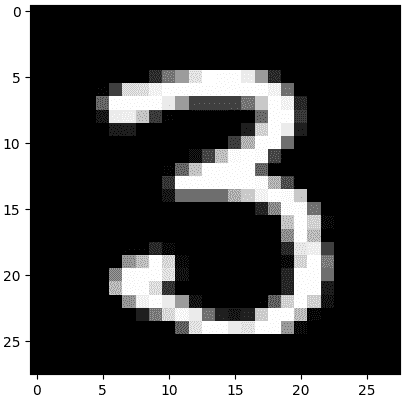

图 9. 代码块 15 的输出 [3]。

* * *

### 噪声调度器

在本节中，我们将讨论正向和反向扩散是如何进行的，这个过程本质上涉及到在每个时间步长逐渐添加或去除噪声。有必要知道，我们基本上希望所有时间步长都有均匀的噪声量，在正向扩散中，图像应该在时间步长 1000 时完全充满噪声，而在反向扩散中，我们必须在时间步长 0 时获得完全清晰的图像。因此，我们需要某种东西来控制每个时间步长的噪声量。在本节的后面部分，我将实现一个名为 `NoiseScheduler` 的类来完成这项工作。— 这可能是本文中最数学的部分，因为我将在这里展示许多方程。但不用担心，因为我们将专注于实现这些方程，而不是讨论数学推导。

现在我们来看看图 10 中的方程，我将在下面的 `NoiseScheduler` 类的 `__init__()` 方法中实现这些方程。

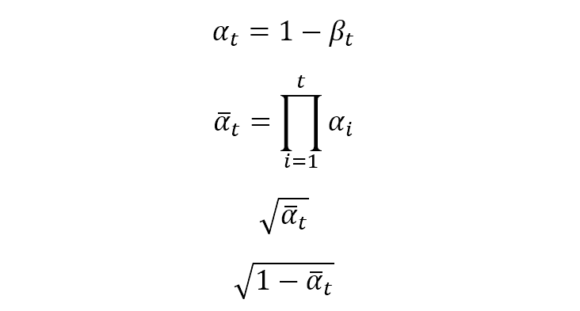

图 10\. 我们需要在 `<strong>NoiseScheduler</strong>` 类的 `__init__()` 方法中实现的方程 [3]。

```py
# Codeblock 16a
class NoiseScheduler:
    def __init__(self):
        self.betas = torch.linspace(BETA_START, BETA_END, NUM_TIMESTEPS)  #(1)
        self.alphas = 1\. - self.betas
        self.alphas_cum_prod = torch.cumprod(self.alphas, dim=0)
        self.sqrt_alphas_cum_prod = torch.sqrt(self.alphas_cum_prod)
        self.sqrt_one_minus_alphas_cum_prod = torch.sqrt(1\. - self.alphas_cum_prod)
```

上述代码通过创建多个数字序列，所有这些序列基本上都受 `BETA_START` (0.0001)、`BETA_END` (0.02) 和 `NUM_TIMESTEPS` (1000) 控制。我们需要实例化的第一个序列是 `betas` 本身，这是通过 `torch.linspace()` (`#(1)`) 实现的。它本质上生成一个从 0.0001 到 0.02 的长度为 1000 的一维张量，其中张量中的每个元素对应一个单独的时间步长。每个元素之间的间隔是均匀的，这使得我们能够在所有时间步长中生成均匀的噪声量。有了这个 `betas` 张量，我们就可以根据图 10 中的四个方程计算 `alphas`、`alphas_cum_prod`、`sqrt_alphas_cum_prod` 和 `sqrt_one_minus_alphas_cum_prod`。稍后，这些张量将成为在扩散过程中生成或去除噪声的基础。

扩散通常是以顺序方式进行。然而，正向扩散过程是确定性的，因此我们可以将原始方程推导成封闭形式，这样我们就可以在特定时间步长获得噪声，而无需从一开始就迭代地添加噪声。下方的图 11 展示了正向扩散的封闭形式，其中 *x₀* 代表原始图像，而 epsilon (*ϵ*) 表示由随机高斯噪声组成的图像。我们可以将这个方程视为一个加权组合，其中我们根据时间步长确定的权重将清晰图像和噪声结合起来，从而得到具有特定噪声量的图像。


图 11\. 正向扩散过程的封闭形式 [3]。

该方程的实现可以在代码块 16b 中看到。在这个`forward_diffusion()`方法中，*x₀*和*ϵ*分别表示为`original`和`noise`。在这里，你需要记住这两个输入变量是图像，而`sqrt_alphas_cum_prod_t`和`sqrt_one_minus_alphas_cum_prod_t`是标量。因此，我们需要调整这两个标量的形状（`#(1)`和`#(2)`），以便在行`#(3)`处执行操作。`noisy_image`变量将是此函数的输出，我认为这个名字是自解释的。

```py
# Codeblock 16b
    def forward_diffusion(self, original, noise, t):
        sqrt_alphas_cum_prod_t = self.sqrt_alphas_cum_prod[t]
        sqrt_alphas_cum_prod_t = sqrt_alphas_cum_prod_t.to(DEVICE).view(-1, 1, 1, 1)  #(1)

        sqrt_one_minus_alphas_cum_prod_t = self.sqrt_one_minus_alphas_cum_prod[t]
        sqrt_one_minus_alphas_cum_prod_t = sqrt_one_minus_alphas_cum_prod_t.to(DEVICE).view(-1, 1, 1, 1)  #(2)

        noisy_image = sqrt_alphas_cum_prod_t * original + sqrt_one_minus_alphas_cum_prod_t * noise  #(3)

        return noisy_image
```

现在我们来谈谈反向扩散。实际上，这个比正向扩散要复杂一些，因为我们在这里需要三个额外的方程。在我给你这些方程之前，让我先展示一下实现。请看下面的代码块 16c。

```py
# Codeblock 16c
    def backward_diffusion(self, current_image, predicted_noise, t):  #(1)
        denoised_image = (current_image - (self.sqrt_one_minus_alphas_cum_prod[t] * predicted_noise)) / self.sqrt_alphas_cum_prod[t]  #(2)
        denoised_image = 2 * (denoised_image - denoised_image.min()) / (denoised_image.max() - denoised_image.min()) - 1  #(3)

        current_prediction = current_image - ((self.betas[t] * predicted_noise) / (self.sqrt_one_minus_alphas_cum_prod[t]))  #(4)
        current_prediction = current_prediction / torch.sqrt(self.alphas[t])  #(5)

        if t == 0:  #(6)
            return current_prediction, denoised_image

        else:
            variance = (1 - self.alphas_cum_prod[t-1]) / (1\. - self.alphas_cum_prod[t])  #(7)
            variance = variance * self.betas[t]  #(8)
            sigma = variance ** 0.5
            z = torch.randn(current_image.shape).to(DEVICE)
            current_prediction = current_prediction + sigma*z

            return current_prediction, denoised_image
```

在推理阶段稍后，`backward_diffusion()`方法将在一个循环中被调用，该循环迭代`NUM_TIMESTEPS`（1000）次，从*t* = 999 开始，继续到*t* = 998，一直到最后*t* = 0。这个函数负责根据`current_image`（前一个去噪步骤产生的图像）、`predicted_noise`（U-Net 在之前步骤中预测的噪声）和时间步信息`t`（`#(1)`）迭代地去除图像中的噪声。在每次迭代中，使用图 12 中显示的方程进行噪声去除，在代码块 16c 中，这对应于行`#(4-5)`。


图 12. 用于从图像中去除噪声的方程[3]。

只要我们没有达到*t* = 0，我们就会根据图 13 中的方程（`#(7–8)`）计算方差。然后，这个方差将被用来在反向扩散过程中引入另一个受控噪声，以模拟随机性，因为图 12 中的噪声去除方程是一个确定性近似。这也是我们一旦达到*t* = 0（`#(6)`）就不计算方差的基本原因，因为我们不再需要添加更多噪声，因为图像已经完全清晰了。


图 13. 用于计算引入受控噪声方差的方程[3]。

与旨在估计前一时间步图像（*xₜ₋₁*）的`current_prediction`不同，`denoised_image`张量的目标是重建原始图像（*x₀*）。由于这些不同的目标，我们需要一个单独的方程来计算`denoised_image`，这可以在下面的图 14 中看到。方程的实现本身写在行`#(2–3)`。


图 14. 重建原始图像的方程[3]。

现在，让我们测试我们上面创建的 `NoiseScheduler` 类。在下面的代码块中，我实例化了一个 `NoiseScheduler` 对象，并打印出与之相关的属性，这些属性都是根据图 10 中的方程式，基于存储在 `betas` 属性中的值计算得出的。请记住，这些张量的实际长度是 `NUM_TIMESTEPS`（1000），但在这里我只打印出前 6 个元素。

```py
# Codeblock 17
noise_scheduler = NoiseScheduler()

print(f'betas\t\t\t\t: {noise_scheduler.betas[:6]}')
print(f'alphas\t\t\t\t: {noise_scheduler.alphas[:6]}')
print(f'alphas_cum_prod\t\t\t: {noise_scheduler.alphas_cum_prod[:6]}')
print(f'sqrt_alphas_cum_prod\t\t: {noise_scheduler.sqrt_alphas_cum_prod[:6]}')
print(f'sqrt_one_minus_alphas_cum_prod\t: {noise_scheduler.sqrt_one_minus_alphas_cum_prod[:6]}')
```

```py
# Codeblock 17 Output
betas                          : tensor([1.0000e-04, 1.1992e-04, 1.3984e-04, 1.5976e-04, 1.7968e-04, 1.9960e-04])
alphas                         : tensor([0.9999, 0.9999, 0.9999, 0.9998, 0.9998, 0.9998])
alphas_cum_prod                : tensor([0.9999, 0.9998, 0.9996, 0.9995, 0.9993, 0.9991])
sqrt_alphas_cum_prod           : tensor([0.9999, 0.9999, 0.9998, 0.9997, 0.9997, 0.9996])
sqrt_one_minus_alphas_cum_prod : tensor([0.0100, 0.0148, 0.0190, 0.0228, 0.0264, 0.0300])
```

上述输出表明我们的 `__init__()` 方法按预期工作。接下来，我们将测试 `forward_diffusion()` 方法。如果您回到图 16b，您会看到 `forward_diffusion()` 接受三个输入：原始图像、噪声图像和时间步数。让我们使用我们之前加载的 MNIST 数据集中的图像作为第一个输入（`#(1)`），以及大小完全相同的随机高斯噪声作为第二个输入（`#(2)`）。运行下面的代码块 18，看看这两张图像是什么样子。

```py
# Codeblock 18
image = images[0]  #(1)
noise = torch.randn_like(image)  #(2)

plt.imshow(image.squeeze(), cmap='gray')
plt.show()
plt.imshow(noise.squeeze(), cmap='gray')
plt.show()
```

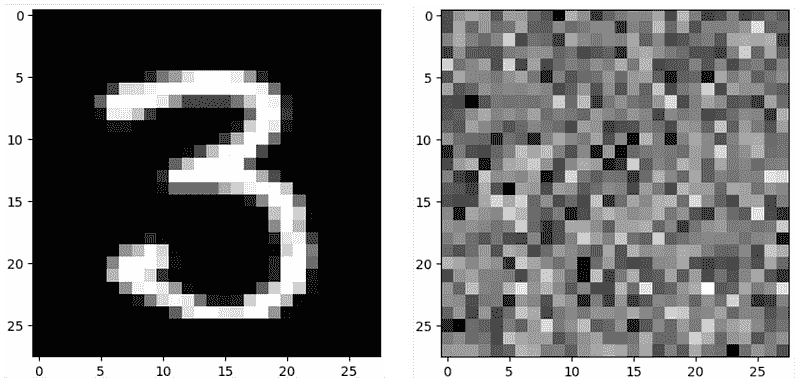

图 15. 作为原始图像（左）和噪声图像（右）使用的两张图像。左边的是我在图 9 中之前展示过的同一张图像[3]。

由于我们已经准备好了图像和噪声，接下来我们需要做的是将它们传递给 `forward_diffusion()` 方法，并附带 *t* 参数。我实际上尝试了多次运行下面的代码块 19，其中 *t* 分别为 50、100、150 等等，直到 *t* = 300。您可以在图 16 中看到，随着参数的增加，图像变得越来越不清晰。在这种情况下，当 *t* 设置为 999 时，图像将被噪声完全填充。

```py
# Codeblock 19
noisy_image_test = noise_scheduler.forward_diffusion(image.to(DEVICE), noise.to(DEVICE), t=50)

plt.imshow(noisy_image_test[0].squeeze().cpu(), cmap='gray')
plt.show()
```

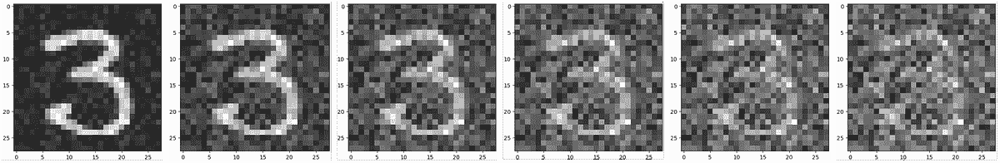

图 16. 在 t=50、100、150 等等直到 t=300 时的前向扩散过程的结果[3]。

不幸的是，我们无法测试 `backward_diffusion()` 方法，因为这个过程需要我们拥有已经训练好的 U-Net 模型。所以，我们现在就跳过这部分内容。我会在推理阶段向您展示如何实际使用这个函数。

***

### 训练

随着 U-Net 模型、MNIST 数据集和噪声调度器的准备就绪，我们现在可以准备一个用于训练的函数了。在我们这样做之前，我在下面的代码块 20 中实例化了模型和噪声调度器。

```py
# Codeblock 20
model = UNet().to(DEVICE)
noise_scheduler = NoiseScheduler()
```

整个训练过程在代码块 21 中所示的`train()`函数中实现。在执行任何操作之前，我们首先初始化优化器和损失函数，在这种情况下我们分别使用 Adam 和 MSE（`#(1–2)`）。我们在这里基本上想要做的是训练模型，使其能够预测输入图像中包含的噪声，随后，预测的噪声将作为反向扩散阶段去噪过程的基础。为了实际训练模型，我们首先需要使用第`#(6)`行的代码执行正向扩散。这个过程将在`images`张量（`#(3)`）上使用第`#(4)`行生成的随机噪声进行。接下来，我们为`t`（`#(5)`）取一个介于 0 和`NUM_TIMESTEPS`（1000）之间的随机数，这主要是因为我们希望我们的模型看到不同噪声级别的图像，作为一种提高泛化能力的方法。由于已经生成了噪声图像，我们随后将其与选择的`t`（`#(7)`）一起通过 U-Net 模型。这里的输入`t`对模型很有用，因为它表示图像中的当前噪声水平。最后，我们之前初始化的损失函数负责计算实际噪声和从原始图像预测的噪声之间的差异（`#(8)`）。因此，这次训练的目标基本上是使预测的噪声尽可能接近我们在第`#(4)`行生成的噪声。

```py
# Codeblock 21
def train():
    optimizer = Adam(model.parameters(), lr=LEARNING_RATE)  #(1)
    loss_function = nn.MSELoss()  #(2)
    losses = []

    for epoch in range(NUM_EPOCHS):
        print(f'Epoch no {epoch}')

        for images, _ in tqdm(loader):

            optimizer.zero_grad()

            images = images.float().to(DEVICE)  #(3)
            noise = torch.randn_like(images)  #(4)
            t = torch.randint(0, NUM_TIMESTEPS, (BATCH_SIZE,))  #(5)

            noisy_images = noise_scheduler.forward_diffusion(images, noise, t).to(DEVICE)  #(6)
            predicted_noise = model(noisy_images, t)  #(7)
            loss = loss_function(predicted_noise, noise)  #(8)

            losses.append(loss.item())
            loss.backward()
            optimizer.step()

    return losses
```

现在我们使用下面的代码块来运行上述训练函数。在等待训练完成的过程中，请坐下来放松。在我的情况下，我使用了开启 Nvidia GPU P100 的 Kaggle Notebook，大约花费了 45 分钟来完成。

```py
# Codeblock 22
losses = train()
```

如果我们看一下损失图，似乎我们的模型学习得相当好，因为随着时间的推移，值总体上是下降的，在早期阶段有一个快速的下降，而在后期阶段有一个更稳定的（尽管仍在下降）趋势。所以，我认为我们可以在推理阶段期待良好的结果。

```py
# Codeblock 23
plt.plot(losses)
```

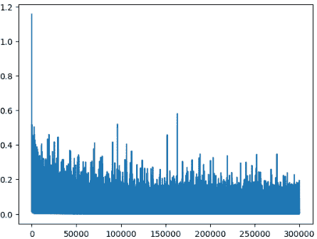

图 17.随着训练的进行，损失值如何下降[3]。

***

### 推理

到目前为止，我们已经训练好了我们的模型，现在我们可以对其进行推理。查看下面的代码块 24，以了解我是如何实现`inference()`函数的。

```py
# Codeblock 24
def inference():

    denoised_images = []  #(1)

    with torch.no_grad():  #(2)
        current_prediction = torch.randn((64, NUM_CHANNELS, IMAGE_SIZE, IMAGE_SIZE)).to(DEVICE)  #(3)

        for i in tqdm(reversed(range(NUM_TIMESTEPS))):  #(4)
            predicted_noise = model(current_prediction, torch.as_tensor(i).unsqueeze(0))  #(5)
            current_prediction, denoised_image = noise_scheduler.backward_diffusion(current_prediction, predicted_noise, torch.as_tensor(i))  #(6)

            if i%100 == 0:  #(7)
                denoised_images.append(denoised_image)

        return denoised_images
```

在标记为`#(1)`的行中，我初始化了一个空列表，该列表将用于每 100 个时间步存储去噪结果（`#(7)`）。这将在以后允许我们看到反向扩散的过程。实际的推理过程封装在`torch.no_grad()`（`#(2)`）中。记住，在扩散模型中，我们是从完全随机的噪声中生成图像，我们假设这些图像最初在*t* = 999。为了实现这一点，我们可以简单地使用`torch.randn()`，如第`#(3)`行所示。在这里，我们初始化了一个大小为 64×1×28×28 的张量，表示我们即将同时生成 64 幅图像。接下来，我们编写一个从 999 开始反向迭代的`for`循环（`#(4)`）。在这个循环内部，我们将当前图像和时间步作为输入提供给训练好的 U-Net，并让它预测噪声（`#(5)`）。实际的反向扩散在`#(6)`行执行。迭代结束时，我们应该得到与我们的数据集中相似的新的图像。现在让我们在下面的代码块中调用`inference()`函数。

```py
# Codeblock 25
denoised_images = inference()
```

推理完成后，我们现在可以看到生成的图像的样子。下面的代码块 26 用于显示我们刚刚生成的第一幅图像。

```py
# Codeblock 26
fig, axes = plt.subplots(ncols=7, nrows=6, figsize=(10, 8))

counter = 0

for i in range(6):
    for j in range(7):
        axes[i,j].imshow(denoised_images[-1][counter].squeeze().detach().cpu().numpy(), cmap='gray')  #(1)
        axes[i,j].get_xaxis().set_visible(False)
        axes[i,j].get_yaxis().set_visible(False)
        counter += 1

plt.show()
```

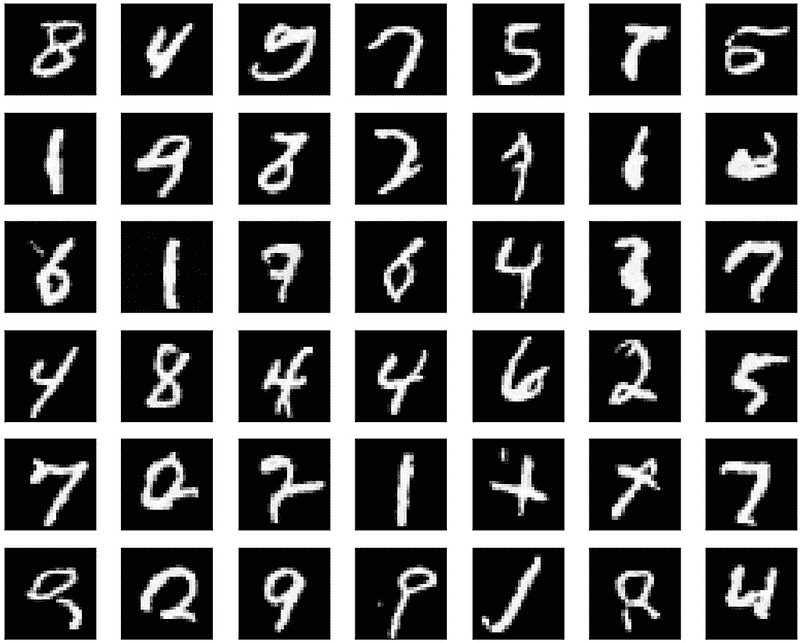

图 18. 在 MNIST 手写数字数据集上训练的扩散模型生成的图像[3]。

如果我们看一下上面的代码块，你可以看到第`#(1)`行的`[-1]`索引器表示我们只显示最后迭代（对应时间步长 0）的图像。这就是为什么你在图 18 中看到的图像都是无噪声的原因。我确实承认这可能不是最好的结果，因为并非所有生成的图像都是有效的数字。— 但是嘿，这反而表明这些图像不仅仅是原始数据集的重复。

在这里，我们也可以使用下面的代码块 27 可视化反向扩散过程。你可以在图 19 的结果输出中看到，我们最初从一个完全随机的噪声开始，随着我们向右移动，噪声逐渐消失。

```py
# Codeblock 27
fig, axes = plt.subplots(ncols=10, figsize=(24, 8))

sample_no = 0
timestep_no = 0

for i in range(10):
    axes[i].imshow(denoised_images[timestep_no][sample_no].squeeze().detach().cpu().numpy(), cmap='gray')
    axes[i].get_xaxis().set_visible(False)
    axes[i].get_yaxis().set_visible(False)
    timestep_no += 1

plt.show()
```

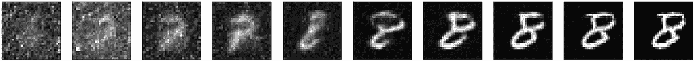

图 19. 图片在时间步长 900、800、700 等直至时间步长 0 时的样子[3]。

* * *

## 结束

从这里开始，你可以有很多方向。首先，如果你想要更好的结果，你可能需要调整代码块 2 中的参数配置。其次，你也可以通过在降采样和升采样阶段使用的卷积层堆叠之外实现注意力层来修改 U-Net 模型。这并不保证你能够获得更好的结果，尤其是对于像这样简单的数据集，但它绝对值得一试。第三，你也可以尝试使用更复杂的数据集来挑战自己。

当涉及到实际应用时，实际上你可以用扩散模型做很多事情。最简单的一个可能是用于数据增强。使用扩散模型，我们可以轻松地从特定的数据分布中生成新的图像。例如，假设我们正在做一个图像分类项目，但类中的图像数量不平衡。为了解决这个问题，我们可以从少数类中提取图像并输入到扩散模型中。通过这样做，我们可以要求训练好的扩散模型生成我们想要的该类样本数量。

好吧，这就是关于扩散模型理论和实现的大部分内容。感谢阅读，希望你在今天学到了一些新东西！

*您可以通过* [*此链接*](https://github.com/MuhammadArdiPutra/medium_articles/blob/main/The%20Art%20of%20Noise.ipynb)* 访问本项目使用的代码。这里也有我之前关于* [*自编码器*](https://becominghuman.ai/the-deep-autoencoder-in-action-digit-reconstruction-bf177ccbb8c0)*,* [*变分自编码器 (VAE)*](https://becominghuman.ai/using-variational-autoencoder-vae-to-generate-new-images-14328877e88d)*,* [*神经风格迁移 (NST)*](https://towardsdatascience.com/paper-walkthrough-neural-style-transfer-fc5c978cdaed)* 和 *[*Transformer*](https://towardsdatascience.com/paper-walkthrough-attention-is-all-you-need-80399cdc59e1)* 的文章链接。*

* * *

## 参考文献

[1] Jascha Sohl-Dickstein 等人. 利用非平衡热力学进行深度无监督学习. Arxiv. [`arxiv.org/pdf/1503.03585`](https://arxiv.org/pdf/1503.03585) [访问日期：2024 年 12 月 27 日].

[2] Jonathan Ho 等人. 去噪扩散概率模型. Arxiv. [`arxiv.org/pdf/2006.11239`](https://arxiv.org/pdf/2006.11239) [访问日期：2024 年 12 月 27 日].

[3] 由作者原创创建的图像。

[4] Olaf Ronneberger 等人. U-Net：用于生物医学的卷积网络。

图像分割. Arxiv. [`arxiv.org/pdf/1505.04597`](https://arxiv.org/pdf/1505.04597) [访问日期：2024 年 12 月 27 日].

[5] Yann LeCun 等人. 手写数字 MNIST 数据库. [`yann.lecun.com/exdb/mnist/`](https://yann.lecun.com/exdb/mnist/) [访问日期：2024 年 12 月 30 日] (Creative Commons Attribution-Share Alike 3.0 许可证).

[6] Ashish Vaswani 等人. 注意力即是所需。Arxiv. [`arxiv.org/pdf/1706.03762`](https://arxiv.org/pdf/1706.03762) [访问日期：2024 年 9 月 29 日].
