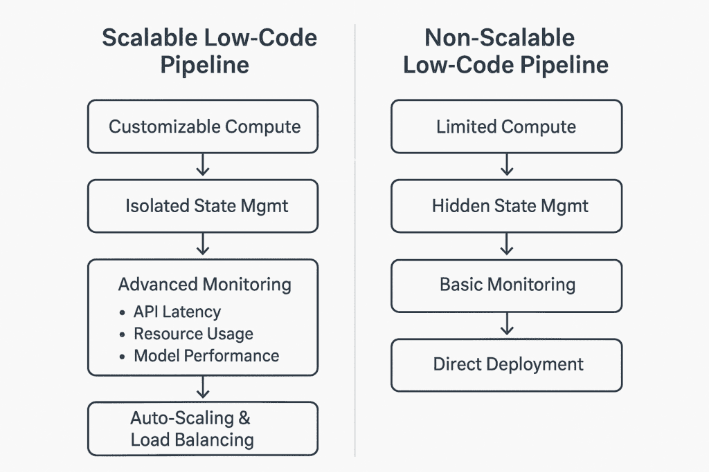
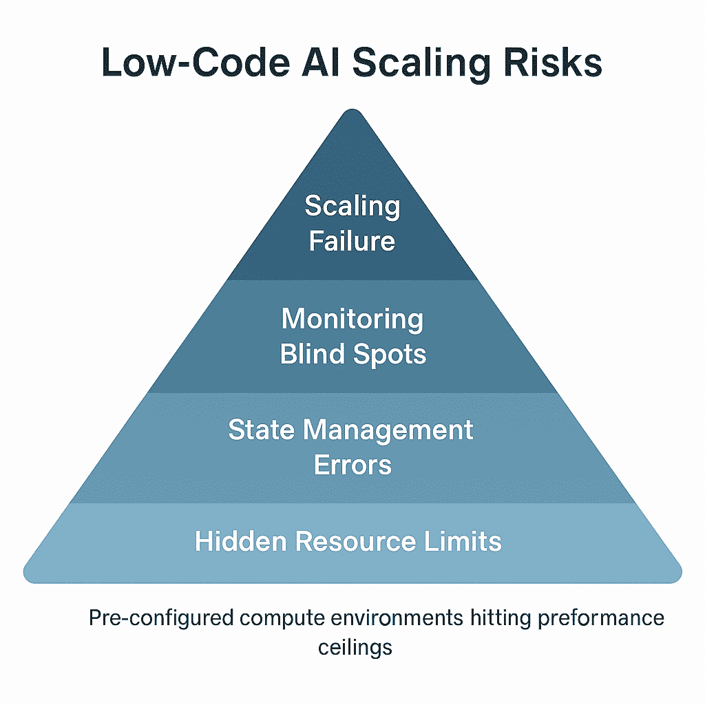

# 自动化陷阱：为什么低代码 AI 模型在规模化时失败

> 原文：[`towardsdatascience.com/the-automation-trap-why-low-code-ai-models-fail-when-you-scale/`](https://towardsdatascience.com/the-automation-trap-why-low-code-ai-models-fail-when-you-scale/)

在最初，构建机器学习模型是一项只有掌握 Python 知识的数据科学家才能掌握的技能。然而，低代码 AI 平台现在使事情变得容易得多。

现在，任何人都可以直接创建一个模型，将其链接到数据，并通过几次点击将其作为 Web 服务发布。营销人员现在可以开发客户细分模型，用户支持团队可以实施聊天机器人，产品经理可以自动化预测销售的过程，而无需编写代码。

即使如此，这种简单性也有其缺点。

## 规模化时的错误开始

当一家中型电子商务公司推出其首个机器学习模型时，它选择了最快的途径：一个低代码平台。数据团队使用微软 Azure ML Designer 迅速构建了一个产品推荐模型。无需编码或复杂的设置，模型仅用几天时间就上线并运行。

当模型部署时，表现良好，推荐相关产品并维持用户兴趣。然而，当有 10 万人使用该应用时，它遇到了问题。响应时间增加了三倍。推荐只显示两次，或者根本不显示。最终，系统崩溃。

问题不在于正在使用的模型。问题在于平台。

[Azure ML Designer](https://learn.microsoft.com/en-us/azure/machine-learning/concept-designer?view=azureml-api-2) 和 AWS SageMaker Canvas 都旨在快速运行。得益于它们易于使用的拖放工具，任何人都可以使用机器学习。然而，使它们易于使用的简单性也掩盖了它们的弱点。作为简单原型开始的工具，在投入高流量生产时失败，这主要是因为其结构。

## 简单性的错觉

低代码 AI 工具被推广给非技术专家。它们负责数据准备、特征创建、模型训练和使用等复杂部分。Azure ML Designer 使用户能够快速导入数据，构建模型管道，并将管道作为 Web 服务部署。

然而，拥有一个抽象的想法既有积极的一面，也有消极的一面。

### 资源管理：有限且不可见

大多数低代码平台在预设的计算环境中运行模型。用户可以访问的 CPU、GPU 和内存量不可调整。这些限制在大多数情况下都很好，但在流量激增时就会成为问题。

一个使用 AWS SageMaker Canvas 的教育技术平台创建了一个模型，可以在学生提交答案时对其进行分类。在测试期间，它表现得完美无缺。然而，当用户数量达到 50,000 时，模型的 API 端点失败了。发现模型正在运行在基本的计算实例上，唯一的解决方案是重建所有工作流程。

### 状态管理：隐藏但危险

由于低代码平台在会话之间保持模型状态，它们在测试时速度快，但在实际使用中可能存在风险。

在 Azure ML Designer 中创建了一个零售聊天机器人，以便在每次会话中维护用户数据。在测试期间，我感觉体验是为我量身定制的。然而，在生产环境中，用户开始收到本应发给其他人的消息。问题是什么？它存储了关于用户会话的信息，因此每个用户都会被视为前一个用户的延续。

### 有限的监控：大规模的盲目

低代码系统提供基本结果，如准确度、AUC 或 F1 分数，但这些是测试的度量标准，而不是运行系统的度量标准。只有在发生事件后，团队才会发现他们无法跟踪生产环境中最重要的信息。

一家物流初创公司使用 Azure ML Designer 实施了一个需求预测模型，以帮助优化路线。一切都很顺利，直到假日到来，请求增加。客户抱怨响应缓慢，但团队无法看到 API 响应时间或找到错误的原因。模型无法打开以查看其工作方式。

**可扩展与不可扩展的低代码管道（图片由作者提供）**

## 为什么低代码模型难以处理大型项目

低代码 AI 系统无法扩展，因为它们缺乏强大机器学习系统的关键组件。它们之所以受欢迎，是因为它们速度快，但这也带来了代价：失去了控制。

### 1. 资源限制成为瓶颈

低代码模型用于对计算资源有限的环境。随着时间的推移和更多人使用它们，系统会变慢甚至崩溃。如果模型必须处理大量流量，这些限制可能会引起重大问题。

### 2. 隐藏状态造成不可预测性

状态管理通常是低代码平台中不需要考虑的事情。变量的值不会从一个会话丢失到另一个会话。它适合测试，但一旦多个用户同时使用系统，就会变得混乱。

### 3. 差劲的可观察性阻碍调试

低代码平台提供基本信息（例如准确性和 F1 分数），但不支持监控生产环境。团队无法看到 API 延迟、资源使用情况或数据输入方式。无法检测到出现的问题。

**低代码 AI 可扩展性风险 - 层次化视角（作者图片**）

## 在制作低代码模型可扩展时需要考虑的因素列表

低代码并不意味着工作容易，尤其是如果您想扩展。在用低代码工具构建 ML 系统时，从一开始就记住可扩展性是至关重要的。

### 1. 在最初设计系统时考虑可扩展性。

+   您可以使用提供自动扩展的服务，例如 Azure ML 中的 Azure Kubernetes Service 和 AWS 中的 SageMaker Pipelines。

+   避免使用默认的计算环境。选择可以按需处理更多内存和 CPU 的实例。

### 2. 隔离状态管理

+   要使用基于会话的模型，如聊天机器人，确保在每次会话后清除用户数据。

+   确保 Web 服务独立处理每个请求，以免意外传递信息。

### 3. 观察生产数据和模型数据。

+   监控 API 的响应时间、失败的请求数量和应用程序使用的资源。

+   使用 PSI 和 KS-Score 来找出系统输入何时不是标准的。

+   专注于业务的结果，而不仅仅是技术数字（转化率和销售影响）。

### 4. 实施负载均衡和自动扩展

+   在负载均衡器（Azure Kubernetes 或 AWS ELB）的帮助下，将您的模型放置为托管端点。

+   您可以根据 CPU 负载、请求数量或延迟来设置自动扩展指南。

### 5. 持续版本和测试模型

+   确保每次更改模型时都为其分配一个新版本。在向公众发布新版本之前，应在预发布环境中进行检查。

+   进行 A/B 测试以检查模型的工作情况，同时不干扰用户。

## 当低代码模型运行良好时

+   低代码工具没有任何重大缺陷。它们在以下方面很强大：

+   快速原型设计意味着优先考虑速度而不是稳定的结果。

+   在系统内部进行的分析，其中失败的可能性最小。

+   简单的软件在学校很有价值，因为它可以加快学习过程。

一群医疗保健初创公司的人使用[AWS SageMaker Canvas](https://aws.amazon.com/sagemaker-ai/canvas/)构建了一个模型来捕捉医疗账单错误。该模型仅用于内部报告，因此不需要扩展，并且可以轻松使用。这是一个使用低代码的完美案例。

## 结论

低代码 AI 平台提供即时智能，因为它们不需要任何编码。然而，当业务增长时，其缺陷就会暴露出来。一些问题是资源不足、信息泄露和可见性有限。这些问题不能仅仅通过点击几下就能解决。它们是架构问题。

在开始低代码 AI 项目时，考虑它是否将被用作原型或可销售的产品。如果是后者，低代码应该是您的初始工具，而不是最终解决方案。
