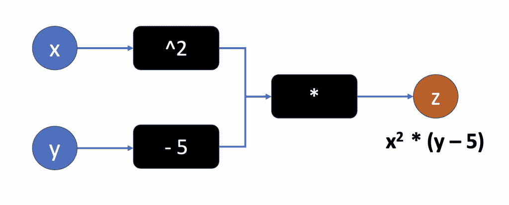
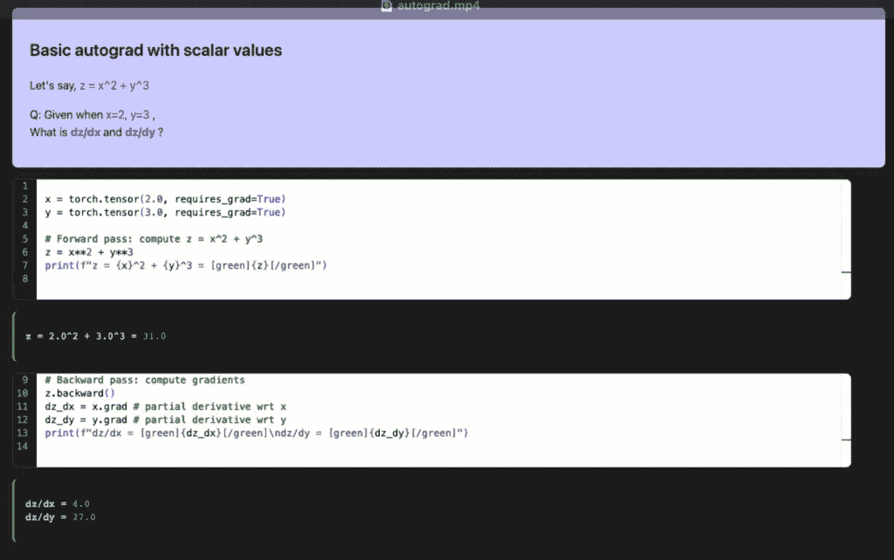
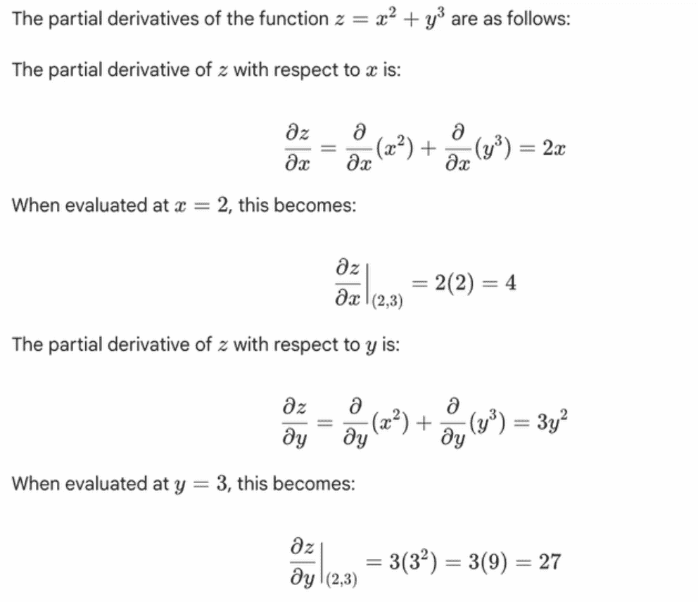
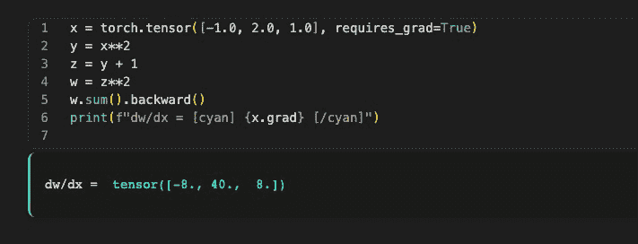
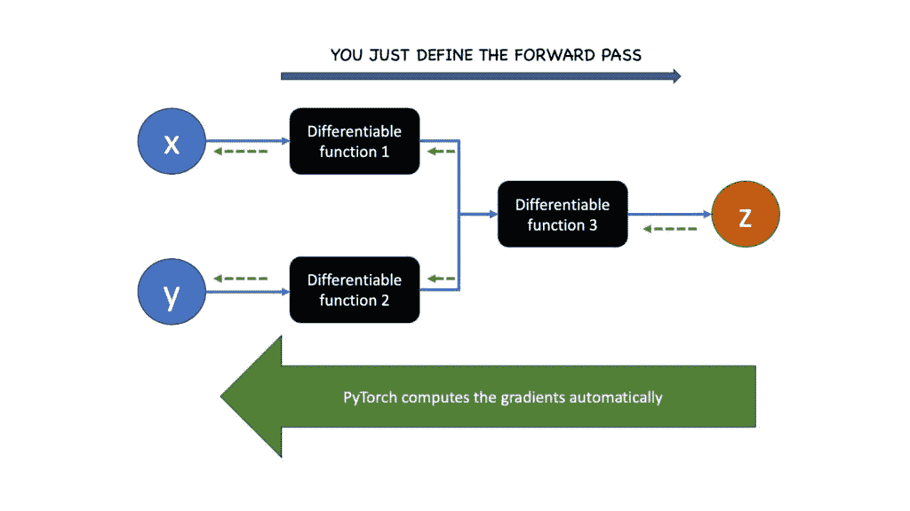
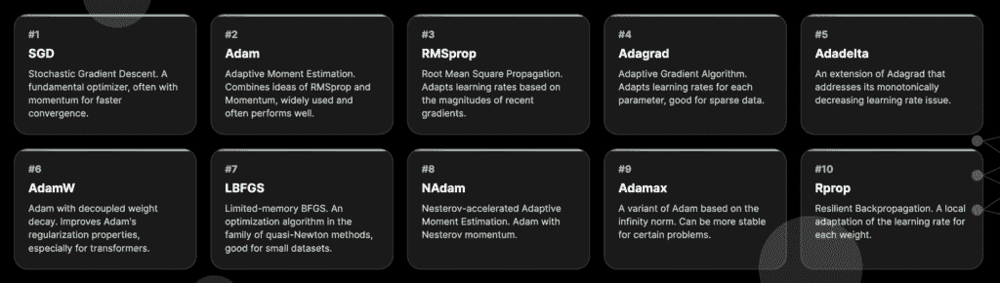
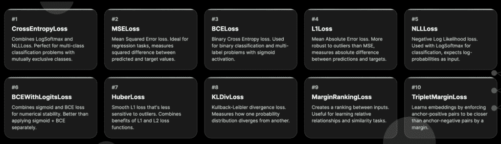
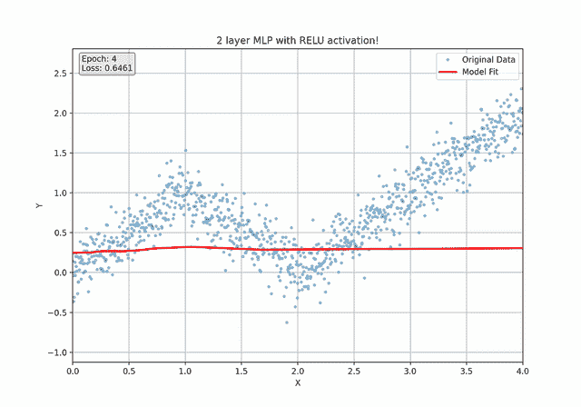
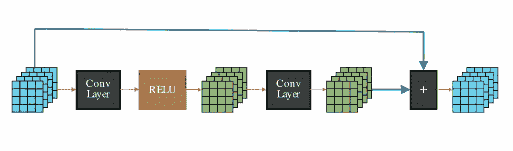

# PyTorch 解析：从自动微分到训练自定义神经网络

> 原文：[`towardsdatascience.com/the-basics-of-deep-learning-with-pytorch-in-1-hour/`](https://towardsdatascience.com/the-basics-of-deep-learning-with-pytorch-in-1-hour/)

<mdspan datatext="el1758673513409" class="mdspan-comment">深度学习</mdspan>正在塑造我们的世界。事实上，它自 2010 年代初以来一直在缓慢地改变软件。到 2025 年，PyTorch 处于这场革命的尖端，成为训练神经网络最重要的库之一。

无论你是从事计算机视觉、构建大型语言模型（LLMs）、训练强化学习代理，还是尝试图神经网络——一旦你进入深度学习之城，你的道路必将经过 PyTorch。

*本文中提供的所有图像均由作者制作*。

本指南将提供 PyTorch 的方法论和设计原则的快速浏览。在接下来的一个小时内，我们将穿越噪音，直接了解神经网络是如何实际训练的。

> 本文介绍了 PyTorch 的基础概念以及**如何**组合和训练模型——从简单的线性回归到现代的转换器块。
> 
> 与这里展示的具体代码示例相比，本文的目标是教授主要思想、项目级架构和与 PyTorch 一起工作的抽象。
> 
> **换句话说，如何以“PyTorch 的方式”思考**。

在我们达到那个程度之前，理解基础知识非常重要。PyTorch 建立在两个核心抽象之上：张量和自动微分。掌握这两个——张量如何存储数据，以及梯度如何用于训练神经网络——PyTorch 的其他部分就会显得很自然。让我们先来讨论张量。

## 1. 张量基础

张量是一个具有 dtype、设备以及可选梯度跟踪的多维数组。如果你了解 NumPy 数组，可以将张量视为具有一些主要优点的 NumPy 数组：

+   **GPU 利用率**：张量可以在 GPU 上执行大规模并行操作。矩阵乘法、加法，甚至条件语句都得到了支持。

+   **计算图**：不要将张量想象成一个孤立的数据块，而应该将其视为计算图上的一个节点。（如下所示）

+   **自动微分**：PyTorch 自动计算它执行的每个可微分操作的偏导数。我们很快就会讨论这实际上意味着什么，以及为什么这对训练神经网络来说是一个巨大的突破。



一个简单的计算图。PyTorch 不仅计算输出，还存储了数据流经哪些节点以生成输出的信息。（来源：作者）

## 2. 自动微分（Autograd）

PyTorch 中的神经网络构建一个动态计算图，并使用它来自动计算梯度。让我们通过一个简单的例子来学习这一点。

让我们从一个非常干净、标量的例子开始，这样形状和值就很容易理解。以下代码计算 `z = x² + y³` 对于标量 x 和 y，然后调用 backward 获取 `dz/dx` 和 `dz/dy`。

```py
x = torch.tensor(2.0, requires_grad=True)
y = torch.tensor(3.0, requires_grad=True)

# Forward pass: compute z = x² + y³
z = x**2 + y**3

# Backward pass: compute gradients
z.backward()
dz_dx = x.grad # partial derivative wrt x
dz_dy = y.grad # partial derivative wrt y
```

发生了什么：

+   我们创建了两个具有 `requires_grad=True` 的张量 `x` 和 `y`。这告诉 autograd 跟踪它们的操作。

+   前向计算为 z 构建了一个小图。

+   `z.backward()` 触发反向模式的自动微分：PyTorch 计算梯度并将它们放在 `x.grad` 和 `y.grad` 中。

以上代码块的结果将如下所示：



如果你做了一些心理计算，以下是在解析计算该方程的偏导数时的情况（剧透：它工作得很好！）：



解析解（来源：作者）

### 链式法则

微积分中的[链式法则](https://en.wikipedia.org/wiki/Chain_rule)是求复合函数导数的基本公式，复合函数本质上是在其他函数内部的函数。用简单的话说，你是从外向内工作的，对函数的每一“层”求导并将它们相乘。

让我们用一个简单的例子来看看 PyTorch 中链式法则是如何工作的。假设你有一个以下三个步骤的方程：

方程 1：`y = x²`

方程 2：`z = y + 1`

方程 3：`w = z²`

基本上，`w` 依赖于 `z`，`z` 依赖于 `y`，`y` 依赖于 `x`。*一个基本的组合链*。假设你想找到 `w` 对 `x` 的导数

微积分中的链式法则表明，为了找到 `dw/dx`，我们计算依赖链上的梯度并将它们相乘。所以：

`dw/dx = dw/dz * dz/dy * dy/dx`

让我们看看 PyTorch 是如何做到这一点的：

```py
# requires_grad=True tells PyTorch to compute the gradients for this tensor
x = torch.tensor(2.0, requires_grad=True)

# Define the forward pass
y = x**2 
z = y + 1
w = z**2

# Calculate the gradient
w.backward()

# print the gradient
print(x.grad) # 40
```

就这样！*它就是那么工作的*。

更特别的是，我们不仅可以像上面那样将 x 定义为一个标量，还可以将其定义为一个多维张量。

当我们将第一行从使用 `torch.tensor(2)` 初始化标量更改为使用 `torch.tensor([-1, 2])` 初始化 1D 张量时，会发生以下情况



注意当 x 是一个向量时，PyTorch 如何计算 x 的每个元素的梯度

这就是 PyTorch *如此* *酷* 的原因。你可以同时（或并行）计算多个元素的梯度，就像那样。

在处理深度学习项目时，我们的输入通常是多维的，所以 PyTorch 在后台通过并行化梯度计算做了很多繁重的工作！

### PyTorch 公式

如前一个例子所示，PyTorch 的策略非常简单。

1.  定义你方程的“前向传递”，即你的*依赖变量*是如何从你的*独立变量*推导出来的？

1.  PyTorch 自动计算反向传播（假设你的方程是可微分的）。



我们定义了计算图的正向函数。PyTorch 自动计算梯度。（来源：作者）

## 3. 训练模型

现在我们已经了解了自动微分的基本知识，让我们看看 PyTorch 中 [线性回归](https://en.wikipedia.org/wiki/Linear_regression) 的工作原理。下面的代码构建了一个包含两个特征（面积和年龄）的小型住宅风格数据集，将它们归一化到 [-1, 1] 的范围内，并为我们准备了一些传统的线性回归。

```py
df = pd.DataFrame(
    {
        "area": [120, 180, 150, 210, 105],
        "age": [5, 2, 1, 2, 1],
        "price": [30, 90, 100, 180, 85]
    }
)
df = normalize(df)
```

要使用 PyTorch 做任何事情，我们首先必须将数据转换成张量！注意数据张量 X 和 Y 不需要梯度，因为它们是常数（即，在训练过程中它们不会改变）。

虽然 `W` 和 `B` 是可训练的，但。我们将更新它们以 *拟合* 我们的数据集。为了通过反向传播使其可训练，我们需要将这些声明的 `requires_grad` 设置为 `True`。

看看下面的代码：

```py
# Note that these are constants, we are not going to update them
X = torch.tensor(df[["area", "age"]].values, dtype=torch.float32)
Y = torch.tensor(df[["price"]].values, dtype=torch.float32)

# These "require_grad" So they are trainable weights.
W = torch.rand(size=(2, 1), requires_grad=True)
B = torch.rand(1, requires_grad=True)
```

接下来，让我们生成一个预测！正向传播使用惯用的矩阵乘法和加法，即 `X @ W + B`。

```py
# Generate a prediction
pred = X @ W + B
```

`@` 操作符基本上是在 X 和 W 之间执行矩阵乘法。`X @ W + B` 模型对 X 执行 “[线性变换](https://en.wikipedia.org/wiki/Linear_map)”。我们的目标是调整可训练权重 W 和 B，使得预测更接近我们的目标真实值。

接下来，我们计算误差作为均方误差损失。它计算我们当前预测和真实值之间的距离。如果我们调用 `loss.backward()`，我们还将得到图中可训练变量的梯度（即，W 和 B）。

```py
loss.backward()
dW = W.grad # Tells us "how much W must change to reduce the loss"
dB = B.grad # and "how much B must change to reduce the loss" 
```

`dW` 和 `dB` 是 W 和 B 对损失函数的梯度。我们可以应用 “[梯度下降](https://en.wikipedia.org/wiki/Gradient_descent)” 来推动这些可训练参数沿着梯度指示的方向移动。

```py
lr = 0.2 # Learning rate: tells us how much we should update the weights
with torch.no_grad():
    W = W - lr * dW # Updating W with Gradient descent
    B = B - lr * dB # Updating B with Gradient descent 
```

理解线性回归、损失计算和梯度下降是机器学习的一些支柱，进而扩展到深度学习。虽然通过减去梯度手动更新权重是可能的，但在实际中对于具有多层权重的深度神经网络来说是不切实际的。如果只有一种方法可以自动更新权重而不用担心跟踪，那该多好！

**旁注**

上述在优化空间中采取小步迭代学习权重的技术称为梯度下降。*注意，对于小数据集，有更好的方法来学习最优的 W 和 B。例如，**正规方程**，它给出了一个不需要任何步骤或迭代的解析解。然而，对于大数据集，它计算上非常昂贵。对于大型矩阵，标准方法是将数据分成小批量，并单独应用梯度下降。这种技术被称为[随机梯度下降](https://en.wikipedia.org/wiki/Stochastic_gradient_descent) (SGD)。*

### 优化器

PyTorch 优化器是一类算法（如 SGD、Adam 或 RMSprop），它们根据计算出的梯度调整模型的权重和偏差，以最小化损失函数。

让我们来看看，如果我们用 PyTorch 优化器替换了手动权重更新，上述线性回归代码会是什么样子。

```py
from torch.optim import SGD
... 

W = torch.rand(size=(2, 1), requires_grad=True)
B = torch.rand(1, requires_grad=True)
optimizer = SGD(params = [W, B], lr=0.1)
for step in range(10):
    pred = X @ W + B # Forward pass
    loss = ((Y - pred) ** 2).mean() # Calculate loss
    loss.backward() # Calculate gradients
    optimizer.step() # Update W and B according to gradients
    optimizer.zero_grad() # Reset all gradients
```

PyTorch 中训练模型的核心循环看起来像这样：

+   正向传播以计算`pred`。

+   通过计算预测值（pred）和真实值（Y）之间的误差来计算`loss`。

+   使用`loss.backward()`进行反向传播，以填充`W.grad`和`B.grad`。

+   使用`optimizer.step()`进行步骤，以更新参数。

+   使用`optimizer.zero_grad()`将梯度设置为 0，以避免累积。

SGD 是线性回归的一个很好的基线。随着规模的扩大或面对更嘈杂的梯度，自适应优化器可以帮助。这就是 PyTorch 的开源优化器套件发挥作用的地方。这包括使用动量和每个参数的学习率等技术来实现对这些具有挑战性的任务更快和更稳定的收敛的自适应优化器。以下是一张比较各种流行优化器的闪卡：



一些常见的 PyTorch 优化器！（来源：作者）

不仅限于优化器，因为 Torch 还提供了一系列不同的损失函数！以下是一些示例：



一些常见的 PyTorch 损失函数（来源：作者）

## 4. 层和模块

就像我们不需要编写自己的优化器一样，我们也不需要自己声明原始张量和矩阵乘法逻辑（在大多数情况下）。Pytorch 模块已经为我们解决了这个问题。

PyTorch 模块是 PyTorch 中所有神经网络的根本构建块，它充当层、可学习参数和数据流逻辑的容器。例如，我们之前编写的那个线性层，我们手动声明了权重和偏差，我们可以使用以下这些代码行：

```py
linear_model = nn.Linear(in_size, out_size) # Torch takes care of initializing weights
prediction = linear_model(input) # Forward pass
```

我们学习了如何构建线性模型（太好了！），但我们真正需要学习的是如何训练更大、更深的神经网络。最简单的神经网络类型是**[多层感知器](https://en.wikipedia.org/wiki/Multilayer_perceptron)** (MLP)。MLP 实际上是由多个线性层组成，层间有非线性函数。

在 Torch 中创建 MLPs（多层感知器）相当直接。`nn.Sequential`是一个常见的 PyTorch 模块，用于**顺序地**将输入通过多个层传递。以下是代码示例：

```py
# A 2 layer MLP
mlp_2_layers = nn.Sequential(
    nn.Linear(in_size, hidden_units),
    nn.ReLU(),
    nn.Linear(hidden_units, out_size)
)

# A 3 layer MLP
mlp_3_layers = nn.Sequential(
    nn.Linear(in_size, hidden_units),
    nn.ReLU(),
    nn.Linear(hidden_units, hidden_units),
    nn.ReLU(),
    nn.Linear(hidden_units, out_size)
) 
```

多层感知器可以学习组合和非线性函数！以下是一个锯齿函数的示例，以及一个 2 层 MLP 如何使用 ReLU 学习它。



在分段线性函数上训练的 2 层 MLP（多层感知器）（来源：作者）

## 5. 编写自定义网络

Torch 拥有众多令人惊叹的层和模块，这些模块启发了整个研究论文。你可以把它们看作是乐高积木，可以组合成任何神经网络。

想要一个用于图像的卷积网络层？使用`nn.Conv2d`。

一个用于处理序列标记的 GRU 层？使用`nn.GRU`

但在研究中最常见的情况是，你希望从头开始编写自定义神经网络架构。这个过程的做法如下：

1.  从`nn.Module`派生

1.  在`__init__`构造函数中，初始化所有层和权重

1.  定义一个`forward()`函数，在其中编写前向传递的逻辑

这里有一个示例，我们实现了经典的[ResNet](https://arxiv.org/abs/1512.03385)架构：

```py
class ResNetBlock(nn.Module):
    def __init__(self, in_channels, out_channels, stride=1, downsample=None):
        super(ResNetBlock, self).__init__()

        self.conv1 = nn.Conv2d(
            in_channels,
            out_channels,
            kernel_size=3,
            stride=stride,
            padding=1,
            bias=False,
        )
        self.bn1 = nn.BatchNorm2d(out_channels)
        self.conv2 = nn.Conv2d(
            out_channels, out_channels, kernel_size=3, stride=1, padding=1, bias=False
        )
        self.bn2 = nn.BatchNorm2d(out_channels)

        self.downsample = downsample

    def forward(self, x):
        residual = x

        out = F.relu(self.bn1(self.conv1(x)))
        out = self.bn2(self.conv2(out))

        if self.downsample:
            residual = self.downsample(x)

        out += residual
        out = F.relu(out)

        return out 
```

就这样！你只需初始化你的层并定义前向传递计算图，Torch 将自动进行反向传递。



标准的 ResNet 块通过一个短的神经网络层堆栈（如卷积）传递嵌入，然后将原始嵌入添加到最终输出中

当然，你可以将你的自定义层和模块作为更大网络的一部分使用！例如，这里有一个编写单个 Transformer 块的示例。

```py
class AttentionLayer(nn.Module):
    def __init__(self, input_dim, attention_dim=64):
        super(SimpleAttention, self).__init__()

        # Linear layers for attention computation
        self.query = nn.Linear(input_dim, attention_dim)
        self.key = nn.Linear(input_dim, attention_dim)
        self.value = nn.Linear(input_dim, attention_dim)

        # Scaling factor
        self.scale = torch.sqrt(torch.FloatTensor([attention_dim]))

    def forward(self, x):
        # x shape: (batch_size, sequence_length, input_dim)
        batch_size, seq_len, input_dim = x.size()

        # Compute Q, K, V
        Q = self.query(x)  # (batch_size, seq_len, attention_dim)
        K = self.key(x)  # (batch_size, seq_len, attention_dim)
        V = self.value(x)  # (batch_size, seq_len, attention_dim)

        attention_scores = torch.matmul(Q, K.transpose(-2, -1)) / self.scale # Scaled dot-product attention
        attention_weights = F.softmax(attention_scores, dim=-1) # Convert attention weights to probabilities 
        attended_output = torch.matmul(attention_weights, V) # Apply attention to values

        return attended_output, attention_weights

class TransformerBlock(nn.Module):
    """
    A single transformer block composed of self-attention and a feed-forward network.
    """
    def __init__(self, embed_dim, ffn_hidden_dim):
        """
        Args:
            embed_dim (int): The dimensionality of the model's embeddings.
            ffn_hidden_dim (int): The dimensionality of the hidden layer in the FFN.
        """
        super(TransformerBlock, self).__init__()
        self.attention = SimpleAttention(embed_dim, embed_dim)
        self.norm1 = nn.LayerNorm(embed_dim)
        self.norm2 = nn.LayerNorm(embed_dim)

        self.ffn = nn.Sequential(
            nn.Linear(embed_dim, ffn_hidden_dim),
            nn.ReLU(),
            nn.Linear(ffn_hidden_dim, embed_dim)
        )

    def forward(self, x):
        """
        Forward pass for the transformer block.

        Args:
            x (torch.Tensor): Input tensor of shape (batch_size, sequence_length, embed_dim).

        Returns:
            torch.Tensor: The output tensor of the transformer block.
        """
        # Self-attention part
        attended, _ = self.attention(x)
        # Add & Norm (residual connection)
        x = self.norm1(attended + x)

        # Feed-forward part
        ffn_out = self.ffn(x)
        # Add & Norm (residual connection)
        x = self.norm2(ffn_out + x)

        return x

class TransformerEncoder(nn.Module):
    """
    A transformer encoder that stacks multiple TransformerBlocks.
    """
    def __init__(self, num_layers, embed_dim, ffn_hidden_dim, seq_len, output_dim):
        """
        Args:
            num_layers (int): The number of transformer blocks to stack.
            embed_dim (int): The dimensionality of the model's embeddings.
            ffn_hidden_dim (int): The dimensionality of the hidden layer in the FFN.
            seq_len (int): The length of the input sequences.
            output_dim (int): The dimensionality of the final output (e.g., number of classes).
        """
        super(TransformerEncoder, self).__init__()

        # Create a list of transformer blocks
        self.layers = nn.ModuleList(
            [TransformerBlock(embed_dim, ffn_hidden_dim) for _ in range(num_layers)]
        )

        # Final classification head
        self.classifier = nn.Linear(embed_dim * seq_len, output_dim)

    def forward(self, x):
        """
        Forward pass for the full transformer encoder.

        Args:
            x (torch.Tensor): Input tensor of shape (batch_size, sequence_length, embed_dim).

        Returns:
            torch.Tensor: The final output logits from the classifier.
        """
        # Pass input through all transformer blocks
        for layer in self.layers:
            x = layer(x)

        # Flatten the output for the classifier
        x = x.view(x.size(0), -1)

        # Final classification
        output = self.classifier(x)
        return output
```

注意第一个模块`AttentionLayer`是如何计算[缩放点积注意力](https://arxiv.org/abs/1706.03762)的。`TransformerBlock`在其之上应用层归一化和前馈网络。最后，`TransformerEncoder`模块按顺序应用多个 Transformer 块！就这样，我们得到了一个[BERT 模型](https://arxiv.org/abs/1810.04805)，它结合了多个双向注意力层的堆栈，以及各种优化，如层归一化和残差连接。

> **如果你是初学者并且这部分让你感到不知所措，这是非常正常的！** PyTorch 的酷之处在于，你可以根据自己的技能水平选择想要工作的复杂度级别。
> 
> 当你刚开始时，你可能只想使用 PyTorch 提供的数百个现成的模块。你将逐渐发现需要扩展并自定义它们以适应自己的用例。随着你独立编写一些自定义模块，你的信心和熟练度将不断提高。
> 
> 本节的目标是向您展示通过组合模块可以实现的强大功能和无限定制。记住：您编写前向传递，只要整个图是可微分的，Torch 总是能够为您执行自动微分！

## 下一步

本文涵盖的功能和概念都是精心挑选的，旨在为您提供一个快速浏览 Torch 最重要功能的机会。我有一个 YouTube 视频解释了所有这些概念，以及一些额外的概念，如模型部署、数据加载器、分布和训练方法。

这篇文章就到这里！以下是一些您可以了解更多关于我的工作的链接。感谢阅读！

**在 Patreon 上支持我：** [`www.patreon.com/NeuralBreakdownwithAVB`](https://www.patreon.com/NeuralBreakdownwithAVB)

**我的 YouTube 频道：**

[`www.youtube.com/@avb_fj`](https://www.youtube.com/@avb_fj)

**在 Twitter 上关注我：**

[`x.com/neural_avb`](https://x.com/neural_avb)

**阅读我的文章：**

[`towardsdatascience.com/author/neural-avb/`](https://towardsdatascience.com/author/neural-avb/)
