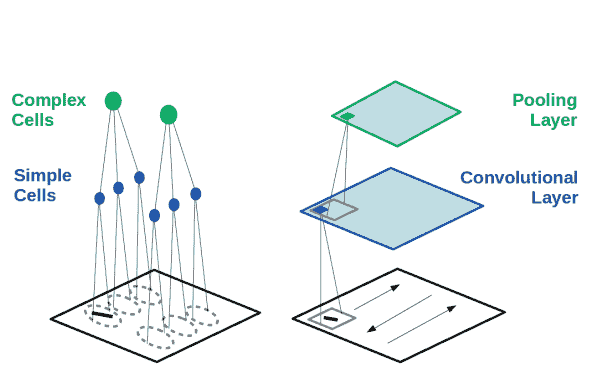
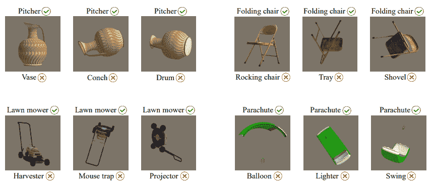
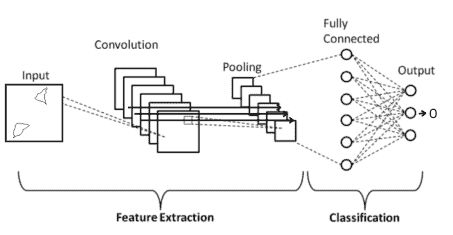
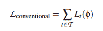
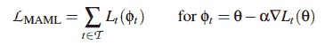
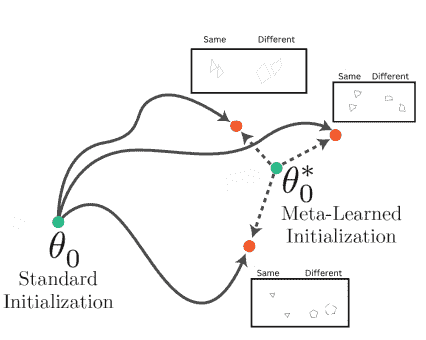
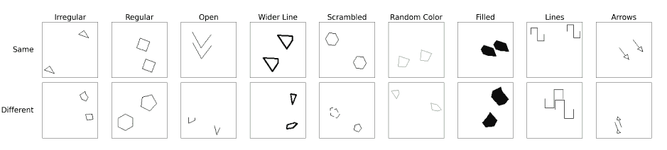
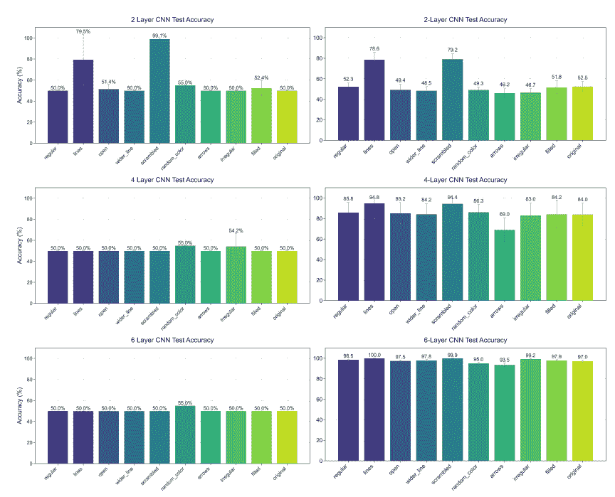
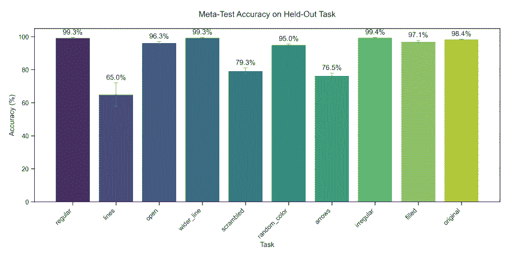

# 认知复杂性的基础：教 CNN 看到联系

> 原文：[`towardsdatascience.com/the-basis-of-cognitive-complexity-teaching-cnns-to-see-connections/`](https://towardsdatascience.com/the-basis-of-cognitive-complexity-teaching-cnns-to-see-connections/)
> 
> 解放教育在于认知行为，而不是信息传递。
> 
> 保罗·弗莱雷

<mdspan datatext="el1744350129634" class="mdspan-comment">围绕人工智能最热烈的讨论之一是：它能够捕捉人类学习的哪些方面？</mdspan>

许多作者认为，人工智能模型不具备与人类相同的技能，尤其是在可塑性、灵活性和适应性方面。

模型没有捕捉到的方面之一是关于外部世界的几个因果关系。

本文讨论了以下问题：

+   卷积神经网络（CNNs）与人类视觉皮层的并行性

+   CNN 在理解因果关系和学习抽象概念方面的局限性

+   如何让 CNN 学习简单的因果关系

## 它是相同的吗？它是不同的吗？

[卷积网络（CNNs）](https://en.wikipedia.org/wiki/Convolutional_neural_network) [2]是多层神经网络，以图像为输入，可用于多个任务。CNN 最迷人的方面之一是它们从[人类视觉皮层](https://en.wikipedia.org/wiki/Visual_cortex) [1]中汲取灵感：

+   **分层处理**。视觉皮层以分层的方式处理图像，早期视觉区域捕获简单的特征（如边缘、线条和颜色），而更深层的区域捕获更复杂的特征，如形状、物体和场景。由于 CNN 的分层结构，早期层捕获边缘和纹理，而更深层捕获部分或整个物体。

+   **[感受野](https://en.wikipedia.org/wiki/Receptive_field)**。视觉皮层的神经元对视觉场中特定局部区域的刺激做出反应（通常称为感受野）。随着我们深入，神经元的感受野变宽，允许整合更多的空间信息。多亏了池化步骤，CNN 中也是如此。

+   **特征共享**。尽管生物神经元并不相同，但相似的特征可以在视觉场的不同部分被识别。在 CNN 中，各种[滤波器](https://www.sciencedirect.com/topics/computer-science/convolutional-filter)扫描整个图像，使得无论位置如何都能识别模式。

+   **[空间不变性](https://aiplanet.com/learn/getting-started-with-deep-learning/convolutional-neural-networks/267/cnn-transfer-learning-data-augmentation)**。人类即使在物体移动、缩放或旋转的情况下也能识别物体。CNN 也具有这种特性。

视觉系统组件与卷积神经网络（CNN）之间的关系。图片来源：[此处](https://arxiv.org/pdf/2001.07092)

**以下特征使得 CNN 在视觉任务中的表现达到了超人类水平：**

> Russakovsky 等人[22]最近报告称，人类在 ImageNet 数据集上的表现导致 5.1%的最高 5 个错误。这个数字是由一个经过良好训练的人类注释员实现的，他对验证图像非常熟悉，以便更好地了解相关类别的存在。[……]我们的结果（4.94%）超过了报道的人类水平表现。[来源[3]]

尽管 CNN 在多个任务上表现优于人类，但仍有一些情况下它们会表现得非常糟糕。例如，在 2024 年的一项研究中[4]，AI 模型未能推广图像分类。最先进的模型在直立姿势的对象上表现优于人类，但在物体处于不寻常姿势时则失败。

正确的标签位于物体的顶部，而 AI 错误预测的标签位于下方。图片来源：[此处](https://arxiv.org/pdf/2402.03973v3)

> 总之，我们的结果表明：（1）人类在识别不寻常姿势的物体方面仍然比大多数网络更稳健，（2）时间对于这种能力的发展至关重要，（3）即使是时间有限的普通人也与深度神经网络不同。[来源[4]]

在研究[4]中，他们指出人类需要时间才能在任务中取得成功。一些任务不仅需要视觉识别，还需要[抽象认知](https://shs.hal.science/halshs-03655612/document)，这需要时间。

使人类能够泛化的能力来自于理解支配物体之间关系的规律。人类通过推断规则并将这些规则串联起来以适应新情况来识别物体。其中最简单的规则之一是“同一性/差异性关系”：定义两个物体是否相同或不同的能力。这种能力在婴儿期迅速发展，并且也与语言发展[5-7]密切相关。此外，一些动物如鸭子和黑猩猩也具有这种能力[8]。相比之下，对于[神经网络](https://github.com/SalvatoreRa/tutorial/blob/main/artificial%20intelligence/FAQ.md#large-language-models:~:text=is%20knowledge%20distillation%3F-,Neural%20networks,-What%20is%20an) [9-10]来说，学习同一性/差异性关系非常困难。

CNN 的同一性/差异性任务示例。网络应返回标签 1，如果两个物体相同，或者返回标签 0，如果它们不同。图片来源：[此处](https://arxiv.org/pdf/2503.23212)

卷积网络在学习这种关系上表现出困难。同样，它们也未能学习对人类来说简单其他类型的因果关系。因此，许多研究人员得出结论，[CNNs](https://github.com/SalvatoreRa/tutorial/blob/main/artificial%20intelligence/FAQ.md#large-language-models:~:text=What%20is%20a%20Convolutional%20Neural%20Network%20(CNN)%3F) 缺乏学习这些关系的必要归纳偏差。

这些负面结果并不意味着神经网络完全不能学习相同与不同的关系。更大的、训练时间更长的模型可以学习这种关系。例如，在[ImageNet](https://www.image-net.org/)上使用[对比学习](https://encord.com/blog/guide-to-contrastive-learning/)预训练的[vision-transformer](https://en.wikipedia.org/wiki/Vision_transformer)模型可以展示这种能力 [12]。

## CNNs 能否学习相同与不同的关系？

广泛的模型能够学习这类关系的事实重新点燃了对 CNNs 的兴趣。相同与不同的关系被认为是构成[高级认知](https://en.wikipedia.org/wiki/Higher-order_thinking)和[推理](https://en.wikipedia.org/wiki/Reason)基础的基本逻辑运算之一。证明浅层 CNNs 可以学习这个概念将使我们能够尝试其他关系。此外，它将允许模型学习越来越复杂的[因果关系](https://en.wikipedia.org/wiki/Causal_reasoning)。这是提高人工智能泛化能力的重要一步。

前期研究表明，卷积神经网络（CNNs）没有架构上的[归纳偏差](https://en.wikipedia.org/wiki/Inductive_bias)来学习抽象的视觉关系。其他作者认为问题在于训练范式。通常，经典的[梯度下降](https://en.wikipedia.org/wiki/Gradient_descent)用于学习单个任务或一系列任务。给定一个任务 t 或一系列任务 T，使用损失函数 L 来优化应该最小化函数 L 的权重 φ：

图片来源[此处](https://arxiv.org/pdf/2503.23212)

这可以看作是不同任务损失的总和（如果我们有多个任务）。相反，[模型无关元学习（MAML）](https://interactive-maml.github.io/maml.html)算法 [13] 被设计为在权重空间中搜索一组相关任务的最佳点。MAML 寻找一组初始权重 θ，以最小化任务间的[损失函数](https://www.ibm.com/think/topics/loss-function)，从而促进快速适应：

图片来源[此处](https://arxiv.org/pdf/2503.23212)

差别可能看起来很小，但从概念上讲，这种方法是针对抽象和[泛化](https://en.wikipedia.org/wiki/Generalization)的。如果有多个任务，传统训练试图为不同的任务优化权重。MAML 试图识别一组对不同的任务都是最优的，同时在权重空间中距离相等。这个起点θ允许模型在不同任务之间更有效地泛化。

元学习用于泛化的初始权重。图片来源[这里](https://arxiv.org/pdf/2503.23212)

由于我们现在有一种偏向于泛化和抽象的方法，我们可以测试我们是否可以使 CNN 学习相同-不同关系。

在这项研究[11]中，他们比较了在为这份报告设计的用于测试相同-不同关系的数据集上，使用经典梯度下降和[元学习](https://en.wikipedia.org/wiki/Meta-learning_(computer_science))训练的浅层 CNN。该数据集由 10 个不同的任务组成，用于测试相同-不同关系。

同-不同数据集。图片来源[这里](https://arxiv.org/pdf/2503.23212)

作者[11]比较了以传统方式或使用元学习训练的 2 层、4 层或 6 层的 CNN，并展示了几个有趣的结果：

1.  传统 CNN 的性能显示出与随机猜测相似的行为。

1.  元学习显著提高了性能，表明模型可以学习相同-不同关系。一个两层的卷积神经网络（CNN）的表现略好于随机猜测，但通过增加网络的深度，性能提高至接近完美的准确度。

传统训练与用于 CNN 的元学习之间的比较。图片来源[这里](https://arxiv.org/pdf/2503.23212)

[11]中最引人入胜的结果之一是模型可以通过留一法（使用 9 个任务并留出一个）进行训练，并显示出分布外泛化能力。因此，模型已经学会了在如此小的模型（6 层）中几乎看不到的抽象行为。

同-不同分类的分布外。图片来源[这里](https://arxiv.org/pdf/2503.23212)

## 结论

尽管卷积网络受到人类大脑处理视觉刺激方式的启发，但它们并没有捕捉到其一些基本能力。这尤其体现在因果关系或抽象概念方面。这些关系只能通过大量训练的大型模型来学习。这导致了这样的假设：由于架构归纳偏好的缺乏，小型 CNN 无法学习这些关系。近年来，人们努力创造新的架构，这些架构在学习关系推理方面可能具有优势。然而，这些架构中的大多数都未能学习这些类型的关系。有趣的是，这可以通过元学习来克服。

元学习的优势在于激励更抽象的学习。元学习推动向泛化发展，试图同时优化所有任务。为此，学习更抽象的特征是有利的（如特定形状的角度等低级特征对泛化没有帮助，因此不受欢迎）。元学习允许浅层 CNN 学习那些通常需要更多参数和训练的抽象行为。

浅层 CNN 和同一性/差异性关系是高级认知功能的模型。元学习和不同形式的训练可能有助于提高模型的推理能力。

## 另一件事！

您可以在**[Medium](https://salvatore-raieli.medium.com/)**上查找我的其他文章，您也可以在*[***LinkedIn***](https://www.linkedin.com/in/salvatore-raieli/)*或**[Bluesky](https://bsky.app/profile/salvatoreraieli.bsky.social)**上与我联系。查看*[***这个仓库***](https://github.com/SalvatoreRa/ML-news-of-the-week)，其中包含每周更新的 ML & AI 新闻，或[**这里**](https://github.com/SalvatoreRa/tutorial/blob/main/README.md#Artificial-intelligence's-bases)获取其他教程，或[**这里**](https://github.com/SalvatoreRa/artificial-intelligence-articles)获取 AI 评论。***我开放合作和项目，***您可以在 LinkedIn 上联系我。

### 参考文献

这里是撰写本文时参考的主要参考文献列表，仅列出了文章的第一作者。

1.  Lindsay, 2020, 卷积神经网络作为视觉系统模型的过去、现在和未来，[链接](https://arxiv.org/pdf/2001.07092)

1.  Li, 2020, 卷积神经网络综述：分析、应用和前景，[链接](https://arxiv.org/abs/2004.02806)

1.  He, 2015, 深入研究 ReLU：在 ImageNet 分类上超越人类水平的表现，[链接](https://arxiv.org/abs/1502.01852)

1.  Ollikka, 2024, 人类与 AI 在识别不寻常姿势的物体之间的比较，[链接](https://arxiv.org/abs/2402.03973v3)

1.  Premark, 1981, 人类与动物的代码，[链接](https://www.cambridge.org/core/journals/behavioral-and-brain-sciences/article/abs/codes-of-man-and-beasts/7DF6F2D22838F7546AF7279679F3571D)

1.  Blote, 1999, 年幼儿童在同异任务中的组织策略：微观遗传研究和培训研究，[链接](https://pubmed.ncbi.nlm.nih.gov/10433789/)

1.  Lupker, 2015, 同异任务中是否存在基于语音的启动效应？来自日英双语者的证据，[链接](https://www.uv.es/mperea/Phonologicat_priming_SD_task.pdf)

1.  Gentner, 2021, 学习**相同**和**不同**的关系：跨物种比较，[链接](https://www.sciencedirect.com/science/article/abs/pii/S2352154620301728)

1.  Kim, 2018, 不那么聪明的：学习同异关系使前馈神经网络紧张，[链接](https://royalsocietypublishing.org/doi/10.1098/rsfs.2018.0011)

1.  Puebla, 2021, 深度卷积神经网络能否在同异任务中支持关系推理？[链接](https://www.biorxiv.org/content/10.1101/2021.09.03.458919v1)

1.  Gupta, 2025, 卷积神经网络能够（元）学习同异关系，[链接](https://arxiv.org/abs/2503.23212)

1.  Tartaglini, 2023, 深度神经网络能够学习可泛化的同异视觉关系，[链接](https://arxiv.org/abs/2310.09612)

1.  Finn, 2017, 针对深度网络快速适应的无模型元学习，[链接](https://arxiv.org/abs/1703.03400)
