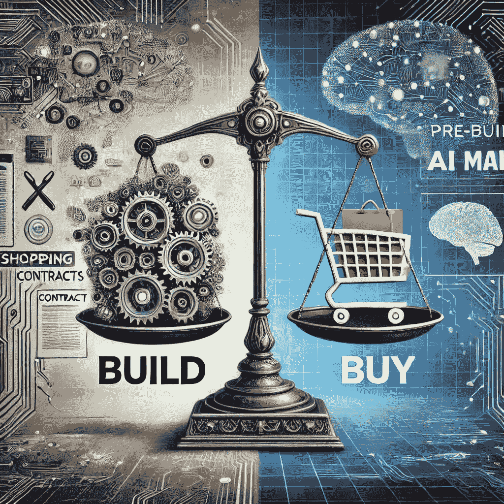

# GenAI 应用的构建与购买困境

> 原文：[`towardsdatascience.com/the-build-vs-buy-dilemma-for-genai-applications-a6828f99c922/`](https://towardsdatascience.com/the-build-vs-buy-dilemma-for-genai-applications-a6828f99c922/)

生成式 AI 已经对世界产生了变革性影响，而且它才刚刚开始。它已经在多个行业中迅速被采用，从零售到医疗保健和银行，提供了从信息检索、专家帮助到新内容创建的多种能力。随着大多数董事会对于 GenAI 兴趣的增长，CTO/CIO 现在面临一个大问题：*你应该在公司内部构建自己的 GenAI 应用，还是购买现成的解决方案？*

本文提供了一个框架，帮助产品经理、商业领袖和技术领袖导航这个决策。请注意，许多这些基本论点对所有构建与购买的决定都适用，但我们提出了一些独特于当前 GenAI 领域现状的细微差别。

来源：由 AI 辅助生成

## **决策的核心**

构建与购买（以及修改，我将修改视为购买的一部分）的决定取决于多个因素。使得这个决定更加困难的是，AI 领域正在快速发展，每周都有新的模型和产品推出。今天市场上可能存在的空白，可能在接下来的几周内就会有一个新产品出现。

影响这个决策的关键因素是：

1.  市场可用性（现在和近期）以及企业对市场速度的需求

1.  应用对企业的战略重要性

1.  商业回报率

1.  风险和合规因素

1.  维护和演进能力

1.  集成复杂性

来源：由 AI 辅助生成

在核心上，我个人的建议是将构建与购买的问题重新定义为*为什么你需要构建？* 有数百个令人惊叹的组织正在将数十亿美元投入到 GenAI 应用的开发中，所以除非你是其中之一，否则你真的应该尝试了解市场上有什么不适合你需求的东西。

## **构建 GenAI 应用的论点**

1.  **独特的业务需求**：如果你的需求非常独特，以至于市场上的现成应用无法满足你的需求，并且你认为在近期到中期内市场上也不会出现这样的应用。鉴于通用人工智能发展节奏的快速，我亲眼见过一些组织开始构建一个功能，结果几个月后它就在市场上作为商品出现。一个例子是评估，2024 年许多关键玩家都推出了很多评估产品，包括[AWS](https://aws.amazon.com/bedrock/evaluations/)和[Azure](https://learn.microsoft.com/en-us/azure/ai-services/openai/how-to/evaluations?tabs=question-eval-input)。

1.  **竞争优势**：如果该应用对你的业务具有战略重要性，并且对于维护你的知识产权和市场差异化至关重要。在一般情况下，这些将是非常独特的情况，并且应该有强大的领导层一致性。一个著名的例子是 LLM（大型语言模型）。大多数组织不需要构建自己的 LLM 模型；他们可以使用市场上已有的，通过精心设计的提示，或者根据他们自己的上下文进行微调。彭博社决定构建他们自己的[模型](https://www.bloomberg.com/company/press/bloomberggpt-50-billion-parameter-llm-tuned-finance/)，这是一个战略举措，旨在使用他们专有的数据以及金融特定的词汇表，同时巩固他们在金融创新领域的领导者地位。

1.  **长期成本效益**：虽然开发的前期成本较高，但如果你的使用规模很大，内部解决方案在长期来看可能最具成本效益。这里的一个常见陷阱是在构建商业案例时没有将长期维护成本纳入成本考虑。还必须注意的是，尽管许多通用人工智能应用现在可能很昂贵，但随着我们说话，[成本正在迅速下降](https://opusresearch.net/2024/07/29/costs-of-generative-ai-continue-to-drop-unlocking-new-possibilities/)，所以现在看起来可能昂贵的购买，最终可能在几个月后变得便宜。

1.  **数据隐私和安全**：像医疗保健[https://www.cio.com/article/3480467/how-to-build-a-safe-path-to-ai-in-healthcare.html]和金融这样的敏感行业通常必须遵守严格的数据隐私法规和担忧。内部解决方案提供了对数据处理和合规性的额外控制。

如果你最终决定内部构建，会出现一些关键挑战：

+   你将需要一个熟练的 AI 专家团队，大量的时间和显著的前期投资。

+   维护和更新，包括遵守不断变化的监管环境，成为你的责任。

+   即使拥有合适的专家团队，你也可能无法跟上当前通用人工智能领域创新的速度。

## **购买通用人工智能应用的案例**

可作为 API 或 SaaS 平台提供的预构建 GenAI 解决方案，提供快速部署和较低的前期成本。以下情况下，购买可能是一个更好的选择：

1.  **上市速度**：如果你希望快速部署，即使现有的解决方案可能现在并不完全符合你的需求。随着新发展和发布，新功能可能会满足你更多的需求。

1.  **可预测的成本**：基于订阅的定价模型在费用方面提供了绝对的清晰度，避免了成本超支。除此之外，对于 GenAI，我们已经看到价格频繁下降，并预计这种情况将在短期内发生。一个最近的例子是[亚马逊 Bedrock 将价格降低了 85%。](https://aws.amazon.com/about-aws/whats-new/2024/12/amazon-bedrock-guardrails-reduces-pricing-85-percent/)

1.  **关注核心优先事项**：购买让你的团队能够专注于业务特定的任务，而不是构建人工智能的复杂性。这对于那些作为商品化解决方案提供且不提供竞争优势的解决方案尤其如此。

如果你最终决定购买，会出现一些关键挑战：

1.  你可能受到可以定制的程度的限制。可能有一些你需要的功能，但它们在供应商的待办事项列表上停留的时间比你希望的更长。

1.  关于供应商锁定和数据隐私的潜在担忧。

## 指导你决策的关键问题

对于每个 GenAI 应用的建设与购买决策，必须考虑整体企业 GenAI 的构建与购买战略。这个决策不能孤立进行，因为你需要一个关键的应用数量来证明组建一个构建团队的合理性。然而，以下问题应该被提出，以帮助指导对个别应用的回答：

1.  这个应用能否带来独特的竞争优势？

1.  市场上已经存在哪些解决方案？

1.  你的部署时间表是什么？

1.  需要哪些能力来构建和维护 GenAI 应用？你是否有这种专业知识，无论是内部还是通过合作伙伴？

1.  你的数据隐私和合规要求是什么？

1.  建设与购买的业务案例有何不同？

## 结论

对于通用人工智能（GenAI）应用而言，建设与购买的决定并非一刀切。决策策略的核心与其他建设与购买决策并没有太大区别，但 GenAI 应用还增加了快速变化的格局、高创新速度以及相对较新技术的成本高但逐渐降低的复杂性。

在建设过程中，虽然成本通常较高，但可以提供控制和定制化。有时你可能没有符合你需求的东西，但这可能在几个月后发生变化。通过仔细评估你组织的需要、紧迫性、资源和目标，你可以做出推动成功和长期价值的决策。
