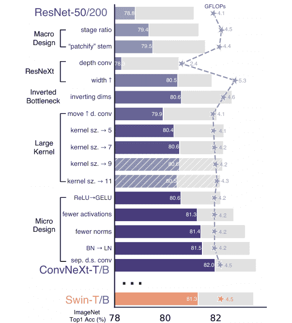
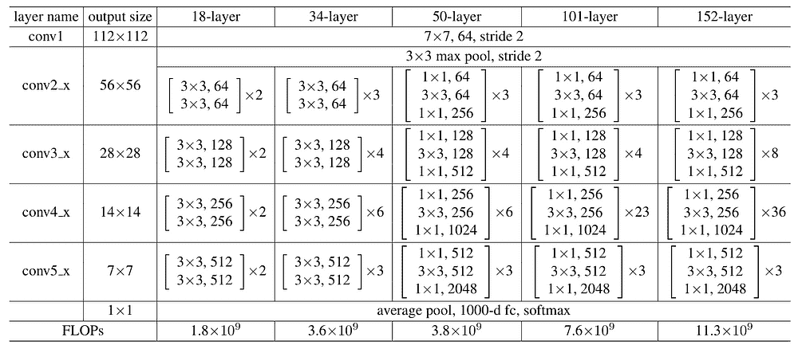
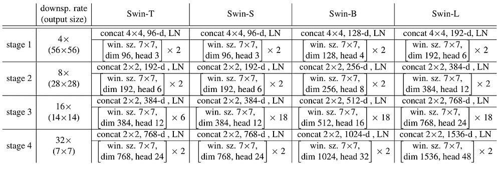
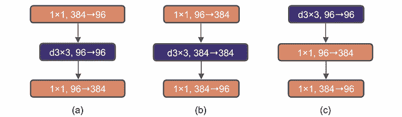
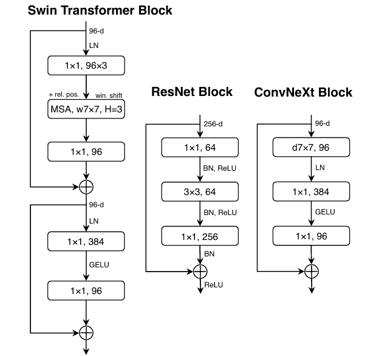
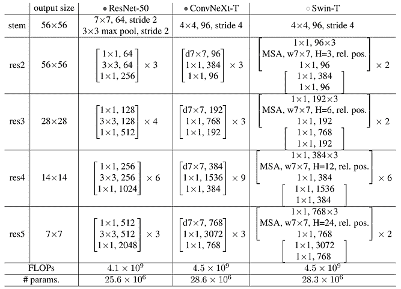
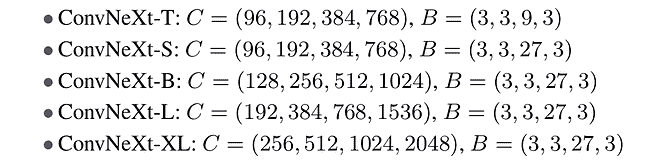

# ConvNeXt 论文解读：挑战 ViT 的 CNN

> 原文：[`towardsdatascience.com/the-cnn-that-challenges-vit/`](https://towardsdatascience.com/the-cnn-that-challenges-vit/)

## <mdspan datatext="el1744736702000" class="mdspan-comment">引言</mdspan>

ViT（视觉 Transformer）的发明让我们认为 CNN（卷积神经网络）已经过时了。但这真的是真的吗？

人们普遍认为，ViT（Vision Transformer）令人印象深刻的性能主要归功于其基于 transformer 的架构。然而，Meta 的研究人员认为这并不完全正确。如果我们仔细观察其架构设计，ViT 不仅对网络结构进行了激进性的改变，也对模型配置进行了改变。Meta 的研究人员认为，可能不是结构使 ViT 更优越，而是其配置。为了证明这一点，他们尝试将 ViT 的配置参数应用到 2015 年的 ResNet 架构中。

— 他们发现他们的论点是正确的。

* * *

在这篇文章中，我将讨论 ConvNeXt，该模型首次在 2022 年由 Liu 等人撰写的题为“*面向 2020 年代的卷积神经网络*”的论文中提出。在这里，我还会尝试从头开始使用 PyTorch 实现它，以便你能更好地理解从原始 ResNet 中做出的变化。实际上，ConvNeXt 的实现可以在他们的 GitHub 仓库[2]中找到，但我发现它过于复杂，难以逐行解释。因此，我决定自己写下来，这样我可以用自己的风格来解释，我相信这对初学者更友好。免责声明，我的实现可能无法完美复制原始版本，但我认为将我的代码视为学习资源仍然是有益的。所以，在阅读我的文章后，我建议你查看原始代码，特别是如果你打算在你的项目中使用 ConvNeXt 的话。

* * *

## 超参数调整

研究者们在 ResNet 模型上进行了超参数调整。一般来说，他们实验了五个方面：*宏观设计*、*ResNeXt*、*倒置瓶颈*、*大核*和*微观设计*。我们可以在下图中看到这些方面的实验结果。



图 1. 在原始 ResNet 架构上进行的超参数调整结果[1]。

在他们的实验中使用了两种 ResNet 变体：ResNet-50 和 ResNet-200（分别用紫色和灰色表示）。现在让我们关注调整 ResNet-50 架构所获得的结果。根据图示，我们可以看到这个模型最初在 ImageNet 数据集上获得了 78.8%的准确率。他们调整了这个模型，直到最终达到了 82.0%，超过了当时最先进的 Swin-T 架构，后者仅实现了 81.3%（橙色条形）。这个调整过的 ResNet 模型就是论文中提到的所谓 ConvNeXt。他们在 ResNet-200 上的实验证实，之前的结果是有效的，因为其调整版本，即 ConvNeXt-B，也成功地超越了 Swin-B（Swin-T 的更大变体）的性能。

### 宏观设计

对原始 ResNet 所做的第一个改变是*宏观设计*。如果我们仔细看看下面的图 2，我们可以看到 ResNet 模型本质上由四个主要阶段组成，即*conv2_x*、*conv3_x*、*conv4_x*和*conv5_x*，每个阶段都包含多个*bottleneck*块。更具体地说，关于 ResNet-50，每个阶段的瓶颈块分别重复 3、4、6 和 3 次。稍后，我会将这些数字称为*阶段比例*。



图 2. ResNet 架构变体[3]。

ConvNeXt 论文的作者试图根据 Swin-T 架构改变这个阶段比例，即 1:1:3:1。好吧，如果你从图 3 中查看原始 Swin Transformer 论文的架构细节，实际上是 2:2:6:2，但这基本上是从相同的比例推导出来的。通过应用这个配置，作者获得了 0.6%的改进（从 78.8%到 79.4%）。因此，他们决定在接下来的实验中使用 1:1:3:1 的阶段比例。



图 3. Swin Transformer 架构变体[4]。

仍然与宏观设计相关，ResNet 的第一层卷积也进行了调整。如果你回到图 2（*conv1*行），你会看到它最初使用 7×7 的核和步长 2，这将图像大小从 224×224 减少到 112×112。受到 Swin Transformer 的启发，作者也希望将输入图像视为非重叠补丁。因此，他们将核大小改为 4×4，步长改为 4。这个想法实际上是从原始 ViT 中采用的，其中它使用 16×16 的核和步长 16。在 ConvNeXt 中，你需要知道生成的补丁被视为标准图像，而不是序列。通过这种修改，准确率略有提高，从 79.4%到 79.5%。因此，作者在接下来的实验中使用了这种配置作为第一层卷积。

### ResNeXt-ification

在完成宏观设计之后，作者接下来采取的是采用 ResNeXt 架构，该架构首次在标题为“*用于深度神经网络的聚合残差变换*”的论文[5]中提出。ResNeXt 的想法是它基本上将分组卷积应用于 ResNet 架构的瓶颈块。如果你还不熟悉分组卷积，它本质上是通过将输入通道分成组并在每个组内独立执行卷积操作来工作的，随着组数的增加，这允许更快地计算。ConvNeXt 通过将组数设置为与内核数相同来采用这个想法。这种方法通常被称为*深度卷积*，使得网络能够获得最低可能的计算复杂度。然而，需要注意的是，像这样增加卷积组数会导致准确率下降，因为它降低了模型的学习能力。因此，准确率下降到 78.3%是预期的。

尽管如此，ResNeXt 化部分并没有结束。实际上，ResNeXt 论文为我们提供了指导，即如果我们增加组数，我们也需要扩展网络的宽度，即添加更多通道。因此，ConvNeXt 作者根据 Swin-T 中使用的内核数重新调整了内核数。你可以在图 2 和图 3 中看到，ResNet 在每个阶段使用 64、128、256 和 512 个内核，而 Swin-T 使用 96、192、384 和 768 个内核。这种模型宽度的增加使得网络能够将准确率显著提升到 80.5%。

### 倒置瓶颈

仍然以图 2 为例，还可以看到 ResNet-50、ResNet-101 和 ResNet-152 共享完全相同的瓶颈结构。例如，*conv5_x*阶段的块由 3 个卷积层组成，内核数分别为 512、512 和 2048，其中第一个卷积的输入要么是 1024（来自*conv4_x*阶段），要么是 2048（来自*conv5_x*阶段本身的先前块）。这些 ResNet 变体本质上遵循*宽→窄→宽*的结构，这也是为什么这个块被称为*瓶颈*。ConvNeXt 没有使用这种结构，而是采用了瓶颈的倒置版本，它采用了来自 Transformer 架构前馈层的*窄→宽→窄*结构。下面图 4（a）是 ResNet 中使用的*bottleneck*块，而（b）是所谓的*倒置瓶颈*块。通过使用这种结构，模型准确率从 80.5%提升到 80.6%。



图 4. ResNeXt 中的瓶颈块（a）、倒置瓶颈块（b）和 ConvNeXt 块（c）[1]。

### 核心大小

接下来的探索是在倒置瓶颈块内部的内核大小上进行的。在尝试不同的内核大小之前，作者对块的结构进行了进一步的修改，将第一层和第二层的顺序进行了交换，使得深度卷积现在位于块的开始位置，如图 4（c）所示。得益于这次修改，该块现在被称为*ConvNeXt 块*，因为它不再完全类似于原始的倒置瓶颈结构。这个想法实际上是从 Transformer 中借鉴的，其中 MSA（多头自注意力）层位于 MLP 层之前。在 ConvNeXt 的情况下，深度卷积充当 MSA 的替代品，而 MLP Transformer 中的线性层则被点卷积所替代。仅仅将深度卷积向上移动，就降低了准确率从 80.6%到 79.9%。然而，这是可以接受的，因为当前的实验设置仍在进行中。

在内核大小实验中，仅对深度卷积层进行了应用，而将剩余的点卷积层保持不变。在这里，作者尝试使用不同的内核大小，发现 7×7 效果最佳，因为它成功地将准确率恢复到 80.6%，同时降低了计算复杂度（从 4.6 GFLOPS 降至 4.2 GFLOPS）。有趣的是，这个内核大小与 Swin Transformer 架构中的窗口维度相匹配，这对应于自注意力机制中使用的块大小。你实际上可以在图 3 中看到这一点，其中 Swin Transformer 变体的窗口大小都是 7×7。

### 微设计

论文中调整的最后一个方面是所谓的*微设计*，这本质上指的是与网络复杂细节相关的事物。与之前类似，这里使用的参数主要也是从 Transformer 中借鉴的。作者最初将 ReLU 替换为 GELU。尽管这种替换后准确率保持不变（80.6%），但他们决定在后续实验中使用这个激活函数。最终，在减少激活函数的数量后，准确率有所提高。不是在 ConvNeXt 块中的每个卷积层之后应用 GELU，这个激活函数只放置在两个点卷积之间。这次修改使得网络将准确率提升到 81.3%，此时这个分数已经与 Swin-T 架构相当，同时具有更低的 GFLOPS（4.2 vs 4.5）。

接下来，在基于 CNN 的架构中，使用 *Conv-BN-ReLU* 结构是一种常见的做法，这正是 ResNet 所实现的。作者决定不遵循这一惯例，而是只实现了一个批归一化层，并将其放置在第一个逐点卷积层之前。这个变化将准确度提升到了 81.4%，略高于 Swin-T 的准确度。尽管取得了这一成就，但作者仍然通过用层归一化替换批归一化来继续参数调整，这又将准确度提高了 0.1% 到 81.5%。所有与微设计相关的修改最终导致了图 5（最右侧的图像）中所示的架构。在这里，您可以看到 ConvNeXt 块与 Swin Transformer 和 ResNet 块的不同之处。



图 5. Swin-T、ResNet-50 和 ConvNeXt-T 块在初始阶段的形态 [1]。

作者在微设计方面做的最后一件事是应用了单独的下采样层。在原始 ResNet 架构中，当我们从一个阶段移动到另一个阶段时，张量的空间维度会减半。您可以在图 2 中看到，最初 ResNet 接受 224×224 大小的输入，然后分别缩小到 112×112、56×56、28×28、14×14 和 7×7，分别对应于 *conv1*、*conv2_x*、*conv3_x*、*conv4_x* 和 *conv5_x* 阶段。特别是在 *conv2_x* 和随后的阶段，空间维度减少是通过改变逐点卷积的步长参数为 2 来实现的。而不是这样做，ConvNeXt 通过在块内的逐元素求和操作之前放置另一个卷积层来进行下采样。这个层的核大小和步长设置为 2，模拟了一个非重叠的滑动窗口。实际上，论文中提到使用这个单独的下采样层会导致准确度下降。尽管如此，作者通过在网络的几个部分应用额外的层归一化层来解决这个问题，即在每个下采样层之前、*stem* 阶段之后以及全局平均池化层之后（在最终输出层之前）。通过这种调整，作者成功地将准确度提升到 82.0%，这比 Swin-T（81.3%）高得多，同时保持了完全相同的 GFLOPS（4.5）。

这基本上就是对原始 ResNet 进行修改以创建 ConvNeXt 架构的所有修改。如果您现在仍然觉得有点不清楚，请不要担心——我相信随着我们进入代码，一切都会变得清晰起来。

* * *

## ConvNeXt 实现方法

下面的图 6 显示了整个 ConvNeXt-T 架构的细节，我们稍后将会逐个实现其所有组件。您还可以看到它与 ResNet-50 和 Swin-T 这两个与 ConvNeXt-T 相当的模型的不同之处。



图 6. ResNet-50、ConvNeXt-T 和 Swin-T 架构的细节 [1]。

在实现方面，我们首先需要做的是导入所需的模块。这里我们只导入了基础的`torch`模块及其`nn`子模块，用于加载神经网络层。

```py
# Codeblock 1
import torch
import torch.nn as nn
```

### ConvNeXt Block

现在我们从 ConvNeXt 块开始。你可以在图 6 中看到，*res2*、*res3*、*res4*和*res5*阶段的块结构基本上是相同的，其中所有这些都对应于图 5 中最右侧的插图。得益于这些相同结构，我们可以将它们实现为一个单独的类，并重复使用。查看下面的代码块 2a 和 2b，看看我是如何做到这一点的。

```py
# Codeblock 2a
class ConvNeXtBlock(nn.Module):
    def __init__(self, num_channels):         #(1)
        super().__init__()
        hidden_channels = num_channels * 4    #(2)

        self.conv0 = nn.Conv2d(in_channels=num_channels,         #(3) 
                               out_channels=num_channels,        #(4)
                               kernel_size=7,    #(5)
                               stride=1,
                               padding=3,        #(6)
                               groups=num_channels)              #(7)

        self.norm = nn.LayerNorm(normalized_shape=num_channels)  #(8)

        self.conv1 = nn.Conv2d(in_channels=num_channels,         #(9)
                               out_channels=hidden_channels, 
                               kernel_size=1, 
                               stride=1, 
                               padding=0)

        self.gelu = nn.GELU()  #(10)

        self.conv2 = nn.Conv2d(in_channels=hidden_channels,      #(11)
                               out_channels=num_channels, 
                               kernel_size=1, 
                               stride=1, 
                               padding=0)
```

我决定将这个类命名为`ConvNeXtBlock`。你可以在上面的代码块中看到，这个类只接受`num_channels`作为参数，它表示输入和输出通道数。记住，ConvNeXt 块遵循倒置瓶颈结构的模式，即*窄*→*宽*→*窄*。如果你仔细观察图 6，你会注意到*宽*部分是*窄*部分的 4 倍。因此，我们相应地设置了`hidden_channels`变量的值（`#(2)`）。

接下来，我们初始化了 3 个卷积层，我将它们称为`conv0`、`conv1`和`conv2`。这些卷积层的每一个都有自己的规格。对于`conv0`，我们将输入和输出通道数设置为相同，这就是为什么它的`in_channels`和`out_channels`参数都设置为`num_channels`（`#(3–4)`）。我们设置这个层的核大小为 7×7（`#(5)`）。根据这个规格，我们需要将填充大小设置为 3 以保持空间维度（`#(6)`）。别忘了将`groups`参数设置为`num_channels`，因为我们希望这是一个深度卷积层（`#(7)`）。另一方面，`conv1`层（`#(9)`）负责增加图像通道数，而随后的`conv2`层（`#(11)`）则用于将张量缩小回原始通道数。重要的是要注意，`conv1`和`conv2`都使用 1×1 的核大小，这实际上意味着它只通过组合通道维度的信息来工作。此外，在这里我们还需要初始化层归一化（`#(8)`）和 GELU 激活函数（`#(10)`）作为批归一化和 ReLU 的替代。

由于 ConvNeXtBlock 中所需的所有层都已初始化，我们接下来需要在下面的`forward()`方法中定义张量的流动。

```py
# Codeblock 2b
    def forward(self, x):
        residual = x                 #(1)
        print(f'x & residual\t: {x.size()}')

        x = self.conv0(x)
        print(f'after conv0\t: {x.size()}')

        x = x.permute(0, 2, 3, 1)    #(2)
        print(f'after permute\t: {x.size()}')

        x = self.norm(x)
        print(f'after norm\t: {x.size()}')

        x = x.permute(0, 3, 1, 2)    #(3)
        print(f'after permute\t: {x.size()}')

        x = self.conv1(x)
        print(f'after conv1\t: {x.size()}')

        x = self.gelu(x)
        print(f'after gelu\t: {x.size()}')

        x = self.conv2(x)
        print(f'after conv2\t: {x.size()}')

        x = x + residual             #(4)
        print(f'after summation\t: {x.size()}')

        return x
```

在上面的代码中，我们基本上只是将张量按顺序传递到我们之前定义的每一层。然而，这里有两点需要强调。首先，我们需要将原始输入张量存储到 `residual` 变量中 (`#(1)`)，这样它将跳过 ConvNeXt 块内的所有操作。其次，记住层归一化通常用于序列数据，它通常具有与图像数据不同的形状。由于这个原因，我们需要调整张量维度，使其形状变为 *(N, H, W, C)* (`#(2)`)，在我们实际执行层归一化操作之前。之后，别忘了将这个张量置换回 *(N, C, H, W)* (`#(3)`)。然后，将得到的张量传递到剩余的层，最后与残差连接相加 (`#(4)`).

为了检查我们的 `ConvNeXtBlock` 类是否正常工作，我们可以使用下面的 Codeblock 3 进行测试。在这里，我们将模拟 *res2* 阶段使用的块。因此，我们将 `num_channels` 参数设置为 96 (`#(1)`)，并创建一个假设为 56×56 大小单张图像的虚拟张量 (`#(2)`).

```py
# Codeblock 3
convnext_block_test = ConvNeXtBlock(num_channels=96)  #(1)
x_test = torch.rand(1, 96, 56, 56)  #(2)

out_test = convnext_block_test(x_test)
```

下面是输出的结果。关于内部流程，看起来我们之前堆叠的所有层都工作正常。在下面的输出中，`#(1)` 行我们可以看到，经过置换后，张量维度变为 1×56×56×96 *(N, H, W, C)*。然后，这个张量大小在第二次置换操作 (`#(2)`) 后变回 1×96×56×56 *(N, C, H, W)*。接下来，*conv1* 层成功将通道数扩展到输入的 4 倍 (`#(3)`)，然后又恢复到原始的通道数 (`#(4)`)。在这里，我们可以看到第一层和最后一层的张量形状完全相同，这允许我们堆叠尽可能多的 ConvNeXt 块。

```py
# Codeblock 3 Output
x & residual    : torch.Size([1, 96, 56, 56])
after conv0     : torch.Size([1, 96, 56, 56])  
after permute   : torch.Size([1, 56, 56, 96])    #(1)
after norm      : torch.Size([1, 56, 56, 96])
after permute   : torch.Size([1, 96, 56, 56])    #(2)
after conv1     : torch.Size([1, 384, 56, 56])   #(3)
after gelu      : torch.Size([1, 384, 56, 56])
after conv2     : torch.Size([1, 96, 56, 56])    #(4)
after summation : torch.Size([1, 96, 56, 56])
```

* * *

### ConvNeXt 块转换

我接下来要实现的是我称之为 *ConvNeXt 块转换* 的组件。这个块的想法实际上与我们之前实现的 ConvNeXt 块类似，只不过这个转换块是在我们即将从一个阶段移动到下一个阶段时使用的。更具体地说，这个块将后来被用作每个阶段（除了 *res2*）的第一个 ConvNeXt 块。我将其实现为单独的类的原因是，有一些复杂的细节与 ConvNeXt 块不同。此外，值得注意的是，术语 *转换* 在论文中并没有正式使用。它只是我用来描述这个想法的词。实际上，我在写关于较小的 ResNet 版本时也使用了这项技术，即 ResNet-18 和 ResNet-34。如果你对阅读那篇文章感兴趣，请点击文章末尾的参考文献编号 [6] 中的链接。

```py
# Codeblock 4a
class ConvNeXtBlockTransition(nn.Module):
    def __init__(self, in_channels, out_channels):  #(1)
        super().__init__()
        hidden_channels = out_channels * 4

        self.projection = nn.Conv2d(in_channels=in_channels,      #(2) 
                                    out_channels=out_channels, 
                                    kernel_size=1, 
                                    stride=2,
                                    padding=0)

        self.conv0 = nn.Conv2d(in_channels=in_channels, 
                               out_channels=out_channels, 
                               kernel_size=7,
                               stride=1,
                               padding=3,
                               groups=in_channels)

        self.norm0 = nn.LayerNorm(normalized_shape=out_channels)

        self.conv1 = nn.Conv2d(in_channels=out_channels, 
                               out_channels=hidden_channels, 
                               kernel_size=1, 
                               stride=1, 
                               padding=0)

        self.gelu = nn.GELU()

        self.conv2 = nn.Conv2d(in_channels=hidden_channels, 
                               out_channels=out_channels, 
                               kernel_size=1, 
                               stride=1,
                               padding=0)

        self.norm1 = nn.LayerNorm(normalized_shape=out_channels)  #(3)

        self.downsample = nn.Conv2d(in_channels=out_channels,     #(4)
                                    out_channels=out_channels, 
                                    kernel_size=2, 
                                    stride=2)
```

你可能首先注意到的第一个不同点是 `__init__()` 方法的输入，在这种情况下，我们将输入和输出通道数分别作为两个参数分开，如代码块 4a 中的第 `#(1)` 行所示。这基本上是因为我们需要这个块接受来自前一阶段的不同通道数的输出张量，而后续阶段要生成的张量通道数不同。例如，如果我们要在 *res3* 阶段创建第一个 ConvNeXt 块，我们需要配置它，使其接受来自 *res2* 的 96 通道张量，并返回另一个 192 通道的张量。

其次，在这里，我们实现了我之前解释过的 *独立下采样层*（`#(4)`），以及应该放置在其之前的相应层归一化（`#(3)`）。正如其名所示，这个层被用来将图像的空间维度减半。

第三，我们在第 `#(2)` 行初始化所谓的 *投影层*。在我们之前创建的 ConvNeXtBlock 中，这个层是不必要的，因为输入和输出张量是相同的。在 *过渡* 块的情况下，图像的空间维度减半，同时输出通道数加倍。这个 *投影* 层负责调整残差连接的维度，以便与主流匹配，从而允许执行元素级操作。

下面代码块 4b 中的 `forward()` 方法也与 `ConvNeXtBlock` 类中的方法类似，除了在这里，残差连接需要与投影层（`#(1)`）一起处理，而主张量在求和之前需要被下采样（`#(2)`）。

```py
# Codeblock 4b
    def forward(self, x):
        print(f'original\t\t: {x.size()}')

        residual = self.projection(x)  #(1)
        print(f'residual after proj\t: {residual.size()}')

        x = self.conv0(x)
        print(f'after conv0\t\t: {x.size()}')

        x = x.permute(0, 2, 3, 1)
        print(f'after permute\t\t: {x.size()}')

        x = self.norm0(x)
        print(f'after norm1\t\t: {x.size()}')

        x = x.permute(0, 3, 1, 2)
        print(f'after permute\t\t: {x.size()}')

        x = self.conv1(x)
        print(f'after conv1\t\t: {x.size()}')

        x = self.gelu(x)
        print(f'after gelu\t\t: {x.size()}')

        x = self.conv2(x)
        print(f'after conv2\t\t: {x.size()}')

        x = x.permute(0, 2, 3, 1)
        print(f'after permute\t\t: {x.size()}')

        x = self.norm1(x)
        print(f'after norm1\t\t: {x.size()}')

        x = x.permute(0, 3, 1, 2)
        print(f'after permute\t\t: {x.size()}')

        x = self.downsample(x)  #(2)
        print(f'after downsample\t: {x.size()}')

        x = x + residual  #(3)
        print(f'after summation\t\t: {x.size()}')

        return x
```

现在让我们使用以下代码块来测试上面的 `ConvNeXtBlockTransition` 类。假设我们即将在 *res3* 阶段实现第一个 ConvNeXt 块。为此，我们可以简单地使用 `in_channels=96` 和 `out_channels=192` 实例化过渡块，然后最终通过一个大小为 1×96×56×56 的虚拟张量通过它。

```py
# Codeblock 5
convnext_block_transition_test = ConvNeXtBlockTransition(in_channels=96, 
                                                         out_channels=192)
x_test = torch.rand(1, 96, 56, 56)

out_test = convnext_block_transition_test(x_test)
```

```py
# Codeblock 5 Output
original            : torch.Size([1, 96, 56, 56])
residual after proj : torch.Size([1, 192, 28, 28])  #(1)
after conv0         : torch.Size([1, 192, 56, 56])  #(2)
after permute       : torch.Size([1, 56, 56, 192])
after norm0         : torch.Size([1, 56, 56, 192])
after permute       : torch.Size([1, 192, 56, 56])
after conv1         : torch.Size([1, 768, 56, 56])
after gelu          : torch.Size([1, 768, 56, 56])
after conv2         : torch.Size([1, 192, 56, 56])  #(3)
after permute       : torch.Size([1, 56, 56, 192])
after norm1         : torch.Size([1, 56, 56, 192])
after permute       : torch.Size([1, 192, 56, 56])
after downsample    : torch.Size([1, 192, 28, 28])  #(4)
after summation     : torch.Size([1, 192, 28, 28])  #(5)
```

你可以在生成的输出中看到，我们的投影层直接将 1×96×56×56 的残差张量映射到 1×192×28×28，如第 `#(1)` 行所示。同时，主张量 `x` 需要被我们之前初始化的其他层处理以达到这个形状。我们在 `x` 张量上从第 `#(2)` 行到第 `#(3)` 行执行的操作基本上与 `ConvNeXtBlock` 类中的操作相同。此时，我们已经得到了与我们的需求匹配的通道数（192）。在经过 `downsample` 层（`#(4)`）处理后的张量，空间维度随后被减少。由于 `x` 和残差张量的维度已经匹配，我们最终可以执行元素级求和（`#(5)`）。

* * *

### 整个 ConvNeXt 架构

当我们准备好了`ConvNeXtBlock`和`ConvNeXtBlockTransition`类后，现在可以开始构建整个 ConvNeXt 架构。在我们这样做之前，我想先介绍一些配置参数。请参见下面的代码块 6。

```py
# Codeblock 6
IN_CHANNELS  = 3     #(1)
IMAGE_SIZE   = 224   #(2)

NUM_BLOCKS   = [3, 3, 9, 3]         #(3)
OUT_CHANNELS = [96, 192, 384, 768]  #(4)
NUM_CLASSES  = 1000  #(5)
```

第一项是输入图像的维度。如第`#(1)`行和`#(2)`行所示，这里我们将`in_channels`设置为 3，`image_size`设置为 224，因为默认情况下 ConvNeXt 接受大小为该尺寸的一批 RGB 图像。接下来的是与模型配置相关的内容。在这种情况下，我将每个阶段的 ConvNeXt 块的数量设置为`[3, 3, 9, 3]`（`#(3)`），相应的输出通道数设置为`[96, 192, 384, 768]`（`#(4)`），因为我想要实现 ConvNeXt-T 变体。实际上，你可以根据图 7 中显示的原论文提供的配置来更改这些数字。最后，我们将输出通道的神经元数量设置为 1000，这对应于我们在其上训练模型的训练数据集的类别数量（`#(5)`）。



图 7. ConvNeXt 变体[1]。

我们现在将在下面的代码块 7a 和 7b 中实现的整个架构放在`ConvNeXt`类中。下面的`__init__()`方法看起来可能有点复杂，但请放心，我会详细解释它。

```py
# Codeblock 7a
class ConvNeXt(nn.Module):
    def __init__(self):
        super().__init__()

        self.stem = nn.Conv2d(in_channels=IN_CHANNELS,    #(1)
                              out_channels=OUT_CHANNELS[0],
                              kernel_size=4,
                              stride=4,
                             )

        self.normstem = nn.LayerNorm(normalized_shape=OUT_CHANNELS[0])  #(2)

        #(3)
        self.res2 = nn.ModuleList()
        for _ in range(NUM_BLOCKS[0]):
            self.res2.append(ConvNeXtBlock(num_channels=OUT_CHANNELS[0]))

        #(4)
        self.res3 = nn.ModuleList([ConvNeXtBlockTransition(in_channels=OUT_CHANNELS[0], 
                                                           out_channels=OUT_CHANNELS[1])])
        for _ in range(NUM_BLOCKS[1]-1):
            self.res3.append(ConvNeXtBlock(num_channels=OUT_CHANNELS[1]))

        #(5)
        self.res4 = nn.ModuleList([ConvNeXtBlockTransition(in_channels=OUT_CHANNELS[1], 
                                                           out_channels=OUT_CHANNELS[2])])
        for _ in range(NUM_BLOCKS[2]-1):
            self.res4.append(ConvNeXtBlock(num_channels=OUT_CHANNELS[2]))

        #(6)
        self.res5 = nn.ModuleList([ConvNeXtBlockTransition(in_channels=OUT_CHANNELS[2], 
                                                           out_channels=OUT_CHANNELS[3])])
        for _ in range(NUM_BLOCKS[3]-1):
            self.res5.append(ConvNeXtBlock(num_channels=OUT_CHANNELS[3]))

        self.avgpool = nn.AdaptiveAvgPool2d(output_size=(1,1))  #(7)
        self.normpool = nn.LayerNorm(normalized_shape=OUT_CHANNELS[3])  #(8)
        self.fc = nn.Linear(in_features=OUT_CHANNELS[3],        #(9)
                            out_features=NUM_CLASSES)

        self.relu = nn.ReLU()
```

我们在这里做的第一件事是初始化*stem*阶段（`#(1)`），这本质上只是一个 4×4 核大小和步长为 4 的卷积层。这种配置将有效地将图像大小减少到原来的 1/4，其中输出张量中的每个像素代表输入张量中的一个 4×4 块。对于后续阶段，我们需要用`nn.ModuleList()`包装相应的 ConvNeXt 块。对于*res3*（`#(4)`）、*res4*（`#(5)`）和*res5*（`#(6)`）阶段，我们在每个列表的开始处放置`ConvNeXtBlockTransition`作为阶段之间的“桥梁”。对于*res2*阶段，我们不需要这样做，因为*stem*阶段产生的张量已经与它兼容（`#(3)`）。接下来，我们初始化一个`nn.AdaptiveAvgPool2d`层，该层将通过在每个通道上计算平均值来将张量的空间维度减少到 1×1。实际上，这正是 ResNet 用来准备从最后一个卷积层得到的张量，以便与后续输出层所需的形状相匹配的过程（`#(9)`）。此外，别忘了初始化两个层归一化层，我将它们称为`normstem`（`#(2)`）和`normpool`（`#(8)`），这两个层将随后放置在`stem`阶段和`avgpool`层之后。

`forward()` 方法相当直接。在下面的代码中，我们只需要将层依次放置即可。请注意，由于 ConvNeXt 块存储在列表中，我们需要通过循环迭代地调用它们，如第 `#(1–4)` 行所示。此外，别忘了重塑由 `nn.AdaptiveAvgPool2d` 层生成的张量（`#(5)`），以便它与随后的全连接层（`#(6)`）兼容。

```py
# Codeblock 7b
    def forward(self, x):
        print(f'original\t: {x.size()}')

        x = self.relu(self.stem(x))
        print(f'after stem\t: {x.size()}')

        x = x.permute(0, 2, 3, 1)
        print(f'after permute\t: {x.size()}')

        x = self.normstem(x)
        print(f'after normstem\t: {x.size()}')

        x = x.permute(0, 3, 1, 2)
        print(f'after permute\t: {x.size()}')

        print()
        for i, block in enumerate(self.res2):    #(1)
            x = block(x)
            print(f'after res2 #{i}\t: {x.size()}')

        print()
        for i, block in enumerate(self.res3):    #(2)
            x = block(x)
            print(f'after res3 #{i}\t: {x.size()}')

        print()
        for i, block in enumerate(self.res4):    #(3)
            x = block(x)
            print(f'after res4 #{i}\t: {x.size()}')

        print()
        for i, block in enumerate(self.res5):    #(4)
            x = block(x)
            print(f'after res5 #{i}\t: {x.size()}')

        print()
        x = self.avgpool(x)
        print(f'after avgpool\t: {x.size()}')

        x = x.permute(0, 2, 3, 1)
        print(f'after permute\t: {x.size()}')

        x = self.normpool(x)
        print(f'after normpool\t: {x.size()}')

        x = x.permute(0, 3, 1, 2)
        print(f'after permute\t: {x.size()}')

        x = x.reshape(x.shape[0], -1)             #(5)
        print(f'after reshape\t: {x.size()}')

        x = self.fc(x)
        print(f'after fc\t: {x.size()}')          #(6)

        return x
```

现在，让我们进入关键时刻，通过运行以下代码来查看我们是否正确实现了整个 ConvNeXt 模型。在这里，我尝试将一个大小为 1×3×224×224 的张量传递给网络，模拟一个 224×224 大小的单个 RGB 图像的批次。

```py
# Codeblock 8
convnext_test = ConvNeXt()

x_test   = torch.rand(1, IN_CHANNELS, IMAGE_SIZE, IMAGE_SIZE)
out_test = convnext_test(x_test)
```

您可以从以下输出中看到，我们的实现似乎是正确的，因为网络的行为与图 6 中所示的架构设计相一致。随着我们深入网络，图像的空间维度逐渐减小，同时由于我们在阶段 *res3* (`#(1)`), *res4* (`#(2)`), 和 *res5* (`#(3)`) 的开始放置了 `ConvNeXtBlockTransition` 块，通道数反而增加。然后 `avgpool` 层正确地降低了空间维度到 1×1 (`#(4)`)，使其能够连接到输出层 (`#(5)`)。

```py
# Codeblock 8 Output
original       : torch.Size([1, 3, 224, 224])
after stem     : torch.Size([1, 96, 56, 56])
after permute  : torch.Size([1, 56, 56, 96])
after normstem : torch.Size([1, 56, 56, 96])
after permute  : torch.Size([1, 96, 56, 56])

after res2 #0  : torch.Size([1, 96, 56, 56])
after res2 #1  : torch.Size([1, 96, 56, 56])
after res2 #2  : torch.Size([1, 96, 56, 56])

after res3 #0  : torch.Size([1, 192, 28, 28])  #(1)
after res3 #1  : torch.Size([1, 192, 28, 28])
after res3 #2  : torch.Size([1, 192, 28, 28])

after res4 #0  : torch.Size([1, 384, 14, 14])  #(2)
after res4 #1  : torch.Size([1, 384, 14, 14])
after res4 #2  : torch.Size([1, 384, 14, 14])
after res4 #3  : torch.Size([1, 384, 14, 14])
after res4 #4  : torch.Size([1, 384, 14, 14])
after res4 #5  : torch.Size([1, 384, 14, 14])
after res4 #6  : torch.Size([1, 384, 14, 14])
after res4 #7  : torch.Size([1, 384, 14, 14])
after res4 #8  : torch.Size([1, 384, 14, 14])

after res5 #0  : torch.Size([1, 768, 7, 7])    #(3)
after res5 #1  : torch.Size([1, 768, 7, 7])
after res5 #2  : torch.Size([1, 768, 7, 7])

after avgpool  : torch.Size([1, 768, 1, 1])    #(4)
after permute  : torch.Size([1, 1, 1, 768])
after normpool : torch.Size([1, 1, 1, 768])
after permute  : torch.Size([1, 768, 1, 1])
after reshape  : torch.Size([1, 768])
after fc       : torch.Size([1, 1000])         #(5)
```

* * *

## 结束

好吧，关于 ConvNeXt 架构的理论和实现就到这里了。再次强调，我承认上面展示的代码可能无法完全涵盖所有内容，因为这篇文章旨在介绍模型的一般概念。因此，如果您想了解更多关于细节的复杂之处，我强烈建议您阅读 Meta 研究人员提供的原始实现[2]。

我希望您觉得这篇文章有用。感谢阅读！

*P.S. 本文使用的笔记本可在我的 GitHub 仓库中找到。请参阅参考文献编号 [7] 中的链接。*

* * *

## 参考文献

[1] Zhuang Liu 等人。2020 年代的卷积神经网络。Arxiv。[`arxiv.org/pdf/2201.03545`](https://arxiv.org/pdf/2201.03545) [访问日期：2025 年 1 月 18 日]。

[2] facebookresearch. ConvNeXt。GitHub。[`github.com/facebookresearch/ConvNeXt/blob/main/models/convnext.py`](https://github.com/facebookresearch/ConvNeXt/blob/main/models/convnext.py) [访问日期：2025 年 1 月 18 日]。

[3] Kaiming He 等人。用于图像识别的深度残差学习。Arxiv。[`arxiv.org/pdf/1512.03385`](https://arxiv.org/pdf/1512.03385) [访问日期：2025 年 1 月 18 日]。

[4] Ze Liu 等人。Swin Transformer：使用平移窗口的分层视觉 Transformer。Arxiv。[`arxiv.org/pdf/2103.14030`](https://arxiv.org/pdf/2103.14030) [访问日期：2025 年 1 月 18 日]。

[5] Saining Xie 等人。用于深度神经网络的聚合残差变换。Arxiv。[`arxiv.org/pdf/1611.05431`](https://arxiv.org/pdf/1611.05431) [访问日期：2025 年 1 月 18 日]。

[6] [Muhammad Ardi](https://medium.com/u/9801a58700ac). 论文解读：残差网络（ResNet）。Python 通俗易懂。 [`python.plainenglish.io/paper-walkthrough-residual-network-resnet-62af58d1c521`](https://python.plainenglish.io/paper-walkthrough-residual-network-resnet-62af58d1c521) [访问日期：2025 年 1 月 19 日].

[7] MuhammadArdiPutra. 挑战 ViT 的 CNN — ConvNeXt. GitHub. [`github.com/MuhammadArdiPutra/medium_articles/blob/main/The%20CNN%20That%20Challenges%20ViT%20-%20ConvNeXt.ipynb`](https://github.com/MuhammadArdiPutra/medium_articles/blob/main/The%20CNN%20That%20Challenges%20ViT%20-%20ConvNeXt.ipynb) [访问日期：2025 年 1 月 24 日].
