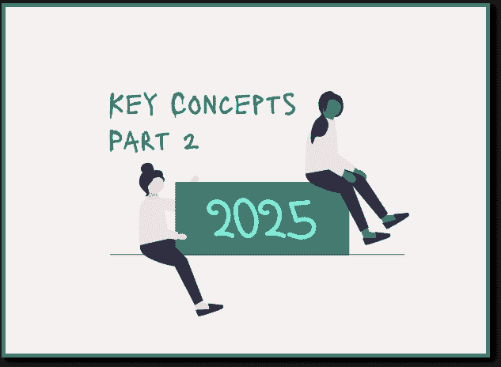

# 2025 年数据专业人士应了解的概念：第二部分

> 原文：[`towardsdatascience.com/the-concepts-data-professionals-should-know-in-2025-part-2-c0e308946463/`](https://towardsdatascience.com/the-concepts-data-professionals-should-know-in-2025-part-2-c0e308946463/)

数据领域的创新正在迅速发展。

让我们快速浏览一下生成式 AI 的时间线：ChatGPT 于 2022 年 11 月推出，到 2023 年初已成为世界上最著名的生成式 AI 应用。到 2025 年春季，Salesforce（营销云增长）和 Adobe（Firefly）等领先公司已将其集成到主流应用中，使其对各种规模的公司都变得可访问。MidJourney 等工具推动了图像生成，同时，关于代理式 AI 的讨论成为焦点。如今，ChatGPT 等工具已经对许多私人用户变得司空见惯。

**这就是为什么我整理了 12 个术语，你作为数据工程师、数据科学家和数据分析师在 2025 年一定会遇到，并且理解它们非常重要。它们为什么相关？挑战是什么？你如何将它们应用到一个小项目中？**

> **目录** [第一部分的术语 1-6：数据仓库、数据湖、数据湖屋、云平台、优化数据存储、大数据技术、ETL、ELT 和 Zero-ETL、事件驱动架构](https://medium.com/towards-data-science/the-concepts-data-professionals-should-know-in-2025-part-1-47e7e797801d) 7 – 数据血缘 & XAI 8 – 生成式 AI 9 – 代理式 AI 10 – 推理时间计算 11 – 近无限内存 12 – 人类在回路增强 结语

在[第一部分](https://medium.com/towards-data-science/the-concepts-data-professionals-should-know-in-2025-part-1-47e7e797801d)中，我们探讨了理解现代数据系统（数据存储、管理和处理）的基本术语。在第二部分中，我们现在超越基础设施，深入探讨一些与人工智能相关的术语，这些术语使用这些数据来推动创新。

## 7 – 预测的可解释性和数据可追溯性：XAI & 数据血缘

随着数据和人工智能工具在我们日常生活中的重要性日益增加，我们也需要了解如何跟踪它们，并为决策过程和预测创造透明度：

让我们想象一个医院场景：一个深度学习模型被用来预测手术成功的可能性。一位患者被归类为“不适合”进行手术。医疗团队的问题是什么？模型如何得出这个决定的解释并不明确。导致预测的内部流程和计算仍然隐藏。也不清楚哪些属性——如年龄、健康状况或其他参数——对这一评估是决定性的。医疗团队是否仍然应该相信预测并继续进行手术？或者他们应该按照他们认为最合适的方式行事？

这种缺乏透明度可能导致对 AI 支持的决策的不确定性甚至不信任。为什么会这样？许多深度学习模型为我们提供了结果和出色的预测——比简单模型做得更好。然而，这些模型是“黑盒”——我们不知道模型是如何得出结果以及它们使用了哪些特征。虽然这种缺乏透明度在日常应用中几乎不起作用，例如区分猫和狗的照片，但在关键领域，情况就不同了：例如，在医疗保健、财务决策、犯罪学或招聘过程中，我们需要能够理解模型是如何以及为什么得出某些结果的。

这就是**可解释人工智能（XAI）**发挥作用的地方：试图使 AI 模型的决策过程变得可理解和可解释的技术和方法。例如，有[SHAP](https://shap.readthedocs.io/en/latest/example_notebooks/overviews/An%20introduction%20to%20explainable%20AI%20with%20Shapley%20values.html)（SHapley Additive ExPlanations）或[LIME](https://github.com/marcotcr/lime)（Local Interpretable Model-agnostic Explanations）。这些工具至少可以显示哪些特征对决策贡献最大。

另一方面，**数据溯源**帮助我们了解数据来自哪里，数据是如何被处理的，以及数据最终是如何被使用的。例如，在 BI 工具中，一个包含错误数据的报告可以用来检查问题是否出在数据源、转换过程中或数据加载时。

### 为什么这些术语很重要？

XAI：我们在日常生活中使用 AI 模型作为决策辅助工具越多，我们就越需要了解这些模型是如何得出结果的。特别是在金融和医疗保健等领域，以及在人力资源和社会服务等流程中。

数据溯源：在欧洲有 GDPR，在加利福尼亚有 CCPA。这些法规要求公司以可理解的方式记录数据的来源和使用情况。具体来说意味着什么？如果公司必须遵守数据保护法，他们必须始终知道数据来自哪里以及如何被处理。

### 面临哪些挑战？

1.  数据景观的复杂性（数据溯源）：在分布式系统和多云环境中，完全追踪数据流是困难的。

1.  性能与透明度（XAI）：深度学习模型通常能提供更精确的结果，但它们的决策路径难以追踪。另一方面，简单的模型通常更容易解释，但准确性较低。

### 小型项目想法以更好地理解这些术语：

使用 SHAP（SHapley Additive ExPlanations）来解释机器学习模型的决策逻辑：例如，创建一个简单的 ML 模型使用 scikit-learn 预测房价。然后安装 Python 中的 SHAP 库，并可视化不同特征如何影响价格预测。

## 8 – 生成式 AI（Gen AI）

自 Chat-GPT 于 2023 年 1 月走红以来，"通用人工智能"这个词也成了大家热议的话题。生成式人工智能指的是可以从输入中生成新内容的 AI 模型。输出可以是文本、图像、音乐或视频。例如，现在甚至有时尚商店使用生成式人工智能来创建他们的广告图像（例如 Calvin Klein，Zalando）。

> "我们几乎九年前开始成立 OpenAI，因为我们相信通用人工智能是可能的，并且它可能是人类历史上最具影响力的技术。我们想弄清楚如何构建它，并使其广泛受益；[…]"

*[参考资料：OpenAI 首席执行官山姆·奥特曼](https://blog.samaltman.com/reflections)*

### 为什么这个术语很重要？

显然，通用人工智能可以大大提高效率。对于内容创作、设计或文本等任务，公司所需的时间减少了。通用人工智能也在改变我们工作世界的许多领域。任务正在以不同的方式执行，工作也在变化，数据变得更加重要。

例如，在 Salesforce 最新的营销自动化工具中，用户可以用自然语言输入一个提示，这会生成一个电子邮件布局——尽管在现实中这并不总是可靠地工作。

### 挑战是什么？

1.  版权和伦理：这些模型是用大量源自我们人类的数据训练的，并试图根据这些数据生成尽可能逼真的结果（例如，也有作者的文字或著名画家的图像）。一个问题就是通用人工智能可以模仿现有作品。结果归谁所有？至少在一定程度上减少这种问题的简单方法是明确标注 AI 生成的内容。

1.  成本和能源：大型模型需要大量的计算资源。

1.  偏见和错误信息：这些模型是用特定数据训练的。如果数据已经包含偏见（例如，一个性别或一个国家的数据较少），这些模型可以复制这些偏见。例如，如果一个 HR 工具是用比女性数据更多的男性数据训练的，它可能会在求职申请中偏爱男性申请人。当然，有时模型简单地提供错误信息。

### 一个小项目想法，以更好地理解这些术语：

创建一个简单的聊天机器人，它可以访问 GPT-4 API 并回答问题。我在页面底部附上了一份逐步指南。

## 9 – 代理式人工智能/人工智能代理

**代理式人工智能**目前是一个热烈讨论的话题，它基于生成式人工智能。人工智能代理描述的是能够思考、计划和自主行动的智能系统：

> "这就是人工智能应有的样子。[…]

_[参考资料：Salesforce 首席执行官马克·贝尼奥夫关于代理和代理力量的观点](https://www.fastcompany.com/91208578/why-marc-benioff-is-all-in-on-ai-agentforce?utm_source=chatgpt.com)_

AI 代理，可以说是传统聊天机器人和机器人的延续。这些系统承诺通过创建多级计划、从数据中学习并基于此做出决策来执行它们，从而解决复杂问题。

多步计划意味着 AI 需要提前几步思考以达到目标。

让我们想象一个快速示例：一个 AI 代理的任务是递送包裹。AI 代理不会简单地遵循订单的顺序，而是首先分析交通状况，计算最快的路线，然后按照这个计算出的顺序递送各种包裹。

### 这个术语为什么很重要？

执行多步计划的能力使 AI 代理与之前的机器人和聊天机器人区分开来，并带来了自主系统的新时代。

如果 AI 代理实际上可以在商业中应用，公司可以通过代理自动化重复性任务，降低成本并提高效率。这将带来经济效益和竞争优势。正如 Salesforce 的首席执行官在采访中所说，它可以极大地改变我们的企业世界。

### 挑战是什么？

1.  逻辑一致性和（当前）技术限制：当前模型在处理涉及多个变量的复杂场景时，难以进行一致的逻辑思考。这正是它们存在的目的——或者这就是它们被宣传的方式。这意味着到 2025 年，肯定会有对更好的模型的需求增加。

1.  道德与接受度：自主系统可以独立做出决策和解决自己的任务。我们如何确保自主系统不会做出违反道德标准的决策？作为一个社会，我们还需要定义我们希望多快地将此类变化整合到我们的日常（工作）生活中，而不会让员工感到意外。并非每个人都具备相同的技术知识。

### 小型项目想法以更好地理解这个术语：

使用 Python 创建一个简单的 AI 代理：首先定义代理。例如，代理应从 API 检索数据。使用 Python 协调 API 查询、结果过滤和自动向用户发送电子邮件。然后实现简单的决策逻辑：例如，如果没有结果符合过滤标准，则搜索范围将扩大。

## 10 – 推理时间计算

接下来，我们关注使用 AI 模型的高效性和性能：一个 AI 模型接收输入数据，基于它做出预测或决策，并给出输出。这个过程需要计算时间，这被称为**推理时间计算**。现代模型，如 AI 代理，通过灵活调整其计算时间以适应任务的复杂性而更进一步。

基本上，这与我们人类是一样的：当我们必须解决更复杂的问题时，我们会投入更多时间。AI 模型使用动态推理（根据任务要求调整计算时间）和链式推理（使用多个决策步骤来解决复杂问题）。

### 这个术语为什么很重要？

人工智能和模型在我们的日常生活中变得越来越重要。对动态人工智能系统（能够灵活适应请求并理解我们请求的人工智能）的需求将会增加。推理时间会影响聊天机器人、自动驾驶汽车和实时翻译等系统的性能。能够根据任务复杂度调整推理时间并因此“思考”不同长度时间的人工智能模型将提高效率和准确性。

### 挑战是什么？

1.  性能与质量：你想要一个快速但不太准确还是慢但非常准确的解决方案？较短的推理时间可以提高效率，但可能会在复杂任务中牺牲准确性。

1.  能耗：推理时间越长，所需的计算能力就越多。这反过来又增加了能耗。

## 11 - 近无限内存

**近无限内存**是一个描述技术如何几乎无限期地存储和处理大量数据的概念。

对于我们用户来说，这似乎是无限的存储——但实际上它更多的是可扩展云服务、数据优化的存储解决方案和智能数据管理系统的一种组合。

### 为什么这个术语很重要？

由于物联网、人工智能和大数据的日益普及，我们生成数据呈指数级增长。正如在术语 1-3 中所述，这为数据湖屋等数据架构创造了不断增长的需求。AI 模型也需要大量的数据进行训练和验证。因此，存储解决方案变得更加高效是很重要的。

### 挑战是什么？

1.  能耗：云数据中心中的大型存储解决方案消耗了大量的能源。

1.  安全担忧和对集中式服务的依赖：云服务提供商提供了许多几乎无限的内存解决方案。这可能会产生依赖，带来财务和数据保护风险。

### 小型项目想法以更好地理解这些术语：

发展对不同数据类型如何影响存储需求的理解，并学习如何高效地使用存储空间。查看“优化数据存储”这一术语下的项目。

## 12 - 人类在回路增强

如前所述，随着人工智能越来越重要，我们应该确保在这个过程中人类的部分不会丢失。

> "我们需要让那些受到技术伤害的人想象他们想要的未来。"

_[参考：谷歌人工智能伦理部门前负责人蒂姆尼特·格布鲁](https://time.com/6132399/timnit-gebru-ai-google/?utm_source=chatgpt.com)_

**人类在回路增强**可以说是计算机科学与心理学的接口。它描述了我们人类与人工智能之间的协作。目标是结合双方的优点：

+   人工智能的一个巨大优势是，这样的模型可以有效地处理大量数据，并从中发现我们难以识别的模式。

+   我们人类，另一方面，带来了判断力、道德、创造力和情境理解，而不需要预先训练，并且能够应对不可预见的情况。

目标必须是人工智能为我们人类服务——而不是相反。

### 为什么这个术语很重要？

人工智能可以提高决策过程并最小化错误。特别是，人工智能可以识别我们无法看到的数据中的模式，例如在医学或生物学领域。

麻省理工学院集体智能中心在《自然人类行为》杂志上发表了一项研究，分析了人机组合与纯粹的人类或纯粹由 AI 控制的系统相比表现如何：

+   在决策任务中，人机组合往往比单独的 AI 系统表现更差（例如，医学诊断/深度伪造的分类）。

+   在创造性任务中，交互已经表现得更好。在这里，人机团队的表现优于人类和单独的 AI。

然而，研究表明，人机交互增强功能尚未完美工作。

*[参考：人类与人工智能：他们一起工作更好还是单独工作？](https://mitsloan.mit.edu/press/humans-and-ai-do-they-work-better-together-or-alone)*

### 挑战是什么？

1.  缺乏协同作用和不信任：似乎缺乏直观的界面，这使得我们人类与 AI 工具的有效互动变得更加容易。另一个挑战是，AI 系统有时被批判性地看待，甚至被拒绝。

1.  (当前)人工智能的技术局限性：当前的 AI 系统难以理解逻辑一致性和情境。这可能导致错误或不准确的结果。例如，一个 AI 诊断系统可能会错误地判断一个罕见病例，因为它没有足够的数据来处理此类病例。

## 最后的想法

文章中的术语仅展示了我们目前看到的一些创新——这个列表肯定可以扩展。例如，在 AI 模型领域，模型的大小也将发挥重要作用：除了非常大的模型（参数量高达 50 万亿）之外，可能还会开发出单个非常小的模型，这些模型可能只包含数十亿个参数。这些小型模型的优势是它们不需要巨大的数据中心和 GPU，可以在我们的笔记本电脑上甚至在我们的智能手机上运行，并执行非常具体的任务。

你认为哪些术语非常重要？请在评论中告诉我们。

### 你可以在哪里继续学习？

+   [书籍 – 数据湖屋傻瓜指南](https://www.databricks.com/resources/ebook/the-data-lakehouse-for-dummies?scid=7018Y000001Fi0wQAC&utm_medium=paid+search&utm_source=google&utm_campaign=18644033717&utm_adgroup=155910589566&utm_content=ebook&utm_offer=the-data-lakehouse-for-dummies&utm_ad=726091850602&utm_term=what%20is%20data%20lakehouse&gclid=CjwKCAiAm-67BhBlEiwAEVftNpyMW0FXSHffkBZAIKPfx-f3Js05Qw191n1VHXCvpfwe9FJpG1xD4BoCCbkQAvD_BwE)

+   [Medium – SQL 和数据建模实战：深入数据湖屋](https://medium.com/towards-data-science/sql-and-data-modelling-in-action-a-deep-dive-into-data-lakehouses-fcbab9a4b9c2)

+   [Gartner – 2025 年十大战略技术趋势](https://www.gartner.com/en/articles/top-technology-trends-2025)

+   [AWS – 用 AWS 开始你的旅程](https://aws.amazon.com/getting-started/?nc1=h_ls)

+   [DataCamp 课程 – AWS 概念](https://www.datacamp.com/courses/aws-concepts)

+   [Snowflake 博客 – Avro 与 Parquet](https://www.snowflake.com/trending/avro-vs-parquet/)

+   [Medium – 为什么是 ETL-Zero？理解数据集成中的转变](https://medium.com/towards-data-science/why-etl-zero-understanding-the-shift-in-data-integration-as-a-beginner-d0cefa244154)

+   [AWS 博客 – 什么是事件驱动架构？](http://What is an Event-Driven Architecture?)

+   [Medium – 没有可解释性，你能信任 AI 模型吗？XAI 简介](https://medium.com/towards-artificial-intelligence/why-you-cant-trust-ai-models-without-explainability-introduction-to-xai-e80e71122f50)

+   [IBM 博客 – 代理人工智能：AI 研究下一个大趋势的 4 个原因](https://www.ibm.com/think/insights/agentic-ai)

+   [MIT 管理斯隆学院 – 关于人类与人工智能的研究](https://mitsloan.mit.edu/press/humans-and-ai-do-they-work-better-together-or-alone)

+   [Sam Altman 博客 – 关于人工智能的反思](https://blog.samaltman.com/reflections)

自我可视化 – 来自[unDraw.co](https://undraw.co/illustrations)的插图

*本文中所有信息均基于 2025 年 1 月的当前状况。*
