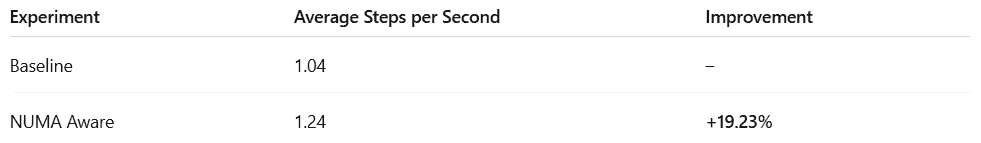

# 高性能深度学习中 NUMA 意识的关键作用

> 原文：[`towardsdatascience.com/the-crucial-role-of-numa-awareness-in-high-performance-deep-learning/`](https://towardsdatascience.com/the-crucial-role-of-numa-awareness-in-high-performance-deep-learning/)

<mdspan datatext="el1752124468783" class="mdspan-comment">在深度学习训练错综复杂的领域中，ML 开发者的角色可以比作一个乐队的指挥。正如指挥必须准确把握每个乐器的进入时机以产生完美的和声一样，ML 实践者必须协调众多硬件组件——包括与其相关的内存、高速存储、网络控制器、各种通信总线等——以无缝协作，最大化运行时性能。正如一个走调的音符可以破坏整个音乐表演一样，任何一个组件的瓶颈或不效率都可能严重阻碍整体训练过程。

在这个复杂的领域中，了解你系统底层的拓扑结构并且知道如何将其应用于最优运行时性能至关重要。在[之前的帖子](https://towardsdatascience.com/smart-distributed-training-on-amazon-sagemaker-with-smd-part-2-c833e7139b5f/)中，我们探讨了拓扑意识在分布式训练环境中的关键作用，并讨论了拓扑感知梯度共享算法在最小化跨节点通信和提升性能方面的优势。

在本篇帖子中，这是我们关于 PyTorch 模型分析和优化的系列文章中的第十篇，我们聚焦于训练和运行 AI/ML 模型时 CPU 和 GPU 之间的协作。在一个典型的训练流程中，CPU 负责准备和预处理数据，加载 GPU 内核，以及处理输出，而 GPU 负责模型执行。这种合作不仅仅是交接——它是一种持续的高速数据与命令交换，可以比作一场复杂的舞蹈——其中精确的时间和物理接近性至关重要。为了使这场舞蹈能够最优地表演，它必须以考虑到底层系统拓扑的方式编排。特别是，它必须考虑到系统的[非一致性内存访问 (NUMA)](https://en.wikipedia.org/wiki/Non-uniform_memory_access) 架构。

### NUMA 架构

NUMA 架构旨在通过将本地内存银行直接与特定的 CPU 插槽关联来优化内存事务。大多数现代的多 GPU 高性能计算（HPC）系统由两个或更多 NUMA 节点组成，其中 CPU 和 GPU 被分为不相交的组，每个组连接到一个节点。当内存银行在同一节点内访问时，NUMA 最有效。在远程节点上访问内存需要通过专用的 NUMA 互连进行数据传输，这比访问本地内存慢得多。在内存密集型应用程序，如 AI/ML 工作负载中，跨 NUMA 内存访问可能会引入性能瓶颈。

不幸的是，流行的 AI/ML 框架——最著名的是 PyTorch——默认情况下并没有考虑 NUMA 架构。然而，正如我们将在本文中展示的那样，你可以在 PyTorch 脚本中轻松地引入 NUMA 意识。

在下一节中，我们将探索流行的 [Amazon EC2 p4d.96xlarge](https://aws.amazon.com/ec2/instance-types/p4/) 实例（包含 8 个 NVIDIA A100 GPU 和 96 个 vCPU）的 NUMA 架构（运行 [PyTorch (2.6) 深度学习 AMI](https://aws.amazon.com/releasenotes/aws-deep-learning-ami-gpu-pytorch-2-6-ubuntu-22-04/)（DLAMI））。然后，我们将展示如何实现一个 NUMA 意识的 PyTorch 脚本并评估其对运行时性能的影响。

### 免责声明

NUMA 架构是一个复杂且微妙的话题。在本博文中，我们探讨其影响的一个方面：其对深度学习的影响。有关该主题的更全面细节，请参考其他权威资源。

我们将分享的代码旨在演示目的，不应依赖于其正确性或最优性。请勿将我们对平台、框架或任何其他工具或库的选择解释为对其使用的认可。

## NUMA 架构发现

有多种方法可以检测你正在运行的系统的 NUMA 架构。在本节中，我们将演示如何使用常用的 Linux 命令行工具来探索 [Amazon EC2 p4d.96xlarge](https://aws.amazon.com/ec2/instance-types/p4/) 实例的 NUMA 布局。

### CPU NUMA 节点发现

`[*lscpu*](https://man7.org/linux/man-pages/man1/lscpu.1.html)` 命令提供了有关 Linux 系统的 CPU 架构信息，包括一个描述 NUMA 布局的章节。通过在 [Amazon EC2 p4d.96xlarge](https://aws.amazon.com/ec2/instance-types/p4/) 实例上运行该命令，我们了解到它由 96 个 vCPU 分为两个 NUMA 节点：

```py
NUMA:                     
  NUMA node(s):           2
  NUMA node0 CPU(s):      0-23,48-71
  NUMA node1 CPU(s):      24-47,72-95
```

### GPU NUMA 节点发现

为了确定每个 GPU 所连接的 NUMA 节点，我们使用两步过程：首先，我们识别与每个 GPU 相关的 PCI ID，然后查找与该 PCI ID 相关的 NUMA 节点。

PCI ID 是[*nvidia-smi*](https://docs.nvidia.com/deploy/nvidia-smi/index.html)实用程序报告的 GPU 属性之一。在以下片段中，我们看到我们的 Amazon EC2 p4d.96xlarge 实例上八个 GPU 中的前两个的 PCI 总线 ID：

```py
+-----------------------------------------------------------------------------------------+
| NVIDIA-SMI 570.133.20             Driver Version: 570.133.20     CUDA Version: 12.8     |
|-----------------------------------------+------------------------+----------------------+
| GPU  Name                 Persistence-M | Bus-Id          Disp.A | Volatile Uncorr. ECC |
| Fan  Temp   Perf          Pwr:Usage/Cap |           Memory-Usage | GPU-Util  Compute M. |
|                                         |                        |               MIG M. |
|=========================================+========================+======================|
|   0  NVIDIA A100-SXM4-40GB          On  |   00000000:10:1C.0 Off |                    0 |
| N/A   48C    P0             57W /  400W |       0MiB /  40960MiB |      0%      Default |
|                                         |                        |             Disabled |
+-----------------------------------------+------------------------+----------------------+
|   1  NVIDIA A100-SXM4-40GB          On  |   00000000:10:1D.0 Off |                    0 |
| N/A   45C    P0             56W /  400W |       0MiB /  40960MiB |      0%      Default |
|                                         |                        |             Disabled |
+-----------------------------------------+------------------------+----------------------+
```

接下来，我们使用这些 PCI IDs 通过从`/sys/bus/pci/devices/`路径读取来确定相应的 NUMA 节点：

```py
ubuntu@XX:~$ cat /sys/bus/pci/devices/0000\:10\:1c.0/numa_node
0
ubuntu@XX:~$ cat /sys/bus/pci/devices/0000\:10\:1d.0/numa_node
0
```

这表明 GPU 0 和 1 连接到 NUMA 节点 0。

### 其他工具

使用[*lstopo*](https://linux.die.net/man/1/lstopo)——一个报告计算机系统拓扑的命令行工具——是查找 PCI IDs 的 NUMA 节点分配的另一种方法。尽管它默认不包括在 DLAMI 中，但可以通过运行以下命令轻松安装：

```py
sudo apt install hwloc
```

下面是它命令行输出的一个片段，报告了 NUMA 节点 0 上的四个 PCI IDs。这些用“(3D)”标签标记——这是 3D 加速器的常见标识符，也称为 GPU。

```py
Machine (1122GB total)
  Package L#0
    NUMANode L#0 (P#0 561GB)
    HostBridge
      2 x { PCI 10:1c.0-1d.0 (3D) }
    HostBridge
      2 x { PCI 20:1c.0-1d.0 (3D) }
```

另一个有用的工具是[*numactl*](https://man7.org/linux/man-pages/man3/numa.3.html)——一个 Linux 中的命令行实用程序，用于检查和管理 NUMA 策略。要安装*numactl*，请运行：

```py
sudo apt install numactl
```

您可以通过运行以下命令来检查 NUMA 配置：

```py
numactl --hardware
```

在我们的 Amazon EC2 p4d.96xlarge 实例上，这会产生以下输出：

```py
available: 2 nodes (0-1)
node 0 cpus: 0 1 2 3 4 5 6 7 8 9 10 11 12 13 14 15 16 17 18 19 20 21 22 23 48 49 50 51 52 53 54 55 56 57 58 59 60 61 62 63 64 65 66 67 68 69 70 71
node 0 size: 574309 MB
node 0 free: 572012 MB
node 1 cpus: 24 25 26 27 28 29 30 31 32 33 34 35 36 37 38 39 40 41 42 43 44 45 46 47 72 73 74 75 76 77 78 79 80 81 82 83 84 85 86 87 88 89 90 91 92 93 94 95
node 1 size: 574411 MB
node 1 free: 572420 MB
node distances:
node   0   1 
  0:  10  21 
  1:  21  10
```

这提供了有用的信息，例如每个 NUMA 节点的内存大小和 CPU 分配，以及节点间内存访问成本（数字越大=延迟越大）。

### NUMA 拓扑摘要

为了总结我们发现的拓扑，以下是 CPU 和 GPU 布局的 Python 表示：

```py
cpus_per_numa_node = [
    list(range(0, 24)) + list(range(48, 72)), # NUMA node 0
    list(range(24, 48)) + list(range(72, 96)) # NUMA node 1
]

gpus_per_numa_node = [
    [0, 1, 2, 3], # NUMA node 0
    [4, 5, 6, 7]  # NUMA node 1
]
```

我们将使用这个工具来实现对 NUMA 感知的训练。

## NUMA 放置对数据加载的影响

在模型执行期间，CPU 和 GPU 之间的内存事务发生在各种阶段——例如，在将张量卸载到 CPU 内存时，或者在 CPU 上执行某些模型组件（例如，非最大值抑制等顺序算法）时。在这篇文章中，我们将关注从 CPU 到 GPU 的数据输入传输——这是每个 AI/ML 工作流程的关键部分。

### 在典型的分布式训练作业中的 CPU 进程

在典型的分布式训练设置中，在两种情况下会创建新的 CPU 进程：

+   **启动时**：为每个 GPU 创建一个单独的训练进程。这些进程处理其分配的 GPU 上的模型设置和训练执行。在稍后我们将介绍的脚本中，这些进程通过[torch.multiprocessing.spawn](https://docs.pytorch.org/docs/stable/multiprocessing.html#spawning-subprocesses)启动。

+   **每个数据加载器**：每个训练进程为其 GPU 创建自己的[DataLoader](https://docs.pytorch.org/tutorials/beginner/basics/data_tutorial.html)实例，以提供数据批次。每个数据加载器通常创建多个工作进程，这些进程生成单个训练样本。然后，这些样本由主进程分组到批次中。

在我们的 Amazon EC2 p4d.96xlarge 实例的情况下，这些进程中的每一个都被分配到一个 CPU，该 CPU 位于两个 NUMA 节点之一。

### 为什么 NUMA 放置很重要

理想情况下，给定 GPU 的主要训练过程——以及所有相关的数据加载器工作进程——都将位于与 GPU 相同的 NUMA 节点上。否则，我们可能会在 NUMA 互连上看到相当多的流量，这可能导致性能瓶颈。

让我们想象一个特别糟糕的设置：

+   GPU *i* 位于 NUMA 节点 0。

+   分配给 GPU *i* 的主要训练过程在 NUMA 节点 1 上的 CPU 上调度。

+   由训练过程产生的所有工作进程都被分配到 NUMA 节点 0 上的 CPU。

这导致以下低效的序列：

1.  单个样本由 NUMA 节点 0 上的工作进程创建并分组到批次中。

1.  每个批次都通过互连传输到节点 1 上的主进程。

1.  批次被发送回互连到节点 0，在那里它被喂给 GPU。

听起来很糟糕，对吧？？？

虽然这种确切场景可能很少见，但它说明了默认的 Linux 调度器——如果未进行管理——可能导致 NUMA 互连上的低效放置和冗余流量。鉴于 GPU 训练的高成本，依赖“调度器的运气”是不推荐的。

### 当 NUMA 放置最为重要时

糟糕的 NUMA 放置的性能影响在很大程度上取决于工作负载的特性。具体来说，由大量大型数据交易组成的训练步骤将比交易少且数据量小的训练步骤遭受更多的影响。

当涉及到数据加载时，低效的 NUMA 放置的影响也将取决于模型的大小。回想一下，AI/ML 工作负载旨在在 CPU 上并行运行数据加载，同时 GPU 上执行模型。因此，如果 GPU 执行时间明显长于数据加载时间，低效的 NUMA 放置可能不会被注意到。但如果数据加载时间与 GPU 执行时间相似或更长——或者如果你已经经历了 GPU 饥饿——影响可能是显著的。

### NUMA Pinning 的基准影响

由于 NUMA 感知的固定效果可能差异很大，因此根据每个工作负载基准其影响是至关重要的。

在某些情况下，NUMA 固定甚至可能损害性能。例如，在指定 CPU 用于其他任务的 NUMA 节点上，或者在一个 NUMA 节点包含 CPU 但没有 GPU 的系统上，NUMA 固定可能会限制对 CPU 功率的访问，最终影响吞吐量性能。

## 一个 PyTorch 实验玩具

为了展示 NUMA 意识对运行时性能的影响，我们设计了一个玩具分布式训练实验。我们的基线实现简单地报告每个生成的进程的 NUMA 分配。然后我们应用基于 NUMA 的 CPU 和内存亲和性，并测量对吞吐量的影响。

### NUMA 发现和固定实用工具

我们首先定义了用于 NUMA 节点发现和固定的效用函数。这里展示的实现使用了我们之前总结的硬编码的 NUMA 拓扑。一个更健壮的版本会通过解析系统实用程序（如 *lscpu* 和 *nvidia-smi*）的输出动态发现拓扑。

以下代码块包含用于查找 NUMA 放置的实用程序。对于每个进程，我们报告其宿主 CPU 的 NUMA 节点和其分配的内存所绑定的 NUMA 节点。我们使用 `numactl --show` 来检测当前进程的内存绑定。

```py
import os, re, psutil, ctypes, subprocess

# Discover NUMA node of process
def discover_cpu_numa_placement():
    cpu_id = psutil.Process().cpu_num()
    for node in range(len(cpus_per_numa_node)):
        if cpu_id in cpus_per_numa_node[node]:
            return node

# Discover NUMA node of GPU
def discover_gpu_numa_placement(rank):
    for node in range(len(gpus_per_numa_node)):
        if rank in gpus_per_numa_node[node]:
            return node

# Use numactl to get mememory binding of CPU process
def get_membinding():
    result = subprocess.run(['numactl', '--show'],
                            check=True,
                            stdout=subprocess.PIPE,
                            stderr=subprocess.PIPE,
                            text=True)
    output = result.stdout
    match = re.search(r"membind:\s*([0-9\s]+)", output)
    nodes = [int(n) for n in match.group(1).split()]
    return nodes

# Detect NUMA placement of process
def get_numa_placement(rank):
    cpu_node = discover_cpu_numa_placement()
    gpu_node = discover_gpu_numa_placement(rank)
    m_bind = get_membinding()
    node_match = cpu_node == gpu_node
    status = f"GPU node: {gpu_node}\n" \
             f"CPU node: {cpu_node}\n" \
             f"mem binding {m_bind[0] if len(m_bind)==1 else m_bind}\n"
    if not node_match:
        status += "GPU and CPU NUMA nodes do NOT match\n"
    return status
```

在 Python 中设置 CPU 亲和性的一个常见方法是使用 [os.sched_setaffinity](https://docs.python.org/3/library/os.html#os.sched_setaffinity) 函数。然而，这种方法对我们来说是不够的，因为它只固定了 CPU — 它没有绑定它使用的内存。为了绑定 CPU 和内存绑定，我们使用来自 *libnuma* 库的 [numa_bind](https://linux.die.net/man/3/numa_bind) 函数。（运行 `sudo apt install libnuma-dev` 来安装）。

```py
# Set process affinity by NUMA node ID
def set_affinity_by_node(node):
    pid = os.getpid()
    target_cpus = cpus_per_numa_node[node]
    os.sched_setaffinity(pid, target_cpus)

# Bind a process and memory to given NUMA node
def numa_bind(node):
    libnuma = ctypes.CDLL("libnuma.so")
    libnuma.numa_allocate_nodemask.restype = ctypes.c_void_p
    libnuma.numa_bitmask_clearall.argtypes = [ctypes.c_void_p]
    libnuma.numa_bitmask_setbit.argtypes = [ctypes.c_void_p, ctypes.c_uint]
    libnuma.numa_bind.argtypes = [ctypes.c_void_p]

    nodemask_ptr = libnuma.numa_allocate_nodemask()
    libnuma.numa_bitmask_clearall(nodemask_ptr)
    libnuma.numa_bitmask_setbit(nodemask_ptr, node)
    libnuma.numa_bind(nodemask_ptr)
```

### 模型定义

接下来，我们定义了一个简单的分布式训练脚本，使用 ResNet-18 图像分类模型和合成数据集。每个合成样本是一个随机生成的 1024×1024 图像，模拟大内存事务。在 GPU 上，图像在传递给模型之前被下采样到 224×224。这种设置故意设计成在输入数据管道中产生瓶颈。可以通过比较正常训练期间和运行缓存批次的吞吐量（以每秒步数计）来检测瓶颈。有关识别数据加载器瓶颈的更多信息，请参阅我们之前的帖子（例如，[这里](https://towardsdatascience.com/a-caching-strategy-for-identifying-bottlenecks-on-the-data-input-pipeline/) 和 [这里](https://towardsdatascience.com/solving-bottlenecks-on-the-data-input-pipeline-with-pytorch-profiler-and-tensorboard-5dced134dbe9/#7fbd-af822198c08)）。

每次启动新的进程时，它都会使用我们定义的上述实用程序报告其 NUMA 分配。对于数据加载器工作器，这是通过自定义的 *worker_init_fn* 函数完成的。我们包括一个 *numa_aware* 控制标志，以确定是否应用 NUMA 固定。

需要注意的是，当在进程内部使用 *numa_bind* 应用 NUMA 绑定时，*CPU 绑定并不总是由子进程继承。因此，在数据加载器工作器中显式重新应用 NUMA 绑定是至关重要的。

```py
import time
import torch
from functools import partial
import torch.distributed as dist
from torch.nn.parallel import DistributedDataParallel as DDP
from torch.utils.data import Dataset, DataLoader
from torchvision.models import resnet18
from torchvision.transforms import Resize

# A synthetic dataset with random images and labels
class FakeDataset(Dataset):
    def __init__(self, n_items):
        super().__init__()
        self.n_items = n_items

    def __len__(self):
        return self.n_items

    def __getitem__(self, index):
        rand_image = torch.randn([3, 1024, 1024], dtype=torch.float32)
        label = torch.tensor(data=index % 1000, dtype=torch.int64)
        return rand_image, label

# Callback for DataLoader workers to detect their NUMA placement.
def worker_init_fn(worker_id, rank=0, bind_to_node=None):
    if bind_to_node is not None:
        numa_bind(bind_to_node)
    print(f'GPU {rank} worker {worker_id} NUMA properties:\n'
          f'{get_numa_placement(rank)}')

# standard training loop
def train(
        local_rank,
        world_size,
        numa_aware=False
):
    bind_to_node = None
    if numa_aware:
        bind_to_node = discover_gpu_numa_placement(local_rank)
        numa_bind(bind_to_node)

    print(f'GPU {local_rank} training process NUMA properties:\n'
          f'{get_numa_placement(local_rank)}')

    torch.cuda.set_device(local_rank)

    # DDP setup
    os.environ['MASTER_ADDR'] = 'localhost'
    os.environ['MASTER_PORT'] = str(2222)
    dist.init_process_group('nccl', rank=local_rank,
                            world_size=world_size)

    device = torch.cuda.current_device()
    model = DDP(resnet18().to(device), [local_rank])
    transform = Resize(224)
    criterion = torch.nn.CrossEntropyLoss()
    optimizer = torch.optim.SGD(model.parameters())

    # num steps
    warmup = 10
    active = 100
    total_steps = warmup + active

    # distribute evenly across GPUs
    num_workers = os.cpu_count() // world_size
    batch_size = 128
    data_loader = DataLoader(
        FakeDataset(total_steps * batch_size),
        batch_size=batch_size,
        num_workers=num_workers,
        pin_memory=True,
        worker_init_fn=partial(
            worker_init_fn,
            rank=local_rank,
            bind_to_node=bind_to_node
        )
    )

    for idx, (inputs, target) in enumerate(data_loader, start=1):
        inputs = inputs.to(device, non_blocking=True)
        targets = target.to(device, non_blocking=True)
        optimizer.zero_grad()
        outputs = model(transform(inputs))
        loss = criterion(outputs, targets)
        loss.backward()
        optimizer.step()

        if idx == warmup:
            torch.cuda.synchronize()
            t0 = time.perf_counter()
        elif idx == total_steps:
            break

    if local_rank == 0:
        torch.cuda.synchronize()
        total_time = time.perf_counter() - t0
        print(f'average step time: {total_time / active}')
        print(f'average throughput: {active / total_time}')

    dist.destroy_process_group()

if __name__ == '__main__':
    bind2gpu = False

    if os.environ.get("LOCAL_RANK", None):
        # initialized with torchrun or bash script
        local_rank = int(os.environ["LOCAL_RANK"])
        world_size = int(os.environ["WORLD_SIZE"])
        train(local_rank, world_size, bind2gpu)
    else:
        world_size = torch.cuda.device_count()
        torch.multiprocessing.spawn(
            fn=train,
            args=(world_size, bind2gpu),
            nprocs=world_size,
            join=True
        )
```

### 观察 NUMA 放置

这里是运行脚本在单个 GPU 上且具有四个数据加载器工作器且没有 NUMA 绑定的示例输出。在这个运行中，所有进程都调度在 NUMA 节点 1 上，而 GPU 位于 NUMA 节点 0。

```py
GPU 0 training process NUMA properties:
GPU node: 0
CPU node: 1
mem binding [0, 1]
GPU and CPU NUMA nodes do NOT match

GPU 0 worker 1 NUMA properties:
GPU node: 0
CPU node: 1
mem binding [0, 1]
GPU and CPU NUMA nodes do NOT match

GPU 0 worker 3 NUMA properties:
GPU node: 0
CPU node: 1
mem binding [0, 1]
GPU and CPU NUMA nodes do NOT match

GPU 0 worker 0 NUMA properties:
GPU node: 0
CPU node: 1
mem binding [0, 1]
GPU and CPU NUMA nodes do NOT match

GPU 0 worker 2 NUMA properties:
GPU node: 0
CPU node: 1
mem binding [0, 1]
GPU and CPU NUMA nodes do NOT match
```

### 基线结果

NUMA 放置可能在不同的运行之间有所不同，因此我们重复进行了十次基线实验。结果平均吞吐量为 **1.04** 步每秒。

### NUMA 感知训练

为了启用 NUMA 感知训练，我们将*numa_aware*标志设置为*True*。这导致每个训练进程在其分配的 GPU 相同的 NUMA 节点上的 CPU 上运行，并在该 NUMA 节点上分配内存。这种配置确保了 CPU、内存和 GPU 之间的 NUMA 局部性，减少了 NUMA 互连上的流量。

在这种设置下的平均吞吐量增加到每秒**1.24**步——比基线实验提高了**19%**。

### 使用 numactl 进行 CPU 绑定

NUMA 固定的另一种方法是使用命令行通过*numactl*命令启动每个训练过程。这种方法的优势在于绑定是在进程启动之前而不是在进入时应用的。这避免了在固定之前在错误节点上进行早期内存分配的可能性。另一个优势是 NUMA 放置由子进程继承，使得手动重新固定 dataloader 工作器变得不必要。请注意，继承行为可能在不同的系统之间有所不同，因此在依赖它之前，你应该在你的特定设置上确认它。

这种方法的缺点是它不能轻易地与 PyTorch 的启动工具如[torch.multiprocessing.spawn](https://docs.pytorch.org/docs/stable/multiprocessing.html#spawning-subprocesses)或[torchrun](https://docs.pytorch.org/docs/stable/elastic/run.html)集成。如果你的代码依赖于这些工具，你可能需要手动复制它们的一些逻辑。此外，一些高级框架（例如，Lightning）可能不会公开控制进程初始化，这阻止了通过*numactl*进行绑定。

下面是一个示例 Bash 脚本，它使用*numactl*将我们的训练脚本包装起来，以实现 NUMA 固定：

```py
#!/bin/bash

# Define GPU-to-NUMA mapping
GPU_LIST=(0 1 2 3 4 5 6 7)
GPU_TO_NUMA=(0 0 0 0 1 1 1 1)

NUM_GPUS=${#GPU_LIST[@]}
WORLD_SIZE=$NUM_GPUS

for i in "${!GPU_LIST[@]}"; do
    GPU_ID=${GPU_LIST[$i]}
    NUMA_NODE=${GPU_TO_NUMA[$i]}
    LOCAL_RANK=$i

    echo "Launch GPU $LOCAL_RANK on NUMA $NUMA_NODE" >&1

    numactl --cpunodebind=$NUMA_NODE --membind=$NUMA_NODE \
    env \
        LOCAL_RANK=$LOCAL_RANK \
        WORLD_SIZE=$WORLD_SIZE \
    python train.py &

done

wait
```

### 结果：

下表总结了我们的实验结果。



实验结果（作者）

在这个玩具示例中，NUMA 感知训练的好处是显而易见的。然而，正如之前所提到的，实际的影响可能会根据你的模型架构、数据加载特性和系统配置而有所不同。

## 摘要

在我们不断追求 AI/ML 工作负载优化的过程中，拓扑感知——包括 NUMA 节点放置——是至关重要的。

在这篇文章中，我们继续探索 PyTorch 模型分析和优化，通过展示如何使用 NUMA 固定来提高吞吐量性能。我们希望你会觉得这个方法对你的 AI/ML 项目有帮助。

想要更多关于优化 PyTorch 模型开发的技巧、窍门和技术，请务必查看本系列中的其他文章 [这个系列](https://towardsdatascience.com/pytorch-model-performance-analysis-and-optimization-10c3c5822869/)。
