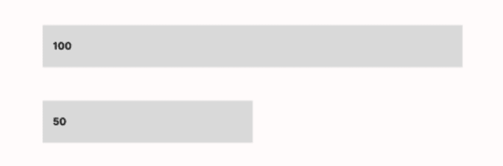
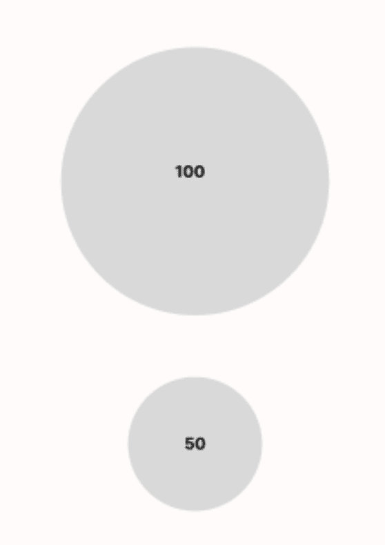
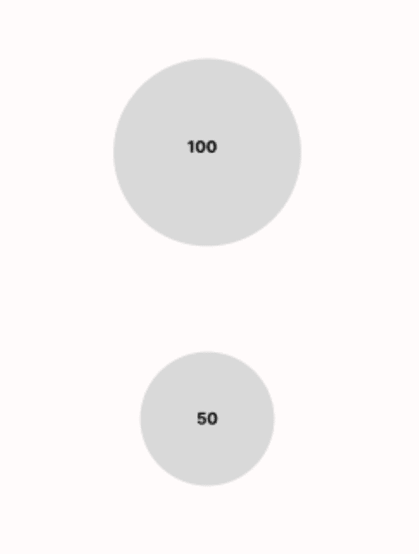
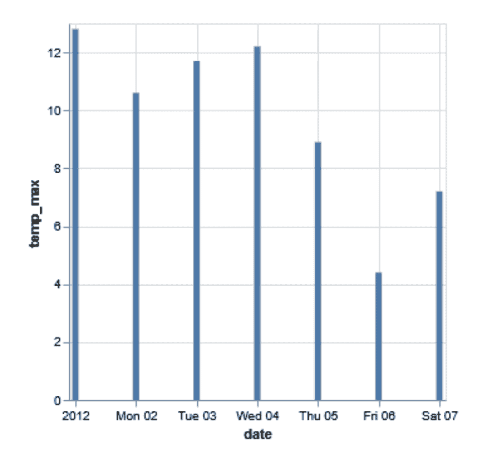
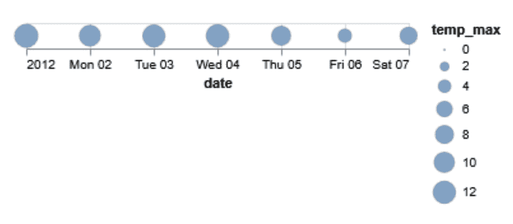
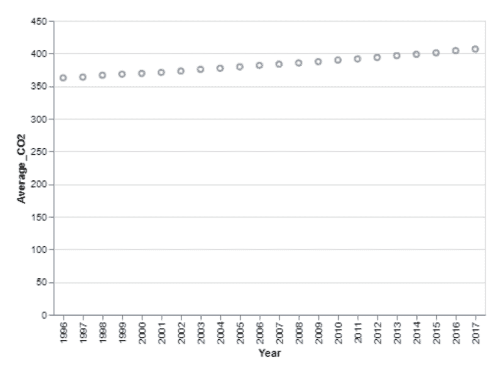
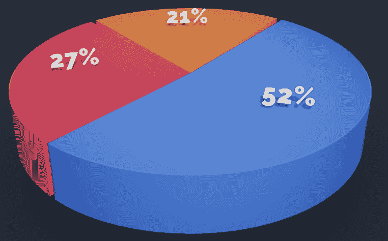
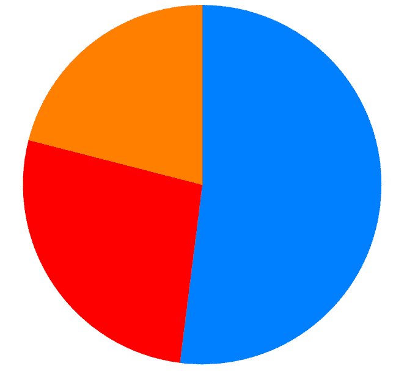

# 欺骗性数据的危险——令人困惑的图表和误导性的标题

> 原文：[`towardsdatascience.com/the-dangers-of-deceptive-data-confusing-charts-and-misleading-headlines/`](https://towardsdatascience.com/the-dangers-of-deceptive-data-confusing-charts-and-misleading-headlines/)

“你不需要成为专家就能欺骗某人，尽管你可能需要一些专业知识来可靠地识别自己是否被欺骗。”

当我和我的合著者在华盛顿大学教授的数据可视化课程中关于欺骗视觉化的季度课程开始时，他向学生们强调了上述观点。随着现代技术的出现，关于数据的漂亮且令人信服的声明比以往任何时候都更容易。任何人都可以制作出看似合格的东西，但其中包含的疏忽使其不准确甚至有害。此外，还有一些恶意的行为者积极地*想要*欺骗你，并且他们研究了一些最好的欺骗方法。

我经常以一个小玩笑开始这次讲座，严肃地看着我的学生们，并提出两个问题：

1.  “如果有人对你进行煤气灯效应，这是好事吗？”

1.  在一阵普遍的困惑和同意煤气灯效应确实不好之后，我问第二个问题：“确保没有人再对你进行煤气灯效应的最佳方法是什么？”

学生们通常会思考第二个问题更长一段时间，然后笑一笑，意识到答案：*是学习人们如何进行煤气灯效应的第一步*。不是为了利用他人，而是为了防止他人利用你。

在虚假信息和错误信息领域也是如此。那些想要用数据误导的人拥有各种工具，从高速互联网到社交媒体，最近还有生成式 AI 和大型语言模型。为了保护自己不被误导，你需要学习他们的伎俩。

在这篇文章中，我从我在华盛顿大学教授的数据可视化课程中关于欺骗的单元中提取了关键思想——来源于阿尔贝托·卡洛的杰出著作《图表如何说谎》——并将其扩展为关于欺骗和数据的一些一般原则。我的希望是你们阅读它，吸收它，并带着它去武装自己，以抵御那些被数据武装的恶意之人所传播的谎言的冲击。

## 人类无法解读面积

至少，不如我们解读其他视觉线索那么好。让我们用一个例子来说明这一点。假设我们有一个极其简单的数值数据集；它是一维的，只包含两个值：50 和 100。一种表示它的视觉方式是通过条形的长度，如下所示：

这与基础数据是一致的。长度是一个一维量，我们将其加倍以表示价值的加倍。但如果我们想用圆形来表示相同的数据呢？嗯，圆形并不是由长度或宽度定义的。一个选择是将半径加倍：

嗯。第一个圆的半径是 100 像素，第二个圆的半径是 50 像素——如果我们想将半径加倍，这在技术上来说是正确的。然而，由于面积是按照这种方式计算的（πr²），我们的面积已经远远超过了加倍。那么如果我们只这样做，看起来更直观，会怎样呢？这里是一个修订版本：

现在我们有一个不同的问题。较大的圆在数学上是较小圆面积的两倍，但它不再“看起来”是这样。换句话说，即使这是一个对加倍数量进行视觉准确比较的图表，人眼也很难感知到这一点。

这里的问题是首先尝试使用面积作为视觉标记。这并不一定是“错误”的，但它很令人困惑。我们正在增加一个一维值，但面积是一个二维量。对于人眼来说，总是很难准确解释，尤其是在与条形这样的更自然的视觉表示进行比较时。

现在，这看起来可能不是什么大问题——但让我们看看当你将这个应用到实际数据集时会发生什么。下面，我粘贴了两张我在 Altair（一个基于 Python 的可视化包）中制作的图表的图片。每个图表都显示了 2012 年美国西雅图第一周的最高温度（摄氏度）。第一个图表使用条形长度进行比较，第二个使用圆面积。

哪一个更容易看出差异？图例在第二个图表中有所帮助，但如果我们说实话，这是一个失败的努力。即使在数据如此有限的情况下，使用条形进行精确比较也要容易得多。

记住，可视化的目的是阐明数据——使隐藏的趋势更容易被普通人看到。为了实现这个目标，最好使用简化这一区分过程的视觉线索。

## 谨防政治标题（无论方向）

我有时在第四周左右的作业中向学生提出一个小问题。作业主要涉及在 Python 中生成可视化——但最后一个问题，我给他们提供了一个我自己生成的图表，并附带一个问题：

**问题：上面的图表有一个非常明显的问题，这是一个在数据可视化中不可原谅的错误。那是什么？**

大多数人认为这与坐标轴、标记或其他视觉方面有关，经常建议改进，比如填充圆圈或使坐标轴标签更具有信息性。这些建议是好的，但不是最紧迫的。

上图中最不完善的特点（或者说更确切地说是缺少了这一点）是*缺少标题*。标题对于一个有效的数据可视化至关重要。没有它，我们怎么知道这个可视化是关于什么的呢？目前，我们只能推测它可能与多年间的二氧化碳水平有关，但这并不算多。

许多人都认为这个要求过于严格，他们认为可视化通常是在上下文中被理解的，作为一篇文章或新闻稿或其他伴随文本的一部分。不幸的是，这种思维方式过于理想化；在现实中，一个可视化必须能够独立存在，因为它往往是人们唯一关注的东西——在社会媒体爆炸性事件中，往往是唯一被广泛分享的东西。因此，它应该有一个标题来解释自己。

当然，这个子节标题告诉你要对这样的标题保持警惕。这是真的。虽然它们是必要的，但它们是一把双刃剑。由于可视化设计师知道观众会关注标题，恶意的人也可以利用它来引导人们走向不准确的方向。让我们看看一个例子：

> 是时候结束连锁移民了：[`t.co/kad5A8Slw7`](https://t.co/kad5A8Slw7) [图片链接](https://t.co/735JzAZIUa)
> 
> — 白宫 45 存档 (@WhiteHouse45) [2017 年 12 月 18 日](https://twitter.com/WhiteHouse45/status/942789560941064193?ref_src=twsrc%5Etfw)

以上是[白宫官方推特账号在 2017 年分享的一张图片](http://“You don’t have to be an expert to deceive someone, though you might need some expertise to reliably recognize when you are being deceived.”  When my co-instructor and I start our quarterly lesson on deceptive visualizations for the data visualization course we teach at the University of Washington, he emphasizes the point above to our students. With the advent of modern technology, developing pretty and convincing claims about data is easier than ever. Anyone can make something that seems passable, but contains oversights that render it inaccurate and even harmful. Furthermore, there are also malicious actors who actively want to deceive you, and who have studied some of the best ways to do it.  I often start this lecture with a bit of a quip, looking seriously at my students and asking two questions:  “Is it a good thing if someone is gaslighting you?” After the general murmur of confusion followed by agreement that gaslighting is indeed bad, I ask the second question: “What’s the best way to ensure no one ever gaslights you?”  The students generally ponder that second question for a bit longer, before chuckling a bit and realizing the answer: It’s to learn how people gaslight in the first place. Not so you can take advantage of others, but so you can prevent others from taking advantage of you.  The same applies in the realm of misinformation and disinformation. People who want to mislead with data are empowered with a host of tools, from high-speed internet to social media to, most recently, generative AI and large language models. To protect yourself from being misled, you need to learn their tricks.  In this article, I’ve taken the key ideas from my data visualization course’s unit on deception–drawn from Alberto Cairo’s excellent book How Charts Lie–and broadened them into some general principles about deception and data. My hope is that you read it, internalize it, and take it with you to arm yourself against the onslaught of lies perpetuated by ill-intentioned people powered with data.  Humans Cannot Interpret Area At least, not as well as we interpret other visual cues. Let’s illustrate this with an example. Say we have an extremely simple numerical data set; it’s one dimensional and consists of just two values: 50 and 100\. One way to represent this visually is via the length of bars, as follows:    This is true to the underlying data. Length is a one-dimensional quantity, and we have doubled it in order to indicate a doubling of value. But what happens if we want to represent the same data with circles? Well, circles aren’t really defined by a length or width. One option is to double the radius:    Hmm. The first circle has a radius of 100 pixels, and the second has a radius of 50 pixels–so this is technically correct if we wanted to double the radius. However, because of the way that area is calculated (πr²), we’ve way more than doubled the area. So what if we tried just doing that, since it seems more visually accurate? Here is a revised version:    Now we have a different problem. The larger circle is mathematically twice the area of the smaller one, but it no longer looks that way. In other words, even though it is a visually accurate comparison of a doubled quantity, human eyes have difficulty perceiving it.  The issue here is trying to use area as a visual marker in the first place. It’s not necessarily wrong, but it is confusing. We’re increasing a one-dimensional value, but area is a two-dimensional quantity. To the human eye, it’s always going to be difficult to interpret accurately, especially when compared with a more natural visual representation like bars.  Now, this may seem like it’s not a huge deal–but let’s take a look at what happens when you extend this to an actual data set. Below, I’ve pasted two images of charts I made in Altair (a Python-based visualization package). Each chart shows the maximum temperature (in Celsius) during the first week of 2012 in Seattle, USA. The first one uses bar lengths to make the comparison, and the second uses circle areas.      Which one makes it easier to see the differences? The legend helps in the second one, but if we’re being honest, it’s a lost cause. It is much easier to make precise comparisons with the bars, even in a setting where we have such limited data.  Remember that the point of a visualization is to clarify data–to make hidden trends easier to see for the average person. To achieve this goal, it’s best to use visual cues that simplify the process of making that distinction.  Beware Political Headlines (In Any Direction) There is a small trick question I sometimes ask my students on a homework assignment around the fourth week of class. The assignment mostly involves generating visualizations in Python–but for the last question, I give them a chart I myself generated accompanied by a single question:    Question: There is one thing egregiously wrong with the chart above, an unforgivable error in data visualization. What is it?  Most think it has something to do with the axes, marks, or some other visual aspect, often suggesting improvements like filling in the circles or making the axis labels more informative. Those are fine suggestions, but not the most pressing.  The most flawed trait (or lack thereof, rather) in the chart above is the missing title. A title is crucial to an effective data visualization. Without it, how are we supposed to know what this visualization is even about? As of now, we can only ascertain that it must vaguely have something to do with carbon dioxide levels across a span of years. That isn’t much.  Many folks, feeling this requirement is too stringent, argue that a visualization is often meant to be understood in context, as part of a larger article or press release or other accompanying piece of text. Unfortunately, this line of thinking is far too idealistic; in reality, a visualization must stand alone, because it will often be the only thing people look at–and in social media blow-up cases, the only thing that gets shared widely. As a result, it should have a title to explain itself.  Of course, the title of this very subsection tells you to be wary of such headlines. That is true. While they are necessary, they are a double-edged sword. Since visualization designers know viewers will pay attention to the title, ill-meaning ones can also use it to sway people in less-than-accurate directions. Let’s look at an example:    The above is a picture shared by the White House’s public Twitter account in 2017\. The picture is also referenced by Alberto Cairo in his book, which emphasizes many of the points I will now make.  First things first. The word “chain migration,” referring to what is formally known as family-based migration (where an immigrant may sponsor family members to come to the United States), has been criticized by many who argue that it is needlessly aggressive and makes legal immigrants sound threatening for no reason.  Of course, politics is by its very nature divisive, and it is possible for any side to make a heated argument. The primary issue here is actually a data-related one–specifically, what the use of the word “chain” implies in the context of the chart shared with the tweet. “Chain” migration seems to indicate that people can immigrate one after the other, in a seemingly endless stream, uninhibited and unperturbed by the distance of family relations. The reality, of course, is that a single immigrant can mostly just sponsor immediate family members, and even that takes quite a bit of time. But when one reads the phrase “chain migration” and then immediately looks at a seemingly sensible chart depicting it, it is easy to believe that an individual can in fact spawn additional immigrants at a base-3 exponential growth rate.  That is the issue with any kind of political headline–it makes it far too easy to conceal dishonest, inaccurate workings with actual data processing, analysis, and visualization.  There is no data underlying the chart above. None. Zero. It is completely random, and that is not okay for a chart that is purposefully made to appear as if it is showing something meaningful and quantitative.  As a fun little rabbit hole to go down which highlights the dangers of political headlining within data, here is a link to a Twitter account that posts the most absurd graphics shown on the U.S. Congress floor: FloorCharts.  Don’t Use 3D. Please. I’ll end this article on a slightly lighter topic–but still an important one. Under no circumstances–none at all–should you ever utilize a 3D chart. And if you’re in the shoes of the viewer–that is, if you’re looking at a 3D pie chart made by someone else–don’t trust it.  The reason for this is simple, and connects back to what I discussed with circles and rectangles: a third dimension severely distorts the actuality behind what are usually one-dimensional measures. Area was already hard to interpret–how well do you really think the human eye does with volume?  Here is a 3D pie chart I generated with random numbers:   Now, here is the exact same pie chart, but in two dimensions:     Notice how the blue is not quite as dominant as the 3D version seems to suggest, and that the red and orange are closer to one another in size than originally portrayed. I also removed the percentage labels intentionally (technically bad practice) in order to emphasize how even with the labels present in the first one, our eyes automatically pay more attention to the more drastic visual differences. If you’re reading this article with an analytical eye, perhaps you think it doesn’t make that much of a difference. But the fact is, you’ll often see such charts in the news or on social media, and a quick glance is all they’ll ever get.  It is important to ensure that the story told by that quick glance is a truthful one.  Final Thoughts Data science is often touted as the perfect synthesis of statistics, computing, and society, a way to obtain and share deep and meaningful insights about an information-heavy world. This is true–but as the capacity to widely share such insights expands, so must our general ability to interpret them accurately. It is my hope that in light of that, you have found this primer to be helpful.  Stay tuned for Part 2, in which I’ll talk about a few deceptive techniques a bit more involved in nature–including base proportions, (un)trustworthy statistical measures, and measures of correlation.  In the meantime, try not to get deceived.)。这张图片也在阿尔贝托·开罗的书中被引用，他强调了许多我接下来要阐述的观点。

首先，让我们来谈谈“连锁移民”这个词，它正式上被称为基于家庭的移民（即移民可以担保家庭成员来美国），这个词受到了许多人的批评，他们认为这是不必要的侵略性，并且让合法移民看起来毫无理由地具有威胁性。

当然，政治的本质是分裂的，任何一方都可能进行激烈的辩论。这里的主要问题实际上是一个数据相关的问题——具体来说，图表中“连锁”一词的使用意味着什么。连锁移民似乎表明人们可以一个接一个地移民，似乎是一个没有尽头、不受家庭关系距离限制的连续流。但现实情况是，[单个移民主要只能担保直系家庭成员，而且这需要相当长的时间](https://citizenpath.com/family-based-immigration-united-states/)。但是，当人们读到“连锁移民”这个词，然后立即看到似乎合理的描述它的图表时，很容易相信个人实际上可以以 3 的指数增长速率产生额外的移民。

**那就是任何政治标题的问题——它使得隐藏不诚实、不准确的数据处理、分析和可视化工作变得过于容易**。

上面的图表**没有任何**数据支持。没有。零。它是完全随机的，对于一个故意制作成看似展示有意义和定量数据的图表来说，这是不合适的。

作为一个小小的趣味性陷阱，它突出了数据中政治标题的危险性，这里有一个链接到[FloorCharts](https://x.com/FloorCharts)，这是一个在推特上发布美国国会大堂上最荒谬图形的账户。

## 请不要使用 3D。真的。

我将以一个稍微轻松但仍然重要的主题结束这篇文章。在任何情况下——绝对不要——你应该使用 3D 图表。如果你是观众——也就是说，如果你在查看别人制作的 3D 饼图——不要相信它。

这个原因很简单，并且与我在圆形和矩形中讨论的内容相关：第三个维度**严重**扭曲了通常一维度量背后的实际情况。面积已经很难解释——你真的认为人眼对体积的感知有多好？

这里是一个我用随机数字[生成的](https://3dpie.peterbeshai.com/)3D 饼图：

现在，这里是完全相同的饼图，但只有两个维度：

注意蓝色并不像 3D 版本所暗示的那样占主导地位，以及红色和橙色在大小上比最初描绘的更接近。我还故意移除了百分比标签（技术上是不良做法），为了强调即使第一个图表中有标签，我们的眼睛也会自动更多地关注更明显的视觉差异。如果你用分析的眼光阅读这篇文章，也许你认为这并没有太大的区别。但事实是，你经常会看到这样的图表在新闻或社交媒体上，而且他们只会得到一次快速浏览。

确保那快速浏览所讲述的故事是真实的，这一点很重要。

## 最后的想法

数据科学常被吹捧为统计学、计算和社会的完美融合，是一种获取和分享关于信息密集型世界的深刻和有意义的见解的方法。这是真的——但随着广泛分享此类见解的能力不断扩大，我们准确解释它们的一般能力也必须提高。我希望能因此找到这个入门指南是有帮助的。

请继续关注第二部分，我将讨论一些在本质上更为复杂的欺骗技巧——包括基础比例、（不）可信的统计指标和相关性指标。

同时，尽量不要被欺骗。
