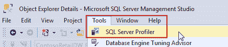
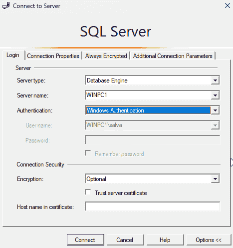
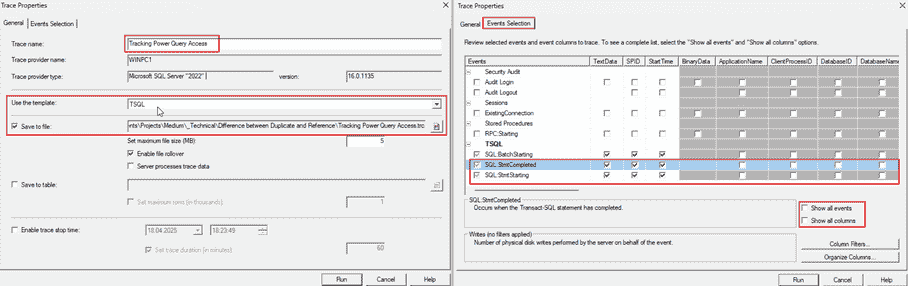
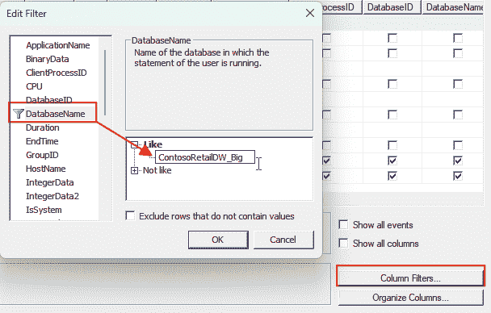
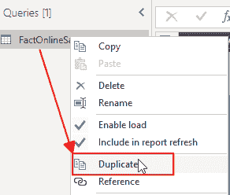
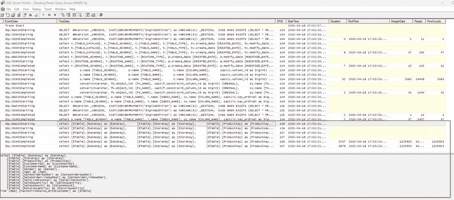
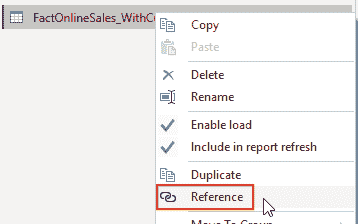
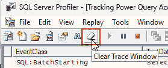
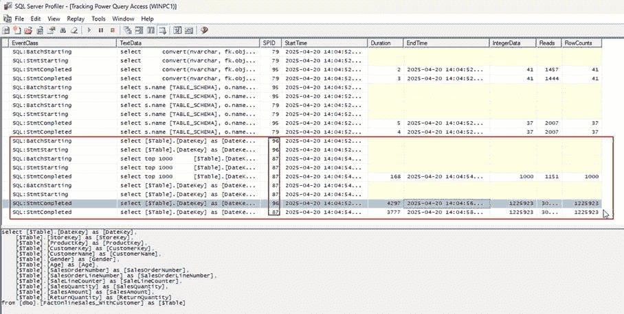
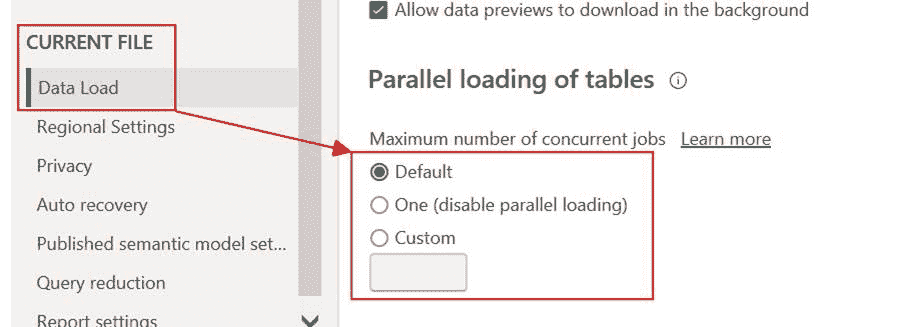

# Power Query 中重复和引用的区别

> 原文：[`towardsdatascience.com/the-difference-between-duplicate-and-reference-in-power-query/`](https://towardsdatascience.com/the-difference-between-duplicate-and-reference-in-power-query/)

*<mdspan datatext="el1746126525957" class="mdspan-comment">有时</mdspan>我们必须将相同的数据副本加载到 Power Query 中。Power Query 提供了两种方法来获取相同的数据两次：重复和引用。让我们看看这两个功能之间的区别以及何时使用其中一个而不是另一个。*

## 简介

我可能需要将相同的数据两次加载到 Power Query 中，然后加载到 Power BI 中。

这可能发生在必须拆分数据列或对数据进行其他转换时，或者当需要以两种不同的方式从表中提取数据时。

Power Query 提供了两个功能来完成这项任务：

+   重复：

    这会复制表的 M-代码并创建一个新的表。

+   引用：

    这会将表的结果创建为一个新的表。对源表所做的所有更改在引用表中也都可见。

你可能会争辩说，当我使用引用时，数据只从源读取一次，因为我将一个表的结果重复用于不同的输出。

这就是本文要讨论的内容：这是真的还是假的？

## 准备工具

我使用 SQL Server 作为数据源，SQL Profiler 来分析数据库中发生的事情。

SQL Profiler 是一个可以拦截 SQL Server 实例上所有流量的工具。

幸运的是，SQL Profiler 是 SQL Server Management Studio (SSMS) 的一部分，并且免费使用。

您可以在 Medium 上阅读这篇关于 SQL Server Profiler 的更详细描述：[掌握 SQL Server Profiler：解锁数据库洞察的逐步指南](https://medium.com/@dotnetfullstackdev/mastering-sql-server-profiler-a-step-by-step-guide-to-unlocking-database-insights-c51235ebdde0)

分析这两个功能行为的另一种方法是 Power Query 诊断。

我在 Medium 上写了关于 Power Query 诊断的文章：[使用加载跟踪分析 Power Query](https://medium.com/microsoft-power-bi/analyzing-power-query-with-load-traces-0ccb2cc843a3)

我邀请您阅读它以了解更多关于这个工具的信息。

但让我们回到 SQL Server Profiler，以及如何启动它并为其特定场景做准备。

我可以从开始菜单或直接从 SSMS 启动 SQL Profiler：

图 1 – 从 SSMS 启动 SQL Profiler（图由作者提供）

启动后，我必须选择连接到我的本地 SQL Server 实例：

图 2 – 连接到 SQL Server（图由作者提供）

接下来，我设置跟踪。

1.  我给它一个名称并选择 TSQL 模板来跟踪来自 Power Query 的查询。

1.  我激活了“保存到文件”选项并选择跟踪文件的文件夹。

    如果我想的话，我可以在 Profiler 中打开这个跟踪文件并更详细地查看它。

1.  我切换到第二页，“事件选择”。

1.  我激活了两个选项“显示所有事件”。

1.  在所有事件列表中，我选择 SQL:StmtStarting 和 SQL:StmtCompleted 以获取查询的 SQL 代码。

1.  我取消选择所有事件，除了以下三个 SQL。

1.  我取消选择大多数列，除了跟踪查询文本、开始和结束时间、持续时间和其他统计信息。

这就是设置后的样子（“显示所有事件”选项已禁用）：

图 3 – SQL Profiler 中的跟踪设置（图由作者）

最后，我在我的源数据库上设置了一个过滤器，以跟踪该数据库上的流量：

图 4 – 在我的源数据库 ContosoRetailDW_Big 上设置过滤器（图由作者）

没有这个过滤器，我将获取所有数据库上的流量。对于生产实例来说，这将是压倒性的，因为会有来自其他应用程序和用户的很多流量。我甚至可能添加一个过滤器来限制跟踪只查看来自我的 NTUserName（我的 Windows 用户 ID）的流量，以排除数据库上的所有其他流量。

现在，我点击运行以开始跟踪。

## 将数据导入 Power Query

我使用数据库中名为 FactOnlineSales_withCustomer 的视图作为我的源。

我将这个视图导入 Power Query，不进行任何其他转换步骤。这将导致 Power Query 从数据库中通过简单的 SQL 查询获取数据。

我可以在跟踪日志中轻松找到这个查询。

## 创建一个副本并检查发生了什么。

在将数据导入 Power Query 后，我创建了导入表的副本并将其数据加载到 Power BI 中：

图 5 – 在 Power Query 中创建表的副本（图由作者）

如预期的那样，我在 SQL Profiler 中看到了相同的查询执行了两次：

图 6 – Duplicate 的跟踪结果（图由作者）

你可以看到数据被检索了两次，行数相同（跟踪的最后两行）。

我预期会发生这种情况，因为 Duplicate 会复制 M-Code 来创建一个新的表。

另一个关键列是 SPID。这是 SQL Server 实例上的内部会话 ID。两个不同的 SPID 表明 Power Query 开始分别连接两次以获取数据。

当分析引用表的流量时，这个列将非常重要。

## 创建一个引用并检查发生了什么。

现在，我尝试引用功能。

我首先删除了“FactOnlineSales_WithCustomer_Duplicate”表，并从原始的“FactOnlineSales_WithCustomer”表创建了一个引用：

图 7 – 删除复制的表后，我从原始表创建引用（图由作者绘制）

在 SQL Profiler 中，我可以通过点击橡皮擦按钮清除跟踪来清除视图，以仅查看新条目（这将不会从保存的跟踪文件中删除任何数据）：

图 8 – 清除跟踪窗口以仅查看新条目（图由作者绘制）

在刷新 Power BI 中的数据后，我在 SQL Profiler 中得到了这个结果：

图 9 – 刷新原始表和引用表中的数据后 SQL Profiler 的结果（图由作者绘制）

令人惊讶的是，数据库中读取了两次数据。

我可以看到确实有两个连接，因为列 SPID（会话 ID）在两个 SQL:StmtCompleted 条目中有两个不同的数字。

这意味着，从加载流量角度来看，复制和引用表之间没有区别。

但当两者都导致源上的相同流量时，为什么我应该在 Power Query 中使用复制而不是引用？

## 当使用引用和复制时

一些时间以前，我写了一篇关于使用 Power Query 将平面表转换为星型模式的文章：[使用 Power Query 将平面表转换为良好的数据模型](https://towardsdatascience.com/converting-a-flat-table-to-a-good-data-model-in-power-query-46208215f17a/)

在本文中，我描述了当通过引用现有表创建新表时，某些操作是不可能的。

例如，Power Query 不允许合并引用表与原始表，因为存在循环引用。

在这种情况下，我必须复制原始表。

这是因为引用表始终基于被引用表的最后一步。

这是 Power Query 中“复制”和“引用”之间的关键区别：

+   复制是一个全新的加载，不依赖于原始表。原始表的更改不会影响复制的表。

+   引用表基于被引用表的结果。因此，应用于引用表的更改将自动应用于引用表。

    更准确地说，更改并未应用，但由于引用表的变化，输入表发生了变化。

但是，当你需要从原始表中提取子集而不更改原始表时，引用是最佳选择，尤其是在始终需要从引用表中获取输出时至关重要。

如果你想要来自同一源但不想将原始表的变化应用到新表中的表，那么你必须复制原始表。

请注意，复制意味着加载逻辑的复制。这意味着当你对原始表应用更改时，你可能还需要将逻辑复制到复制的表中。

## 加载过程中的潜在冲突

另一个潜在问题是，在从某些源加载数据时可能会发生加载冲突。Excel 就是这些可能引起问题的源之一。

问题根源在于 Power Query 试图并行加载数据。某些源无法处理并行连接。

在这种情况下，你必须更改一个参数以避免并行加载：

图 10 – 设置并行加载的参数。你可能需要将其设置为“一个（禁用并行加载）”以完全关闭并行加载（图由作者提供）

默认值是四。

如果出现问题，你可能需要设置一个较低的定制值或将它设置为“一个（禁用并行加载）”以避免任何问题。

## 结论

在 Power Query 中，“复制”和“引用”在加载数据性能或网络流量方面没有区别。

两者都使用单独的连接独立从源加载数据。

因此，我驳斥了“引用”可以提高加载数据性能的神话。

然而，了解这两个特性的区别是至关重要的，因为它们在加载数据和转换数据时提供了不同的可能性。

无论如何，当从关系型数据库加载数据时，我会为两个表创建两个查询或两个视图，而不是将任何转换卸载到 Power Query。

根据罗氏数据转换法则：

*数据应尽可能在上游进行转换，在必要时尽可能在下游进行转换。*

但当加载文本、Excel 文件或其他我无法发送查询以获取所需数据的源时，我必须根据所需结果使用“复制”或“引用”。

## 参考文献

如同我之前的文章，我使用 Contoso 样本数据集。您可以从微软[这里](https://www.microsoft.com/en-us/download/details.aspx?id=18279)免费下载 ContosoRetailDW 数据集。

根据本文件所述，Contoso 数据可以在 MIT 许可下自由使用。[在此处](https://github.com/microsoft/Power-BI-Embedded-Contoso-Sales-Demo)。

我更改了数据集以将数据转移到当代日期。
