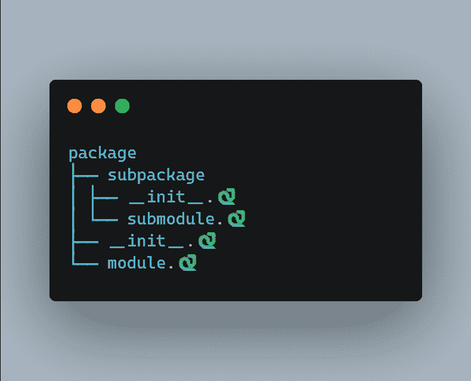
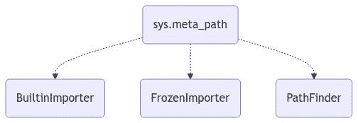
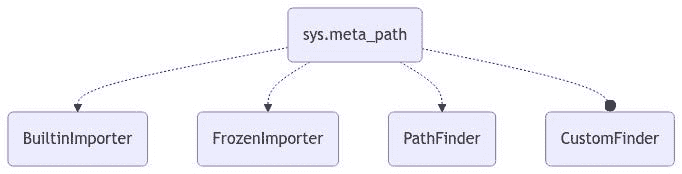
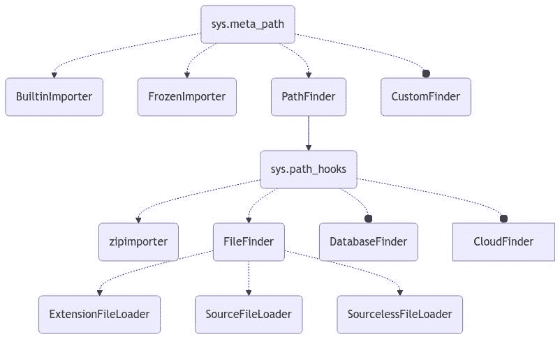

# `.🐍 扩展名现在在 Python 中成了一件事？`

> 原文：[`towardsdatascience.com/the-extension-is-now-a-thing-in-python-9fd6c500e2e8/`](https://towardsdatascience.com/the-extension-is-now-a-thing-in-python-9fd6c500e2e8/)



由 [@carbon_app](https://twitter.com/carbon_app) 创建

* * *

多年来，Python 开发者一直暗自希望能摆脱 `.py` 扩展名，拥抱一些更……爬行动物的 🐍 。虽然 Mojo 可以使用酷炫的 `.🔥` 扩展名，但 Python 一直停留在表情符号的黑暗时代。

但你知道吗？如果我说 2025 年可能是表情符号起义的一年呢？虽然 CPython 可能不会正式支持表情符号文件扩展名（至少现在还没有！），但 Python 导入系统的美妙之处在于我们可以扩展它来处理我们心中所渴望的任何疯狂而奇妙的文件扩展名。

在这篇文章中，我将向您展示如何扩展 Python 的导入系统，并最终给你的脚本带来应得的表情符号风格。让我们开始吧！🚀

* * *

## 1\. 安装 `emojdule` 🐍 ✨

想要导入带有表情符号扩展名的 Python 文件？这比你想象的要简单！只需安装 `emojdule` 包：

```py
pip install emojdule

# Or poetry
poetry add emojdule

# Or uv
uv add emojdule
uv pip install emojdule
```

就这样！🎉 `emojdule` 自动集成到 Python 的导入系统中，让你可以像平常一样导入带有表情符号扩展名的文件。

**💡 如果您时间紧迫？** 跳到第三部分查看快速示例！

**⚠️ 警告：** 这纯粹是为了好玩，请不要在生产环境中使用（除非你喜欢让自己未来的自己感到困惑）。😅

* * *

## 2\. 扩展 Python 导入系统 🛠️

Python 的导入系统非常灵活，`emojdule` 通过提供 **自定义导入器** 充分利用了这一点。但在深入之前，让我们先来了解一下 Python 的导入机制是如何工作的。

### 🔍 导入机制

Python 的导入系统建立在几个关键组件之上：

+   **查找器：** 一个 **查找器** 定位模块（例如，在文件系统中搜索 `.py` 文件）。

+   **加载器：** 一个 **加载器** 执行模块的代码并创建相应的 **模块对象**。

+   **元路径**：Python 用于定位模块的查找器对象列表。

默认情况下，Python 内置了 **三个** 查找器：



图片由作者提供

下面是它们的作用：

+   **BuiltinImporter**：加载 **内置** 模块（例如，`sys`，`math`）。

+   **FrozenImporter**：加载 **冻结** 的模块（预编译的字节码嵌入到 Python 中）。

+   **PathFinder**：主要的查找器，负责搜索 **导入路径** 并加载你的 `.py` 文件。

由于 `PathFinder` 处理标准模块导入，我们可以通过向 `sys.meta_path` 添加一个 **自定义查找器** 来扩展 Python 的导入系统。

* * *

## 3\. 创建自定义导入钩子 🎩

现在我们已经了解了 Python 的导入系统是如何工作的，让我们 **构建自己的查找器和加载器** 来拦截导入并修改模块行为！

### 🕵️ 创建一个查找器

**查找器**负责**定位**模块。要创建一个查找器，我们定义一个具有 `find_spec` 方法的类：

+   如果找到模块，则返回一个 **`ModuleSpec`** 对象。

+   如果找不到，则返回 `None`，它将允许 Python **移动到下一个导入钩子**。

让我们实现一个**自定义查找器**，它拦截特定模块的导入：

```py
import importlib.abc
import importlib.util
from importlib.machinery import PathFinder

class CustomFinder(importlib.abc.MetaPathFinder):
    def __init__(self, intercepted_module) -> None:
        self.intercepted_module = intercepted_module
        self.finder = PathFinder()
        super().__init__()

    def find_spec(self, fullname, path, target=None):
        if not fullname.startswith(self.intercepted_module): 
            return None  # Move to the next finder

        print(f"Intercepting import: {fullname}")
        spec = self.finder.find_spec(fullname, path, target)
        if spec is None:
            return None
        spec.loader = CustomLoader()
        return spec
```

现在，任何尝试**导入与 `intercepted_module` 匹配的模块**的尝试都将被我们的自定义查找器拦截。

### ⚡创建一个加载器

**加载器**负责**执行**模块代码。我们的查找器引用了 `CustomLoader`，所以让我们接下来创建它：

要实现加载器，我们需要：

+   `create_module(self, spec)` : 实例化一个新的模块对象。

+   `exec_module(self, module)` : 执行模块的代码。

这是我们的自定义加载器在起作用：

```py
class CustomLoader(importlib.abc.Loader):
    def create_module(self, spec):
        return None  # Use default module creation

    def exec_module(self, module):
        print(f"Executing module: {module.__name__}")

        # Read the module's source code
        with open(module.__spec__.origin, "r") as f:
            source_code = f.read()

        # Modify the source code (add logging)
        modified_code = 'print("Custom Hook: Module Loaded!")n' + source_code

        # Execute the modified code within the module's namespace
        exec(modified_code, module.__dict__)
```

现在，当导入模块时，我们的加载器：

1.  **读取其源代码**。

1.  **修改**它（在这种情况下，添加一个日志消息）。

1.  **执行**修改后的代码。

### 🛠️ 安装自定义钩子

我们有我们的**查找器和加载器**，但**Python 不会使用它们，直到我们在 `sys.meta_path` 中注册它们**：



图片由作者提供

```py
import sys

# Register the custom finder to intercept 'json' imports
sys.meta_path.insert(0, CustomFinder("json"))

# Import the target module (should trigger the hook)
import json
```

### 🏆 输出

当你导入 `json` 时，这是会发生的事情：

```py
Intercepting import: json
Executing module: json
Custom Hook: Module Loaded!
Intercepting import: json.decoder
Executing module: json.decoder
Custom Hook: Module Loaded!
Intercepting import: json.scanner
Executing module: json.scanner
Custom Hook: Module Loaded!
Intercepting import: json.encoder
Executing module: json.encoder
Custom Hook: Module Loaded!
```

由于 `json` 有子模块（`decoder`、`scanner`、`encoder`），我们的查找器**也会拦截它们**！

我们的 `CustomFinder` **钩入导入系统**，在默认导入器有机会之前拦截模块。

* * *

### 4. 示例仓库 🎨

让我们看看 `emojdule` 的实际效果！ 🚀

### 📁 设置您的表情符号模块

1.  **为您的模块创建一个新的目录**：

```py
mkdir my_emoji_module
cd my_emoji_module
```

1.  **添加一个具有表情符号扩展名的 Python 文件**：

创建一个名为 **`my_module.🐍`** 的文件，并添加以下代码：

```py
def hello_world():
    print("Hello, World!")
```

### 🐍 导入表情符号模块

现在，随着 `emojdule` 的安装，你可以**像导入常规 Python 文件一样导入你的表情符号命名的模块**：

```py
import my_module

my_module.hello_world()
```

### 🏆 输出

```py
Hello, World!
```

是的，没错——Python 现在是**表情符号兼容的**（好吧，有点意思 😉）。

🔗 **在此处查看完整示例代码：** [GitHub 仓库](https://github.com/hmiladhia/blog_posts_code/blob/main/posts/000_emojdule)

* * *

## 5. 另一种类型的导入钩子 🔍

在上一节中，我们探讨了**元钩子**，但 Python 的导入系统中还有另一个强大的工具：

### 🏗️ 导入路径钩子

与修改 `sys.meta_path` 不同，**导入路径钩子**扩展 `PathFinder` 以在**自定义位置**搜索模块。

通常，`PathFinder` 在 `sys.path` 中列出的**目录**中搜索模块。但如果我们把 `sys.path` 中的内容替换为**URL**呢？或者**数据库查询**？甚至**指向 PyPI 的链接**？

### 🛠️ 编写自定义导入路径钩子

要创建一个导入路径钩子：

1.  **定义一个自定义的 "实体" 查找器**（用于处理非传统路径）。

1.  **在 `sys.path_hooks` 中注册它**，这样 `PathFinder` 就会知道它。

更多详情，请查看[官方 Python 文档](https://docs.python.org/3/reference/import.html#the-path-based-finder)。

### 🗺️ 导入路径钩子在 Python 中的位置



作者图片

下面是正在发生的事情：

+   `sys.path_hooks` 包含 **自定义导入查找器**。

+   `PathFinder` 使用 **这些钩子** 来定位模块。

### 🐍 `emojdule` 如何使用导入路径钩子

在幕后，`emojdule` 利用 **导入路径钩子** 来识别 `.🐍` 文件。以下是它的完整实现：

```py
import sys
from importlib.machinery import (
    SOURCE_SUFFIXES,
    FileFinder,
    EXTENSION_SUFFIXES,
    ExtensionFileLoader,
    SourceFileLoader,
    BYTECODE_SUFFIXES,
    SourcelessFileLoader,
)

def install() -> None:
    supported_loaders = [
        (ExtensionFileLoader, [*EXTENSION_SUFFIXES]),
        (SourceFileLoader, [*SOURCE_SUFFIXES, ".🐍  "]),  # Add support for .🐍   files!
        (SourcelessFileLoader, BYTECODE_SUFFIXES),
    ]

    # Register the custom FileFinder in sys.path_hooks
    sys.path_hooks.insert(1, FileFinder.path_hook(*supported_loaders))

    # Clear importer cache so changes take effect
    sys.path_importer_cache.clear()
```

* * *

## 结论 🎯

我们深入研究了 **调整 Python 的导入系统**，探讨了如何使用 `emojdule` 包导入带有 **emoji 扩展** 的模块。在这个过程中，我们：

✅ **构建了一个自定义导入器**。 ✅ **探索了元钩子和导入路径钩子** 以扩展 Python 的导入系统。 ✅ **创建了一个有趣的示例** 来展示其作用。

想要深入了解？查看 **官方 Python 文档** 了解更多导入系统魔法！

感谢您坚持看到这里。请保持安全，我们将在下一个故事中再见！

## 您可能还喜欢的其他文章

> [**这些方法将改变您使用 Pandas 的方式**](https://python.plainenglish.io/these-methods-will-change-how-you-use-pandas-921e4669271f)
> 
> [**这个装饰器将使 Python 速度提高 30 倍**](https://towardsdatascience.com/this-decorator-will-make-python-30-times-faster-715ca5a66d5f)
