# 高斯障碍分布

> 原文：[`towardsdatascience.com/the-gamma-hurdle-distribution/`](https://towardsdatascience.com/the-gamma-hurdle-distribution/)

**哪个结果更重要？**

这是一个常见的场景：进行了一项 A/B 测试，其中随机选择了一部分单位（例如客户）进行活动，并接受了治疗 A。另一部分样本被选中接受治疗 B。“A”可能是一种沟通或优惠，而“B”可能没有沟通或没有优惠。“A”可能是 10%的折扣，而“B”可能是 20%的折扣。两组，两种不同的治疗，其中 A 和 B 是两种离散的治疗，但并不排除大于 2 种治疗和连续治疗的可能性。

因此，活动开始运行，结果被公布。通过我们的后端系统，我们可以跟踪哪些单位采取了感兴趣的行动（例如，进行了购买）以及哪些没有。进一步地，对于那些采取了行动的，我们记录该行动的强度。一个常见的场景是我们可以跟踪购买金额，对于购买的人来说，这通常被称为平均订单金额或每个买家的收入指标。或者是一百个不同的名字，它们都意味着同一件事——对于购买的人来说，他们平均花费了多少？

对于某些用例，营销人员对前一个指标感兴趣——购买率。例如，我们是否通过治疗 A 或 B 在我们的获取活动中推动了更多（可能是首次）买家？有时，我们希望提高每个买家的收入，所以我们更重视后者。

然而，我们更感兴趣的是以成本效益的方式推动收入，我们真正关心的是活动产生的总体收入。治疗 A 或 B 推动了更多的收入吗？我们并不总是有平衡的样本量（可能由于成本或风险规避），所以我们把测量的收入除以每个组中接受治疗的人数（称为 N_A 和 N_B）。我们想要比较这两个组之间的这个指标，所以标准的对比方法很简单：

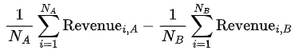

这只是治疗 A 的平均收入减去治疗 B 的平均收入，这里的平均值是在整个目标单位集合上取的，无论他们是否响应。其解释同样简单——从治疗 A 到治疗 B，平均每推广单位的收入增加了多少？

当然，这个最后的指标同时考虑了前两个因素：响应率乘以每个响应者的平均收入。

**不确定性？**

买家的支出有很大的变化，一个治疗组或另一个治疗组中的几笔大额购买可能会显著扭曲平均值。同样，样本变化也可能很大。因此，我们想要了解我们对这种平均值比较的信心程度，并量化观察到的差异的“显著性”。

因此，你将数据放入 t 检验中，并盯着 p 值。但是等等！不幸的是，对于营销人员来说，大多数时候购买率相对较低（有时非常低），因此有很多零收入值——通常是绝大多数。t 检验的假设可能被严重违反。非常大的样本量可能有所帮助，但有一种更原则性的方法来分析这些数据，这在多个方面都是有用的，将会被解释。

**示例数据集**

让我们从样本数据集开始，使事情变得实际。我最喜欢的直接营销数据集之一来自 KDD Cup 98。

```py
url = 'https://kdd.ics.uci.edu/databases/kddcup98/epsilon_mirror/cup98lrn.zip'
filename = 'cup98LRN.txt'

r = requests.get(url)
z = zipfile.ZipFile(io.BytesIO(r.content))
z.extractall()

pdf_data = pd.read_csv(filename, sep=',')
pdf_data = pdf_data.query('TARGET_D >=0')
pdf_data['TREATMENT'] =  np.where(pdf_data.RFA_2F >1,'A','B')
pdf_data['TREATED'] =  np.where(pdf_data.RFA_2F >1,1,0)
pdf_data['GT_0'] = np.where(pdf_data.TARGET_D >0,1,0)
pdf_data = pdf_data[['TREATMENT', 'TREATED', 'GT_0', 'TARGET_D']] 
```

在上面的代码片段中，我们正在下载一个 zip 文件（具体来说是学习数据集），提取它并将其读入 Pandas 数据框。这个数据集的性质是非营利组织通过直接邮寄寻求捐赠的活动历史。这个数据集中没有治疗变体，所以我们假装并基于过去捐赠的频率对数据集进行分段。我们称这个指标为*TREATMENT*（作为分类的，并创建*TREATED*作为二进制指标'A'）。这可以被视为一个随机对照试验的结果，其中一部分样本人口接受了优惠，而其余的人没有。我们跟踪每个个体并累计他们的捐赠金额。

因此，如果我们检查这个数据集，我们会看到大约有 95,000 个被推广的个人，在两种治疗方法中分布大致均匀：

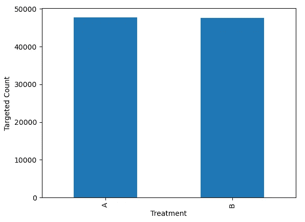

治疗 A 的响应率更高，但数据集中的总体响应率只有大约 5%。因此，我们有 95%的零值。

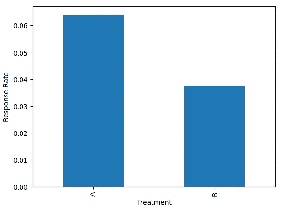

对于那些捐赠的人来说，治疗 A 似乎与较低的平均捐赠金额相关。

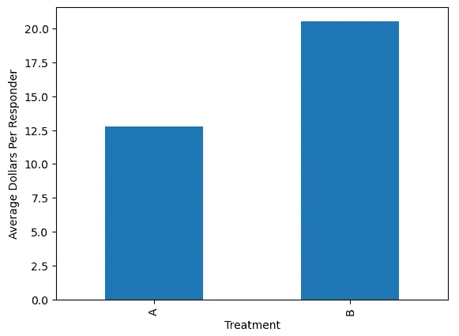

将所有被目标定位的人结合起来，治疗 A 似乎与更高的平均捐赠金额相关——更高的响应率抵消了响应者的较低捐赠金额，但幅度不大。

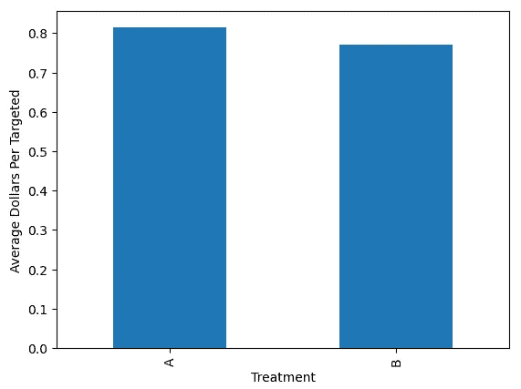

最后，这里显示了捐赠金额的直方图，合并了两种治疗方法，这说明了零值的集中和右偏斜。

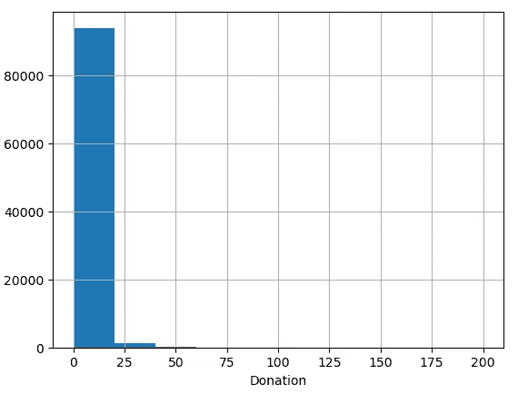

两个治疗组的数值总结量化了上述观察到的现象——虽然治疗 A 似乎显著提高了响应率，但接受治疗 A 的人在他们响应时平均捐赠较少。这两个措施的净效应，即我们最终追求的——每个目标单位的平均捐赠总额——似乎仍然高于治疗 A。我们对这一发现有多大的信心是本分析的主题。

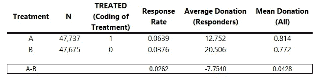

**伽马门槛**

一种用伽马障碍分布来模拟这些数据并从两个治疗在生成平均每目标单位捐款之间的差异来回答我们研究问题的方式是使用伽马障碍分布。类似于更为人所知的零膨胀泊松（ZIP）或负二项式（NB）分布，这是一个混合分布，其中一部分与零的质量相关，而在随机变量为正的情况下，另一部分是伽马密度函数。

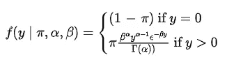

在这里，π 代表随机变量 y 大于 0 的概率。换句话说，它是伽马过程的概率。同样，(1- π) 是随机变量为零的概率。就我们的问题而言，这涉及到捐款发生的概率以及其金额。

让我们从使用此分布的回归组件部分开始——逻辑回归和伽马回归。

**逻辑回归**

logit 函数在这里是连接函数，将 log 概率与预测变量的线性组合相关联，对于像我们的二元治疗指标这样的单变量，看起来是这样的：

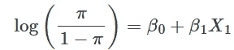

其中 π 代表结果为“正面”事件（如购买）的概率（表示为 1），而 (1-π) 代表结果为“负面”事件（表示为 0）的概率。此外，π 是我们感兴趣的量，它由逆 logit 函数定义：

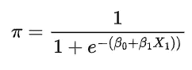

拟合此模型非常简单，我们需要找到两个 β 的值，以最大化数据的似然性（结果 y）——假设 N 个独立同分布的观察值是：

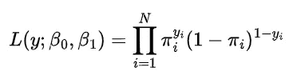

我们可以使用多个库中的任何一个来快速拟合此模型，但我们将使用 PYMC 作为构建简单贝叶斯逻辑回归的手段。

在没有贝叶斯工作流程的正常步骤的情况下，我们使用 MCMC 拟合此简单模型。

```py
import pymc as pm
import arviz as az
from scipy.special import expit

with pm.Model() as logistic_model:

    # noninformative priors
    intercept = pm.Normal('intercept', 0, sigma=10)
    beta_treat = pm.Normal('beta_treat', 0, sigma=10)

    # linear combination of the treated variable 
    # through the inverse logit to squish the linear predictor between 0 and 1
    p =  pm.invlogit(intercept + beta_treat * pdf_data.TREATED)

    # Individual level binary variable (respond or not)
    pm.Bernoulli(name='logit', p=p, observed=pdf_data.GT_0)

    idata = pm.sample(nuts_sampler="numpyro") 
```

```py
az.summary(idata, var_names=['intercept', 'beta_treat'])
```

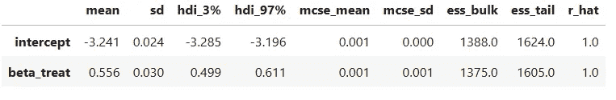

如果我们构建两种治疗平均响应率的对比，我们会发现，正如预期的那样，治疗 A 的平均响应率提升比治疗 B 高 0.026，置信区间为 (0.024 , 0.029)。

```py
# create a new column in the posterior which contrasts Treatment A - B
idata.posterior['TREATMENT A - TREATMENT B'] = expit(idata.posterior.intercept + idata.posterior.beta_treat) -  expit(idata.posterior.intercept)

az.plot_posterior(
    idata,
    var_names=['TREATMENT A - TREATMENT B']
) 
```

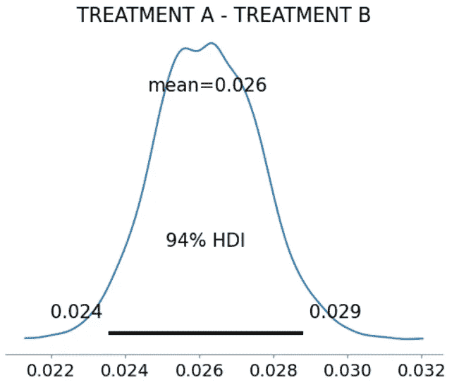

**伽马回归**

下一个组件是伽马分布，其中之一是其概率密度函数的参数化，如上图所示：

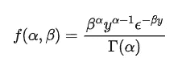

此分布适用于严格正的随机变量，如果用于商业，如成本、客户需求支出和保险索赔金额。

由于伽马分布的均值和方差是根据 α 和 β 以及以下公式定义的：

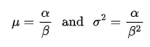

对于伽马回归，我们可以通过α和β或通过μ和σ来参数化。如果我们让μ定义为预测变量的线性组合，那么我们可以使用μ来定义伽马，使用α和β：

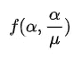

伽马回归模型假设（在这种情况下，逆链接是另一个常见选项）对数链接，其目的是“线性化”预测变量和结果之间的关系：

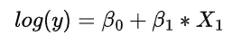

几乎完全遵循响应率的相同方法，我们将数据集限制为仅包含响应者，并使用 PYMC 拟合伽马回归。

```py
with pm.Model() as gamma_model:

    # noninformative priors
    intercept = pm.Normal('intercept', 0, sigma=10)
    beta_treat = pm.Normal('beta_treat', 0, sigma=10)

    shape = pm.HalfNormal('shape', 5)

    # linear combination of the treated variable 
    # through the exp to ensure the linear predictor is positive
    mu =  pm.Deterministic('mu',pm.math.exp(intercept + beta_treat * pdf_responders.TREATED))

    # Individual level binary variable (respond or not)
    pm.Gamma(name='gamma', alpha = shape, beta = shape/mu,  observed=pdf_responders.TARGET_D)

    idata = pm.sample(nuts_sampler="numpyro") 
```

```py
az.summary(idata, var_names=['intercept', 'beta_treat'])
```

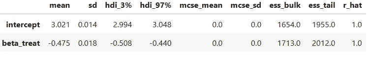

```py
# create a new column in the posterior which contrasts Treatment A - B
idata.posterior['TREATMENT A - TREATMENT B'] = np.exp(idata.posterior.intercept + idata.posterior.beta_treat) -  np.exp(idata.posterior.intercept)

az.plot_posterior(
    idata,
    var_names=['TREATMENT A - TREATMENT B']
) 
```

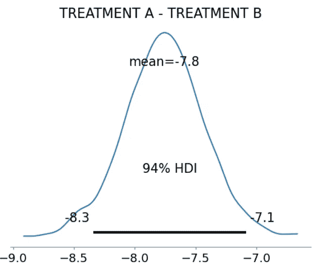

再次，正如预期的那样，我们看到治疗 A 的平均提升预期值等于样本值-7.8。94%的置信区间为(-8.3, -7.3)。

上文中显示的组成部分、响应率和每个响应者的平均金额尽可能简单。但是，为了添加额外的预测因子，以便 1)当我们预期治疗效果会因细分而不同时估计条件平均治疗效果（CATE），或者 2)通过条件化预处理变量来减少平均治疗效果估计的方差，这是一个直接的扩展。

**障碍模型（伽马）回归**

到目前为止，应该很容易看到我们的进展。对于障碍模型，我们有条件似然，取决于特定观测值是否为 0 或大于 0，如上图中伽马障碍分布所示。我们可以同时拟合两个组成部分模型（逻辑回归和伽马回归）。我们免费得到它们的乘积，在我们的例子中是针对目标单位的捐赠金额估计。

使用一个根据结果变量值进行切换语句的似然函数来拟合此模型并不困难，但 PYMC 已经为我们编码了这个分布。

```py
import pymc as pm
import arviz as az

with pm.Model() as hurdle_model:

    ## noninformative priors ##
    # logistic
    intercept_lr = pm.Normal('intercept_lr', 0, sigma=5)
    beta_treat_lr = pm.Normal('beta_treat_lr', 0, sigma=1)

    # gamma
    intercept_gr = pm.Normal('intercept_gr', 0, sigma=5)
    beta_treat_gr = pm.Normal('beta_treat_gr', 0, sigma=1)

    # alpha
    shape = pm.HalfNormal('shape', 1)

    ## mean functions of predictors ##
    p =  pm.Deterministic('p', pm.invlogit(intercept_lr + beta_treat_lr * pdf_data.TREATED))
    mu =  pm.Deterministic('mu',pm.math.exp(intercept_gr + beta_treat_gr * pdf_data.TREATED))

    ## likliehood ##
    # psi is pi
    pm.HurdleGamma(name='hurdlegamma', psi=p, alpha = shape, beta = shape/mu, observed=pdf_data.TARGET_D)

    idata = pm.sample(cores = 10)
```

如果我们检查迹线摘要，我们会看到两个组成部分模型的结果完全相同。

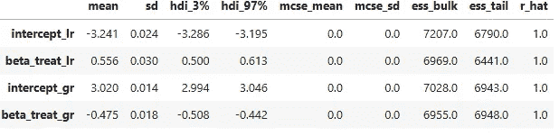

正如所注，伽马障碍分布的均值是π * μ，因此我们可以创建一个对比：

```py
# create a new column in the posterior which contrasts Treatment A - B
idata.posterior['TREATMENT A - TREATMENT B'] = ((expit(idata.posterior.intercept_lr + idata.posterior.beta_treat_lr))* np.exp(idata.posterior.intercept_gr + idata.posterior.beta_treat_gr)) - \
                                                    ((expit(idata.posterior.intercept_lr))* np.exp(idata.posterior.intercept_gr))

az.plot_posterior(
    idata,
    var_names=['TREATMENT A - TREATMENT B'] 
```

该模型的预期均值值为 0.043，94%的置信区间为(-0.0069, 0.092)。我们可以调查后验分布，看看捐赠金额预测为高于治疗 A 的比例有多少次，以及对我们案例有意义的任何其他决策函数——包括将更完整的损益表添加到估计中（即包括毛利和成本）。

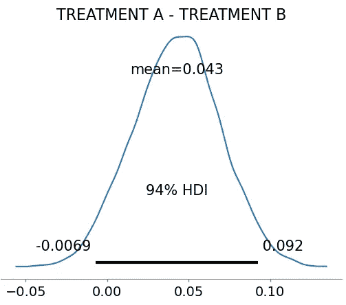

> 备注：一些实现方式对伽马障碍模型进行了不同的参数化，其中零的概率为π，因此伽马障碍的均值涉及(1-π)。另外，请注意，在撰写本文时，PYMC 中的 nuts 采样器似乎存在一个[问题](https://github.com/pymc-devs/nutpie/issues/163)，我们不得不回退到默认的 Python 实现来运行上述代码。

**摘要**

采用这种方法，我们对两个模型分别进行推断，并额外获得第三个指标的好处。使用 PYMC 拟合这些模型使我们能够获得贝叶斯分析的所有好处——包括注入先验领域知识以及完整的后验来回答问题和量化不确定性！

致谢：

1.  所有图像均为作者所有，除非另有说明。

1.  使用的数据集来自由 Epsilon 赞助的 KDD 98 杯赛。[`kdd.ics.uci.edu/databases/kddcup98/kddcup98.html`](https://kdd.ics.uci.edu/databases/kddcup98/kddcup98.html) (CC BY 4.0)
