# Greedy Boruta 算法：不牺牲召回率的快速特征选择

> 原文：[`towardsdatascience.com/the-greedy-boruta-algorithm-faster-feature-selection-without-sacrificing-recall/`](https://towardsdatascience.com/the-greedy-boruta-algorithm-faster-feature-selection-without-sacrificing-recall/)

*本文是一个协作成果。特别感谢[Estevão Prado](https://www.linkedin.com/in/estev%C3%A3o-prado-998097238/)，他的专业知识帮助完善了技术概念和叙事流程。*

### 代码可用性

Greedy Boruta 的完整实现可在[GreedyBorutaPy](https://www.google.com/url?sa=E&q=https%3A%2F%2Fgithub.com%2FNicolas-Vana%2FGreedyBorutaPy)找到。

Greedy Boruta 作为 PyPI 包也可用，地址为[greedyboruta.](https://pypi.org/project/greedyboruta/)

## <mdspan datatext="el1764269343707" class="mdspan-comment">简介</mdspan>

特征选择仍然是机器学习流程中最关键且计算成本最高的步骤之一。当处理高维数据集时，确定哪些特征真正有助于预测能力可能意味着一个可解释、高效的模型与一个过度拟合、缓慢的模型之间的区别。

在本文中，我介绍了 Greedy Boruta 算法——对 Boruta 算法[1]的一种改进，在我们的测试中，它将计算时间减少了 5-40 倍，同时数学上证明了召回率的保持或提高。通过理论分析和模拟实验，我展示了通过简单放宽确认标准，在*O(-log α)*次迭代中提供保证收敛，其中*α*是二项式检验的显著性水平，与原始算法的无界运行时间相比。

Boruta 算法因其“全相关”的特征选择方法和其统计框架而长期以来一直是数据科学家的最爱。与寻求预测中最小特征集的最小最优方法，如[最小冗余最大相关](https://www.google.com/url?sa=E&q=https%3A%2F%2Fgithub.com%2Fsmazzanti%2Fmrmr)（mRMR）和递归特征消除（RFE）不同，Boruta 旨在识别所有携带有用信息的特征。当目标是理解现象而不是仅仅做出预测时，这种哲学上的差异至关重要，例如。

然而，Boruta 的彻底性带来了高昂的计算成本。在具有数百或数千个特征的现实世界应用中，该算法可能需要过长的时间才能收敛。这就是 Greedy Boruta 算法出现的原因。

## 理解 Boruta 算法的原始版本

在检查改进之前，让我们回顾一下原始 Boruta 算法的工作原理。

Boruta 的卓越之处在于其确定特征重要性的优雅方法。它不是依赖于任意阈值或模型直接得到的 p 值，而是使用影子特征创建一个竞争基准。

**以下是这个过程：**

1.  **阴影特征创建：** 对于数据集中的每个特征，Boruta 通过随机打乱其值创建一个“阴影”副本。这破坏了原始特征与响应（或目标）变量之间的任何关系，同时保留了其分布。

1.  **重要性计算：** 在合并的数据集上训练随机森林，并计算所有特征的特征重要性。尽管 Boruta 最初是为随机森林估计器提出的，但该算法可以与任何其他提供特征重要性分数的基于树的集成算法一起工作（例如，[Extra Trees](https://www.google.com/url?sa=E&q=https%3A%2F%2Flink.springer.com%2Farticle%2F10.1007%2Fs10994-006-6226-1) [2], [XGBoost](https://www.google.com/url?sa=E&q=https%3A%2F%2Fdl.acm.org%2Fdoi%2F10.1145%2F2939672.2939785) [3], [LightGBM](https://lightgbm.readthedocs.io/en/stable/) [4]）。

1.  **击中登记：** 对于每个非阴影特征，Boruta 检查该特征的重要性是否大于阴影的最大重要性。比最重要的阴影更重要的非阴影特征被分配一个“击中”，而较不重要的则被分配“未击中”。

1.  **统计检验：** 基于每个非阴影特征的击中和未击中列表，Boruta 执行二项式检验，以确定其重要性是否在多个迭代中显著大于阴影特征中的最大重要性。

1.  **决策制定：** 持续优于最佳阴影特征的特性被标记为“确认”。持续表现不佳的特性被“拒绝”。中间的特征（那些与最佳阴影在统计上没有显著差异的）保持“暂定”。

1.  **迭代：** 步骤 2–5 重复，直到所有特征都被分类为确认或拒绝。在这篇文章中，我说当所有特征都被确认或拒绝，或者达到最大迭代次数时，Boruta 算法“已经收敛”。

### 二项式检验：Boruta 的决策标准

纯粹的 Boruta 使用严格的统计框架。经过多次迭代后，算法对每个非阴影特征的击中进行二项式检验：

+   **零假设：** 该特征**不优于**最佳阴影特征（有 50%的随机机会击败阴影）。

+   **备择假设：** 该特征优于最佳阴影特征。

+   **确认标准：** 如果二项式检验的 p 值低于*α*（通常在 0.05–0.01 之间），则该特征被确认。

同样的过程也用于拒绝特征：

+   **零假设：** 该特征**优于**最佳阴影（有 50%的随机机会无法击败阴影）。

+   **备择假设：** 该特征不优于最佳阴影特征。

+   **拒绝标准：** 如果二项式检验的 p 值低于*α*，则该特征被拒绝。

这种方法在统计学上是稳健且保守的；然而，它需要多次迭代来积累足够的证据，尤其是对于相关但仅略优于噪声的特征。

### 收敛性问题

原始 Boruta 算法面临两个主要的收敛问题：

**运行时间长：** 由于二项式检验需要多次迭代以达到统计显著性，算法可能需要数百次迭代来分类所有特征，尤其是在使用小 *α* 值以获得高置信度时。**此外，没有保证或估计收敛性，也就是说，没有方法可以确定需要多少次迭代才能将所有特征分类为“确认”或“拒绝”。**

**暂定特征：** 即使达到最大迭代次数，一些特征可能仍然保留在“暂定”类别中，使分析师的信息不完整。

这些挑战促使开发了 Greedy Boruta 算法。

## Greedy Boruta 算法

Greedy Boruta 算法对确认标准引入了根本性的改变，这极大地提高了收敛速度，同时保持了高召回率。

该名称来源于算法对确认的渴望方法。像贪婪算法那样做出局部最优选择，Greedy Boruta 立即接受任何显示出希望的任何特征，而不等待积累统计证据。这种权衡有利于速度和灵敏度，而不是特异性。

### 确认放宽

与通过二项式检验要求统计显著性不同，Greedy Boruta 确认了在所有迭代中至少一次击败最大影子重要性的任何特征，同时保持相同的拒绝标准。

这种放宽的理由在于，“所有相关”特征选择中，正如其名所示，我们通常优先考虑保留所有相关特征，而不是消除所有不相关特征。非相关特征的进一步去除可以在机器学习管道下游使用“最小-最优”特征选择算法来完成。因此，这种放宽在实践上是合理的，并能够产生预期的“所有相关”特征选择算法的结果。

这种看似简单的改变**有几个重要的含义：**

+   **保持召回率：** 由于我们放宽了确认标准（使其更容易确认特征），我们永远不会比原始 Boruta 的召回率低。任何通过原始方法确认的特征也将被贪婪版本确认。这可以很容易地证明，因为一个特征不可能在没有一次击中时被认为比二项式检验中的最佳影子更重要。

+   **K 次迭代内保证收敛：** 如下所示，这种改变使得可以计算需要多少次迭代才能使所有特征要么被确认要么被拒绝。

+   **更快收敛**：上述点的直接后果是，Greedy Boruta 算法需要的迭代次数远少于 vanilla Boruta，以便对所有特征进行排序。更具体地说，vanilla 算法对“第一批”特征进行排序所需的最小迭代次数与贪婪版本完成运行时的迭代次数相同。

+   **超参数简化**：保证收敛的另一个后果是，在 vanilla Boruta 算法中使用的某些参数，例如 max_iter（最大迭代次数）、early_stopping（一个布尔值，决定算法是否应该在多次迭代后没有变化时提前停止）和 n_iter_no_change（触发提前停止前的最小无变化迭代次数），可以完全移除而不会损失灵活性。这种简化提高了算法的可用性，并使得特征选择过程更容易管理。

### 修改后的算法

Greedy Boruta 算法遵循以下流程：

1.  **影子特征创建**：与 vanilla Boruta 完全相同。影子特征是基于数据集的每个特征创建的。

1.  **重要性计算**：与 vanilla Boruta 完全相同。特征重要性分数是基于任何基于树的集成机器学习算法计算的。

1.  **命中注册**：与 vanilla Boruta 完全相同。将命中分配给比最重要的影子特征更重要的非影子特征。

1.  **统计测试**：基于每个非影子特征的 **无命中** 列表，Greedy Boruta 执行二项式测试，以确定其重要性是否在多个迭代中不显著大于影子特征中的最大重要性。

1.  **决策制定[修改]**：**至少有一个命中率的特征被确认**。与最佳影子特征相比表现持续不佳的特征被“拒绝”。**零命中率的特征保持“暂定”状态**。

1.  **迭代**：步骤 2–5 重复，直到所有特征都被分类为确认或拒绝。

这个贪婪版本基于原始的 *boruta_py* [5] 实现，并进行了一些调整，所以大多数东西都与这个实现相同，除了上述提到的变化。

## 关于收敛保证的统计洞察

Greedy Boruta 算法最优雅的特性之一是其保证在指定次数的迭代内收敛，这个次数取决于选择的 *α* 值。

由于放宽了确认标准，我们知道任何有一个或多个命中的特征都被确认，我们不需要运行二项式测试来确认。相反，**我们知道每个暂定特征都没有命中**。这个事实极大地简化了表示拒绝特征所需的二项式测试的方程。

更具体地说，二项式检验被简化如下。考虑上述 vanilla Boruta 算法中的单侧二项式检验，其中*H₀*是*p = p₀*，*H₁*是*p < p₀*，p 值计算如下：

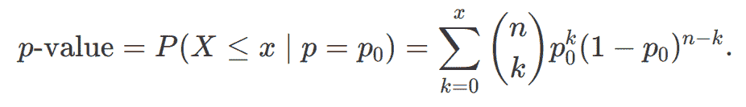

此公式求和了从 k = 0 到观察到的 x 的所有值的 k 次成功的概率。现在，给定此场景中的已知值（*p₀* = 0.5 和 x = 0），公式简化为：

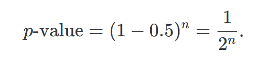

要在显著性水平*α*下拒绝*H₀*，我们需要：

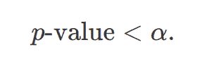

代入简化的*p-value*：

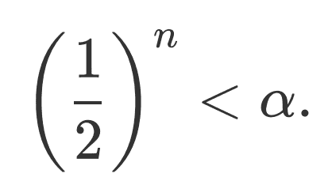

取倒数（并反转不等式）：

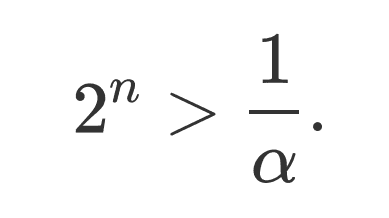

对两边取以 2 为底的对数：

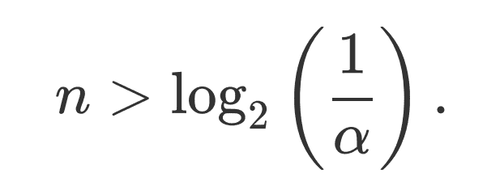

因此，所需的**样本量**为：

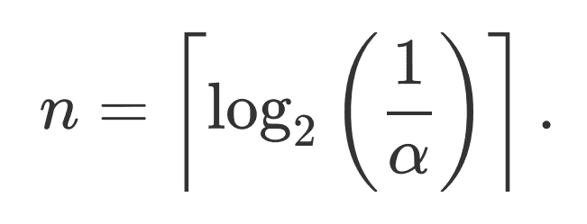

**这意味着 Greedy Boruta 算法最多运行*⌈ log₂(1/α)⌉*次迭代，直到所有特征都被分类为“确认”或“拒绝”，并且达到收敛。** 这意味着 Greedy Boruta 算法具有*O(-log α)*的复杂度。

所有暂定特征 0 次命中的另一个后果是我们可以通过不运行任何跨迭代的统计测试来进一步优化算法。

更具体地说，给定*α*，可以确定拒绝一个变量所需的最大迭代次数*K*。因此，对于每个小于*K*的迭代，如果一个变量有命中，则它被确认，如果没有命中，则它是暂定的（因为所有小于*K*的迭代中的 p 值都将大于*α*）。然后，在恰好迭代*K*时，所有 0 次命中的变量可以被移动到拒绝类别，无需进行任何二项式检验，因为我们知道在这个点上所有*p-values*都将小于*α*。

**这也意味着，对于给定的*α*，Greedy Boruta 算法运行的总迭代次数等于 vanilla 实现确认或拒绝任何特征所需的最小迭代次数！**

最后，重要的是要注意，*boruta_py*实现使用**假发现率（FDR）校正**来考虑在执行多个假设测试时增加的假阳性机会。在实践中，所需的*K*值并不完全如上述方程所示，但与*α*相关的复杂性仍然是对数级的。

下表包含了应用校正后不同*α*值所需的迭代次数：

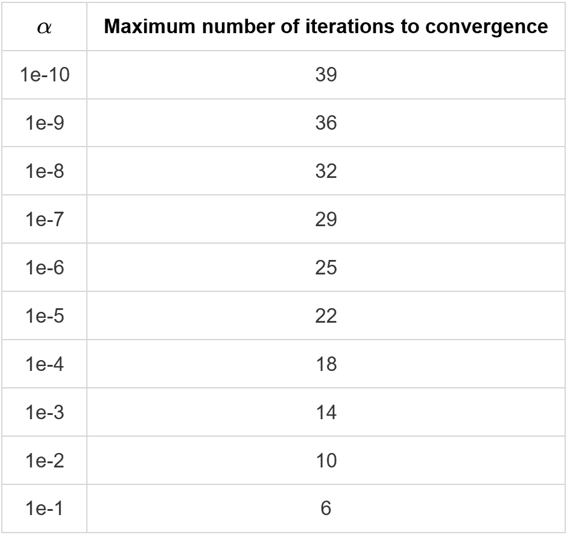

## 模拟实验

为了实证评估 Greedy Boruta 算法，我使用已知真实值的合成数据集进行了实验。这种方法允许精确测量算法的性能。

### 方法论

**合成数据生成：** 我使用 sklearn 的[make_classification](https://www.google.com/url?sa=E&q=https%3A%2F%2Fscikit-learn.org%2Fstable%2Fmodules%2Fgenerated%2Fsklearn.datasets.make_classification.html)函数创建具有已知重要和不重要特征的数据集，允许直接计算选择性能指标。此外，这些数据集包括“冗余特征”——信息特征的信息组合，这些组合携带预测信息，但不是预测所必需的。在“所有相关”范式下，这些特征理想情况下应被识别为重要，因为它们确实包含信号，即使这种信号是冗余的。因此，在计算召回率时，将信息特征和冗余特征一起视为“真实相关集”。

**指标：** 两种算法在以下方面进行评估：

+   **召回率（灵敏度）：** 真正重要的特征被正确识别的比例是多少？

+   **特异性：** 真正不重要的特征被正确拒绝的比例是多少？

+   **F1 分数：** 精确率和召回率的调和平均值，平衡正确识别重要特征和避免假阳性的权衡

+   **计算时间：** 完成任务的墙钟时间

### 实验 1 – α的变化

**数据集特征**

```py
X_orig, y_orig = sklearn.make_classification(
    n_samples=1000,
    n_features=500,
    n_informative=5,
    n_redundant=50, # LOTS of redundant features correlated with informative
    n_repeated=0,
    n_clusters_per_class=1,
    flip_y=0.3, # Some label noise
    class_sep=0.0001,
    random_state=42
)
```

这构成了一个“困难”的特征选择问题，因为维度高（500 个变量），样本量小（1000 个样本），相关特征数量少（稀疏问题，任何情况下大约有 10%的特征是相关的）和标签噪声较高。创建这样的“困难”问题对于有效地比较方法的性能很重要，否则，两种方法在迭代几次后都会实现近乎完美的结果。

**使用的超参数**

在这个实验中，我们评估算法在不同*α*值下的表现，因此我们使用列表[0.00001, 0.0001, 0.001, 0.01, 0.1, 0.2]中的*α*评估了两种方法。

关于 Boruta 和 Greedy Boruta 算法的超参数，两者都使用 sklearn 的 ExtraTreesClassifier 作为估计器，具有以下参数：

```py
ExtraTreesClassifier(
    n_estimators: 500, 
    max_depth: 5, 
    n_jobs: -1, 
    max_features: 'log2'
)
```

选择 Extra Trees 分类器作为估计器，是因为其拟合时间快，并且在考虑特征重要性估计任务时更稳定 [2]。

最后，原味 Boruta 没有使用早期停止（在 Greedy Boruta 的上下文中，此参数没有意义）。

**试验次数**

原味 Boruta 算法配置为最多运行 512 次迭代，但具有早期停止条件。这意味着如果在 X 次迭代（n_iter_no_change）内没有看到任何变化，则运行停止。对于每个*α*，n_iter_no_change 的值定义如下：

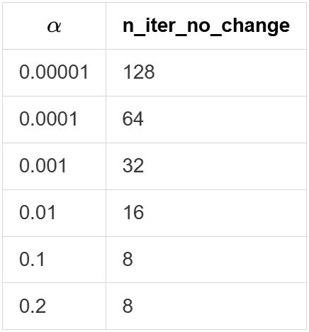

启用提前停止是因为一个谨慎使用原始 Boruta 算法的用户会在算法运行时间墙钟时间足够高时设置此选项，并且是算法整体更合理的使用方式。

这些提前停止阈值的选择是为了平衡计算成本与收敛可能性：对于较大的*α*值（收敛更快）选择较小的阈值，对于较小的*α*值（统计显著性需要更多迭代来积累）选择较大的阈值。这反映了实际用户如何配置算法以避免不必要的长时间运行。

### 结果：性能比较

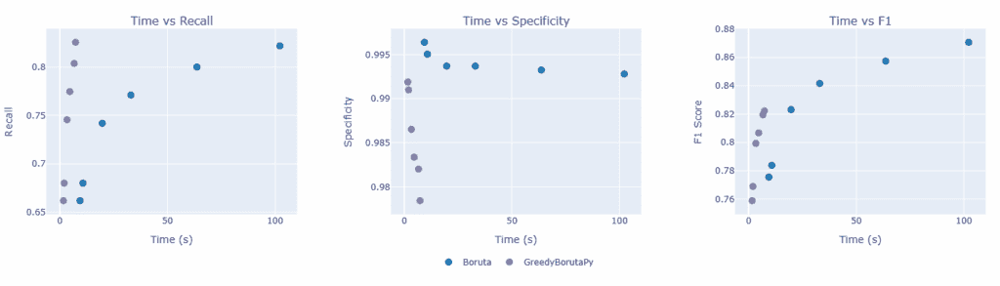

*图 1：两种方法在 6 个不同的α值（[0.00001, 0.0001, 0.001, 0.01, 0.1, 0.2]）下的召回率、特异性和 F1 值，随着α值的减小，墙钟时间单调增加。*

**主要发现**：如图 1 最左侧面板所示，贪婪 Boruta 在所有实验条件下都实现了大于或等于原始 Boruta 的召回率。对于两个最小的*α*值，召回率相等，而对于其他值，贪婪 Boruta 实现具有略微更高的召回率，这证实了放宽的确认标准不会错过原始方法会捕获的特征。

**观察到的权衡**：在有些设置中，贪婪 Boruta 显示出略微较低的特异性，这证实了放宽的标准确实会导致更多的假阳性。然而，这种效果的程度小于预期，在这个包含 500 个变量的数据集上，只会额外选择 2-6 个特征。这种增加的假阳性率在大多数下游管道中是可以接受的，原因有两个：（1）额外特征的绝对数量很小（在这个 500 个特征的集合中是 2-6 个特征），（2）后续建模步骤（例如，正则化、交叉验证或最小最优特征选择）可以过滤掉这些特征，如果它们对预测性能没有贡献。

**加速率**：与原始实现相比，贪婪 Boruta 算法始终需要 5-15 倍更少的时间，随着更保守的*α*值的增加，加速率也在提高。对于*α* = 0.00001，改进接近 15 倍。预期即使更小的*α*值也会导致越来越大的加速率。值得注意的是，对于大多数*α* < 0.001 的场景，原始 Boruta 实现“无法收敛”（并非所有特征都被确认或拒绝），如果没有提前停止，它们将运行得比这更长。

**收敛**：我们还可以通过分析每个方法在每个迭代中变量的状态来评估每个方法“收敛”的速度，如图 2 所示：

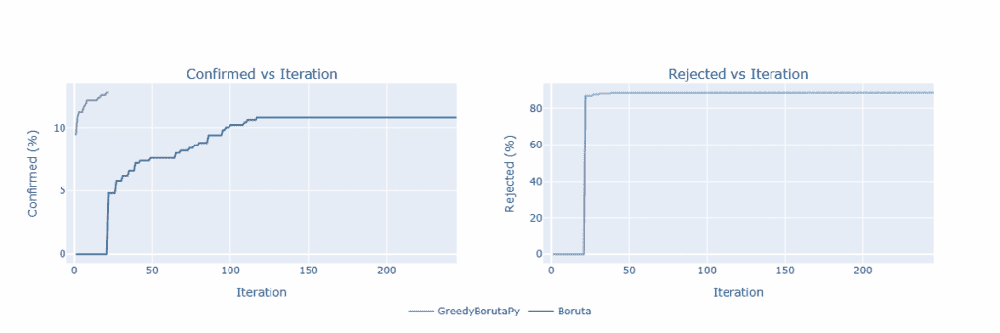

*图 2：根据迭代次数，确认和拒绝的特征百分比。*

在这个场景中，使用 *α* = 0.00001，我们可以观察到上述提到的行为：原始算法的第一个确认/拒绝发生在贪婪版本的对最后一次迭代（因此拒绝图中的线完全重叠）。

由于 Greedy Boruta 在 *α* 方面的最大迭代次数呈对数增长，我们还可以在贪婪版本中使用时探索 *α* 的**极端**值：

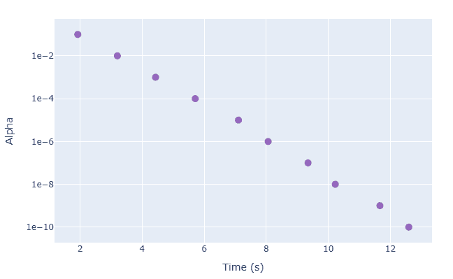

*图 3：在不同 α 值下 Greedy Boruta 算法的运行时间，以对数刻度显示，清楚地显示了 α（对数刻度上为线性）的复杂度对数增长。*

### 实验 2 – 探索最大迭代次数

**参数**

在这个实验中，使用了与上一个实验中描述的相同的数据集和超参数，除了 *α* 被固定在 *α = 0.00001*，最大迭代次数（对于原始算法）在运行之间变化。分析的最大迭代次数是 [16, 32, 64, 128, 256, 512]。此外，为了展示原始 Boruta 算法的一个弱点，这个实验中禁用了提前停止。

需要注意的是，对于这个实验，Greedy Boruta 方法只有一个数据点，因为最大迭代次数在修改版本中不是参数本身，而是由使用的 *α* 唯一确定的。

### 结果：性能比较

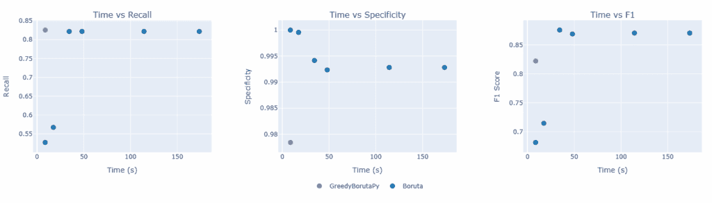

*图 4：两种方法在 6 个不同最大迭代次数（[16, 32, 64, 128, 256, 512]）下的召回率、特异性和 F1 分数。*

在图 4 中，我们再次观察到，Greedy Boruta 在所有考虑的迭代次数下都实现了比原始 Boruta 算法更高的召回率，同时特异性略有下降。在这种情况下，我们还观察到 Greedy Boruta 在大约 4 倍更短的时间内达到了与原始算法相似的召回率水平。

此外，由于在原始算法中，在给定次数的迭代中不存在“收敛保证”，用户必须定义算法将运行的最大迭代次数。在实践中，不知道重要特征的真实值以及可能触发的提前停止的迭代次数，很难确定这个数字。考虑到这种困难，过于保守的用户可能会运行算法进行过多的迭代，而不会在特征选择质量上产生显著改进。

在这个特定案例中，使用最大迭代次数等于 512 次迭代，不进行提前停止，达到的召回率与使用 64、128 和 256 次迭代达到的召回率非常相似。当将贪婪版本与原始算法的 512 次迭代进行比较时，我们看到实现了 40 倍的速度提升，同时召回率略有增加。

## 何时使用 Greedy Boruta？

Greedy Boruta 算法在特定场景中特别有价值：

+   **高维数据与有限时间**：当处理包含数百或数千个特征的集合时，vanilla Boruta 的计算成本可能是难以承受的。如果需要快速的结果进行探索性分析或快速原型设计，Greedy Boruta 提供了一个有吸引力的速度-精度权衡。

+   **所有相关特征选择目标**：如果你的目标与 Boruta 的原始“所有相关”哲学一致——寻找所有提供一些信息的特征，而不是最小最优集——那么 Greedy Boruta 的高召回率正是你所需要的。该算法倾向于包含，这在特征移除成本高昂时（例如，在科学发现或因果推断任务中）是合适的。

+   **迭代分析工作流程**：在实践中，特征选择很少是一次性决策。数据科学家经常迭代，尝试不同的特征集和模型。Greedy Boruta 通过提供快速初始结果，这些结果可以在后续分析中进一步完善，从而实现快速迭代。此外，还可以使用其他特征选择方法来进一步降低特征集的维度。

+   **一些额外的特征是可以接受的**：当假阳性特别昂贵时，vanilla Boruta 的严格统计测试是有价值的。然而，在许多应用中，包括一些额外的特征比错过重要的特征更可取。当下游管道可以处理稍微大一点的特征集但受益于更快的处理时，Greedy Boruta 是理想的。

## 结论

Greedy Boruta 算法是对一个成熟的特征选择方法的扩展/修改，具有显著不同的特性。通过将确认标准从统计显著性放宽到单次命中，我们实现了：

+   **与标准 Boruta 相比，运行时间快 5-40 倍**，适用于所探讨的场景。

+   **确保召回率相等或更高**，确保没有遗漏相关特征。

+   **保证收敛**，所有特征都被分类，要么是已确认的，要么是已拒绝的。

+   **保持了可解释性和理论基础**。

在许多实际应用中，权衡——假阳性率的适度增加——是可以接受的，尤其是在时间受限的情况下处理高维数据时。

对于实践者来说，Greedy Boruta 算法为探索性分析中快速、高召回率的特征选择提供了一个有价值的工具，如果需要的话，可以选择更保守的方法进行后续处理。对于研究人员来说，它展示了通过仔细考虑实际应用的实际需求，对现有算法进行深思熟虑的修改可以带来显著的实际效益。

当你的理念是寻找“所有相关”的特征而不是最小集，当速度很重要，以及当下游分析中可以容忍或过滤掉假阳性时，该算法最为适用。在这些常见场景中，贪婪 Boruta 算法为原始算法提供了一个有吸引力的替代方案。

### 参考文献

[1] Kursa, M. B., & Rudnicki, W. R. (2010). 使用 Boruta 包进行特征选择. *统计软件杂志*, 36(11), 1–13.

[2] Geurts, P., Ernst, D., & Wehenkel, L. (2006). 极端随机树. *机器学习*, 63(1), 3–42.

[3] Chen, T., & Guestrin, C. (2016). XGBoost：一个可扩展的树提升系统. *第 22 届 ACM SIGKDD 国际知识发现和数据挖掘会议论文集*, 785–794.

[4] Ke, G., Meng, Q., Finley, T., Wang, T., Chen, W., Ma, W., Ye, Q., & Liu, T.-Y. (2017). LightGBM：一个高效的梯度提升决策树. *第 30 届神经信息处理系统会议（NIPS 2017）论文集*, 3146–3154.

[5] BorutaPy 实现：[`github.com/scikit-learn-contrib/boruta_py`](https://www.google.com/url?sa=E&q=https%3A%2F%2Fgithub.com%2Fscikit-learn-contrib%2Fboruta_py)

* * *

*感谢阅读！如果你觉得这篇文章有帮助，请考虑关注以获取更多关于特征选择、机器学习算法和实用数据科学的内容。*
