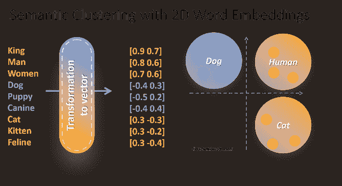

# 《无形革命：向量如何（重新）定义商业成功》

> 原文：[`towardsdatascience.com/the-invisible-revolution-how-vectors-are-redefining-business-success/`](https://towardsdatascience.com/the-invisible-revolution-how-vectors-are-redefining-business-success/)

<mdspan datatext="el1744318018361" class="mdspan-comment">在一个更加关注数据的世界上，商业领袖必须理解向量思维。起初，向量可能看起来和学校里的代数一样复杂，但它们是基本构建块。向量对于像分账或计算利息这样的任务来说和代数一样重要。它们支撑着我们的决策、客户参与和数据保护的数字系统。</mdspan>

它们代表了一种截然不同的关系和模式的概念。它们不仅仅将数据划分为僵化的类别。相反，它们提供了一个动态的多维视角，以了解潜在的连接。例如，“相似”对于两个客户可能意味着不仅仅是人口统计或购买历史。它是他们的行为、偏好和习惯，这些<mdspan datatext="el1744313777460" class="mdspan-comment">明显地</mdspan>对齐。这些关联可以在向量空间中被准确定义和测量。但对于许多现代企业来说，这种逻辑过于复杂。因此，领导者往往退回到旧的、学过的基于规则的模式。当时，例如，欺诈检测仍然使用简单的交易限额规则。我们已经进化到能够识别模式和异常。

几年前，一次性将信用卡额度分配 50%的交易可能很常见，但现在我们能够分析你的零售商特定的消费历史，查看同一零售商其他客户的平均购物篮，并进行一些轻微的逻辑检查，比如你之前消费的物理位置。

因此，在迪拜麦当劳的 7000 美元交易可能就因为你在阿姆斯特丹租了一辆自行车花费了 3 美元而无法完成。即使是 20 美元也可能不行，因为逻辑向量模式可以排除物理距离的有效性。相反，你在阿姆斯特丹市中心附近的零售商那里购买新电动自行车的 7000 美元交易可能就会完美无缺。 **欢迎来到由向量管理的世界的洞察。**

忽视向量范式危险巨大。不掌握代数可能导致糟糕的财务决策。同样，不了解向量可能使你在作为商业领导者时变得脆弱。尽管普通顾客可能对向量的了解程度与普通飞机乘客对空气动力学的了解程度一样，但商业领导者至少应该知道什么是煤油以及需要多少座位才能使特定航班收支平衡。你可能不需要完全理解你所依赖的系统。基本理解有助于知道何时寻求专家的帮助。这正是我在向量世界小旅程中的目标：了解基本原理，并知道何时寻求更多以更好地引导和管理你的业务。

在研究实验室和科技公司安静的走廊里，一场革命正在酝酿。这将改变计算机理解世界的方式。这场革命与处理能力或存储容量无关。它完全是关于教会机器理解语境、意义和细微差别。这使用了称为向量的数学表示。在我们能够欣赏这一转变的巨大影响之前，我们首先需要了解它与什么不同。

考虑人类获取信息的方式。当我们看一只猫时，我们不仅仅处理一系列组件：胡须、毛发、四条腿。相反，我们的大脑通过关系、情境和关联的网络工作。我们知道猫更像狮子而不是自行车。这不是通过记忆这个事实。我们的头脑自然地学习了这些关系。这归结为**目标转换序列**或类似的东西。向量表示让计算机以类似人类的方式消费内容。我们应该理解这是如何以及为什么这是真的。这在即将到来的 AI 革命时代，就像了解代数一样基本。

在这个向量领域的简短之旅中，我将解释基于向量的计算是如何工作的以及为什么它如此具有变革性。*代码示例仅用于说明，因此它们只是为了说明，没有独立的功能性。你不需要是工程师就能理解这些概念。*你所要做的就是跟随，因为我将用简单的语言评论一步一步地引导你通过示例，解释每一步，一次一步。我不打算成为一个世界级的数学家。我想让向量对每个人来说都是可理解的：商业领导者、管理者、工程师、音乐家以及其他人。

***

## 向量究竟是什么？


图片由[Pete F](https://unsplash.com/@pete_2112?utm_source=medium&utm_medium=referral)在[Unsplash](https://unsplash.com/?utm_source=medium&utm_medium=referral)上提供

基于向量的计算之旅并非最近才开始。它的根源可以追溯到 20 世纪 50 年代，当时认知科学中分布式表示的发展。**詹姆斯·麦克莱兰德和戴维·鲁梅尔哈特等研究人员理论化，大脑并不是将概念作为单个实体来持有。**相反，它将它们视为神经网络活动模式的编译。这一发现主导了当代向量表示的发展路径。

真正的突破是三个因素的结合：

计算能力的指数级增长，复杂神经网络架构的发展，以及大规模训练数据集的可用性。

正是这些元素的组合使得基于向量的系统在理论上成为可能，并在实践中能够大规模实现。正如人们所知，人工智能（如 ChatGPT 等）成为主流的直接后果就是这一点。

为了更好地理解，让我将这个概念放在一个具体的背景中：传统的计算系统是基于符号的——离散的、可读的符号和规则。例如，一个传统的系统可能会将客户表示为一个记录：

```py
customer = {
    'id': '12345',
    'age': 34,
    'purchase_history': ['electronics', 'books'],
    'risk_level': 'low'
}
```

这种表示可能是可读的或逻辑的，但它忽略了微妙的模式和关系。相比之下，向量表示在多维空间中编码信息，其中关系通过几何邻近性自然出现。同样的客户可能被表示为一个 384 维的向量，其中每一个维度都对一个丰富、细腻的轮廓做出贡献。简单的代码可以将二维客户数据转换为向量。让我们看看这有多么简单：

```py
from sentence_transformers import SentenceTransformer
import numpy as np

class CustomerVectorization:
    def __init__(self):
        self.model = SentenceTransformer('all-MiniLM-L6-v2')

    def create_customer_vector(self, customer_data):
        """
        Transform customer data into a rich vector representation
        that captures subtle patterns and relationships
        """
        # Combine various customer attributes into a meaningful text representation
        customer_text = f"""
        Customer profile: {customer_data['age']} year old,
        interested in {', '.join(customer_data['purchase_history'])},
        risk level: {customer_data['risk_level']}
        """

        # Generate base vector from text description
        base_vector = self.model.encode(customer_text)

        # Enrich vector with numerical features
        numerical_features = np.array([
            customer_data['age'] / 100,  # Normalized age
            len(customer_data['purchase_history']) / 10,  # Purchase history length
            self._risk_level_to_numeric(customer_data['risk_level'])
        ])

        # Combine text-based and numerical features
        combined_vector = np.concatenate([
            base_vector,
            numerical_features
        ])

        return combined_vector

    def _risk_level_to_numeric(self, risk_level):
        """Convert categorical risk level to normalized numeric value"""
        risk_mapping = {'low': 0.1, 'medium': 0.5, 'high': 0.9}
        return risk_mapping.get(risk_level.lower(), 0.5)
```

我相信这个代码示例已经帮助展示了如何轻松地将复杂的客户数据编码成有意义的向量。这个方法一开始看起来很复杂。但实际上，它很简单。我们将客户文本和数值数据合并。这为我们提供了丰富、信息密集的向量，捕捉到每个客户的本质。我最喜欢这种技术的就是它的简单性和灵活性。同样地，就像我们在这里编码年龄、购买历史和风险水平一样，你可以复制这种模式来捕捉任何其他客户属性，这些属性归结为你的用例的相关基础案例。只需回忆一下我们之前描述的信用卡消费模式。这些相似的数据被转换成向量，其意义远远大于它保持二维状态时的意义，并且会被用于传统的基于规则的逻辑。

我们的小代码示例让我们能够在语义丰富的空间中拥有两个非常有暗示性的表示，一个在归一化值空间中，将每个记录映射到具有直接比较属性的图中的线条。

**这使系统能够识别复杂模式和相关关系，而传统的数据结构无法充分反映。由于向量空间的几何性质，这些结构的形状讲述了相似性、差异和关系的故事，从而允许对复杂数据进行固有的标准化但灵活的表示。**

但是从这里开始，你会看到这种结构被复制到基于向量客户分析的其他应用中：使用相关数据，以我们可以处理的形式汇总它，元表示将异构数据组合成对向量有共同理解。无论是推荐系统、客户细分模型还是预测分析工具，这种对深思熟虑的向量化的基本方法将支撑所有这些。因此，即使你认为自己非技术且更倾向于业务方面，了解和掌握这种基本方法也是非常重要的。

只需记住——关键是考虑你的数据中哪些部分具有有意义的信号以及如何以保留它们关系的方式编码它们。这不过是遵循你的业务逻辑，在另一种不同于代数的思维方式中。一种更现代、多维的方式。

* * *

## 意义之数学（国王与王后）


图片由[Debbie Fan](https://unsplash.com/@dubbyfan?utm_source=medium&utm_medium=referral)在[Unsplash](https://unsplash.com/?utm_source=medium&utm_medium=referral)上提供

所有的人类交流都传递着丰富的意义网络，我们的大脑会自动将其连接起来以理解。这些是我们可以用基于向量的计算来捕捉的意义；我们可以在空间中表示单词，使它们成为多维单词空间中的点。这种几何处理使我们能够在空间术语上思考我们感兴趣的抽象语义关系，如距离和方向。

例如，关系“国王对王后正如男人对女人”是以一种方式编码在向量空间中的，即“国王”和“王后”之间的方向和距离与“男人”和“女人”之间的方向和距离相似。

让我们退一步来理解这可能是为什么：使这个系统工作的关键组成部分是词嵌入——在密集向量空间中将单词编码为向量的数值表示。这些嵌入是通过检查大量文本片段中单词的共现情况得到的。正如我们通过观察“狗”和“小狗”在相似语境中发生来学习“狗”和“小狗”是相关概念一样，嵌入算法学习将这些单词在向量空间中彼此靠近。

当我们观察词嵌入如何编码类比关系时，它们揭示了真正的力量。想想我们关于“国王”和“王后”之间关系的了解。我们可以通过直觉判断，这些词在性别上不同，但与宫殿、权威和领导相关的联想是相同的。通过向量空间系统的一个奇妙属性——向量算术，这种关系可以被数学地捕捉。

在经典的例子中，人们做得非常漂亮：

```py
vector('king') - vector('man') + vector('woman') ≈ vector('queen')
```

这个方程告诉我们，如果我们有“国王”的向量，我们减去“男人”的向量（我们移除“男性”的概念），然后加上“女人”的向量（我们添加“女性”的概念），我们得到一个在空间中非常接近“王后”的新点。**这不是数学上的巧合——这是基于嵌入空间以某种结构化的方式安排意义的结果**。

我们可以用预训练的词嵌入在 Python 中应用这种上下文的概念：

```py
import gensim.downloader as api

# Load a pre-trained model that contains word vectors learned from Google News
model = api.load('word2vec-google-news-300')

# Define our analogy words
source_pair = ('king', 'man')
target_word = 'woman'

# Find which word completes the analogy using vector arithmetic
result = model.most_similar(
    positive=[target_word, source_pair[0]], 
    negative=[source_pair[1]], 
    topn=1
)

# Display the result
print(f"{source_pair[0]} is to {source_pair[1]} as {target_word} is to {result[0][0]}")
```

这个向量空间的结构揭示了许多基本原理：

1.  语义相似性表现为空间邻近性。相关的词语聚集：思想的邻域。“狗”、“小狗”和“犬类”将是一个这样的簇；同时，“猫”、“小猫”和“猫科动物”将在附近创造另一个簇。

1.  词语之间的关系成为空间中的方向。从“男人”到“女人”的向量编码了性别关系，以及其他类似的关系（例如，“国王”到“王后”或“演员”到“女演员”），通常指向同一方向。

1.  向量的幅度可以传达关于词的重要性或具体性的意义。常见词汇通常比专业术语的向量更短，反映了它们更广泛、更不具体的意义。

以这种方式处理词语之间的关系，为我们提供了意义的**几何编码**以及反映自然语言处理细微差异所需的数学精度。而不是将词语视为独立的符号，**向量化系统可以识别模式、进行类比，甚至揭示从未编程的关系**。

为了更好地理解刚才讨论的内容，我擅自将我们之前提到的词语（“国王，男人，女人”；“狗，小狗，犬类”；“猫，小猫，猫科动物”）映射到相应的二维向量。**这些向量以数值形式表示语义意义**。



将前面提到的示例术语作为二维词嵌入进行可视化。为了说明目的，显示了分组类别。数据是虚构的，轴简化了，用于教育目的。

+   **与人类相关的词语**在两个维度上都有较高的正值。

+   **与狗相关的词语**具有负的 x 值和正的 y 值。

+   **与猫相关的词语**具有正的 x 值和负的 y 值。

注意，这些值是我为了更好地说明而编造的。如图所示，在绘制向量的 2D 空间中，你可以根据代表向量的点的位置来观察基于位置的群体。例如，三个与狗相关的词可以聚集成“狗”类别等等。

理解这些基本原理使我们能够了解现代语言 AI（如大型语言模型（LLMs））的能力和局限性。尽管这些系统可以进行惊人的类比和关系体操，但它们最终是基于文本中单词彼此接近的方式形成的几何模式**周期**。这是对人类语言理解的一种详尽但根据定义不完整的反映。因此，作为一个基于向量的 LLM，它只能生成它接收到的输入。尽管这并不意味着它只能生成与训练 1:1 相对应的内容，我们都知道 LLMs 的神奇幻觉能力；这意味着除非特别指示，否则 LLMs 不会提出新词或新语言来描述事物。许多期望 LLMs 成为奇迹机器而不知晓向量基本原理的商业领袖仍然缺乏这种基本理解。

* * *

## 距离、角度和晚宴的故事


图片由 [OurWhisky Foundation](https://unsplash.com/@ourwhiskyfoundation?utm_source=medium&utm_medium=referral) 在 [Unsplash](https://unsplash.com/?utm_source=medium&utm_medium=referral) 提供

现在，假设你正在举办一场晚宴，主题是好莱坞和大型电影，你希望根据他们的喜好来安排座位。你可以计算他们偏好的“距离”（可能是类型，甚至可能是爱好？）并找出应该坐在一起的人。但决定如何衡量这个距离可能是令人兴奋的对话和恼怒的参与者之间的区别。或者尴尬的沉默。*是的，那个公司派对回忆录正在重复播放。对此表示歉意！*

在向量的世界中也是如此。距离度量标准定义了两个向量看起来有多“相似”，因此，最终，你的系统在预测结果方面的表现有多好。

## 欧几里得距离：简单直接，但有限

欧几里得距离衡量空间中两点之间的直线距离，使其易于理解：

+   只要向量是物理位置，欧几里得距离就很好。

+   然而，在高维空间（如代表用户行为或偏好的向量），这个度量标准通常不够用。尺度或幅度的差异可能会扭曲结果，过分关注尺度而非实际相似性。

**示例**：两个向量可能代表你的晚餐宾客对流媒体服务使用量的偏好：

```py
vec1 = [5, 10, 5]
# Dinner guest A likes action, drama, and comedy as genres equally.

vec2 = [1, 2, 1] 
# Dinner guest B likes the same genres but consumes less streaming overall.
```

**尽管他们的偏好一致，但由于整体活动的差异，欧几里得距离会使他们看起来截然不同。**

但在更高维度的空间中，例如用户行为或文本意义，欧几里得距离变得越来越不具信息量。它过度重视大小，这可能会掩盖比较。考虑两位电影爱好者：一位看过 200 部动作电影，另一位看过 10 部，但他们都喜欢相同的类型。由于他们的活动水平很高，第二个观众在使用欧几里得距离时，看起来与第一个观众非常不相似，尽管他们只看过布鲁斯·威利斯的电影。

## 余弦相似度：关注方向

余弦相似度方法采取不同的方法。它关注向量之间的**角度**，而不是它们的大小。这就像比较两支箭的路径。如果它们指向同一方向，它们就是对齐的，无论它们的长度如何。这表明它非常适合高维数据，我们关心的是关系，而不是规模。

+   如果两个向量指向同一方向，它们被认为是相似的（余弦相似度约为 1）。

+   当它们相对立（指向相反方向）时，它们不同（余弦相似度 ≈ -1）。

+   如果它们是垂直的（彼此之间形成 90°的直角），它们是不相关的（余弦相似度接近 0）。

这种归一化属性确保了相似度得分正确地衡量了对齐，而不管一个向量相对于另一个向量是如何缩放的。

**示例**：回到我们的流媒体偏好，让我们看看我们的晚餐客人偏好的向量会是什么样子：

```py
vec1 = [5, 10, 5]
# Dinner guest A likes action, drama, and comedy as genres equally.

vec2 = [1, 2, 1] 
# Dinner guest B likes the same genres but consumes less streaming overall.
```

让我们讨论为什么余弦相似度在这种情况下非常有效。所以，当我们计算 vec1 [5, 10, 5]和 vec2 [1, 2, 1]的余弦相似度时，**我们实际上是在试图看到这些向量之间的角度**。

点积首先对向量进行归一化，将每个分量除以向量的长度。这个操作“取消”了大小差异：

+   因此，对于 vec1：归一化后我们得到[0.41, 0.82, 0.41]左右。

+   对于 vec2：归一化后变为[0.41, 0.82, 0.41]，我们也将得到它。

现在我们也理解了为什么这些向量在余弦相似度方面被认为是相同的，因为**它们的归一化版本是相同的**！

这告诉我们，尽管晚餐客人 A 观看的总内容更多，但他们分配给任何特定类型的比例完美地反映了晚餐客人 B 的偏好。这就像说两位客人各自将 20%的时间用于动作片，60%用于剧情片，20%用于喜剧片，无论观看的总小时数是多少。

**正是这种归一化使得余弦相似度对于文本嵌入或用户偏好等高维数据特别有效**。

当处理多维度数据（想想电影各种特征的数百或数千个向量的分量）时，通常最重要的是每个维度相对于完整轮廓的相对重要性，而不是绝对值。余弦相似度精确地识别了这种相对重要性的排列，是识别复杂数据中有意义关系的强大工具。

* * *

## 徒步攀登欧几里得山径


图片由 [Christian Mikhael](https://unsplash.com/@christian_mikhael?utm_source=medium&utm_medium=referral) 在 [Unsplash](https://unsplash.com/?utm_source=medium&utm_medium=referral) 上提供

在这部分，我们将看到不同的相似度测量方法在实际中的表现，通过一个来自现实世界的具体例子和一些简单的代码示例。即使你不是技术人士，这段代码对你来说也容易理解。这是为了说明它的简单性。无需害怕！

我们快速讨论一条 10 英里长的徒步旅行路线怎么样？两个朋友，亚历克斯和布莱克，对同一次徒步旅行进行了评论，但各自赋予了它不同的特点：

> **这条小径在仅仅 2 英里的距离内上升了 2000 英尺的海拔！中间有一些高峰，很容易做到！**
> 
> **亚历克斯**

和

> **注意，我们在森林地形的高峰处直线上升了 100 英尺！总体来说，10 英里美丽的森林！**
> 
> **布莱克**

这些描述可以表示为向量：

```py
alex_description = [2000, 2]  # [elevation_gain, trail_distance]
blake_description = [100, 10]  # [elevation_gain, trail_distance]
```

让我们结合这两种相似度度量，看看它告诉我们什么：

```py
import numpy as np

def cosine_similarity(vec1, vec2):
    """
    Measures how similar the pattern or shape of two descriptions is,
    ignoring differences in scale. Returns 1.0 for perfectly aligned patterns.
    """
    dot_product = np.dot(vec1, vec2)
    norm1 = np.linalg.norm(vec1)
    norm2 = np.linalg.norm(vec2)
    return dot_product / (norm1 * norm2)

def euclidean_distance(vec1, vec2):
    """
    Measures the direct 'as-the-crow-flies' difference between descriptions.
    Smaller numbers mean descriptions are more similar.
    """
    return np.linalg.norm(np.array(vec1) - np.array(vec2))

# Alex focuses on the steep part: 2000ft elevation over 2 miles
alex_description = [2000, 2]  # [elevation_gain, trail_distance]

# Blake describes the whole trail: 100ft average elevation per mile over 10 miles
blake_description = [100, 10]  # [elevation_gain, trail_distance]

# Let's see how different these descriptions appear using each measure
print("Comparing how Alex and Blake described the same trail:")
print("\nEuclidean distance:", euclidean_distance(alex_description, blake_description))
print("(A larger number here suggests very different descriptions)")

print("\nCosine similarity:", cosine_similarity(alex_description, blake_description))
print("(A number close to 1.0 suggests similar patterns)")

# Let's also normalize the vectors to see what cosine similarity is looking at
alex_normalized = alex_description / np.linalg.norm(alex_description)
blake_normalized = blake_description / np.linalg.norm(blake_description)

print("\nAlex's normalized description:", alex_normalized)
print("Blake's normalized description:", blake_normalized)
```

所以现在，运行这段代码，会发生一些神奇的事情：

```py
Comparing how Alex and Blake described the same trail:

Euclidean distance: 8.124038404635959
(A larger number here suggests very different descriptions)

Cosine similarity: 0.9486832980505138
(A number close to 1.0 suggests similar patterns)

Alex's normalized description: [0.99975 0.02236]
Blake's normalized description: [0.99503 0.09950]
```

这个输出显示了为什么，根据你测量的内容，相同的轨迹可能看起来不同或相似。

**大**的 **欧几里得** 距离（8.12）表明这些描述非常不同。**2000 与 100 相差甚远，2 与 10 也相差甚远。这就像没有理解这些数字的意义，只是计算了它们之间的原始差异**。

但高达 **高余弦相似度（0.95**）的相似度告诉我们一些更有趣的事情：**这两个描述都捕捉到了相似的图案**。

如果我们看看 **归一化向量**，我们也可以看到这一点；亚历克斯和布莱克都在描述一条以海拔升高为显著特征的轨迹。每个归一化向量中的第一个数字（海拔升高）相对于第二个（轨迹距离）要大得多。或者，将它们都提升并基于比例进行归一化——而不是体积——因为它们都具有定义轨迹的相同特征。

完全真实：亚历克斯和布莱克徒步同一条路线，但在撰写评论时关注了不同的部分。亚历克斯关注了更陡峭的部分，并描述了 100 英尺的攀登，而布莱克描述了整个轨迹的轮廓，平均每英里 200 英尺，共 10 英里。**余弦相似度将这些描述识别为相同基本轨迹模式的变体，而欧几里得距离则认为它们是完全不同的路线**。

这个例子突出了选择适当相似度度量标准的重要性。在实际情况中，仅通过欧几里得距离等距离度量会错过许多有意义的关联，而标准化和计算余弦相似度则可以提供这些关联。

* * *

## 度量选择对现实世界的影响


图片由 [fabio](https://unsplash.com/@fabioha?utm_source=medium&utm_medium=referral) 在 [Unsplash](https://unsplash.com/?utm_source=medium&utm_medium=referral) 提供

你选择的度量标准不仅仅改变数字；它会影响复杂系统的结果。以下是它在各个领域中的分解：

+   **在推荐引擎中**：当涉及到余弦相似度时，我们可以将具有相同口味的用户分组，即使他们的总体活动量不同。流媒体服务可以使用这一点来推荐与用户类型偏好相符合的电影，而不管在非常活跃的观众小群体中流行的是什么。

+   **在文档检索中**：当查询文档或研究论文数据库时，余弦相似度根据文档内容与用户查询在意义上的相似性对文档进行排序，而不是根据它们的文本长度。这使得系统能够检索出与查询上下文相关的结果，即使文档的大小范围很广。

+   **在欺诈检测中**：行为模式通常比纯数字更重要。余弦相似度可以用来检测消费习惯中的异常，因为它比较交易向量的方向——商户类型、一天中的时间、交易金额等——而不是绝对大小。

**这些差异很重要，因为它们让我们了解系统是如何“思考”的。**让我们再次回到那个信用卡的例子：例如，它可能会使用欧几里得距离识别出价值高达 7000 美元的新电动自行车的交易为可疑——即使这个交易对于你来说很正常，因为你平均每月花费 20000 美元。

另一方面，基于余弦的系统理解交易与用户通常花费金钱的方式是一致的，从而避免了不必要的错误通知。

**但像欧几里得距离和余弦相似度这样的度量标准不仅仅是理论上的。它们是现实世界系统中立的基础。**无论是推荐引擎还是欺诈检测，我们选择的度量标准将直接影响系统如何理解数据中的关系。

## 实践中的向量表示：行业变革


图片由 [Louis Reed](https://unsplash.com/@_louisreed?utm_source=medium&utm_medium=referral) 在 [Unsplash](https://unsplash.com/?utm_source=medium&utm_medium=referral) 提供

这种抽象能力使得向量表示法非常强大——它们将复杂和抽象的领域数据转换为可以评分和采取行动的概念。**这些见解正在催化业务流程、决策和跨行业客户价值交付的根本性变革**。

接下来，我们将探讨我们作为具体案例所强调的解决方案用例，以了解向量如何节省时间解决大问题，以及创造具有重大影响的新机会。我选择了一个行业来展示基于向量的方法如何应对挑战，因此这里有一个来自临床设置的医疗保健示例。为什么？因为它对我们所有人来说都很重要，而且与深入金融系统、保险、可再生能源或化学相比，更容易联系起来。

### 医疗保健亮点：复杂医疗数据中的模式识别

医疗保健行业面临着一系列挑战，向量表示法可以**独特地**解决这些问题。想想患者数据的复杂性：病史、遗传信息、生活方式因素和治疗结果都以微妙的方式相互作用，而传统的基于规则的系统无法捕捉到这些相互作用。

在麻省总医院，研究人员实施了一个基于向量的败血症早期检测系统，败血症是一种**每小时**早期检测都能将生存机会提高 7.6%的疾病（详见[pmc.ncbi.nlm.nih.gov/articles/PMC6166236/](https://pmc.ncbi.nlm.nih.gov/articles/PMC6166236/)）。

在这个新的方法中，自发性中性粒细胞速度轮廓（SVP）被用来描述从一滴血液中中性粒细胞的运动模式。我们在这里不会过于详细地讨论医学知识，因为今天我们关注的是向量，但中性粒细胞是一种免疫细胞，它在身体用来抵抗感染的过程中充当一种第一响应者。

系统随后将每个中性粒子的运动编码为一个**向量**，它不仅捕捉其大小（即速度），还捕捉其方向。**因此，他们将生物模式转换为高维向量空间**；因此，他们发现了细微的差异，并**展示了健康个体和败血症患者在运动上存在统计学上显著的不同**。然后，这些数值向量在机器学习模型的帮助下进行处理，该模型被训练以检测败血症的早期迹象。**结果是，一个诊断工具达到了令人印象深刻的灵敏度（97%）和特异性（98%），以实现这种致命状况的快速和准确识别**——可能使用了我们刚才学到的一会儿前的余弦相似度（论文没有深入细节，所以这纯粹是推测，但应该是最合适的）。

这只是医疗数据如何编码成其向量表示并转化为可操作见解的一个例子。这种方法使得重新语境化复杂关系成为可能，并且与基于模型的机器学习相结合，克服了先前诊断方法的局限性，并证明是临床医生挽救生命的有力工具。这是一个强有力的提醒，向量不仅仅是理论上的构建——它们是实用的、救命的解决方案，它们正在推动医疗保健的未来，就像你的信用卡风险检测软件一样，希望也能推动你的业务。

* * *

## 领导并理解，或者面对颠覆。赤裸裸的事实。


图片由[Hunters Race](https://unsplash.com/@huntersrace?utm_source=medium&utm_medium=referral)在[Unsplash](https://unsplash.com/?utm_source=medium&utm_medium=referral)提供

现在你已经阅读了这么多内容：将一个决策想得小一些，比如关于数据关系评估的指标决策。**领导者冒着做出微妙但灾难性的假设的风险**。你基本上是在使用代数作为一个工具，虽然得到了一些结果，但你无法知道它是否正确：**在不理解向量的基本原理的情况下做出领导决策，就像使用计算器计算但不知道你使用的是哪些公式一样**。

好消息是，这并不意味着企业领导者必须成为数据科学家。向量非常令人愉快，因为一旦掌握了核心思想，它们就变得非常容易处理。对一些概念的理解（例如，向量如何编码关系、距离度量为什么重要以及嵌入模型如何工作）可以**从根本上改变你做出高级决策的方式**。这些工具将帮助你提出更好的问题，更有效地与技术团队合作，并对将治理你业务系统的决策做出明智的选择。

在理解上的这种小投资回报巨大。关于个性化的讨论很多。**然而，很少有组织在其商业策略中使用基于向量的思维**。这可以帮助他们充分利用个性化，让客户享受到定制化的体验并建立忠诚度。你可以在欺诈检测和运营效率等领域进行创新，利用传统方法无法捕捉到的数据中的微妙模式——或者甚至可能挽救生命，如上所述。同样重要的是，你可以避免当领导者对关键决策推诿他人而不理解其含义时发生的昂贵错误。

事实上，向量已经存在，现在正推动着幕后大多数被炒作的 AI 技术，帮助我们创造今天和明天我们所导航的世界。那些未能调整其领导层思维方式以向量化思考的公司，可能会在日益数据驱动的竞争环境中落后。采用这一新范式的人不仅能够生存，而且在永无止境的 AI 创新时代将能够繁荣昌盛。

现在是采取行动的时刻。开始用向量的视角看待世界。研究它们的语言，审视它们的教义，并思考新的方法如何改变你的策略和指南针。正如代数成为解决实际生活挑战的必要工具一样，向量很快将成为数据时代的读写能力。实际上，它们已经如此。这是那些有力量的人知道如何掌控的未来。问题不是向量是否会定义商业的下一个时代；而是你是否准备好领导它。
