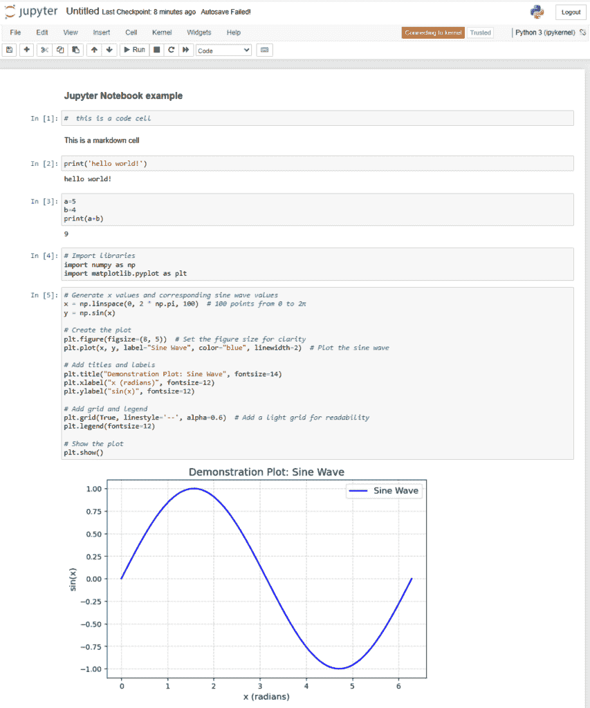
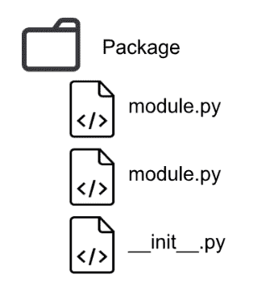
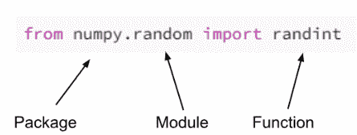
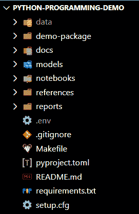
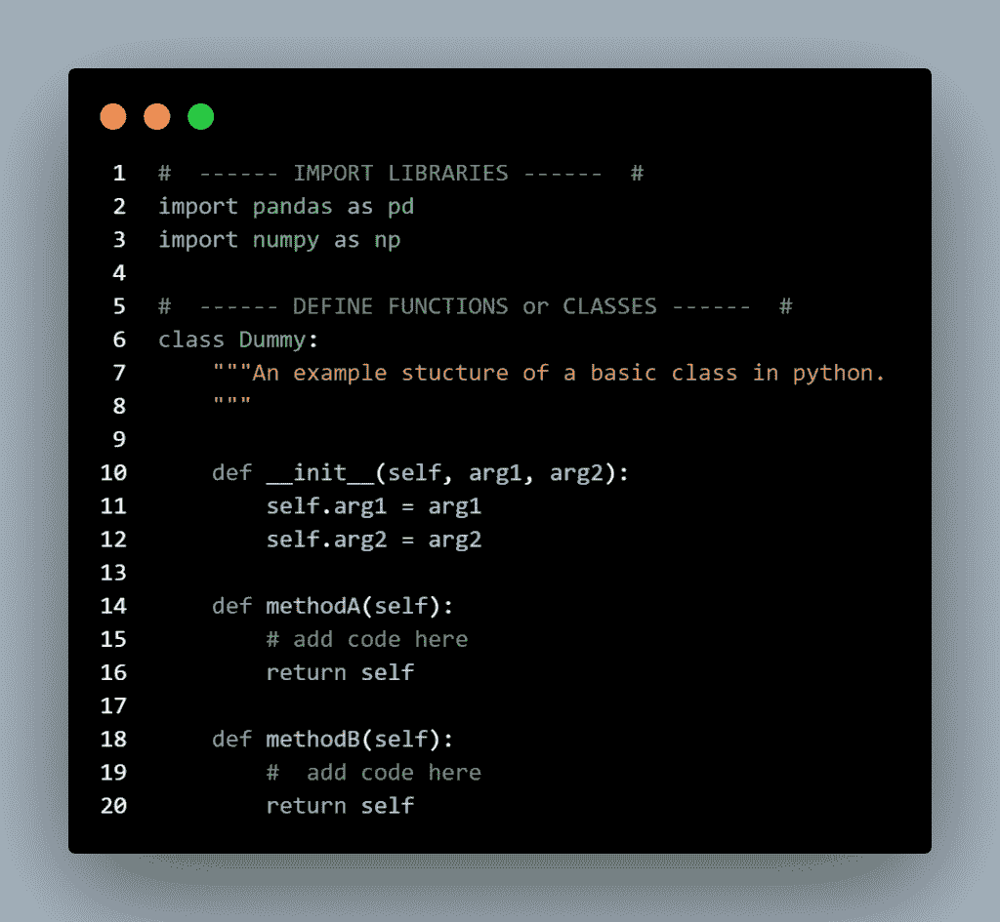
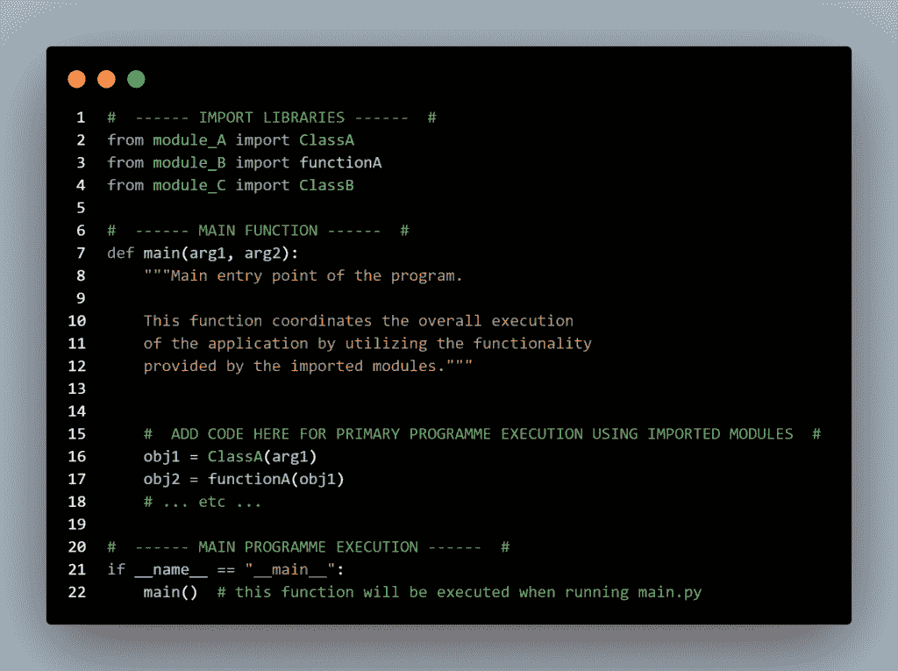
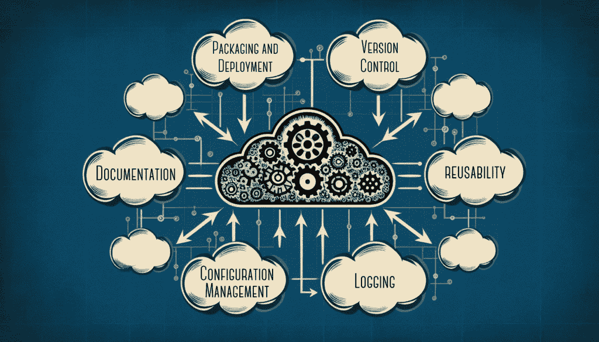

# 从 Jupyter 到程序员的旅程：快速入门指南

> 原文：[`towardsdatascience.com/the-journey-from-jupyter-to-programmer-a-quick-start-guide/`](https://towardsdatascience.com/the-journey-from-jupyter-to-programmer-a-quick-start-guide/)

<mdspan datatext="el1749079091056" class="mdspan-comment">大多数数据科学家</mdspan>，包括我自己，都是使用[Jupyter Notebook](https://jupyter.org/)开始他们的编码之旅。这些文件具有.ipynb 扩展名，代表**交互式 Python 笔记本**。正如扩展名所暗示的，它具有直观且交互式的用户界面。笔记本被分解为“单元格”或分离的代码或 Markdown（文本）语言的小块。一旦单元格中的代码被执行，输出就会显示在每个单元格下方。这促进了灵活且交互的环境，让编码者能够提升他们的编码技能并开始着手数据科学项目。

以下是一个典型的 Jupyter Notebook 示例：



以下是一个包含代码单元格、Markdown 单元格和示例可视化的 Jupyter Notebook 示例。

这听起来很棒。而且请别误会，对于像进行独立研究或探索性数据分析（EDA）这样的用例，Jupyter Notebook***确实***很棒。问题出现在你提出以下问题的时候：

+   你如何将 Jupyter Notebook 转换为可以被企业利用的代码？

+   你能否使用版本控制系统与其他开发者协作同一个项目？

+   你如何将代码部署到生产环境？

很快，仅限于在商业环境中使用 Jupyter Notebook 的局限性将开始引起问题。它根本不适合这些用途。一般的解决方案是以模块化的方式组织代码。

到本文结束时，你应该对如何将小型数据科学项目结构化为 Python 程序有一个清晰的理解，并欣赏转向编程方法的优点。你可以查看我在 github 上的一个示例模板，以补充本文内容[这里](https://github.com/lucydickinson/datascience/tree/main/datascience_project_template)。

* * *

### 免责声明

本文内容基于我迁移到不再仅使用 Jupyter Notebook 编写代码的经验。笔记本是否还有其用途？是的。除了我在本文中讨论的方法之外，还有没有其他组织和执行代码的替代方式？是的。

我想分享这些信息，帮助任何想要从笔记本转向编写脚本和程序的人。如果我在提到的局限性中遗漏了 Jupyter Notebook 的任何功能，请留下评论！

让我们回到这个问题上来。

* * *

## 编程：这有什么大不了的？

为了本文的目的，我将专注于 Python 编程语言，因为这是我用于数据科学项目的语言。将代码结构化为 Python 程序可以解锁一系列在仅使用 Jupyter Notebook 时难以实现的功能。这些好处包括协作、多功能性和便携性——你只需用代码就能做更多的事情。我将在下面进一步解释这些好处——请稍等片刻！

Python 程序通常组织成[模块](https://docs.python.org/3/tutorial/modules.html)和[包](https://docs.python.org/3/tutorial/modules.html#packages)。模块是一个 Python 脚本（以.py 扩展名结尾的文件），其中包含可以导入到其他文件中的 Python 代码。包是一个包含 Python 模块的目录。我将在文章的后面讨论文件`__init__.py`的作用。



数据科学项目中包和模块结构的示意图

每次你将 Python 库导入到你的代码中，比如内置库如`os`或第三方库如`pandas`，你实际上是在与一个组织成包和模块的 Python 程序交互。

例如，假设你想使用[numpy](https://numpy.org/doc/2.1/index.html)中的[randint](https://numpy.org/doc/2.1/reference/random/generated/numpy.random.randint.html)函数。这个函数允许你根据指定的参数生成一个随机整数。你可能这样写：

```py
from numpy.random import randint
```

让我们注释那个导入语句来展示你实际上在导入什么。



在这个例子中，`numpy`是一个*包*；`random`是一个*模块*，而`randint`是一个*函数*。

因此，你很可能在定期地与 Python 程序互动。这引发了一个问题，成为 Python 程序员的过程是什么样的？

## 伟大的转变：你甚至从哪里开始呢？

构建一个功能性的 Python 程序的关键在于文件结构和组织。这听起来很无聊，但它对你取得成功起着至关重要的作用！

让我用一个类比来解释：每座房子都有一个抽屉，里面几乎什么都有；工具、橡皮筋、药品、你的希望和梦想，应有尽有。没有规律或理由，它是一个几乎什么都有的大杂烩。想象一下这是一个 Jupyter Notebook。这个文件通常包含项目的所有阶段，从导入数据、探索数据的样子、可视化趋势、提取特征、训练模型等。对于一个注定要部署在生产系统上或与同事共同开发的项目，它将会造成混乱。所需要的是一些组织，把所有工具放在一个隔间里，药品放在另一个隔间，等等。

使用代码的一个好方法是使用项目模板。我经常使用的是 [Cookie Cutter Data Science 模板](https://github.com/drivendataorg/cookiecutter-data-science)。您可以在终端窗口中通过几个简单的操作创建一个包含所有相关文件的项目目录，以完成几乎所有工作 - 请参阅上面的链接以获取有关如何安装和运行 Cookie Cutter 的信息。

下面是项目模板的一些关键特性：

+   **package** 或 **src** 目录 — 用于 Python 脚本/模块的目录，配备了示例以帮助您开始

+   **readme.md** — 描述使用方法、设置和如何运行包的文件

+   **docs** 目录 — 包含使无缝自动文档化成为可能的文件

+   **Makefile** — 用于编写与操作系统无关的定制运行命令

+   **pyproject.toml/requirements.txt** — 用于依赖管理



由 Cookie Cutter Data Science 包创建的项目模板。

> **Top tip**. 确保 Cookie Cutter 保持最新。随着每一次发布，都会根据不断发展的数据科学宇宙添加新功能。我在探索模板中的新文件或新功能时学到了很多！

或者，您可以使用其他模板来构建您的项目，例如 [Poetry](https://python-poetry.org/) 提供的模板。Poetry 是一个包管理器，您可以使用它生成比 Cookie Cutter 更轻量级的项目模板。

与您的项目交互的最佳方式是通过 **IDE（集成开发环境）**。这种软件，如 [Visual Studio Code](https://code.visualstudio.com/) (VS Code) 或 [PyCharm](https://www.jetbrains.com/pycharm/)，包含各种功能和流程，使您能够高效地进行编码、测试、调试和打包工作。我个人的偏好是 VS Code！

* * *

## 从单元格到脚本：让我们开始编码

现在我们有了开发环境和结构良好的项目模板，如果您以前只在 Jupyter Notebook 中编写过代码，那么您如何在 Python 脚本中编写代码呢？为了回答这个问题，让我们首先考虑一些行业标准编码最佳实践。

+   **模块化** — 遵循软件工程哲学的“[单一责任原则](https://en.wikipedia.org/wiki/Single-responsibility_principle)”。所有代码都应该封装在函数中，每个函数执行单一任务。《Python 之禅》中提到：“简单比复杂好”。

+   **可读性** — 如果代码可读，那么它很可能易于维护。确保代码中充满了文档字符串和注释！

+   **时尚**——以一致和清晰的方式格式化代码。[PEP 8 指南](https://peps.python.org/pep-0008/)旨在为此目的提供建议，说明代码应该如何呈现。你可以在 IDE 中安装自动格式化工具，如[Black](https://pypi.org/project/black/)，以便在每次保存 Python 脚本时自动按照 PEP 8 格式化代码。例如，将应用正确的缩进和间距，这样你甚至都不必去想它！

+   **多功能**——如果代码封装到函数或类中，这些可以在整个项目中重用。

对于更深入的了解编码最佳实践，[这篇文章](https://medium.com/bitgrit-data-science-publication/8-coding-practices-for-data-scientists-2db7fa34bf76)是作为数据科学家应遵守的原则的绝佳概述，务必查看！

考虑到这些最佳实践，让我们回到问题：如何在 Python 脚本中编写代码？

* * *

## 模块结构

首先，将笔记本或项目的不同阶段分别放入不同的 Python 文件中。并确保根据任务命名它们。例如，在一个典型的机器学习包中，你可能会有以下脚本：`data.py`、`preprocess.py`、`features.py`、`train.py`、`predict.py`、`evaluate.py`等。根据你的项目结构，这些将位于`package`或`src`目录中。

在每个脚本中，代码应该是有组织的或“封装”成类和/或函数。一个**[函数](https://docs.python.org/3/tutorial/controlflow.html#defining-functions)**是一个可重用的代码块，执行单个、定义良好的任务。一个**[类](https://docs.python.org/3/tutorial/classes.html)**是创建对象的蓝图，具有自己的属性（变量）和方法（函数）。以这种方式封装代码允许重用并避免重复，从而保持代码简洁。

如果任务简单，脚本可能只需要一个函数。例如，一个数据加载模块（例如 `data.py`）可能只包含一个名为‘load_data’的函数，该函数将数据从 csv 文件加载到`pandas` DataFrame 中。其他脚本，如数据处理模块（例如 `preprocess.py`），将涉及更多任务，因此需要更多函数或类来封装这些任务。



数据科学项目中典型模块的示例模板。

> **技巧**。从 Jupyter Notebooks 过渡到脚本可能需要一些时间，每个人的个人旅程都会有所不同。我知道的一些数据科学家直接编写 Python 脚本代码，而不接触笔记本。我个人使用笔记本进行 EDA，然后封装代码到函数或类中，再移植到脚本中。做任何你觉得合适的事情。
> 
> 有一些工具可以帮助过渡。1) 在 VS Code 中，你可以选择一行或多行，右键点击并选择运行 Python > 在 Python 终端中运行选择/行。这类似于在 Jupyter Notebook 中运行一个单元格。2) 你可以通过点击文件 > 下载为 > Python (.py)将笔记本转换为 Python 脚本。我不建议用大型笔记本这样做，因为担心会创建出巨无霸脚本，但这个选项是存在的！

## `'__main__'`事件

在这一点上，我们已经确定代码应该封装到函数中，并存储在命名清晰的脚本中。接下来的逻辑问题是，你如何将这些脚本串联起来，以确保代码按正确的顺序执行？

答案是将这些脚本导入到一个单入口点，并在一个地方执行代码。在开发简单项目的上下文中，这个入口点通常是名为`main.py`的脚本（但也可以命名为其他任何名称）。在`main.py`的顶部，就像你会从[PyPI](https://pypi.org/)导入必要的内置包或第三方包一样，你会导入你自己的模块或从模块中导入特定的类/函数。在这些模块中定义的任何类或函数都将可供导入它们的脚本使用。

要做到这一点，你的项目目录中需要包含一个`__init__.py`文件，对于简单的项目通常留空。这个文件告诉 Python 解释器将目录视为一个包，这意味着任何以.py 扩展名的文件都被视为模块，因此可以被其他文件导入。

`main.py`的结构取决于项目，但通常将由代码执行的必要顺序决定。对于一个典型的机器学习项目，你首先需要使用`data.py`模块中的`load_data`函数。然后你可能实例化从`preprocess.py`模块导入的预处理类，并应用各种类方法到预处理对象上。然后你会继续进行特征工程，等等，直到整个工作流程编写完成。这个工作流程通常会被包含或引用在`main.py`底部的条件语句中。

等等……谁提到了条件语句？条件语句如下：

```py
if __name__ == '__main__': 
   #  add code here
```

`__name__`是一个特殊的 Python 变量，它的值取决于脚本的运行方式：

+   如果脚本直接在终端中运行，解释器会将`__name__`变量赋值为`'__main__'`。因为`if '__name__'=='__main__':`这个语句为真，所以任何位于这个语句内的代码都会被执行。

+   如果脚本作为导入的模块运行，解释器会将模块的名称作为字符串赋值给`__name__`变量。因为`if '__name__'=='__main__':`这个语句为假，所以这个语句的内容不会被执行。

关于这方面的更多信息可以在[这里](https://realpython.com/if-name-main-python/)找到。

给定这个过程，你需要在`if '__name__=='__main__':`条件语句中引用主函数，以便在运行`main.py`时执行。或者，你也可以将代码放在`if '__name__=='__main__':`之下，以实现相同的效果。



main.py 的示例模板，它是程序的入口点

`main.py`（或任何 Python 脚本）可以使用以下语法在终端中执行：

```py
python3 main.py
```

运行`main.py`后，代码将按照指定的顺序执行所有导入的模块中的代码。这和在 Jupyter Notebook 上点击“运行所有”按钮一样，每个单元格按顺序执行。现在的不同之处在于，代码被组织成逻辑上的独立脚本，并封装在类和函数中。

你还可以使用[argparse](https://docs.python.org/3/library/argparse.html)和[typer](https://typer.tiangolo.com/)等工具将**CLI（命令行界面）参数**添加到你的代码中，允许你在终端运行`main.py`时切换特定变量。这为代码执行提供了很大的灵活性。

因此，我们现在已经到达了最好的部分。真正的亮点。除了拥有组织得非常好且易于阅读的代码之外，你应该努力编程的真实原因。

* * *

## 最终目标：编程的意义是什么？

让我们来看看超越 Jupyter Notebooks 并转向编写 Python 脚本的一些关键好处。



编程关键好处的可视化。图像由作者生成。

+   **打包与分发**—你可以打包并分发你的 Python 程序，以便可以在另一台计算机上共享、安装和运行。可以使用 pip、poetry 或 conda 等包管理器来安装包，就像你从 PyPI 安装包一样，例如`pandas`或`numpy`。成功分发你的包的关键是确保依赖关系得到正确管理，这正是`pyproject.toml`或`requirements.txt`文件的作用所在。一些有用的资源可以在[这里](https://packaging.python.org/en/latest/tutorials/packaging-projects/)和[这里](https://realpython.com/python-wheels/)找到。

+   **部署**—虽然有多种方法和平台可以部署代码，但采用模块化方法将使你的代码更容易进入生产环境。例如，Docker 这样的工具可以在称为容器的隔离环境中部署程序或应用程序，这些容器可以通过 CI/CD（持续集成与部署）管道轻松管理。值得注意的是，虽然可以使用 [JupyterLab](https://jupyterlab.readthedocs.io/en/latest/) 部署 Jupyter Notebooks，但这种方法缺乏采用基于脚本的工作流程的灵活性和可扩展性。

+   **版本控制**—远离 Jupyter Notebooks 将开启版本控制和协作的奇妙世界。例如，Git 这样的版本控制系统是行业标准，并提供丰富的功能，只要你正确使用它们！遵循“增量更改是关键”的格言，确保你在开发过程中进行功能更改时，做出小而频繁的提交，并使用命令性语言编写有逻辑的提交信息。这将使跟踪更改和测试代码变得容易得多。[这里](https://towardsdatascience.com/comprehensive-guide-to-github-for-data-scientist-d3f71bd320da/) 是一个非常有用的指南，介绍了数据科学家如何使用 Git。

> **有趣的事实**。通常不建议将 Jupyter Notebooks 提交到版本控制系统，因为跟踪更改非常困难！

+   **（自动）文档**—我们都清楚，编写代码文档可以提高代码的可读性，从而帮助读者理解代码的功能。在 Python 脚本中为函数和类添加文档字符串被认为是最佳实践。真正酷的是，我们可以使用这些文档字符串以 HTML 文件的形式构建整个项目的格式化文档索引。例如，Sphinx 这样的工具可以让你快速轻松地完成这项工作。你可以阅读我之前的[文章](https://medium.com/data-science/step-by-step-basics-code-autodocumentation-fa0d9ae4ac71)，它将逐步引导你完成这个过程。

+   **可重用性**—采用模块化方法可以促进代码的重用。数据科学项目中有很多常见的任务，例如数据清洗或特征缩放。重新发明轮子没什么意义，所以如果你可以从以前的项目中重用函数或类，只需进行少量修改，并且没有保密限制，那么就节省那份时间吧！你可能有一个 `utils.py` 或 `classes.py` 模块，其中包含可以在模块间使用的模糊代码。

+   **配置管理**—虽然使用 Jupyter Notebook 也可以做到这一点，但通常的做法是使用配置管理来处理 Python 程序。配置管理是指以集中化的方式组织和管理工作参数和变量。而不是在代码中定义变量，它们被存储在位于项目目录中的文件中。这意味着您不需要检查代码来更改参数。有关此内容的概述可以在[这里](https://ibm.github.io/data-science-best-practices/configuration_management.html)找到。

> **注意**。如果您使用 YAML 文件（.yml）进行配置，则需要 Python 包`yaml`。请确保使用`pip install pyyaml`安装[pyyaml](https://pypi.org/project/PyYAML/)包（不是`yaml`）。忘记这一点可能会导致“找不到包”错误——我犯过这个错误，可能不止一次。

+   **日志记录**—在 Python 程序中使用日志记录器可以轻松跟踪代码执行、提供调试信息并监控程序或应用程序。虽然这种功能在 Jupyter Notebook 中也是可能的，但通常被认为过于冗余，因此通常使用 print()语句来替代。通过使用 Python 的[logger](https://docs.python.org/3/library/logging.html)模块，您可以按照自己的喜好格式化日志对象。它有五种不同的消息级别（info、debug、warning、error、critical），这些级别与被记录事件的严重性相关。您可以在代码中包含日志消息，以提供对代码执行的洞察，这些消息可以打印到终端和/或写入文件。您可以在[这里](https://docs.python.org/3/howto/logging.html)了解更多关于日志记录的信息。

## Jupyter Notebook 在何时有用？

正如我在本文开头所暗示的，Jupyter Notebook 在数据科学项目中仍然有其位置。它们易于使用的界面使它们非常适合探索性和交互式任务。以下列出了两个关键用例：

+   在项目初期对数据集进行探索性数据分析。

+   创建一个交互式资源或报告来展示分析结果。请注意，市面上有许多可以用于此类目的的工具，但 Jupyter Notebook 也可以做到这一点。

* * *

## 最后的想法

感谢您一直陪伴我到最后！我希望这次讨论能够让您有所启发，并对如何以及为什么开始编程有一些了解。在数据科学中，与大多数事情一样，解决问题并没有一种“正确”的方法，而是根据手头的任务采取一种经过深思熟虑的多方面方法。

向我的同事和同行数据科学家 Hannah Alexander 致敬，感谢她审阅这篇文章 🙂

感谢您的阅读！
