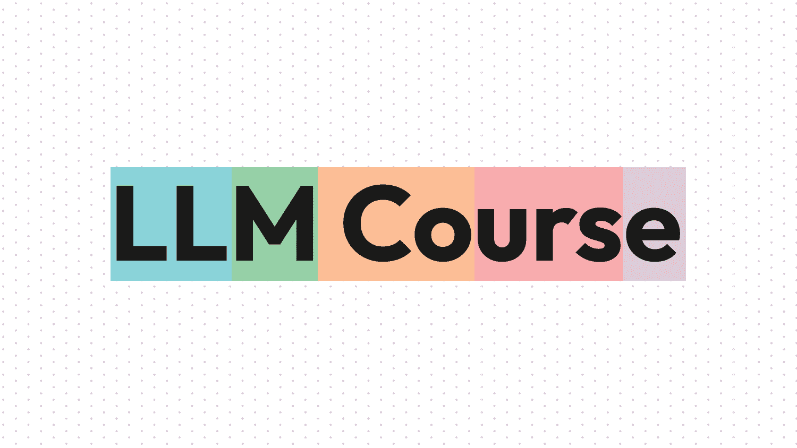
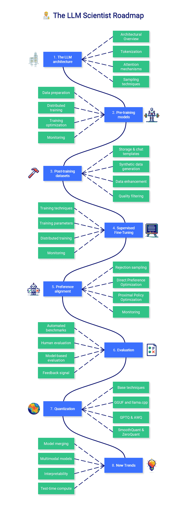
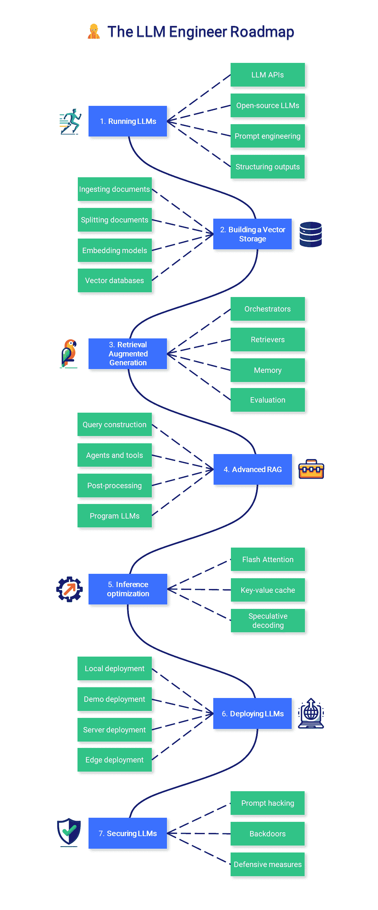

# 大型语言模型课程

> 原文：[`towardsdatascience.com/the-large-language-model-course-b6663cd57ceb/`](https://towardsdatascience.com/the-large-language-model-course-b6663cd57ceb/)

图片由作者提供

大型语言模型（LLM）课程是为人们了解 LLM 而收集的主题和教育资源集。它有两个主要路线图：

1.  🧑‍🔬 **LLM 科学家**专注于使用最新技术构建最佳可能的 LLM。

1.  👷 **LLM 工程师**专注于创建基于 LLM 的应用程序并将它们部署。

为了提供本课程的互动版本，我创建了一个 LLM 助手，它将在**[HuggingChat](https://hf.co/chat/assistant/66029d2e5f4a884f7aabc9d1)**（推荐）或**[ChatGPT](https://chat.openai.com/g/g-yviLuLqvI-llm-course)**上以个性化的方式回答问题并测试你的知识。

## 🧑‍🔬 LLM 科学家

本课程本节重点介绍如何使用最新技术构建最佳可能的 LLM。

图片由作者提供

## 1. LLM 架构

对 Transformer 架构的深入了解不是必需的，但了解现代 LLM 的主要步骤很重要：通过分词将文本转换为数字，通过包括注意力机制在内的层处理这些标记，并通过各种采样策略生成新的文本。

+   **架构概述**：了解从编码器-解码器 Transformer 到仅解码器架构如 GPT 的演变，这些架构是现代 LLM 的基础。关注这些模型在高级别上如何处理和生成文本。

+   **分词**：学习分词的原则——文本如何被转换为 LLM 可以处理的数值表示。探索不同的分词策略及其对模型性能和输出质量的影响。

+   **注意力机制**：掌握注意力机制的核心概念，特别是自注意力及其变体。了解这些机制如何使 LLM 能够处理长距离依赖关系并在序列中保持上下文。

+   **采样技术**：探索各种文本生成方法及其权衡。比较确定性方法如贪婪搜索和束搜索与概率方法如温度采样和核采样。

📚 **参考文献**：

+   [视觉化 Transformer 入门](https://www.youtube.com/watch?v=wjZofJX0v4M) 由 3Blue1Brown 提供：为初学者提供的 Transformer 视觉介绍。

+   [LLM 可视化](https://bbycroft.net/llm) 由 Brendan Bycroft 提供：LLM 内部的交互式 3D 可视化。

+   [nanoGPT](https://www.youtube.com/watch?v=kCc8FmEb1nY) 由 Andrej Karpathy 提供：一个 2 小时长的 YouTube 视频，从头开始重新实现 GPT（适用于程序员）。他还制作了一个关于[分词](https://www.youtube.com/watch?v=zduSFxRajkE)的视频。

+   [Attention? Attention!](https://lilianweng.github.io/posts/2018-06-24-attention/) by Lilian Weng：介绍注意力机制需求的概述。

+   [LLMs 中的解码策略](https://mlabonne.github.io/blog/posts/2023-06-07-Decoding_strategies.html) by Maxime Labonne：提供代码和不同解码策略的视觉介绍，以生成文本。

* * *

## 2. 预训练模型

预训练是一个计算密集且昂贵的流程。虽然这不是本课程的焦点，但了解模型如何进行预训练，特别是在数据和参数方面，是非常重要的。预训练也可以由爱好者在小规模（<1B 模型）上进行。

+   **数据准备**：预训练需要大量数据集（例如，[Llama 3.1](https://arxiv.org/abs/2307.09288)在 1500 亿个标记上进行了训练），需要仔细的策划、清理、去重和分词。现代预训练管道实施复杂的过滤以去除低质量或问题内容。

+   **分布式训练**：结合不同的并行化策略：数据并行（批量分布）、管道并行（层分布）和张量并行（操作拆分）。这些策略需要在 GPU 集群之间优化网络通信和内存管理。

+   **训练优化**：使用带有预热、梯度裁剪和归一化的自适应学习率以防止爆炸，混合精度训练以提高内存效率，以及具有调整超参数的现代优化器（AdamW、Lion）。

+   **监控**：使用仪表板跟踪关键指标（损失、梯度、GPU 统计），针对分布式训练问题实施有针对性的日志记录，并设置性能分析以识别跨设备计算和通信中的瓶颈。

📚 **参考文献**：

+   [FineWeb](https://huggingface.co/spaces/HuggingFaceFW/blogpost-fineweb-v1) by Penedo et al.：关于为 LLM 预训练重建大型数据集（15T）的文章，包括高质量子集 FineWeb-Edu。

+   [RedPajama v2](https://www.together.ai/blog/redpajama-data-v2) by Weber et al.：另一篇关于具有许多有趣质量过滤器的海量预训练数据集的文章和论文。

+   [nanotron](https://github.com/huggingface/nanotron) by Hugging Face：用于制作[SmolLM2](https://github.com/huggingface/smollm)的最小化 LLM 训练代码库。

+   [并行训练](https://www.andrew.cmu.edu/course/11-667/lectures/W10L2%20Scaling%20Up%20Parallel%20Training.pdf) by Chenyan Xiong：优化和并行技术概述。

+   [分布式训练](https://arxiv.org/abs/2407.20018) by Duan et al.：关于在分布式架构上高效训练 LLM 的调查。

+   [OLMo 2](https://allenai.org/olmo) by AI2：开源语言模型，包含模型、数据、训练和评估代码。

+   [LLM360](https://www.llm360.ai/) by LLM360：一个开源 LLM 框架，包含训练和数据准备代码、数据、指标和模型。

* * *

## 3. 后训练数据集

后训练数据集具有精确的结构，包含指令和答案（监督微调）或指令和选择的/拒绝的答案（偏好对齐）。对话结构比用于预训练的原始文本要少得多，这就是为什么我们经常需要处理种子数据并对其进行细化以提高样本的准确性、多样性和复杂性。更多信息及示例可在我的仓库[💾 LLM Datasets](https://github.com/mlabonne/llm-datasets)中找到。

+   **存储与聊天模板**：由于对话结构，训练后的数据集存储在特定格式中，如 ShareGPT 或 OpenAI/HF。然后，这些格式映射到聊天模板，如 ChatML 或 Alpaca，以生成模型训练所用的最终样本。

+   **合成数据生成**：使用 GPT-4o 等前沿模型根据种子数据创建指令-响应对。这种方法允许灵活且可扩展地创建具有高质量答案的数据集。关键考虑因素包括设计多样化的种子任务和有效的系统提示。

+   **数据增强**：使用验证输出（使用单元测试或求解器）、带有拒绝采样的多个答案、[Auto-Evol](https://arxiv.org/abs/2406.00770)、思维链、分支-解决-合并、角色扮演等技巧增强现有样本。

+   **质量过滤**：传统技术包括基于规则的过滤、删除重复或近似重复（使用 MinHash 或嵌入）、n-gram 去污染。奖励模型和评估 LLM 通过细粒度和可定制的质量控制来补充这一步骤。

📚 **参考文献**：

+   [合成数据生成器](https://huggingface.co/spaces/argilla/synthetic-data-generator) by Argilla：在 Hugging Face 空间中使用自然语言构建数据集的入门级方法。

+   [LLM Datasets](https://github.com/mlabonne/llm-datasets) by Maxime Labonne：后训练数据集和工具的精选列表。

+   [NeMo-Curator](https://github.com/NVIDIA/NeMo-Curator) by Nvidia：用于预训练和后训练数据的数据准备和整理框架。

+   [Distilabel](https://distilabel.argilla.io/dev/sections/pipeline_samples/) by Argilla：用于生成合成数据的框架。它还包括对像 UltraFeedback 这样的论文的有趣重现。

+   [Semhash](https://github.com/MinishLab/semhash) by MinishLab：用于近重复和去污染的精简库，具有蒸馏嵌入模型。

+   [聊天模板](https://huggingface.co/docs/transformers/main/en/chat_templating) by Hugging Face：Hugging Face 关于聊天模板的文档。

* * *

## 4. 监督微调

SFT 将基础模型转变为有用的助手，能够回答问题和遵循指令。在这个过程中，它们学习如何构建答案并重新激活在预训练期间学习到的部分知识。灌输新知识是可能的，但只是表面的：它不能用来学习一种全新的语言。始终优先考虑数据质量而不是参数优化。

+   **训练技术**：全参数微调更新所有模型参数，但需要大量的计算资源。像 LoRA 和 QLoRA 这样的参数高效微调技术通过训练少量适配器参数同时冻结基础权重来减少内存需求。QLoRA 将 4 位量化与 LoRA 结合以减少 VRAM 使用。

+   **训练参数**：关键参数包括具有调度器的学习率、批量大小、梯度累积、训练轮数、优化器（如 8 位 AdamW）、正则化的权重衰减和训练稳定性的预热步骤。LoRA 还增加了三个参数：rank（通常为 16-128）、alpha（1-2 倍 rank）和目标模块。

+   **分布式训练**：使用 DeepSpeed 或 FSDP 在多个 GPU 上扩展训练。DeepSpeed 通过状态分区提供三个 ZeRO 优化阶段，通过内存效率的提升来增加内存效率。两种方法都支持梯度检查点以提高内存效率。

+   **监控**：跟踪训练指标，包括损失曲线、学习率计划、梯度范数。监控常见问题，如损失峰值、梯度爆炸或性能下降。

📚 **参考文献**:

+   [使用 Unsloth 高效微调 Llama 3.1](https://huggingface.co/blog/mlabonne/sft-llama3) by Maxime Labonne：关于如何使用 Unsloth 微调 Llama 3.1 模型的实战教程。

+   [Axolotl – 文档](https://axolotl-ai-cloud.github.io/axolotl/) by Wing Lian：与分布式训练和数据集格式相关的许多有趣信息。

+   [掌握 LLM](https://parlance-labs.com/education/) by Hamel Husain：关于微调（但还包括 RAG、评估、应用和提示工程）的教育资源集合。

+   [LoRA 洞察](https://lightning.ai/pages/community/lora-insights/) by Sebastian Raschka：关于 LoRA 的实际见解以及如何选择最佳参数。

* * *

## 5\. 偏好对齐

偏好对齐是后训练管道的第二阶段，专注于使生成的答案与人类偏好对齐。这一阶段旨在调整 LLM 的语气并减少毒性和幻觉。然而，提高其性能和实用性也变得越来越重要。与 SFT 不同，有许多偏好对齐算法。在这里，我们将重点关注两个最重要的算法：DPO 和 PPO。

+   **拒绝采样**：对于每个提示，使用训练好的模型生成多个响应，并对它们进行评分以推断所选/被拒绝的答案。这创建了一种在线策略数据，其中两个响应都来自正在训练的模型，从而提高了对齐稳定性。

+   **[直接偏好优化](https://arxiv.org/abs/2305.18290)** 直接优化策略以最大化所选响应相对于被拒绝响应的可能性。它不需要奖励建模，这使得它在计算效率上比 PPO 更高，但在质量上略逊一筹。

+   **[近端策略优化](https://arxiv.org/abs/1707.06347)**：迭代更新策略以最大化奖励，同时保持接近初始行为。它使用奖励模型对响应进行评分，并需要仔细调整包括学习率、批量大小和 PPO 剪辑范围在内的超参数。

+   **监控**：除了 SFT 指标外，你还希望最大化所选答案和首选答案之间的差距。准确性也应逐渐增加，直到达到平台期。

📚 **参考文献**：

+   [展示 RLHF](https://huggingface.co/blog/rlhf) by Hugging Face：介绍 RLHF，包括奖励模型训练和强化学习微调。

+   [LLM 训练：RLHF 及其替代方案](https://magazine.sebastianraschka.com/p/llm-training-rlhf-and-its-alternatives) by Sebastian Rashcka：概述 RLHF 过程及其替代方案如 RLAIF。

+   [偏好调整 LLMs](https://huggingface.co/blog/pref-tuning) by Hugging Face：比较 DPO、IPO 和 KTO 算法以执行偏好对齐。

+   [使用 DPO 微调 Mistral-7b](https://mlabonne.github.io/blog/posts/Fine_tune_Mistral_7b_with_DPO.html) by Maxime Labonne：使用 DPO 微调 Mistral-7b 模型并重现[NeuralHermes-2.5](https://huggingface.co/mlabonne/NeuralHermes-2.5-Mistral-7B)的教程。

+   [DPO Wandb 日志](https://wandb.ai/alexander-vishnevskiy/dpo/reports/TRL-Original-DPO--Vmlldzo1NjI4MTc4) by Alexander Vishnevskiy：展示了要跟踪的主要指标和预期的趋势。

* * *

## 6\. 评估

可靠地评估 LLMs 是一项复杂但至关重要的任务，它指导数据生成和训练。它提供了关于改进领域的宝贵反馈，可以利用这些反馈来修改数据混合、质量和训练参数。然而，始终记住 Goodhart 定律是明智的：“当一项衡量标准成为目标时，它就不再是一个好的衡量标准。”

+   **自动化基准测试**：使用精心挑选的数据集和指标（如 MMLU）在特定任务上评估模型。它适用于具体任务，但在抽象和创造性能力方面存在困难。它也容易受到数据污染的影响。

+   **人工评估**：这涉及到人类提示模型并对响应进行评分。方法包括从感觉检查到根据具体指南进行系统注释以及大规模社区投票（竞技场）。它更适合主观任务，但在事实准确性方面不太可靠。

+   **基于模型的评估**：使用评判和奖励模型来评估模型输出。它与人类偏好高度相关，但存在对其自身输出的偏差和评分不一致的问题。

+   **反馈信号**：分析错误模式以识别特定的弱点，例如在遵循复杂指令方面的局限性、缺乏特定知识或对对抗性提示的敏感性。这可以通过更好的数据生成和训练参数来改进。

📚 **参考文献**:

+   Clémentine Fourrier 编写的 [评估指南](https://github.com/huggingface/evaluation-guidebook)：关于 LLM 评估的实用见解和理论知识。

+   Hugging Face 编写的 [Open LLM 领跑者板](https://huggingface.co/spaces/open-llm-leaderboard/open_llm_leaderboard)：以开放和可重复的方式比较 LLM 的主要排行榜（自动化基准测试）。

+   EleutherAI 编写的 [语言模型评估工具包](https://github.com/EleutherAI/lm-evaluation-harness)：用于使用自动化基准测试评估 LLM 的流行框架。

+   Hugging Face 编写的 [Lighteval](https://github.com/huggingface/lighteval)：包括基于模型的评估的替代评估框架。

+   LMSYS 编写的 [聊天机器人竞技场](https://lmarena.ai/)：基于人类比较（人工评估）的通用 LLM 的 Elo 排名。

* * *

## 7. 量化

量化是将模型参数和激活转换为较低精度的过程。例如，使用 16 位存储的权重可以转换为 4 位的表示。这种技术对于降低 LLM 的计算和内存成本变得越来越重要。

+   **基础技术**：学习不同精度的级别（FP32、FP16、INT8 等）以及如何使用 absmax 和零点技术进行简单的量化。

+   **GGUF & [llama.cpp](https://github.com/ggerganov/llama.cpp)**: 原本设计用于在 CPU 上运行，llama.cpp 和 GGUF 格式已成为在消费级硬件上运行 LLM 的最受欢迎的工具。它支持将特殊标记、词汇表和元数据存储在单个文件中。

+   **[GPTQ](https://arxiv.org/abs/2210.17323) & [AWQ](https://arxiv.org/abs/2306.00978)**: GPTQ/[EXL2](https://github.com/turboderp/exllamav2) 和 AWQ 等技术通过逐层校准，在极低位宽下保持性能。它们通过动态缩放来减少灾难性异常值，选择性地跳过或重新校准最重的参数。

+   **SmoothQuant & ZeroQuant**: 新的量化友好型转换（SmoothQuant）和基于编译器的优化（ZeroQuant）有助于在量化前减轻异常值。它们还通过融合某些操作和优化数据流来减少硬件开销。

📚 **参考文献**:

+   Maxime Labonne 编写的 [量化简介](https://mlabonne.github.io/blog/posts/Introduction_to_Weight_Quantization.html)：关于量化的概述，包括 absmax 和零点量化，以及带有代码的 LLM.int8()。

+   [使用 llama.cpp 量化 Llama 模型](https://mlabonne.github.io/blog/posts/Quantize_Llama_2_models_using_ggml.html) by Maxime Labonne：关于如何使用 llama.cpp 和 GGUF 格式量化 Llama 2 模型的教程。

+   [使用 GPTQ 进行 4 位 LLM 量化](https://mlabonne.github.io/blog/posts/4_bit_Quantization_with_GPTQ.html) by Maxime Labonne：关于如何使用 GPTQ 算法和 AutoGPTQ 量化 LLM 的教程。

+   [理解激活感知权重量化](https://medium.com/friendliai/understanding-activation-aware-weight-quantization-awq-boosting-inference-serving-efficiency-in-10bb0faf63a8) by FriendliAI：关于 AWQ 技术及其益处的概述。

+   [在 Llama 2 7B 上使用 SmoothQuant](https://github.com/mit-han-lab/smoothquant/blob/main/examples/smoothquant_llama_demo.ipynb) by MIT HAN Lab：关于如何使用 SmoothQuant 在 8 位精度下与 Llama 2 模型一起使用的教程。

+   [DeepSpeed 模型压缩](https://www.deepspeed.ai/tutorials/model-compression/) by DeepSpeed：关于如何使用 ZeroQuant 和极端压缩（XTC）与 DeepSpeed 压缩一起使用的教程。

* * *

## 8. 新趋势

这里有一些不适合其他类别的显著话题。其中一些是已建立的（模型合并、多模态）技术，但其他一些则是更实验性的（可解释性、测试时计算扩展）并且是众多研究论文的焦点。

+   **模型合并**：合并训练模型已成为创建高性能模型而不进行微调的流行方式。流行的 [mergekit](https://github.com/cg123/mergekit) 库实现了最流行的合并方法，如 SLERP、[DARE](https://arxiv.org/abs/2311.03099) 和 [TIES](https://arxiv.org/abs/2311.03099)。

+   **多模态模型**：这些模型（如 [CLIP](https://openai.com/research/clip)、[Stable Diffusion](https://stability.ai/stable-image)、或 [LLaVA](https://llava-vl.github.io/)）使用统一的嵌入空间处理多种类型的输入（文本、图像、音频等），这解锁了如文本到图像等强大的应用。

+   **可解释性**：机制可解释性技术，如稀疏自动编码器（SAEs），在提供关于 LLM 内部工作原理的见解方面取得了显著进展。这也已经应用了如消融等技术，允许在不进行训练的情况下修改模型的行为。

+   **测试时计算**：在测试时扩展计算预算需要多次调用，并涉及像进程奖励模型（PRM）这样的专用模型。通过精确评分的迭代步骤可以显著提高复杂推理任务的表现。

📚 **参考文献**：

+   [使用 mergekit 合并 LLMs](https://mlabonne.github.io/blog/posts/2024-01-08_Merge_LLMs_with_mergekit.html) by Maxime Labonne：关于使用 mergekit 进行模型合并的教程。

+   [Smol Vision](https://github.com/merveenoyan/smol-vision) by Merve Noyan：针对小型多模态模型的笔记本和脚本的集合。

+   [大型多模态模型](https://huyenchip.com/2023/10/10/multimodal.html)：Chip Huyen 对多模态系统和该领域最近历史的概述。

+   [使用 abliteration 去除任何 LLM 的传感器](https://huggingface.co/blog/mlabonne/abliteration)：Maxime Labonne 将可解释性技术直接应用于修改模型风格的应用。

+   [Adam Karvonen 对 SAEs 的直观解释](https://adamkarvonen.github.io/machine_learning/2024/06/11/sae-intuitions.html)：关于 SAEs 如何工作以及为什么它们对可解释性有意义的文章。

+   [通过 Beeching 等人进行的扩展测试时间计算](https://huggingface.co/spaces/HuggingFaceH4/blogpost-scaling-test-time-compute)：教程和实验，使用 3B 模型在 MATH-500 上超越 Llama 3.1 70B。

## 👷 LLM 工程师

本课程本节重点学习如何构建可用于生产的 LLM 应用程序，重点是增强模型和部署它们。

图片由作者提供

## 1. 运行 LLM

运行大型语言模型（LLM）可能因为硬件要求高而变得困难。根据您的使用场景，您可能只想通过 API（如 GPT-4）简单地使用模型，或者本地运行它。在任何情况下，额外的提示和指导技术都可以改善并限制您应用程序的输出。

+   **LLM API**：API 是部署 LLM 的便捷方式。这个空间被私有 LLM（[OpenAI](https://platform.openai.com/)、[Google](https://cloud.google.com/vertex-ai/docs/generative-ai/learn/overview)、[Anthropic](https://docs.anthropic.com/claude/reference/getting-started-with-the-api)、[Cohere](https://docs.cohere.com/docs)等）和开源 LLM（[OpenRouter](https://openrouter.ai/)、[Hugging Face](https://huggingface.co/inference-api)、[Together AI](https://www.together.ai/)等）所分割。

+   **开源 LLM**：[Hugging Face Hub](https://huggingface.co/models)是寻找 LLM 的好地方。您可以直接在[Hugging Face Spaces](https://huggingface.co/spaces)中运行其中的一些，或者下载并在[LM Studio](https://lmstudio.ai/)或通过 CLI 使用[llama.cpp](https://github.com/ggerganov/llama.cpp)或[Ollama](https://ollama.ai/)本地运行它们。

+   **提示工程**：常见技术包括零样本提示、少量样本提示、思维链和 ReAct。它们与更大的模型配合得更好，但也可以适应较小的模型。

+   **结构化输出**：许多任务需要结构化输出，如严格的模板或 JSON 格式。可以使用[LMQL](https://lmql.ai/)、[Outlines](https://github.com/outlines-dev/outlines)、[Guidance](https://github.com/guidance-ai/guidance)等库来引导生成并尊重给定的结构。

📚 **参考文献**:

+   [使用 LM Studio 本地运行 LLM](https://www.kdnuggets.com/run-an-llm-locally-with-lm-studio)：Nisha Arya 的简短指南，介绍如何使用 LM Studio。

+   [DAIR.AI 的提示工程指南](https://www.promptingguide.ai/)：包含示例的提示技术详尽列表。

+   [大纲 – 快速入门](https://dottxt-ai.github.io/outlines/latest/quickstart/)：Outlines 启用的引导生成技术的列表。

+   [LMQL – 概述](https://lmql.ai/docs/language/overview.html)：LMQL 语言的介绍。

* * *

## 2. 构建向量存储

创建向量存储是构建检索增强生成（RAG）管道的第一步。文档被加载、分割，并使用相关的片段来生成存储以供未来推理使用的向量表示（嵌入）。

+   **摄取文档**：文档加载器是方便的包装器，可以处理多种格式：PDF，JSON，HTML，Markdown 等。它们还可以直接从某些数据库和 API（GitHub，Reddit，Google Drive 等）检索数据。

+   **分割文档**：文本分割器将文档分解成更小、语义上有意义的片段。与在*n*个字符后分割文本相比，通常更好的做法是根据标题或递归分割，并附带一些额外的元数据。

+   **嵌入模型**：嵌入模型将文本转换为向量表示。它允许对语言有更深入和更细致的理解，这对于执行语义搜索至关重要。

+   **向量数据库**：向量数据库（如[Chroma](https://www.trychroma.com/)，[Pinecone](https://www.pinecone.io/)，[Milvus](https://milvus.io/)，[FAISS](https://faiss.ai/)，[Annoy](https://github.com/spotify/annoy)等）旨在存储嵌入向量。它们能够基于向量相似性高效检索与查询“最相似”的数据。

📚 **参考文献**：

+   [LangChain – 文本分割器](https://python.langchain.com/docs/modules/data_connection/document_transformers/)：LangChain 中实现的不同文本分割器的列表。

+   [Sentence Transformers 库](https://www.sbert.net/)：嵌入模型的流行库。

+   [MTEB 排行榜](https://huggingface.co/spaces/mteb/leaderboard)：嵌入模型的排行榜。

+   [顶级 5 个向量数据库](https://www.datacamp.com/blog/the-top-5-vector-databases) by Moez Ali：对最佳和最受欢迎的向量数据库的比较。

* * *

## 3. 检索增强生成

使用 RAG，LLMs 从数据库中检索上下文文档以提高其答案的准确性。RAG 是一种流行的无需微调即可增强模型知识的方法。

+   **编排器**：编排器（如[LangChain](https://python.langchain.com/docs/get_started/introduction)，[LlamaIndex](https://docs.llamaindex.ai/en/stable/)，[FastRAG](https://github.com/IntelLabs/fastRAG)等）是连接您的 LLMs 与工具、数据库、记忆等并增强其能力的流行框架。

+   **检索器**: 用户指令并未针对检索进行优化。可以应用不同的技术（例如，多查询检索器、[HyDE](https://arxiv.org/abs/2212.10496) 等）来重新表述/扩展它们并提高性能。

+   **内存**: 为了记住之前的指令和答案，LLM 和像 ChatGPT 这样的聊天机器人会将这些历史记录添加到它们的上下文窗口中。这个缓冲区可以通过摘要（例如，使用更小的 LLM）、向量存储+ RAG 等方式进行改进。

+   **评估**: 我们需要评估文档检索（上下文精确度和召回率）和生成阶段（忠实度和答案相关性）。可以使用工具 [Ragas](https://github.com/explodinggradients/ragas/tree/main) 和 [DeepEval](https://github.com/confident-ai/deepeval) 来简化这一过程。

📚 **参考文献**:

+   [Llamaindex – 高级概念](https://docs.llamaindex.ai/en/stable/getting_started/concepts.html): 构建 RAG 管道时需要了解的主要概念。

+   [Pinecone – 检索增强](https://www.pinecone.io/learn/series/langchain/langchain-retrieval-augmentation/): 检索增强过程的概述。

+   [LangChain – 与 RAG 的问答](https://python.langchain.com/docs/use_cases/question_answering/quickstart): 构建典型 RAG 管道的逐步教程。

+   [LangChain – 内存类型](https://python.langchain.com/docs/modules/memory/types/): 列出不同类型的内存及其相关用法。

+   [RAG 管道 – 指标](https://docs.ragas.io/en/stable/concepts/metrics/index.html): 评估 RAG 管道所使用的主要指标的概述。

* * *

## 4. 高级 RAG

现实生活中的应用可能需要复杂的管道，包括 SQL 或图数据库，以及自动选择相关工具和 API。这些高级技术可以提高基线解决方案并提供额外功能。

+   **查询构建**: 存储在传统数据库中的结构化数据需要特定的查询语言，如 SQL、Cypher、元数据等。我们可以通过查询构建直接将用户指令转换为查询以访问数据。

+   **代理和工具**: 代理通过自动选择最相关的工具来增强 LLM，以提供答案。这些工具可以像使用 Google 或 Wikipedia 一样简单，也可以像 Python 解释器或 Jira 一样复杂。

+   **后处理**: 处理输入到 LLM 的最后一步。它通过重新排序、[RAG-fusion](https://github.com/Raudaschl/rag-fusion) 和分类来增强检索到的文档的相关性和多样性。

+   **程序化 LLM**: 如 [DSPy](https://github.com/stanfordnlp/dspy) 这样的框架允许您以程序化的方式根据自动评估优化提示和权重。

📚 **参考文献**:

+   [LangChain – 查询构建](https://blog.langchain.dev/query-construction/): 关于不同类型查询构建的博客文章。

+   [LangChain – SQL](https://python.langchain.com/docs/use_cases/qa_structured/sql)：教程，介绍如何使用 LLM 与 SQL 数据库交互，涉及文本到 SQL 和一个可选的 SQL 代理。

+   [Pinecone – LLM 代理](https://www.pinecone.io/learn/series/langchain/langchain-agents/)：介绍不同类型的代理和工具。

+   [LLM 驱动的自主代理](https://lilianweng.github.io/posts/2023-06-23-agent/) by Lilian Weng：一篇关于 LLM 代理的更理论性的文章。

+   [LangChain – OpenAI 的 RAG](https://blog.langchain.dev/applying-openai-rag/)：概述 OpenAI 使用的 RAG 策略，包括后处理。

+   [8 步学习 DSPy](https://dspy-docs.vercel.app/docs/building-blocks/solving_your_task)：DSPy 的通用指南，介绍模块、签名和优化器。

* * *

## 5. 推理优化

文本生成是一个成本高昂的过程，需要昂贵的硬件。除了量化之外，还提出了各种技术来最大化吞吐量和降低推理成本。

+   **Flash Attention**：优化注意力机制，将其复杂度从二次方转换为线性，加快训练和推理的速度。

+   **键值缓存**：理解键值缓存以及[多查询注意力](https://arxiv.org/abs/1911.02150)（MQA）和[分组查询注意力](https://arxiv.org/abs/2305.13245)（GQA）中引入的改进。

+   **推测性解码**：使用一个小模型生成草案，然后由大模型进行审查，以加快文本生成速度。

📚 **参考文献**：

+   Hugging Face 的[GPU 推理](https://huggingface.co/docs/transformers/main/en/perf_infer_gpu_one)：解释如何在 GPU 上优化推理。

+   [LLM 推理](https://www.databricks.com/blog/llm-inference-performance-engineering-best-practices) by Databricks：在生产中优化 LLM 推理的最佳实践。

+   Hugging Face 的[优化 LLM 的速度和内存](https://huggingface.co/docs/transformers/main/en/llm_tutorial_optimization)：解释了三种主要的优化速度和内存的技术，即量化、Flash Attention 和架构创新。

+   Hugging Face 的[辅助生成](https://huggingface.co/blog/assisted-generation)：HF 的推测性解码版本，这是一篇有趣的博客文章，介绍了它是如何与代码结合来实现它的。

* * *

## 6. 部署 LLM

大规模部署 LLM 是一项工程壮举，可能需要多个 GPU 集群。在其他情况下，可以通过更低的复杂性实现演示和本地应用程序。 

+   **本地部署**：隐私是开源 LLM 相对于私有 LLM 的一个重要优势。本地 LLM 服务器（[LM Studio](https://lmstudio.ai/)、[Ollama](https://ollama.ai/)、[oobabooga](https://github.com/oobabooga/text-generation-webui)、[kobold.cpp](https://github.com/LostRuins/koboldcpp)等）利用这一优势来为本地应用程序提供动力。

+   **演示部署**：如 [Gradio](https://www.gradio.app/) 和 [Streamlit](https://docs.streamlit.io/) 这样的框架有助于原型设计和演示分享。您还可以轻松地将它们托管在网络上，例如使用 [Hugging Face Spaces](https://huggingface.co/spaces)。

+   **服务器部署**：大规模部署 LLM 需要云（另见 [SkyPilot](https://skypilot.readthedocs.io/en/latest/)）或本地基础设施，并经常利用优化的文本生成框架，如 [TGI](https://github.com/huggingface/text-generation-inference)、[vLLM](https://github.com/vllm-project/vllm/tree/main) 等。

+   **边缘部署**：在受限环境中，高性能框架如 [MLC LLM](https://github.com/mlc-ai/mlc-llm) 和 [mnn-llm](https://github.com/wangzhaode/mnn-llm/blob/master/README_en.md) 可以在网页浏览器、Android 和 iOS 上部署 LLM。

📚 **参考文献**：

+   [Streamlit – 构建基本的 LLM 应用](https://docs.streamlit.io/knowledge-base/tutorials/build-conversational-apps)：教程，介绍如何使用 Streamlit 制作基本的 ChatGPT 类应用。

+   [HF LLM 推理容器](https://huggingface.co/blog/sagemaker-huggingface-llm)：使用 Hugging Face 的推理容器在 Amazon SageMaker 上部署 LLM。

+   Philipp Schmid 的 [Philschmid 博客](https://www.philschmid.de/)：关于使用 Amazon SageMaker 部署 LLM 的高质量文章集合。

+   Hamel Husain 的 [优化延迟](https://hamel.dev/notes/llm/inference/03_inference.html)：在吞吐量和延迟方面比较了 TGI、vLLM、CTranslate2 和 mlc。

* * *

## 7. 保护 LLM

除了与软件相关的传统安全问题外，LLM 由于其训练和提示方式具有独特的弱点。

+   **提示黑客技术**：与提示工程相关的不同技术，包括提示注入（附加指令以劫持模型的答案）、数据/提示泄露（检索其原始数据/提示）和越狱（构建绕过安全功能的提示）。

+   **后门**：攻击向量可以针对训练数据本身，通过污染训练数据（例如，使用虚假信息）或创建后门（在推理期间改变模型行为的秘密触发器）。

+   **防御措施**：保护您的 LLM 应用程序的最佳方式是测试它们以对抗这些漏洞（例如，使用红队和如 [garak](https://github.com/leondz/garak/) 这样的检查）并在生产中观察它们（使用如 [langfuse](https://github.com/langfuse/langfuse) 这样的框架）。

📚 **参考文献**：

+   HEGO Wiki 的 [OWASP LLM Top 10](https://owasp.org/www-project-top-10-for-large-language-model-applications/)：列出了在 LLM 应用中看到的 10 个最关键漏洞。

+   Joseph Thacker 的 [Prompt Injection Primer](https://github.com/jthack/PIPE)：针对工程师的关于提示注入的简短指南。

+   [@llm_sec](https://twitter.com/llm_sec) 的 [LLM 安全](https://llmsecurity.net/)：与 LLM 安全相关的资源广泛列表。

+   [微软的 LLM 红队测试](https://learn.microsoft.com/en-us/azure/ai-services/openai/concepts/red-teaming)：如何使用 LLM 进行红队测试的指南。

## 结论

我的主要建议是做一些你感兴趣的事情。在 Google Colab 笔记本中安装库，玩弄它们，在 Hugging Face Spaces 上部署一个模型，破解一个应用程序，量化一个 LLM，或者为 RAG 微调它。找到你自己的细分市场并持续探索它，阅读论文，并实现你自己的想法。这是一个研究领域广泛、研究资金充裕的领域。在这个整个课程中成为某个领域的专家，你将使自己变得无价！ :)
