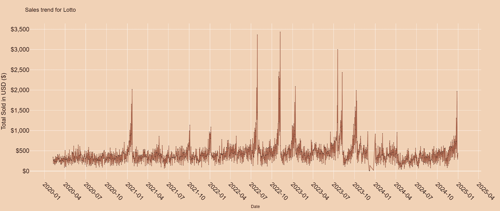
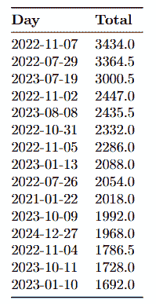
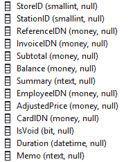
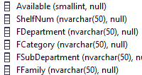
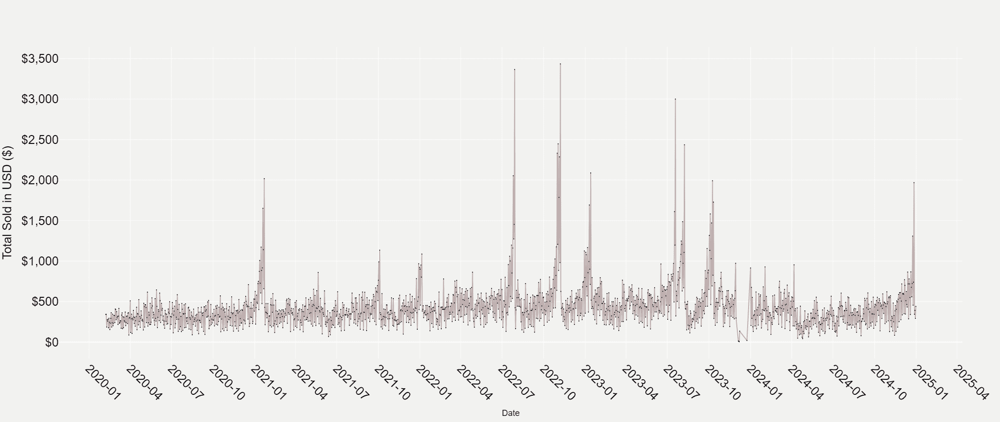
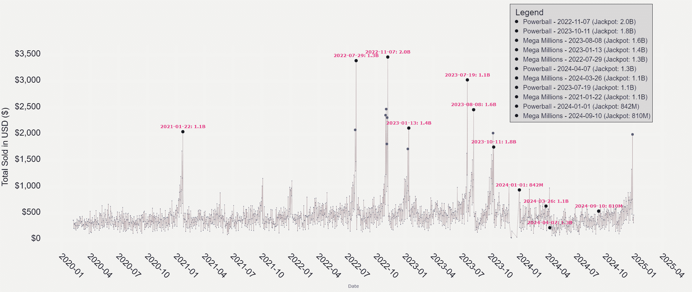
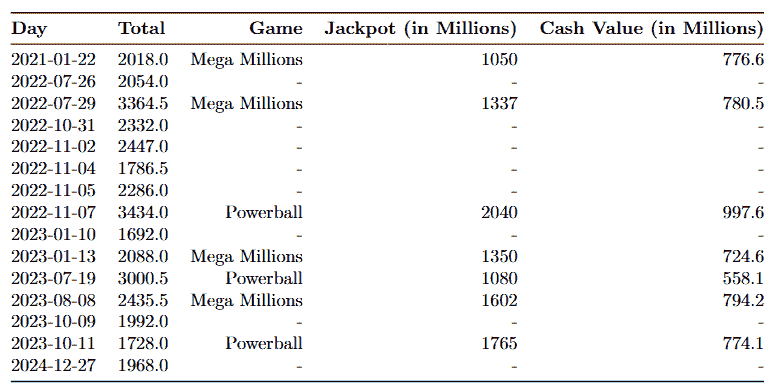
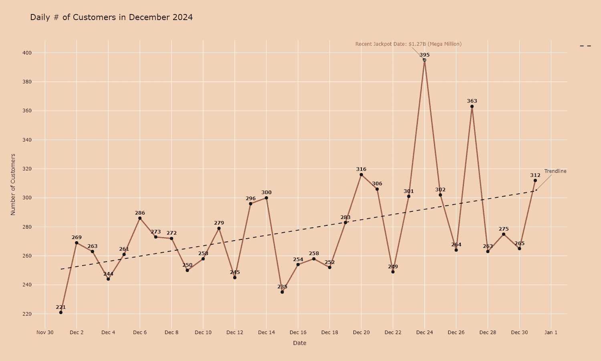

# 幸运、野心和十亿美元梦想背后的数据：彩票

> 原文：[`towardsdatascience.com/the-lottery-data-behind-the-luck-ambition-and-a-billion-dollar-dream-c31fdc17d170/`](https://towardsdatascience.com/the-lottery-data-behind-the-luck-ambition-and-a-billion-dollar-dream-c31fdc17d170/)



来自当地零售店的彩票销售趋势

> 如果你不是 Medium 的付费会员，我可以免费提供我的故事：[朋友链接](https://medium.com/@sahn1998/the-lottery-data-behind-the-luck-ambition-and-a-billion-dollar-dream-c31fdc17d170?sk=f835e3ecf02326219f4f2c578a4df310)

今天这篇文章稍微偏离了我通常的数据科学作品，但别担心——它不会偏离太远（希望它也能为你提供有趣的分析和见解）！

今天，我将谈论一个可能每个人在某个时刻都谈论过的话题——无论是和朋友开玩笑还是作为一个严肃的白日梦。**你问这是什么呢？**

> 彩票

如你们大多数人可能知道的那样…彩票几十年来一直是幸运和野心的象征。你有多少次听到有人说，“这是我的改变一生的彩票”，或者“如果我赢了，我就要辞职去环游世界”？

即使赌博不是你的事——对大多数人来说，它不是——一张幸运的金票和改变一生的奖金有一种方式吸引人们。

现在，我要承认，我不是一个喜欢赌博的人。把辛苦赚来的钱花在概率为 2.92 亿分之一的事情上？**这绝对不是我的投资理念。**

即使是我也无法忽视对它的兴趣，尤其是在奖金池达到天文数字的时候。你得承认，很难不感到一丝诱惑，想去当地的杂货店买一张彩票——即使你发誓你永远不会赌博。

以最近的兆彩大奖（2024 年 12 月）为例。它达到了令人震惊的**13 亿美元**，幸运的赢家出现在加利福尼亚州。看到这样一个巨大的数字让我不禁问…

### 奖金池是如何变得如此之大的？

显而易见答案是简单的：没有人得到中奖彩票，奖金滚入下一期抽奖。

*但还有更多吗？* 更大的奖金能否吸引更多的彩票购买者，从而形成一个反馈循环，进一步膨胀奖金池？我会假设是这样，但这是否真的如此？

* * *

## 我的好奇心遇到了数据

嗯…这类问题是我每次听到朋友们或同事谈论彩票奖金有多大时，我总是很好奇的问题。

所以，就像我这位好奇的乔治（我的名字不是乔治，但你应该明白我的意思）一样，我决定用数据科学的视角来看待这个“赌注”。**幸运的是，我有幸从一位每年销售大量彩票的零售店店主家庭成员那里获得了彩票销售数据（2020–2025）。**

虽然我对国家彩票机构的运营没有深入了解，但我确实可以接触到一些更个人化的东西——*消费者行为的局部快照*。



零售店的销售额前 15 名数据（美元）

接下来的几节，我将更深入地探讨。彩票可能是一场机会游戏，但其中隐藏着丰富的见解。

* * *

## 简要背景

对于那些对美国彩票系统不熟悉的人来说，有两个主要的全国性游戏：

+   **Powerball**

+   **兆彩**

这些游戏负责了历史上一些最大的奖金，当没有人赢得头奖时，奖金池经常滚入数十亿。这两个游戏运作方式相似：玩家选择数字，抽签决定赢家。但几率呢？它们是天文数字。对于 Powerball，赢得头奖的几率大约是**每 2.92 亿分之一**，而对于兆彩，则是**每 3.02 亿分之一**。

尽管几率如此之低，但每周仍有数百万人参与。

> 为什么？

我将借用我在社交媒体上很久以前看到的话。*"为什么？因为花几美元，人们不仅仅是在买彩票——他们是在买一个梦想。"*

* * *

## 数据：我们能学到什么？

数据跨度从 2020 年初到 2024 年末，我试图回答一个简单的问题：*数据是否告诉我们什么可以驱动人们购买彩票，以及我能从中推断出什么？*

在我们继续查看数据之前，重要的是要解决业务在 2024 年面临的一个重大挑战。由于该地区的广泛建设，商店在大部分时间里没有为顾客提供可通行的道路。**这可以理解地导致该期间的平均销售额下降，这将在数据中得到反映**。

### 从数据库中提取彩票销售数据（SQL）

在我进入分析本身之前，我想简要地展示一下数据表的样子。为什么？因为从旧 POS 系统的数据库中提取彩票销售数据可不是一件小事情。

糟糕的设计和组织结构使得这个过程相当具有挑战性。数据类型不一致，列名糟糕，表结构远非直观。



数据库中**商品销售表**的部分截图



数据库中**类别表**的部分截图

然而，在分析数据库中的表格一个小时后，我发现一个表格包含了一个**小计、日期、引用 ID 到类别表，以及类别表为产品提供了标签**（当然还有更多，但现在我只需要这些）。这很好，因为对于彩票销售，类别被定义为“彩票”，所以我只需要进行一些 LEFT JOIN 操作来提取数据！以下是一个简化的例子，展示了它是如何结合在一起的。

```py
-- Note: Column names weren't actually this simple --
SELECT
 ti.itemID,
 ti.date,
 ti.subtotal,
 ti.summary, -- Description of the item
 ci.category
FROM ItemSalesTable ti
LEFT JOIN CategoryTable ci -- Join
    ON ti.ReferenceID = ci.CategoryID 
WHERE ci.category = 'Lottery'
ORDER BY ModifyDate;
```

## 销售趋势

在 SQL 中提取和转换数据后，我得到了一个更加干净的数据库集，为在 Python 中进行更深入的分析做好了准备。

> 所有用于图形的 Python 代码都在文章的末尾！



本地零售店的彩票销售趋势

初看之下，每日销售数据看起来相当一致。有些日子销售量较高，有些日子销售量较低。然而，你不可避免地会注意到时间线上散布的急剧峰值。这些异常值立即引起了我的注意，促使我提出问题：***是什么导致了这些销售量的显著增加？***



突出显示奖金日期的彩票销售趋势

**说实话，正如你可能已经猜到的，答案相当简单。这正是新闻媒体经常提到的“大奖热”。**随着奖金的增长，巨额奖金的吸引力推动了票务销售的显著激增，这一点在数据中很明显。

例如，在 2022 年 11 月的**强力球大奖**中，奖金达到了前所未有的 20.4 亿美元，零售店的日票销售量比月平均数激增了超过**600%**。这不仅是在整个数据集中销售量最高的激增，而且在奖金被领取的前几天，销售量也持续增加。这些预抽签激增表明，不断上升的奖金吸引了既定买家也吸引了那些通常不参与的人的注意。

在 2023 年 10 月，当强力球奖金池达到 17.6 亿美元时，出现了类似的趋势。再次，围绕奖金的兴奋情绪推动了销售激增。我认为这真的显示了更大的奖金池如何影响消费者行为！



前 15 名销售数据（美元）**包含彩票奖金**

```py
# Find the top 15 sales data from the 'subtotal' column
top_15_indices = data.nlargest(15, 'subtotal').index
data.loc[top_15_indices]
```

**特别令人着迷的是，这些见解仅来自单个零售店的数据。它表明这些时刻不仅仅关乎数字——它代表了所有美国人共同的集体心理梦想。**

* * *

## 那么，你认为这些峰值揭示了什么？

我认为这个图表不仅突出了奖金驱动的销售，而且提供了对人类行为和文化影响的非常有趣的见解。

### 大奖的反馈循环

随着奖金池的增长，销售额自然会随之增加。更大的奖金创造了一个反馈循环，其中巨额金钱（和退休）的承诺推动了更高的参与度。显然，正如你可能想象的那样，进一步推高了奖金。我认为这真正反映了炒作、媒体报道和害怕错过的恐惧（FOMO）的力量。

### 季节性影响

同样有趣的是，票务销售的峰值与一年中的某些时间点相吻合，尤其是**假日时期**。每年年底或年初都会出现显著的增长，这可能是由于假日赠礼和新年的乐观情绪所驱动。

零售店的老板告诉我，有些人有时会为他们的家庭礼物购买超过 1000 美元的彩票！太疯狂了。

### 疫情影响

有趣的是，2020 年和 2021 年的峰值出现得较少。这很可能反映了 COVID-19 大流行的影响。在大流行初期，由于人们优先考虑必需品（还记得卫生纸短缺吗？），销售额下降。然而，随着时间的推移，销售额又反弹了。

**我认为可以说，从这些数据中得出的见解确实有一些点，数据科学家或数据分析师可以进一步质疑和分析。**

* * *

## 不只是彩票

我知道这篇文章一直关注销售数据。但，我个人认为强调彩票不仅仅提供中奖机会非常重要。**它们在支持小型企业方面发挥着关键作用。**



2024 年 12 月客户流量数据

对于许多销售彩票的当地商店来说，这不仅仅是一笔交易——这是吸引那些可能不会走进他们店门的顾客的一种方式。这些访问往往会导致额外的购买，无论是咖啡、快速小吃还是最后一刻的商品。这种客流量增加在经济困难时期或商店试图从挫折中恢复时尤为重要。

以这个数据背后的零售店为例。在经历了几个月由大规模道路建设（于 2024 年 8 月和 9 月完成）造成的干扰之后，该店努力恢复其通常的客户流量。

**然而，最近彩票奖金的激增导致客流量急剧反弹，12 月份的客流量达到全年最高——回到了商店在施工开始之前的水平。**

因此，虽然彩票通常被视为一种赌博，但我认为它发挥着更大的作用。它就像当地经济的一个小催化剂，帮助小型企业不仅生存，而且繁荣。每张售出的彩票不仅仅是买家实现梦想的机会——它也是那些依赖这些顾客保持门面开张的企业的生命线。

* * *

## 总结

我认为还有很多东西可以找到和讨论，但我希望这篇文章比我通常的文章要短。对于那些感兴趣的人，我将在文章的末尾提供代码片段。

初看彩票可能只是赌博。但有趣的是，它可能还有更多。从巨额奖金期间的急剧波动到它在维持小企业中稳定的角色，我认为彩票是运气、雄心和社区影响的迷人交汇点。

对于这些数据背后的商店来说，彩票不仅仅是卖票。这是在几个月的挣扎之后重建的方式，吸引顾客回来，重新点燃他们的生意。对于买家来说，每一张彩票代表的不仅仅是财富的机会——这是共享兴奋、希望和参与更大事物的时刻。

最后，彩票讲述了一个故事。这是关于人类乐观和韧性的故事，关于企业找到生存之道，以及一个社区在改变他们生活可能性极小但极具吸引力的可能性下团结在一起。

也许，也许这就是它值得所有炒作的原因。

***

## 与我联系！

+   **[领英](https://www.linkedin.com/in/sahn1998/)**, **[Instagram](https://www.instagram.com/sunghyunie/)**

+   **电子邮件**, **[网站](https://sunghyun-ahn.com/)**

如果你已经读到这儿，我假设你是一个热衷于 Medium 的读者。如果你是数据科学家，或者在这个领域工作，或者你想学习，我很乐意和你聊天！请随时联系！

> **对于那些对我的图片感到好奇的人：除非另有说明，所有图片均由作者（我自己）提供。**
> 
> **数据（零售商店）的所有者也已经授权使用这些数据用于文章目的。**
> 
> [**Sunghyun Ahn – Medium**](https://medium.com/@sahn1998)

## 代码

我想指出，我在代码中并没有包含任何实际数据。

### 第一张图

```py
# Create the figure
fig = go.Figure()

# Add the line for total price
fig.add_trace(go.Scatter(
    x=daily_lotto_data['day'],
    y=daily_lotto_data['Total'],
    mode='lines+markers',
    name='Price per Item',
    line=dict(color='#a65e46'),
    marker=dict(color="#02000d", size=2),
    hovertemplate='<b>Date:</b> %{x|%Y-%m-%d}<br><b>Total Sold:</b> $%{y:,.2f}<extra></extra>',
))

# Customize the layout
fig.update_layout(
    title=dict(
        text='Sales trend for Lotto',
        font=dict(size=24, family='Arial', color='black')  
    height=900,
    xaxis=dict(
        title=dict(
            text='Date',
            font=dict(size=18, family='Arial', color='black') 
        ),
        tickformat='%Y-%m',
        dtick='M3',  # Every 3 months
        tickangle=45,
        tickfont=dict(size=26, family='Arial', color='black')
    ),
    yaxis=dict(
        title=dict(
            text='Total Sold in USD ($)',
            font=dict(size=26, family='Arial', color='black')
        ),
        tickprefix='$',
        separatethousands=True,
        tickfont=dict(size=26, family='Arial', color='black') 
    ),
    legend=dict(
        title=dict(
            text='Legend',
            font=dict(size=26, family='Arial', color='black') 
        ),
        font=dict(size=14, family='Arial', color='black')
    ),
    plot_bgcolor="#f1d2b6",
    paper_bgcolor="#f1d2b6"
)

# Show the plot
fig.show()
```

### 第二张图

```py
# Define the top 15 prize data
lotto_top15_data = pd.DataFrame({
    'Rank': [1, 2, 3, 4, 5, 6, 7, 8, 9, 10, 11, 12, 13, 14, 15],
    'Date': ['Nov 7, 2022', 'Oct 11, 2023', 'Aug 8, 2023', 'Jan 13, 2016', 'Oct 23, 2018',
             'Jan 13, 2023', 'Jul 29, 2022', 'Apr 7, 2024', 'Mar 26, 2024', 'Jul 19, 2023',
             'Jan 22, 2021', 'Jan 1, 2024', 'Sep 10, 2024', 'Mar 27, 2019', 'Aug 23, 2017'],
    'Game': ['Powerball', 'Powerball', 'Mega Millions', 'Powerball', 'Mega Millions',
             'Mega Millions', 'Mega Millions', 'Powerball', 'Mega Millions', 'Powerball',
             'Mega Millions', 'Powerball', 'Mega Millions', 'Powerball', 'Powerball'],
    'Jackpot': [2040, 1765, 1602, 1586, 1537, 1350, 1337, 1326, 1130, 1080, 1050, 842, 810, 768, 759],  # Prize in millions
    'Cash Value': [997.6, 774.1, 794.2, 983.5, 877.8, 724.6, 780.5, 621, 537.5, 558.1, 776.6, 425.2, 409.3, 477, 480.5]
})

# Convert dates to datetime format
lotto_top15_data['Date'] = pd.to_datetime(lotto_top15_data['Date'])

# Filter dates between 2020 and 2025
highlighted_dates = lotto_top15_data[(lotto_top15_data['Date'] >= '2020-01-01') &amp; (lotto_top15_data['Date'] <= '2025-12-31')]

# Identify the top 10 values
daily_lotto_data['color'] = '#2E3192'  # Default color for all points
top_15_indices = daily_lotto_data.nlargest(15, 'Total').index
daily_lotto_data.loc[top_15_indices, 'color'] = '#a6445d'  # Assign special color for top 15 values

# Create the Plotly figure
fig = go.Figure()

# Add the line trace
fig.add_trace(go.Scatter(
    x=daily_lotto_data['day'],
    y=daily_lotto_data['Total'],
    mode='lines+markers',
    marker=dict(
        color=daily_lotto_data['color'],
        size=2
    ),
    line=dict(
        color='#142f40',  # Line color
        width=1
    ),
    name='Price per Item',
    hovertemplate='<b>Date:</b> %{x|%Y-%m-%d}<br><b>Total Price:</b> %{y}<extra></extra>',
    showlegend=False
))

# Add highlighted jackpot dates with prize pool cost
for _, row in highlighted_dates.iterrows():
    jackpot_label = f"{row['Jackpot'] / 1000:.1f}B" if row['Jackpot'] >= 1000 else f"{row['Jackpot']}M"  # Format B for billions
    fig.add_trace(go.Scatter(
        x=[row['Date']],
        y=[daily_lotto_data[daily_lotto_data['day'] == row['Date']]['Total'].values[0]] if row['Date'] in daily_lotto_data['day'].values else [None],
        mode='markers+text',
        text=f"<b>{row['Date'].strftime('%Y-%m-%d')}: {jackpot_label}</b>",
        textposition="top center",
        textfont=dict(
            color='#ED1E79',  # Text color for jackpot markers
            size=14  # Smaller text size for annotations
        ),
        name=f"{row['Game']} - {row['Date'].strftime('%Y-%m-%d')} (Jackpot: {jackpot_label})",
        marker=dict(size=10, color='#ED1E79')  # Larger markers for jackpot dates
    ))

# Adjust marker size for top 15 points that are not jackpot dates
for idx in top_15_indices:
    if daily_lotto_data.loc[idx, 'day'] not in highlighted_dates['Date'].values:
        fig.add_trace(go.Scatter(
            x=[daily_lotto_data.loc[idx, 'day']],
            y=[daily_lotto_data.loc[idx, 'Total']],
            mode='markers',
            marker=dict(
                size=8,
                color='#a71f13'
            ),
            name='Top 15 Non-Jackpot',
            hoverinfo='skip',  # Disable hover info for these markers
            showlegend=False  # Hide legend for these points
        ))

# Update layout
fig.update_layout(
    title="Sales Trend for Lotto with Highlighted Jackpot Dates (2020–2025)",
    title_font=dict(size=28, family="Arial", color="black"),
    xaxis=dict(
        title='Date',
        tickformat='%Y-%m',
        dtick="M3",
        tickangle=45,
        tickfont=dict(size=26, family='Arial', color='black')
    ),
    yaxis=dict(
        title='Total Sold',
        title_font=dict(size=26, family="Arial", color="black"),
        tickfont=dict(size=26, family='Arial', color='black')
    ),
    legend=dict(
        title=dict(
            text="Legend",
            font=dict(size=26, family="Arial", color="black")
        ),
        font=dict(size=20, family="Arial", color="black"),
        x=0.75,
        y=1.2,
        bgcolor="#ffffff",
        bordercolor="#000000",
        borderwidth=1
    ),
    plot_bgcolor="#ffebf0",
    paper_bgcolor="#ffebf0",
    height=900
)

# Show the plot
fig.show()
```
