# 机器学习“圣诞日历”第三天：Excel 中的 GNB、LDA 和 QDA

> 原文：[`towardsdatascience.com/the-machine-learning-advent-calendar-day-3-gnb-lda-and-qda-in-excel/`](https://towardsdatascience.com/the-machine-learning-advent-calendar-day-3-gnb-lda-and-qda-in-excel/)

<mdspan datatext="el1764737416433" class="mdspan-comment">在两天与 k-NN（[k-NN 回归器](https://towardsdatascience.com/day-1-k-nn-regressor-in-excel-how-distance-drives-prediction/)和[k-NN 分类器](https://towardsdatascience.com/the-machine-learning-advent-calendar-day-2-k-nn-classifier-in-excel/))）工作之后，我们知道 k-NN 方法非常简单。它保留整个训练数据集在内存中，依赖于原始距离，并且没有从数据中学习任何结构。

我们已经开始改进 k-NN 分类器，在今天的文章中，我们将实现这些不同的模型：

+   GNB：高斯朴素贝叶斯

+   LDA：线性判别分析

+   QDA：二次判别分析

对于所有这些模型，分布都被认为是高斯分布。所以最后，我们也会看到一个获取更定制化分布的方法。

如果你阅读了我的上一篇文章，这里有一些问题给你：

+   LDA 和 QDA 之间的关系是什么？

+   GBN 和 QDA 之间的关系是什么？

+   如果数据根本不是高斯分布怎么办？

+   获取定制化分布的方法是什么？

+   LDA 中的线性是什么？QDA 中的二次是什么？

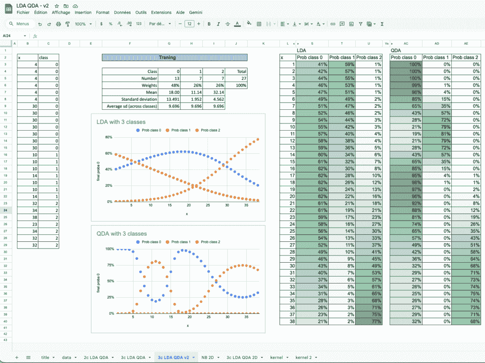

Excel 中的 GNB、LDA 和 QDA – 图像由作者提供

## 最近质心：这个模型真正是什么

让我们快速回顾一下昨天[已经开始的内容](https://towardsdatascience.com/the-machine-learning-advent-calendar-day-2-k-nn-classifier-in-excel/)。

我们介绍了一个简单的想法：当我们计算一个类中每个连续特征的均值时，这个类就塌缩成一个单一的代表性点。

这就给出了最近质心模型。

每个类都由其质心，即所有特征值的平均值来概括。

现在，让我们从机器学习的角度来思考这个问题。

我们通常将这个过程分为两个部分：*训练*步骤和*超参数调整*步骤。

对于最近质心，我们可以画一个小“模型卡片”来理解这个模型真正是什么：

+   *模型是如何训练的？* 通过为每个类别计算一个平均向量。仅此而已。

+   *它处理缺失值吗？* 是的。可以使用所有可用的（非空）值来计算质心。

+   *尺度重要吗？* 当然，因为质心到距离取决于每个特征的单位。

+   超参数是什么？没有。

我们说 k-NN 分类器可能不是一个真正的机器学习模型，因为它不是一个实际模型。

对于最近质心，我们可以说它实际上不是一个机器学习模型，因为它不能被调整。那么过拟合和欠拟合怎么办？

好吧，这个模型非常简单，它不能像 k-NN 那样记住噪声。

因此，最近邻质心只有在类别复杂或没有很好地分离时才会**欠拟合**，因为单个质心无法捕捉它们的完整结构。

## 使用一个特征理解类形状：添加方差

现在，在本节中，我们将只使用一个连续特征，并且有两个类别。

到目前为止，我们每个类别只使用了一个统计量：平均值。

现在，让我们添加第二块信息：**方差**（或等价地，标准差）。

这告诉我们每个类别围绕其平均值“分布”有多广。

一个自然的问题立即出现：我们应该使用哪个方差？

最直观的答案是计算**每个类别的方差**，因为每个类别的分布可能不同。

但还有一种可能性：我们可以计算**两个类别的共同方差**，通常作为类别方差的加权平均值。

起初这感觉有点不自然，但稍后我们将看到这个想法直接导致了 LDA。

因此，下表为我们提供了构建此模型所需的一切，实际上，对于模型的两个版本（LDA 和 QDA）都是如此。

+   每个类别的观测数（用于加权类别）

+   每个类别的均值

+   每个类别的标准差

+   以及两个类别之间的共同标准差

使用这些值，整个模型就完全定义了。

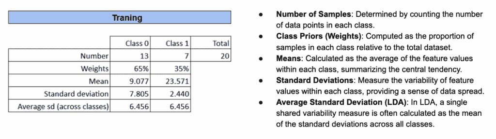

Excel 中的 GNB、LDA 和 QDA – 图像由作者提供

现在我们有了标准差，我们可以构建一个更精细的距离：质心到距离除以标准差。

我们为什么要这样做？

因为这给出了一个距离，它是根据类别的可变性进行**缩放**的。

如果一个类别的标准差很大，那么它离其质心很远并不令人惊讶。

如果一个类别的标准差非常小，即使是微小的偏差也会变得显著。

这种简单的归一化将我们的欧几里得距离转换成更有意义的东西，它代表了每个类别的形状。

这个距离是由马氏提出的，所以我们称之为马氏距离。

现在，我们可以在 Excel 文件中直接进行所有这些计算。

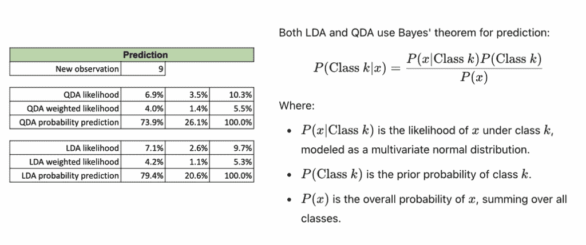

Excel 中的 GNB、LDA 和 QDA – 图像由作者提供

公式很简单，并且通过条件格式化，我们可以清楚地看到每个中心到距离的变化以及缩放如何影响结果。

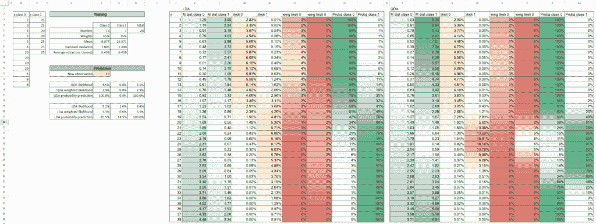

Excel 中的 GNB、LDA 和 QDA – 图像由作者提供

现在，让我们做一些图表，始终在 Excel 中进行。

下面的图表显示了完整的进展：我们从马氏距离开始，移动到每个类别分布下的似然，最后获得概率预测。

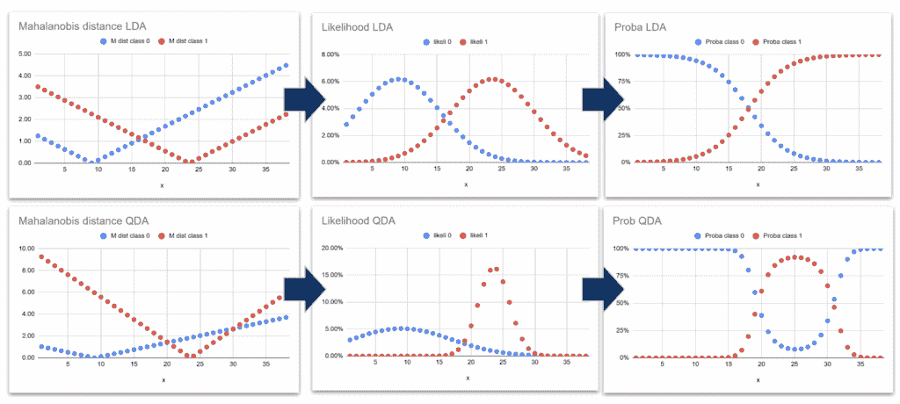

Excel 中的 GNB、LDA 和 QDA – 图像由作者提供

### LDA 与 QDA，我们看到了什么？

只有一个特征时，差异变得非常容易可视化。

对于 **LDA**，x 轴上的分离总是被切成两部分。这就是为什么这个方法被称为 *线性* 判别分析。

对于 **QDA**，即使只有一个特征，模型也会在 x 轴上产生 **两个** 切点。在更高维的情况下，这变成了一条曲线边界，由一个 **二次函数** 描述。因此，这个名字叫 *二次* 判别分析。

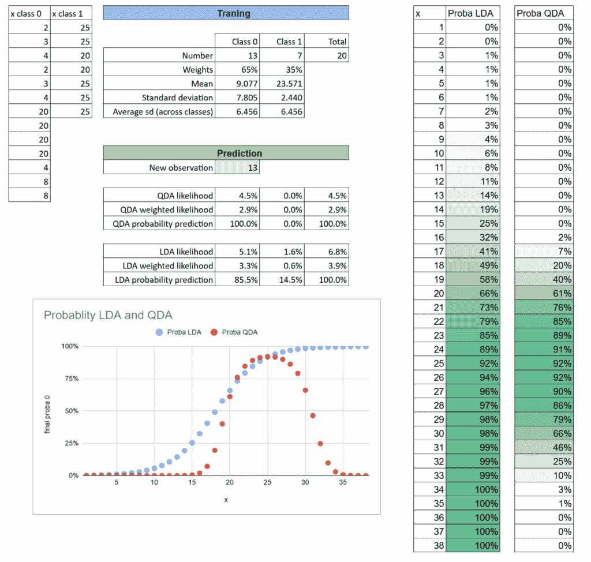

GNB, LDA 和 QDA 在 Excel 中的图像 - 作者提供

你可以直接修改参数，看看它们如何影响决策边界。

均值或方差的改变将改变前沿，Excel 使得这些效果非常容易可视化。

顺便问一下，LDA 概率曲线的形状让你想起了你肯定知道的某个模型吗？是的，它看起来完全一样。

你已经能猜到是哪一个，对吧？

但现在真正的问题是：它们 *真的* 是同一个模型吗？如果不是，它们有什么不同？

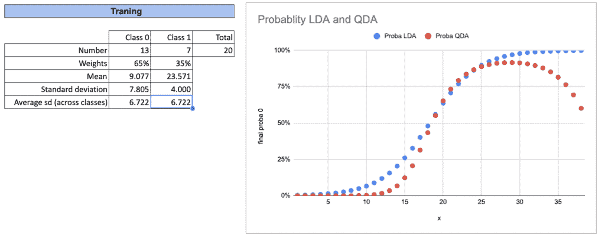

GNB, LDA 和 QDA 在 Excel 中的图像 - 作者提供

我们也可以研究三个类别的案例。你可以自己尝试在 Excel 中作为练习。

这里是结果。对于每个类别，我们重复完全相同的程序。而对于最终的概率预测，我们简单地求和所有似然值，并取每个似然值的比例。

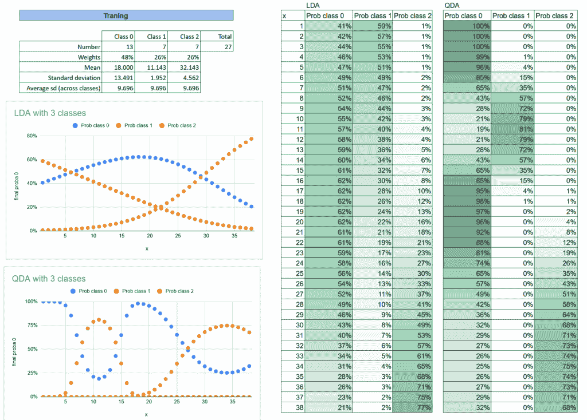

GNB, LDA 和 QDA 在 Excel 中的图像 - 作者提供

再次，这种方法也被用于另一个著名的模型。

你知道哪一个吗？这对大多数人来说更加熟悉，这也显示了这些模型之间实际上是如何紧密相连的。

当你理解其中一个时，你自然会更好地理解其他几个。

## 2D 中的类别形状：只有方差还是协方差？

对于一个特征，我们不说依赖性，因为没有。所以在这种情况下，QDA 的行为与高斯朴素贝叶斯完全一样。因为我们通常允许每个类别有自己的方差，这是完全自然的。

当我们转向两个或更多特征时，差异就会出现。那时，我们将区分模型如何处理特征之间的 **协方差** 的情况。

高斯朴素贝叶斯做出一个非常强的简化假设：

特征是独立的。这就是其名字中 *朴素* 一词的原因。

然而，LDA 和 QDA 并不做出这个假设。它们允许特征之间的交互，这就是在更高维中产生线性或二次边界的原因。

让我们在 Excel 中做这个练习！

### 高斯朴素贝叶斯：没有协方差

让我们从最简单的情况开始：高斯朴素贝叶斯。

因此，我们根本不需要计算任何协方差，因为模型假设特征是独立的。

为了说明这一点，我们可以看看一个有三个类别的简单例子。

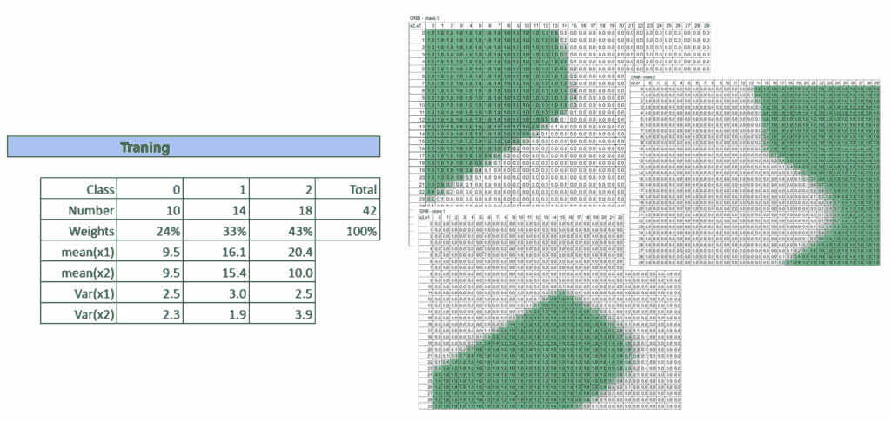

GNB, LDA 和 QDA 在 Excel 中的图像 - 作者提供

**QDA：每个类别都有自己的协方差**

对于 QDA，我们现在必须为每个类别计算协方差矩阵。

一旦我们有了它，我们还需要计算其逆，因为它直接用于距离和似然率的公式中。

因此，与高斯朴素贝叶斯相比，需要计算更多的参数。

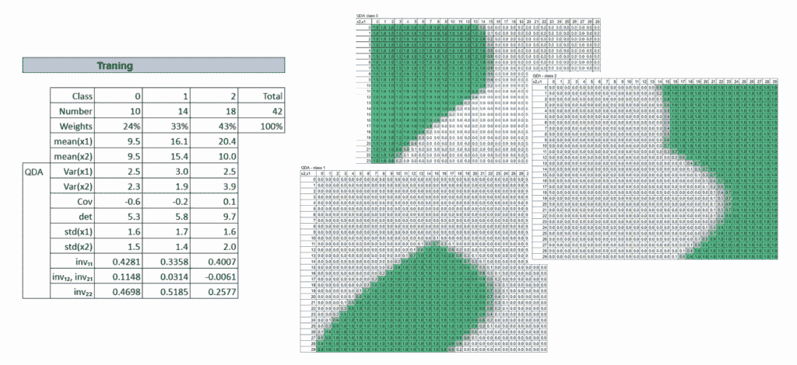

Excel 中的 GNB、LDA 和 QDA - 作者图片

### LDA：所有类共享相同的协方差

对于 LDA，所有类共享相同的协方差矩阵，这减少了参数的数量并迫使决策边界是线性的。

即使模型更简单，它在许多情况下仍然非常有效，尤其是在数据量有限的情况下。

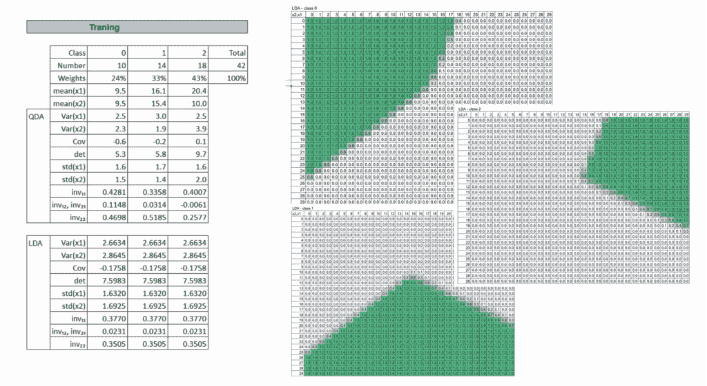

Excel 中的 GNB、LDA 和 QDA - 作者图片

## 定制类分布：超越高斯假设

到目前为止，我们只讨论了高斯分布。这是因为它简单。我们也可以使用其他分布。所以即使在 Excel 中，也很容易更改。

在现实中，数据通常不会遵循完美的高斯曲线。

在探索数据集时，我们几乎每次都使用经验密度图。它们立即给出了数据的分布的直观感觉。

并且作为非参数方法的**核密度估计器（KDE**）经常被使用。

但是，在实践中，KDE 很少被用作完整的分类模型。它不太方便，并且其预测通常对带宽的选择很敏感。

而有趣的是，当我们讨论其他模型时，这种核的概念将会再次出现。

因此，尽管我们在这里主要展示它是为了探索，但它仍然是机器学习中的一个基本构建块。

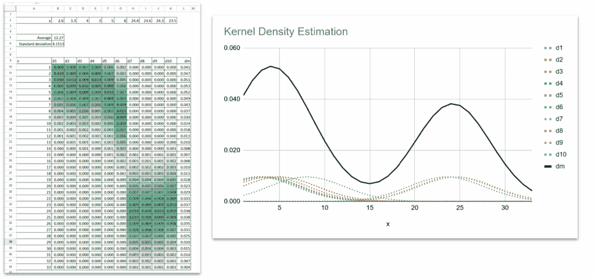

Excel 中的 KDE（核密度估计器）- 作者图片

## 结论

今天，我们遵循了一条自然的路径，从简单的平均值开始，逐渐过渡到完整的概率模型。

+   最近邻质心将每个类压缩成一个点。

+   高斯朴素贝叶斯引入了方差的观念，并假设特征是独立的。

+   QDA 为每个类赋予其自身的方差或协方差

+   LDA 通过共享协方差来简化形状。

我们甚至看到我们可以走出高斯世界并探索定制分布。

所有这些模型都通过同一个想法相连：**一个新观察属于最相似的类别。**

差别在于我们如何定义相似性，通过距离、方差、协方差，或者通过完整的概率分布。

对于所有这些模型，我们都可以在 Excel 中轻松完成两个步骤：

+   第一步是估计参数，这可以被认为是模型训练

+   计算每个类别的距离和概率的推理步骤

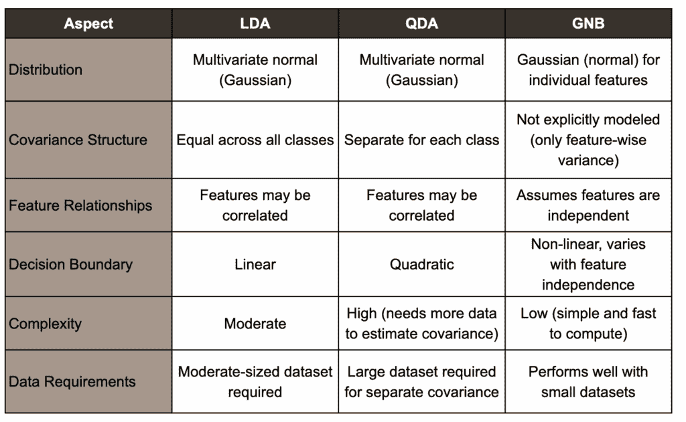

GNB、LDA 和 QDA - 作者图片

## 一件额外的事情

在结束这篇文章之前，让我们绘制一个基于距离的监督模型的简单地图。

我们有两个主要家族：

+   **局部距离模型**

+   **全局距离模型**

对于**局部距离**，我们已经知道两种经典的方法：

+   k-NN 回归器

+   k-NN 分类器

两者都通过观察邻居并使用数据的局部几何形状进行预测。

对于**全局距离**，我们今天所研究的所有模型都属于分类领域。

为什么？

因为全局距离需要**由类定义的中心**。

我们是如何衡量一个新观测值与每个类原型之间的接近程度？

但关于**回归**呢？

看起来，这种全局距离的概念对于回归来说并不存在，或者它真的不存在吗？

答案是肯定的，它确实存在……

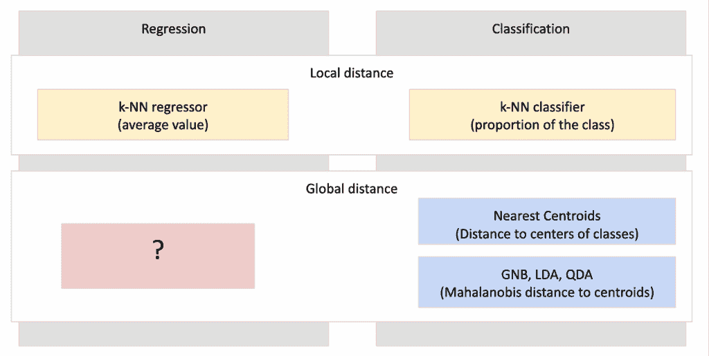

思维导图 – 基于距离的机器学习监督模型 – 图片由作者提供
