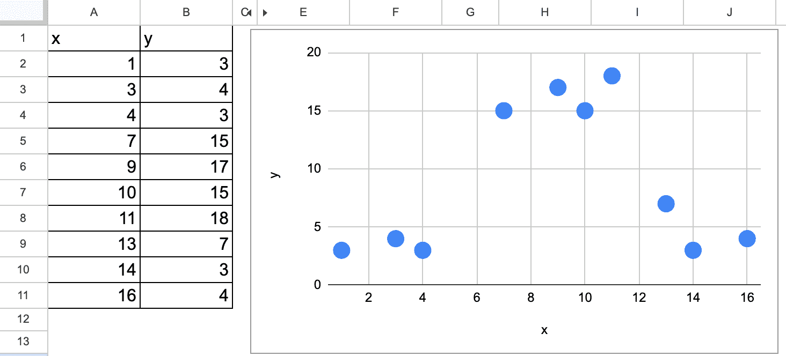
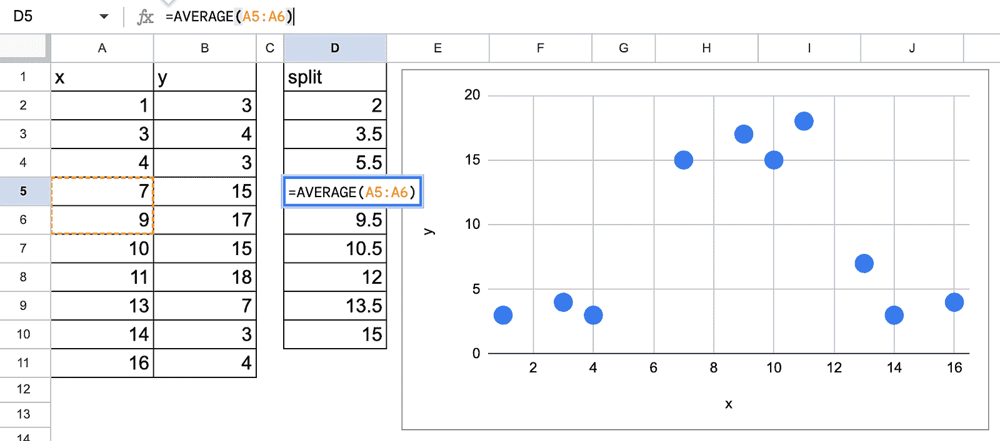
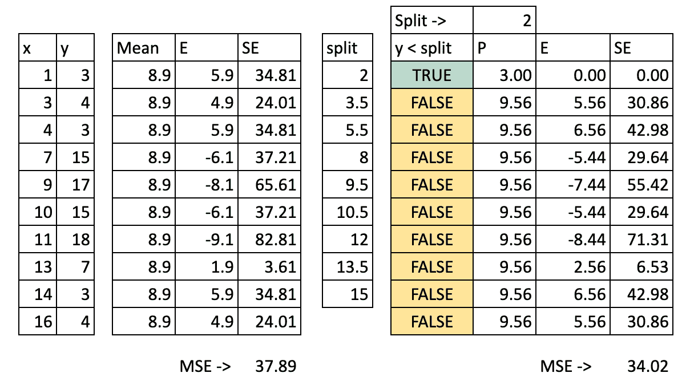
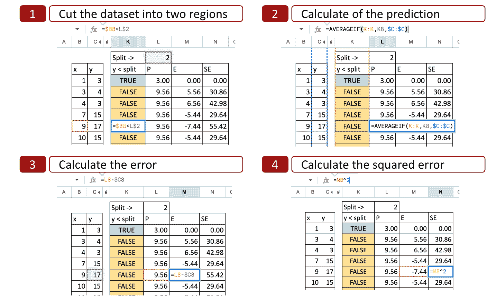
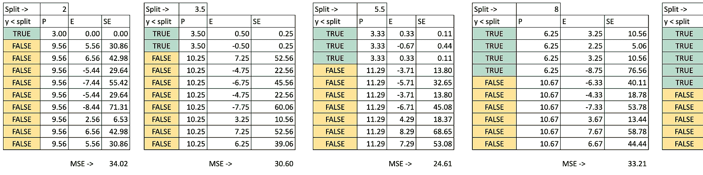
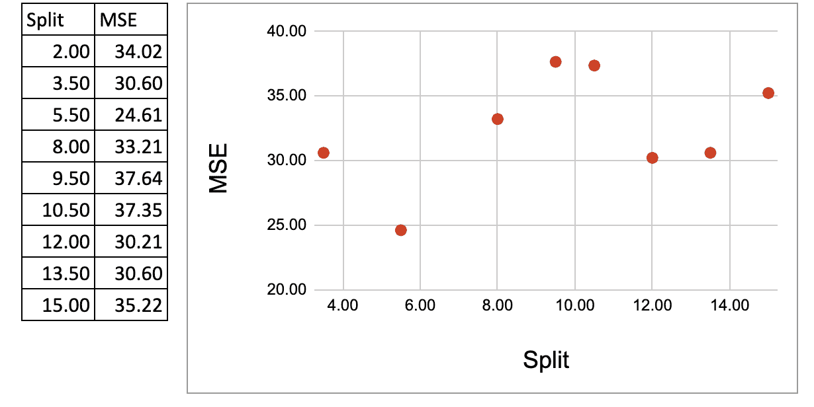
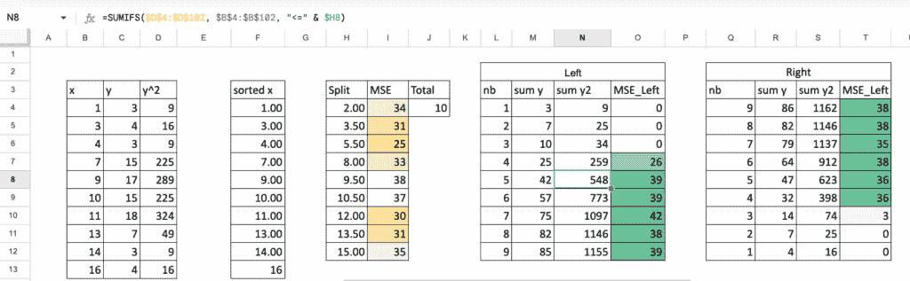
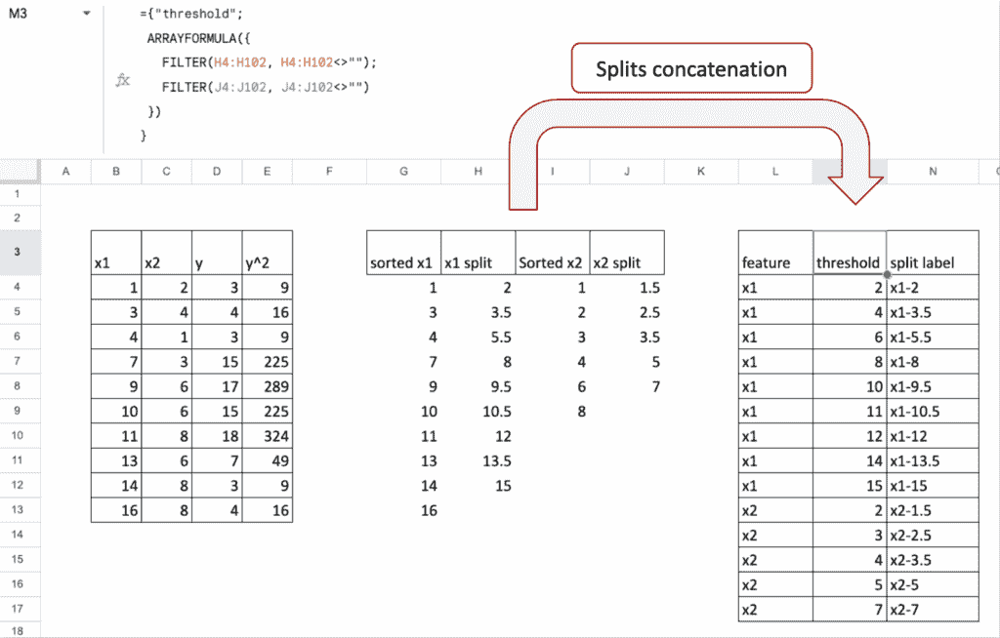
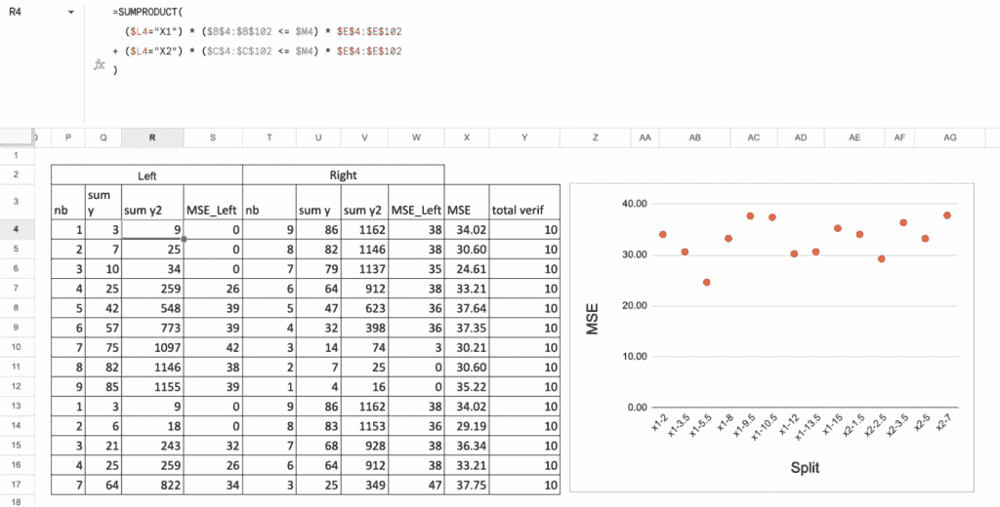
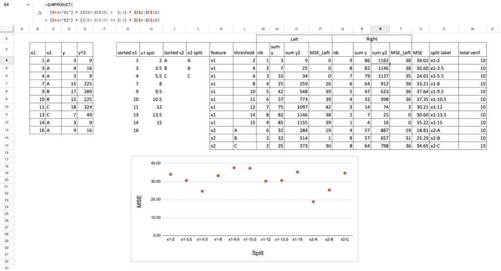

# 机器学习“圣诞日历”第 6 天：决策树回归器

> 原文：[`towardsdatascience.com/the-machine-learning-advent-calendar-day-6-decision-tree-regressor/`](https://towardsdatascience.com/the-machine-learning-advent-calendar-day-6-decision-tree-regressor/)

<mdspan datatext="el1764917748672" class="mdspan-comment">在这次[机器学习“圣诞日历”](https://towardsdatascience.com/machine-learning-and-deep-learning-in-excel-advent-calendar-announcement/)的前 5 天，我们探讨了 5 个基于距离（局部欧几里得距离或全局马氏距离）的模型（或算法）。

所以是时候改变方法了，对吧？我们稍后会回到距离的概念。

对于今天，我们将看到一些完全不同的事情：决策树！

Excel 中的决策树回归器——图片由作者提供

## 使用简单数据集的介绍

让我们使用一个只有一个连续特征的简单数据集。

和以往一样，想法是你自己可以可视化结果。然后你必须思考如何让计算机来完成它。

Excel 中简单数据集（我生成的）的决策树回归——图片由作者提供

我们可以直观地猜测，对于第一个分割，有两个可能的值，一个在 5.5 左右，另一个在 12 左右。

现在的问题是，我们选择哪一个？

这正是我们要找出的问题：我们如何通过 Excel 实现来确定第一个分割点的值？

一旦我们确定了第一个分割点的值，我们就可以为后续的分割应用相同的过程。

正因如此，我们将在 Excel 中只实现第一个分割。

## 决策树回归器的算法原理

我写了一篇[文章，总是区分机器学习的三个步骤，以有效地学习它](https://medium.com/towards-data-science/machine-learning-in-three-steps-how-to-efficiently-learn-it-aefcf423a9e1)，现在让我们将这个原理应用到决策树回归器上。

因此，第一次，我们有一个“真正”的机器学习模型，对于所有三个步骤都有非平凡的步骤。

### 什么是模型？

这里的模型是一组规则，用于划分数据集，并且对于每个分区，我们将分配一个值。哪个值？同一组中所有观测值的平均值 y。

所以，虽然 k-NN 通过最近邻的平均值进行预测（在特征变量方面的相似观测值），决策树回归器通过一组观测值的平均值进行预测（在特征变量方面的相似性）。

### 模型拟合或训练过程

对于决策树，我们也将这个过程称为完全生长一棵树。在决策树回归器的情况下，叶子将只包含一个观测值，因此 MSE 为零。

树的生长包括递归地将输入数据分割成越来越小的块或区域。对于每个区域，可以计算一个预测值。

在回归的情况下，预测是区域目标变量的平均值。

在构建过程的每一步，算法选择特征和分割值，以最大化一个标准，在回归器的情况下，通常是实际值和预测值之间的均方误差（MSE）。

### 模型调优或剪枝

对于决策树，模型调优的一般术语也称为剪枝，即使它可以被视为从完全成长的树中删除节点和叶子。

也可以说，当满足某个标准时，构建过程停止，例如最大深度或每个叶子节点中的最小样本数。这些都是可以通过调优过程优化的超参数。

### 推理过程

一旦构建了决策树回归器，就可以通过应用规则并从根节点遍历树到对应于输入特征值的叶子节点来预测新输入实例的目标变量。

对于输入实例的预测目标值是落在相同叶子节点中的训练样本的目标值的平均值。

## 基于一个连续特征的分割

这里是我们将遵循的步骤：

+   列出所有可能的分割

+   对于每个分割，我们将计算均方误差（MSE）

+   我们将选择最小化 MSE 的分割作为最佳下一个分割

### 所有可能的分割

首先，我们必须列出所有可能的分割，即两个连续值的平均值。没有必要测试更多的值。

在 Excel 中使用决策树回归进行可能的分割—图像由作者提供

### 每个可能的分割的 MSE 计算

作为起点，我们可以在任何分割之前计算 MSE。这也意味着预测值只是 y 的平均值。MSE 等同于 y 的标准差。

现在，我们的想法是找到一个分割，使得分割后的 MSE 低于之前。可能的情况是分割并没有显著提高性能（或降低 MSE），那么最终的树将是平凡的，即 y 的平均值。

对于每个可能的分割，我们可以计算均方误差（MSE）。下面的图像显示了第一个可能的分割的计算，即 x = 2。

在 Excel 中决策树回归的均方误差（MSE）对所有可能的分割—图像由作者提供

我们可以看到计算的细节：

1.  将数据集切割成两个区域：使用 x=2 的值，我们确定两种可能性 x<2 或 x>2，因此 x 轴被切割成两部分。

1.  计算预测值：对于每一部分，我们计算 y 的平均值。这就是 y 的潜在预测值。

1.  计算误差：然后我们将预测值与 y 的实际值进行比较

1.  计算平方误差：对于每个观测值，我们可以计算平方误差。

Excel 中的所有可能分割的决策树回归——图片由作者提供

### 最佳分割

对于每个可能的分割，我们进行相同的操作以获得 MSE。在 Excel 中，我们可以复制并粘贴公式，唯一变化的是 x 的可能分割值。

Excel 中的决策树回归分割——图片由作者提供

然后，我们可以在 y 轴上绘制均方误差（MSE），在 x 轴上绘制可能的分割，现在我们可以看到当 x=5.5 时，MSE 达到最小值，这正是使用 Python 代码得到的结果。

Excel 中的决策树回归最小化 MSE——图片由作者提供

现在，你可以做的一个小练习是将 MSE 改为平均绝对误差（MAE）。

你可以尝试回答这个问题：这种变化有什么影响？

### 将所有分割计算压缩到一个总结表中

在前面的章节中，我们逐步计算了每个分割，这样我们可以更好地可视化计算的细节。

现在我们将所有内容放在一个单独的表中，这样整个过程就变得紧凑且易于自动化。

要做到这一点，我们首先简化计算。

在一个节点中，预测是平均值，因此 MSE 正好是方差。对于方差，我们也可以使用简化的公式：

因此，在下面的表中，我们为每个可能的分割使用一行。

对于每个分割，我们计算左节点的 MSE 和右节点的 MSE。

可以使用 y 和 y 平方的中间结果简化每个组的方差。

然后我们计算两个 MSE 值的加权平均值。最后，我们得到与逐步方法完全相同的结果。

Excel 中的决策树回归器 – 从[这里](https://ko-fi.com/s/4ddca6dff1)获取 – 图片由作者提供

## 具有多个连续特征的分割

现在我们将使用**两个特征**。

这就是变得有趣的地方。

我们将得到来自**两个特征**的候选分割。

我们该如何选择？

我们将简单地考虑**所有**这些分割，然后选择具有**最小 MSE**的分割。

Excel 中的思路是：

+   首先，将两个特征的所有可能分割放入**一个单独的列**中，

+   然后，对于这些分割中的每一个，像以前一样计算 MSE，

+   最后，选择最好的一个。

### 分割连接

首先，我们列出**特征 1 的所有可能分割**（例如，两个排序值之间的所有阈值）。

然后，我们以相同的方式列出**特征 2 的所有可能分割**。

在 Excel 中，我们将这两个列表连接成一个**候选分割的列**。

因此，这个列中的每一行代表：

+   “如果我使用这个特征在这里切割，会发生什么？”

这为我们提供了一个统一的分割列表，包括**两个特征的所有分割**。

Excel 中的决策树回归器 – 从[这里](https://ko-fi.com/s/4ddca6dff1)获取 – 图像由作者提供

### MSE 计算

一旦我们有了所有分割的列表，其余的步骤与之前相同。

对于每一行（即，对于每一个分割）：

+   我们将点分为**左节点**和**右节点**，

+   我们计算左节点的**均方误差 (MSE)**，

+   我们计算右节点的**均方误差 (MSE)**，

+   我们取两个 MSE 值的**加权平均**。

最后，我们查看“总 MSE”这一列，并选择给出**最小**值的分割（因此是特征和阈值）。

Excel 中的决策树回归器 – 从[这里](https://ko-fi.com/s/4ddca6dff1)获取 – 图像由作者提供

## 带有一个连续特征和一个分类特征的分割

现在，让我们结合两种非常不同的特征类型：

+   一个**连续**特征

+   一个**分类**特征（例如，A，B，C）。

决策树可以在**两者**上分割，但我们生成候选分割的方式并不相同。

对于连续特征，我们测试**阈值**。

对于分类特征，我们测试**类别组**。

所以想法与之前完全相同：

我们考虑从两个特征的所有可能的分割，然后选择具有**最小 MSE**的一个。

### **分类特征分割**

对于分类特征，逻辑不同：

+   每个类别已经是一个“组”，

+   因此，最简单的分割是：**一个类别与所有其他类别**。

例如，如果类别是 A，B 和 C：

+   分割 1：A 与 (B, C)

+   分割 2：B 与 (A, C)

+   分割 3：C 与 (A, B)

这已经给出了有意义的候选分割，并使 Excel 公式易于管理。

这些基于类别的分割被添加到包含连续阈值的同一列表中。

### **MSE 计算**

一旦列出所有分割（连续阈值 + 分类分区），计算遵循相同的步骤：

+   将每个点分配到**左**或**右**节点，

+   计算左节点的**均方误差 (MSE)**，

+   我们计算右节点的**均方误差 (MSE)**，

+   计算加权平均。

总 MSE 最低的分割成为最佳第一个分割。

(https://ko-fi.com/s/4ddca6dff1)

Excel 中的决策树回归器 – 从[这里](https://ko-fi.com/s/4ddca6dff1)获取 – 图像由作者提供

### 你可以尝试以下练习

现在，你可以玩 Google Sheet：

+   你可以尝试找到下一个分割

+   你可以更改标准，而不是 MSE，你可以使用绝对误差、泊松或 friedman_mse，如[DecisionTreeRegressor](https://scikit-learn.org/stable/modules/generated/sklearn.tree.DecisionTreeRegressor.html)的文档中所示

+   你可以将目标变量改为二元变量，通常情况下，这变成了一个分类任务，但 0 或 1 也是数字，所以均方误差（MSE）的准则仍然可以应用。但如果你想创建一个合适的分类器，你必须应用通常的准则熵（Entropy）或基尼系数（Gini）。这将是下一篇文章的内容。

## 结论

使用 Excel，你可以实现一个分割来深入了解决策树回归器的工作原理。即使我们没有创建完整的树，这仍然很有趣，因为最重要的部分是找到所有可能分割中的最优分割。

### 关于缺失值还有一件事

你有没有注意到在基于距离的模型和决策树之间处理特征时的一些有趣之处？

对于基于距离的模型，一切都必须是数值。连续特征保持连续，分类特征必须转换为数字。模型比较空间中的点，所以所有东西都必须存在于数值轴上。

决策树做的是相反的操作：它们*切割*特征成组。连续特征变成区间。分类特征保持分类状态。

而缺失值呢？它简单地变成了另一个类别。没有必要先进行插补。树可以自然地通过将所有“缺失”值发送到一条分支来处理它，就像处理任何其他组一样。

<mdspan datatext="el1765309524890" class="mdspan-comment">所有 Excel 文件都可以通过这个[Kofi 链接](https://ko-fi.com/s/4ddca6dff1)获取。我的支持对你意义重大。价格将在本月内上涨，所以早期支持者将获得最佳价值。</mdspan>

所有用于机器学习（ML）和深度学习（DL）的 Excel/Google 表格文件
