# 机器学习“圣诞日历”第 8 天：Excel 中的隔离森林

> 原文：[`towardsdatascience.com/the-machine-learning-advent-calendar-day-8-isolation-forest-in-excel/`](https://towardsdatascience.com/the-machine-learning-advent-calendar-day-8-isolation-forest-in-excel/)

<mdspan datatext="el1765218258404" class="mdspan-comment">在周末与决策树一起度过</mdspan>，无论是用于[回归](https://towardsdatascience.com/the-machine-learning-advent-calendar-day-6-decision-tree-regressor/)还是[分类](https://towardsdatascience.com/the-machine-learning-advent-calendar-day-7-decision-tree-classifier/)，我们今天将继续使用决策树的原则。

而这次，我们处于无监督学习状态，因此没有标签。

该算法被称为隔离森林，其理念是构建许多决策树形成一个森林。其原理是通过隔离来检测异常。

为了让一切更容易理解，让我们用一个我亲自创建的非常简单的示例数据集来说明：

1, 2, 3, 9

（并且因为 TDS 的主编提醒我关于提及数据来源的法律细节，让我正确地声明这一点：*这个数据集完全由我自己版权所有*。这是一个四点数据集，是我手工制作的，我很高兴授予每个人用于教育目的的使用权。）

这里的目标很简单：找到异常，入侵者。

我知道你已经知道它是哪一个了。

和往常一样，想法是将这变成一个可以自动检测它的算法。

## 经典机器学习框架中的异常检测

在继续之前，让我们退一步，看看异常检测在更大图景中的位置。

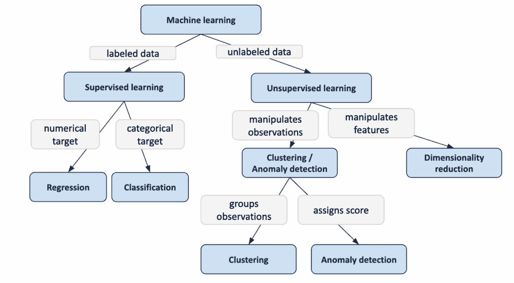

经典机器学习框架 – 作者图片

在左侧，我们有**监督学习**，有标签数据，主要有两种类型：

+   **回归**当目标为数值时

+   **分类**当目标为分类时

这是我们迄今为止使用决策树的地方。

在右侧，我们有**无监督学习**，没有标签。

我们不预测任何东西。我们只是**操纵观测值**（聚类和异常检测）或**操纵特征**（降维和其他方法）。

降维操纵特征。尽管它位于“无监督”类别中，但其目标与其他方法大不相同。因为它重塑了特征本身，所以几乎感觉像是特征工程。

对于观测级方法，我们有两种可能性：

+   **聚类**：分组观测值

+   **异常检测**：为每个观测值**分配一个分数**

在实践中，一些模型可以同时完成这两项任务。例如，k-means 可以检测异常。

隔离森林仅用于异常检测，而不是聚类。

因此，今天，我们正好在这里：

**无监督学习 → 聚类/异常检测 → 异常检测**

## 痛苦的部分：在 Excel 中构建树

现在我们开始在 Excel 中实施，我必须坦白：这部分真的很痛苦…

这很痛苦，因为我们需要构建许多小的规则，公式不易拖拽。这是 Excel 在模型基于**决策**时的一个局限性。当公式对每一行都相同的时候，Excel 很棒。但在这里，树中的每个节点遵循不同的规则，因此公式不易推广。

对于决策树，我们看到了使用单次分割公式就有效。但我故意停在那里。为什么？因为 Excel 中添加更多分割变得复杂。决策树的结构并不自然地“拖拽友好”。

然而，对于孤立森林，我们别无选择。

我们需要构建一个**完整树**，一直到底，以查看每个点是如何被孤立的。

如果你，亲爱的读者，有简化这个方法的想法，请与我联系。

## 三步孤立森林

尽管公式不易，但我尽力构建了这个方法。这里就是整个方法，只需三步。

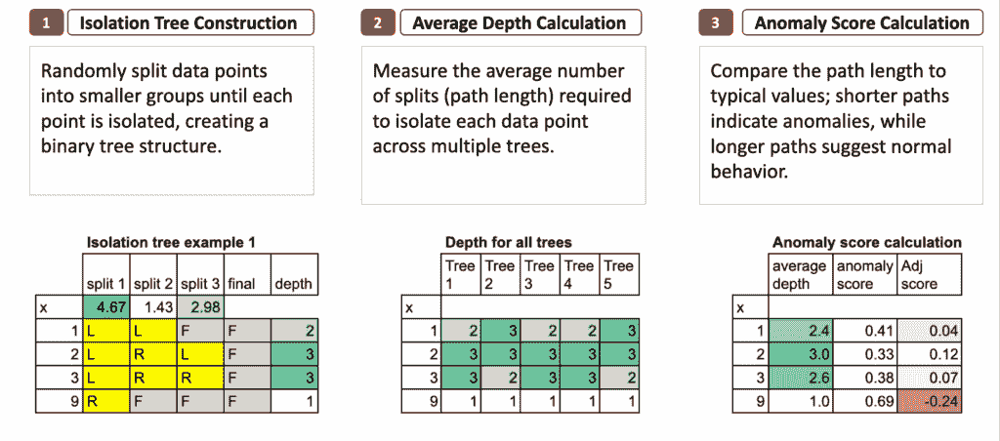

Excel 中的孤立森林 – 作者图片

### 1. 构建孤立树

我们首先创建一个孤立树。

在每个节点，我们在当前组的最大值和最小值之间选择一个随机的分割值。

这个分割将观测值分为“左”（L）和“右”（R）。

当一个观测值被孤立时，我将其标记为**F**，表示“最终”，意味着它已经到达了叶子节点。

通过重复这个过程，我们获得了一个完整的二叉树，其中异常值往往在更少的步骤中被孤立。对于每个观测值，我们可以计算它的**深度**，这仅仅是孤立它所需的分割次数。

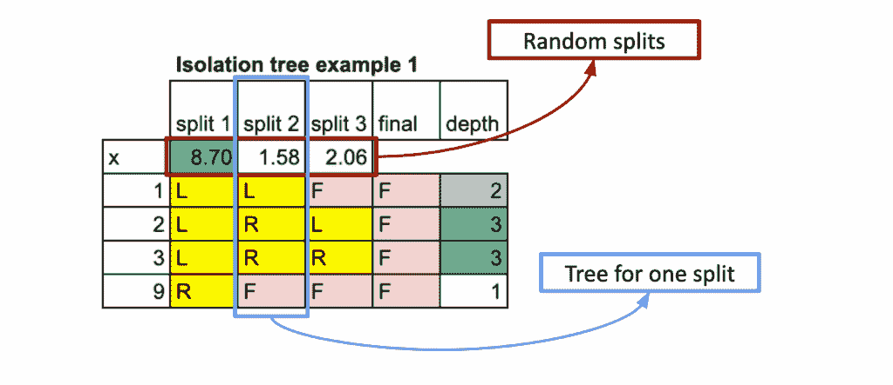

Excel 中的孤立森林 – 作者图片

### 2. 平均深度计算

一棵树是不够的。因此，我们重复相同的随机过程多次来构建多棵树。

对于每个数据点，我们计算在每棵树中需要多少次分割才能将其孤立。

然后我们计算所有树的平均深度（或平均路径长度）。

这给出了一个稳定且有意义的度量，衡量孤立每个点有多容易。

到这一点，平均深度已经给我们一个可靠的指标：

**深度越低，点越可能是异常。**

短深度意味着该点很快就被孤立，这是异常的一个特征。

长深度意味着该点表现得像其他数据一样，因为它们保持在一起，不容易分离。

在我们的例子中，得分完全合理。

+   首先，9 是异常值，平均深度为 1。对于所有 5 棵树，一次分割就足以将其孤立。（尽管，这并不总是如此，你可以自己测试。）

+   对于其他三个观测值，深度相似，并且明显更大。最高分归因于 2，它位于组中间，这正是我们所期望的。

如果有一天你必须向别人解释这个算法，请随意使用这个数据集：易于记忆且直观易懂。并且，请务必提及我对它的版权！

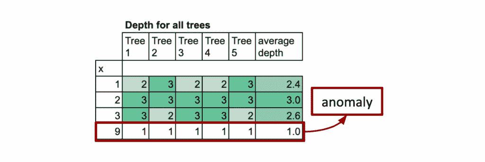

Excel 中的隔离森林 – 作者图片

### 3. 异常分数计算

最后一步是将平均深度归一化，以给出一个介于 0 到 1 之间的标准异常分数。

说一个观测值的平均深度为*n*本身并没有什么意义。

这个值取决于数据点的总数，因此我们无法直接将其解释为“正常”或“异常”。

理念是将每个点的平均路径长度与在纯随机性下预期的**典型值**进行比较。这告诉我们深度实际上有多令人惊讶（或不）。

我们稍后会看到转换，但目标很简单：

**将原始深度转换为没有上下文意义的相对分数**。

短深度自然会变成接近 1 的分数（异常），

以及长深度将成为接近 0 的分数（正常观测值）。

最后，一些实现调整分数，使其具有不同的含义：**正值表示正常点**，**负值表示异常**。这仅仅是原始异常分数的转换。

基础逻辑完全没有改变：短路径仍然对应于异常，长路径对应于正常观测值。

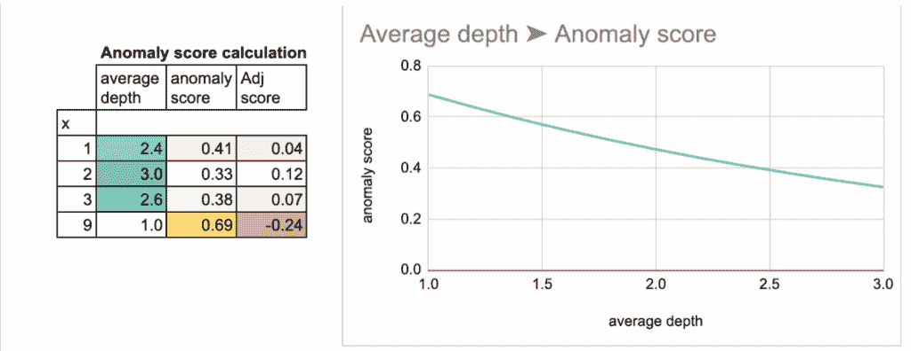

Excel 中的隔离森林 – 作者图片

## 隔离树构建

所以这是痛苦的部分。

### 快速概述

我创建了一个表格来捕捉树构建过程中的不同步骤。

它不是规则的，也不是完美结构的，但我尽力让它可读。

我也不确定所有公式都能很好地推广。

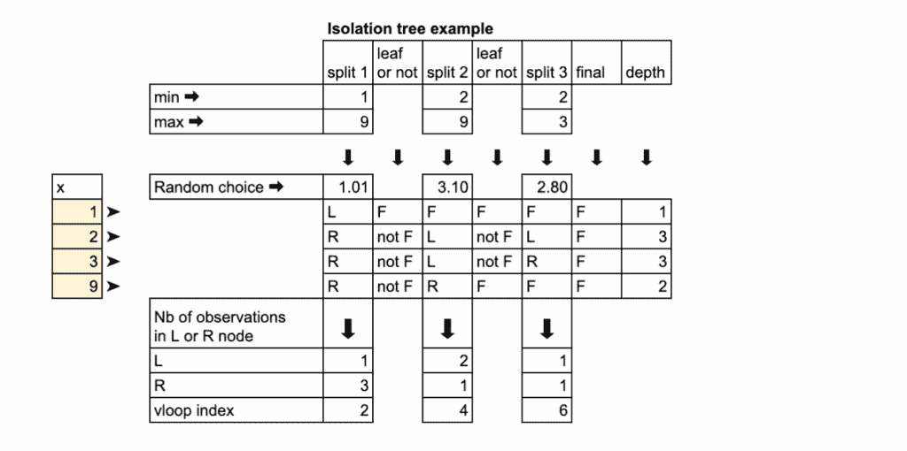

Excel 中的隔离森林 – 作者图片

1.  **获取当前组的最大值和最小值**。

1.  **在最小值和最大值之间生成一个随机的分割值**。

1.  **将观测值分割**成左（L）和右（R）。

1.  **计算有多少观测值**落在 L 和 R 中。

1.  如果一个组只包含**一个观测值**，将其标记为**F**（最终）并停止该分支。

1.  **对每个非最终组重复此过程**，直到所有观测值都被隔离。

这就是构建一个隔离树的全部逻辑。

### 详细解释

我们从所有观测值一起开始。

第一步是查看这个组的**最小值和最大值**。这两个值定义了我们可以在其中随机切割的区间。

接下来，我们在最小值和最大值之间**生成一个随机的分割值**。与决策树不同，这里没有优化，没有标准，没有纯度度量。分割是纯随机的。

我们可以使用 Excel 中的 RAND 函数，如以下截图所示。

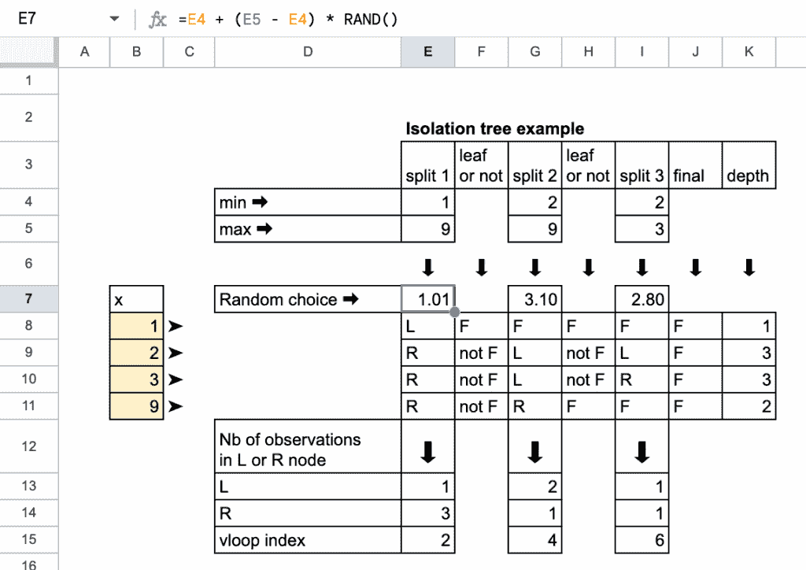

Excel 中的隔离森林 – 作者图片

一旦我们有了随机的分割，我们就**分割数据**成两组：

+   **左（L）：**小于或等于分割的观察值

+   **右（R）：**大于分割的观察值

这只是通过比较分割与观察值的 IF 公式来完成的。

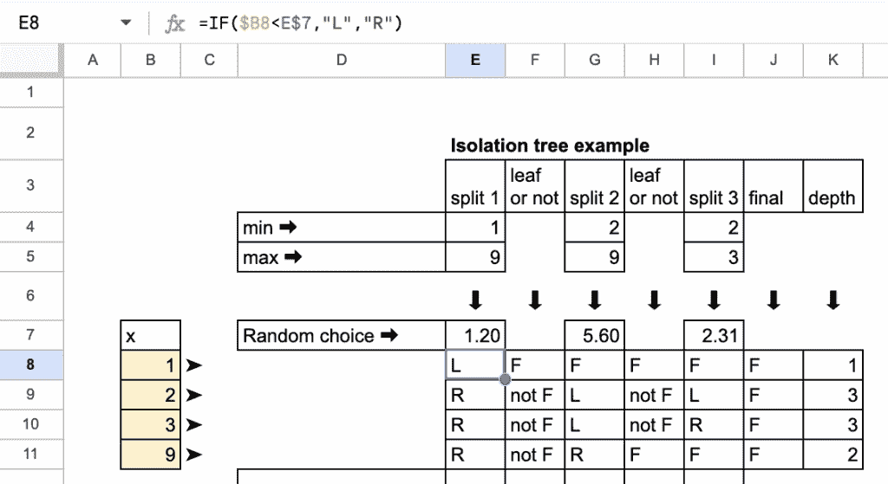

Excel 中的隔离森林 – 作者图片

分割之后，我们**计数**有多少观察值到了每一侧。

如果这些组中的一个只包含**一个观察值**，那么这个点现在已经被隔离。

我们将其标记为**F**，表示“最终”，意味着它位于一个叶子中，并且不需要对该分支进行进一步的分割。

VLOOKUP 是为了从计数表中获取其一边为 1 的观察值。

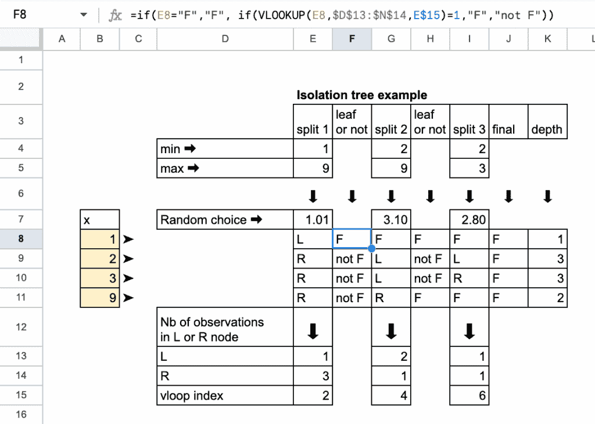

Excel 中的隔离森林 – 作者图片

对于所有仍然包含多个观察值的其他组，我们重复完全相同的过程。

我们只停止当**每个观察值都是隔离的**，这意味着每个观察值都出现在它自己的最终叶子中。出现的完整结构是一个**二叉树**，隔离每个观察值所需的分割次数是其**深度**。

在这里，我们知道 3 次分割就足够了。

最后，你得到一个完全生长的隔离树的最终表格。

## 异常分数计算

关于平均深度的部分只是重复相同的过程，你可以复制粘贴。

现在，我将更详细地介绍异常分数的计算方法。

### 归一化因子

为了计算异常分数，隔离森林首先需要一个称为**c(n)**的**归一化因子**。

这个值代表了一个随机点在具有**n**个观察值的随机二叉搜索树中的**期望深度**。

我们为什么需要它？

因为我们想要比较点的**实际**深度与在随机性下的**典型**深度。

一个比预期**快得多**被隔离的点很可能是异常点。

**c(n)**的公式使用调和数。

一个调和数 H(k)大约是：

其中γ = 0.5772156649 是欧拉-马斯刻罗尼常数。

使用这个近似，归一化因子变为：

然后我们可以在 Excel 中计算这个数字。

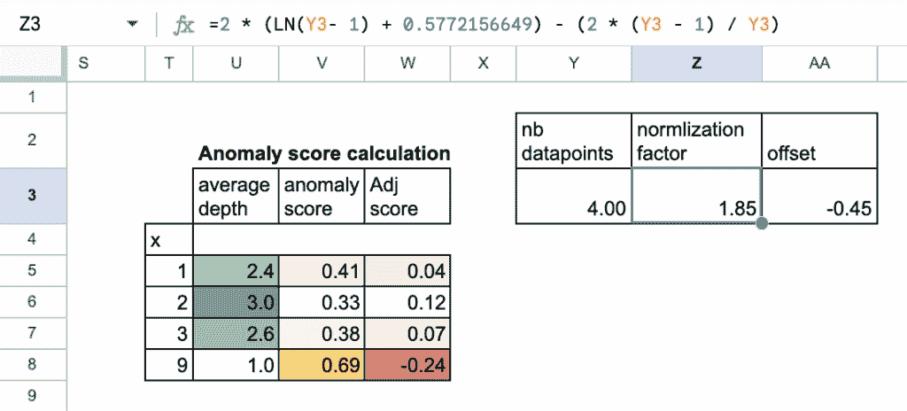

Excel 中的隔离森林 – 作者图片

一旦我们有了**c(n)**，异常分数就是：

其中**h(x)**是隔离所有树中点的平均深度。

如果分数接近**0**，则该点是正常的

如果分数接近**1**，则该点是异常点

因此，我们可以将深度转换为分数。

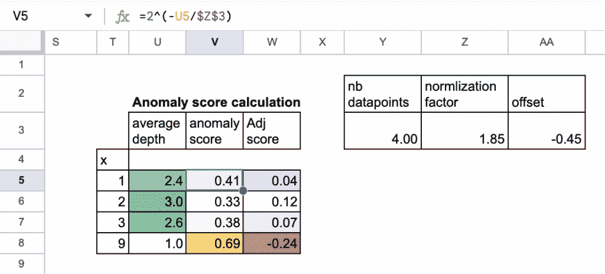

Excel 中的隔离森林 – 作者图片

最后，对于调整后的分数，我们可以使用一个偏移量，即异常分数的平均值，并进行转换。

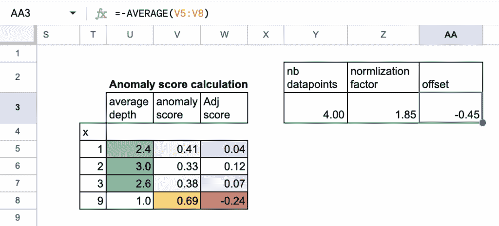

Excel 中的隔离森林 – 作者图片

## 实际算法中的附加元素

实际上，隔离森林包括一些额外的步骤，使其更加稳健。

**1. 选择数据的一个子样本**

该算法不是为每一棵树使用完整的数据集，而是选择一个小型的随机子集。

这样可以减少计算量，并在树之间增加多样性。

它还有助于防止模型被非常大的数据集所淹没。

因此，像“随机隔离森林”这样的名字似乎更合适，对吧？

**2. 首先选择一个随机特征**

在构建每个分割时，隔离森林并不总是使用相同的特征。

它首先随机选择一个特征，然后在那个特征中选择一个随机的分割值。

这使得树更加多样化，并有助于模型在具有许多变量的数据集上良好工作。

这些简单的添加使得隔离森林在现实世界的应用中出奇地强大。

这正是“随机隔离森林”会做的事情，这个名字绝对更好！

## 隔离森林的优势

与许多基于距离的模型相比，隔离森林有几个重要的优势：

+   **适用于分类特征**

    基于距离的方法在处理类别时遇到困难，但隔离森林可以更自然地处理它们。

+   **轻松处理许多特征**

    高维数据不是问题。

    该算法不依赖于在高维空间中失效的距离度量。

+   **没有关于分布的假设**

    不需要正态性，不需要密度估计，也不需要计算距离。

+   **很好地扩展到高维**

    当特征数量增加时，其性能不会崩溃。

+   **非常快**

    分割是微不足道的：选择一个特征，选择一个随机值，然后切割。

    没有优化步骤，没有梯度，没有纯度计算。

隔离森林还有一种非常新颖的思维方式：

> 而不是问**“正常点应该是什么样子？”**，
> 
> 隔离森林询问，**“我能多快隔离这个点？”**

这种视角的小小改变解决了经典异常检测的许多困难。

## 结论

隔离森林是一个从外表看起来很复杂的算法，但一旦分解，其逻辑实际上非常简单。

Excel 实现确实痛苦，是的。但理念本身并不如此。

一旦你理解了这个理念，其他所有事情都变得容易得多：树是如何工作的，为什么深度很重要，分数是如何计算的，以及为什么该算法在实践中表现得如此出色。

隔离森林不试图模拟“正常”行为。相反，它提出了一个完全不同的问题：**我能多快隔离这个观察结果？**

这种视角的小小改变解决了基于距离或密度模型难以应对的许多问题。
