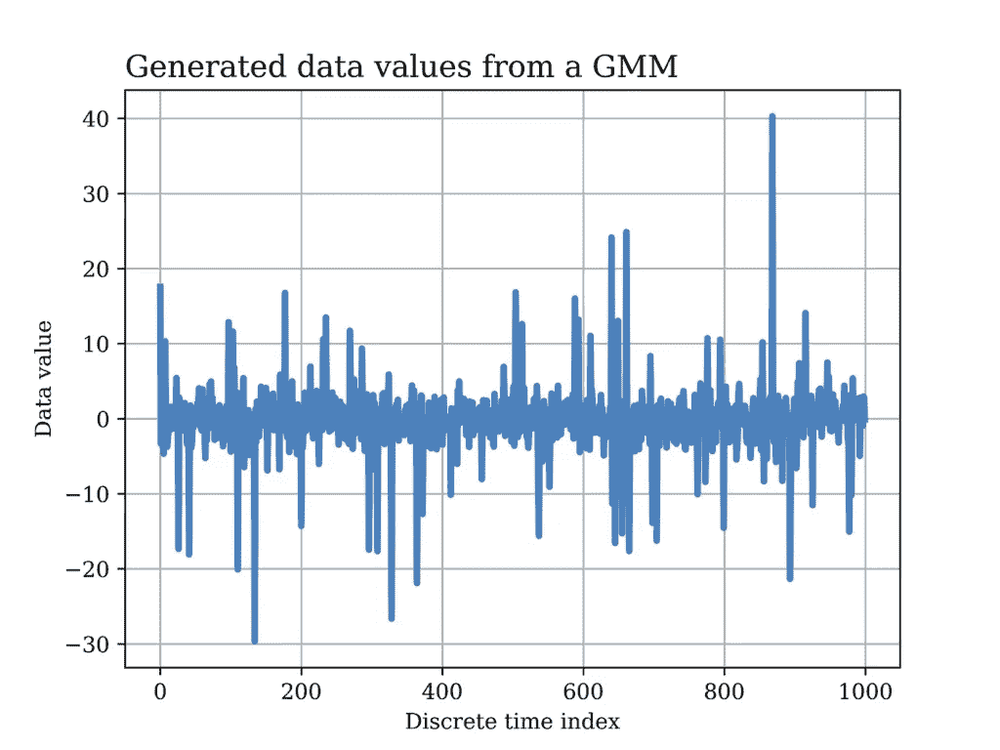
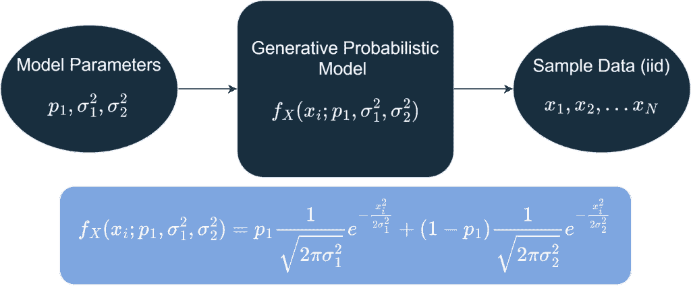
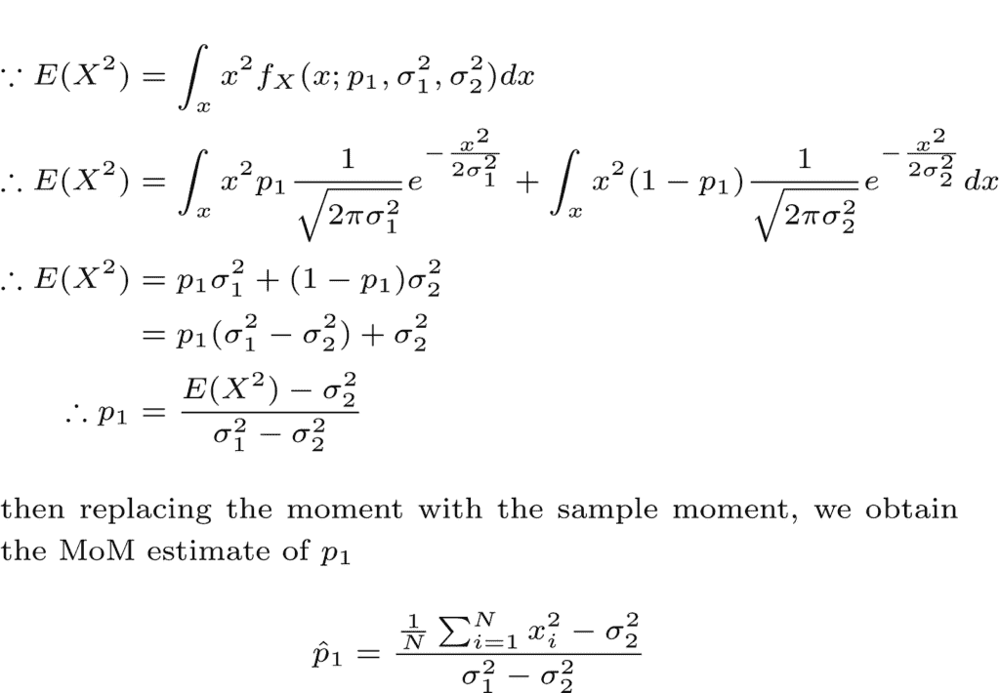
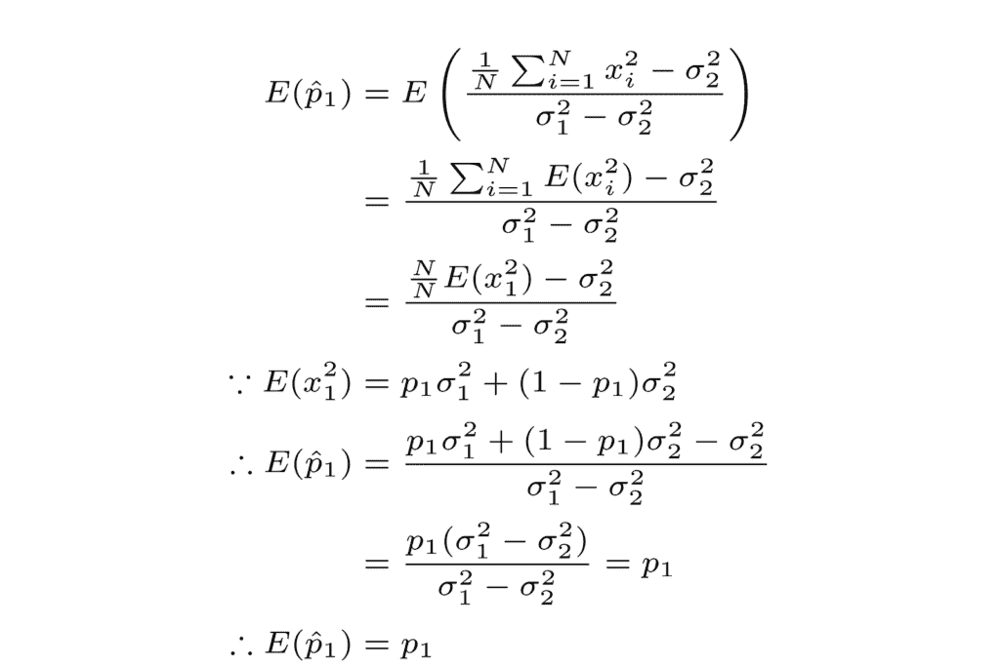
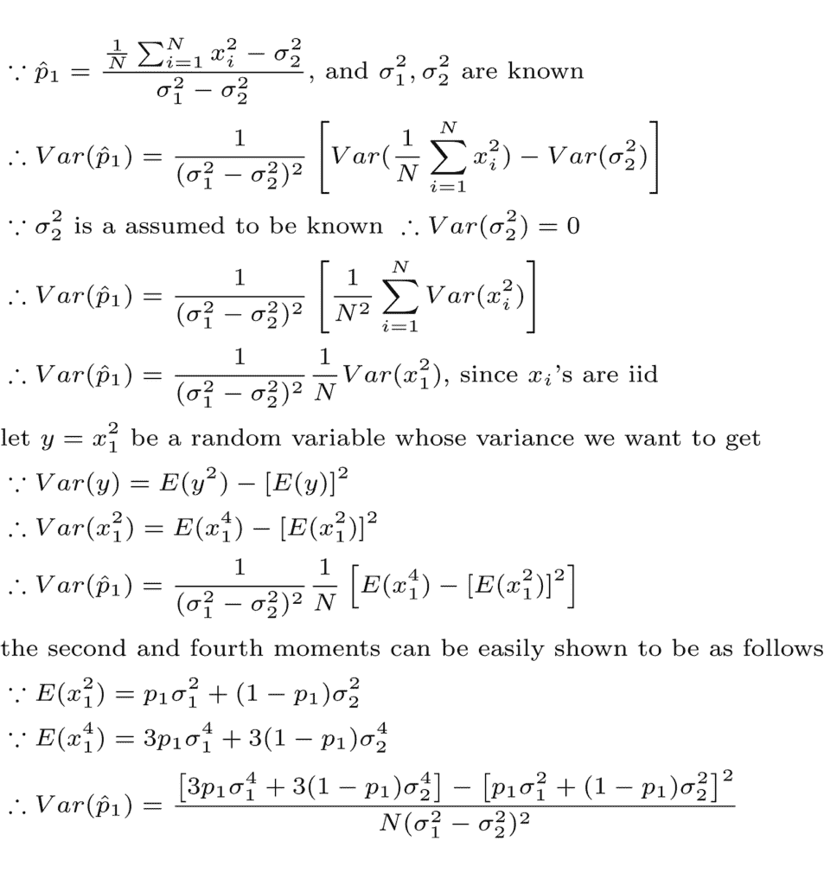
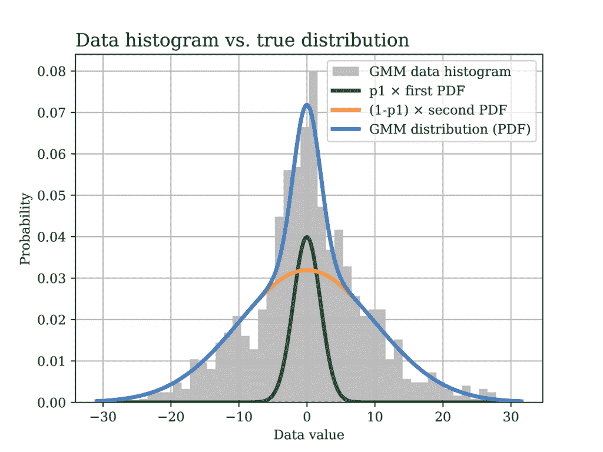

# 高斯混合模型矩估计法

> 原文：[`towardsdatascience.com/the-method-of-moments-estimator-for-gaussian-mixture-models/`](https://towardsdatascience.com/the-method-of-moments-estimator-for-gaussian-mixture-models/)

音频处理是数字信号处理（DSP）和机器学习最重要的应用领域之一。建模声学环境是开发数字音频处理系统（如语音识别、语音增强、声学回声消除等）的必要步骤。

声学环境中充满了可能具有多个来源的背景噪声。例如，当坐在咖啡馆里，走在街上，或者开车时，你会听到可以被认为是干扰或背景噪声的声音。这种干扰不一定遵循相同的统计模型，因此，在建模它们时，使用模型混合可能是有用的。

这些统计模型在将声学环境分类到不同类别时也非常有用，例如，一个安静的礼堂（类别 1），或者窗户关闭的稍微嘈杂的房间（类别 2），以及窗户打开的第三种情况。在每种情况下，背景噪声的水平都可以使用不同概率和不同声学水平的噪声源混合来建模。

这种模型的另一个应用是基于不同环境的声学噪声模拟，基于此，可以设计 DSP 和机器学习解决方案来解决实际音频系统中的特定声学问题，如干扰消除、回声消除、语音识别、语音增强等。


图片由 [Matoo.Studio](https://unsplash.com/@matoovisato) 在 [Unsplash](https://unsplash.com) 提供

在此类场景中，一个有用的简单统计模型是**高斯混合模型**（GMM），其中假设每个不同的噪声源都遵循特定的高斯分布，具有特定的方差。所有分布都可以假设具有零均值，同时对于此应用来说足够准确，正如这篇[文章](https://www.mdpi.com/1424-8220/19/12/2827#:~:text=The%20GMM%20is%20an%20alternative,i.e.%2C%20in%20the%20target%20scenario.)所示。

每个高斯混合分布都有其自身对背景噪声的贡献概率。例如，可能存在一种持续存在的背景噪声，它大多数时间都会出现，而其他来源的噪声可能是间歇性的，例如通过窗户传入的噪声等。所有这些都需要在我们的统计模型中考虑。

下面图表展示了模拟的 GMM 数据随时间的变化（归一化到采样时间），其中有两个高斯噪声源，它们的均值都是零，但方差不同。在这个例子中，低方差信号以 90%的概率出现，因此在生成数据中表现为间歇性的尖峰，代表具有更高方差的信号。



在其他场景和根据应用的不同，情况可能正好相反，即高方差噪声信号出现的频率更高（将在本文后面的示例中展示）。本文后面还将展示用于生成和分析高斯混合模型（GMM）数据的 Python 代码。

转到更正式的建模语言，假设收集到的背景噪声信号（例如，使用高质量的麦克风）被建模为独立同分布（iid）随机变量的实现，这些随机变量遵循以下所示的高斯混合模型（GMM）。



因此，建模问题简化为使用观测数据（独立同分布）估计模型参数（即，p1、σ²1 和σ²2）。在本文中，我们将使用[矩估计法](https://towardsdatascience.com/method-of-moments-estimation-with-python-code-f19102ce5897)（MoM）估计量来完成这一目的。

为了进一步简化问题，我们可以假设噪声方差（σ²1 和σ²2）是已知的，并且只有混合参数（p1）需要估计。MoM 估计量可以用来估计多个参数（即，p1、σ²1 和σ²2），如书中第九章所述：“*统计信号处理：估计理论*”，作者 Steven Kay。然而，在这个例子中，我们将假设只有 p1 是未知的，需要估计。

由于 GMM 中的两个高斯分布都是零均值，我们将从二阶矩开始，并尝试将未知参数 p1 作为二阶矩的函数来获得如下。



注意，另一种获取随机变量（例如，二阶矩或更高阶矩）矩的方法是使用矩生成函数（MGF）。一本涵盖此类主题以及更多内容的优秀概率论教科书是：Stanley H. Chan 所著的“*数据科学概率导论*”。

在继续之前，我们希望用估计量的基本属性（如偏差、方差、一致性等）来量化这个估计量。我们将在后面的 Python 示例中通过数值验证这一点。

从估计量的偏差开始，我们可以证明上述 p1 的估计量确实是无偏的如下。



我们可以继续推导出我们估计量的方差如下。



从上述分析中也可以清楚地看出，估计量是一致的，因为它是无偏的，并且当样本量（N）增加时，其方差也会减小。我们还将使用上述 p1 估计量方差的公式在我们的 Python 数值示例中（本文后面将详细展示）比较理论与实际数值结果。

现在让我们介绍一些 Python 代码，做一些有趣的事情！

首先，我们生成遵循具有零均值和标准差分别为 2 和 10 的 GMM 的数据，如下所示。在这个例子中，混合参数 p1 = 0.2，数据的样本量为 1000。

```py
# Import the Python libraries that we will need in this GMM example
import matplotlib.pyplot as plt
import numpy as np
from scipy import stats

# GMM data generation
mu = 0 # both gaussians in GMM are zero mean
sigma_1 = 2 # std dev of the first gaussian
sigma_2 = 10 # std dev of the second gaussian
norm_params = np.array([[mu, sigma_1],
                        [mu, sigma_2]])
sample_size = 1000
p1 = 0.2 # probability that the data point comes from first gaussian
mixing_prob = [p1, (1-p1)]
# A stream of indices from which to choose the component
GMM_idx = np.random.choice(len(mixing_prob), size=sample_size, replace=True, 
                p=mixing_prob)
# GMM_data is the GMM sample data
GMM_data = np.fromiter((stats.norm.rvs(*(norm_params[i])) for i in GMM_idx),
                   dtype=np.float64)
```

然后，我们绘制生成数据的直方图与概率密度函数的对比图，如下所示。该图显示了整体 GMM 中高斯密度的贡献，每个密度都按其对应因子缩放。



以下 Python 代码展示了生成上述图的代码。

```py
x1 = np.linspace(GMM_data.min(), GMM_data.max(), sample_size)
y1 = np.zeros_like(x1)

# GMM probability distribution
for (l, s), w in zip(norm_params, mixing_prob):
    y1 += stats.norm.pdf(x1, loc=l, scale=s) * w

# Plot the GMM probability distribution versus the data histogram
fig1, ax = plt.subplots()
ax.hist(GMM_data, bins=50, density=True, label="GMM data histogram", 
        color = GRAY9)
ax.plot(x1, p1*stats.norm(loc=mu, scale=sigma_1).pdf(x1),
        label="p1 × first PDF",color = GREEN1,linewidth=3.0)
ax.plot(x1, (1-p1)*stats.norm(loc=mu, scale=sigma_2).pdf(x1),
        label="(1-p1) × second PDF",color = ORANGE1,linewidth=3.0)
ax.plot(x1, y1, label="GMM distribution (PDF)",color = BLUE2,linewidth=3.0)

ax.set_title("Data histogram vs. true distribution", fontsize=14, loc='left')
ax.set_xlabel('Data value')
ax.set_ylabel('Probability')
ax.legend()
ax.grid()
```

之后，我们计算了之前使用 MoM 推导出的混合参数 p1 的估计值，此处再次展示以供参考。


以下 Python 代码展示了使用我们的 GMM 样本数据计算上述方程的过程。

```py
# Estimate the mixing parameter p1 from the sample data using MoM estimator
p1_hat = (sum(pow(x,2) for x in GMM_data) / len(GMM_data) - pow(sigma_2,2))
         /(pow(sigma_1,2) - pow(sigma_2,2))
```

为了正确评估这个估计量，我们通过生成多个 GMM 数据的实现来使用**蒙特卡洛**模拟，并如以下 Python 代码所示，为每个实现估计 p1。

```py
# Monte Carlo simulation of the MoM estimator
num_monte_carlo_iterations = 500
p1_est = np.zeros((num_monte_carlo_iterations,1))

sample_size = 1000
p1 = 0.2 # probability that the data point comes from first gaussian
mixing_prob = [p1, (1-p1)]
# A stream of indices from which to choose the component
GMM_idx = np.random.choice(len(mixing_prob), size=sample_size, replace=True, 
          p=mixing_prob)
for iteration in range(num_monte_carlo_iterations):
  sample_data = np.fromiter((stats.norm.rvs(*(norm_params[i])) for i in GMM_idx))
  p1_est[iteration] = (sum(pow(x,2) for x in sample_data)/len(sample_data) 
                       - pow(sigma_2,2))/(pow(sigma_1,2) - pow(sigma_2,2))
```

然后，我们检查我们估计量的偏差和方差，并与我们之前推导的理论结果进行比较，如下所示。

```py
p1_est_mean = np.mean(p1_est)
p1_est_var = np.sum((p1_est-p1_est_mean)**2)/num_monte_carlo_iterations
p1_theoritical_var_num = 3*p1*pow(sigma_1,4) + 3*(1-p1)*pow(sigma_2,4) 
                         - pow(p1*pow(sigma_1,2) + (1-p1)*pow(sigma_2,2),2)
p1_theoritical_var_den = sample_size*pow(sigma_1**2-sigma_2**2,2)
p1_theoritical_var = p1_theoritical_var_num/p1_theoritical_var_den
print('Sample variance of MoM estimator of p1 = %.6f' % p1_est_var)
print('Theoretical variance of MoM estimator of p1 = %.6f' % p1_theoritical_var)
print('Mean of MoM estimator of p1 = %.6f' % p1_est_mean)

# Below are the results of the above code
Sample variance of MoM estimator of p1 = 0.001876
Theoretical variance of MoM estimator of p1 = 0.001897
Mean of MoM estimator of p1 = 0.205141
```

从上述结果中，我们可以观察到 p1 估计值的均值为 0.2051，这非常接近真实的参数 p1 = 0.2。随着样本量的增加，这个均值会更接近真实参数。因此，我们通过数值证明了估计量是无偏的，这与之前的理论结果相符。

此外，p1 估计量的样本方差（0.001876）几乎与理论方差（0.001897）相同，这是很美的。

当理论与实际相符时，总是一个令人愉快的时刻！

*本文中所有图片，除非另有说明，均为作者所有。*
