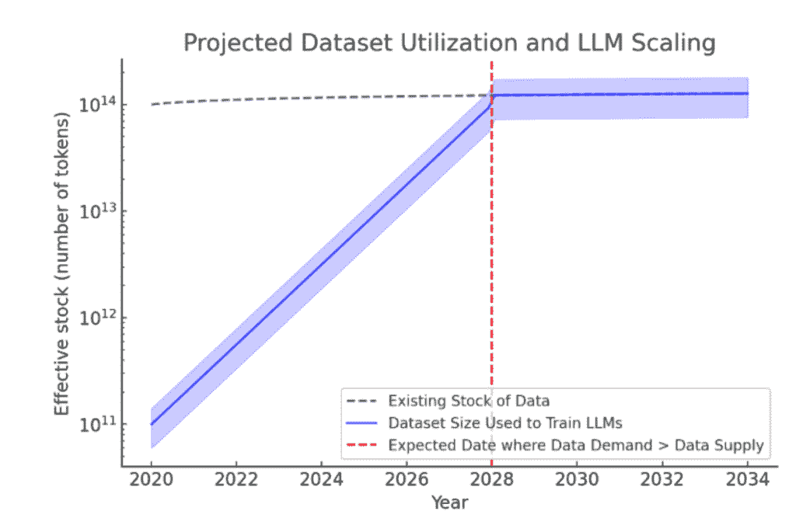
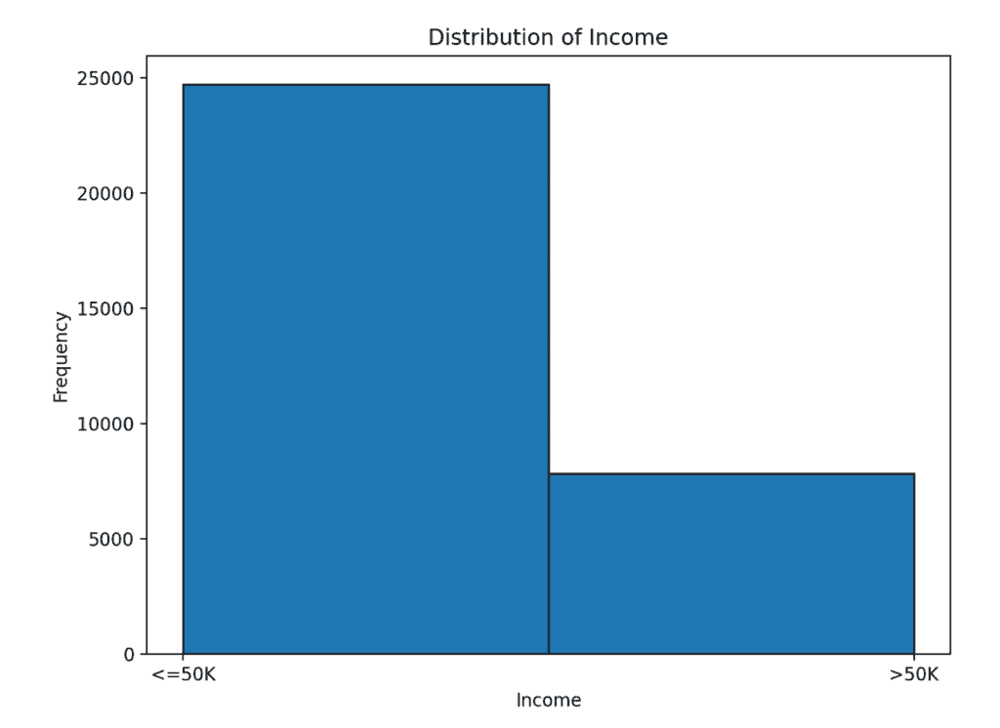
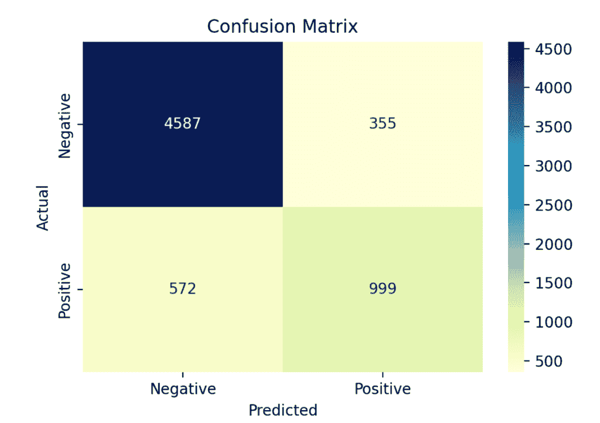
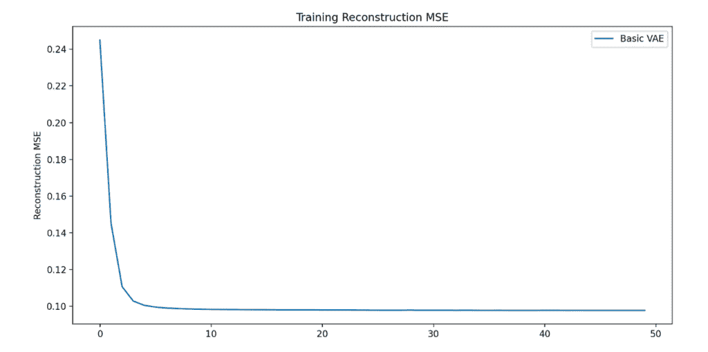
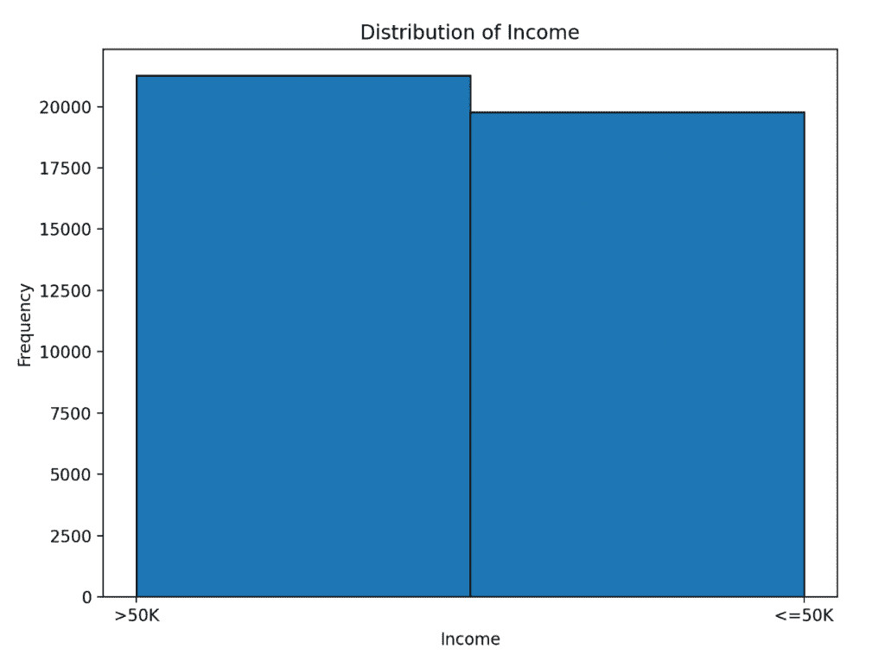
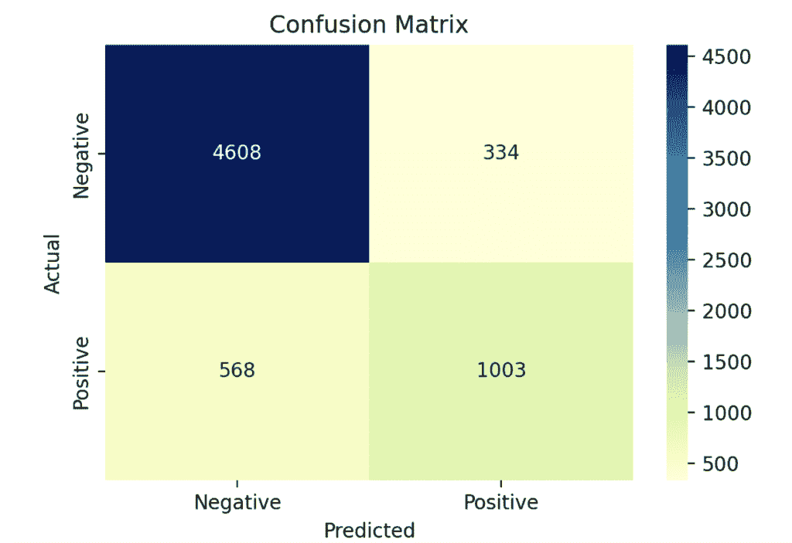

# 下一场人工智能革命：使用 VAEs 生成高质量合成数据的教程

> 原文：[`towardsdatascience.com/the-next-ai-revolution-a-tutorial-using-vaes-to-generate-high-quality-synthetic-data/`](https://towardsdatascience.com/the-next-ai-revolution-a-tutorial-using-vaes-to-generate-high-quality-synthetic-data/)

## **什么是合成数据？**

由计算机创建的数据，旨在复制或增强现有数据。

## **为什么它有用？**

我们都经历过 ChatGPT、Llama 以及最近 DeepSeek 的成功。这些语言模型正被广泛应用于社会，并引发了众多关于我们正在迅速接近通用人工智能的声明——能够复制任何人类功能的 AI。

在过于兴奋或害怕之前（取决于你的观点）——我们也在迅速接近这些语言模型进步的障碍。根据一家研究机构发布的一篇论文，Epoch [[1]](#[1])，*我们正在耗尽数据*。他们估计到 2028 年，我们将达到训练语言模型的可能数据的上限。



图片由作者提供。基于估计的数据集预测的图表。这是受 Epoch 研究小组[1]启发的重建可视化。

## **如果我们耗尽数据会发生什么？**

好吧，如果我们耗尽数据，那么我们就不会有什么新东西来训练我们的语言模型。然后这些模型将停止改进。如果我们想追求通用人工智能，那么我们就必须想出新的方法来改进 AI，而不仅仅是增加真实世界训练数据量。

一个潜在的救星是合成数据，它可以生成来模拟现有数据，并且已经被用来提高 Gemini 和 DBRX 等模型的表现。

## **超越 LLMs 的合成数据**

除了克服大型语言模型的数据稀缺问题外，合成数据还可以用于以下情况：

+   **敏感数据**——如果我们不想分享或使用敏感属性，可以生成模拟这些特征属性的同时保持匿名性的合成数据。

+   **昂贵的数据**——如果收集数据很昂贵，我们可以从少量真实世界数据生成大量合成数据。

+   **数据不足**——当某个特定群体中的个体数据点数量不成比例地低时，数据集会存在偏差。合成数据可以用来平衡数据集。

## **不平衡的数据集**

不平衡的数据集可能（但并非总是）存在问题，因为它们可能不包含足够的信息来有效地训练预测模型。例如，如果一个数据集中男性比女性多得多，我们的模型可能会偏向于识别男性，并将未来的女性样本错误地分类为男性。

在本文中，我们展示了流行的 UCI [Adult 数据集](https://archive.ics.uci.edu/dataset/2/adult) [[2],](#[2]) 中的不平衡情况，以及我们如何使用 **变分自编码器** 生成合成数据以改善此示例的分类。

我们首先下载 Adult 数据集。这个数据集包含年龄、教育程度和职业等特征，可用于预测目标结果“收入”。

```py
# Download dataset into a dataframe
url = "https://archive.ics.uci.edu/ml/machine-learning-databases/adult/adult.data"
columns = [
   "age", "workclass", "fnlwgt", "education", "education-num", "marital-status",
   "occupation", "relationship", "race", "sex", "capital-gain",
   "capital-loss", "hours-per-week", "native-country", "income"
]
data = pd.read_csv(url, header=None, names=columns, na_values=" ?", skipinitialspace=True)

# Drop rows with missing values
data = data.dropna()

# Split into features and target
X = data.drop(columns=["income"])
y = data['income'].map({'>50K': 1, '<=50K': 0}).values

# Plot distribution of income
plt.figure(figsize=(8, 6))
plt.hist(data['income'], bins=2, edgecolor='black')
plt.title('Distribution of Income')
plt.xlabel('Income')
plt.ylabel('Frequency')
plt.show()
```

在 Adult 数据集中，收入是一个二元变量，表示收入高于和低于 $50,000$ 的人。我们下面绘制了整个数据集中收入的分布。我们可以看到，数据集严重不平衡，收入低于 $50,000$ 的人数量远多于收入高于 $50,000$ 的人。



图片由作者提供。原始数据集：标签数量在 ≤50k 和 >50k 的数据实例数量。数据集中低于 50k 收入的个人比例明显偏高。

尽管存在这种不平衡，我们仍然可以在 Adult 数据集上训练一个机器学习分类器，我们可以用它来确定未见过的或测试的个人应该被分类为收入高于还是低于 50k。

```py
# Preprocessing: One-hot encode categorical features, scale numerical features
numerical_features = ["age", "fnlwgt", "education-num", "capital-gain", "capital-loss", "hours-per-week"]
categorical_features = [
   "workclass", "education", "marital-status", "occupation", "relationship",
   "race", "sex", "native-country"
]

preprocessor = ColumnTransformer(
   transformers=[
       ("num", StandardScaler(), numerical_features),
       ("cat", OneHotEncoder(), categorical_features)
   ]
)

X_processed = preprocessor.fit_transform(X)

# Convert to numpy array for PyTorch compatibility
X_processed = X_processed.toarray().astype(np.float32)
y_processed = y.astype(np.float32)
# Split dataset in train and test sets
X_model_train, X_model_test, y_model_train, y_model_test = train_test_split(X_processed, y_processed, test_size=0.2, random_state=42)

rf_classifier = RandomForestClassifier(n_estimators=100, random_state=42)
rf_classifier.fit(X_model_train, y_model_train)

# Make predictions
y_pred = rf_classifier.predict(X_model_test)

# Display confusion matrix
plt.figure(figsize=(6, 4))
sns.heatmap(cm, annot=True, fmt="d", cmap="YlGnBu", xticklabels=["Negative", "Positive"], yticklabels=["Negative", "Positive"])
plt.xlabel("Predicted")
plt.ylabel("Actual")
plt.title("Confusion Matrix")
plt.show()
```

打印出我们分类器的混淆矩阵显示，尽管存在不平衡，我们的模型表现相当好。我们的模型的整体错误率为 16%，但正类（收入 > 50k）的错误率为 36%，而负类（收入 < 50k）的错误率为 8%。

这种差异表明模型确实偏向于负类。模型经常错误地将收入超过 50k 的人分类为收入低于 50k。

下面我们展示如何使用变分自编码器生成正类的合成数据以平衡这个数据集。然后我们使用合成的平衡数据集训练相同的模型，并在测试集上减少模型错误。



图片由作者提供。原始数据集上预测模型的混淆矩阵。

## **我们如何生成合成数据？**

存在许多不同的生成合成数据的方法。这些方法可以包括更传统的如 SMOTE 和高斯噪声，通过修改现有数据来生成新数据。或者，生成模型如变分自编码器或通用对抗网络，由于它们的架构学习真实数据的分布，并使用这些分布来生成合成样本。

**在本教程中，我们使用变分自编码器生成合成数据。**

## **变分自编码器**

变分自编码器（VAEs）非常适合合成数据生成，因为它们使用真实数据来学习一个连续的潜在空间。我们可以将这个潜在空间视为一个神奇的桶，从中我们可以采样合成数据，这些数据与现有数据非常相似。这个空间的连续性是它们的一个大卖点，因为它意味着模型具有良好的泛化能力，而不仅仅是记住特定输入的潜在空间。

VAE 由一个 **编码器** 组成，它将输入数据映射到一个概率分布（均值和方差），以及一个 **解码器**，它从潜在空间重建数据。

对于这个连续的潜在空间，VAEs 使用一个重新参数化技巧**，其中随机噪声向量通过学习的均值和方差进行缩放和偏移，确保在潜在空间中的平滑和连续表示。

下面我们构建一个 **BasicVAE** 类，该类使用简单的架构实现此过程。

+   **编码器**将输入压缩成一个更小、隐藏的表示，产生一个均值和一个对数方差，这些定义了一个高斯分布，即创建我们的神奇采样桶。模型不是直接采样，而是应用重新参数化技巧来生成潜在变量，然后将这些变量传递给解码器。

+   **解码器**从这些潜在变量中重建原始数据，确保生成的数据保持原始数据集的特征。

```py
class BasicVAE(nn.Module):
   def __init__(self, input_dim, latent_dim):
       super(BasicVAE, self).__init__()
       # Encoder: Single small layer
       self.encoder = nn.Sequential(
           nn.Linear(input_dim, 8),
           nn.ReLU()
       )
       self.fc_mu = nn.Linear(8, latent_dim)
       self.fc_logvar = nn.Linear(8, latent_dim)

       # Decoder: Single small layer
       self.decoder = nn.Sequential(
           nn.Linear(latent_dim, 8),
           nn.ReLU(),
           nn.Linear(8, input_dim),
           nn.Sigmoid()  # Outputs values in range [0, 1]
       )

   def encode(self, x):
       h = self.encoder(x)
       mu = self.fc_mu(h)
       logvar = self.fc_logvar(h)
       return mu, logvar

   def reparameterize(self, mu, logvar):
       std = torch.exp(0.5 * logvar)
       eps = torch.randn_like(std)
       return mu + eps * std

   def decode(self, z):
       return self.decoder(z)

   def forward(self, x):
       mu, logvar = self.encode(x)
       z = self.reparameterize(mu, logvar)
       return self.decode(z), mu, logvar
```

给定我们的 BasicVAE 架构，我们构建了下面的损失函数和模型训练。

```py
def vae_loss(recon_x, x, mu, logvar, tau=0.5, c=1.0):
   recon_loss = nn.MSELoss()(recon_x, x)

   # KL Divergence Loss
   kld_loss = -0.5 * torch.sum(1 + logvar - mu.pow(2) - logvar.exp())
   return recon_loss + kld_loss / x.size(0)

def train_vae(model, data_loader, epochs, learning_rate):
   optimizer = optim.Adam(model.parameters(), lr=learning_rate)
   model.train()
   losses = []
   reconstruction_mse = []

   for epoch in range(epochs):
       total_loss = 0
       total_mse = 0
       for batch in data_loader:
           batch_data = batch[0]
           optimizer.zero_grad()
           reconstructed, mu, logvar = model(batch_data)
           loss = vae_loss(reconstructed, batch_data, mu, logvar)
           loss.backward()
           optimizer.step()
           total_loss += loss.item()

           # Compute batch-wise MSE for comparison
           mse = nn.MSELoss()(reconstructed, batch_data).item()
           total_mse += mse

       losses.append(total_loss / len(data_loader))
       reconstruction_mse.append(total_mse / len(data_loader))
       print(f"Epoch {epoch+1}/{epochs}, Loss: {total_loss:.4f}, MSE: {total_mse:.4f}")
   return losses, reconstruction_mse

combined_data = np.concatenate([X_model_train.copy(), y_model_train.cop
y().reshape(26048,1)], axis=1)

# Train-test split
X_train, X_test = train_test_split(combined_data, test_size=0.2, random_state=42)

batch_size = 128

# Create DataLoaders
train_loader = DataLoader(TensorDataset(torch.tensor(X_train)), batch_size=batch_size, shuffle=True)
test_loader = DataLoader(TensorDataset(torch.tensor(X_test)), batch_size=batch_size, shuffle=False)

basic_vae = BasicVAE(input_dim=X_train.shape[1], latent_dim=8)

basic_losses, basic_mse = train_vae(
   basic_vae, train_loader, epochs=50, learning_rate=0.001,
)

# Visualize results
plt.figure(figsize=(12, 6))
plt.plot(basic_mse, label="Basic VAE")
plt.ylabel("Reconstruction MSE")
plt.title("Training Reconstruction MSE")
plt.legend()
plt.show()
```

**vae_loss** 由两个部分组成：**重建损失**，它通过均方误差（MSE）衡量生成的数据与原始输入匹配的程度，以及 **KL 散度损失**，确保学习的潜在空间遵循正态分布。

**train_vae** 使用 Adam 优化器在多个时期优化 VAE。在训练过程中，模型取数据的小批量，重建它们，并使用 **vae_loss** 计算损失。然后通过反向传播纠正这些错误，更新模型权重。我们训练模型 50 个时期，并绘制重建均方误差随训练降低的图表。

我们可以看到，我们的模型快速学会了如何重建我们的数据，这证明了高效的学习。



图片由作者提供。BasicVAE 在 Adult 数据集上的重建均方误差。

现在我们已经训练了 BasicVAE，能够准确重建 Adult 数据集，我们可以现在用它来生成合成数据。我们想要生成更多正类（收入超过 50k 的人）的样本，以便平衡类别并消除模型中的偏差。

为了做到这一点，我们从我们的 VAE 数据集中选择所有收入为正类（收入超过 50k）的样本。然后我们将这些样本编码到潜在空间中。由于我们只选择了正类的样本进行编码，这个潜在空间将反映正类的特性，我们可以从中采样以创建合成数据。

我们从这个潜在空间中采样 15000 个新样本，并将这些潜在向量解码回输入数据空间，作为我们的合成数据点。

```py
# Create column names
col_number = sample_df.shape[1]
col_names = [str(i) for i in range(col_number)]
sample_df.columns = col_names

# Define the feature value to filter
feature_value = 1.0  # Specify the feature value - here we set the income to 1

# Set all income values to 1 : Over 50k
selected_samples = sample_df[sample_df[col_names[-1]] == feature_value]
selected_samples = selected_samples.values
selected_samples_tensor = torch.tensor(selected_samples, dtype=torch.float32)

basic_vae.eval()  # Set model to evaluation mode
with torch.no_grad():
   mu, logvar = basic_vae.encode(selected_samples_tensor)
   latent_vectors = basic_vae.reparameterize(mu, logvar)

# Compute the mean latent vector for this feature
mean_latent_vector = latent_vectors.mean(dim=0)

num_samples = 15000  # Number of new samples
latent_dim = 8
latent_samples = mean_latent_vector + 0.1 * torch.randn(num_samples, latent_dim)

with torch.no_grad():
   generated_samples = basic_vae.decode(latent_samples)
```

现在我们已经生成了正类的合成数据，我们可以将其与原始训练数据结合起来，生成一个平衡的合成数据集。

```py
new_data = pd.DataFrame(generated_samples)

# Create column names
col_number = new_data.shape[1]
col_names = [str(i) for i in range(col_number)]
new_data.columns = col_names

X_synthetic = new_data.drop(col_names[-1],axis=1)
y_synthetic = np.asarray([1 for _ in range(0,X_synthetic.shape[0])])

X_synthetic_train = np.concatenate([X_model_train, X_synthetic.values], axis=0)
y_synthetic_train = np.concatenate([y_model_train, y_synthetic], axis=0)

mapping = {1: '>50K', 0: '<=50K'}
map_function = np.vectorize(lambda x: mapping[x])
# Apply mapping
y_mapped = map_function(y_synthetic_train)

plt.figure(figsize=(8, 6))
plt.hist(y_mapped, bins=2, edgecolor='black')
plt.title('Distribution of Income')
plt.xlabel('Income')
plt.ylabel('Frequency')
plt.show()
```



图像由作者提供。合成数据集：标签≤50k 和>50k 的数据实例数量。现在有均衡数量的个人收入超过和低于 50k。

我们现在可以使用我们的平衡训练合成数据集来重新训练我们的随机森林分类器。然后我们可以在原始测试数据上评估这个新模型，看看我们的合成数据在减少模型偏差方面有多有效。

```py
rf_classifier = RandomForestClassifier(n_estimators=100, random_state=42)
rf_classifier.fit(X_synthetic_train, y_synthetic_train)

# Step 5: Make predictions
y_pred = rf_classifier.predict(X_model_test)

cm = confusion_matrix(y_model_test, y_pred)

# Create heatmap
plt.figure(figsize=(6, 4))
sns.heatmap(cm, annot=True, fmt="d", cmap="YlGnBu", xticklabels=["Negative", "Positive"], yticklabels=["Negative", "Positive"])
plt.xlabel("Predicted")
plt.ylabel("Actual")
plt.title("Confusion Matrix")
plt.show()
```

我们的新分类器，在平衡的合成数据集上训练，在原始测试集上的错误率比我们在不平衡数据集上训练的原始分类器要低，我们的错误率现在降低到 14%。



图像由作者提供。合成数据集上预测模型的混淆矩阵。

然而，我们并没有能够显著减少错误差异，我们对于正类的错误率仍然是 36%。这可能是因为以下原因：

+   我们讨论了 VAE 的一个好处是学习一个连续的潜在空间。然而，如果多数类占主导地位，潜在空间可能会偏向多数类。

+   由于数据不足，模型可能没有正确地学习少数类的独特表示，这使得从该区域准确采样变得困难。

**在本教程中，我们介绍了并构建了一个 BasicVAE 架构，该架构可用于生成合成数据，从而在不平衡数据集上提高分类精度。**

关注未来的文章，我将展示我们如何构建更复杂的 VAE 架构，这些架构可以解决不平衡采样和更多的问题。

[1] Villalobos, P., Ho, A., Sevilla, J., Besiroglu, T., Heim, L., & Hobbhahn, M. (2024). 我们会耗尽数据吗？基于人类生成数据的 LLM 缩放限制。*arXiv 预印本 arXiv:2211.04325*，*3*。

[2] Becker, B. & Kohavi, R. (1996). Adult [数据集]. UCI 机器学习库。[`doi.org/10.24432/C5XW20.`](https://doi.org/10.24432/C5XW20.)
