# LLM 准确性的下一个前沿

> 原文：[`towardsdatascience.com/the-next-frontier-in-llm-accuracy-cb2491a740d4/`](https://towardsdatascience.com/the-next-frontier-in-llm-accuracy-cb2491a740d4/)


由 DALL-E 3 生成的图像

准确性对于 LLM 应用通常至关重要，尤其是在 API 调用或财务报告摘要等情况下。幸运的是，有方法可以增强精确度。提高准确性的最佳实践包括以下步骤：

+   你可以从简单的**提示工程技巧**开始——添加更详细的指令，使用少量样本提示，或要求模型逐步思考。

+   如果准确性仍然不足，你可以加入一个**自我反思步骤**，例如，从 API 调用返回错误并要求 LLM 纠正错误。

+   下一个选择是使用**RAG（检索增强生成）**为 LLM 提供最相关的上下文，以进一步提高精确度。

我在我的上一篇 TDS 文章中探讨了这种方法，*["从原型到生产：提高 LLM 的准确性"](https://medium.com/towards-data-science/from-prototype-to-production-enhancing-llm-accuracy-791d79b0af9b)。在那个项目中，我们构建了一个 SQL 代理，从 0%有效的 SQL 查询准确率提升到 70%。然而，提示的局限性是存在的。为了突破这一障碍，达到准确性的下一个前沿，我们需要采用更先进的技术。

最有希望的选择是微调。通过微调，我们可以从仅依赖提示中的信息转变为直接将附加信息嵌入到模型的权重中。

## 微调

首先，让我们了解什么是微调。微调是通过在更小、特定任务的数据集上训练预训练模型的过程，以增强它们在特定应用中的性能。基本模型最初是在大量数据上训练的，这使得它们能够发展出对语言的广泛理解。然而，微调将这些模型定制为特定任务，将它们从通用系统转变为高度针对性的工具。例如，指令微调教会了 GPT-2 进行聊天和遵循指令，这就是 ChatGPT 出现的原因。

基本的 LLM 最初是训练用来根据大量文本语料库预测下一个标记。微调通常采用监督方法，其中模型被展示特定的疑问和相应的答案，允许它调整其权重以提高准确性。

从历史上看，微调需要更新所有模型权重，这种方法被称为全微调。这个过程计算成本高昂，因为它需要在内存中存储所有模型权重、状态、梯度和前向激活。为了解决这些挑战，引入了参数高效的微调技术。PEFT 方法仅更新模型参数的一小部分，而保持其余部分冻结。在这些方法中，最广泛采用的一种是[LoRA](https://github.com/microsoft/LoRA)（低秩适应），它显著降低了计算成本，同时没有牺牲性能。

### 优点 & 缺点

在考虑微调之前，权衡其优点和限制是至关重要的。

**优点：**

+   微调使模型能够学习和保留比仅通过提示提供的信息多得多的信息。

+   它通常提供更高的准确性，经常超过 90%。

+   在推理过程中，它可以通过使用更小、针对特定任务的模型来替代更大的通用模型，从而降低成本。

+   微调的小型模型通常可以在本地部署，从而消除了对云提供商（如 OpenAI 或 Anthropic）的依赖。这种方法降低了成本，增强了隐私，并最小化了对外部基础设施的依赖。

**缺点：**

+   微调需要为模型训练和数据准备进行前期投资。

+   它需要特定的技术知识，可能涉及陡峭的学习曲线。

+   结果的质量在很大程度上取决于高质量训练数据的可用性。

由于这个项目专注于获取知识，我们将继续进行微调。然而，在现实世界的场景中，评估微调的好处是否足以证明所有相关成本和努力是重要的。

### 执行

下一步是计划我们将如何进行微调。在听了["提高 LLM 应用准确性的方法](https://www.deeplearning.ai/short-courses/improving-accuracy-of-llm-applications/)课程后，我决定尝试[Lamini 平台](https://www.lamini.ai/)，以下是一些原因：

+   它提供了一个简单的单行 API 调用，用于微调模型。由于我们刚开始学习一项新技术，所以这特别方便。

+   虽然它不是免费的，对于玩具项目来说可能相当昂贵（每微调步骤 1 美元），但它们在注册时提供免费额度，这对于初始测试来说是足够的。

+   Lamini 实施了一种新的方法，即 Lamini Memory Tuning，它承诺在保留一般能力的同时，不会丢失事实准确性。这是一个重大的声明，值得尝试。我们将在稍后更详细地讨论这种方法。

当然，还有许多其他的微调选项可以考虑：

+   [Llama 文档](https://www.llama.com/docs/how-to-guides/fine-tuning/)提供了许多微调的食谱，这些食谱可以在云服务器上执行，甚至可以在本地为较小的模型执行。

+   在线有许多逐步指南，包括在 [DataCamp](https://www.datacamp.com/tutorial/fine-tuning-llama-3-1) 上如何微调 Llama 的教程。

+   你不仅可以微调开源模型。OpenAI 还 [提供](https://platform.openai.com/docs/guides/fine-tuning#which-models-can-be-fine-tuned) 微调他们模型的能力。

### Lamini 内存微调

如我之前提到的，Lamini 发布了一种新的微调方法，我认为值得更详细地讨论。

Lamini 引入了混合记忆专家（MoME）方法，该方法使 LLM 能够以几乎零损失学习大量事实信息，同时保持泛化能力，并需要可行的计算资源量。

为了实现这一点，Lamini 通过添加大量（约一百万个）LoRA 适配器和交叉注意力层来扩展预训练的 LLM。每个 LoRA 适配器都是一个记忆专家，作为模型的一种记忆形式。这些记忆专家在各个方面具有专长，确保模型能够从其微调的数据中保留忠实和准确的信息。受信息检索的启发，这百万个记忆专家相当于模型智能检索和路由的索引。

在推理时，模型在每个层中检索最相关的专家子集，并将其合并回基础模型以生成对用户查询的响应。

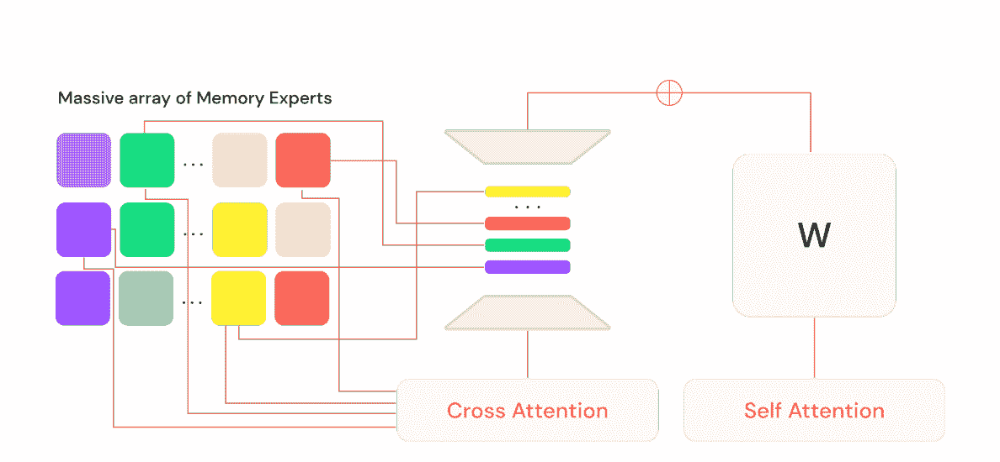

来自 Li 等人 2024 年论文的图表 | [来源](https://arxiv.org/abs/2406.17642)

据说 Lamini 内存微调能够达到 95% 的准确率。与传统指令微调的关键区别在于，它不是优化所有任务的平均误差，而是专注于实现模型特别训练来记忆的事实零误差。

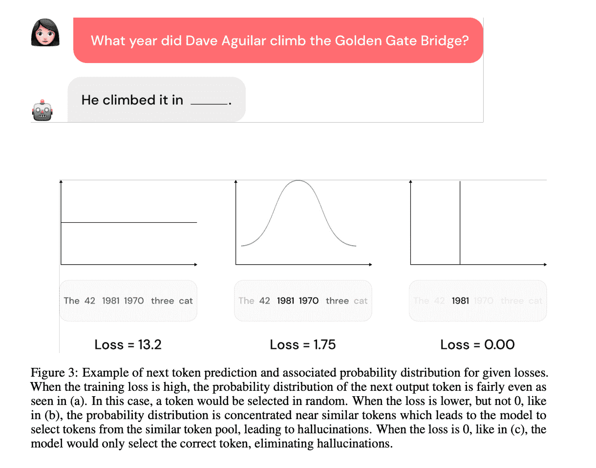

来自 Li 等人 2024 年论文的图表 | [来源](https://arxiv.org/abs/2406.17642)

因此，这种方法允许 LLM 在保持对其他所有内容的平均误差泛化能力的同时，几乎完美地回忆起重要的事实。

> 对于更多细节，你可以参考 Li 等人（2024）的研究论文 ["Banishing LLM Hallucinations Requires Rethinking Generalization"](https://arxiv.org/abs/2406.17642)。

Lamini 内存微调前景广阔——让我们看看它在实践中是否能实现其潜力。

## 设置

如同往常，让我们从设置一切开始。正如我们讨论的那样，我们将使用 [Lamini](https://docs.lamini.ai/) 来微调 Llama，因此第一步是安装 Lamini 包。

```py
pip install lamini
```

此外，我们还需要在 [他们的网站](https://app.lamini.ai/account) 上设置 Lamini API 密钥，并将其指定为环境变量。

```py
export LAMINI_API_KEY="<YOUR-LAMINI-API-KEY>" 
```

如我上面提到的，我们将改进 SQL 代理，因此我们需要一个数据库。在这个例子中，我们将继续使用 ClickHouse，但请随意选择任何适合您需求的数据库。您可以在 [上一篇文章](https://medium.com/towards-data-science/from-prototype-to-production-enhancing-llm-accuracy-791d79b0af9b) 中找到有关 ClickHouse 设置和数据库模式的更多详细信息。

## 创建训练数据集

要微调一个大型语言模型（LLM），我们首先需要一个数据集——在我们的案例中，是一组问题和答案（SQL 查询）的配对。整理数据集的任务可能看起来令人畏惧，但幸运的是，我们可以利用 LLM 来完成这项工作。

在准备数据集时需要考虑的关键因素：

+   **数据质量**至关重要，因为我们将会要求模型记住这些事实。

+   示例中的**多样性**很重要，这样模型才能学习如何处理不同的情况。

+   与合成生成数据相比，使用**真实数据**更可取，因为它更好地代表了现实生活中的问题。

+   微调数据集的通常最小大小约为**1,000 个示例**，但高质量的数据越多越好。

### 生成示例

创建问答配对所需的所有信息都存在于数据库模式中，因此对于 LLM 来说生成示例将是一项可行的任务。此外，我有一个 [代表性集](https://github.com/miptgirl/miptgirl_medium/blob/main/sql_agent_accuracy/rag_set.json) 的问答配对，我使用了它来进行 RAG 方法，我们可以将这些作为有效查询的示例呈现给 LLM（使用少样本提示技术）。让我们加载 RAG 数据集。

```py
# loading a set of examples
with open('rag_set.json', 'r') as f:
    rag_set = json.loads(f.read())

rag_set_df = pd.DataFrame(rag_set)

rag_set_df['qa_fmt'] = list(map(
    lambda x, y: "question: %s, sql_query: %s" % (x, y),
    rag_set_df.question,
    rag_set_df.sql_query
))
```

策略是迭代地向 LLM 提供模式信息和一组随机示例（以确保问题的多样性），并要求它生成一个新的、相似的但不同的问答配对。

让我们创建一个包含数据库模式所有必要细节的系统提示。

```py
generate_dataset_system_prompt = '''
You are a senior data analyst with more than 10 years of experience writing complex SQL queries. 
There are two tables in the database you're working with with the following schemas. 

Table: ecommerce.users 
Description: customers of the online shop
Fields: 
- user_id (integer) - unique identifier of customer, for example, 1000004 or 3000004
- country (string) - country of residence, for example, "Netherlands" or "United Kingdom"
- is_active (integer) - 1 if customer is still active and 0 otherwise
- age (integer) - customer age in full years, for example, 31 or 72

Table: ecommerce.sessions 
Description: sessions for online shop
Fields: 
- user_id (integer) - unique identifier of customer, for example, 1000004 or 3000004
- session_id (integer) - unique identifier of session, for example, 106 or 1023
- action_date (date) - session start date, for example, "2021-01-03" or "2024-12-02"
- session_duration (integer) - duration of session in seconds, for example, 125 or 49
- os (string) - operation system that customer used, for example, "Windows" or "Android"
- browser (string) - browser that customer used, for example, "Chrome" or "Safari"
- is_fraud (integer) - 1 if session is marked as fraud and 0 otherwise
- revenue (float) - income in USD (the sum of purchased items), for example, 0.0 or 1506.7

Write a query in ClickHouse SQL to answer the following question. 
Add "format TabSeparatedWithNames" at the end of the query to get data from ClickHouse database in the right format. 
'''
```

下一步是为用户查询创建一个模板。

```py
generate_dataset_qa_tmpl = '''
Considering the following examples, please, write question 
and SQL query to answer it, that is similar but different to provided below.

Examples of questions and SQL queries to answer them: 
{examples}
'''
```

由于我们需要高质量的数据集，我更愿意使用一个更先进的模型——`GPT-4o`——而不是 Llama。像往常一样，我将初始化模型并创建一个用于结构化输出的虚拟工具。

```py
from langchain_core.tools import tool

@tool
def generate_question_and_answer(comments: str, question: str, sql_query: str) -> str:
  """Returns the new question and SQL query 

  Args:
      comments (str): 1-2 sentences about the new question and answer pair,
      question (str): new question 
      sql_query (str): SQL query in ClickHouse syntax to answer the question
  """
  pass

from langchain_openai import ChatOpenAI
generate_qa_llm = ChatOpenAI(model="gpt-4o", temperature = 0.5)
  .bind_tools([generate_question_and_answer])
```

现在，让我们将所有这些组合成一个函数，该函数将生成问答配对并创建一组示例。

```py
# helper function to combine system + user prompts
def get_openai_prompt(question, system):
    messages = [
        ("system", system),
        ("human", question)
    ]
    return messages

def generate_qa():
  # selecting 3 random examples 
  sample_set_df = rag_set_df.sample(3)
  examples = 'nn'.join(sample_set_df.qa_fmt.values)

  # constructing prompt
  prompt = get_openai_prompt(
    generate_dataset_qa_tmpl.format(examples = examples), 
    generate_dataset_system_prompt)

  # calling LLM
  qa_res = generate_qa_llm.invoke(prompt)

  try:
      rec = qa_res.tool_calls[0]['args']
      rec['examples'] = examples
      return rec
  except:
      pass

# executing function
qa_tmp = []
for i in tqdm.tqdm(range(2000)):
  qa_tmp.append(generate_qa())

new_qa_df = pd.DataFrame(qa_tmp)
```

我生成了 2,000 个示例，但在现实中，我实际上为这个玩具项目使用了一个小得多的数据集。因此，我建议将示例数量限制在 200-300 个。

### 清洗数据集

如我们所知，“垃圾输入，垃圾输出”，因此在微调之前清理 LLM 生成的数据是一个重要步骤。

第一个——也是最明显的一步——是确保每个 SQL 查询都是有效的。

```py
def is_valid_output(s):
    if s.startswith('Database returned the following error:'):
        return 'error'
    if len(s.strip().split('n')) >= 1000:
        return 'too many rows'
    return 'ok'

new_qa_df['output'] = new_qa_df.sql_query.map(get_clickhouse_data)
new_qa_df['is_valid_output'] = new_qa_df.output.map(is_valid_output)
```

数据集中没有无效的 SQL 查询，但有些问题返回超过 1,000 行。

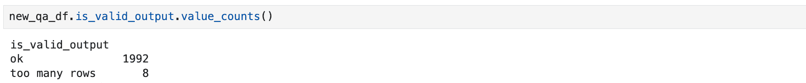

虽然这些案例是有效的，但我们专注于一个[OLAP](https://en.wikipedia.org/wiki/Online_analytical_processing)场景，其中包含汇总统计信息，所以我只保留了返回 100 行或更少的查询。

```py
new_qa_df['output_rows'] = new_qa_df.output.map(
  lambda x: len(x.strip().split('n')))

filt_new_qa_df = new_qa_df[new_qa_df.output_rows <= 100]
```

我还排除了输出为空的案例——即返回没有行或只有标题的查询。

```py
filt_new_qa_df = filt_new_qa_df[filt_new_qa_df.output_rows > 1]
```

另一个重要的检查是重复问题。相同的问题但不同的答案可能会让模型困惑，因为它无法同时调整到两个解决方案。实际上，我们确实有这样的案例。

```py
filt_new_qa_df = filt_new_qa_df[['question', 'sql_query']].drop_duplicates()
filt_new_qa_df['question'].value_counts().head(10)
```

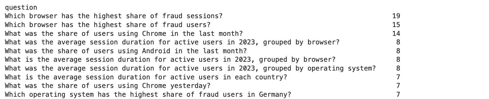

为了解决这些重复项，我只保留每个问题的一个答案。

```py
filt_new_qa_df = filt_new_qa_df.drop_duplicates('question') 
```

虽然我生成了大约 2,000 个示例，但我决定使用一个更小的 200 个问答对的数据集。使用更大的数据集进行微调需要更多的调整步骤，并且成本更高。

```py
sample_dataset_df = pd.read_csv('small_sample_for_finetuning.csv', sep = 't')
```

> 您可以在[GitHub](https://github.com/miptgirl/miptgirl_medium/blob/main/sql_agent_accuracy/small_sample_for_finetuning.csv)上找到最终的训练数据集。

现在我们已经准备好了训练数据集，我们可以继续到最激动人心的部分——微调。

## 微调

### 第一次迭代

下一步是生成用于微调模型的 LLM 请求和响应集。

由于我们将使用 Llama 模型，让我们创建一个辅助函数来构建针对它的提示。

```py
def get_llama_prompt(user_message, system_message=""):
    system_prompt = ""
    if system_message != "":
        system_prompt = (
            f"<|start_header_id|>system<|end_header_id|>nn{system_message}"
            f"<|eot_id|>"
        )
    prompt = (f"<|begin_of_text|>{system_prompt}"
              f"<|start_header_id|>user<|end_header_id|>nn"
              f"{user_message}"
              f"<|eot_id|>"
              f"<|start_header_id|>assistant<|end_header_id|>nn"
         )
    return prompt 
```

对于请求，我们将使用以下系统提示，其中包含有关数据模式的所有必要信息。

```py
generate_query_system_prompt = '''
You are a senior data analyst with more than 10 years of experience writing complex SQL queries. 
There are two tables in the database you're working with with the following schemas. 

Table: ecommerce.users 
Description: customers of the online shop
Fields: 
- user_id (integer) - unique identifier of customer, for example, 1000004 or 3000004
- country (string) - country of residence, for example, "Netherlands" or "United Kingdom"
- is_active (integer) - 1 if customer is still active and 0 otherwise
- age (integer) - customer age in full years, for example, 31 or 72

Table: ecommerce.sessions 
Description: sessions of usage the online shop
Fields: 
- user_id (integer) - unique identifier of customer, for example, 1000004 or 3000004
- session_id (integer) - unique identifier of session, for example, 106 or 1023
- action_date (date) - session start date, for example, "2021-01-03" or "2024-12-02"
- session_duration (integer) - duration of session in seconds, for example, 125 or 49
- os (string) - operation system that customer used, for example, "Windows" or "Android"
- browser (string) - browser that customer used, for example, "Chrome" or "Safari"
- is_fraud (integer) - 1 if session is marked as fraud and 0 otherwise
- revenue (float) - income in USD (the sum of purchased items), for example, 0.0 or 1506.7

Write a query in ClickHouse SQL to answer the following question. 
Add "format TabSeparatedWithNames" at the end of the query to get data from ClickHouse database in the right format. 
Answer questions following the instructions and providing all the needed information and sharing your reasoning. 
'''
```

让我们创建适合 Lamini 微调的响应格式。我们需要准备一个包含`input`和`output`键的字典列表。

```py
formatted_responses = []

for rec in sample_dataset_df.to_dict('records'):
  formatted_responses.append(
    {
      'input': get_llama_prompt(rec['question'], 
        generate_query_system_prompt),
      'output': rec['sql_query']
    }
  )
```

现在，我们已经完全准备好进行微调。我们只需选择一个模型并启动过程。我们将微调 Llama 3.1 8B 模型。

```py
from lamini import Lamini
llm = Lamini(model_name="meta-llama/Meta-Llama-3.1-8B-Instruct")

finetune_args = {
    "max_steps": 50,
    "learning_rate": 0.0001
}

llm.train(
  data_or_dataset_id=formatted_responses,
  finetune_args=finetune_args,
) 
```

我们可以指定几个超参数，所有详细信息都可以在[Lamini 文档](https://docs.lamini.ai/tuning/hyperparameters/)中找到。目前，我只将最重要的几个传递给了函数：

+   `最大步数`：这决定了调整步骤的数量。文档建议使用 50 步进行实验，以获得初始结果，同时不会花费太多钱。

+   `学习率`：此参数决定了向损失函数最小值移动时每次迭代的步长([维基百科](https://en.wikipedia.org/wiki/Learning_rate))。默认值为 0.0009，但根据[指导](https://docs.lamini.ai/tuning/memory_tuning/#example-memory-tuning-settings)，我决定使用一个更小的值。

现在，我们只需等待 10-15 分钟，让模型训练，然后我们就可以测试它。

```py
finetuned_llm = Lamini(model_name='<model_id>')
# you can find Model ID in the Lamini interface

question = '''How many customers made purchase in December 2024?'''
prompt = get_llama_prompt(question, generate_query_system_prompt)
finetuned_llm.generate(prompt, max_new_tokens=200)
# select uniqExact(s.user_id) as customers 
# from ecommerce.sessions s join ecommerce.users u 
# on s.user_id = u.user_id 
# where (toStartOfMonth(action_date) = '2024-12-01') and (revenue > 0) 
# format TabSeparatedWithNames
```

值得注意的是，我们还将使用 Lamini 进行推理，并将为此付费。您可以在[这里](https://www.lamini.ai/pricing)找到有关费用的最新信息。

初看结果看起来很有希望，但我们需要一个更稳健的准确度评估来确认它。

此外，值得注意的是，由于我们已经针对我们的特定任务微调了模型，它现在始终返回 SQL 查询，这意味着我们可能不再需要使用工具调用来获取结构化输出。

### 评估质量

我们已经在[我的上一篇文章](https://medium.com/towards-data-science/from-prototype-to-production-enhancing-llm-accuracy-791d79b0af9b)中详细讨论了 LLM 准确度评估，所以在这里我将提供一个简要的回顾。

我们使用一组金色的问答对来评估模型的质量。由于这是一个玩具示例，我将该集合限制为仅 10 对，您可以在[GitHub](https://github.com/miptgirl/miptgirl_medium/blob/main/sql_agent_accuracy/golden_set.json)上查看。

评估过程包括两个部分：

+   **SQL 查询有效性**：首先，我们检查 SQL 查询是否有效，这意味着 ClickHouse 在执行期间不会返回错误。

+   **查询正确性**：接下来，我们确保生成的查询是正确的。我们使用 LLM 比较生成查询和真实查询的输出，以验证它们提供语义上相同的结果。

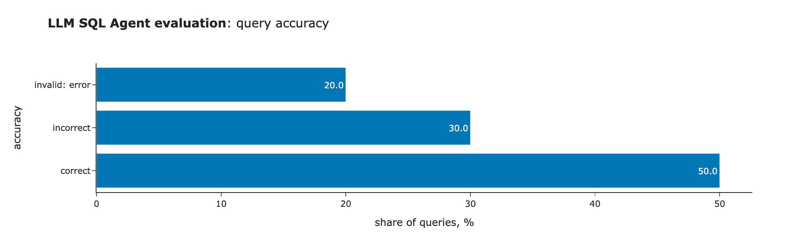

初始结果远非理想，但它们比基础 Llama 模型（产生了零个有效的 SQL 查询）好得多。以下是我们的发现：

+   ClickHouse 为两个查询返回了错误。

+   执行了三个查询，但结果不正确。

+   五个查询是正确的。

没有惊喜——没有银弹，这始终是一个迭代的过程。让我们调查一下出了什么问题。

### 深入错误

方法很简单。让我们逐一检查错误，了解我们为什么得到这些结果以及我们如何修复它们。我们将从第一个失败的例子开始。

* * *

**问题**：哪个国家在 2024 年有最多的首次用户？

**黄金查询：**

```py
select 
  country, 
  count(distinct user_id) as users 
from 
  (
    select user_id, min(action_date) as first_date 
    from ecommerce.sessions 
    group by user_id 
    having toStartOfYear(first_date) = '2024-01-01'
  ) as t 
  inner join ecommerce.users as u 
    on t.user_id = u.user_id 
group by country 
order by users desc 
limit 1 
format TabSeparatedWithNames 
```

**生成的查询：**

```py
select 
  country, 
  count(distinct u.user_id) as first_time_users 
from ecommerce.sessions s 
join ecommerce.users u 
  on s.user_id = u.user_id 
where (toStartOfYear(action_date) = '2024-01-01') 
  and (s.session_id = 1) 
group by country 
order by first_time_users desc 
limit 1 
format TabSeparatedWithNames 
```

查询是有效的，但它返回了错误的结果。问题在于模型假设每个用户的第一个会话将始终有`session_id = 1`。由于 Lamini Memory Tuning 允许模型从训练数据中学习事实，让我们调查一下模型为什么做出这个假设。很可能，它在我们的数据中。

让我们回顾所有提到“首次”的例子。我将使用广泛的简单搜索标准来获得高级视图。

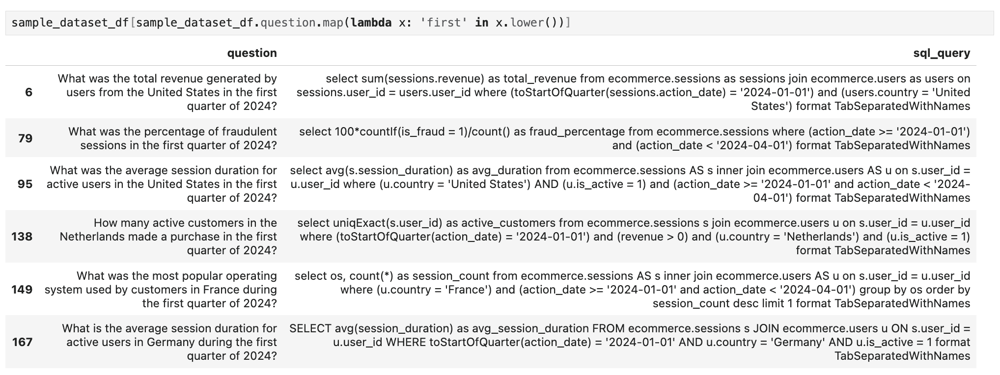

如我们所见，没有提到“首次用户”的例子——只有关于第一季度的引用。模型无法捕捉这个概念并不奇怪。解决方案很简单：我们只需要添加一组关于首次用户的特定问题和答案的例子。

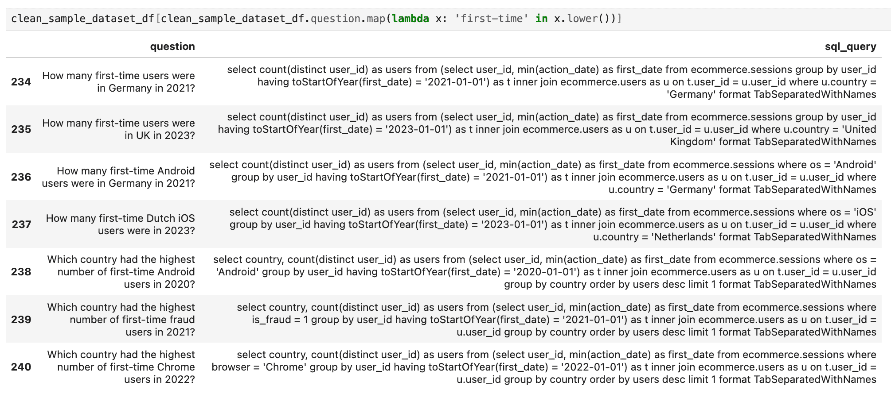

* * *

让我们继续下一个问题案例。

**问题**：2023 年的欺诈率是多少，以百分比表示？

**黄金查询：**

```py
select 
  100*uniqExactIf(user_id, is_fraud = 1)/uniqExact(user_id) as fraud_rate 
from ecommerce.sessions 
where (toStartOfYear(action_date) = '2023-01-01') 
format TabSeparatedWithNames 
```

**生成的查询：**

```py
select 
  100*countIf(is_fraud = 1)/count() as fraud_rate 
from ecommerce.sessions 
where (toStartOfYear(action_date) = '2023-01-01') 
format TabSeparatedWithNames 
```

这里还有一个误解：我们假设欺诈率是基于用户份额的，而模型是根据会话份额计算的。

让我们检查数据中与欺诈率相关的示例。有两种情况：一种计算用户份额，另一种计算会话份额。

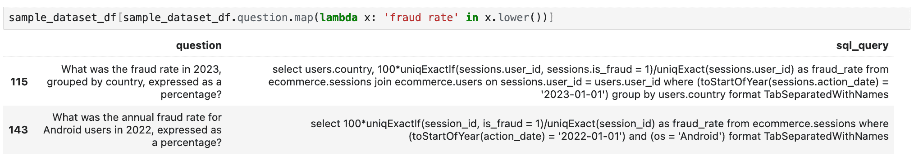

为了解决这个问题，我纠正了错误的答案，并添加了更多涉及欺诈率计算的准确示例。

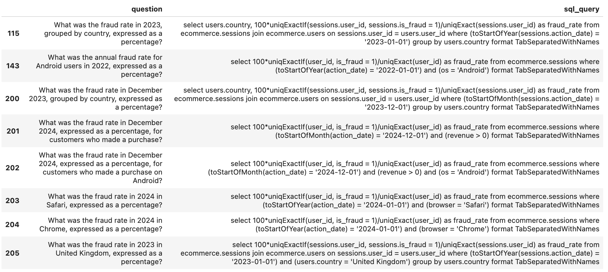

* * *

我想讨论另一个不正确的情况，因为它将突出解决这些问题的过程中的一个重要方面。

**问题：** 每个国家的销售收入的中位数和四分位数范围（IQR）是多少？

**黄金查询：**

```py
select 
  country, 
  median(revenue) as median_revenue, 
  quantile(0.25)(revenue) as percentile_25_revenue, 
  quantile(0.75)(revenue) as percentile_75_revenue 
from ecommerce.sessions AS s 
inner join ecommerce.users AS u 
  on u.user_id = s.user_id 
where (revenue > 0) 
group by country 
format TabSeparatedWithNames 
```

**生成的查询：**

```py
select 
  country, 
  median(revenue) as median_revenue, 
  quantile(0.25)(revenue) as percentile_25_revenue, 
  quantile(0.75)(revenue) as percentile_75_revenue 
from ecommerce.sessions s join ecommerce.users u 
  on s.user_id = u.user_id 
group by country 
format TabSeparatedWithNames 
```

在检查问题时，关注模型的误解或错误假设至关重要。例如，在这种情况下，可能会有添加与黄金数据集中类似的示例的诱惑，但这会过于具体。相反，我们应该解决模型误解的实际根本原因：

+   它很好地理解了中位数和 IQR 的概念。

+   按国家划分也是正确的。

+   然而，它误解了“销售收入”的概念，包括没有任何购买行为（`收入 = 0`）的会话。

因此，我们需要确保我们的数据集包含足够与销售收入相关的信息。让我们看看我们现在有什么。只有一个例子，而且是不正确的。

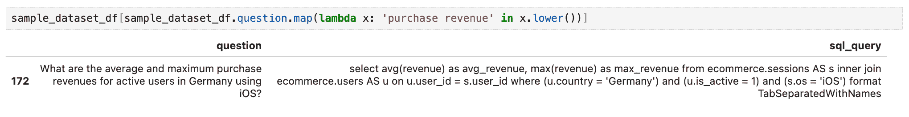

让我们修复这个例子，并添加更多关于销售收入计算的案例。

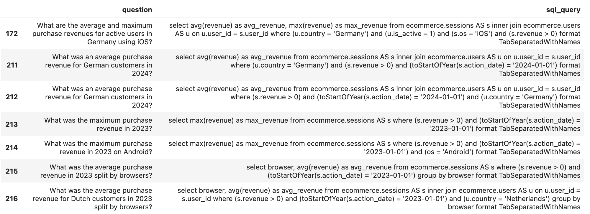

* * *

使用类似的方法，我为剩下的两个不正确的查询添加了更多示例，并编译了一个更新后的、清洗过的训练数据集版本。您可以在[GitHub](https://github.com/miptgirl/miptgirl_medium/blob/main/sql_agent_accuracy/small_sample_for_finetuning_cleaned.csv)上找到它。有了这个，我们的数据已经准备好进行下一轮迭代。

### 另一次微调迭代

在进行微调之前，通过确保所有 SQL 查询都是有效的来双重检查训练数据集的质量是至关重要的。

```py
clean_sample_dataset_df = pd.read_csv(
  'small_sample_for_finetuning_cleaned.csv', sep = 't', 
  on_bad_lines = 'warn')

clean_sample_dataset_df['output'] = clean_sample_dataset_df.sql_query
  .map(lambda x: get_clickhouse_data(str(x)))
clean_sample_dataset_df['is_valid_output'] = clean_sample_dataset_df['output']
  .map(is_valid_output)
print(clean_sample_dataset_df.is_valid_output.value_counts())

# is_valid_output
# ok    241

clean_formatted_responses = []
for rec in clean_sample_dataset_df.to_dict('records'):
  clean_formatted_responses.append(
    {
      'input': get_llama_prompt(
        rec['question'], 
        generate_query_system_prompt),
      'output': rec['sql_query']
    }
  )
```

既然我们对数据有信心，我们可以进行微调。这次，我决定训练 150 步以达到更高的准确性。

```py
finetune_args = {
      "max_steps": 150,
      "learning_rate": 0.0001
}

llm = Lamini(model_name="meta-llama/Meta-Llama-3.1-8B-Instruct")
llm.train(
  data_or_dataset_id=clean_formatted_responses,
  finetune_args=finetune_args
)
```

在等待比上次更长一段时间后，我们现在有一个新的微调模型，在 150 次调整步骤后损失几乎为零。

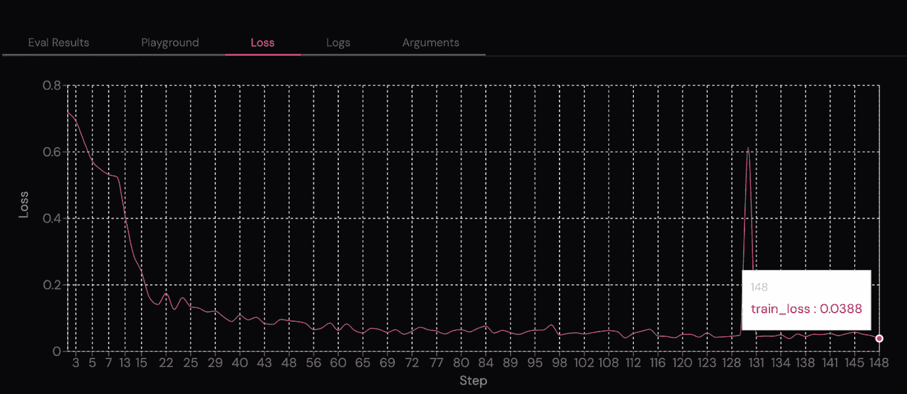

我们可以再次运行评估并看到更好的结果。所以，我们的方法是有效的。

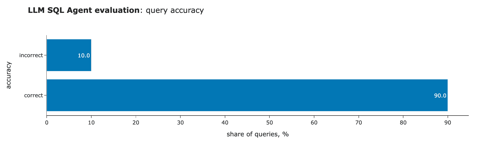

结果令人惊讶，但仍然值得检查错误的示例，以了解出了什么问题。我们之前讨论的问题得到了错误的结果：“每个国家的购买收入的中位数和四分位数范围（IQR）是多少？”然而，这次，模型生成的查询与黄金集中的查询完全相同。

```py
select 
  country, 
  median(revenue) as median_revenue, 
  quantile(0.25)(revenue) as percentile_25_revenue, 
  quantile(0.75)(revenue) as percentile_75_revenue 
from ecommerce.sessions AS s 
inner join ecommerce.users AS u 
  on u.user_id = s.user_id 
where (s.revenue > 0) 
group by country 
format TabSeparatedWithNames
```

因此，问题实际上在于我们的评估。事实上，如果你尝试多次执行此查询，你会注意到每次的结果都有所不同。根本原因是[ClickHouse](https://clickhouse.com/docs/en/sql-reference/aggregate-functions/reference/quantile)中的`quantile`函数使用蓄水池抽样计算近似值，这就是为什么我们会看到不同的结果。我们可以使用`quantileExact`来获得更一致的数字。

也就是说，这意味着微调使我们实现了 100%的准确率。尽管我们的玩具黄金数据集只包含 10 个问题，但这是一项巨大的成就。我们从原始 Llama 的零有效查询进步到了 RAG 和自我反思的 70%准确率，现在，多亏了 Lamini 记忆调优，我们达到了 100%的准确率。

> 您可以在[GitHub](https://github.com/miptgirl/miptgirl_medium/blob/main/sql_agent_accuracy/sql_agent_fine_tuning.ipynb)上找到完整的代码。

## 摘要

在这篇文章中，我们继续探索提高 LLM 准确性的技术：

+   在[上一篇文章](https://medium.com/towards-data-science/from-prototype-to-production-enhancing-llm-accuracy-791d79b0af9b)中尝试了 RAG 和自我反思之后，我们转向了更高级的技术——微调。

+   我们尝试了 Lamini 开发的记忆调优，它使模型能够以近乎零的错误率记住大量事实。

+   在我们的例子中，记忆调优表现异常出色，我们在 10 个问题的评估集中实现了 100%的准确率。

> 非常感谢您阅读这篇文章。我希望这篇文章对您有所启发。如果您有任何后续问题或评论，请留下它们在评论部分。

## 参考文献

> 所有图像除非另有说明，均由作者制作。

这篇文章灵感来源于 DeepLearning.AI 的["提高 LLM 应用准确率"](https://www.deeplearning.ai/short-courses/improving-accuracy-of-llm-applications/)短期课程。

* * *

**免责声明：** *我以任何方式都与 Lamini 无关。本文中表达的观点仅基于对 Lamini 平台的独立测试和评估，完全是我个人的观点。本文旨在教育目的，并不构成对任何特定工具或服务的推荐。*
