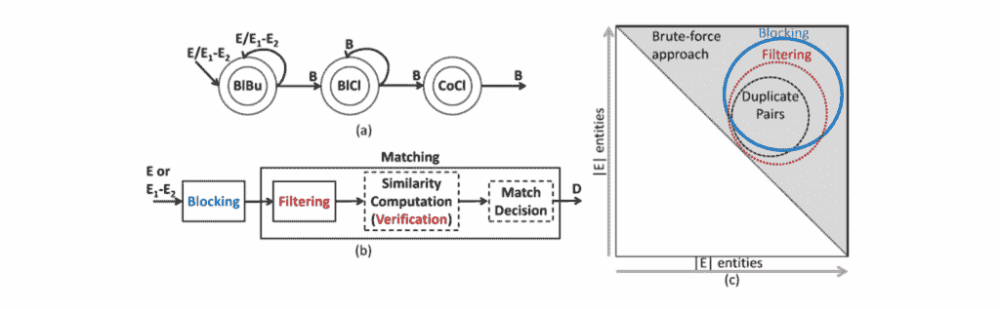
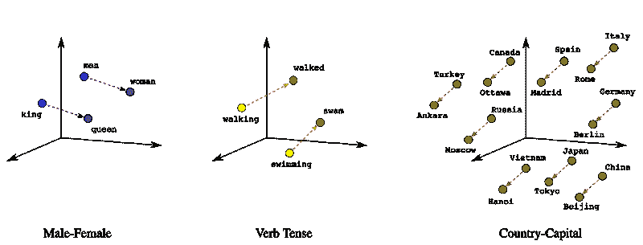
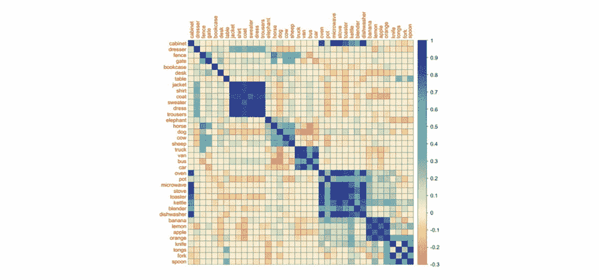
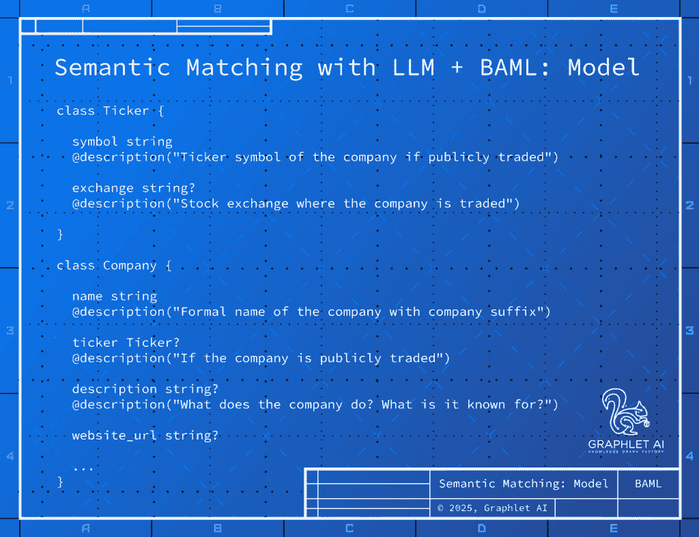
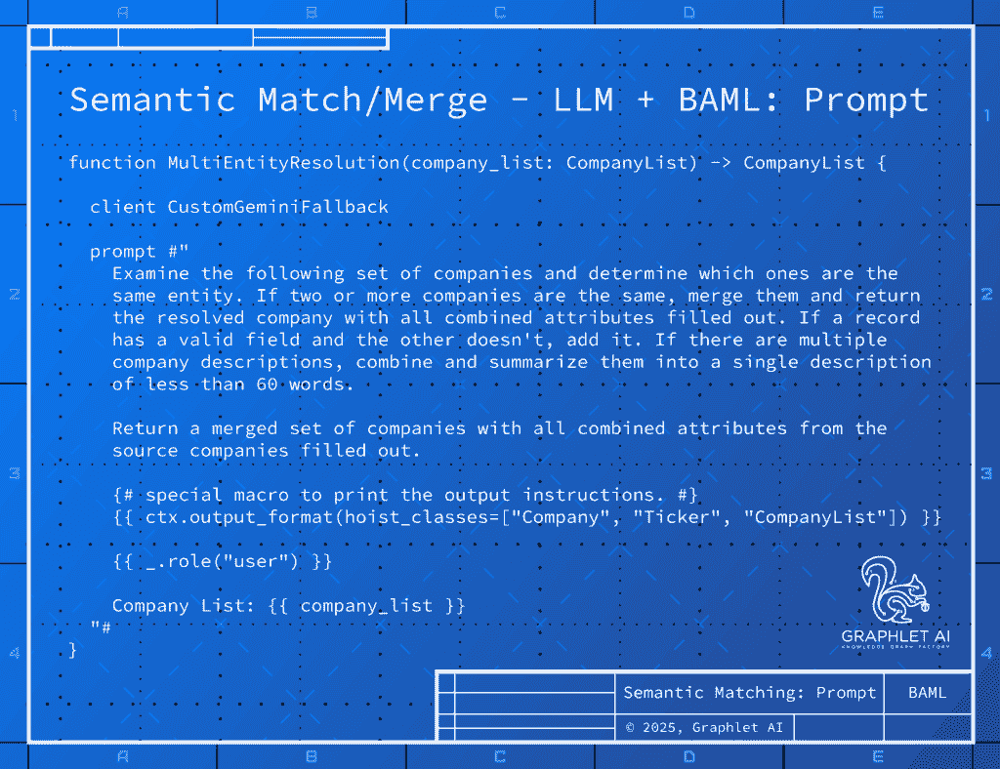
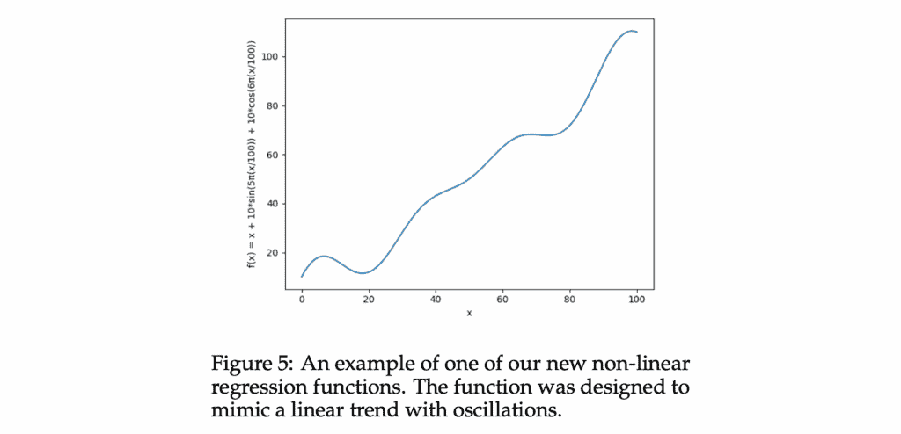
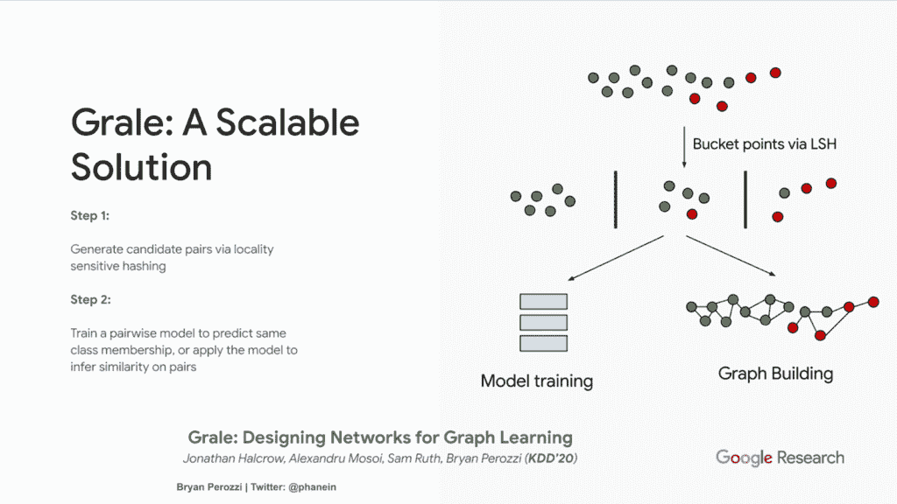
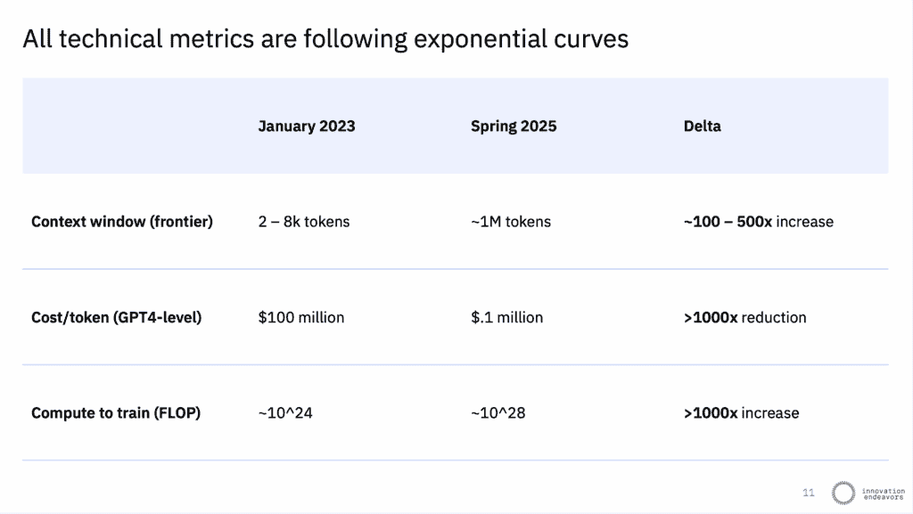
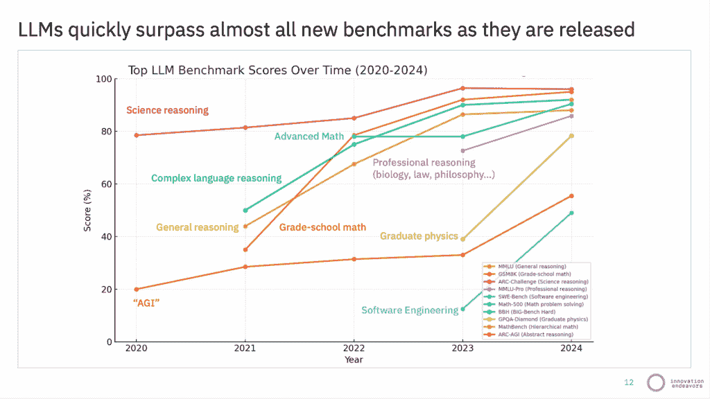
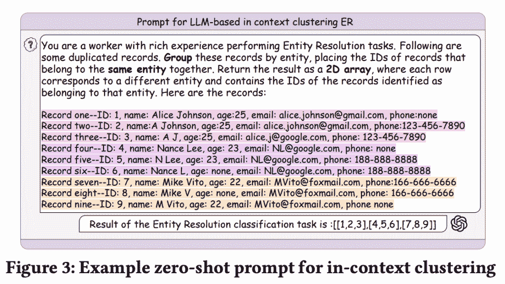

# 语义实体解析的兴起

> 原文：[`towardsdatascience.com/the-rise-of-semantic-entity-resolution/`](https://towardsdatascience.com/the-rise-of-semantic-entity-resolution/)

*本文介绍了语义实体解析这一新兴领域，它使用语言模型来自动化从文本构建知识图中最痛苦的部分：去重记录。从文本中提取的知识图谱为大多数自主代理提供动力，但其中包含许多重复项。以下工作包括原创研究，因此本文必然是技术性的*。

**语义实体解析**使用语言模型将更高的自动化水平引入模式对齐、[块](https://en.wikipedia.org/wiki/Record_linkage#Blocking)（将记录分组到更小、更有效的*块*中，以进行所有成对比较，具有二次、n²复杂度）、匹配甚至*合并*重复节点和边。在过去，实体解析系统依赖于诸如字符串距离、静态规则或复杂的 ETL 等统计技巧来对齐模式、块、匹配和合并记录。语义实体解析*使用[表示学习](https://en.wikipedia.org/wiki/Feature_learning#:~:text=feature%20learning%20or,a%20specific%20task.)来获得对记录在业务领域*意义*的*更深入的理解*，从而自动化作为[知识图谱工厂](https://blog.graphlet.ai/knowledge-graph-factories-f50466fb7512)一部分的相同过程。

### TLDR

同样改变教科书、客户服务和编程技术的技术正在向实体解析进军。怀疑？试试下面的交互式演示……它们展示了潜力🙂

## 不要只是说，要证明它

我不想*说服*你，我想通过每篇文章中的交互式演示*转化*你。试试它们，编辑数据，看看它们能做什么。玩玩它。我希望这些简单的例子证明了*语义*方法在实体解析中的*潜力*。

1.  本文包含两个演示。在第一个演示中，我们从新闻和维基百科中提取公司以进行丰富。在第二个演示中，我们使用*语义匹配*在一个提示中去重这些公司。

1.  在第二篇文章中，我将演示*语义* [*块](https://en.wikipedia.org/wiki/Record_linkage#Blocking)*，我将其定义为“使用深度嵌入和语义聚类来构建更小的记录组以进行成对比较。”

1.  在第三篇文章中，我将展示语义块和匹配如何结合来提高在[KuzuDB](https://kuzudb.com/)中真实知识图的[文本到 Cypher](https://blog.kuzudb.com/post/improving-text2cypher-for-graphrag-via-schema-pruning/)。

## 基于代理的知识图谱爆炸！

**为什么语义实体解析如此重要？这是因为代理！**

自主代理对知识的需求旺盛，最近的模型如 Gemini 2.5 Pro 使得从文本中提取知识图谱变得容易。**LLMs 在从文本中提取结构化信息方面非常出色**，因此在接下来的十八个月内，将会有比以往任何时候都多的知识图谱从非结构化数据中构建出来。大多数网络流量的来源已经是渴望的 LLMs，它们消耗文本以产生结构化信息。自主代理越来越多地通过文本查询图数据库，例如使用[Text2Cypher](https://arxiv.org/abs/2412.10064)这样的工具。

**语义网最终证明是非常个人化的：**任何规模的**公司**都即将拥有**他们自己的知识图谱**，作为其**问题域**的核心资产，以**驱动自动化其业务的代理**。

### 子情节：强大的代理需要实体解析 KGs

正在构建代理的公司即将**直接面临知识图谱的实体解析**这一复杂且通常成本高昂的问题，这阻碍了他们利用其组织知识。使用 LLMs 从文本中提取知识图谱会产生*大量*的**重复节点和边**。垃圾输入：垃圾输出。当概念分散在多个实体之间时，会出现错误答案。这限制了原始提取图驱动代理的能力。**实体解析的知识图谱对于代理完成其工作至关重要**。

## 知识图谱的实体解析

知识图谱的实体解析有几个步骤，从原始数据到可检索的知识。让我们定义它们，以便了解*语义实体解析*如何改进这个过程。

### 节点去重

1.  低成本的阻塞函数将相似节点分组到更小的块（组）中，以便进行成对比较，因为它以 n²复杂度进行扩展。

1.  匹配函数为每个块内每对节点做出匹配决策，通常带有置信度分数和解释。

1.  新的**SAME_AS 边**在每对匹配的节点之间创建。

1.  这形成了被称为连通组件的连接节点簇。一个组件对应一个解析记录。

1.  组件中的节点合并——字段可能成为列表，然后进行去重。节点合并*可以使用 LLMs 自动化*。

下面的图示说明了这个过程：



[实体解析的阻塞和过滤技术综述](https://arxiv.org/abs/1905.06167)，Papadakis 等人，2020

### 边去重

合并节点将源节点的边合并在一起，包括相同类型的重复项以进行合并。边的阻塞更为简单，但合并可能取决于边的属性而变得复杂。

1.  边根据其源节点 ID、目标节点 ID 和边类型**按组分组**，以创建边块。

1.  边匹配函数为每个边块内的每对边做出匹配决策。

1.  然后使用如何组合属性（如权重）的规则合并边。

结果的实体解析知识图谱现在准确地代表了**问题域的专业知识**。在知识库上使用 Text2Cypher 成为驱动自主代理的强大方式……但在进行实体解析之前。

### 现有工具的不足之处

知识图谱的实体解析是一个难题，因此现有的知识图谱实体解析工具很复杂。大多数来自学术界的实体链接库在现实世界场景中并不有效。商业实体解析产品陷入了以 SQL 为中心的世界，通常仅限于个人和公司记录，并且可能非常昂贵，尤其是对于大型知识图谱。这两套工具**匹配**但不**合并**节点和边，这需要通过复杂的 ETL 进行大量的人工操作。对于更简单、自动化的工作流程，即语义实体解析，存在迫切的需求。

## 图的语义实体解析

现代语义实体解析方案使用预训练的语言模型：深度嵌入、语义聚类和生成式 AI 来对齐、阻止、匹配和合并记录。它可以通过自动化的过程对记录进行分组、匹配和合并，使用的是正在取代许多传统系统的**相同** **transformers**，因为它们能够理解业务或问题域上下文中数据的实际**意义**。

**语义实体解析（Semantic ER）并非新事物**：自[*Ditto*](https://github.com/megagonlabs/ditto)在 2020 年的里程碑论文[*Deep Entity Matching with Pre-Trained Language Models*](https://arxiv.org/abs/2004.00584)（Li et al, 2020）中使用 BERT 进行阻止和匹配以来，它一直是该领域的顶尖技术，其性能比之前的基准提高了多达 29%。我们在 2021 年的 Deep Discovery 中使用了 Ditto 和 BERT 对数十亿个节点进行实体解析。谷歌和亚马逊都提供了语义实体解析服务……新的地方在于其简单性，这使得它更容易被开发者所接受。语义阻止仍然使用句子转换器，以及今天强大的嵌入。匹配已经从自定义转换器模型过渡到大型语言模型。与语言模型的合并则是今年才出现的。它仍在不断发展。

### 语义阻止：聚类嵌入记录

*语义阻塞* 使用与今天[检索增强生成 (RAG)](https://cloud.google.com/use-cases/retrieval-augmented-generation?hl=en)系统相同的[sentence transformer](https://sbert.net/examples/sentence_transformer/applications/clustering/README.html)模型，将这些记录转换为密集向量表示，以便使用向量相似度度量（如[余弦相似度](https://scikit-learn.org/stable/modules/generated/sklearn.metrics.pairwise.cosine_similarity.html)）进行语义检索。语义*阻塞*通过在句子编码模型提供的固定长度向量表示上使用**语义** ***聚类***，根据数据问题域中的语义相似性来分组可能匹配的记录。



语义嵌入向量中的每个维度都有其自己的意义，[遇见 AI 的多功能工具：向量嵌入](https://cloud.google.com/blog/topics/developers-practitioners/meet-ais-multitool-vector-embeddings)

语义聚类是一种高效的阻塞方法，它产生了具有更多积极匹配的小块，因为与传统使用字符串相似度度量来形成阻塞键以分组记录的句法阻塞方法不同，语义聚类利用现代语言模型的丰富上下文理解来捕捉记录字段之间的更深层次关系，即使它们的字符串有显著差异。

你可以在下面的语义表示向量相似度矩阵中看到语义簇的出现：它们是沿着对角线的块…而且它们可以很美 🙂



[通过与其相伴的对象了解一个对象：基于视觉场景中对象共现的语义表示研究](https://www.sciencedirect.com/science/article/pii/S0028393214002942), Sadeghi 等人，2015

虽然现成的、预训练的嵌入可以很好地工作，但通过微调句子转换器进行实体解析可以极大地增强语义阻塞。我一直在一个名为[Eridu](https://github.com/Graphlet-AI/eridu)（[huggingface](https://huggingface.co/Graphlet-AI/eridu)）的项目中使用对比学习来处理人名和公司名称，这正是我一直在努力的方向。这是一个正在进行中的项目，但我的原型[地址匹配模型](https://github.com/rjurney/libpostal-reborn/blob/main/Fine-Tuned%20Sentence%20Transformer.ipynb)在使用来自 GPT4o 的[合成数据](https://github.com/rjurney/libpostal-reborn/blob/main/Address%20Data%20Augmentation.ipynb)时表现得相当出色。你可以微调嵌入以进行聚类和匹配。

我将在我的下一篇文章中演示语义阻塞的细节。请保持关注！

### 使用 LLM 对记录进行对齐、匹配和合并

指导大型语言模型匹配和合并**两个**[*或更多*](https://arxiv.org/abs/2506.02509v1)记录是一种新颖且强大的技术。最新一代的大型语言模型在匹配 JSON 记录方面表现出惊人的能力，考虑到它们在信息提取方面的出色表现，这并不令人惊讶。我的[初步实验](https://gist.github.com/rjurney/68a6f5490c963043f73c92071762f1ad)使用[BAML](https://github.com/BoundaryML/baml)在单步中匹配和合并公司记录，效果出奇地好。鉴于 LLM 的快速改进速度，不难看出这是实体解析的未来。

能否信任 LLM（大型语言模型）进行实体解析？这应该基于其优点，而不是先入为主的观念。**认为 LLM 可以完全信任地构建知识图谱，但不能信任它们去重实体，这很奇怪**！可以使用思维链来为每个匹配项提供解释。以下我将讨论工作负载，但随着知识图谱的多样性扩展到涵盖每个企业和其代理人，将会有对简单 ER（实体解析）解决方案的强烈需求，这些解决方案通过扩展 KG（知识图谱）构建管道使用相同的工具：BAML、[DSPy](https://dspy.ai/)和 LLM。

## 低代码原型验证

下面有两个交互式 Prompt Fiddle 演示。第一个演示中提取的实体被用作第二个演示中要实体解析的记录。

### 从新闻和维基百科中提取公司信息

第一个演示是一个交互式演示，展示了如何使用[BAML](https://github.com/BoundaryML/baml)和 Gemini 2.5 Pro 从新闻和维基百科中执行信息提取。[BAML 模型](http://docs.boundaryml.com/ref/baml/types#compositestructured-types)基于[Jinja2](https://jinja.palletsprojects.com/en/stable/templates/)模板，并定义了从给定提示中提取的半结构化数据。它们可以通过`baml-cli generate` [命令](https://docs.boundaryml.com/guide/installation-language/python#step)导出为[Pydantic 模型](https://docs.pydantic.dev/latest/concepts/models/)。以下演示从[Nvidia 的维基百科文章](https://en.wikipedia.org/wiki/Nvidia)中提取公司信息。

点击查看实时演示：[使用 BAML + Gemini 进行公司信息提取的交互式演示 – Prompt Fiddle](https://www.promptfiddle.com/embed?id=New-Project-y5cHk)

我在过去三个月里为我的投资俱乐部做了上述工作，并且…我几乎没发现任何错误。每次我认为一家公司有误时，实际上将其包括在内是个好主意：当提到 Llama 模型时是 Meta。相比之下，最先进、传统的信息提取工具…[效果并不好](https://docs.google.com/document/d/1JMucv5ViDNpZ3tpzP7udTwOcxmMyYeTuOl7e64NfMgE/edit?usp=sharing)。当使用正确的工具时，Gemini 在信息提取方面远远领先于其他模型。

**BAML 和 DSPy 像是颠覆性技术**。它们提供了足够的准确性，使得 LLM 在许多任务中变得实用。它们对 LLM 的作用就像 Ruby on Rails 对 Web 开发一样：它们让使用 LLM 变得**愉快**。乐趣无穷！BAML 的介绍在这里 [这里](https://docs.boundaryml.com/guide/introduction/what-is-baml)，你还可以查看 [Ben Lorica](https://www.linkedin.com/in/benlorica/) 的 [关于 BAML 的展示](https://thedataexchange.media/baml-revolution-in-ai-engineering/)。

下面的公司模型是一个截断版本，它有 10 个字段，其中大多数都不会从一个文章中提取出来……所以我加入了维基百科，它获取了其中大部分。像 `exchange string?` 这样的属性后面的问号表示可选的，这很重要，因为 BAML 不会提取缺少必需字段的实体。`@description` 为 LLM 在解释字段时提供指导，无论是提取还是 *匹配和合并*。



注意模式指南中使用的类型注解指导了模式对齐、匹配和合并的过程！

### 语义实体解析加速丰富

一旦实体解析自动化，使用 [wikipedia PyPi 包](https://pypi.org/project/wikipedia/)（或像 [Diffbot](https://www.diffbot.com/) 或 [Google Knowledge Graph](https://developers.google.com/knowledge-graph) 这样的商业 API）来完善任何面向公众的实体变得非常简单，因此在示例中我包括了某些公司的 [维基百科文章](https://en.wikipedia.org/wiki/Nvidia)，以及关于 NVIDIA 和 AMD 的两篇文章。在构建知识图谱时，**从维基百科丰富面向公众的实体**一直是 TODO 列表上的任务，但……由于模式对齐、实体解析和记录合并的开销，**到目前为止，它经常没有完成**。对于这篇帖子，**我几分钟内就完成了它**。这让我相信，语义实体解析的快速性将产生很多下游影响。

### BAML 与 Gemini 2.5 Pro 的语义多匹配合并

下面的第二个演示在第一个演示中提取的 `Company` 实体上执行实体匹配，以及几篇更多的公司维基百科文章。它**一次性合并了所有 39 条记录，没有出现任何错误**！这潜力有多大？这并不是一个快速的提示……但你实际上不需要 Gemini 2.5 Pro 来做这件事，更快的模型也可以工作，LLM 可以一次性在 1M 令牌窗口中合并比这更多的记录……而且速度还在快速上升 🙂

点击查看实时演示：[**LLM MulitMatch + MultiMerge – Prompt Fiddle**](https://www.promptfiddle.com/LLM-MulitMatch---MultiMerge-_XOC8)

### 由字段描述引导的合并

如果你仔细看，你会发现上述公司的合并自动选择了全称，因为`Company.name`字段描述为“公司的正式名称，带有公司后缀”，存在多种形式。我无需在提示中给出那个指令！可以**使用记录元数据来引导模式对齐、匹配和合并**，而无需直接编辑提示。除了在 LLM 中合并多个记录外，我相信这是开创性的工作……我偶然发现了 🙂

BAML 模式中的字段注解：

```py
class Company {
  name string
  @description("Formal name of the company with corporate suffix")
  ...
}
```

原始的两条记录，一条来自新闻，另一条来自维基百科：

```py
{
  "name": "Nvidia Corporation",
  "ticker": {
    "symbol": "NVDA",
    "exchange": "NASDAQ"
  },
  "description": "An American technology company, founded in 1993, specializing in GPUs (e.g., Blackwell), SoCs, and full-stack AI computing platforms like DGX Cloud. A dominant player in the AI, gaming, and data center markets, it is led by CEO Jensen Huang and headquartered in Santa Clara, California.",
  "website_url": "null",
  "headquarters_location": "Santa Clara, California, USA",
  "revenue_usd": 10918000000,
  "employees": null,
  "founded_year": 1993,
  "ceo": "Jensen Huang",
  "linkedin_url": "null"
}
{
  "name": "Nvidia",
  "ticker": null,
  "description": "A company specializing in GPUs and full-stack AI computing platforms, including the GB200 and Blackwell series, and platforms like DGX Cloud.",
  "website_url": "null",
  "headquarters_location": "null",
  "revenue_usd": null,
  "employees": null,
  "founded_year": null,
  "ceo": "null",
  "linkedin_url": "null"
}
```

下面是匹配并合并的记录。注意，根据字段描述，没有特定指导的情况下选择了较长的`Nvidia Corporation`。此外，描述是文章中提到的 Nvidia 和维基百科条目内容的总结。而且，确实，模式不必相同 🙂

```py
{
  "name": "Nvidia Corporation",
  "ticker": {
    "symbol": "NVDA",
    "exchange": "NASDAQ"
  },
  "description": "An American technology company, founded in 1993, specializing in GPUs (e.g., Blackwell), SoCs, and full-stack AI computing platforms like DGX Cloud. A dominant player in the AI, gaming, and data center markets, it is led by CEO Jensen Huang and headquartered in Santa Clara, California.",
  "website_url": "null",
  "headquarters_location": "Santa Clara, California, USA",
  "revenue_usd": 10918000000,
  "employees": null,
  "founded_year": 1993,
  "ceo": "Jensen Huang",
  "linkedin_url": "null"
}
```

下面是提示，所有内容都很漂亮，适合用于幻灯片：



这个简单的提示同时匹配并合并了上述演示中的 39 条记录，由类型注解引导。

现在要清楚的是：在生产实体解析系统中，不仅仅是匹配……你需要为新记录分配唯一标识符，并将合并的 ID 作为字段包含在内，以跟踪哪些记录被合并……至少。我在我的投资俱乐部管道中这样做。我的目标是展示使用大型语言模型的**语义匹配和合并的潜力**……如果你愿意更进一步，我可以帮忙。我们在[Graphlet AI](https://graphlet.ai)做这件事 🙂

## 模式对齐？即将揭晓！

实体解析中的另一个难题是模式对齐：同一类型实体的不同数据源具有不完全匹配的字段。模式对齐是一个痛苦的过程，通常在实体解析成为可能之前发生……通过**语义匹配和类似名称或描述，模式对齐就自然而然地发生了**。正在匹配和合并的记录将利用表示学习的力量对齐……这理解到底层概念是相同的，因此模式对齐。

## 不仅仅是匹配

同时进行多条记录比较的一个有趣方面是，它为语言模型提供了观察、评估和评论提示中的记录组的机会。在我的实体解析管道中，我将从不同的新闻文章中提取的公司描述组合并总结，每个描述都总结了公司在特定文章中的表现。这提供了关于公司关系的全面描述，这些关系在其他情况下不可用。

**我相信有很多这样的机会**，鉴于即使是去年的 LLM 也能进行线性和非线性回归……查看[从文字到数字：你的大型语言模型在给定上下文示例时秘密是一个有能力的回归器](https://arxiv.org/abs/2404.07544v1)（Vacareanu 等人，2024 年）。



[从文字到数字：你的大型语言模型在给定上下文示例时秘密是一个有能力的回归器](https://arxiv.org/abs/2404.07544v1)，Vacareanu 2024。

一个 LLM 关于记录组可能做出的观察是无限的：与实体解析相关的任务，但不仅限于这一点。

## 成本和可扩展性

大型语言模型 API 的早期高成本和 GPU 推理的历史高价，使得人们对语义实体解析是否可以扩展持怀疑态度。

### 通过语义聚类进行扩展阻塞

在知识图谱的实体解析中进行匹配，只是**SAME_AS**边的链接预测，这是一个常见的图机器学习任务。毫无疑问，语义聚类对于链接预测可以以成本效益的方式扩展，因为这项技术已经在谷歌通过[Google Grale](https://dl.acm.org/doi/pdf/10.1145/3394486.3403302)（Halcrow 等人，2020 年，[NeurIPS 演示](https://neurips.cc/virtual/2020/20881)）得到了证明。该论文的作者包括图学习领域的杰出人物[Bryan Perozzi](https://www.linkedin.com/in/bryanperozzi/)，他是[KDD 测试奖](https://ai.stonybrook.edu/about-us/News/Steven-Skiena-and-Team-Win-2024-KDD-Test-Time-Award-Research)的获得者，该奖项是为了表彰他发明图嵌入。



它对谷歌来说是可以扩展的… [Grale：设计用于图学习的网络](https://www.youtube.com/watch?v=fdijatBSG48&ab_channel=JonathanHalcrow)，Johnathan Halcrow，谷歌研究

在 Grale 中，语义聚类是谷歌众多网络属性背后机器学习的一个关键部分，包括 YouTube 上的推荐。请注意，谷歌在 Grale 的链接预测中也使用语言模型来匹配节点🙂 谷歌还在其企业知识图谱服务中使用了[语义聚类](https://cloud.google.com/enterprise-knowledge-graph/docs/overview#:~:text=lightweight%2C%20AI%2Dpowered%2C-,semantic%20clustering,-and%20deduplication%20service)和[实体一致性 API](https://cloud.google.com/enterprise-knowledge-graph/docs/overview#entity_reconciliation_api)。

Grale 中的聚类使用局部敏感哈希（LSH）。另一种通过信息检索进行聚类的有效方法是使用向量数据库中的 L2 / 近似 K-最近邻聚类，例如[Facebook FAISS](https://github.com/facebookresearch/faiss) ([博客文章](https://engineering.fb.com/2017/03/29/data-infrastructure/faiss-a-library-for-efficient-similarity-search/)) 或 [Milvus](https://milvus.io/)。在 FAISS 中，记录在索引期间进行聚类，可以通过 A-KNN 检索为相似记录的组。

我将在第二篇文章中更多地讨论扩展语义分组！

### 通过大型语言模型进行匹配的扩展

大型语言模型资源密集，在训练和推理中都使用 GPU 以提高效率。有三个原因可以让我们对它们在实体解析方面的效率持乐观态度。

1. **LLMs 正不断、快速地变得不那么昂贵**…今天的预算不够吗？再等一个月。



[2025 年基础模型状态](https://foundationmodelreport.ai/2025.pdf)由 Innovation Endeavors 发布

…**并且更强大**。今天还不够准确吗？等一周，新的最佳模型就会出来。随着时间的推移，你的满意是不可避免的。



[2025 年基础模型状态](https://foundationmodelreport.ai/2025.pdf)由 Innovation Endeavors 发布

通过大型语言模型进行匹配的经济效益首次在《Cost-Efficient Prompt Engineering for Unsupervised Entity Resolution (Nananukul et al, 2023)》一文中被探讨。作者包括[Mayank Kejriwal](https://www.linkedin.com/in/mayankkejriwal/)，他撰写了[KGs 的圣经](https://www.amazon.com.au/Knowledge-Graphs-Fundamentals-Techniques-Applications/dp/0262045095)。他们取得了令人惊讶的准确结果，考虑到 GPT3.5 现在的表现有多糟糕。

2. 语义分组可能更有效，意味着包含更多积极匹配的小分组。我将在下一篇文章中演示这个过程。

3. 在现代 LLMs 拥有 100 万个 token 的上下文窗口的情况下，单个提示中可以同时匹配多个记录，甚至多个块。上面的演示中一次匹配和合并了 39 条记录，但最终一次可以同时处理数千条。



[基于上下文聚类的实体解析与大型语言模型：设计空间探索](https://arxiv.org/abs/2506.02509)，Fu et al, 2025.

## 怀疑论：两个工作负载的故事

一些工作负载适合今天的语义实体解析，而其他工作负载则还不适合。让我们探讨一下今天什么有效，什么无效。

语义实体解析最适合从非结构化文本中提取的知识图谱，这些知识图谱是通过大型语言模型生成的，你已信任其*生成数据*。你也信任嵌入来*检索数据*。为什么你不信任嵌入来*将数据分组匹配*，然后由大型语言模型*匹配和合并记录*？

现代大型语言模型和像 BAML 这样的工具从文本中提取信息非常强大，未来两年将看到知识图谱的激增，涵盖传统领域如科学、电子商务、营销、金融、制造业和生物医药，以及……任何和所有事物：体育、时尚、化妆品、嘻哈、手工艺、娱乐、非虚构（每本书都得到一个 KG），甚至虚构（我预测一个*巨大的克苏鲁神话* KG……我现在可能正在构建）。这些类型的工作负载将**完全跳过传统的实体解析工具**，并在其 KG 构建管道中执行语义实体解析。

### 实体解析的幂等性

语义实体解析尚未准备好应用于金融和医学，这两个领域都有严格的幂等性（可重复性）作为法律要求。这导致了[恐吓策略](https://www.linkedin.com/posts/ceteri_ive-had-to-field-this-question-multiple-activity-7356427257302708224-pysF/)，假装这适用于所有工作负载。

LLM 输出因多种原因而有所不同。GPU 并行执行多个线程，完成顺序各异。存在硬件和软件设置来减少或消除差异，以改善性能的一致性，但即使是在同一硬件上，这些设置也不一定消除所有差异。只有在运行时使用各种硬件和软件设置，并在性能损失的情况下，在相同硬件上托管大型语言模型才能实现严格的幂等性……这需要一种概念验证。这可能会通过为金融机构设计的特定硬件而改变，因为 LLM 将接管世界的其他部分。随着时间的推移，法规也可能发生变化，以适应统计精度而不是精确确定性。

对于匹配和合并记录的解释，幂等性工作负载还必须解决[推理模型并不总是说出它们所想](https://arxiv.org/abs/2505.05410)（Chen 等人，2025）的事实。更近的是，[LLM 的思维链推理是否是海市蜃楼？一个数据分布的视角](https://www.arxiv.org/abs/2508.01191)，赵等人，2025。这可以通过使用像[prompt tuning](https://dspy.ai/learn/optimization/optimizers/)这样的新兴工具进行足够的验证来实现，以获得准确、完全可重复的行为。

### 数据来源

如果你使用语义方法来阻止、匹配和合并现有的实体解析工作负载，你仍然必须跟踪匹配的原因并维护数据来源：记录的完整谱系。这是一项艰巨的工作！这意味着大多数企业将选择**利用语言模型的工具**，而不是自己进行实体解析。记住，两年后的大多数知识图谱都将是其他领域的大型语言模型构建的*新知识图谱*。

## Abzu Capital

**我不是在向您推销产品的人**… 我强烈相信开源、开放数据工具。我加入了一个投资俱乐部，该俱乐部使用这项技术构建了一个 AI、机器人技术和数据中心相关行业的实体解析知识图谱。我们希望投资那些具有高增长潜力的较小技术公司，并与那些拥有大量资本支出的更大玩家达成交易和建立战略关系…但是阅读 10-K 报告、跟踪新闻和计算少量投资的交易量变成了一份全职工作。因此，我们构建了由公司、技术和产品知识图谱驱动的代理来自动化这个过程！这就是这篇帖子产生的地点。

## 结论

在这篇帖子中，我们探讨了语义实体解析。我们展示了使用大型语言模型（LLMs）进行概念证明信息提取和实体匹配的实例。我鼓励您尝试提供的演示，并得出自己对语义实体匹配的结论。我认为上述简单结果，结合其他两篇帖子，将向早期采用者展示市场将如何转变，一次处理一个工作负载。

### 下一个...

这是三篇系列帖子的第一篇。在第二篇帖子中，我将通过句子编码记录的语义聚类来展示*语义阻塞*。在我的最后一篇帖子中，我将提供一个端到端的语义实体解析示例，以改善针对真实知识图谱和真实世界用例的文本到查询（text-to-cypher）。请留下来，我相信您会感到高兴 🙂

## 关于 [Russell Jurney](https://www.linkedin.com/in/russelljurney/)

在[**Graphlet AI**](https://graphlet.ai/)，我们为大小公司构建由实体解析知识图驱动的自主代理。我们从结构化和非结构化数据中构建大型知识图：数百万、数十亿或数万亿个节点和边。我领导了[Spark GraphFrames](https://graphframes.io/)项目，该项目在实体解析中广泛用于[连通组件](https://graphframes.io/user-guide.html#connected-components)。我拥有 20 年的背景，并[教授](https://github.com/Graphlet-AI/graphml-class)网络科学、图机器学习和 NLP。我构建并管理了[LinkedIn InMaps](https://www.linkedin.com/blog/member/product/linkedin-inmaps)和[职业](https://www.linkedin.com/business/talent/blog/product-tips/career-explorer) [探索者](https://techcrunch.com/2010/10/03/linkedin-targets-college-students-with-career-path-data-visualizations/)。我曾担任[Ning](https://en.wikipedia.org/wiki/Ning_%28website%29)（马克·安德森的社会网络）的视觉工程师，Hortonworks 的传教士以及沃尔玛的首席数据科学家。我在 2009 年（在 Google 上没有搜索结果）提出了“敏捷数据科学”一词，并在 2013 年的《敏捷数据科学》（O’Reilly Media）中撰写了第一个敏捷数据科学方法论。我在[敏捷数据科学 2.0](https://learning.oreilly.com/library/view/agile-data-science/9781491960103/)（O’Reilly Media，2017）中对其进行了改进，8 年后在亚马逊上获得了[4 星评价](https://www.amazon.com/Agile-Data-Science-2-0-Applications-ebook/dp/B072MKL34K/)（[代码仍然有效](https://github.com/rjurney/Agile_Data_Code_2)）。我在 2015 年为 O’Reilly Media 撰写了第一个[完全数据驱动的市场报告](https://www.oreilly.com/library/view/mapping-big-data/9781491927847/)。我是[Apache Committer](https://home.apache.org/phonebook.html?uid=rjurney)在[DataFu](https://projects.apache.org/committee.html?datafu)上，我写了[Apache Druid 入门文档](https://github.com/apache/druid/commits/master/?author=rjurney)，并维护着图采样库[Little Ball of Fur](https://github.com/benedekrozemberczki/littleballoffur%20benedekrozemberczki/littleballoffur:%20Little%20Ball%20of%20Fur%20-%20A%20graph%20sampling%20extension%20library%20for%20NetworKit%20and%20NetworkX%20%28CIKM%202020%29)和图嵌入集合[Karate Club](https://github.com/benedekrozemberczki/karateclub%20benedekrozemberczki/karateclub)。

这篇文章最初发表在[Graphlet AI 博客](https://blog.graphlet.ai/the-rise-of-semantic-entity-resolution-45c48d5eb00a)上。
