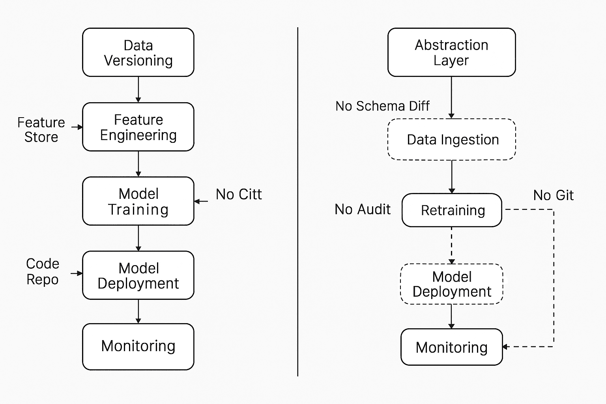
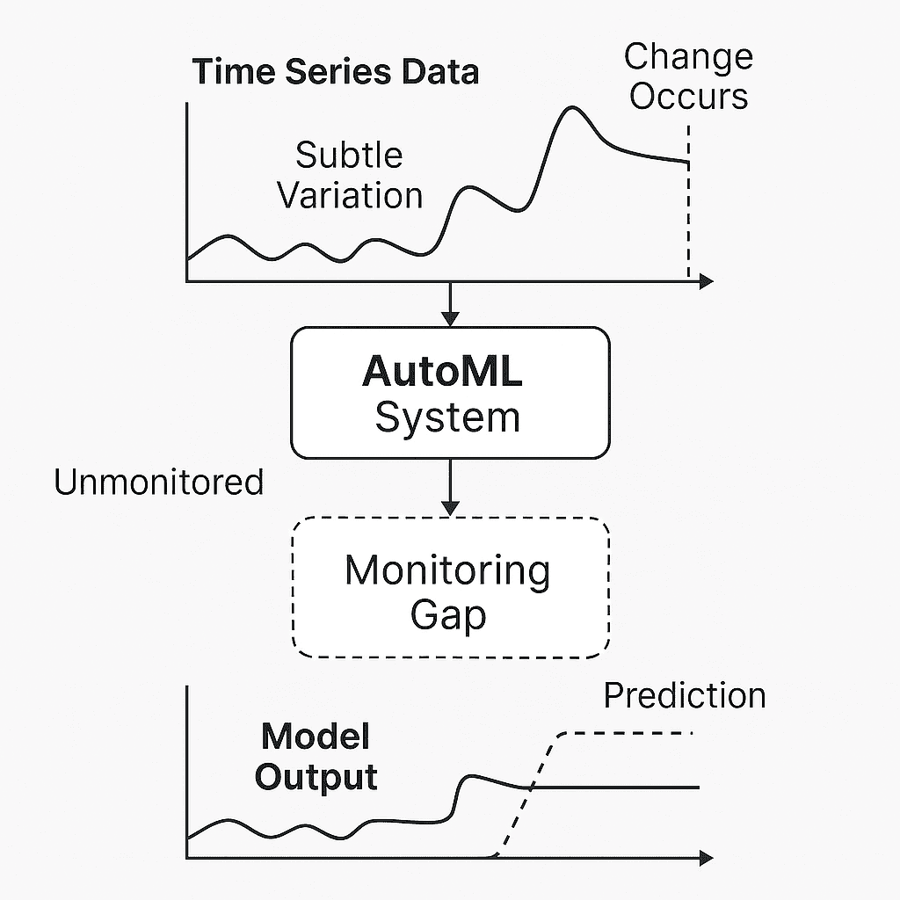

# AutoML 的阴影面：当无代码工具弊大于利

> 原文：[`towardsdatascience.com/the-shadow-side-of-automl-when-no-code-tools-hurt-more-than-help/`](https://towardsdatascience.com/the-shadow-side-of-automl-when-no-code-tools-hurt-more-than-help/)

<mdspan datatext="el1746663112247" class="mdspan-comment">AutoML</mdspan>已成为许多组织进入机器学习的入门级药物。它承诺了压力下的团队希望听到的确切内容：你提供数据，我们将处理建模。无需管理管道，无需调整超参数，无需学习 scikit-learn 或 TensorFlow；只需点击、拖放即可部署。

最初，这感觉令人难以置信。

你将其指向一个客户流失数据集，运行一个训练循环，然后它会输出一个包含 AUC 分数的模型排行榜，这些分数看起来好得令人难以置信。你将排名最高的模型部署到生产环境中，连接一些 API，并设置为每周重新训练。业务团队很高兴。没有人需要编写一行代码。

然后某种微妙的东西开始出现问题。

支持工单不再得到正确的优先处理。一个欺诈模型开始忽略高风险交易。或者你的客户流失模型将忠诚活跃的客户标记为需要接触，而忽略了即将离开的客户。当你寻找根本原因时，你会发现没有 Git 提交、数据模式差异或审计跟踪。只有一个曾经工作但现在不再工作的黑盒。

这不是一个建模问题。这是一个系统设计问题。

AutoML 工具消除了摩擦，但同时也消除了可见性。在这样做的同时，它们暴露了传统 ML 工作流程旨在缓解的架构风险：无声漂移、未跟踪的数据变化和隐藏在无代码界面背后的故障点。而且与 Jupyter 笔记本中的错误不同，这些问题不会崩溃。它们会逐渐侵蚀。

本文探讨了在没有使机器学习能够在大规模上可持续的安全保障的情况下使用 AutoML 管道时会发生什么。使机器学习更容易不意味着放弃控制，尤其是当错误成本不仅仅是技术性的，而是组织性的。

## 架构 AutoML 构建的：为什么这是一个问题

当前的 AutoML 不仅构建模型，还创建管道，即从数据摄入到特征选择、验证、部署，甚至持续学习的整个过程。问题不在于这些步骤是自动化的；我们不再看到它们了。

在传统的 ML 管道中，数据科学家会故意决定使用哪些数据源，预处理中应该做什么，哪些转换应该记录，以及如何版本化特征。这些决策是可见的，因此是可调试的。

尤其是具有视觉 UI 或专有 DSL 的 autoML 系统，往往会在不透明的 DAG 中隐藏这些决策，使得它们难以审计或逆向工程。隐式更改数据源、重新训练计划或特征编码可能会在没有 Git 差异、PR 审查或 CI/CD 管道的情况下触发。

这导致了两个系统性问题：

+   **行为上的微妙变化**：直到下游影响累积起来，没有人会注意到。

+   **调试无可见性**：当出现故障时，没有配置差异，没有版本化的管道，也没有可追踪的原因。

在企业环境中，可审计性和可追溯性是不可或缺的，这不仅仅是一个麻烦，而是一种责任。

**AutoML 与手动 ML 管道对比**（图片由作者提供）****

## 无代码管道破坏 MLOps 原则

大多数当前的 ML 生产实践遵循 MLOps 最佳实践，如版本控制、可重复性、验证门、环境分离和回滚能力。AutoML 平台通常绕过这些原则。

在我审查的金融行业企业 AutoML 试验中，团队使用一个通过 UI 定义的完全自动化的重新训练管道创建了一个欺诈检测模型。重新训练的频率是每天。系统摄取、训练和部署了特征模式和元数据，但在运行之间没有记录模式。

三周后，上游数据的模式略有变化（引入了两个新的商家类别）。嵌入被默默地吸收到 AutoML 系统中并重新计算。欺诈模型的精确度下降了 12%，但由于准确度仍在容差范围内，因此没有触发警报。

由于模型或特征的版本没有明确记录，没有回滚机制。他们无法重新运行失败的版本，因为确切的训练数据集已被覆盖。

这不是建模错误，而是基础设施违规。

## 当 AutoML 鼓励追求分数而非验证时

AutoML 更危险的一个特征是它以牺牲推理为代价鼓励实验。数据处理和度量方法被抽象化，将用户，尤其是非专家用户，与模型工作的原因隔离开来。

在一个电子商务案例中，分析师使用 AutoML 生成流失模型，而没有手动验证，在他们的流失预测项目中创建了数十个模型。平台显示了一个排行榜，每个模型的 AUC 分数。模型立即被导出并部署到表现最好的模型，而没有手动检查，特征相关性审查或敌对测试。

该模型在测试阶段表现良好，但基于预测的客户保留活动开始出现问题。两周后，分析显示该模型使用了一个来自客户满意度调查的特征，这与客户无关。这个特征只在客户已经流失之后才存在。简而言之，它是在预测过去而不是未来。

该模型来自 AutoML，没有上下文、警告或因果检查。在没有验证阀门的流程中，鼓励了高分选择，而不是假设测试。其中一些失败并非边缘案例。当实验与批判性思维脱节时，这些就是默认设置。

## 监控你没有构建的内容

不良集成的 AutoML 系统的最终和最严重的缺点在于可观察性。

通常情况下，定制的机器学习管道伴随着覆盖输入分布、模型延迟、响应置信度和特征漂移的监控层。然而，许多 AutoML 平台在管道的末端放弃模型部署，但在生命周期的开始时却没有。

当我咨询的一个工业传感器分析应用的固件更新改变了采样间隔时，一个 AutoML 构建的时间序列模型开始出错。分析系统没有在模型上设置真正的实时监控钩子。

由于 AutoML 供应商将模型容器化，团队无法访问日志、权重或内部诊断。

我们无法承担透明的模型行为，因为模型在医疗保健、自动化和欺诈预防中提供了越来越关键的功能。这不能假设，而必须设计。

**AutoML 系统中的监控差距**（作者图片）****

## AutoML 的优势：何时何地适用

然而，AutoML 并非固有的缺陷。当范围和治理得当，它可以有效。

AutoML 可以加速在基准测试、首次原型设计或内部分析工作流程等受控环境中的迭代。团队可以快速且低成本地测试一个想法的可行性或比较算法基线，使 AutoML 成为一个低风险起点。

像 MLJAR、H2O Driverless AI 和 Ludwig 这样的平台现在支持与 CI/CD 工作流程的集成、自定义指标和可解释性模块。它们是 MLOps 感知 AutoML 的演变，依赖于团队纪律，而不是工具默认设置。

AutoML 必须被视为一个组件而不是一个解决方案。管道仍然需要版本控制，数据必须经过验证，模型仍然需要监控，工作流程必须设计成具有长期可靠性。

## 结论

AutoML 工具承诺简单性，并且对于许多工作流程，它们确实做到了。但这种简单性通常是以可见性、可重复性和架构稳健性为代价的。即使它很快，机器学习也不能在生产中的可靠性上成为一个黑盒。

AutoML 的阴影面不是它产生了糟糕的模型。它创建了缺乏责任、默默重新训练、记录不良、不可重复和未监控的系统。

下一代机器学习系统必须协调速度与控制。这意味着 AutoML 不应被视为一个一键式解决方案，而应被视为人类治理架构中的一个强大组件。
