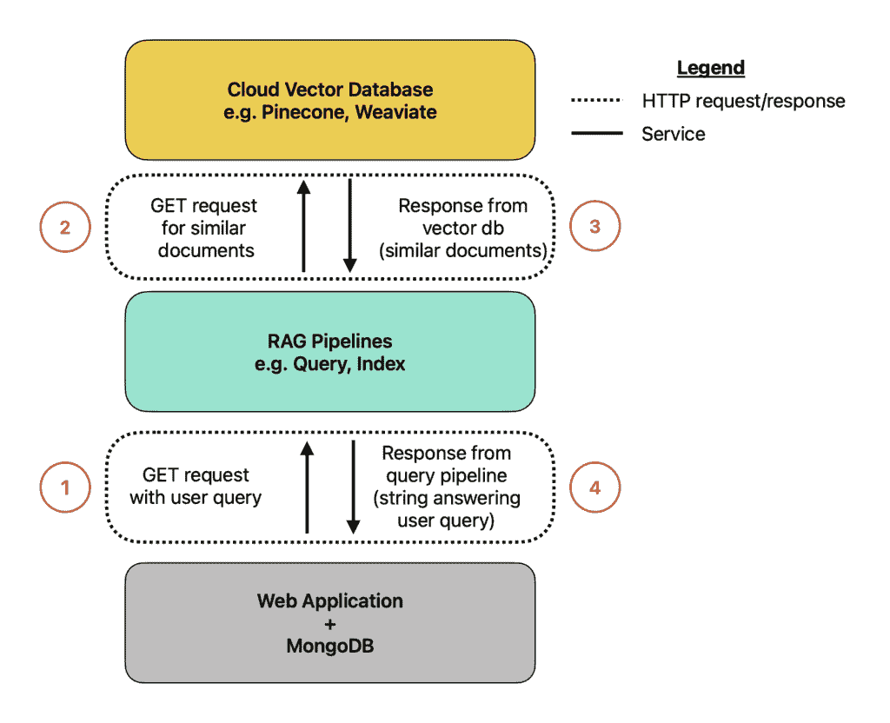
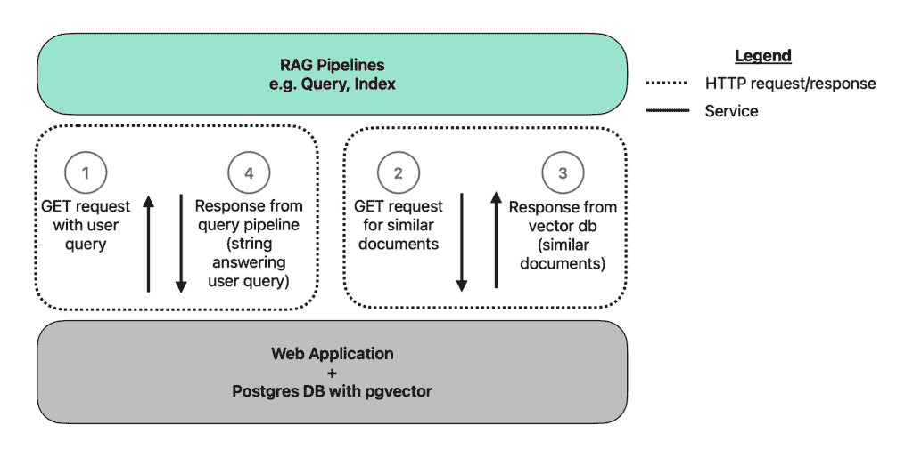
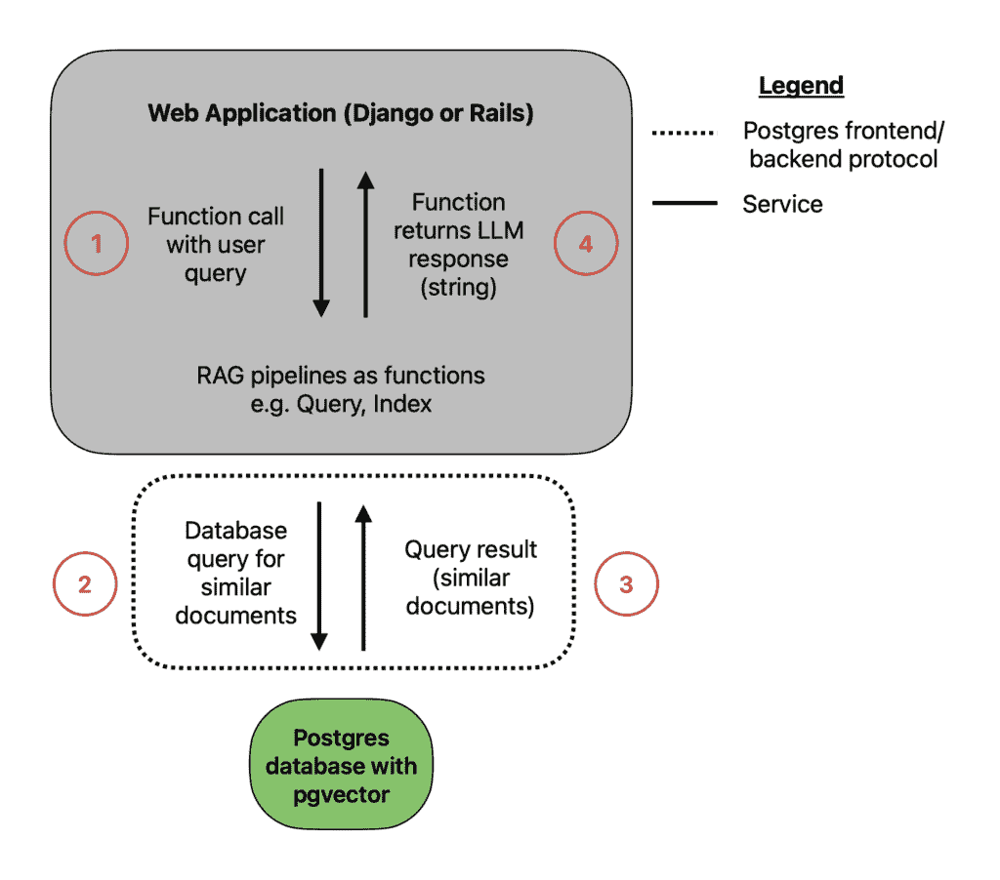
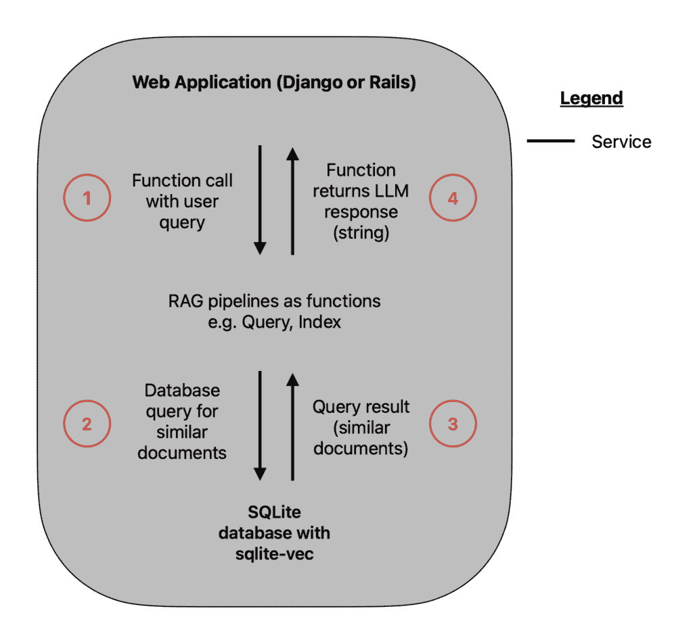

# 最简单的 AI Web 应用

> 原文：[`towardsdatascience.com/the-simplest-possible-ai-web-app/`](https://towardsdatascience.com/the-simplest-possible-ai-web-app/)

*📙 <mdspan datatext="el1748538331624" class="mdspan-comment">这是关于使用生成式 AI 集成创建 Web 应用的系列文章的最后一篇。</mdspan> 第一部分重点讨论了 AI 堆栈以及为什么应用层是堆栈中最佳的位置。您可以在这里*[*查看*](https://losangelesaiapps.com/layers-of-the-ai-stack-explained-simply/)*。第二部分重点介绍了为什么 Ruby 是构建 AI MVP 的最佳 Web 语言。您可以在这里*[*查看*](https://losangelesaiapps.com/building-ai-applications-in-ruby/)*。我强烈建议您在阅读这篇文章之前阅读这两部分，以便了解这里使用的术语。*

## 目录

+   介绍

+   第 1 级：复杂到极致

+   第 2 级：放弃云服务

+   第 3 级：微服务再见！

+   第 4 级：SQLite 加入聊天

+   摘要

* * *

## 介绍

在这篇文章中，我们将进行一个有趣的思维实验。我们试图回答以下问题：

> 我们可以将具有 AI 集成的 Web 应用简化到什么程度？

我的读者会知道我非常重视**简单性**。[`towardsdatascience.com/sqlite-in-production-dreams-becoming-reality-94557bec095b/`](https://towardsdatascience.com/sqlite-in-production-dreams-becoming-reality-94557bec095b/)。简单的 Web 应用更容易理解，更快构建，并且更容易维护。当然，随着应用规模的扩大，复杂性出于必要性而产生。但您始终希望从简单开始。

我们将分析一个典型的具有 AI 集成（RAG）的 Web 应用案例研究，并查看四种不同的实现方式。我们将从由最流行的工具组成的最为复杂的设置开始，逐步简化，直到我们得到最简单的设置。

我们为什么要这样做？

我希望激励开发者更加简单地思考。很多时候，构建 Web 应用或集成 AI 的“主流”途径对于具体用例来说过于复杂。开发者从像谷歌或苹果这样的公司中汲取灵感，却未意识到对他们适用的工具往往不适合在更小规模上工作的客户。

喝杯咖啡或茶，让我们深入探讨。

## 第 1 级：复杂到极致

假设客户要求你为他们构建一个 RAG 应用。这个应用将有一个页面，用户可以上传他们的文档，还有一个页面，他们可以使用 RAG 与他们的文档进行聊天。遵循目前最流行的 Web 堆栈，你决定使用[**MERN**](https://en.wikipedia.org/wiki/MEAN_(solution_stack))**堆栈**（MongoDB, Express.js, React, 和 Node.js）来构建你的应用。

为了构建处理文档解析、分块、嵌入、检索等操作的 RAG 管道，你再次决定选择最受欢迎的堆栈：[**LangChain**](https://www.langchain.com/)通过**[**FastAPI**](https://fastapi.tiangolo.com/)**部署。Web 应用将调用 FastAPI 中定义的端点。至少需要有两个端点：一个用于调用索引管道，另一个用于调用查询管道。在实践中，你还需要 upsert 和 delete 端点，以确保数据库中的数据与向量存储中的嵌入保持同步。

注意，你将使用 JavaScript 进行 Web 应用开发，并使用 Python 进行 AI 集成。这个双语言应用意味着你很可能会使用**微服务架构**（参见本系列的第二部分[part 2](https://losangelesaiapps.com/building-ai-applications-in-ruby/)了解更多关于这一点）。这不是一个严格的要求，但在这种设置中通常会被鼓励。

还有一个选择需要做出：你将使用哪个向量数据库？向量数据库是存储由索引管道创建的文档块的地方。让我们再次选择最受欢迎的选择：[**Pinecone**](https://www.pinecone.io/)。这是一个由许多 AI 开发者目前使用的托管云向量数据库。

整个系统可能看起来像以下这样：



一个传统的 RAG 应用。图片由作者提供。

哎呀！这里有很多移动部件。让我们分而治之：

+   在底部矩形中，我们有 Web 应用和 MongoDB 后端。在中间，我们有使用 LangChain 和 FastAPI 构建的 RAG 管道。在顶部，我们有 Pinecone 向量数据库。这里的每个矩形代表一个不同的服务，它们有自己独立的部署。虽然 Pinecone 云向量数据库将得到管理，但其余的将由你负责。

+   我已经用点划线将示例 HTTP 请求及其对应的响应包裹起来。记住，这是一个微服务架构，这意味着在服务间通信发生时将需要 HTTP 请求。为了简化，我只展示了查询管道调用可能的样子，并省略了对 OpenAI、Anthropic 等的调用。为了清晰起见，我按照它们在查询场景中发生的顺序对请求/响应进行了编号。

+   为了说明一个痛点，确保你的 MongoDB 数据库中的文档与其在 Pinecone 索引中的对应嵌入同步是可行的，但可能会有些棘手。这需要多个 HTTP 请求才能从你的 MongoDB 数据库到云向量数据库。这是开发者的复杂性和开销的一个点。

一个简单的类比：这就像试图保持你的物理书架与数字书目录同步。每次你得到一本新书或从你的书架上捐赠一本书（结果你只喜欢《权力的游戏》电视剧，而不是书），你都必须手动更新目录以反映这一变化。在这个书籍的世界里，一个小差异可能不会真正影响你，但在 Web 应用程序的世界里，这可能会成为一个大问题。

## 第二级：放弃云服务

我们能否使这个架构更简单？也许你最近读过一篇文章，讨论了 Postgres 有一个名为[pgvector](https://github.com/pgvector/pgvector)的扩展。这意味着你可以放弃 Pinecone，只使用 Postgres 作为你的向量数据库。理想情况下，你可以将数据从 MongoDB 迁移过来，这样你就可以只使用一个数据库。太好了！你重构了你的应用程序，使其现在看起来如下：



一个简化的 RAG 应用。图片由作者提供。

现在我们只需要担心两个服务：Web 应用程序和数据库以及 RAG 管道。再次强调，任何对模型提供者的调用都已省略。

我们通过这种简化获得了什么？现在，你的**嵌入和相关的文档或块可以生活在同一个数据库中的同一张表中**。例如，你可以在 PostgreSQL 中的一个表中添加一个嵌入列，通过以下操作实现：

```py
ALTER TABLE documents
  ADD COLUMN embedding vector(1536);
```

在文档和嵌入之间保持一致性现在应该要简单得多。Postgres 的`ON INSERT/UPDATE`触发器让你可以在原地计算嵌入，完全消除两阶段的*“先写文档再嵌入”*的过程。

回到书架的类比，这就像放弃数字目录，直接在每个书上贴标签。现在，当你移动一本书或扔掉一本书时，由于标签会随着书一起移动，所以不需要更新单独的系统。

## 第三级：微服务再见！

你已经很好地简化了事情。然而，你认为你可以做得更好。也许你可以创建一个**单体应用**，而不是使用微服务架构。单体只是意味着你的应用程序和你的 RAG 管道是开发和部署在一起的。然而，出现了一个问题。你用 JavaScript 和 MERN 栈编写了 Web 应用程序。但 RAG 管道是用 Python 构建的，并通过 FastAPI 部署。也许你可以尝试将这些挤入一个容器中，使用类似[Supervisor](https://supervisord.org/)的东西来监督 Python 和 JavaScript 进程，但这并不是多语言栈的自然选择。

所以你决定放弃 React/Node，转而使用 Django，一个 Python Web 框架来开发你的应用。现在，你的 RAG 管道代码可以只存在于你的 Django 应用中的一个实用模块中。这意味着不再需要 HTTP 请求，这消除了复杂性和延迟。任何时候你想运行你的查询或索引管道，你只需要进行一次函数调用。启动开发环境和部署现在变得轻而易举。当然，如果你读了第二部分，我们的偏好是不使用全 Python 栈，而是选择一个[全 Ruby 栈](https://losangelesaiapps.com/building-ai-applications-in-ruby/)。

你进一步简化了，现在有以下架构：



更简单的 RAG 架构。图片由作者提供。

重要提示：在早期的图中，我将 Web 应用和数据库合并为单个服务，为了简化。现在我认为重要的是要表明，它们实际上确实是独立的服务！这并不意味着你仍在使用微服务架构。只要这两个服务一起开发和部署，这仍然是一个单体。

哇！现在你只需要一个部署来启动和维护。你可以将数据库设置为你的 Web 应用的附加组件。遗憾的是，这意味着你仍然可能想要使用[Docker Compose](https://docs.docker.com/compose/)来一起开发和部署你的数据库和 Web 应用服务。但现在，随着管道现在只是作为函数而不是独立服务运行，你现在可以放弃 FastAPI 了！你将不再需要维护这些端点；只需使用函数调用。

一点技术细节：在这个图表中，图例表明虚线*不是*HTTP，而是[Postgres 前端/后端协议](https://www.postgresql.org/docs/current/protocol.html)。这是两个不同的协议，它们位于[互联网协议模型](https://en.wikipedia.org/wiki/Internet_protocol_suite)的应用层。这不同于我在[第一部分](https://losangelesaiapps.com/layers-of-the-ai-stack-explained-simply/)中讨论的应用层。理论上，使用 HTTP 连接在应用程序和数据库之间传输数据是可能的，但不是最优的。相反，Postgres 的创建者创建了自己的协议，这个协议简洁且紧密地与数据库的需求相结合。

## 第四级：SQLite 加入对话

*“我们难道不是已经简化完毕了吗？”*，你可能自己问自己。

错误！

我们还可以进行一项简化。与其使用 Postgres，我们可以使用 SQLite！你看，目前你的应用程序和数据库是两个独立的服务一起部署的。但假如它们不是两个不同的服务，而是你的数据库只是存在于应用程序中的一个文件呢？这正是 SQLite 能为你提供的。随着最近发布的[`sqlite-vec`](https://losangelesaiapps.com/retrieval-augmented-generation-in-sqlite/)库，它甚至可以处理 RAG，就像`pgvector`在 Postgres 中工作一样。这里的限制是`sqlite-vec`是预 v1 版本，但对于早期 MVP 来说这仍然很棒。



最简单的可能架构。图片由作者提供。

真正令人惊叹。你现在可以放弃 Docker Compose 了！这确实是一个单一服务 Web 应用程序。LangChain 模块和你的数据库现在都只是存放在你的仓库中的函数和文件。

担心在生产 Web 应用程序中使用 SQLite？我最近[写了关于这个话题的文章](https://towardsdatascience.com/sqlite-in-production-dreams-becoming-reality-94557bec095b/)，讲述了 SQLite，曾经只是 Web 应用世界中的玩具，通过一些配置调整后，可以成为生产就绪的。事实上，Ruby on Rails 8 最近将这些调整作为默认设置，现在正将 SQLite 作为[新应用程序的默认数据库](https://blog.appsignal.com/2024/10/07/whats-new-in-ruby-on-rails-8.html#sqlite-is-ready-for-production)。当然，随着应用程序的扩展，你可能会需要迁移到 Postgres 或其他数据库，但请记住我一开始提到的箴言：*只有在绝对必要时才引入复杂性*。在你只是试图获取第一批用户时，不要假设你的应用程序会因为数百万个并发写入而爆炸。

## 摘要

在这篇文章中，我们从传统的用于构建具有 AI 集成的 Web 应用程序的堆栈开始。我们看到了涉及的复杂性，并决定一点一点地简化，直到我们达到了简单应用程序的柏拉图理想。

但不要被简单性所迷惑；应用程序仍然是一个巨兽。事实上，由于简单性，它可以比传统应用程序运行得更快。如果你注意到应用程序开始变慢，我会在考虑迁移到新数据库或拆分单体之前先尝试调整服务器大小。

在这样的轻量级应用程序中，你才能真正地快速行动。本地开发是一个梦想，添加新功能可以以闪电般的速度完成。你仍然可以使用类似[Litestream](https://litestream.io/)的工具来备份你的 SQLite 数据库。一旦你的应用程序显示出真正的压力迹象，那么就可以提高复杂度级别。但我建议不要从第 1 级开始一个新的应用程序。

我希望你喜欢这个关于构建具有 AI 集成的 Web 应用程序系列的系列文章。我希望我激励了你去思考简单，而不是复杂！

🔥* 如果您想要一个集成了生成式人工智能的定制网络应用程序，请访问*[*losangelesaiapps.com*](https://losangelesaiapps.com/)*
