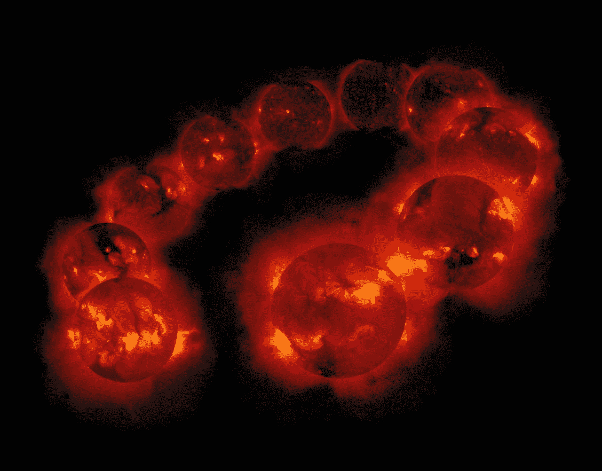
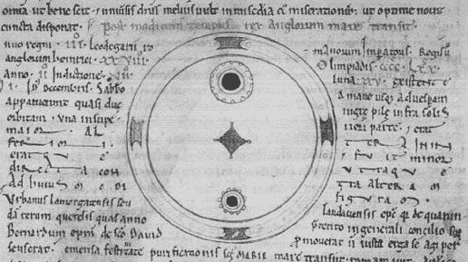
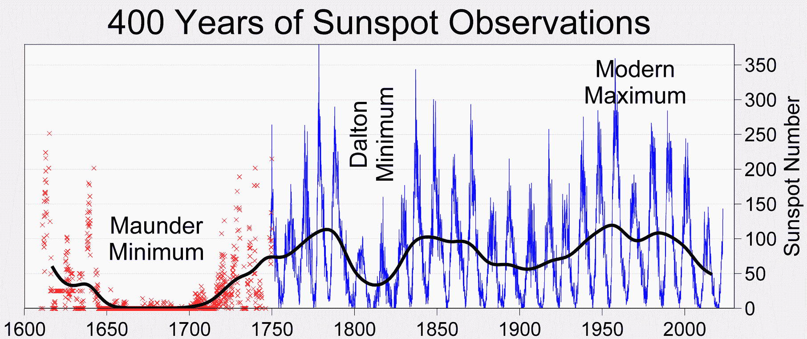
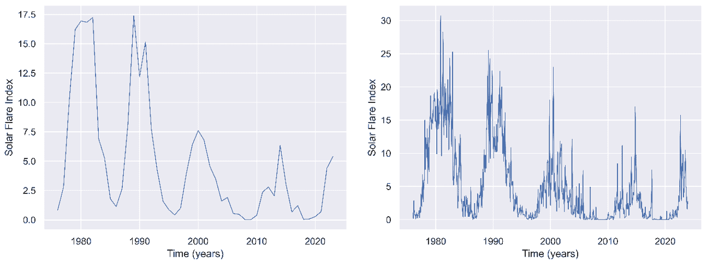
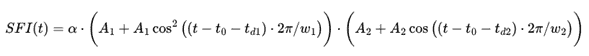

# 太阳周期（s）：历史、数据分析与趋势预测。

> 原文：[`towardsdatascience.com/the-solar-cycle-s-history-data-analysis-and-trend-forecasting-644bf33b7ed7/`](https://towardsdatascience.com/the-solar-cycle-s-history-data-analysis-and-trend-forecasting-644bf33b7ed7/)

你可能在你的一生中某个时刻听说过 11 年太阳周期以及太阳的最大值和最小值——每 11 年，太阳活动达到顶峰，两极出现更多的极光，电子设备受到更多的干扰。这是太阳风暴也出现，太阳黑子也出现的时期。

嗯，正如物理学中通常的情况一样，事情并不那么简单。

太阳周期：十年 Yohkoh SXT 图像的拼贴，展示了太阳周期内太阳活动的变化，从 1991 年 8 月 30 日之后到 2001 年 9 月 6 日。版权：ISAS（日本）和 NASA（美国）的 Yohkoh 任务。图像根据 CC0 1.0 许可，专属于公共领域（来源）。

当谈到太空时，太阳周期（以及一般而言，自然界中的季节性和模式）一直是我的一大兴趣所在。它的行为远非我们可能听说过的简单 11 年周期性：它比那要复杂得多。人们认为存在多个结合周期，其中一些跨越了几个世纪甚至几个千年。当然，这类观察和建模仅使用间接信息，更多地侧重于描述性方面。要能够生成一个*解释性*模型，科学家需要完全理解我们恒星核心的分布和机制，而这方面还有许多工作要做。与此同时，我们将继续研究这些次级现象，如太阳黑子、SPE、太阳 X 射线活动和紫外线读数，以及收集和分析我们所拥有的数据。

本文旨在涵盖太阳观测的背景和历史，概述当前的方法和模型，对公开可用的（NOAA 的太阳耀斑指数）数据集进行数据分析与模型拟合，并预测未来的趋势。

## 太阳观测的历史

已知的最早日食记录可以追溯到公元前 1223 年，在乌加里特（现在的叙利亚），写在泥板上。从那时起，古巴比伦人似乎一直在记录日食，甚至能够预测它们[1,6]。太阳黑子首次在公元前 800 年被巴比伦人和中国观察到。这些记录是在皇帝的命令下进行的，并记录了一些太阳上的“变暗”或“变暗”的斑点[1,6]。五百年后，希腊学者泰奥弗拉斯托斯也进行了类似的观测[2]。

在中世纪期间，越来越多的观测被记录下来。阿尔德穆斯在公元 807 年认为他看到了水星在太阳前经过，但后来发现那是一个特别大的太阳黑子。他并不是唯一一个，因为在接下来的几年里，还有更多将行星凌日错误归因于行星的事件[3]。关于太阳日冕和太阳耀斑或 CME 的观测分别在公元 968 年和 1185 年发生，都是在日食期间[4,6]。

在现代时期，托马斯·哈里奥特在 1610 年首次用望远镜观察到了太阳黑子，一年后约翰·戈德史密斯证实了他的观测[5,6]。他们都为伽利略·伽利莱铺平了道路，伽利略三年后声称太阳黑子是太阳的表面特征，而不是行星或其他天体[6]。由于我们所知的玛乌 nder 最小值，一个太阳活动低潮期，太阳黑子和 CME 非常少，研究工作因此放缓。

[约翰·伍斯特的编年史中的太阳黑子插图](https://en.wikipedia.org/wiki/Sunspot_drawing)约在 1100 年左右。图像来自公共领域([来源](https://en.wikipedia.org/wiki/Solar_cycle#/media/File:ChroniclesofJohnofWorcester.jpg))。

在 19 世纪初，从太阳开始记录辐射（红外线和紫外线）的读数，太阳光谱学应运而生。塞缪尔·海因里希·施瓦贝是第一个基于太阳黑子活动理论化“十年太阳周期”的人。古斯塔夫·斯波尔认为这个周期大约持续 70 年，试图解释玛乌 nder 最小值。鲁道夫·沃尔夫研究了过去的太阳黑子数据，并试图收集历史记录以供后续研究。后来，独立研究人员发现了这个周期与地球磁场活动之间的联系，这成为了对地球-太阳相互作用的第一项研究。[7]

在 20 世纪，世界各地建立了许多太阳观测站，专门研究太阳的某些领域。此外，还发射了许多卫星和探测器来研究太阳活动。f10.7 指数（10.7 厘米波长的无线电发射）在太阳活动记录中非常有用。其他更现代的间接观察方法包括研究地质（岩石形成、层状和磁化）或树木年轮或冰层中的碳-14 衰变[8]。

从那时起，许多独立的科学家一直在尝试预测太阳活动和“太阳周期”的行为。存在不同的说法，有的说第 25 个周期可能根本不会发生（NSO）[9]，或者它将具有与第 24 个周期相同的强度[10]（NOAA）。

## 最先进的技术

美国国家航空航天局（NASA）的“太空之地”将太阳周期定义为“太阳磁场大约每 11 年经历一次的周期。[…太阳磁场完全翻转。[…（太阳周期）影响太阳表面的活动，如太阳黑子[…]" [11]。在文本的后面，又强调了这一 11 年周期的“近似”。那为什么会这样呢？

> 大约每 11 年，太阳的磁场会完全翻转——北极变为南极，反之亦然——导致恒星表面的活动增加，如太阳风暴和日冕物质抛射。

最新的研究[12]确定，太阳周期长度至少在 7 亿年内保持不变：每次翻转大约为 10.62-11 年。尽管如此，这个周期中许多因素对我们来说仍然是未知的：例如，2009 年的一项研究揭示了 18 世纪发生了一个非常短的周期（不到 8 年），完全颠覆了之前统治的稳定性和可预测性感觉[13]。仅仅概述历史记录，就可以看出这个周期远非恒定。

由[罗伯特·A·罗德](https://en.wikipedia.org/wiki/User:Dragons_flight)（全球变暖艺术项目的一部分）绘制的显示历史太阳黑子记录的图表。图像属于公共领域，根据 CC BY-SA 3.0 许可([来源](https://en.wikipedia.org/wiki/Solar_cycle#/media/File:Sunspot_Numbers.png))。

已经提出了许多效应和调节模式的理论，试图描述所有这些不规则性。总结如下：

+   **瓦尔德迈尔效应**：该术语得名于马克斯·瓦尔德迈尔，他观察到周期最大振幅和最小值与最大值之间的时间成反比。因此，更加“激进”和“暴力”的周期也发生得更快 [14]。

+   **格莱斯伯格周期**：它描述了一个更广、更慢的 70-100 年周期（因此每七到八个周期），调节 11 年周期的活动。这与碳-14 数据有很好的相关性，碳-14 用于那些没有定期、系统的人类观察的时间段[8]。

+   **苏斯-德弗里斯周期**：这个总周期仅在放射性碳替代品中观察到（不是通过直接观察太阳现象），周期约为 210 年。尽管如此，由于我们只有 400 年的太阳黑子记录，因此还没有足够显著的相关性来验证它[8]。

而这里才是事情变得有趣的地方。可能存在更大、更长的周期，但记录数量不足以确认或否认它们的存在。此外，这些效应的组成和调制，层层叠加，使得描述和模拟太阳周期变得极其复杂。

## 数据分析：NOAA 数据库

对于本节，我们将使用来自国家环境信息中心（原国家海洋和大气管理局）的太阳耀斑指数数据。存储库链接、数据文件夹以及所有文件均可在附件 I 中找到。作为快速旁注，我不建议直接使用此数据目录，因为其状态远低于标准。我已经在我的 GitHub 存储库中整理并正确格式化了数据集，以及上传了所有源代码和数据。更多详细信息请见附件 I。

本研究中使用的耀斑指数数据由土耳其伊斯坦布尔的博加齐大学 Kandilli 天文台的 T. Atac 和 A. Ozguc 计算。他们在记录这些无价信息方面做了惊人的工作，如果不是他们，这些类型的数据分析和预测是无法进行的。

太阳耀斑指数（SFI）是一个包含来自多个太阳和大气读数信息的度量，例如 F10.7 指数、H-alpha 耀斑重要性、200MHz 通量以及突然的离子层扰动等。它是一个优秀的太阳活动指标。

我们将首先展示每日、每月和每年的数据。这些平均值将使我们能够看到太阳周期的不可预测性，但同时也显示出其周期性。

1976–2023 年期间的年度和月度太阳耀斑指数。原始数据由 Kandili 天文台提供，处理和图表由我生成（Python, Seaborn 和 Matplotlib）。图片由 Pau Blasco i Roca 提供。

这里是可用数据的全分辨率可视化：每日 SFI 记录。我还绘制了月度数据，橙色表示，以及加减一个标准差范围（65%置信区间），绿色（上）和红色（下），每月计算方差。这仅显示了这些高能峰值是多么不可预测。

1976-2023 年期间的日和月太阳耀斑指数。原始数据由 Kandili 天文台提供，处理和图表由我生成（Python，Seaborn 和 Matplotlib）。

只需概述这些图表，我们就可以看到前几节中描述的不确定性。虽然月度平均值从未超过 SFI 值 30-32，但日值可以达到 160s，超过五倍。这些高能事件通常重复或翻倍上+1 个标准差界限，很好地说明了它们是多么难以预测。

## 预测周期 25 和 26。时间序列预测。

现在，没有一些预测和预测的时间序列数据分析将是不完整的。我们将使用两种方法：SARIMA 模型和复合正弦数学模型。

SARIMA 模型由自回归模型、移动平均模型、微分和季节性共同组成。使用 SARIMA 而不是 ARMA-ARIMA 模型至关重要，因为（见附件 II）不考虑季节性的模型很可能无法正确地表示周期性行为（如太阳周期）。

我们选择 p=d=q=1，P=D=Q=1，s=12*11 作为初始猜测。AR 和 MA 值对于时间序列预测来说是标准的，季节性因素设置为 12*11（132 个月，或十一年），因为我们将会按月预测值。我们还决定微分一次，希望专注于月份之间的变化而不是每月的实际 SFI 值。在 576 个观测值上训练得到的模型，对数似然值为-1223.6，并现实地预测了未来几年的活动。

SARIMA 模型的预测，由我生成（Python，Seaborn，Matplotlib，Numpy 和 Statsmodels）。图像由 Pau Blasco i Roca 提供。

我们看到与 NOAA 的声明[10]相似的预测，即周期 25 将与周期 24 非常相似。模型还大胆地预测了一些峰值，将 C25 描绘为双峰周期。周期 26 的预测似乎足够保守，2027-2033 年左右有一个宽的最低值。

现在，我们也决定构建一个数学模型，利用正弦波组合。我们决定为 11 年周期和 Gleissberg 的 70-100 年周期设置参数，我们将它们设置为 8 个周期（88 年）。结果虽然没有显示出任何峰值，但令人满意，并且可以很好地模拟未来几年的年化 SFI 值。

数学模型预测，绘制在观测到的月度数据之上，12 个月的移动平均窗口，以及 SARIMA 的预测。由我生成（使用 Python、Seaborn、Matplotlib、Numpy 和 Statsmodels）。

此模型预测第 26 个周期略有上升，第 25 个周期较为平静。它也与 NOAA 的[10]意见一致，但更多地倾向于 NSO 的预测。生成此模型非常有趣，因为通过简单的正弦波乘积，我们能够感知到峰值出现时间的一些影响。Gleissberg 周期的调制使一些峰值略微向前和向后移动，这可能是解释过去经历的一些缩短或延长的周期的一种方式。其方程如下：

来自数学模型的方程。图像由 Pau Blasco i Roca 使用 LaTeX 制作。

虽然函数完全没有简化，但我这样写是为了能够展示大多数参数以及它们之间的相互作用。其核心是一个余弦函数的乘积，左边的（平方的）对应于较小的周期，另一个对应于 Gleissberg 的周期，它位于水平轴之上（SFI 值不能为负）。

## 结论

我认为我们甚至可以简要地涵盖关于太阳周期的大部分历史和当前的研究方向。在这篇文章中，我们也花时间自己探索数据，进行调查，并对未来几十年太阳活动进行了一些预测。

研究 SF 指数的变化性和不可预测性非常迷人，能够按不同的时间尺度分组表示数据使我们既能理解潜在趋势，也能快速变化的现象。

不幸的是，数据集的状态非常糟糕。数据本身，由 NOAA 和 Kandilli Observatory 提供，非常宝贵，并且提供了极端详细和精确的信息。尽管如此，它以如此低标准的形式和格式提供是令人遗憾的。幸运的是，这并没有阻止我们进行研究，我们能够为未来的用户提供一个干净的数据集，以便他们在研究中使用。

我们能够使用几个时间序列模型做出一些预测。ARMA 模型未能成功（见附件 II），但 SARIMA 模型产生了令人兴奋的结果，与该领域的知名机构达成一致。我们还成功理论化了一个数学模型来表示周期长期波动。

如我们在文章开头提到的，这些预测和模型基于间接测量，并没有实际描述太阳核心和磁场的内部运动。为了能够有信心地做出预测，我们需要数学建模来描述恒星核以及光晕中的流体相互作用，这至今仍然非常复杂。

## 参考文献

[1] 高海拔天文台（NCAR）教育网页 [`web.archive.org/web/20140818180023/http://www.hao.ucar.edu/education/TimelineA.php`](https://web.archive.org/web/20140818180023/http:/www.hao.ucar.edu/education/TimelineA.php)

[2] 英国天文学会（SAO-NASA-ADS），关于塞奥弗拉斯托斯观测的信件 [`adsabs.harvard.edu/full/2007JBAA..117..346V`](https://adsabs.harvard.edu/full/2007JBAA..117..346V)

[3] *威尔逊 ER (1917). "一些哥白尼之前的天文学家". 天文爱好者. **25**: 88.*

[4] 高海拔天文台（NCAR）教育网页 [`web.archive.org/web/20140818180026/http://www.hao.ucar.edu/education/TimelineB.php`](https://web.archive.org/web/20140818180026/http:/www.hao.ucar.edu/education/TimelineB.php)

[5] 托马斯·哈里奥特观测的太阳黑子位置和面积，施普林格自然出版社 [`link.springer.com/article/10.1007/s11207-020-01604-4`](https://link.springer.com/article/10.1007/s11207-020-01604-4)

[6] 高海拔天文台（NCAR），太阳物理学史上的重大时刻 [`web.archive.org/web/20060301083022/http://web.hao.ucar.edu/public/education/sp/great_moments.html`](https://web.archive.org/web/20060301083022/http:/web.hao.ucar.edu/public/education/sp/great_moments.html)

[7] 高海拔天文台（NCAR）教育网页 [`web.archive.org/web/20140818180035/http://www.hao.ucar.edu/education/TimelineD.php`](https://web.archive.org/web/20140818180035/http:/www.hao.ucar.edu/education/TimelineD.php)

[8] 太阳周期，大卫·H·哈索韦，施普林格自然出版社. [`link.springer.com/article/10.12942/lrsp-2010-1`](https://link.springer.com/article/10.12942/lrsp-2010-1)

[9] 关于即将到来的太阳活动减少的 NSO 评论。 [`web.archive.org/web/20150802025816/http://www.boulder.swri.edu/~deforest/SPD-sunspot-release/SPD_solar_cycle_release.txt`](https://web.archive.org/web/20150802025816/http:/www.boulder.swri.edu/~deforest/SPD-sunspot-release/SPD_solar_cycle_release.txt)

[10] 美国国家海洋和大气管理局（NOAA）对第 25 个太阳周期的初步预测，2019 年。 [`www.swpc.noaa.gov/news/solar-cycle-25-preliminary-forecast`](https://www.swpc.noaa.gov/news/solar-cycle-25-preliminary-forecast)

[11] 美国宇航局“太空之地”教育页面 [`spaceplace.nasa.gov/solar-cycles/en/`](https://spaceplace.nasa.gov/solar-cycles/en/)

[12] 新科学家杂志文章，作者迈克尔·马歇尔 [`www.newscientist.com/article/2176487-rock-layers-show-our-sun-has-been-in-same-cycle-for-700-million-years/`](https://www.newscientist.com/article/2176487-rock-layers-show-our-sun-has-been-in-same-cycle-for-700-million-years/)

[13] 由 Usoskin 等人撰写的 Arxiv 天体物理学文章，丢失周期 [`arxiv.org/abs/0907.0063`](https://arxiv.org/abs/0907.0063)

[14] 中国天文学会《天体物理学学报》，"太阳周期振幅与周期之间的关系" [`iopscience.iop.org/article/10.1088/1009-9271/6/4/12`](https://iopscience.iop.org/article/10.1088/1009-9271/6/4/12)

## 附录 I

对耀斑指数数据集（NOAA）、卡迪利观测站的现状的简要评论。

数据集的状态不尽人意。导航起来既困难又痛苦缓慢（考虑过编程和使用网络爬虫，但最终手动下载了 1976 年至 2023 年的文件，耗时约一小时）。格式极其不一致。在我的仓库中，我更详细地分析了这些问题。

我想指出，能够访问这样宝贵的数据对于研究来说非常有帮助，而且我绝对没有试图忽视或贬低卡迪利观测站和博阿齐齐大学的成果。尽管如此，我认为如此精确且重要的数据因为维护不善而变得难以利用，这确实是一件令人遗憾的事情。

在这个仓库中，我分享了一个能够清理和重新格式化数据的 Python 脚本。请随意使用或根据需要调整它。

### 包含代码和清洁数据集的 GitHub 仓库

[A1] [`github.com/Nerocraft4/SolarCycleStudySFI`](https://github.com/Nerocraft4/SolarCycleStudySFI)

### 数据集参考文献

[A2] 数据集来源：[`www.ngdc.noaa.gov/stp/space-weather/solar-data/solar-features/solar-flares/index/flare-index/`](https://www.ngdc.noaa.gov/stp/space-weather/solar-data/solar-features/solar-flares/index/flare-index/)

[A3] 数据集文档和许可：[`www.ngdc.noaa.gov/stp/space-weather/solar-data/solar-features/solar-flares/index/flare-index/documentation/dataset-discription_flare-index.pdf`](https://www.ngdc.noaa.gov/stp/space-weather/solar-data/solar-features/solar-flares/index/flare-index/documentation/dataset-discription_flare-index.pdf)

[A4] 数据集计算：[`www.ngdc.noaa.gov/stp/space-weather/solar-data/solar-features/solar-flares/index/flare-index/documentation/solar-physics_atac-ozguc.pdf`](https://www.ngdc.noaa.gov/stp/space-weather/solar-data/solar-features/solar-flares/index/flare-index/documentation/solar-physics_atac-ozguc.pdf)

### 对 ARMA 模型的最终评论

在仓库中，添加了扩展的附录 II 来讨论为什么 ARMA/ARIMA 模型在这里不成功。由于篇幅/扩展原因，我没有将其添加到文章中。
