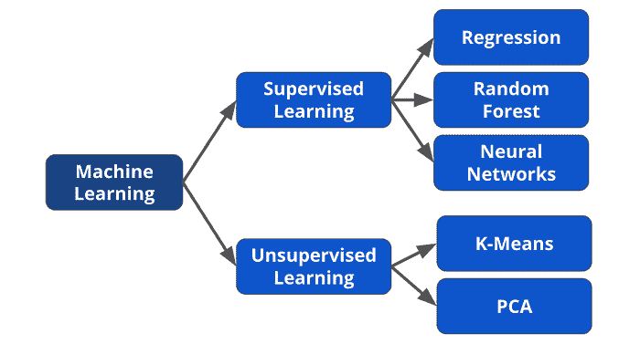

# 初学者终极 AI/ML 路线图

> 原文：[`towardsdatascience.com/the-ultimate-ai-ml-roadmap-for-beginners/`](https://towardsdatascience.com/the-ultimate-ai-ml-roadmap-for-beginners/)

人工智能正在改变企业运营的方式，几乎每家公司都在探索如何利用这项技术。

因此，近年来对 AI 和机器学习技能的需求急剧上升。

在近四年的 AI/ML 经验基础上，我决定创建终极指南，帮助你进入这个快速发展的领域。

### 为什么要在 AI/ML 领域工作？

人工智能和机器学习是目前最受欢迎的技术之一，这并不是秘密。

精通这些领域将为未来的职业道路打开许多机会，更不用说你将站在科学进步的前沿。

坦白说，你将会获得很高的报酬。

根据[**Levels.fyi**](https://www.levels.fyi/t/software-engineer/title/ai-engineer?country=253)，机器学习工程师的平均薪水为 93k 英镑，AI 工程师为 75k 英镑。而数据科学家的薪水为 70k 英镑，软件工程师为 83k 英镑。

请不要误解；这些工作本身就有很高的薪水，但 AI/ML 会给你带来优势，而且这种差异在未来可能会变得更加明显。

你也不需要拥有计算机科学、数学或物理学的博士学位来从事人工智能/机器学习工作。良好的工程和解决问题的技能，以及对于基本机器学习概念的深入了解，就足够了。

大多数工作不是研究工作，而是将 AI/ML 解决方案应用于现实生活中的问题。

例如，我是一名机器学习工程师，但我并不做研究。我的目标是使用算法并将其应用于商业问题，以造福客户，从而造福公司。

下面是使用 AI/ML 的职位：

+   机器学习工程师

+   AI 工程师

+   研究科学家

+   研究工程师

+   数据科学家

+   软件工程师（AI/ML 重点）

+   数据工程师（AI/ML 重点）

+   机器学习平台工程师

+   应用科学家

他们都有不同的要求和技能，所以总会有一些非常适合你的。

如果你想了解更多关于上述角色的信息，我建议阅读我之前的一些文章。

> [机器学习工程师与数据科学家之间的区别](https://towardsdatascience.com/the-difference-between-ml-engineers-and-data-scientists-b64ac19c0f41/)

[**你应该成为数据科学家、数据分析师还是数据工程师？**](https://medium.com/data-science/should-you-become-a-data-scientist-data-analyst-or-data-engineer-a9cd5c529650)

*解释各种数据角色之间的区别和要求*medium.com](https://medium.com/data-science/should-you-become-a-data-scientist-data-analyst-or-data-engineer-a9cd5c529650)

好的，现在让我们进入路线图！

### 数学

我认为，扎实的数学技能对于任何技术专业人士来说可能是最必要的，尤其是如果你正在从事人工智能/机器学习工作。

你需要良好的基础来理解 AI 和 ML 模型在底层是如何工作的。这将帮助你更好地调试它们，并培养出如何与它们一起工作的直觉。

请不要误解；你不需要量子物理学的博士学位，但你应该了解以下三个领域。

+   **线性代数** — 理解矩阵、特征值和向量如何工作，这些在人工智能和机器学习的各个方面都有应用。

+   **微积分**—理解人工智能实际上是如何使用梯度下降和反向传播等算法进行学习，这些算法利用微分和积分。

+   **统计学** — 通过学习概率分布、统计推断和贝叶斯统计来理解机器学习模型的概率性质。

**资源：**

+   [**数据科学中的实用统计学**](https://amzn.to/4l1lFFU) **(联盟链接)** — 一本包含 Python 代码示例的优秀应用书籍。

+   [**机器学习数学**](https://amzn.to/4hxRCmb) **(联盟链接)** — 最佳全面书籍，但内容相当密集。

+   [**线性代数的本质（3Blue1Brown）**](https://www.youtube.com/watch?v=fNk_zzaMoSs) — 优秀的视觉解释

+   [**Brilliant**](https://brilliant.org/) 和 [**Khan Academy**](https://www.khanacademy.org/) — 涵盖所有主题的广泛信息。

这基本上就是你需要的所有东西；如果有什么的话，在某些方面可能有些过度。

**时间表：** 根据背景，这可能需要你几个月的时间来跟上进度。

*我深入分析了数据科学所需的数学，这对于人工智能/机器学习同样适用。*

> [如何学习数据科学所需的数学](https://towardsdatascience.com/how-to-learn-the-math-needed-for-data-science-86c6643b0c59/)

### Python

Python 是机器学习和人工智能的黄金标准和首选编程语言。

初学者常常陷入所谓的“最佳学习 Python 的方法”。任何入门课程都足够了，因为它们教授的是相同的内容。

你想要学习的主要内容包括：

+   原生数据结构（字典、列表、集合和元组）

+   for 和 while 循环

+   如果-否则条件语句

+   函数和类

你还应该学习特定的科学计算库，例如：

+   [**NumPy**](https://numpy.org/devdocs/user/quickstart.html) — 数值计算和数组。

+   [**Pandas**](https://www.w3schools.com/python/pandas/default.asp) — 数据操作和分析。

+   [**Matplotlib**](https://matplotlib.org/stable/tutorials/index.html) 和 [**Plotly**](https://plotly.com/) — 数据可视化。

+   [**scikit-learn**](https://scikit-learn.org/1.4/tutorial/index.html) — 实现经典机器学习算法。

**资源：**

+   [**W3Schools Python 课程（免费）**](https://www.w3schools.com/python/) — 优秀的免费资源。

+   [**Python for Everybody Specialization (Coursera)**](https://imp.i384100.net/e4ZdXX) — 可能是最受欢迎的 Python 课程。

+   [**使用 Python 和 Scikit-Learn 进行机器学习—完整课程**](https://www.youtube.com/watch?v=hDKCxebp88A) — 使用 Python 实现基本机器学习算法的视频课程。

**时间线：** 再次强调，根据你的背景，这可能需要几个月的时间。如果你已经熟悉 Python，那么这将更快。

### 数据结构和算法

这一项可能看起来有些不合适，但如果你想成为一名机器学习或 AI 工程师，你必须了解数据结构和算法。

这不仅适用于面试；它也用于 AI/ML 算法中。你会发现回溯、深度优先搜索和二叉树等概念比你想的要多。

需要学习的内容包括：

+   数组和链表

+   树和图

+   哈希表、队列和栈

+   排序与搜索算法

+   动态规划

**资源：**

+   [**Neetcode.io**](https://neetcode.io/courses) — 优秀的入门、中级和高级数据结构和算法课程。

+   [**Leetcode**](https://leetcode.com/) & [**Hackerrank**](https://www.hackerrank.com/) — 练习平台。

**时间线：** 大约一个月的时间来掌握基础知识。

### 机器学习

这就是乐趣开始的地方！

前四个步骤涉及为处理机器学习做好准备。

通常，机器学习分为两大类：

+   **监督学习**— 我们有目标标签来训练模型。

+   **无监督学习**— 当没有目标标签时。

下面的图表展示了这种划分以及每个类别中的某些算法。

图表由作者绘制。

你应该学习的核心算法和概念是：

+   线性、逻辑和多项式回归。

+   决策树、随机森林和梯度提升树。

+   支持向量机。

+   K-means 和 K 最近邻聚类。

+   特征工程。

+   评估指标。

+   正则化、偏差与方差权衡和交叉验证。

**资源：**

+   [**Andrew Ng 的机器学习专项课程**](https://www.coursera.org/learn/machine-learning)— 这是我第一次机器学习课程，我认为这可能是最好的一个。

+   [**《百页机器学习书》**](https://amzn.to/4hGSHIA) **(联盟链接)**— 简洁，包含构建 ML 模型的实际见解。

+   [**动手学习机器学习：Scikit-Learn、Keras 和 TensorFlow**](https://amzn.to/4iJxGyh) **(联盟链接)**— 如果我必须推荐一本学习机器学习的书，那这本书就是了！

+   [**统计学习要素**](https://amzn.to/4iRRizR) **(联盟链接)**— 优秀的学习机器学习基础知识的书籍，基本上是统计学习。

**时间线：** 这一节内容相当密集，因此可能需要大约 3 个月的时间来了解大部分信息。实际上，要真正掌握这些资源中的所有内容可能需要数年。

### 人工智能和深度学习

自 2022 年 ChatGPT 发布以来，围绕 AI 的炒作已经很多了。

然而，人工智能作为一个概念已经存在很长时间了，其当前形式可以追溯到 20 世纪 50 年代，当时[**神经网络诞生**](https://medium.com/gitconnected/intro-perceptron-architecture-neural-networks-101-2a487062810c?sk=a738fb46cf55825c3dd47f91b26ad5e7)。

我们目前所指的人工智能特指生成式人工智能（GenAI），实际上它是整个人工智能生态系统中一个非常小的子集，如下所示。

图片由作者提供。

如其名所示，生成式 AI（GenAI）是一种生成文本、图像、音频甚至代码的算法。

直到最近，人工智能领域主要由两种主要模型主导：

+   [**卷积神经网络（CNNs）** ](https://towardsdatascience.com/convolution-explained-introduction-to-convolutional-neural-networks-5babc47fbcaa/)— 这些用于计算机视觉任务，如识别和分类图像。

+   [**循环神经网络（RNNs）** ](https://towardsdatascience.com/recurrent-neural-networks-an-introduction-to-sequence-modelling-478e0e07c4ec?sk=3d8ff48072b608f38bf120f78a050718)**— **这些用于基于序列的数据，如时间序列和自然语言。

然而，在 2017 年，一篇名为[**“Attention Is All You Need”**](https://arxiv.org/abs/1706.03762)的论文被发表，介绍了转换器架构和模型，此后它已经取代了 CNN 和 RNN。

今天，转换器是大语言模型（LLMs）的骨干，并且无疑统治着人工智能领域。

考虑到所有这些，你应该知道的事情包括：

+   [**神经网络**](https://medium.com/@egorhowell/list/neural-networks-616db722dbbb)** — **真正将人工智能/机器学习推向地图的算法。

+   **卷积和循环神经网络** — 至今仍被广泛用于其特定的任务。

+   **转换器** — 当前最先进的技术。

+   **RAG、向量数据库、LLM 微调** — 这些技术和概念对于当前的人工智能基础设施至关重要。

+   **强化学习** — 用于创建类似[**AlphaGO**](https://en.wikipedia.org/wiki/AlphaGo)的人工智能的第三种学习类型。

**资源：**

+   [**深度学习专业课程**](https://www.coursera.org/specializations/deep-learning) **由安德鲁·吴提供** — 这是机器学习专业课程的后续课程，将教授你关于深度学习、CNN 和 RNN 所需了解的所有内容。

+   [**LLMs 简介**](https://www.youtube.com/watch?v=zjkBMFhNj_g&t=3065s) **由安德烈·卡帕西（前特斯拉 AI 高级总监）提供** — 了解更多关于 LLMs 及其训练方式。

+   [**神经网络：从零到英雄**](https://www.youtube.com/playlist?list=PLAqhIrjkxbuWI23v9cThsA9GvCAUhRvKZ)** — **课程开始相对缓慢，从零开始构建神经网络。然而，在最后一集中，他教你构建自己的生成预训练转换器（GPT）！

+   [**强化学习课程**](https://www.youtube.com/watch?v=2pWv7GOvuf0&list=PLqYmG7hTraZDM-OYHWgPebj2MfCFzFObQ)—David Silver，DeepMind 的主要研究员的讲座。

**时间线：**这里有很多内容，而且都是非常难和前沿的东西。所以可能需要大约 3 个月的时间。

### MLOps

如我多次所说，一个在 Jupyter Notebook 中的模型没有价值。

为了使你的 AI/ML 模型有用，你必须学习如何将它们部署到生产环境中。

需要学习的领域包括：

+   云技术，如 AWS、GCP 或 Azure。

+   Docker 和 Kubernetes。

+   如何编写生产代码。

+   Git、CircleCI、Bash/Zsh。

**资源：**

+   [**实用 MLOps**](https://amzn.to/413ztXe) **(联盟链接)** — 这可能是你理解如何部署你的机器学习模型所需的唯一一本书。我更多地将其用作参考文本，但它几乎教授了你需要知道的一切。

+   [**设计机器学习系统**](https://amzn.to/41Ps4LB) **(联盟链接)**— 另一本很好的书和资源，可以多样化你的信息来源。

### 研究论文

AI 正在快速发展，因此保持对最新发展的了解是值得的。

+   [**本周 ML 论文**](https://github.com/dair-ai/ML-Papers-of-the-Week/tree/main#top-ml-papers-of-the-week-january-15---january-21---2024)** — **一个[通讯](https://nlp.elvissaravia.com/)和[推特账号](https://twitter.com/dair_ai)，每周发送本周发表的最重要 AI 论文及其关键链接。

+   [**ArXiv**](https://arxiv.org/) — 找到研究论文的事实上地方。

我推荐你阅读的一些论文是：

+   [**注意力即一切**](https://arxiv.org/pdf/1706.03762) — 这是介绍 Transformers 的原始论文，这些 Transformers 为 ChatGPT、BERT 和 GPT-4 等模型提供了动力。

+   [**使用深度神经网络和树搜索掌握围棋**](https://www.nature.com/articles/nature16961) — DeepMind 关于他们如何创建一个击败世界最佳围棋选手的 AI 的论文。

+   [**DeepSeek R1：在 LLMs 中激励推理能力**](https://arxiv.org/pdf/2501.12948) — 关于提高大型语言模型中逻辑推理能力的最新工作。

+   [**BERT：深度双向转换器的预训练**](https://arxiv.org/pdf/1810.04805) — 深入探讨 BERT，这是第一个改进上下文理解的自我监督 NLP 模型之一。

+   [**使用 AlphaFold 进行高度精确的蛋白质结构预测**](https://www.nature.com/articles/s41586-021-03819-2) — DeepMind 使用 AI 解决蛋白质折叠，这是医疗保健中的一个重大问题，AI 帮助推动了其进步！

你可以在[这里](https://github.com/daturkel/learning-papers)找到一个全面的列表。

### 结论

进入 AI/ML 可能看起来令人望而生畏，但关键在于一步一步来。

+   学习 Python、数学以及数据结构和算法等基础知识。

+   获取你的 AI/ML 知识，学习监督学习、神经网络和转换器。

+   学习如何部署 AI 算法。

空间非常大，所以你可能需要大约一年的时间才能完全掌握这个路线图中的所有内容，这是完全可以的。实际上，有专门的学士学位课程致力于这个领域，需要三年时间，

只需按照自己的节奏前进，最终你会达到你想要的地方。

学习愉快！

### 另一件事！

加入我的免费通讯，*分享数据*，在那里我分享每周的数据科学家实践经验中的技巧、见解和建议。此外，作为订阅者，你将获得我的**免费数据科学简历模板**！

[**分享数据 | Egor Howell | Substack**](https://example.org)

*关于数据科学、技术和创业的建议和经验。点击阅读 Egor Howell 的...*通讯。[egorhowell.com](https://example.org)

### 与我联系

+   [**YouTube**](https://www.youtube.com/@egorhowell), [**LinkedIn**](https://www.linkedin.com/in/egorhowell/), [**Instagram**](https://www.instagram.com/egorhowell/)

+   👉 [**预约一对一辅导通话**](https://example.org)
