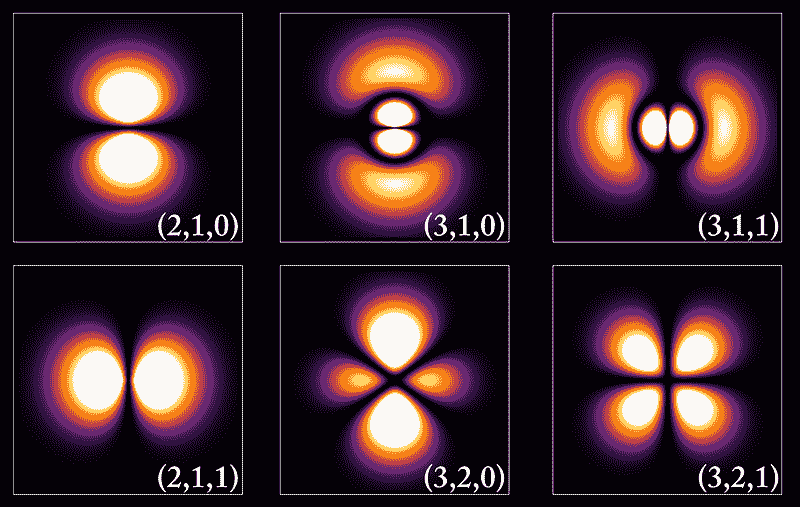

# 来来回回：人工智能职业之旅

> 原文：[`towardsdatascience.com/there-and-back-again-an-ai-career-journey/`](https://towardsdatascience.com/there-and-back-again-an-ai-career-journey/)

<mdspan datatext="el1752532122561" class="mdspan-comment">那一年是 1989 年。</mdspan>

我怀揣着成为人工智能开发者的远大志向。

我研究了所有最新的资料。我的意思是科幻电影——《终结者》、《战争游戏》、《机器警察》和《异形》。好吧，是的，这些有点末日。但，像《神探科南》和《星际迷航：下一代》这样的电视剧让我相信任何事都是可能的。

我在被称为 Atari 1200XL 的尖端技术领域磨砺了自己的技能，并准备投身于人工智能领域。

我也喜欢编程——我想那时的 BASIC 和 Pascal 算得上是。尽管如此，我还是自己制作了游戏，甚至为棒球卡收藏编写了一个数据库引擎。我爸爸不想花钱买软件，还要供我们这些孩子上学，所以他挑战我编写它们。

在我高中最后一年，我编写了一个非常有趣且有趣的程序，该程序会使用复杂的波动方程生成氢原子的电子轨道图像。一次一个点，它会生成图像。虽然不像这些那么漂亮——那时还是 80 年代，但你能想象出来。

图片来源：[`commons.wikimedia.org/w/index.php?curid=5854697`](https://commons.wikimedia.org/w/index.php?curid=5854697)

我的物理老师印象深刻，以至于他推荐我申请伦斯勒理工学院（Rensselaer Polytechnic Institute）的奖学金。这为我打开了进入这所学校学习计算机科学的大门。我正走在通往人工智能的道路上。

## 人工智能寒冬

在伦斯勒理工学院（Rensselaer），我们的 AI 教授要求我们编写一个玩单人纸牌游戏（solitaire）的程序。我着手用 LISP 编写，却发现电脑并没有真正地学习到任何东西。

我在想象指挥官数据（Commander Data）如何快速地通过洗牌来找出玩游戏的方法，每一次洗牌都更快。这不应该是我来编程，每一步都告诉它该做什么。

我问教授这怎么算是“人工智能”。她说我们作为开发者的工作是在任何时刻告诉它最佳的行动方案，并确保覆盖所有情况。基本上，就是将我所谓的智慧转移到电脑上。

那是 90 年代初的人工智能——对“人工”的重视程度很高。

我能感觉到内心的泡沫破裂了，而且我并不孤单。技术本身还没有准备好。这最终导致了*第二次人工智能寒冬*。

## 啊哈时刻

我完成了学业，并将作为人工智能开发者的抱负暂时搁置。我开始作为系统和网络基础设施管理员开始了我的职业生涯，并且真正享受其中的挑战。

作为一名内心深处的软件开发者，我找到了自动化许多重复性管理任务的方法来监控系统健康。这对我来说非常有用，因为我的用户经常问我为什么网络这么慢。或者经典的提问，“*网络是不是出故障了？*”

由于我的雇主不愿意花钱，我去寻找开源软件。但是，不打开钱包是走不远的。花费六位数的商业解决方案可以让你达到目标，但我们不愿意花那么多钱。所以，我坐下来从头开始编写自己的工具，模仿昂贵的软件。

现在，当有人问网络是否出故障时（剧透：并没有），我可以在 5-6 个不同的地方查看，大约 10 分钟就能找出确切是什么（或谁）导致速度变慢。

我很高兴现在有了可以工作的数据，但挖掘所有这些数据变得非常累人。

然后出现了我的“啊哈”时刻。

在 2010 年代中期，“大数据”的概念非常流行。我参加了一个会议，会上给出了一个假设性的例子，有人找到了从 A 点到 B 点乘坐火车的最佳方式。从理论上讲，*大数据*系统可以收集火车时刻表，考虑等待时间、可用座位、绕行、票价等，以建议最佳选项。

哎呀！这就像我从不同来源拉取系统信息碎片，然后连接这些点来创建一个清晰的画面一样。

我需要做的只是再写一个工具，用逻辑来将这些碎片拼凑在一起。现在当我的用户问他们经典的问题时，我可以通过在构建的 Web 服务器上点击几个鼠标来回答他们。

感觉就像我又回到了大学。

## 学习

这激发了我长期被搁置的计算机科学兴趣，它已经放在架子上好几十年了。

我决定追求这个新的爱好，并报名参加了数据科学和机器学习课程。我的晚上和周末都充满了尽可能多的在线课程。

回顾过去，我意识到“啊哈”时刻和重燃的激情才是我厌倦基础设施管理角色的真正原因。请别误会——这是一份好工作。但我找到了一个更好的技能发挥途径，所以每一个支持电话都变得难以忍受。

是时候改变一下了。

幸运的是，就像我的高中老师认识到我的潜力一样，我的经理推荐我担任公司中的另一个角色，恰当地命名为 *大数据分析师*。

我投身于创建销售预测模型，使用一种优雅的编程语言叫做 *R*。然后我在这个模型上实现了神经网络，这迫使我将其重写为 Python。最终，我使用 AutoML 找到最佳模型，SHAP 进行可解释性，并将其打包到 Docker 中，同时与 Qlik Sense 进行可视化集成。

我不喜欢做半途而废的事情。

然后，有一天，我的老板让我帮助我们的消费者服务部门实施一个 AI 图像分类器。消费者会打电话寻求对我们产品的支持，我们会花很多时间来确定他们拥有哪种产品。一张图片会让事情变得更容易，而 AI 会让它更快。

原本的意图是找一家第三方公司为我们创建 AI，这将花费六位数的价格。我知道我们公司多么厌恶支出，所以我主动提出自己创建 AI 模型。我开始收集图像数据，训练模型，并创建一个简单的网页界面使其可用。

## AI 春天

这时，我多年的基础设施经验派上了用场。我有权访问内部资源，知道如何在 Azure 云上构建 Linux 服务器以获取 GPU 加速器，并能够建立一个网站服务器使其可访问。这是 2019 年，硬件和软件的进步恰逢其时。最后，*AI 春天*到来了。

向消费者服务部门负责人进行了一次简短的 30 分钟演示，说服他放弃与第三方公司的所有谈判。我得到了全权负责这个项目的绿灯！

经过 30 年的努力，我回到了起点。我的 AI 开发者梦想变成了现实——感谢幸运，没有出现致命的机器人。

接下来的 6 年，我扩展了这个应用，这是我职业生涯的亮点。我甚至获得了我们公司颁发的个人总裁成就奖。这个项目非常成功，我很高兴能通过一系列的文章分享我所学到的知识：

> [机器学习工程师的学习心得——第一部分：数据](https://towardsdatascience.com/learnings-from-a-machine-learning-engineer-part-1-the-data/)

## 退休

今年，我决定进入我存在的退休阶段。与其让公司总部搬迁到州外，我决定掌控自己的命运，以一个高调的姿态离开。

在我最后一天，我的老板召集了我们的团队，问我是否有任何建议可以分享。以下是我所说的话：

+   不要害怕退后一步，评估什么真正让你快乐。转变可能需要时间和努力，但这是值得追求的。

+   一定要与你的导师和管理者建立良好的关系，他们可能是帮助你打开大门的人。

+   永远不要停止学习。你不知道你的下一个灵感将从何而来。

尽管我称之为“退休”，但我认为这更像是一个重置，这样我可以找到其他可以产生影响的方式。有很多兴趣可以探索，还有很多东西要学习。

你永远不会太老，不能追逐你的童年梦想。
