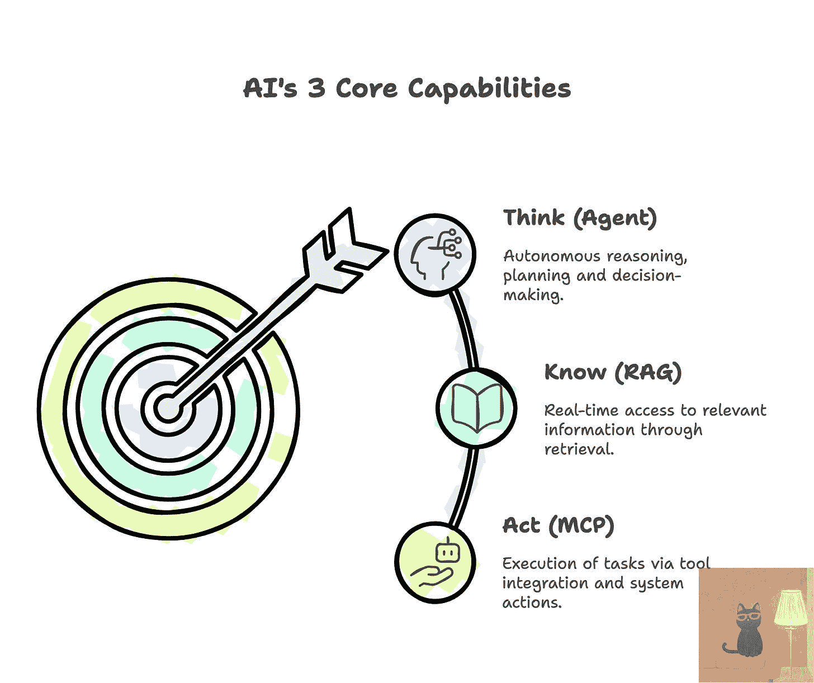
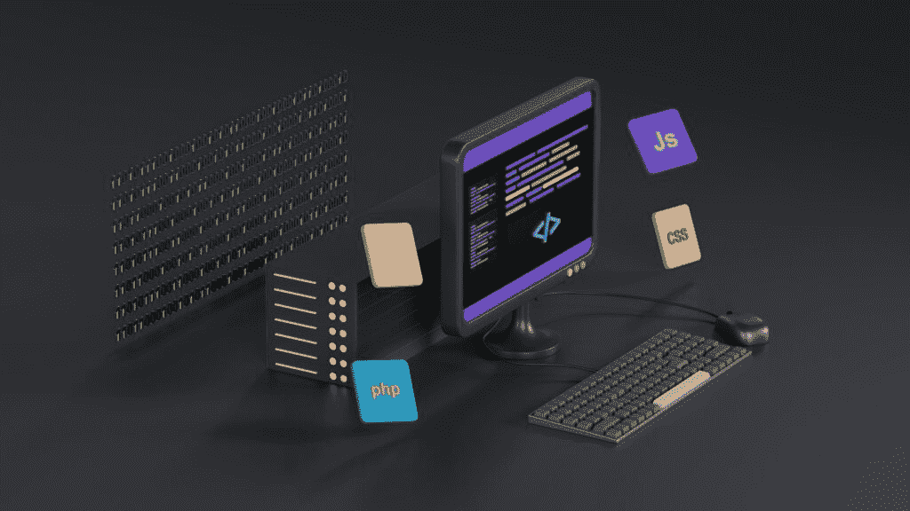
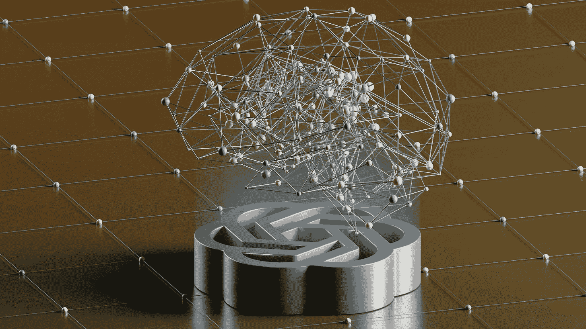
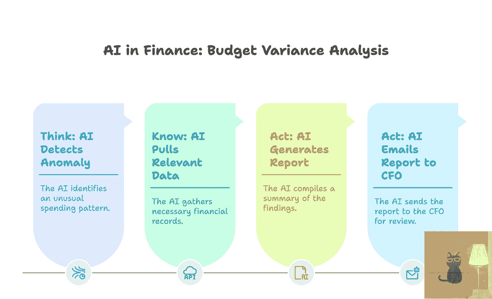
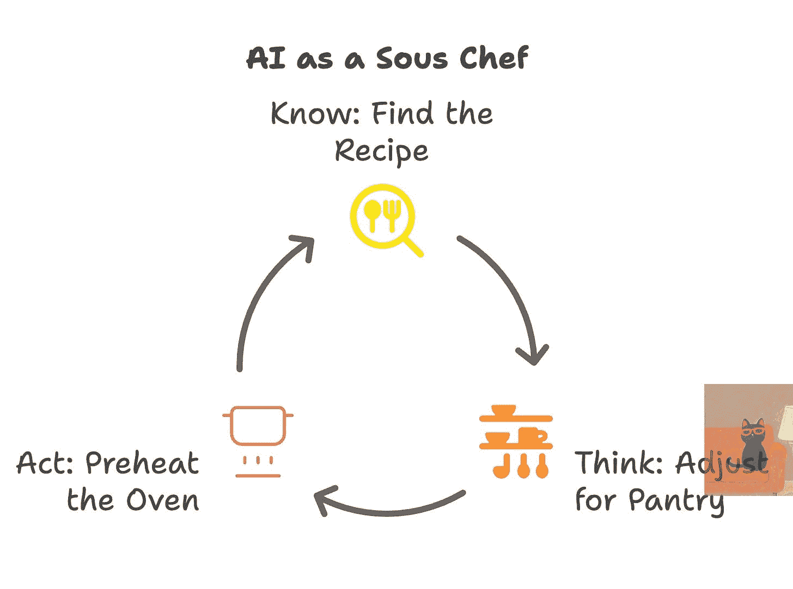
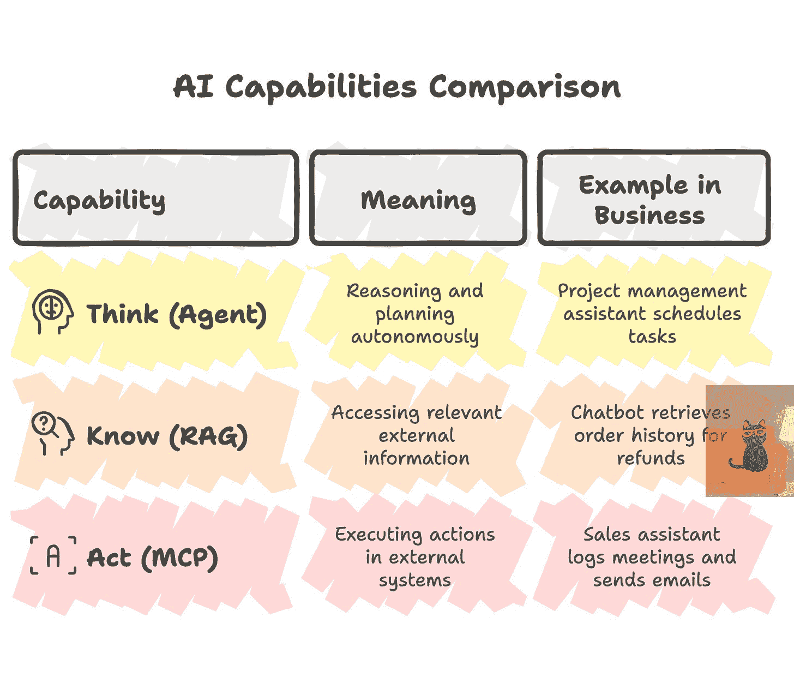
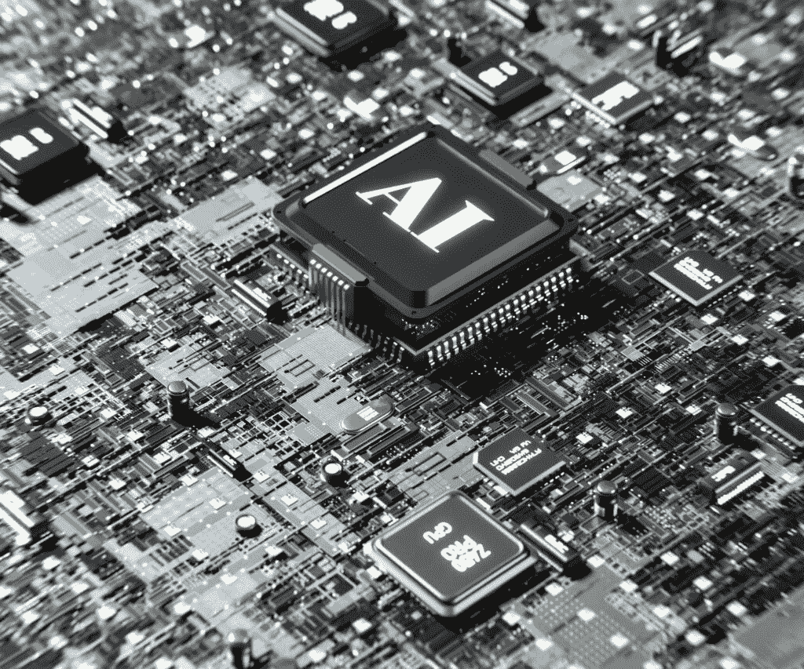

# 思考。知识。行动。AI 的核心能力如何塑造工作的未来

> 原文：[`towardsdatascience.com/think-know-act-how-ais-core-capabilities-will-shape-the-future-of-work/`](https://towardsdatascience.com/think-know-act-how-ais-core-capabilities-will-shape-the-future-of-work/)
> 
> *“不是最强壮的物种能够生存，也不是最聪明的物种能够生存，而是最能适应变化的物种。” ——查尔斯·达尔文，进化论的创始人*

<mdspan datatext="el1746513951313" class="mdspan-comment">不久前</mdspan>，我遇到了一篇关于一位 CEO 的文章，他对公司的新 AI 助手感到明显的不满。该系统能在几秒钟内起草漂亮的电子邮件，并且相当好地回答一般性的问题。但当被要求提供特定项目的更新时，它却停滞不前。“为什么 AI 助手不能仅仅调取我们的数据并展示正在发生的事情？”尽管 AI 助手看起来很复杂，但它无法访问公司的内部知识或采取有意义的行动。这是许多商业领袖今天正在遇到的情况：对 AI 的高期望，随后是令人惊讶的有限结果。

这种脱节通常源于对 AI 能做什么和不能做什么的误解。AI 不是一个单一的超级智能，而是一个由不同能力组成的系统。为了真正在企业中利用 AI，领导者需要一种清晰的方式来评估这些能力。根据我的经验，将事物分解为三个核心能力——思考、知识和行动——是有帮助的。

图片由胡伟伟来自 [The Next Step](https://thenextsteps1.substack.com/)

Think-Know-Act 是一个简单的框架，用于穿透噪音。它将现代 AI 分解为三个推动真实商业价值的核心能力：

+   **思考（代理）**：自主推理、规划和做决定的能力。代理将复杂目标分解为步骤，适应上下文，并在不需要持续的人为输入的情况下协调行动。

+   **知识（RAG）**：访问和应用相关知识的能力。检索增强生成（RAG）使 AI 能够参考内部文档、数据库和外部来源，以提供准确、上下文感知的响应。

+   **行动（MCP）**：通过与工具、系统和工作流程交互来执行任务的能力。模型上下文协议（MCP）将 AI 连接到 API、业务系统和应用程序，使其能够完成行动，而不仅仅是提出建议。

当这三个能力结合在一起时，AI 就从有用的助手演变成为一个战略性的、以行动为导向的合作伙伴。它不仅响应，还会推理、学习，并朝着你的商业目标采取有意义的步骤。在这篇文章中，我将分解每个能力，并探讨理解这个框架如何推动你组织更智能、更有效的 AI 采用。

* * *

## 思考：具有推理和规划能力的 AI（代理能力）

图片来自 [Unsplash](https://unsplash.com/?utm_source=medium&utm_medium=referral)

当我们说 AI 能够思考时，我们不仅仅是指它能够做出响应。这意味着它能够通过问题进行推理，并以目标为导向做出决策。它能够分解问题，设定目标，并定义一个逻辑的前进路径。这是 AI 智能体的核心能力，它远远超出了简单的聊天机器人。与仅仅对提示做出反应的传统模型不同，智能体可以规划、优先排序和适应，它们更像自主的合作伙伴而不是脚本工具。

> *“大型语言模型生成响应，智能体做出决策。它们不仅仅是回答问题；它们思考、决策并采取行动。”*

在商业环境中，思考型 AI 就像您团队中的智能分析师，它不会等待一步一步的指令，而是主动采取行动，找出如何从问题到解决方案的路径，并在新信息出现时进行调整。

近期的发展使得 AI 智能体能够将复杂任务分解为子任务，根据需要使用工具，并迭代向解决方案迈进。例如，想象您要求 AI 安排一次多城市商务旅行。一个基本的 AI 可能会询问您后续问题或提供一些旅行建议。而一个智能体 AI 不仅可以提出旅行选项，还可以规划整个工作流程：它可能会自主检查您的日历，搜索航班，比较酒店价格，然后从始至终组装一个完整的旅行行程，而无需一步一步的指导。这种能力使得 AI 能够在一定程度上自由操作，通过逻辑步骤追求结果，而不是等待明确的指令。

对于高管来说，思考型 AI 的真实价值在于效率和主动性。AI 智能体不再只是等待提示，比如在需要时生成报告，它还可以主动识别您的销售数据中的趋势，并在您提出问题之前就推荐下一步行动。这把 AI 从被动工具转变为主动顾问。在评估 AI 解决方案时，请自问：

> *这个系统仅仅是响应，还是能够通过任务进行思考并自行解决问题？*

您的 AI 越能真正推理，它就能处理越复杂的任务，您的团队能够赢回更多战略性的时间。

* * *

## 了解：能够记忆和学习的 AI（通过 RAG 获取知识）

图片来自 [Unsplash](https://unsplash.com/?utm_source=medium&utm_medium=referral)

知识能力是赋予 AI 访问相关信息的途径，尤其是那些对您的业务独特的信息。即使是最复杂的推理引擎，如果没有正确的上下文，也会力不从心。传统的 AI 模型仅在其开发过程中被训练的数据，这意味着它们很快就会过时。除非它们连接到您当前的真相来源，否则它们无法访问您最新的政策变更、定价模型、客户反馈或市场变化。

这就是检索增强生成（RAG）发挥作用的地方。RAG 允许 AI 从受信任的来源动态地获取信息，包括你的文档、数据库和系统，实时进行。换句话说，它为 AI 模型提供了它原本缺乏的东西：一个动态的工作记忆，一种记住它从未最初训练过的东西的方式。RAG 不再仅仅依赖于过时的训练数据，它使 AI 能够访问和应用最新的、业务特定的知识，将响应锚定在你的当前业务现实中。

考虑一个客户支持助手。没有检索，它可能只能提供可能有用或无用的通用响应，因为它无法访问客户订单历史或你公司的知识库。有了 RAG，同样的助手可以立即调出确切的购买详情，在与客户交谈时检查最新的退货政策，并在实时提供精确、有用的答案。正如麦肯锡指出，RAG 使 AI 模型能够利用组织的专有知识库，而无需昂贵的重新训练，从而产生更相关、具体和值得信赖的输出。

在实践中，这导致更准确、相关的响应，以及 AI 说“我没有那个信息”的实例大大减少。这种转变可以显著提高相关性和信任度。

对于领导者来说，结论是明确的：如果你想 AI 能够与你的公司知识和背景对话，而不仅仅是互联网上的，它需要一种了解的方式。这意味着对专有数据的安全、稳健访问，以及用于检索的治理和结构化。一个理解你的业务，包括其内容、数据和决策的 AI，将比一个在黑暗中猜测的 AI 带来更大的价值。

* * *

## 行动：采取行动的 AI（通过 MCP 执行）

图片来自 [Unsplash](https://unsplash.com/?utm_source=medium&utm_medium=referral)

行动能力是将 AI 从顾问转变为执行者的关键。它区别于只是告诉你需要做什么的助手，和真正去做的助手。这意味着触发工作流程、调用 API、更新系统，并代表你采取现实世界的行动。

如果“Think”是“大脑”，“Know”是“记忆”，那么“Act”就是 AI 系统的“双手”。它允许 AI 完成端到端任务，而不仅仅是提出建议。它使 AI 能够超越洞察和建议，交付实际成果。这是将智能转化为影响的最后一步。

例如，考虑一个 AI 销售助手，它不仅能起草给合作伙伴的跟进电子邮件，在你批准内容后还能自动发送。或者是一个 AI 运营助手，它能检测库存短缺并直接通过你的采购系统下补货订单。这些不是未来场景，它们是通过 AI 与企业系统集成而正在形成的功能。

我们已经看到了 AI 通过像 ChatGPT 插件这样的工具在行动中的早期例子，这些插件可以预订会议或检索实时数据，还有 MS365 Copilot，它可以根据自然语言提示更新电子表格、发送电子邮件或调整日历。这些新兴能力展示了 AI 如何从建议行动到实际执行行动。

为了使这种执行方式可扩展，行业现在正朝着共同标准发展，以使此类集成更加容易和安全。一项值得注意的创新是 Anthropic 的模型上下文协议（MCP），通常被描述为“AI 应用的 USB-C 端口”。MCP 提供了一种通用的方式将 AI 模型连接到不同的企业数据源和工具，使它们能够在无需定制集成的情况下进行操作。简而言之，行动能力正变得即插即用：现代 AI 现在可以发现和访问可用的工具，并使用它们来执行任务，而无需硬编码的集成。

对于高管来说，行动的力量在于自动化与有形商业价值的交汇点。当 AI 能够采取行动时，它不仅节省时间，还减少了运营摩擦并加速了结果。想象一下，AI 不仅可以自动生成和分发报告，还可以在没有人工干预的情况下升级问题并打开支持票证。然而，行动 AI 必须以强大的治理意识部署，包括明确的权限、基于角色的访问和监督，以确保安全、问责制和信任。

在评估 AI 解决方案时，值得问一问：

> *这个 AI 系统只是提供信息，还是也可以执行操作？*

因为能够对决策采取行动是将 AI 从被动的观察者或分析师转变为积极团队成员的能力，一个能够完成任务的角色。

* * *

## 将一切整合在一起：思考 + 知识 + 行动

这些能力中的每一个单独都可以增加价值，但真正的变革发生在它们协同工作时。在一个设计良好的系统中，思考、知识和行动相互补充，形成一个智能行动的闭环：AI 可以推理复杂问题，检索所需的信息，并执行必要的步骤，而无需人工干预。

这种协同作用将 AI 从反应性工具转变为主动的合作伙伴。正如一位专家所说，将代理推理与知识检索和执行相结合，将被动查找模型转变为适应性强的、智能的问题解决流程。换句话说，这意味着 AI 不仅仅是聊天，而是真正地完成任务并产生真正的商业成果。

让我们将其具体化。想象一下，一个财务团队使用 AI 助手来帮助管理预算差异分析。凭借所有三种能力，助手可以自主检测季度支出的异常（思考），从上一季度的基线中拉入相关的会计条目进行比较（知识），然后生成总结报告并将其发送给 CFO（行动）。

现在，想象一下你移除了这些能力中的任何一个：没有“知”，人工智能助手无法访问它诊断问题所需的数据。没有“行”，首席财务官仍然在等待有人编制并发送报告。没有“思”，人工智能助手甚至不会意识到首先需要调查异常。只有当这三个能力协同工作，系统才能提供有意义的、自主的价值，将人工智能从点解决方案转变为战略性的力量倍增器。

图片由胡伟伟来自 [The Next Step](https://thenextsteps1.substack.com/)

另一种思考人工智能的方式是将其想象成厨房中的副厨师，而不是明星厨师，而是那个在幕后保持一切顺利运行的人。 “知”的能力就像找到完美的食谱，它检索完成任务所需的信息。 “思”是根据你 pantry 中的实际物品和晚餐来调整食谱，通过规划和推理来处理情况。 “行”是预热烤箱并开始烹饪，执行将计划付诸实施的步骤。 目标不是取代你的专业知识，而是消除摩擦，加速执行，并扩展已经有效的工作。

图片由胡伟伟来自 [The Next Step](https://thenextsteps1.substack.com/)

在评估组织中 AI 机会时，将这些机会与这三个维度进行映射是有帮助的。 你是否在探索一个主要思考的解决方案，比如一个可以自主优化日程或做出决策的 AI？ 或者一个主要“知”的解决方案，比如一个智能搜索引擎，可以检索和展示相关的公司数据？ 或者可能是一个主要“行”的解决方案，比如一个自动化工具，可以自动化任务、触发工作流或执行决策？

最有效的 AI 解决方案通常整合了所有三种能力。 但理解哪种能力缺失或过度隔离可以迅速解释为什么一个有希望的 AI 创新没有达到预期的结果。 使用“思-知-行”作为诊断透镜和战略决策清单。 它不仅为技术评估带来清晰，而且为如何以推动真实商业价值的方式实施 AI 带来清晰。 只是为了回顾，以下是三个核心 AI 能力的快速总结：

图片由胡伟伟来自 [The Next Step](https://thenextsteps1.substack.com/)

* * *

## AI 时代领导力

企业 AI 的采用应该始终从明确的企业需求开始，而不是从技术本身开始。 “思-知-行”框架是一种实用的方法，可以穿越噪音并专注于真正驱动影响的事情。 通过理解这些核心能力，领导者可以提出正确的问题：

+   这个 AI 解决方案是否有访问所需知识的权限？

+   它能否通过我们的业务挑战进行推理？

+   它能否在我们环境中采取行动？

当你能清晰自信地回答这些问题时，你不仅仅是在尝试 AI。你正在构建正确的架构以实现可衡量的、战略性的成果。

图片来自 [Unsplash](https://unsplash.com/?utm_source=medium&utm_medium=referral)

我们已经到了一个点，AI 可以不仅仅是一个工具。它可以同时作为同事、创意问题解决者、按需专家和不知疲倦的助手。但实现这一愿景需要清晰的策略。最成功的公司从明确的业务成果出发，无论是改善客户服务、简化运营还是增强决策，然后组装能够实现这些成果的 AI 能力。

你不需要成为数据科学家就能在这个领域领导。你只需要倡导一种以能力为先的心态。鼓励你的团队设计出具有情境思考、了解你的业务并采取行动以实现结果的解决方案。

在 AI 时代，清晰是你的竞争优势。通过将 AI 项目或倡议围绕思考-了解-行动框架进行构建，你将 AI 创新与基于地面的业务战略和实际执行相一致。对领导者的信息清晰且赋权：掌握现代 AI 这三个核心能力，你可以引领你的公司更智能地创新、更快地执行，并自信地导航 AI 革命。

> *AI 不会取代你。但那些知道如何用 AI 思考、了解和行动的领导者可能会。*

* * *

**作者注：**

思考、了解、行动不仅仅关乎技术深度，更关乎战略清晰。我最钦佩的领导者并不是追逐最炫目的工具；他们是在问正确的问题：我们正在解决什么问题？哪些能力真正推动指针移动？随着 AI 的持续发展，能够将能力与业务成果联系起来的高管不仅能够跟上变化，还能够定义和塑造它。📈🍀

*这篇文章最初发表在* [*《下一步》*](https://thenextsteps1.substack.com/)*，我在那里分享关于领导力、个人成长和构建未来的反思。*请随意订阅以获取更多见解！*
