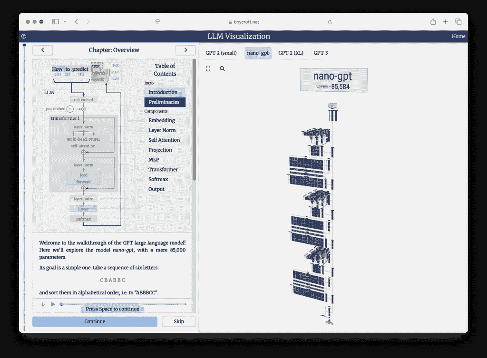
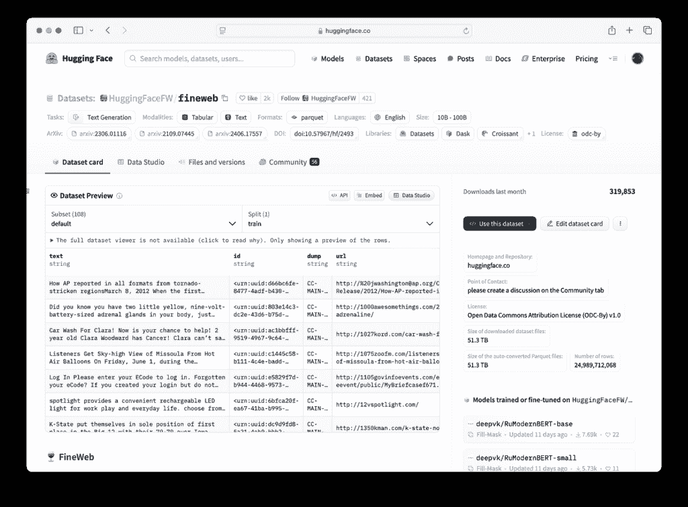
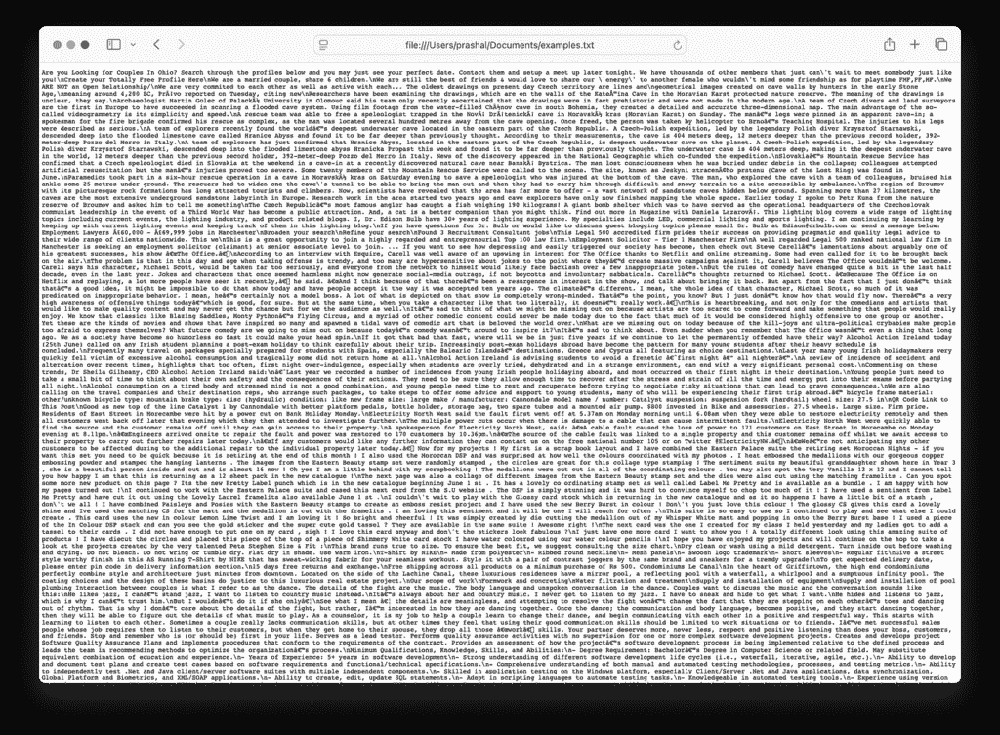
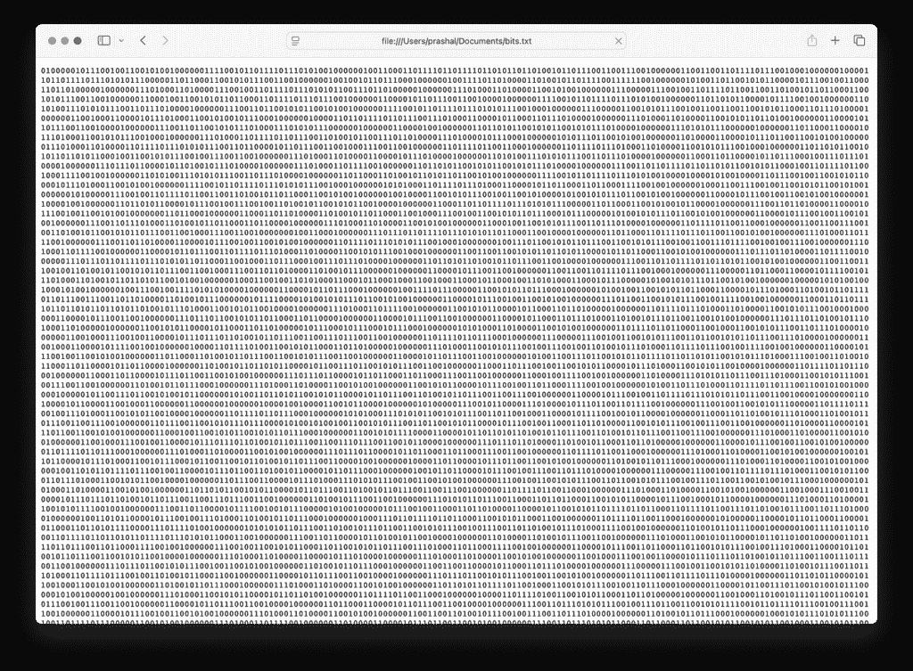
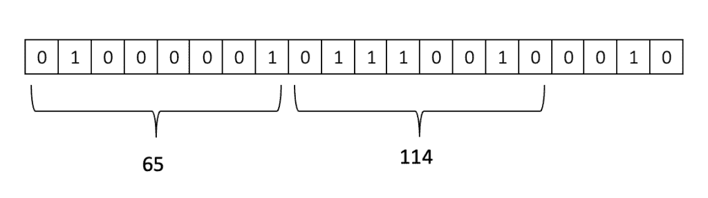
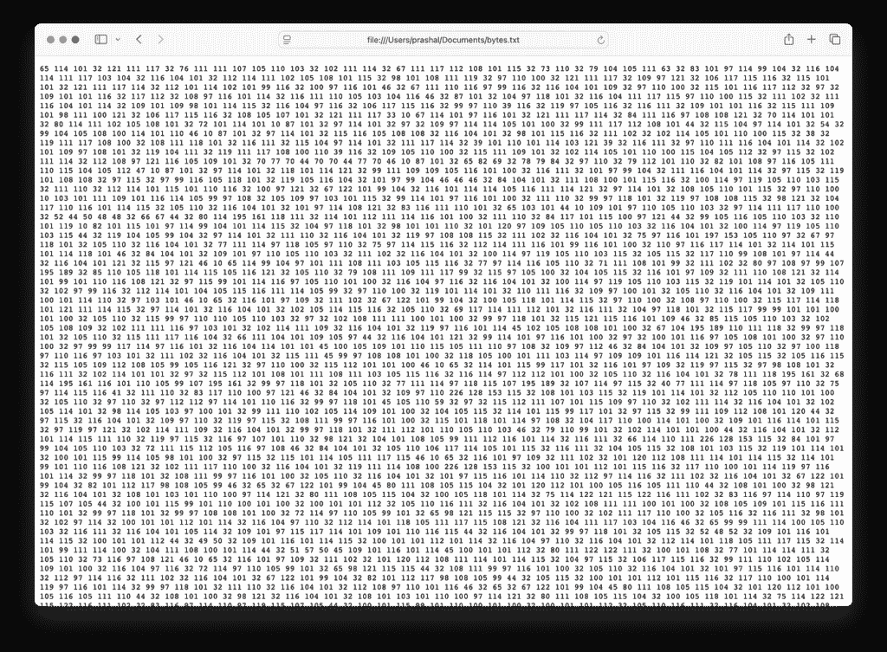
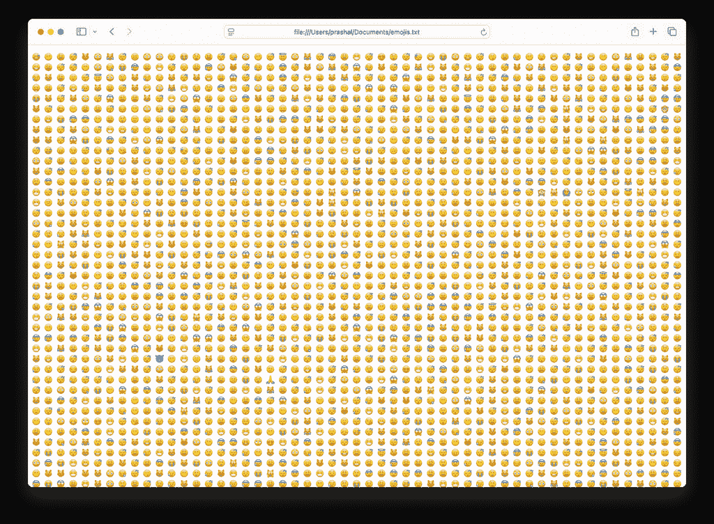
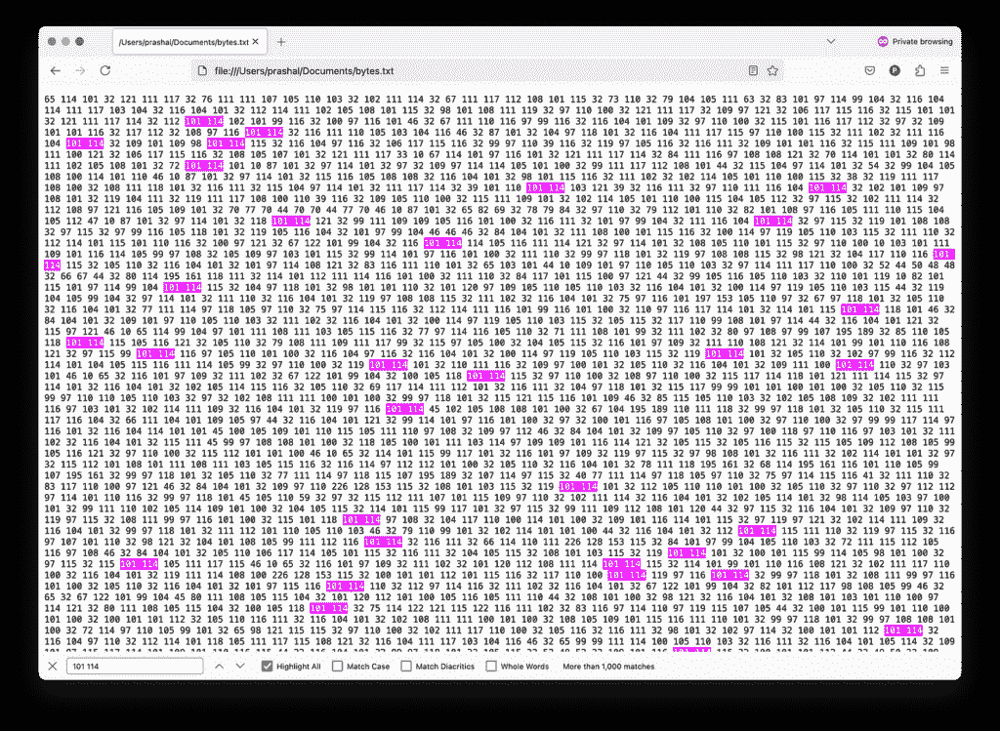
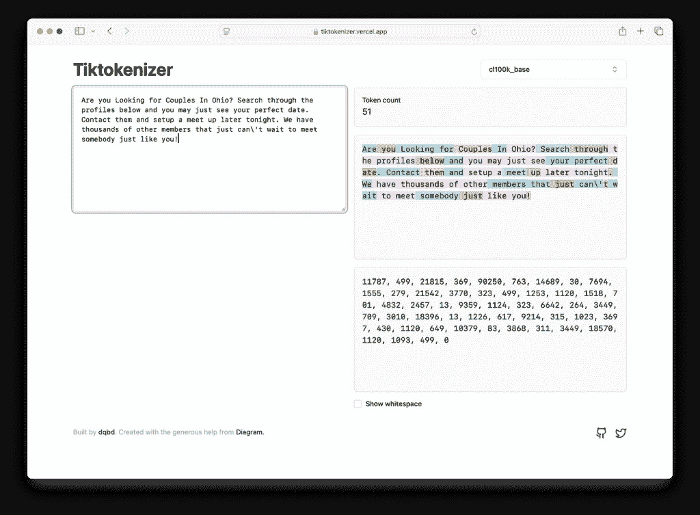
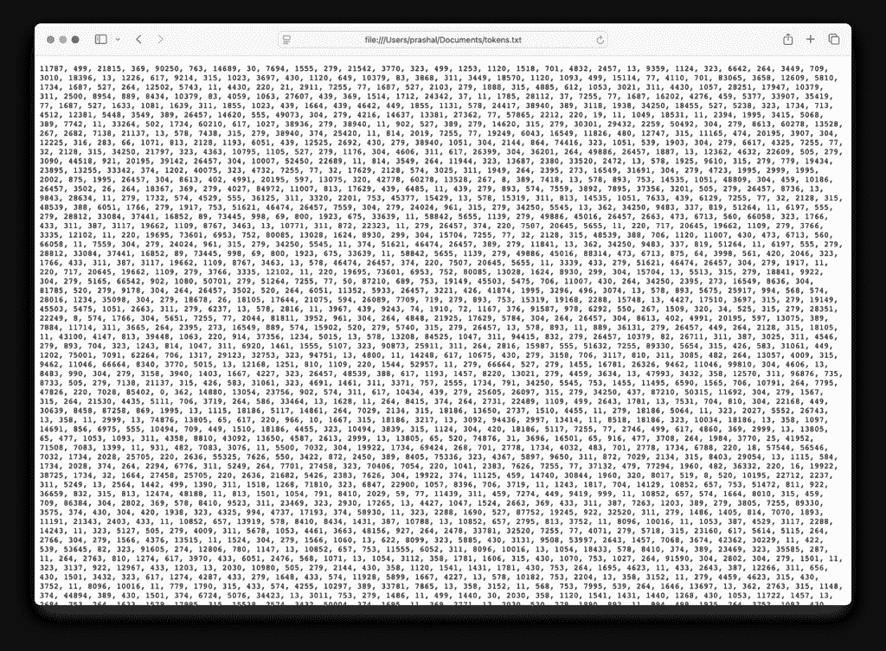

# 这就是 LLMs 分解语言的方式

> 原文：[`towardsdatascience.com/this-is-how-llms-break-down-the-language/`](https://towardsdatascience.com/this-is-how-llms-break-down-the-language/)

你还记得 2020 年 OpenAI 发布 GPT-3 时的炒作吗？虽然不是该系列中的第一个，但 GPT-3 因其令人印象深刻的文本生成能力而获得了广泛的流行。从那时起，各种大型语言模型（LLMs）如潮水般涌入人工智能领域。**黄金问题是：你有没有想过 ChatGPT 或其他任何 LLMs 是如何分解语言的？**如果你还没有，我们将讨论 LLMs 在训练和推理过程中处理文本输入的机制。原则上，我们称之为分词。

这篇文章灵感来源于特斯拉前高级 AI 总监[Andrej Karpathy](https://karpathy.ai/)的 YouTube 视频[*Deep Dive into LLMs like ChatGPT*](https://www.youtube.com/watch?v=7xTGNNLPyMI)。他的面向大众的视频系列非常适合那些想要深入了解 LLM 背后复杂性的读者。

在深入探讨主题之前，我需要你了解 LLM 的内部工作原理。在下一节中，我将分解语言模型的内部结构和其底层架构。如果你已经熟悉神经网络和 LLMs，你可以跳过下一节而不影响你的阅读体验。

## 大型语言模型的内部结构

LLM 由 Transformer 神经网络组成。将神经网络视为巨大的数学表达式。神经网络输入是一系列标记，这些标记通常通过嵌入层处理，将标记转换为数值表示。目前，将标记视为输入数据的基本单元，如单词、短语或字符。在下一节中，我们将深入探讨如何从输入文本数据中创建标记。当我们将这些输入馈送到网络时，它们与这些神经网络的参数或权重混合成一个巨大的数学表达式。

神经网络训练是关于找到一组似乎与训练集统计信息一致的权重。在某种程度上，神经网络训练就是寻找正确的权重集。

2017 年，Vaswani 等人发表的论文“[Attention is All You Need](https://arxiv.org/abs/1706.03762)”中介绍了 Transformer 架构。这是一个专为序列处理设计的特殊结构的神经网络。最初是为了神经机器翻译而设计的，后来已成为 LLMs 的基石。

要了解生产级别的转换器神经网络是什么样的，请访问[`bbycroft.net/llm`](https://bbycroft.net/llm)。该网站提供了生成预训练转换器（GPT）架构的交互式 3D 可视化，并引导您了解它们的推理过程。



在[`bbycroft.net/llm`](https://bbycroft.net/llm)上可视化 Nano-GPT（图片由作者提供）

这个特定的架构，称为 Nano-GPT，大约有 85,584 个参数。我们在网络的顶部输入 token 序列，信息随后通过网络层流动，其中输入经过一系列转换，包括注意力机制和前馈网络，以产生输出。输出是模型对序列中下一个 token 的预测。

## 标记化

训练像 ChatGPT 或 Claude 这样的最先进语言模型涉及几个按顺序排列的阶段。在我之前关于幻觉的文章中，我简要解释了 LLM 的训练流程。如果您想了解更多关于训练阶段和幻觉的信息，您可以在这里阅读[它](https://medium.com/ai-advances/llm-hallucinations-a95e341d5a7e)。

现在，假设我们处于训练的初始阶段，称为预训练。这个阶段需要一个大型、高质量、万兆级别的网络规模数据集。主要 LLM 提供商使用的数据集并不公开。因此，我们将探讨由 Hugging Face 精心制作的开放源数据集，称为[FineWeb](https://huggingface.co/datasets/HuggingFaceFW/fineweb)，在[Open Data Commons Attribution License](https://opendatacommons.org/licenses/by/1-0/)下分发。您可以在[这里](https://huggingface.co/spaces/HuggingFaceFW/blogpost-fineweb-v1)了解更多关于他们如何收集和创建这个数据集的信息。



由 Hugging Face 精心制作的 FineWeb 数据集（图片由作者提供）

我从 FineWeb 数据集中下载了一个样本，选择了前 100 个示例，并将它们连接成一个单独的文本文件。这只是一个包含各种模式的原始互联网文本。



来自 FineWeb 数据集的样本文本（图片由作者提供）

因此，我们的目标是向转换器神经网络提供这些数据，以便模型学习文本的流动。我们需要训练我们的神经网络来模仿文本。在将文本插入神经网络之前，我们必须决定如何表示它。神经网络期望一个一维的符号序列。这需要一个有限的符号集合。因此，我们必须确定这些符号是什么，以及如何将我们的数据表示为一维的符号序列。

到目前为止，我们有一个一维的文本序列。这里有对原始比特序列的带下划线的表示。我们可以使用 UTF-8 编码将原始文本序列编码为原始比特序列。如果你查看下面的图片，你可以看到原始一维文本序列的第一个字母“A”对应的原始比特序列的前 8 位。



以比特为一维序列表示的采样文本（图片由作者提供）

现在，我们有一个非常长的序列，包含两个符号：零和一。这实际上是我们所寻找的——一个具有有限可能符号集的一维符号序列。现在的问题是，序列长度在神经网络中是一个宝贵的资源，主要是因为计算效率、内存限制和长依赖关系的处理难度。因此，我们不想只有两个符号的极长序列。我们更喜欢更短的符号序列。因此，我们将权衡词汇表中的符号数量与结果序列长度。

由于我们需要进一步压缩或缩短我们的序列，我们可以将每 8 个连续的比特组合成一个字节。由于每个比特要么是 0 要么是 1，因此 8 比特序列的组合有 256 种可能。因此，我们可以将这个序列表示为字节序列。



将比特分组为字节（图片由作者提供）

这种表示方式将长度减少了 8 倍，同时将符号集扩展到 256 种可能性。因此，序列中的每个值都将落在 0 到 255 的范围内。



以字节为一维序列表示的采样文本（图片由作者提供）

这些数字在数值意义上没有任何价值。它们只是唯一标识符或符号的占位符。实际上，我们可以用每个唯一的表情符号替换这些数字，核心思想仍然成立。想象这是一个由 256 个唯一选项选择的表情符号序列。



以表情符号为一维序列表示的采样文本（图片由作者提供）

将原始文本转换为符号的过程称为标记化。在最新的语言模型中，标记化甚至超越了这一点。我们可以使用[字节对编码（BPE）](https://huggingface.co/learn/nlp-course/en/chapter6/5)算法进一步压缩序列的长度，以换取词汇表中的更多符号。最初是为文本压缩而开发的 BPE，现在被 transformer 模型广泛用于标记化。OpenAI 的 GPT 系列使用标准版和定制版的 BPE 算法。

实际上，字节对编码涉及识别频繁出现的连续字节或符号。例如，我们可以查看我们的文本字节级序列。



序列 101，接着是 114，相当常见（图片由作者提供）

如您所见，序列`101`后面跟着`114`出现频率很高。因此，我们可以用一个新的符号替换这个对，并给它一个唯一的标识符。我们将使用这个新符号重写`101 114`的每个出现。这个过程可以重复多次，每次迭代都会进一步缩短序列长度，同时引入额外的符号，从而增加词汇表的大小。通过这个过程，GPT-4 提出了大约 10 万个标记的词汇表。

我们可以进一步探索使用[Tiktokenizer](https://tiktokenizer.vercel.app/)进行分词。Tiktokenizer 提供了一个基于网页的交互式图形用户界面，您可以在其中输入文本并查看它根据不同模型如何被分词。玩转这个工具，以直观地了解这些标记的样子。

例如，我们可以将文本序列的前四句话输入到 Tiktokenizer 中。从下拉菜单中选择 GPT-4 基础模型编码器：*cl100k_base*。



[Tiktokenizer](https://tiktokenizer.vercel.app/)（图片由作者提供）

红色文本显示了文本块如何对应符号。以下长度为 51 的文本序列是 GPT-4 最终将看到的。

```py
11787, 499, 21815, 369, 90250, 763, 14689, 30, 7694, 1555, 279, 21542, 3770, 323, 499, 1253, 1120, 1518, 701, 4832, 2457, 13, 9359, 1124, 323, 6642, 264, 3449, 709, 3010, 18396, 13, 1226, 617, 9214, 315, 1023, 3697, 430, 1120, 649, 10379, 83, 3868, 311, 3449, 18570, 1120, 1093, 499, 0
```

我们现在可以使用 GPT-4 基础模型分词器*cl100k_base*将整个样本数据集重新表示为标记序列。*注意，原始 FineWeb 数据集由一个 15 万亿个标记的序列组成，而我们的样本数据集只包含来自原始数据集的几千个标记。



样本文本，表示为标记的一维序列（图片由作者提供）

## 结论

分词是 LLMs 处理文本的基本步骤，在将原始文本数据转换为结构化格式并输入神经网络之前，将其转换为符号的一维序列。由于神经网络需要一维的符号序列，我们需要在序列长度和词汇表中的符号数量之间取得平衡，以优化计算效率。现代最先进的基于 transformer 的 LLMs，包括 GPT 和 GPT-2，使用字节对编码分词。

拆解分词有助于揭示 LLMs 如何解释文本输入并生成连贯的响应。对分词有直观的认识有助于理解 LLMs 训练和推理背后的内部机制。随着 LLMs 越来越多地用作知识库，精心设计的分词策略对于提高模型效率和整体性能至关重要。

如果你喜欢这篇文章，可以在[X（前身为 Twitter）](https://x.com/prashalr)上与我联系，获取更多见解。

## 参考文献

+   [深入探索像 ChatGPT 这样的 LLMs](https://youtu.be/7xTGNNLPyMI)

+   [安德烈·卡帕西](https://karpathy.ai/?source=post_page-----7bc11b26ddaf---------------------------------------)

+   [注意力即一切](https://arxiv.org/abs/1706.03762?source=post_page-----7bc11b26ddaf---------------------------------------)

+   [LLM 可视化](https://bbycroft.net/llm?source=post_page-----7bc11b26ddaf---------------------------------------)

+   [LLM 幻觉](https://towardsdatascience.com/unraveling-large-language-model-hallucinations/)

+   [HuggingFaceFW/fineweb · Hugging Face 数据集](https://huggingface.co/datasets/HuggingFaceFW/fineweb?source=post_page-----7bc11b26ddaf---------------------------------------)

+   [FineWeb：大规模下提取最佳文本数据 – 由…创建的 Hugging Face Space](https://huggingface.co/spaces/HuggingFaceFW/blogpost-fineweb-v1?source=post_page-----7bc11b26ddaf---------------------------------------)

+   [开放数据共同许可协议（ODC-By）v1.0 – 开放数据共同许可：开放数据的法律工具](https://opendatacommons.org/licenses/by/1-0/?source=post_page-----7bc11b26ddaf---------------------------------------)

+   [字节对编码标记化 – Hugging Face NLP 课程](https://huggingface.co/learn/nlp-course/en/chapter6/5?source=post_page-----7bc11b26ddaf---------------------------------------)

+   [Tiktokenizer](https://tiktokenizer.vercel.app/?source=post_page-----7bc11b26ddaf---------------------------------------)
