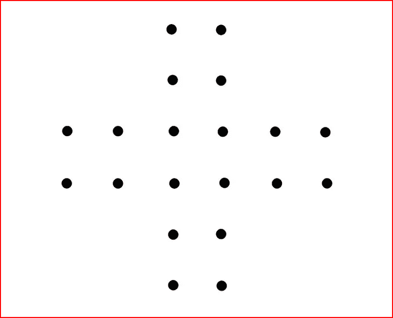
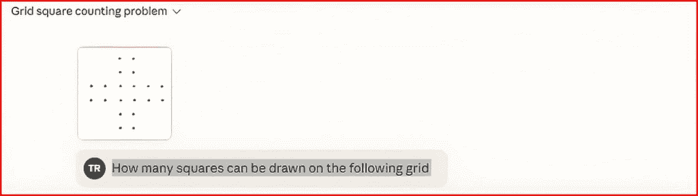
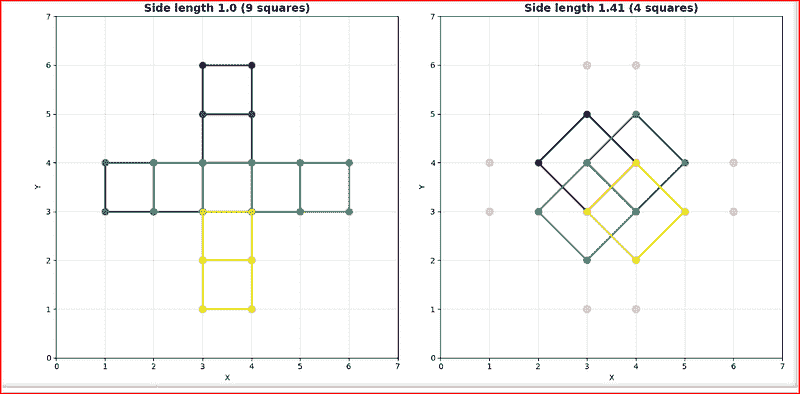
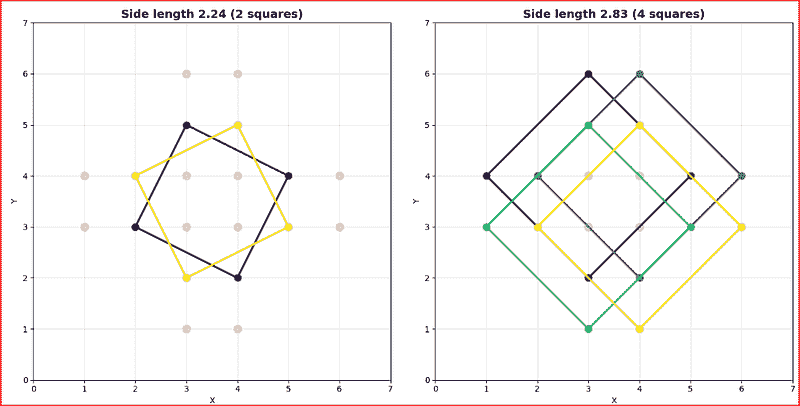
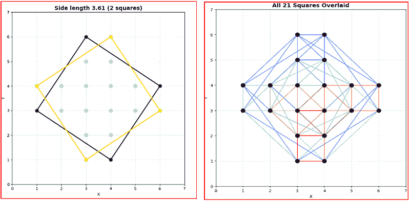

# 这个谜题展示了 LLM 在短短一年多的时间里取得了多么大的进步

> 原文：[`towardsdatascience.com/this-puzzle-shows-just-how-far-llms-have-progressed-in-little-over-a-year/`](https://towardsdatascience.com/this-puzzle-shows-just-how-far-llms-have-progressed-in-little-over-a-year/)

<mdspan datatext="el1759821031680" class="mdspan-comment">我们都知道</mdspan>，LLM 的能力在过去几年里有了显著的进步，但很难量化它们变得有多好。

这让我回想起去年在一个 YouTube 频道上遇到的一个几何问题。这是在 2024 年 6 月，我试图让当时领先的大型语言模型（GPT-4o）来解决这个问题。结果并不理想，需要***大量***的精力来找到解决方案，我很好奇最新的 LLM 们面对同样的谜题会有怎样的表现。

## 谜题

这里是一个快速提醒，当时我要求 LLM 解决的问题。假设我们有以下网格的点/节点。在 x 和 y 平面上，每个节点与其相邻节点正好相距一个单位。它看起来像这样，



现在，我想回答的问题是这个，

```py
How many distinct squares can be drawn on this diagram?
```

很快就清楚，GPT-4o 不知道答案，所以我稍微改变了策略，转而问它这个问题。

```py
I would like a Python program that plots out all the squares we can 
draw on the attached diagram, assuming that the corners of any square 
must lie on one of the spots on the diagram. Assume each adjacent spot is 
1 unit apart in both the x and y directions. Also print out a summary of 
the number of squares of the same size and what their side lengths are
```

简而言之，我***最终***让 GPT-4o 提出了一个基于 Python 的正确解决方案。尽管如此，我花了大约两个小时，并且进行了超过 40 次的来回与模型互动来完善答案，直到它提出了一个可行的方案。

> NB，你算出答案了吗？即使现在，我仍然难以相信这个图上可以画出 21 个方格。

## 与 Sonnet 4.5 的互动

这把我们带回了现在，以及 Anthropic 最近发布的被认为是今天最好的编码模型，即 Claude Sonnet 4.5。自从我上次查看这个模型以来已经过去了 16 个月，那么在这段时间里 LLM 们又提高了多少呢？让我们看看 Sonnet 4.5 如何应对这个谜题。

要使用 Sonnet 4.5，我访问了 Anthropic 的主页。

[`www.anthropic.com`](https://www.anthropic.com)

你应该看到一个类似的页面。


Anthropic 网站上的图片

点击屏幕右上角附近的大号黑色**“尝试 Claude”**按钮。此时，你将被要求登录。如果你还没有在 Anthropic 的账户，请现在创建一个。这样做是完全免费的。

登录后，你将被带到显示熟悉的基于聊天的窗口的屏幕，允许你与 Sonnet 4.5 互动并提问。

在我要求模型提供一个 Python 程序来解决这个谜题之前，我直接问了一个问题，看看它是否已经知道答案。



它返回了，

```py
Looking at this grid, I need to count all possible squares of different 
sizes that can be formed by connecting the dots.
Let me first identify the grid structure. The dots form:

2 dots in the top row
2 dots in the second row
6 dots in the third row
6 dots in the fourth row
2 dots in the fifth row
2 dots in the sixth row

This appears to be a cross or plus-sign shaped grid pattern.
Now I'll count squares by size:
1×1 squares: These are formed by any 4 dots that make a unit square.

In the horizontal middle section (rows 3-4): 5 squares per row × 1 = 5 squares
In the vertical middle section (columns where the cross intersects): counting 
the vertical segments gives us 5 more squares
Total: 10 small squares

2×2 squares: These need 4×4 arrangements of dots.

In the horizontal section: 4 squares
In the vertical section: 4 squares
Overlap in center: -1 (counted twice)
Total: 7 squares of size 2×2

3×3 squares and larger: The grid pattern is only 6 dots wide at its maximum, but the cross shape limits where larger squares can fit. Checking the geometry:

One 3×3 square can fit in the center where the arms of the cross overlap
Total: 1 square of size 3×3

Total: 10 + 7 + 1 = 18 squares
```

所以，自信地错误。对模型关于 3x3 正方形（在这个网格上不可能）的引用感到好奇和好奇，我要求它向我展示图上的正方形。它回复了以下内容。

```py
Looking at the grid more carefully, I need to reconsider whether a 3×3 square 
actually exists.
For a 3×3 square to exist, I would need a 4×4 arrangement of dots 
(since a 3×3 square requires 4 dots on each side). Let me check the grid 
structure:
The grid appears to be:

Rows 1-2: only 2 dots each (centered)
Rows 3-4: 6 dots each (full width)
Rows 5-6: only 2 dots each (centered)

For a 3×3 square, I would need 4 consecutive rows and 4 consecutive columns all with dots at the intersection points. However, looking at the cross/plus pattern:

The top only has 2 columns of dots
The middle has 6 columns of dots
The bottom only has 2 columns of dots

Since rows 1-2 and rows 5-6 only have 2 dots each (not spanning the full width)
, there isn't actually a 4×4 block of dots anywhere on this grid.
I need to correct my answer: There is NO 3×3 square possible on this grid.
The total should be: 10 (1×1 squares) + 7 (2×2 squares) = 17 squares
I apologize for the error in my initial count. The cross-shaped pattern 
prevents any square larger than 2×2 from being formed.
```

好吧，它通过那个答案部分地救赎了自己，但本质上，它并没有正确地说出总共有 21 个正方形。

## 最终答案

为了在 16 个月的模型比较中保持公平，我向 Sonnet 4.5 提出了与我之前问 GPT-4o 完全相同的问题，提醒一下，这个问题是这样的。

```py
I would like a Python program that plots out all the squares we can draw on 
the attached diagram, assuming that the corners of any square must lie on one 
of the spots on the diagram. Assume each adjacent spot is 1 unit apart in 
both the x and y directions. Also print out a summary of the number of 
squares of the same size and what their side lengths are
```

Sonnet 4.5 思考了 5 秒钟就生成了它的 Python 代码。

```py
import matplotlib.pyplot as plt
import numpy as np
from itertools import combinations
from collections import defaultdict

# Define the grid points based on the image
points = [
    # Top two rows (2 dots each, centered)
    (3, 6), (4, 6),
    (3, 5), (4, 5),
    # Middle two rows (6 dots each, full width)
    (1, 4), (2, 4), (3, 4), (4, 4), (5, 4), (6, 4),
    (1, 3), (2, 3), (3, 3), (4, 3), (5, 3), (6, 3),
    # Bottom two rows (2 dots each, centered)
    (3, 2), (4, 2),
    (3, 1), (4, 1),
]

def is_square(p1, p2, p3, p4):
    """Check if four points form a square and return side length if true."""
    points = [p1, p2, p3, p4]

    # Calculate all pairwise distances
    distances = []
    for i in range(len(points)):
        for j in range(i + 1, len(points)):
            dist = np.sqrt((points[i][0] - points[j][0])**2 + 
                          (points[i][1] - points[j][1])**2)
            distances.append(dist)

    distances.sort()

    # For a square: 4 equal sides and 2 equal diagonals
    # Diagonals should be sqrt(2) times the side length
    if len(distances) == 6:
        sides = distances[:4]
        diagonals = distances[4:]

        # Check if all sides are equal
        if np.allclose(sides, [sides[0]] * 4, atol=1e-6):
            # Check if diagonals are equal
            if np.allclose(diagonals, [diagonals[0]] * 2, atol=1e-6):
                # Check if diagonal = side * sqrt(2)
                if np.allclose(diagonals[0], sides[0] * np.sqrt(2), atol=1e-6):
                    return True, sides[0]

    return False, 0

def order_square_points(p1, p2, p3, p4):
    """Order points of a square in counterclockwise order starting from bottom-left."""
    points = [p1, p2, p3, p4]
    # Find centroid
    cx = sum(p[0] for p in points) / 4
    cy = sum(p[1] for p in points) / 4

    # Sort by angle from centroid
    def angle(p):
        return np.arctan2(p[1] - cy, p[0] - cx)

    points.sort(key=angle)
    return points

# Find all squares
squares = []
squares_by_size = defaultdict(list)

for combo in combinations(points, 4):
    is_sq, side_length = is_square(*combo)
    if is_sq:
        ordered = order_square_points(*combo)
        squares.append(ordered)
        squares_by_size[round(side_length, 2)].append(ordered)

# Print summary
print("=" * 50)
print("SUMMARY OF SQUARES FOUND")
print("=" * 50)
total_squares = 0
for side_length in sorted(squares_by_size.keys()):
    count = len(squares_by_size[side_length])
    total_squares += count
    print(f"Side length {side_length}: {count} square(s)")

print(f"\nTotal squares: {total_squares}")
print("=" * 50)

# Create visualization
fig, axes = plt.subplots(2, 2, figsize=(14, 14))
axes = axes.flatten()

# Plot 1: All dots
ax = axes[0]
x_coords = [p[0] for p in points]
y_coords = [p[1] for p in points]
ax.scatter(x_coords, y_coords, c='black', s=100, zorder=3)
ax.set_xlim(0, 7)
ax.set_ylim(0, 7)
ax.set_aspect('equal')
ax.grid(True, alpha=0.3)
ax.set_title('Original Grid', fontsize=14, fontweight='bold')
ax.set_xlabel('X')
ax.set_ylabel('Y')

# Plot 2: All squares overlaid
ax = axes[1]
ax.scatter(x_coords, y_coords, c='black', s=100, zorder=3)
colors = plt.cm.rainbow(np.linspace(0, 1, len(squares)))
for square, color in zip(squares, colors):
    square_closed = square + [square[0]]
    xs = [p[0] for p in square_closed]
    ys = [p[1] for p in square_closed]
    ax.plot(xs, ys, c=color, linewidth=2, alpha=0.6)
ax.set_xlim(0, 7)
ax.set_ylim(0, 7)
ax.set_aspect('equal')
ax.grid(True, alpha=0.3)
ax.set_title(f'All {total_squares} Squares Overlaid', fontsize=14, fontweight='bold')
ax.set_xlabel('X')
ax.set_ylabel('Y')

# Plot 3 & 4: Squares by size
plot_idx = 2
for side_length in sorted(squares_by_size.keys()):
    if plot_idx >= len(axes):
        break

    ax = axes[plot_idx]
    ax.scatter(x_coords, y_coords, c='lightgray', s=100, zorder=2)

    squares_of_size = squares_by_size[side_length]
    colors = plt.cm.viridis(np.linspace(0, 1, len(squares_of_size)))

    for square, color in zip(squares_of_size, colors):
        square_closed = square + [square[0]]
        xs = [p[0] for p in square_closed]
        ys = [p[1] for p in square_closed]
        ax.plot(xs, ys, c=color, linewidth=2.5, marker='o', markersize=8)

    ax.set_xlim(0, 7)
    ax.set_ylim(0, 7)
    ax.set_aspect('equal')
    ax.grid(True, alpha=0.3)
    ax.set_title(f'Squares with side length {side_length} ({len(squares_of_size)} total)', 
                 fontsize=14, fontweight='bold')
    ax.set_xlabel('X')
    ax.set_ylabel('Y')
    plot_idx += 1

plt.tight_layout()
plt.show()
```

初看之下，我以为 Sonnet 不可能这么快就找到正确的解决方案。GPT-4ohad ***花费了几个小时***。然而，我安装了代码所需的全部库，并将其复制粘贴到一个 Jupyter Notebook 单元格中，运行它并获得了以下输出。目前我省略了图表，这些图表也被输出了。

```py
==================================================
SUMMARY OF SQUARES FOUND
==================================================
Side length 1.0: 9 square(s)
Side length 1.41: 4 square(s)
Side length 2.24: 2 square(s)
Side length 2.83: 4 square(s)
Side length 3.61: 2 square(s)

Total squares: 21
==================================================

#
# Plus some graphs that I'm not showing here
#
```

这让我震惊。答案完全准确。

唯一不太对劲的地方是，模型没有输出不同尺寸的正方形集的图表。它只是做了九个 1x1 的和四个√2x√2 的正方形。我通过让 Sonnet 也包括那些正方形来解决这个问题。

```py
Can you print the graphs in square side order. Also can you have two graphs  
side by side on each "line"
```

这是它给出的答案。



美丽。

## 摘要

为了展示 LLMs 在一年左右的时间里取得了多么显著的进步，我决定重新审视一个挑战性的几何难题，我最初是在 2024 年 6 月尝试用 GPT-4o 解决这个难题的。这个难题是编写一个 Python 程序，找到并绘制特定十字形点阵上的所有可能正方形。

大约一年前我的经历是挣扎的；我花了大约两个小时和 40 多个提示来引导 GPT-4o 找到一个正确的 Python 解决方案。

快进到今天，我测试了新的 Claude Sonnet 4.5。当我第一次直接向模型提问时，它未能计算出正确的正方形数量。然而，真正的考验是给它我之前在 GPT-4o 上使用的**完全相同的提示**。

令我惊讶的是，它一次就给出了一个完整的、正确的 Python 解决方案。它生成的代码不仅找到了所有 21 个正方形，而且根据它们独特的边长正确地将它们分类，并生成了详细的图表来可视化它们。虽然我需要一次快速的后续提示来完善图表，但核心问题瞬间得到了解决。

难道是我去年试图解决这个问题并发布我的发现，将其引入了网络世界，意味着 Anthropic 只是爬取了它并将其纳入他们的模型知识库？是的，我想这可能是原因，但为什么模型不能正确回答我第一次问它的关于正方形总数的问题呢？

对我来说，这个实验鲜明地展示了 LLM 能力上的惊人飞跃。16 个月前，与当时领先模型进行两小时的迭代斗争，如今却变成了今天与领先模型的一次性五秒成功。
