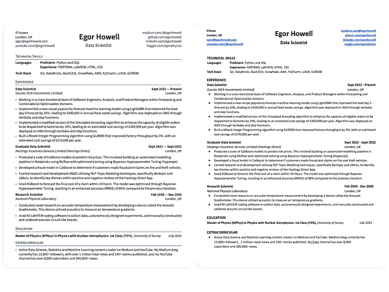
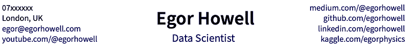
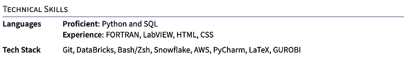
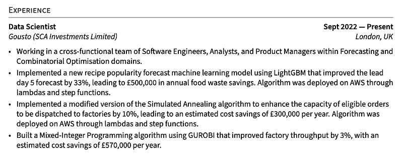
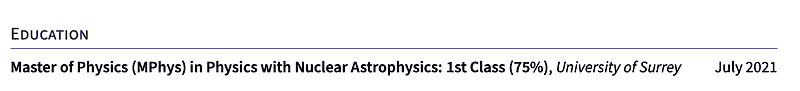
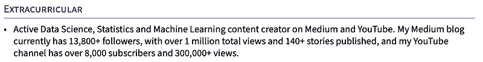

# 我如何定制简历，获得 10 万+美元的数据科学和机器学习报价

> 原文：[`towardsdatascience.com/this-resume-landed-me-100k-data-science-ml-offers/`](https://towardsdatascience.com/this-resume-landed-me-100k-data-science-ml-offers/)

<mdspan datatext="el1760986204715" class="mdspan-comment">我已经审查了</mdspan>超过 100 份数据科学和机器学习简历，无论是作为该领域的从业者还是职业导师。

诚实地讲，其中大多数都**很糟糕**。

实际上，写一份好的简历并不难，但许多人似乎无法掌握基本要点。

一份好的简历是让你进入面试的第一步，因此掌握面试过程中的这一部分至关重要。

因此，在这篇文章中，我想带你们看看我的简历，它让我在数据科学和机器学习领域获得了多个 10 万+美元的报价，并在我每个部分提供关键建议。

## 简历（概览）

如果你没有时间阅读整篇文章，这是来自 [LaTeX](https://www.latex-project.org/)（使用 [Overleaf](https://www.overleaf.com/project)）的 PDF 格式简历和一个 Google 文档版本。

图片由作者提供。

如果你想要获取这个模板并学习如何应用它，请查看下面的链接。

[**https://resume.egorhowell.com**](https://resume.egorhowell.com)

我有两个版本的原因是，LaTeX 生成的 PDF 版本看起来更美观，[但与申请跟踪系统（ATS）可能会有问题](https://academia.stackexchange.com/questions/193671/do-applicant-tracking-systems-ats-struggle-with-latex-generated-resumes)。

这也是为什么我有一个单独的 Google 文档格式版本，它对 ATS 更加友好。

ATS 本质上是一个自动化系统，帮助筛选与工作角色或描述不匹配的候选人。像任何系统一样，它有缺陷，有时难以解析格式，例如由 LaTeX 生成的 PDF 版本。

[几乎所有财富 500 强公司（99%）](https://www.selectsoftwarereviews.com/blog/applicant-tracking-system-statistics) 都使用 ATS 进行招聘，而 [75%的简历未能通过 ATS](https://www.expertresumepros.com/post/the-shocking-of-resumes-that-fail-employers-applicant-tracking-software-ats-system) 并且从未被招聘人员看到。

因此，如果我在一个没有保证有真人会看到我的简历的场景下申请，比如 LinkedIn 快速申请或 Indeed 工作表单，我会使用 Google 文档格式以确保安全。

如果我知道招聘人员、招聘经理或其他任何真人会看到我的简历，那么我会提供从 LaTeX/Overleaf 生成的 PDF 版本。

让我们现在逐个分析每个部分，并分享我的顶级技巧！

> *这个 LaTeX 模板是基于 Timmy Chan 的[这个模板](https://www.overleaf.com/latex/templates/data-science-tech-resume-template/zcdmpfxrzjhv)。你可以在他的 GitHub 上查看[源代码](https://github.com/TimmyChan/data-science-tech-resume-template)。模板和代码受[Creative Commons CC BY 4.0 许可](https://creativecommons.org/licenses/by/4.0/deed.en)保护。*

## 基本原则

我将概述你的简历应该遵循的最基本的原则。我认为你可能至少遗漏了这些点中的一个：

+   绝对不能有拼写错误，语法也要正确。这对任何审查简历的人来说都是一个很大的红旗。

+   保持一页，除非你有 10 年以上的经验。

+   字体大小在各个部分之间保持一致，并避免过度使用**粗体**和*斜体*。

+   不要使用花哨的格式，保持简单。

+   不要使用图形、图像或图标。

+   避免任何可能导致偏见的内容，如年龄、性别、国籍等。

+   使用项目符号，而不是块文本。

+   对于你的 Google Doc 版本，使用易于阅读的字体，例如 Times New Roman、Calibri 或 Georgia。

+   对于你的 PDF 版本，我强烈推荐使用 LaTeX，因为它可以生成干净且美观的简历。

+   最后，如果你有时间，请将简历中的每个部分都定制到相应的职位描述中。

## 标题

标题。

这个部分应该很容易做对，但我仍然惊讶于人们竟然会在这个部分出错。

你所需要的只是：

+   你的名字。

+   职位名称或你如何看待自己。这是可选的。

+   联系方式，如电话号码和电子邮件。

+   位置、城市和国家。

+   相关链接，如 LinkedIn、GitHub、Medium、Kaggle 等。有一点需要确保的是，链接是有效的！它们包含关于你的有用信息，所以你想要确保点击链接的人实际上会去你想让他们去的地方。

## 总结陈述

如果你的简历清楚地说明了你做了什么以及你是谁，那么这个部分就不是必要的。你会重复自己，并且可能会占用简历上宝贵的空间。

例如，我个人没有总结陈述，而且这并没有影响我（至少据我所知是这样！）。然而，当你想要针对特定的公司或职位进行定制，或者甚至想要在 ATS（自动跟踪系统）上玩点花样时，这可能会很有益处。

我要说的一个关键点是，使用像“热情”、“勤奋”或“决心”这样的词很容易出错。

*不要这样做*。

我无法告诉你我见过多少份简历，其中的人声称自己是勤奋的、有动力的和充满热情的个体。

这就是任何公司想要雇佣的人的基本标准。

一个好的总结陈述明确地用几句话说明你是谁以及你做了什么。

例如，如果我要为自己做这件事，我会写。

> *拥有 4 年以上经验的数据科学家/机器学习工程师，专注于时间序列预测、运筹学/优化问题和应用机器学习。我的领域专业知识在于保险、供应链和物流业务领域，这些领域是我曾经工作过的各种公司。*

没有废话，直接切入要点。

## 技术技能

技术技能

这是对你所有能力的非常简短的总结，实际上不应超过 4-5 行，这已经很接近极限了。

这在简历中非常重要，因为它会立即帮助招聘人员了解你是否符合工作的技术要求。

现在，通常，候选人会在这一部分引入许多红旗，而他们甚至没有意识到。他们认为他们正在添加招聘人员和招聘经理想要看到的东西，但实际上正好相反。

让我们分析最常见的错误：

+   不要列出太多的技术；这看起来可疑。如果你列出了像“Python、SQL、C++、Rust、汇编”这样的东西，我会怀疑。这看起来像是一堆流行词汇，我会觉得你不太可能对它们都达到合理的水平。

+   当谈到编码能力时，最好使用“熟练”或“熟悉”这样的语言。避免使用任意的星级评分，如“Python 4/5”或声称自己是“高级”。这样，你设定了现实的期望，并确保你的技能得到准确的表现。我的标准是，如果你觉得在这个语言中回答简单的 Leetcode 问题感到舒适，那么你就是熟练的。

+   不要列出你所知道的每一个 Python 包。如果你正在申请数据科学职位，我假设你熟悉 NumPy、Pandas 和 Matplotlib；没有必要明确地陈述这一点。相反，列出像 Git、AWS、Argo、Bash 和 Databricks 这样的实际技术，这些技术并不是每个候选人都会有的。

## 经验/项目

经验。

这里最重要的部分是展示你在每家公司所做的一切以及结果如何，始终使用**数字**和**图表**。理想情况下，它们应该是财务影响。

不要过于谦虚；真正“展示”你所做的工作和产生的影响。真正展示你的技能。

例如，注意在我的简历中我是如何讨论像“ARIMAX”或“XGBoost”这样的技术步骤或模型，目的是为了更好地预测或预测某些业务问题，提到使用某些指标改进模型，并将其最终与业务影响联系起来。

这展示了我的技术能力，以及我在项目中考虑业务影响。

如果你仔细想想，公司只关心你为他们带来的财务利益。无论你使用神经网络还是线性回归，这都不重要。

*利润就是利润*。

这可能看起来有些简化，但这是真的，所以如果你能精确展示如何将像机器学习这样的技术主题与业务成果联系起来，那么你比 80%的申请者做得更好。

这是我为经验部分中的每个项目符号推荐你遵循的框架：

+   *说明你分析了什么，预测了什么或建模了什么。*

+   *说明你使用了哪些技术、算法和统计工具。*

+   *说明你改进的指标。*

+   *说明你创造的商业价值。*

另一件事是，不要害怕明确说明你使用的确切技术、软件包和算法。这样做比使用模糊的语言更好，这也会让你更好地通过 ATS。

一些额外的，但可以说是明显的事情是：

+   只包括有偿工作经验，但研究经验也可以。

+   从你最近的工作开始，按时间顺序倒序排列。

+   区分实习和全职职位。

+   不要使用子项目符号；它们不是必需的。

如果你没有经验，可以用项目部分替换这部分，并就技术和商业部分进行类似的措辞。尽量列出与你要申请的职位最相关的项目，以展示你对该特定领域的兴趣。

## 教育

教育。

如果你没有相关工作经验，我建议将教育部分放在工作经验之前，然后是项目部分。

由于我有 4+年的经验，我的教育部分相当简单。我保留它，因为许多数据科学和机器学习工作明确表示需要 STEM 学科的硕士学位。

如果你没有经验，你可以充实这个教育部分，并讨论你在学位期间完成的任何相关工作。然而，我不建议列出所有模块，因为这有点过度，而且说实话，没有人真的会读它或关心。还有一些额外的事情要考虑

+   如果你的成绩很出色，就列出来；如果不怎么样，就留空。

+   列出你做过的任何相关专门事情，比如黑客马拉松、项目等。

+   列出你在学校期间获得的任何奖项和奖品。

+   留出课程证书，除非是像“AWS 实践者”这样的东西，或者你还有很多空间。

## 活动 / 课外活动

课外活动。

这部分是可选的，很多人都会说不要添加这个部分。

然而，我持不同意见，认为在简历中展示一点个性并不是坏事，但这绝对不是必需的，而且如果你空间不足，这将是第一个要删除的部分。

我用这部分来展示我的 YouTube 频道和博客文章，因为这增加了我的简历和申请，但这是一个罕见的情况。

所以，如果你有类似的事情想要提及，这个部分非常适合这个目的。

* * *

之前，我讨论了如果你没有任何经验，你应该用项目部分来替代这一点。

但你应该做什么项目才能被雇佣？

好吧，这正是我在之前的一篇文章中回答过的问题，您可以在下面查看：

> [停止构建无用的机器学习项目——真正有效的方法](https://towardsdatascience.com/stop-building-useless-ml-projects-what-actually-works/)

## 另一件事！

我提供一对一的辅导通话，我们可以聊任何你需要的事情——无论是项目、职业建议，还是只是确定你的下一步。我在这里帮助你前进！

[**1:1 与 Egor Howell 的辅导通话**](https://egorhowell.com/)

*职业指导、工作建议、项目帮助、简历审查*topmate.io](https://topmate.io/egorhowell/1203300)

## 与我联系

+   [**YouTube**](https://www.youtube.com/@egorhowell)

+   [**LinkedIn**](https://www.linkedin.com/in/egorhowell/)

+   [**Instagram**](https://www.instagram.com/egorhowell/)

+   [**网站**](https://egorhowell.com/)
