# 时间序列预测简单化（第二部分）：定制基线模型

> 原文：[`towardsdatascience.com/time-series-forecasting-made-simple-part-2-customizing-baseline-models/`](https://towardsdatascience.com/time-series-forecasting-made-simple-part-2-customizing-baseline-models/)

<mdspan datatext="el1746819645016" class="mdspan-comment">感谢</mdspan>您对第一部分的友好回应，看到这么多读者对时间序列预测感兴趣，我们感到鼓舞。

在[**本系列的第一部分**](https://towardsdatascience.com/time-series-forecasting-made-simple-part-1-decomposition-baseline-models/)中，我们将时间序列数据分解为趋势、季节性和噪声，讨论了何时使用加法模型与乘法模型，并使用每日温度数据构建了季节性简单基线预测。我们使用 MAPE（平均绝对百分比误差）来评估其性能，结果为 28.23%。

虽然季节性简单模型捕捉到了广泛的季节性模式，但我们还看到它可能不是这个数据集的最佳拟合，因为它没有考虑到季节性的微妙变化或长期趋势。这突出了超越基本基线并定制预测模型以更好地反映潜在数据以提高准确性的必要性。

当我们应用季节性简单基线模型时，我们没有考虑趋势或使用任何数学公式，我们只是根据前一年的同一天预测每个值。

首先，让我们看一下下面的表格，它概述了一些常见的基线模型以及何时使用每个模型。

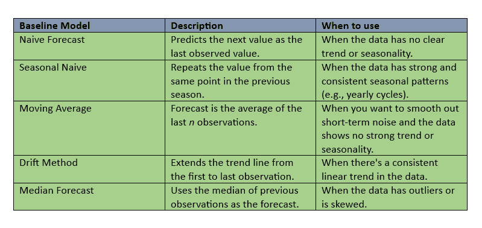

**表格：常见的基线预测模型、它们的描述以及根据数据模式何时使用每个模型**。

这些是在各个行业中广泛使用的最常见的基线模型。

但如果数据显示了**趋势和季节性**呢？在这种情况下，这些简单的基线模型可能就不够了。正如我们在**第一部分**中看到的，**季节性简单模型**在完全捕捉数据模式方面遇到了困难，导致 MAPE（平均绝对百分比误差）为**28.23%**。

那么，我们应该直接跳到**ARIMA**或其他复杂预测模型吗？

**不一定**。

在寻求高级工具之前，我们首先可以根据数据结构构建我们的基线模型。这有助于我们建立一个更强的基准——而且通常，这足以决定是否需要更复杂的模型。

现在我们已经检查了数据结构，它明显包括趋势和季节性，我们可以构建一个考虑这两个成分的基线模型。

在第一部分中，我们使用 Python 中的**季节分解**方法来可视化数据中的趋势和季节性。现在，我们将更进一步，实际上从这种分解中提取趋势和季节性成分，并使用它们来构建**基线预测**。

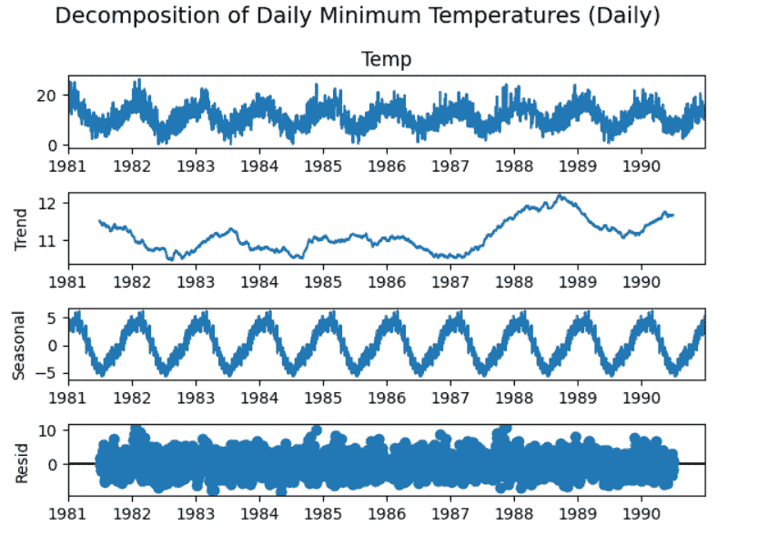

每日温度分解，显示趋势、季节周期和随机波动。

但在我们开始之前，让我们看看季节分解方法是如何确定我们的数据中的趋势和季节性的。

在使用内置函数之前，让我们从我们的温度数据中取一个小样本，并手动检查季节分解方法是如何分离趋势、季节性和残差的。

这将帮助我们理解幕后真正发生的事情。

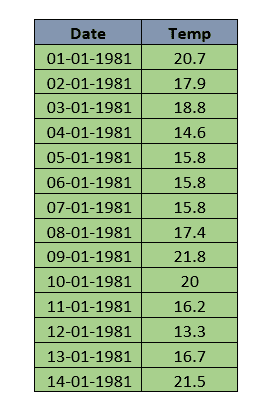

温度数据样本

这里，我们考虑从温度数据集中选取 14 天的样本，以更好地理解分解是如何一步一步进行的。

我们已经知道这个数据集遵循加性结构，这意味着每个观测值由三个部分组成：

观测值 = 趋势 + 季节性 + 残差。

首先，让我们看看这个样本的趋势是如何计算的。

我们将使用 3 天中心移动平均，这意味着每个值与其两侧的邻近值平均。这有助于平滑数据中的日波动。

例如，为了计算 1981 年 2 月 1 日的趋势：

趋势 = (20.7 + 17.9 + 18.8) / 3

= 19.13

这样，我们计算了样本中 14 天的趋势成分。

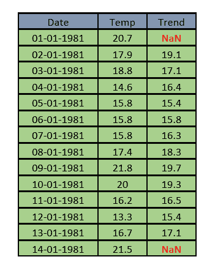

这里是表格，显示了 14 天样本中每一天的 3 天中心移动平均趋势值。

如我们所见，第一和最后日期的趋势值是‘NaN’，因为在那些点没有足够的邻近值来计算中心平均。

一旦我们计算完季节性和残差成分，我们将重新检查那些缺失的值。

在我们深入研究季节性之前，我们之前提到的一些事情我们应该回过头来。我们提到使用 3 天中心移动平均有助于平滑数据中的日波动——但这到底是什么意思呢？

让我们通过一个快速示例来使其更清晰。

我们已经讨论过趋势反映了数据整体移动的方向。

温度通常在夏季较高，在冬季较低，这是我们预期的广泛季节性模式。

但即使在夏季，温度也不会每天都完全相同。有些日子可能比其他日子稍微凉爽或温暖。这些都是自然的日波动，不是突然气候变化迹象。

移动平均帮助我们平滑这些短期波动，这样我们就可以关注更大的图景，即时间上的潜在趋势。

由于我们在这里使用的是小样本，趋势可能还没有明显突出。

但如果你看上面的完整分解图，你可以看到趋势如何捕捉数据整体移动的方向，随着时间的推移逐渐上升、下降或保持稳定。

现在我们已经计算了趋势，是时候继续到下一个组成部分：季节性。

我们知道在加性模型中：

观测值 = 趋势 + 季节性 + 残差

为了隔离季节性，我们首先从观察值中减去趋势：

观察值 - 趋势 = 季节性 + 剩余

结果被称为去趋势序列——季节性模式和任何剩余的随机噪声的组合。

以 1981 年 1 月 2 日为例。

观察到的温度：17.9°C

趋势：19.13°C

因此，去趋势值是：

去趋势 = 17.9 – 19.1 = -1.23

同样，我们计算样本中所有日期的去趋势值。

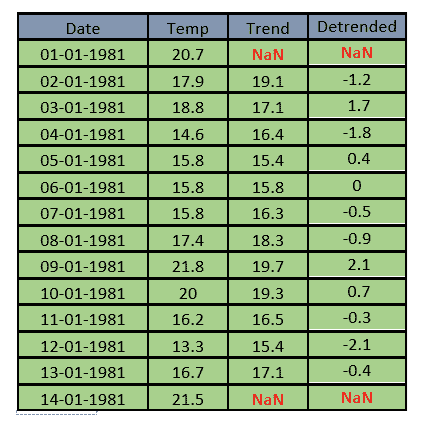

上表显示了 14 天样本中每个日期的去趋势值。

由于我们正在处理 14 个连续的日期，我们将假设每周的季节性，并根据其在 7 天周期中的位置为每个日期分配一个日指数（从 1 到 7）。

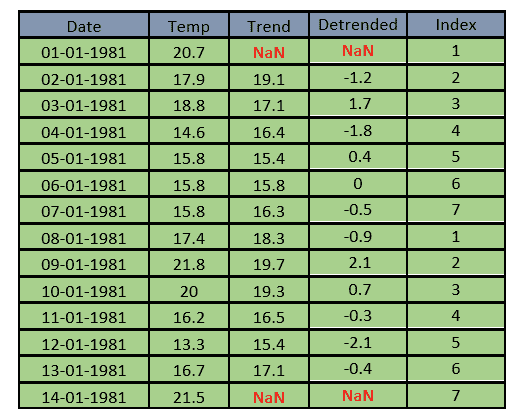

现在，为了估计季节性，我们取具有相同日指数的去趋势值的平均值。

让我们计算 1981 年 1 月 2 日的季节性。这个日期的日指数是 2，我们样本中具有相同指数的另一个日期是 1981 年 1 月 9 日。为了估计这个指数的季节性效应，我们取这两个日期去趋势值的平均值。这个季节性效应然后将分配给周期中具有指数 2 的每个日期。

对于 1981 年 1 月 2 日：去趋势值 = -1.2，并且

对于 1981 年 1 月 9 日：去趋势值 = 2.1

两个值的平均值 = (-1.2 + 2.1)/2

= 0.45

因此，0.45 是所有具有指数 2 的日期估计的季节性。

我们对每个指数重复此过程，以计算完整的一组季节性成分。

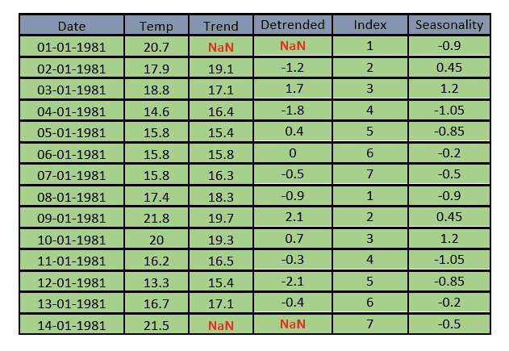

这里是所有日期的季节性值，这些季节性值反映了整个一周的重复模式。例如，指数为 2 的日期平均比趋势高约 0.45°C，而指数为 4 的日期平均比趋势低 1.05°C。

**注意**：当我们说指数为 2 的日期平均比趋势高约+0.45°C 时，我们的意思是像 1 月 2 日和 1 月 9 日这样的日期通常比它们自己的趋势值高出约 0.45°C，而不是与整体数据集的趋势相比，而是与每天特定的局部趋势相比。

现在我们已经计算了每天的季节性成分，你可能会注意到一些有趣的事情：即使趋势（因此去趋势值）缺失的日期，例如我们样本中的第一个和最后一个日期——仍然收到了一个季节性值。

这是因为季节性是根据日指数分配的，它遵循一个重复的周期（如我们每周示例中的 1 到 7）。

因此，如果 1 月 1 日缺少趋势但与例如 1 月 8 日具有相同的指数，它将继承使用该指数组有效数据计算出的相同季节性效应。

换句话说，季节性并不取决于特定日期趋势的可用性，而更多地取决于在整个周期中具有相同位置的日期观察到的模式。

现在我们根据已知的加性分解结构来计算残差：

观测值 = 趋势 + 季节性 + 残差

…这意味着：

残差 = 观测值 – 趋势 – 季节性

你可能想知道，如果我们用来计算季节性的去趋势值中已经包含了残差，我们如何现在还能将它们分离出来？答案来自于平均。当我们根据季节位置（如日索引）对去趋势值进行分组时，随机噪声往往会相互抵消。我们剩下的就是重复的季节性信号。在小数据集中，这可能不太明显，但在大数据集中，效果则更为明显。现在，在去除了趋势和季节性之后，剩下的就是残差。

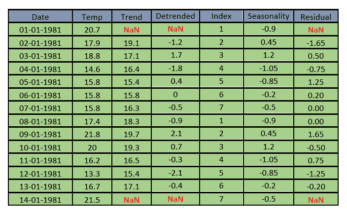

我们可以观察到，由于中心移动平均，第一和最后日期没有计算残差，因为那里没有可用趋势。

让我们看一下我们 14 天样本的最终分解表。这个表汇集了观测温度、提取的趋势和季节性成分以及产生的残差。

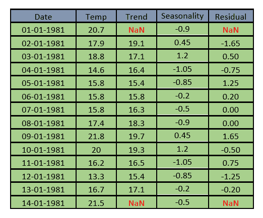

现在我们已经计算了样本的趋势、季节性和残差，让我们回到之前提到的缺失值。如果你查看整个数据集的分解图，标题为**“每日温度分解显示趋势、季节周期和随机波动”**，你会注意到趋势线并没有出现在序列的开始处。残差也是如此。这是因为计算趋势需要每个点前后足够的数据，所以前几个和最后几个值没有定义的趋势。这也是为什么我们在边缘看到缺失的残差。但在大数据集中，这些缺失值只占很小一部分，不会影响整体解释。你仍然可以清楚地看到趋势和随时间变化的模式。在我们的 14 天小样本中，这些缺口感觉更明显，但在现实世界的时序数据中，这是完全正常和预期的。

现在我们已经了解了 seasonal_decompose 的工作原理，让我们快速看一下我们用来将其应用于温度数据并提取趋势和季节性成分的代码。

```py
import pandas as pd
import matplotlib.pyplot as plt
from statsmodels.tsa.seasonal import seasonal_decompose

# Load the dataset
df = pd.read_csv("minimum daily temperatures data.csv")

# Convert 'Date' to datetime and set as index
df['Date'] = pd.to_datetime(df['Date'], dayfirst=True)
df.set_index('Date', inplace=True)

# Set a regular daily frequency and fill missing values using forward fill
df = df.asfreq('D')
df['Temp'].fillna(method='ffill', inplace=True)

# Decompose the daily series (365-day seasonality for yearly patterns)
decomposition = seasonal_decompose(df['Temp'], model='additive', period=365)

# Plot the decomposed components
decomposition.plot()
plt.suptitle('Decomposition of Daily Minimum Temperatures (Daily)', fontsize=14)
plt.tight_layout()
plt.show()
```

让我们关注这段代码：

`decomposition = seasonal_decompose(df['Temp'], model='additive', period=365)`

在这一行中，我们告诉函数使用什么数据（`df['Temp']`），应用什么模型（`additive`），以及考虑的季节周期（`365`），这与我们每日温度数据中的年周期相匹配。

在这里，我们根据数据结构设置`period=365`。这意味着趋势是通过一个 365 天中心移动平均来计算的，每个点前后有 182 个值。季节性是通过 365 天的季节指数计算的，其中所有年份的 1 月 1 日值被分组并平均，所有 1 月 2 日值被分组，依此类推。

当在 Python 中使用`seasonal_decompose`时，我们只需提供`period`，函数将使用该值来确定趋势和季节性应该如何计算。

在我们之前的 14 天样本中，我们使用 3 天中心平均只是为了使数学更易于理解——但底层逻辑保持不变。

现在我们已经探讨了`seasonal_decompose`的工作原理，并理解了它是如何将时间序列分解为趋势、季节性和残差的，我们准备好构建一个基线预测模型。

这个模型将通过简单地添加提取的趋势和季节性成分来构建，本质上假设残差（或噪声）为零。

一旦我们生成了这些基线预测，我们将通过使用 MAPE（平均绝对百分比误差）将它们与实际观察值进行比较来评估它们的性能。

在这里，我们忽略残差，因为我们正在构建一个简单的基线模型，作为基准。目标是测试是否更高级的算法真正必要。

我们主要感兴趣的是看看数据中的多少变化可以用趋势和季节性成分来解释。

现在我们将使用 Python 的`seasonal_decompose`提取趋势和季节性成分来构建基线预测。

**代码：**

```py
import pandas as pd
import matplotlib.pyplot as plt
from statsmodels.tsa.seasonal import seasonal_decompose
from sklearn.metrics import mean_absolute_percentage_error

# Load the dataset
df = pd.read_csv("/minimum daily temperatures data.csv")

# Convert 'Date' to datetime and set as index
df['Date'] = pd.to_datetime(df['Date'], dayfirst=True)
df.set_index('Date', inplace=True)

# Set a regular daily frequency and fill missing values using forward fill
df = df.asfreq('D')
df['Temp'].fillna(method='ffill', inplace=True)

# Split into training (all years except final) and testing (final year)
train = df[df.index.year < df.index.year.max()]
test = df[df.index.year == df.index.year.max()]

# Decompose training data only
decomposition = seasonal_decompose(train['Temp'], model='additive', period=365)

# Extract components
trend = decomposition.trend
seasonal = decomposition.seasonal

# Use last full year of seasonal values from training to repeat for test
seasonal_values = seasonal[-365:].values
seasonal_test = pd.Series(seasonal_values[:len(test)], index=test.index)

# Extend last valid trend value as constant across the test period
trend_last = trend.dropna().iloc[-1]
trend_test = pd.Series(trend_last, index=test.index)

# Create baseline forecast
baseline_forecast = trend_test + seasonal_test

# Evaluate using MAPE
actual = test['Temp']
mask = actual > 1e-3  # avoid division errors on near-zero values
mape = mean_absolute_percentage_error(actual[mask], baseline_forecast[mask])
print(f"MAPE for Baseline Model on Final Year: {mape:.2%}")

# Plot actual vs. forecast
plt.figure(figsize=(12, 5))
plt.plot(actual.index, actual, label='Actual', linewidth=2)
plt.plot(actual.index, baseline_forecast, label='Baseline Forecast', linestyle='--')
plt.title('Baseline Forecast vs. Actual (Final Year)')
plt.xlabel('Date')
plt.ylabel('Temperature (°C)')
plt.legend()
plt.tight_layout()
plt.show()

MAPE for Baseline Model on Final Year: 21.21% 
```

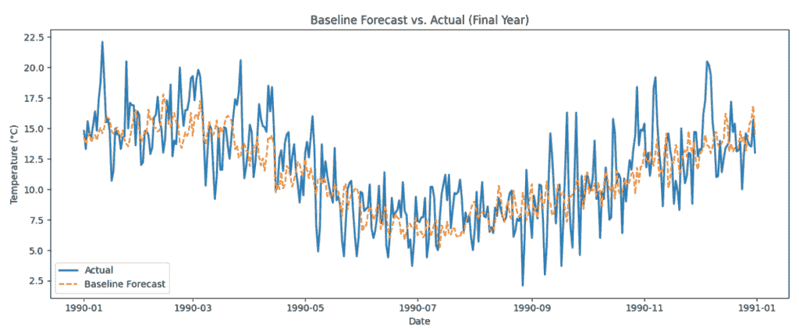

在上面的代码中，我们首先使用前 9 年作为训练集，最后一年作为测试集来分割数据。

然后，我们将`seasonal_decompose`应用于训练数据以提取趋势和季节性成分。

由于季节性模式每年都会重复，我们取了最后 365 个季节性值并将其应用于测试期。

对于趋势，我们假设它保持不变，并使用训练集中最后观察到的趋势值来覆盖测试年中的所有日期。

最后，我们将趋势和季节性成分添加到基线预测中，将其与测试集中的实际值进行比较，并使用平均绝对百分比误差（MAPE）评估模型。

我们使用基线模型得到了 21.21%的 MAPE（平均绝对百分比误差）。在第一部分，季节性简单方法给出了 28.23%，所以我们提高了大约 7%。

我们在这里构建的不是一个定制的基线模型——它是一个**基于标准分解的基线**。

现在我们来看看我们如何为这些温度数据制定自己的基线。

现在，让我们考虑按每天分组平均温度，并使用它们预测最后一年的温度。

你可能想知道我们最初是如何想出这个自定义基线的主意的。坦白说，这始于简单地查看数据。如果我们能发现一个模式，比如季节性趋势或随时间重复的东西，我们就可以围绕它建立一个简单的规则。

这正是自定义基线的本质——利用我们从数据中理解的内容来做出合理的预测。而且，通常，即使是小而直观的想法也能出奇地有效。

现在我们用 Python 计算一年中每一天的平均温度。

**代码：**

```py
# Create a new column 'day_of_year' representing which day (1 to 365) each date falls on
train["day_of_year"] = train.index.dayofyear
test["day_of_year"] = test.index.dayofyear

# Group the training data by 'day_of_year' and calculate the mean temperature for each day (averaged across all years)
daily_avg = train.groupby("day_of_year")["Temp"].mean()

# Use the learned seasonal pattern to forecast test data by mapping test days to the corresponding daily average
day_avg_forecast = test["day_of_year"].map(daily_avg)

# Evaluate the performance of this seasonal baseline forecast using Mean Absolute Percentage Error (MAPE)
mape_day_avg = mean_absolute_percentage_error(test["Temp"], day_avg_forecast)
round(mape_day_avg * 100, 2)
```

为了构建这个自定义基线，我们观察了温度在一年中每一天的典型行为，并在所有训练年份中取平均值。然后，我们使用这些日平均值对测试集进行预测。这是一种简单的方法来捕捉每年都倾向于重复的季节性模式。

这个自定义基线给我们带来了 21.17%的 MAPE，这显示了它如何很好地捕捉数据中的季节性趋势。

现在，让我们看看我们是否可以构建另一个自定义基线，它能更有效地捕捉数据中的模式，并作为一个更强的基准。

现在我们已经使用了日历年平均方法来构建我们的第一个自定义基线，你可能会想知道闰年会发生什么。如果我们简单地从 1 到 365 编号天数并取平均值，我们可能会被误导，尤其是在 2 月 29 日附近。

你可能想知道一个单独的日期是否真的重要。在时间序列分析中，每一刻都很重要。现在我们处理的是一个简单的数据集，所以可能感觉不那么重要，但在现实世界的情况下，像这样的小细节可能有很大的影响。许多行业都密切关注这些模式，甚至一天的差异都可能影响决策。这就是为什么我们从一个简单的数据集开始，帮助我们清楚地理解这些想法，然后再将它们应用到更复杂的问题上。

现在我们通过观察每年每个月每一天的温度通常是如何变化的，来构建一个基于日历日的自定义基线。

这是一种基于实际日历的季节节奏的简单捕捉方法。

**代码：**

```py
# Extract the 'month' and 'day' from the datetime index in both training and test sets
train["month"] = train.index.month
train["day"] = train.index.day
test["month"] = test.index.month
test["day"] = test.index.day

# Group the training data by each (month, day) pair and calculate the average temperature for each calendar day
calendar_day_avg = train.groupby(["month", "day"])["Temp"].mean()

# Forecast test values by mapping each test row's (month, day) to the average from training data
calendar_day_forecast = test.apply(
    lambda row: calendar_day_avg.get((row["month"], row["day"]), np.nan), axis=1
)

# Evaluate the forecast using Mean Absolute Percentage Error (MAPE)
mape_calendar_day = mean_absolute_percentage_error(test["Temp"], calendar_day_forecast)
```

使用这种方法，我们实现了 21.09%的 MAPE。

现在我们来看一下我们是否可以将两种方法结合起来，构建一个更精细的自定义基线。我们已经创建了一个基于日历的月日平均基线。这次我们将它与前一天的实际温度混合。预测值将基于日历日平均的 70%和前一天温度的 30%，从而创建一个更平衡和适应性强的预测。

```py
# Create a column with the previous day's temperature 
df["Prev_Temp"] = df["Temp"].shift(1)

# Add the previous day's temperature to the test set
test["Prev_Temp"] = df.loc[test.index, "Prev_Temp"]

# Create a blended forecast by combining calendar-day average and previous day's temperature
# 70% weight to seasonal calendar-day average, 30% to previous day temperature

blended_forecast = 0.7 * calendar_day_forecast.values + 0.3 * test["Prev_Temp"].values

# Handle missing values by replacing NaNs with the average of calendar-day forecasts
blended_forecast = np.nan_to_num(blended_forecast, nan=np.nanmean(calendar_day_forecast))

# Evaluate the forecast using MAPE
mape_blended = mean_absolute_percentage_error(test["Temp"], blended_forecast) 
```

我们可以称这个为混合自定义基线模型。使用这种方法，我们实现了 18.73%的 MAPE。

让我们花点时间总结一下到目前为止我们在这个数据集上应用了什么，用一个简单的表格来表示。

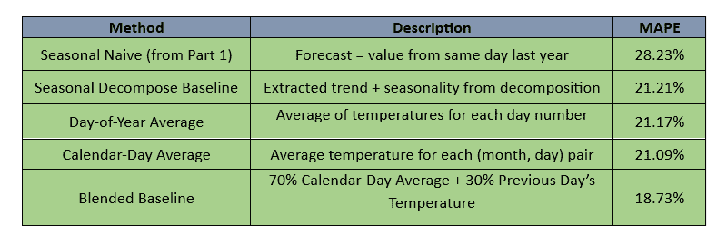

在第一部分，我们使用季节性天真法作为我们的基线。在本篇博客中，我们探讨了 Python 中的`seasonal_decompose`函数是如何工作的，并通过提取其趋势和季节性成分来构建基线模型。然后，我们基于年份的日数提出一个简单想法，创建了我们的第一个自定义基线，并通过使用日历日平均值对其进行改进。最后，我们通过结合日历平均值和前一天的温度，构建了一个混合自定义基线，这导致了更好的预测结果。

在本篇博客中，我们使用了一个简单的每日气温数据集来了解自定义基线模型是如何工作的。由于它是一个单变量数据集，它只包含一个时间列和一个目标变量。然而，现实世界的时间序列数据通常要复杂得多，通常是多变量的，具有多个影响因素。在我们探讨如何为这样的复杂数据集构建自定义基线之前，我们需要了解另一种重要的分解方法，即 STL 分解。我们还需要对单变量预测模型如 ARIMA 和 SARIMA 有一个稳固的理解。这些模型是基础，因为它们构成了理解和构建更高级的多变量时间序列模型的基础。

在第一部分，我提到我们将在本部分探讨 ARIMA 的基础。然而，由于我也在学习，并希望保持内容集中和易于理解，我无法将所有内容都放入一篇博客中。为了使学习过程更加顺畅，我们将一次探讨一个主题。

在第三部分，我们将探讨 STL 分解，并继续构建我们迄今为止所学的内容。

**数据集和许可**

本文使用的数据集——“墨尔本每日最低气温”可在[Kaggle](https://www.kaggle.com/datasets/samfaraday/daily-minimum-temperatures-in-me)找到，并遵循**社区数据许可协议 – 开放许可，版本 1.0 (CDLA-Permissive 1.0)**进行共享。

这是一个开放许可，允许在适当归属的情况下进行商业使用。您可以在[这里](https://cdla.dev/permissive-1-0/)阅读完整的许可协议。

希望您觉得这部分内容有用且易于理解。

感谢阅读，期待在第三部分再见！
