# 时间序列预测简单化（第 3.1 部分）：STL 分解

> 原文：[`towardsdatascience.com/time-series-forecasting-made-simple-part-3-1-stl-decomposition-understanding-initial-trend-and-seasonality-prior-to-loess-smoothing/`](https://towardsdatascience.com/time-series-forecasting-made-simple-part-3-1-stl-decomposition-understanding-initial-trend-and-seasonality-prior-to-loess-smoothing/)

<mdspan datatext="el1752023920619" class="mdspan-comment">在本系列的[前两部分](https://towardsdatascience.com/author/nikhil-dasari/)中，我们使用温度数据作为示例，探讨了趋势、季节性和残差。我们首先使用 Python 的`seasonal_decompose`方法揭示数据中的模式。接下来，我们使用标准基线模型（如季节性天真模型）进行了第一次温度预测。

从那里，我们进一步学习 `seasonal_decompose` 实际上是如何计算趋势、季节性和残差成分的。

我们提取了这些部分来构建基于分解的基线模型，然后针对我们的数据进行了定制基线的实验。

最后，我们使用平均绝对百分比误差（MAPE）评估每个模型，以查看我们的方法表现如何。

在前两部分中，我们处理了温度数据，这是一个相对简单的数据集，其中趋势和季节性都很明显，`seasonal_decompose`很好地捕捉了这些模式。

然而，在许多现实世界的数据集中，事情并不总是这么简单。趋势和季节性模式可能会改变或变得混乱，在这些情况下，`seasonal_decompose` 可能无法有效地捕捉到潜在的结构。

这里我们转向更高级的分解方法来更好地理解数据：**STL — 使用 LOESS 的季节性-趋势分解**。

**LOESS**代表**局部估计散点图平滑**。

为了更好地理解这一过程，我们将使用来自 FRED（联邦储备经济数据）的*[零售百货商店销售数据集](https://fred.stlouisfed.org/series/RSDSELD)*。

这就是数据看起来像什么：

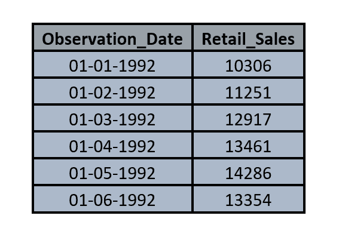

**FRED 的零售百货商店销售数据集样本。**

我们正在处理的数据集跟踪了美国百货商店的月度零售销售，并来自受信任的 FRED（联邦储备经济数据）来源。

它只有两列：

+   **`Observation_Date`** – 每个月的开始

+   **`Retail_Sales`** – 该月总销售额，以**百万美元**为单位

时间序列从**1992 年 1 月一直持续到 2025 年 3 月**，为我们提供了超过 30 年的销售数据来探索。

**注意：** 即使每个日期都标志着一个月的开始（例如 `01-01-1992`），销售额代表的是整个月的总销售额。

但在跳入 STL 之前，我们将对数据集运行经典的`seasonal_decompose`，并看看它告诉我们什么。

**代码：**

```py
import pandas as pd
import matplotlib.pyplot as plt
from statsmodels.tsa.seasonal import seasonal_decompose

# Load the dataset
df = pd.read_csv("C:/RSDSELDN.csv", parse_dates=['Observation_Date'], dayfirst=True)

# Set the date column as index
df.set_index('Observation_Date', inplace=True)

# Set monthly frequency
df = df.asfreq('MS')  # MS = Month Start

# Extract the series
series = df['Retail_Sales']

# Apply classical seasonal decomposition
result = seasonal_decompose(series, model='additive', period=12)

# Plot with custom colors
fig, axs = plt.subplots(4, 1, figsize=(12, 8), sharex=True)

axs[0].plot(result.observed, color='olive')
axs[0].set_title('Observed')

axs[1].plot(result.trend, color='darkslateblue')
axs[1].set_title('Trend')

axs[2].plot(result.seasonal, color='darkcyan')
axs[2].set_title('Seasonal')

axs[3].plot(result.resid, color='peru')
axs[3].set_title('Residual')

plt.suptitle('Classical Seasonal Decomposition (Additive)', fontsize=16)
plt.tight_layout()
plt.show() 
```

**图表：**

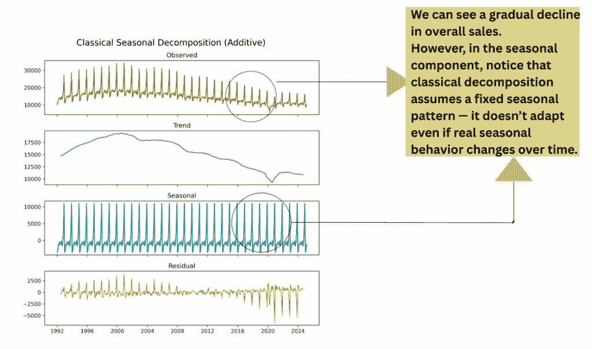

**月度零售销售的经典季节性分解（加法）。**

观察到的序列显示整体销售额逐渐下降。然而，季节性成分在时间上保持固定——这是经典分解的限制，它假设季节模式不会改变，即使现实世界的行为在演变。

在第二部分中，我们探讨了在假设固定、重复的季节结构的情况下，`seasonal_decompose`如何计算趋势和季节成分。

然而，现实世界的数据并不总是遵循固定的模式。趋势可能会逐渐变化，季节性行为也可能每年有所不同。这就是为什么我们需要一个更具适应性的方法，而 STL 分解正好提供了这样的方法。

我们将应用 STL 分解来观察它如何处理趋势和季节性的变化。

```py
import pandas as pd
import matplotlib.pyplot as plt
from statsmodels.tsa.seasonal import STL

# Load the dataset
df = pd.read_csv("C:/RSDSELDN.csv", parse_dates=['Observation_Date'], dayfirst=True)
df.set_index('Observation_Date', inplace=True)
df = df.asfreq('MS')  # Ensure monthly frequency

# Extract the time series
series = df['Retail_Sales']

# Apply STL decomposition
stl = STL(series, seasonal=13)
result = stl.fit()

# Plot and save STL components
fig, axs = plt.subplots(4, 1, figsize=(10, 8), sharex=True)

axs[0].plot(result.observed, color='sienna')
axs[0].set_title('Observed')

axs[1].plot(result.trend, color='goldenrod')
axs[1].set_title('Trend')

axs[2].plot(result.seasonal, color='darkslategrey')
axs[2].set_title('Seasonal')

axs[3].plot(result.resid, color='rebeccapurple')
axs[3].set_title('Residual')

plt.suptitle('STL Decomposition of Retail Sales', fontsize=16)
plt.tight_layout()

plt.show() 
```

**图：**

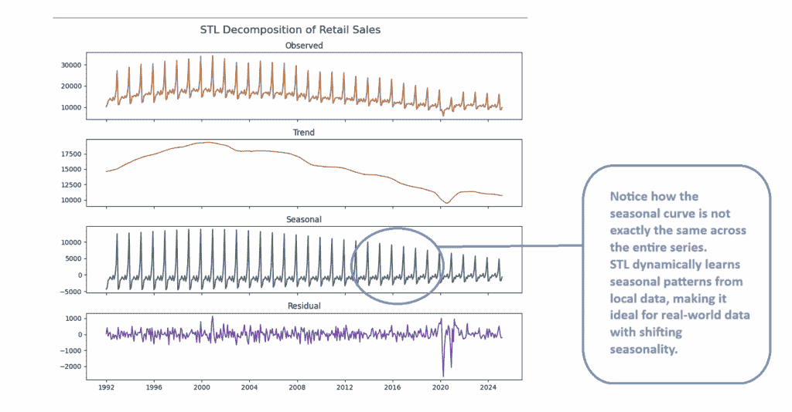

**零售销售数据的 STL 分解。**

与经典分解不同，STL 允许季节性成分随时间逐渐变化。这种灵活性使 STL 更适合于模式演变的现实世界数据，如自适应季节曲线和更干净的残差所示。

在完成这一步骤后，对 STL 的作用有了感觉，我们将深入了解它如何幕后确定趋势和季节性模式。

为了更好地理解 STL 分解的工作原理，我们将考虑一个从 2010 年 1 月到 2023 年 12 月的数据集样本。

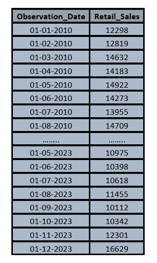

**表：用于演示 STL 分解的 2010 年 1 月至 2023 年 12 月月度零售销售数据样本。**

要了解 STL 分解如何作用于这些数据，我们首先需要粗略估计趋势和季节性。

由于 STL 是一种基于平滑的技术，它需要一个初始的想法，即应该平滑什么，例如趋势所在的位置以及季节性模式如何表现。

我们将首先可视化 2010 年 1 月至 2023 年 12 月的零售销售序列，并使用 Python 的 STL 例程提取其趋势、季节和剩余部分。

**代码：**

```py
import pandas as pd
import matplotlib.pyplot as plt
from statsmodels.tsa.seasonal import STL

# Load the dataset
df = pd.read_csv("C:/STL sample data.csv", parse_dates=['Observation_Date'], dayfirst=True)
df.set_index('Observation_Date', inplace=True)
df = df.asfreq('MS')  # Ensure monthly frequency

# Extract the time series
series = df['Retail_Sales']

# Apply STL decomposition
stl = STL(series, seasonal=13)
result = stl.fit()

# Plot and save STL components
fig, axs = plt.subplots(4, 1, figsize=(10, 8), sharex=True)

axs[0].plot(result.observed, color='sienna')
axs[0].set_title('Observed')

axs[1].plot(result.trend, color='goldenrod')
axs[1].set_title('Trend')

axs[2].plot(result.seasonal, color='darkslategrey')
axs[2].set_title('Seasonal')

axs[3].plot(result.resid, color='rebeccapurple')
axs[3].set_title('Residual')

plt.suptitle('STL Decomposition of Retail Sales(2010-2023)', fontsize=16)
plt.tight_layout()
plt.show() 
```

**图：**

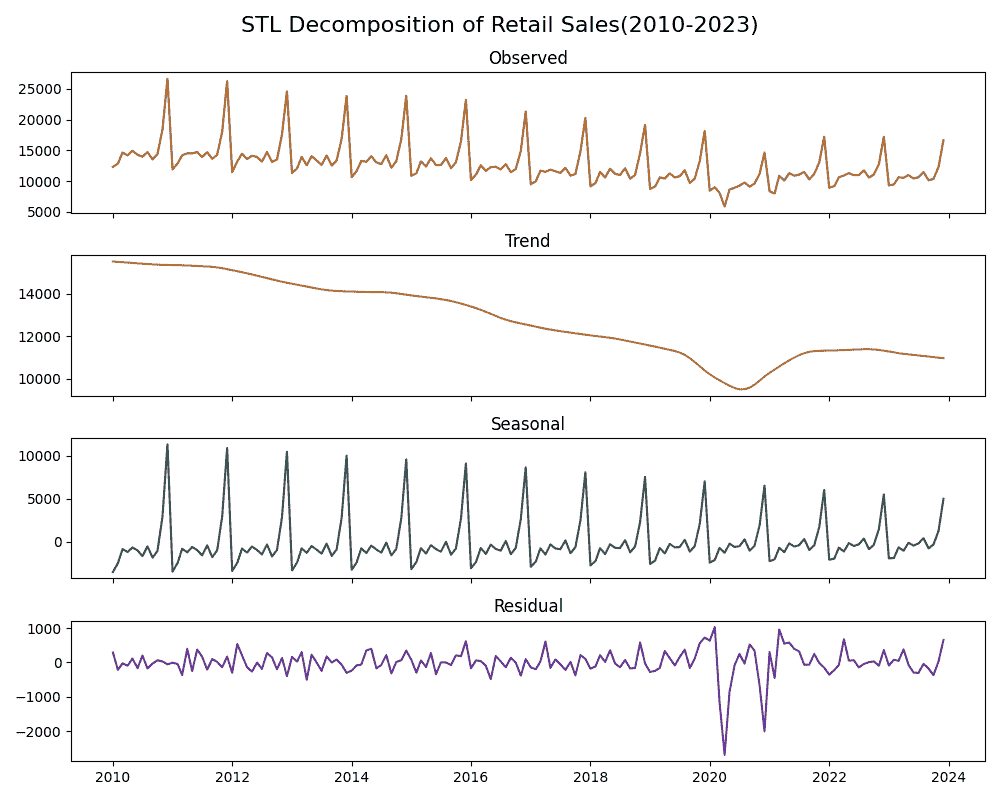

**2010 年至 2023 年的零售销售 STL 分解**

要了解 STL 如何推导其成分，我们首先使用中心移动平均估计数据的长期趋势。

我们将使用一个单月示例来演示如何计算中心移动平均。

我们将计算 2010 年 7 月的中心移动平均。

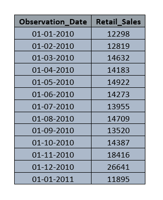

**2010 年 1 月至 2011 年 1 月的月度零售销售**

由于我们的数据是按月度收集的，自然周期覆盖了十二个点，这是一个偶数。从 2010 年 1 月到 2010 年 12 月的平均值落在 6 月和 7 月之间。

为了调整这一点，我们形成一个从 2010 年 2 月到 2011 年 1 月的第二个窗口，其十二个月的平均值位于 7 月和 8 月之间。

然后，我们计算每个窗口的简单平均值，并平均这两个结果。

在第一个窗口中，七月是十二个点中的第七个，所以平均值落在第六个月和第七个月之间。

在第二个窗口中，七月是十二个点中的第六个，所以它的平均值也落在第六个月和第七个月之间，但向前移动了。

将这两个估计值平均后，结果会回到 2010 年 7 月本身，从而得到该月的真实中心移动平均。

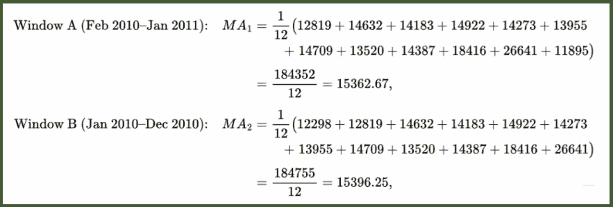

**计算 2010 年 7 月的两个 12 个月平均数**

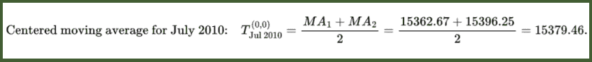

**将移动平均中心化在 2010 年 7 月**

这就是我们如何使用中心移动平均来计算初始趋势。

在序列的非常开始和结束处，我们两边都没有六个月的时间来进行平均——所以对于 2010 年 1 月至 6 月或 2023 年 7 月至 12 月来说，没有“自然”的中心化移动平均。

而不是删除这些点，我们将第一个真实的 2010 年 7 月值向前推移以填补 1 月至 6 月，并将我们最后的有效 2023 年 12 月值向前推移以填补 2023 年 7 月至 12 月。

这样，在继续进行 LOESS 细化之前，每个月都有一个基线趋势。

接下来，我们将使用 Python 计算每个月的初始趋势。

**代码：**

```py
import pandas as pd

# Load and prepare the data
df = pd.read_csv("C:/STL sample data for part 3.csv",
                 parse_dates=["Observation_Date"], dayfirst=True,
                 index_col="Observation_Date")
df = df.asfreq("MS")  # ensure a continuous monthly index

# Extract the series
sales = df["Retail_Sales"]

# Compute the two 12-month moving averages
n = 12
ma1 = sales.rolling(window=n, center=False).mean().shift(-n//2 + 1)
ma2 = sales.rolling(window=n, center=False).mean().shift(-n//2)

# Center them by averaging
T0 = (ma1 + ma2) / 2

# Fill the edges so every month has a value
T0 = T0.fillna(method="bfill").fillna(method="ffill")

# Attach to the DataFrame
df["Initial_Trend"] = T0
```

**表：**

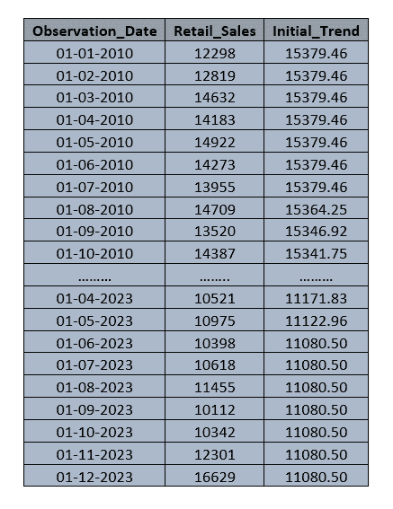

**表：带有初始中心移动平均趋势的零售销售额**

* * *

我们已经使用中心移动平均提取了初始趋势，让我们看看它实际上看起来是什么样子。

我们将把它与原始时间序列和 STL 的最终趋势线一起绘制出来，以比较每个如何捕捉数据的整体运动。

**图：**

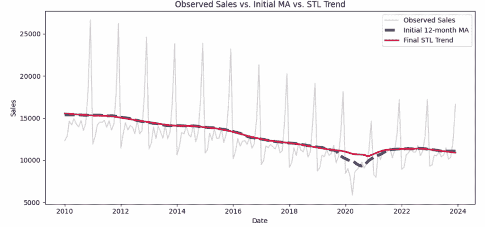

**实际销售额与初始 12 个月移动平均趋势与最终 STL 趋势的比较**

从图中可以看出，移动平均趋势线在大多数年份几乎与 STL 趋势线重叠。

但在 2020 年 1 月至 2 月左右，移动平均线出现急剧下降。这次下降是由于 COVID 对销售的突然影响。

STL 处理得更好，它不将其视为长期趋势变化，而是将其标记为残差。

这是因为 STL 将其视为一次性的意外事件，而不是重复的季节性模式或整体趋势的变化。

要了解 STL 是如何做到这一点以及它如何处理变化的季节性，让我们一步一步地继续构建我们的理解。

我们现在有了使用移动平均得到的初始趋势，所以让我们继续 STL 过程的下一步。

* * *

接下来，我们从原始销售额中减去我们的中心化趋势，以获得去趋势序列。

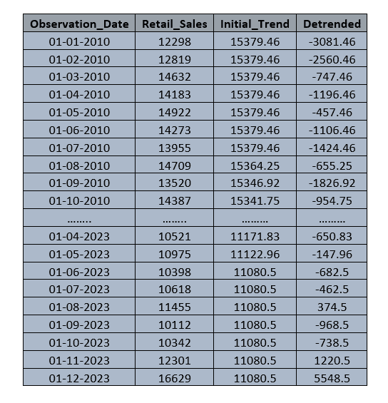

**表：实际销售额，初始 MA 趋势和去趋势值**

* * *

我们已经从数据中移除了长期趋势，所以剩下的序列只显示了重复的季节性波动和随机噪声。

让我们绘制出来，看看规律性的上升和下降以及任何意外的波动或下降。

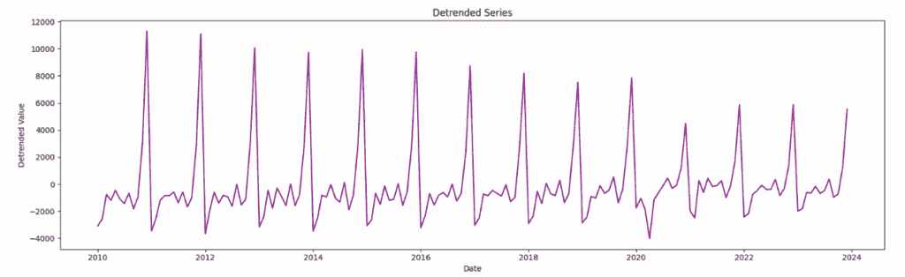

**去除趋势的序列显示季节性模式和随机波动/下降**

上面的图表显示了我们在去除长期趋势后剩下的内容。你可以看到熟悉的年度起伏，以及 2020 年 1 月 COVID 疫情爆发时的深度下降。

当我们将包括 2020 年崩溃在内的所有 1 月份的值平均在一起时，那个单一事件就会融入其中，几乎不影响 1 月份的平均值。

这有助于我们忽略罕见的冲击，并专注于真正的季节性模式。现在我们将去趋势值按月份分组并取平均值，以创建我们的第一个季节性估计。

这为我们提供了一个稳定的季节性估计，STL 将在后续迭代中对其进行细化和平滑，以捕捉任何随时间逐渐的变化。

* * *

接下来，我们将重复我们的季节分解方法：我们将按日历月份对去趋势值进行分组，以提取原始的月度季节性偏移量。

让我们专注于 1 月，并收集该月的所有去趋势值。

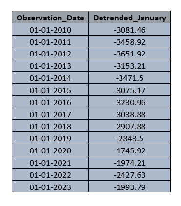

**表: 去趋势的 1 月值（2010–2023）**

现在，我们计算所有年份 1 月去趋势值的**平均值**，以获得该月的粗略季节性估计。

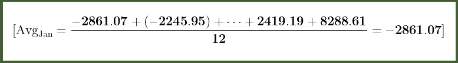

**通过计算 12 年来 1 月去趋势值的平均值以获得 1 月的季节性估计。**

这个过程会重复进行所有 12 个月，以形成初始的季节性成分。

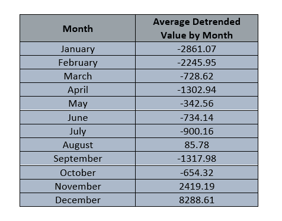

**表:** 每月去趋势值的平均值，形成每个月的季节性估计。

现在我们有了每个月的平均去趋势值，我们将它们映射到整个时间序列中，以构建初始的季节性成分。

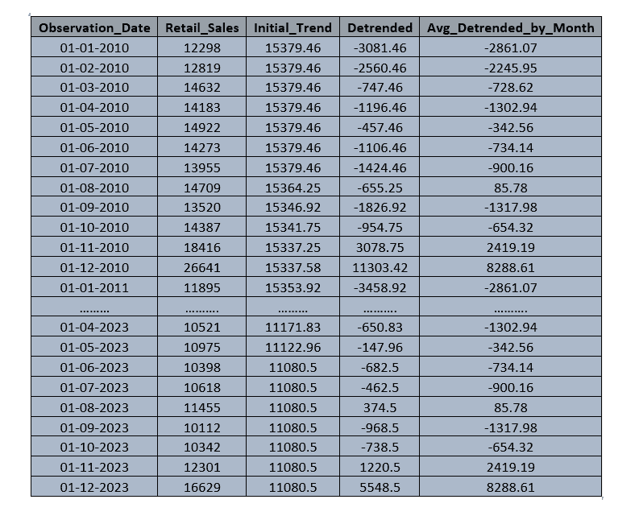

**表:** 用于估计季节性模式的去趋势值及其月度平均值。**

* * *

在按月份对去趋势值进行分组并计算它们的平均值后，我们得到了一个新的月度平均值序列。让我们绘制这个序列，以观察应用此平均步骤后的数据看起来如何。

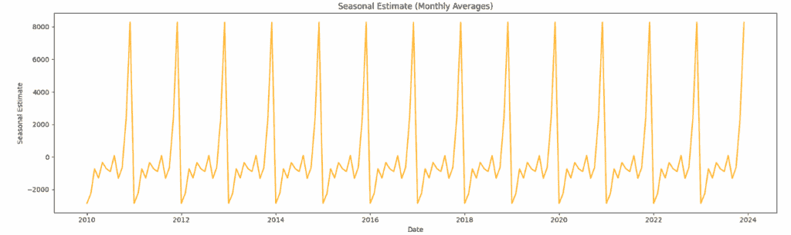

**通过重复每月平均值进行季节性估计。**

在上面的图表中，我们按月份对去趋势值进行了分组，并对每个值取了平均值。

这有助于我们减少 2020 年 1 月那次大幅下降的影响，这可能是由于 COVID 大流行。

通过将所有 1 月份的值平均在一起，那次突然的下降与其它值混合在一起，给我们提供了一个更稳定的关于每年 1 月份通常如何表现的画面。

然而，如果我们仔细观察，我们仍然可以在线上看到一些突然的峰值和谷值。

这些可能是由像特别促销、罢工或每年不发生的意外假期这样的因素引起的。

由于季节性旨在捕捉每年定期重复的模式，我们不希望这些不规则事件留在季节性曲线上。

但我们如何知道那些峰值或谷值只是一次性事件，而不是真正的季节性模式？这取决于它们发生的频率。

12 月份出现了一个大的峰值，因为每年的 12 月都有高销售额，所以 12 月的平均值年复一年地保持较高。

我们看到 3 月份有所上升，但这主要是因为一两年特别强劲。

3 月份的平均值并没有真正发生很大变化。当一个模式几乎每年都在同一个月出现，那就是季节性。如果它只发生一次或两次，那可能只是一个不规则事件。

为了处理这个问题，我们使用低通滤波器。虽然平均可以帮助我们得到季节性的大致概念，但低通滤波器更进一步。

它平滑了剩余的小峰值和低谷，这样我们就留下了一个干净的季节性模式，反映了年度的一般节奏。

然后，这个平滑的季节性曲线将被用于 STL 过程的下一步。

* * *

接下来，我们将通过在我们的月平均系列中的每个点运行低通滤波器来平滑粗糙的季节性曲线。

要应用低通滤波器，我们首先计算一个中心化的 13 个月移动平均。

例如，考虑 2010 年 9 月。这个点的 13 个月平均值（从 2010 年 3 月到 2011 年 3 月）将是：

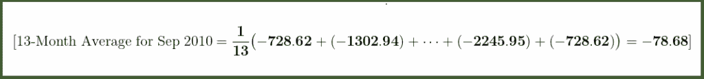

**2010 年 9 月使用周围月度季节性值的 13 个月平均示例。**

我们对月平均系列中的每个点重复进行 13 个月的平均计算。因为模式每年都会重复，所以 2010 年 9 月的值将与 2011 年 9 月的值相同。

对于前六个月和最后六个月，我们没有足够的数据进行完整的 13 个月平均，所以我们只使用围绕它们的可用月份。

让我们看看在无法进行完整的 13 个月平均的月份中使用的平均窗口。

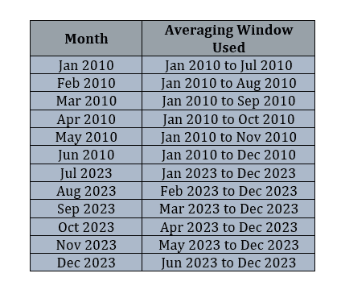

**表格：** **用于第一个和最后六个月，其中无法进行完整的 13 个月平均。**

现在我们将使用 Python 来计算 13 个月的平均值

**代码：**

```py
import pandas as pd

# Load the seasonal estimate series
df = pd.read_csv("C:/stl_with_monthly_avg.csv", parse_dates=['Observation_Date'], dayfirst=True)

# Apply 13-month centered moving average on the Avg_Detrended_by_Month column
# Handle the first and last 6 values with partial windows
seasonal_estimate = df[['Observation_Date', 'Avg_Detrended_by_Month']].copy()
lpf_values = []

for i in range(len(seasonal_estimate)):
    start = max(0, i - 6)
    end = min(len(seasonal_estimate), i + 7)  # non-inclusive
    window_avg = seasonal_estimate['Avg_Detrended_by_Month'].iloc[start:end].mean()
    lpf_values.append(window_avg)

# Add the result to DataFrame
seasonal_estimate['LPF_13_Month'] = lpf_values
```

使用此代码，我们得到整个时间序列的 13 个月移动平均。

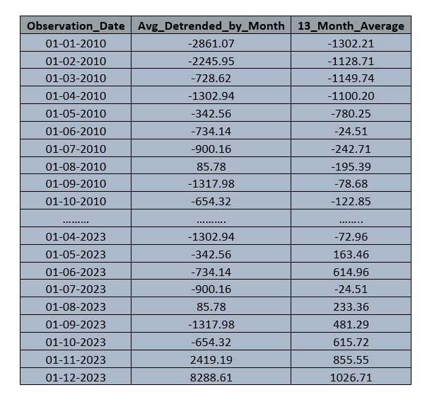

**表格：** **每月去趋势值及其平滑的 13 个月平均值。**

完成通过计算 13 个月平均值来应用低通滤波器的第一步后，下一步是使用 3 点移动平均进一步平滑这些结果。

现在，让我们看看 2010 年 9 月 3 点平均是如何计算的。

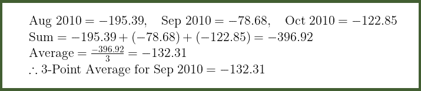

**作为低通滤波过程一部分的 2010 年 9 月 3 点移动平均的逐步计算。**

对于 2010 年 1 月，我们使用 1 月和 2 月的值来计算平均值，对于 2023 年 12 月，我们使用 12 月和 11 月的值。

这种方法用于端点，在这些端点处无法获得完整的 3 个月窗口。这样，我们计算系列中每个数据点的 3 点移动平均。

现在，我们再次使用 Python 来计算我们数据中的 3 个月窗口平均值。

**代码：**

```py
import pandas as pd

# Load CSV file
df = pd.read_csv("C:/seasonal_13month_avg3.csv", parse_dates=['Observation_Date'], dayfirst=True)

# Calculate the 3-point moving average
lpf_values = df['LPF_13_Month'].values
moving_avg_3 = []

for i in range(len(lpf_values)):
    if i == 0:
        avg = (lpf_values[i] + lpf_values[i + 1]) / 2
    elif i == len(lpf_values) - 1:
        avg = (lpf_values[i - 1] + lpf_values[i]) / 2
    else:
        avg = (lpf_values[i - 1] + lpf_values[i] + lpf_values[i + 1]) / 3
    moving_avg_3.append(avg)

# Add the result to a new column
df['LPF_13_3'] = moving_avg_3
```

使用上面的代码，我们得到 3 个月的移动平均值。

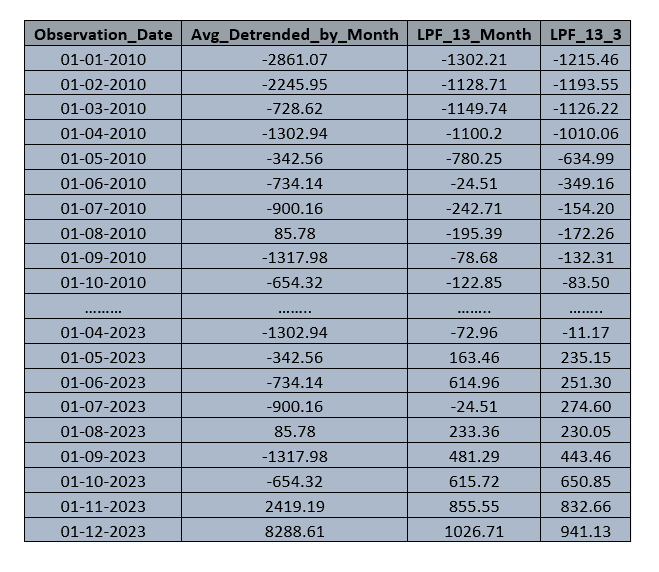

**表：应用低通滤波的第二步：在 13 个月平滑值上应用 3 个月平均值。**

我们已经在 13 个月平滑值上计算了 3 个月的平均值。接下来，我们将应用另一个 3 个月移动平均以进一步细化序列。

**代码：**

```py
import pandas as pd

# Load the dataset
df = pd.read_csv("C:/5seasonal_lpf_13_3_1.csv")

# Apply 3-month moving average on the existing LPF_13_3 column
lpf_column = 'LPF_13_3'
smoothed_column = 'LPF_13_3_3'

smoothed_values = []
for i in range(len(df)):
    if i == 0:
        avg = df[lpf_column].iloc[i:i+2].mean()
    elif i == len(df) - 1:
        avg = df[lpf_column].iloc[i-1:i+1].mean()
    else:
        avg = df[lpf_column].iloc[i-1:i+2].mean()
    smoothed_values.append(avg)

# Add the new smoothed column to the DataFrame
df[smoothed_column] = smoothed_values
```

从上面的代码中，我们现在再次计算了 3 个月的平均值。

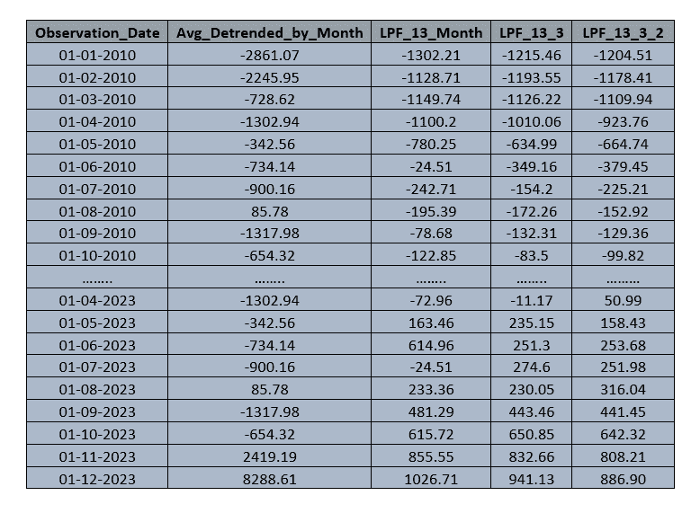

**表：低通滤波的最终步骤：对先前平滑的值应用第二个 3 个月移动平均，以减少噪声并稳定季节性模式。**

在完成所有三个级别的平滑后，下一步是在每个点计算加权平均以获得最终的低通滤波季节曲线。

这就像取平均值，但更智能。我们使用三个季节性模式的版本，每个版本都平滑到不同的水平。

我们创建了三个季节性模式的平滑版本，每个版本都比上一个更平滑。

第一个是简单的 13 个月移动平均，它应用了轻微的平滑。

第二步将这个结果与 3 个月移动平均相结合，使其更加平滑。

第三步重复这一步骤，结果得到最稳定的版本。由于第三个版本最可靠，我们给予它最大的权重。

第一个版本仍然贡献了一点点，第二个则起到了适度的作用。

通过将它们与权重 1、3 和 9 相结合，我们计算出一个加权平均，它给出了最终的季节性估计。

这个结果平滑且稳定，同时足够灵活以跟随数据中的真实变化。

这就是我们在每个点计算加权平均的方法。

例如，让我们以 2010 年 9 月为例。

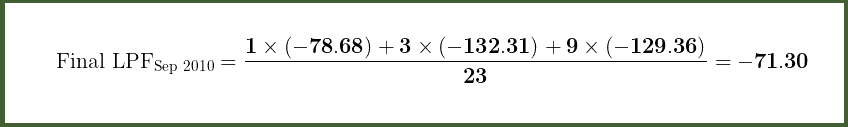

**使用加权平滑计算 2010 年 9 月的最终 LPF。三个平滑值使用权重 1、3 和 9 相结合，然后平均得到最终的季节性估计。**

我们将数值除以 23 以应用额外的收缩因子，并确保加权平均保持在同一尺度。

**代码：**

```py
import pandas as pd

# Load the dataset
df = pd.read_csv("C:/7seasonal_lpf_13_3_2.csv")

# Calculate the weighted average using 1:3:9 across LPF_13_Month, LPF_13_3, and LPF_13_3_2
df["Final_LPF"] = (
    1 * df["LPF_13_Month"] +
    3 * df["LPF_13_3"] +
    9 * df["LPF_13_3_2"]
) / 23
```

通过使用上面的代码，我们在序列中的每个点计算加权平均。

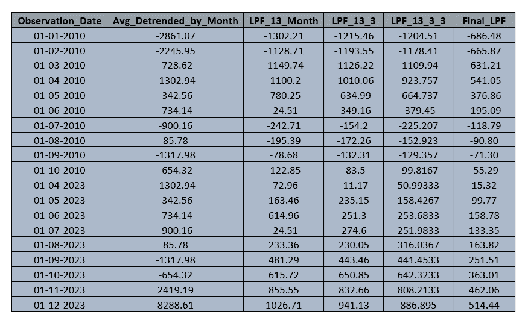

**表：每个时间点的最终 LPF 值，使用 1:3:9 权重进行加权平滑计算。最后一列显示了从三个低通滤波级别推导出的最终季节性估计值。**

这些最终的平滑值代表了数据中的季节性模式。它们突出了重复的月度波动，消除了随机噪声或异常值，并提供了对随时间变化的潜在季节性节奏的更清晰视图。

* * *

在进行下一步之前，理解为什么我们使用 13 个月的平均值，随后进行两轮 3 个月的平均作为低通滤波过程的一部分是很重要的。

首先，我们通过按月份分组计算去趋势值的平均值，这给了我们一个关于季节性模式的大致了解。

但如我们之前看到的，这个模式仍然有一些随机的峰值和低谷。由于我们处理的是月度数据，使用 12 个月平均值似乎是有道理的。

但 STL 实际上使用的是 13 个月平均值。这是因为 12 是一个偶数，所以平均值没有集中在一个月上——它位于两个月之间。这可能会稍微改变模式。

使用 13，一个奇数，可以使平滑中心对准每个月。这有助于我们平滑噪声，同时保持真实的季节性模式。

让我们看看图表是如何帮助 13 个月平均值转换序列的。

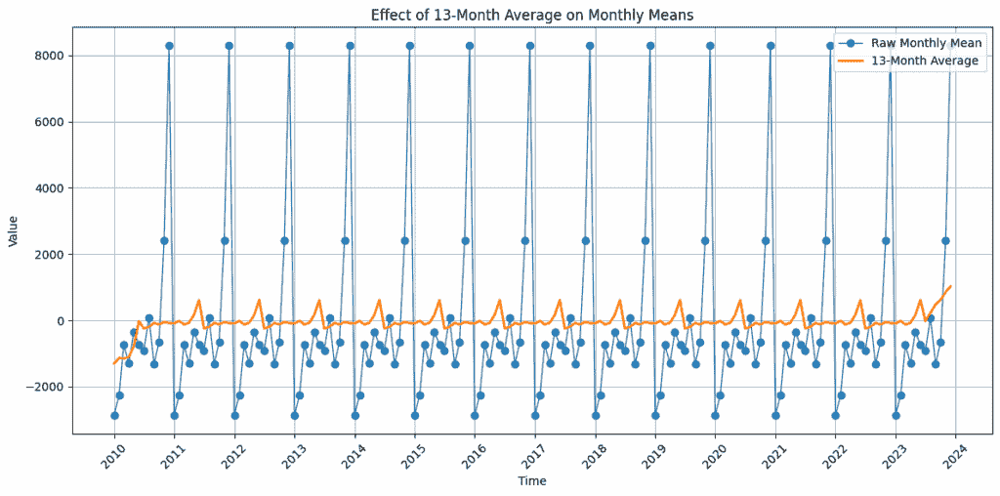

**使用 13 个月移动平均平滑月度平均值**

橙线代表 13 个月平均值，它平滑了原始月度平均值（蓝色）中看到的尖锐波动，通过过滤随机噪声，帮助暴露出更清晰和一致的季节性模式。

* * *

你可能会注意到橙色线上的峰值不再与蓝色线上的峰值完全对齐。

例如，之前在 12 月份出现的高峰现在可能会稍微提前或推迟出现。

这是因为 13 个月的平均值考虑了周围值，这可能会使曲线稍微偏向一侧。

这种偏移是移动平均的正常效应。为了解决这个问题，下一步是进行中心化。

我们按日历月份分组平滑值，将所有 1 月份的值放在一起，依此类推，然后取平均值。

这将季节性模式与正确的月份对齐，因此它反映了数据中季节性的真实时间。

* * *

在用 13 个月平均值平滑模式后，曲线看起来干净多了，但它仍然可能有小的峰值和低谷。为了使其更加平滑，我们使用 3 个月平均值。

但为什么是**3**个月而不是更大的 5 或 6 个月呢？3 个月的窗口效果很好，因为它可以平滑曲线，而不会使曲线过于平坦。如果我们使用更大的窗口，我们可能会失去季节性的自然形状。

使用 3 个月的小窗口，并应用两次，可以在清除噪声和保持真实模式之间达到良好的平衡。

现在我们来看看图表上的样子。

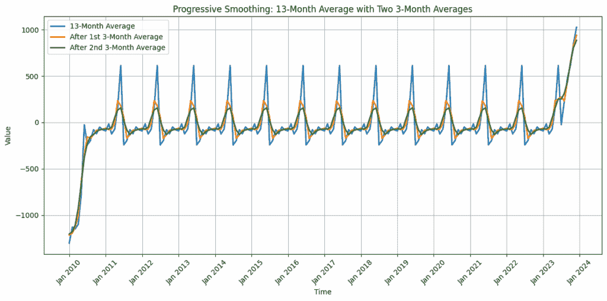

**季节性模式的渐进平滑——从 13 个月平均值开始，应用两个 3 个月平均值进行细化**

这个图显示了我们的粗略季节性估计是如何逐步变得平滑的。

蓝线是 13 个月平均的结果，它已经平滑了许多随机峰值。

然后我们应用一次 3 个月平均值（橙色线）和再次（绿色线）。每一步都会使曲线更加平滑，特别是去除微小的凸起和锯齿状噪声。

最后，我们得到一个干净的季节性形状，它仍然遵循重复的模式，但更加稳定，并且对于预测来说更容易处理。

我们现在有三个季节性模式的版本：一个稍微粗糙，一个中等平滑，一个非常平滑。看起来我们完全可以简单地选择最平滑的那个并继续前进。

最后，季节性每年都会重复，所以最干净的曲线应该足够了。但在现实世界的数据中，季节性行为很少那么完美。

在某些年份，12 月份的峰值可能会出现得早一些，或者它们的大小可能会根据其他因素而变化。

粗糙版本捕捉了这些小的变化，但它也携带噪声。最平滑的一个移除了噪声，但可能会错过那些细微的变化。

那就是为什么 STL 混合了所有三个。它给最平滑的版本更多的权重，因为它是最稳定的，但它也保留了一些来自中等和粗糙版本的影响，以保持灵活性。

这样，最终的季节性曲线既干净又可靠，同时仍然对自然变化有反应。因此，我们在后续步骤中提取的趋势保持真实，不会吸收剩余的季节性影响。

我们在混合三个季节曲线时使用 1、3 和 9 的权重，因为每个版本都给我们提供了不同的视角。

粗糙版本捕捉小的变化和短期变化，但也包括大量的噪声。中等版本平衡了细节和稳定性，而最平滑的版本提供了一个干净、稳定的季节性形状，我们最可以信赖。

正因如此，我们给最平滑的那个最高的权重。这些特定的权重在原始 STL 论文中被推荐，因为它们在大多数实际案例中都表现良好。

我们可能会想知道为什么不使用像 1、4 和 16 这样的数字。虽然那会给最平滑的曲线更多的重视，但它也可能使季节性模式过于僵化，对时间或强度的自然变化或强度变化反应不足。

生活中的季节性并不总是完美的。通常在 12 月份发生的峰值在某些年份可能会提前出现。

1、3、9 的组合帮助我们保持灵活性，同时仍然保持事物的平滑性。

使用 1、3 和 9 的权重混合三个季节曲线后，我们可能会期望将结果除以 13，即权重的总和，就像在常规加权平均中那样。

但在这里我们将其除以 23（13+10）。这个缩放因子会温和地缩小季节性值，尤其是在序列的边缘，那里的估计往往不太稳定。

它还有助于保持季节性模式合理缩放，因此不会压倒趋势或扭曲时间序列的整体结构。

结果是一个平滑、自适应的季节曲线，不会干扰趋势。

现在，让我们绘制通过计算加权平均值获得的最终低通滤波值。

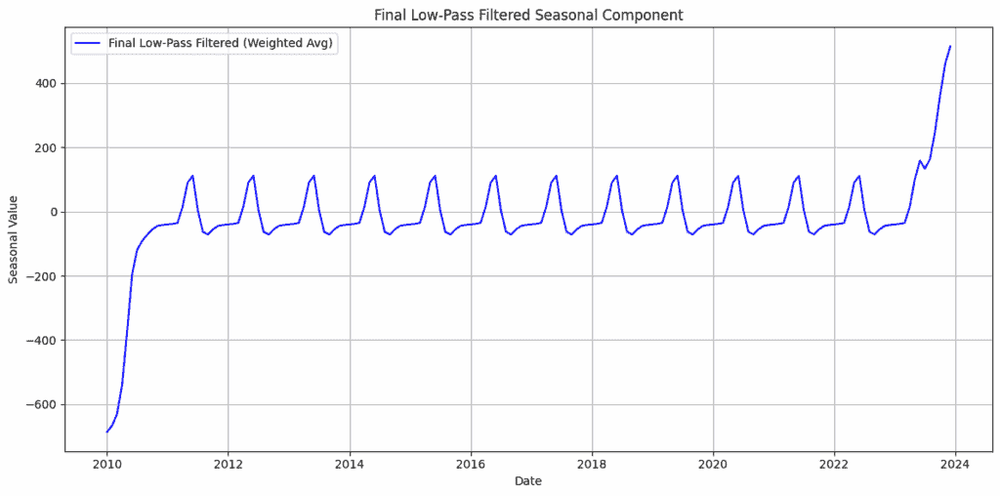

****最终低通滤波季节性成分****

此图展示了通过使用权重 1、3 和 9 混合三个平滑版本后得到的最终季节性模式。

结果保持了重复的月度模式清晰，同时减少了随机峰值。现在它已经准备好进行中心化并从数据中减去以找到趋势。

* * *

最终的低通滤波季节性成分已经准备好。下一步是将其中心化以确保季节性效应在每个周期内平均为零。

我们通过使它们的平均值（均值）为零来中心化季节性值。这很重要，因为季节性部分应仅显示重复模式，如每年规律性的上升和下降，而不应有任何整体增加或减少。

如果平均值不为零，季节性部分可能会错误地包含趋势的一部分。通过将平均值设为零，我们确保趋势显示了长期运动，而季节性部分仅显示重复的变化。

为了进行中心化，我们首先按月份将最终的低通滤波季节性成分分组，然后计算平均值。

计算平均值后，我们从实际最终低通滤波值中减去它。这给我们提供了中心化季节性成分，完成了中心化步骤。

让我们一步步了解如何对一个单一数据点进行中心化。

对于 2010 年 9 月

最终 LPF 值（2010 年 9 月）= −71.30

所有九月 LPF 值的月平均 = −48.24

中心化季节性值 = 最终 LPF – 月平均值

= −71.30−(−48.24) = −23.06

以这种方式，我们计算系列中每个数据点的中心化季节性成分。

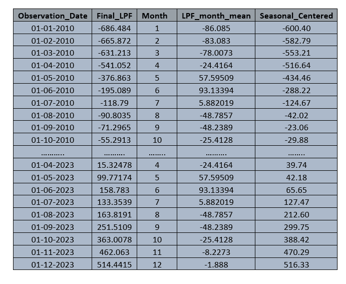

**表：中心化最终低通滤波季节性值**

现在，我们将绘制这些值以查看中心化季节性曲线的形状。

**图：**

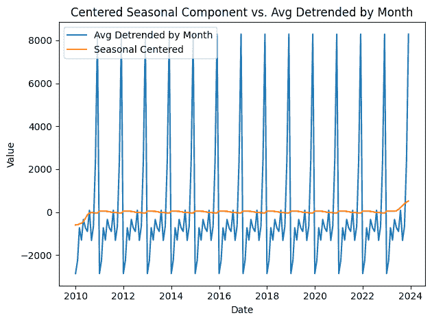

**中心化季节性成分与月度去趋势平均值**

上图比较了经过低通滤波和中心化后得到的**去趋势值的月平均值**（蓝色线）与**中心化季节性成分**（橙色线）。

我们可以观察到橙色曲线要平滑得多，干净得多，捕捉到了**重复的季节性模式**，没有任何长期漂移。

这是因为我们已经通过减去月平均值来中心化季节性成分，确保其在每个周期内的平均值为零。

重要的是，我们还可以看到季节性模式中的**尖峰现在与它们原始的位置对齐**。

橙色线中的峰值和谷值与蓝色尖峰的时间相匹配，表明季节性效应已被正确估计并重新与数据对齐。

* * *

在这部分，我们讨论了如何在 STL 过程中计算初始趋势和季节性。

这些初始成分至关重要，因为 STL 是一种基于平滑的分解方法，它需要一个结构化的起点才能有效工作。

没有趋势和季节性的初始估计，直接将 LOESS 应用于原始数据可能会导致噪声和残差的平滑，甚至拟合随机波动模式。这会导致不可靠或误导性的成分。

因此，我们首先使用移动平均提取一个粗略的趋势，然后使用低通滤波器隔离季节性。

这些为 STL 提供了一个合理的近似值，以便开始其迭代细化过程，我们将在**下一部分**中探讨。

在**下一部分**中，我们首先使用中心季节成分对原始序列进行**去季节化**，然后对去季节化数据应用**LOESS 平滑**以获得更新的趋势。

这标志着 STL 中**迭代细化过程**的起点。

**注意：除非另有说明，所有图像均由作者提供。**

**数据集：**本博客使用来自 FRED（联邦储备经济数据）的公开数据。该系列 *Advance Retail Sales: Department Stores (RSDSELD)* 由美国人口普查局发布，可用于分析和发表，前提是适当的引用。

官方引用：

美国人口普查局，*Advance Retail Sales: Department Stores* [RSDSELD]，从 FRED（圣路易斯联邦储备银行）检索，[`fred.stlouisfed.org/series/RSDSELD`](https://fred.stlouisfed.org/series/RSDSELD)，2025 年 7 月 7 日。

**感谢阅读！**
